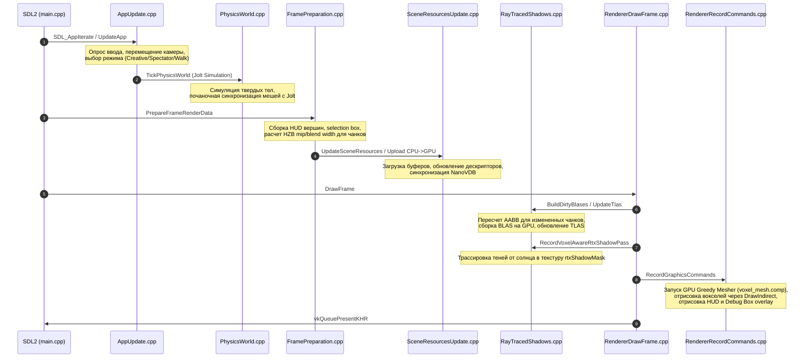

# ProjectV Codebase & Architecture Guide (Exhaustive Edition)

Добро пожаловать в исчерпывающий путеводитель по кодовой базе **ProjectV**! Этот документ создан для того, чтобы помочь вам детально разобраться в архитектуре, принципах работы и каждом исходном файле проекта. После фаз активного прототипирования ("вайбкодинга") здесь собрана полная карта кодовой базы без сокращений.

---

## 1. Общая архитектура движка

ProjectV — это высокопроизводительный интерактивный воксельный MVP-слайс, сочетающий в себе объектно-ориентированную оркестрацию на CPU, ориентированное на данные представление (DOD) воксельного мира и GPU-driven конвейер рендеринга с аппаратной трассировкой лучей (RTX KHR).

### Взаимодействие компонентов движка

```mermaid
graph TD
    subgraph Core
        AppState[AppState / Types.hpp] --> World[WorldState]
        AppState --> Render[RenderState]
        AppState --> Physics[PhysicsState]
        AppState --> ECS[EcsState]
    end

    subgraph Simulation Loop (60 Hz)
        AppUpdate[AppUpdate.cpp] --> PhysicsWorld[PhysicsWorld.cpp]
        AppUpdate --> Character[CharacterVirtual / PhysicsWorld_Walk.cpp]
        AppUpdate --> VoxelInt[VoxelInteraction.cpp]
        AppUpdate --> ModelGG[ModelGravigun.cpp]
    end

    subgraph Render Pipeline (Frame Draw)
        DrawFrame[RendererDrawFrame.cpp] --> Mesher[voxel_mesh.comp / VulkanVoxelMeshingPipeline.cpp]
        DrawFrame --> RTX[RayTracedShadows.cpp / rtxShadowMask]
        DrawFrame --> DDGI[RtxGiProbes.cpp / probe_update.comp]
        DrawFrame --> HZB[HizCulling.cpp / HizBuffer]
        DrawFrame --> Graphics[RendererRecordCommands.cpp / sceneColorTarget]
    end

    World -->|Voxel World State| PhysicsWorld
    World -->|Sparse64Tree| Mesher
    World -->|NanoVDB Buffer| DDGI
    PhysicsWorld -->|Physics Colliders| Character
    RTX -->|Shadow Mask| Graphics
    DDGI -->|Indirect GI| Graphics
    HZB -->|Visible Chunk Bitmask| Graphics
```

---

## 2. Анатомия кадра (Frame Walkthrough)

Выполнение одного кадра симуляции и отрисовки — от опроса клавиатуры до вывода пикселей на монитор:



---

## 3. Детальный разбор модулей и файлов

Ниже представлена полная структура файлов в папке [src](file:///home/le1t/Projects/ProjectV/src), сгруппированных по 8 логическим модулям.

### 📂 1. Core (Ядро и Глобальное Состояние)
Файлы ядра определяют структуры данных, общие для всех систем.

*   [Types.hpp](file:///home/le1t/Projects/ProjectV/src/core/Types.hpp) / [Types.cpp](file:///home/le1t/Projects/ProjectV/src/core/Types.cpp) *(Hard · ~940 строк)*
    *   **Роль:** Главный словарь проекта. Содержит структуры `AppState` (корневой контейнер), `RenderState`, `SimulationState`, `InputState` и `VoxelSceneLighting`.
    *   **Связи:** Связывает все модули. В конце `Types.cpp` расположены жесткие `static_assert` на смещения байтов в структурах, отправляемых на GPU в виде SSBO.
*   [Math.ixx](file:///home/le1t/Projects/ProjectV/src/core/Math.ixx) *(Easy · ~120 строк)*
    *   **Роль:** C++26 модуль, экспортирующий типы векторов `Vec3`, `Vec4` и матриц `Mat4` для устранения зависимости от внешних тяжелых математических библиотек в заголовках.
*   [StringId.ixx](file:///home/le1t/Projects/ProjectV/src/core/StringId.ixx) *(Easy · ~80 строк)*
    *   **Роль:** C++26 модуль для быстрой работы с хэшированными строками (`StringID`). Позволяет делать сравнения строк на равенство за O(1).
*   [Probe.ixx](file:///home/le1t/Projects/ProjectV/src/core/Probe.ixx) *(Easy · ~50 строк)*
    *   **Роль:** Легковесный модуль для расстановки runtime-зондов производительности.

---

### 📂 2. App (Оркестрация и Игровой Цикл)
Управляет инициализацией приложения, обработкой ввода, логикой камеры и автоматизацией.

*   [main.cpp](file:///home/le1t/Projects/ProjectV/src/app/main.cpp) *(Easy · ~521 строка)*
    *   **Роль:** Точка входа. Содержит функции `SDL_AppInit`, `SDL_AppEvent`, `SDL_AppIterate` и `SDL_AppQuit`. Настраивает порядок вызовов систем кадра.
*   [AppUpdate.cpp](file:///home/le1t/Projects/ProjectV/src/app/AppUpdate.cpp) / [AppUpdate.hpp](file:///home/le1t/Projects/ProjectV/src/app/AppUpdate.hpp) *(Medium · ~710 строк)*
    *   **Роль:** Управляет обновлением состояния игры на каждом шаге. Переключает режимы движения, обновляет камеру и запускает симуляцию физики и клеточного автомата жидкости.
*   [AppUpdateHelpers.cpp](file:///home/le1t/Projects/ProjectV/src/app/AppUpdateHelpers.cpp) / [AppUpdateHelpers.hpp](file:///home/le1t/Projects/ProjectV/src/app/AppUpdateHelpers.hpp) *(Easy · ~86 строк)*
    *   **Роль:** Дополнительные хелперы для обновления свободной камеры и сброса состояний при смене режимов.
*   [Camera.cpp](file:///home/le1t/Projects/ProjectV/src/app/Camera.cpp) / [Camera.hpp](file:///home/le1t/Projects/ProjectV/src/app/Camera.hpp) *(Medium · ~240 строк)*
    *   **Роль:** Логика камеры. Вычисляет матрицы вида (`view`) и проекции (`projection`), обрабатывает джиттер проекции для алгоритма сглаживания (TAA).
*   [FramePreparation.cpp](file:///home/le1t/Projects/ProjectV/src/app/FramePreparation.cpp) / [FramePreparation.hpp](file:///home/le1t/Projects/ProjectV/src/app/FramePreparation.hpp) *(Medium · ~280 строк)*
    *   **Роль:** Подготовка данных кадра перед рендерингом. Сборка HUD текста, рамки выделения блока и расчет параметров HZB-куллинга для чанков.
*   [InputActions.cpp](file:///home/le1t/Projects/ProjectV/src/app/InputActions.cpp) / [InputActions.hpp](file:///home/le1t/Projects/ProjectV/src/app/InputActions.hpp) *(Easy · ~250 строк)*
    *   **Роль:** Маппинг клавиш клавиатуры и кнопок мыши на логические события (`InputAction`).
*   [InputReplay.cpp](file:///home/le1t/Projects/ProjectV/src/app/InputReplay.cpp) / [InputReplay.hpp](file:///home/le1t/Projects/ProjectV/src/app/InputReplay.hpp) *(Medium · ~360 строк)*
    *   **Роль:** Запись и воспроизведение ввода игрока. Позволяет воспроизводить баги с точностью до кадра.
*   [ModelGravigun.cpp](file:///home/le1t/Projects/ProjectV/src/app/ModelGravigun.cpp) / [ModelGravigun.hpp](file:///home/le1t/Projects/ProjectV/src/app/ModelGravigun.hpp) *(Medium · ~180 строк)*
    *   **Роль:** Симуляция гравитационной пушки. Позволяет притягивать физические объекты, удерживать их перед камерой и запускать в пространство.
*   [BenchmarkAutomation.cpp](file:///home/le1t/Projects/ProjectV/src/app/BenchmarkAutomation.cpp) / [BenchmarkAutomation.hpp](file:///home/le1t/Projects/ProjectV/src/app/BenchmarkAutomation.hpp) *(Medium · ~160 строк)*
    *   **Роль:** Автоматизированный запуск бенчмарков, сбор статистики по кадрам и экспорт метрик.
*   [LookDevCaptureAutomation.cpp](file:///home/le1t/Projects/ProjectV/src/app/LookDevCaptureAutomation.cpp) / [LookDevCaptureAutomation.hpp](file:///home/le1t/Projects/ProjectV/src/app/LookDevCaptureAutomation.hpp) *(Medium · ~240 строк)*
    *   **Роль:** Инструмент для автоматического снятия скриншотов с дебаг-метрологией для сравнения качества RTX-теней и GI.

---

### 📂 3. Voxel (Воксельное Хранилище и Геометрия)
Управляет базами данных блоков, асинхронной загрузкой и CPU-взаимодействием.

*   [Sparse64Tree.hpp](file:///home/le1t/Projects/ProjectV/src/voxel/Sparse64Tree.hpp) *(Hard · ~390 строк)*
    *   **Роль:** Разреженное воксельное дерево (SVO). Каждая нода содержит 4x4x4 дочерних элементов (64 штуки). Отвечает за быстрое чтение и запись блоков.
*   [NanoVdb.hpp](file:///home/le1t/Projects/ProjectV/src/voxel/NanoVdb.hpp) / [NanoVdb.cpp](file:///home/le1t/Projects/ProjectV/src/voxel/NanoVdb.cpp) *(Hard · ~280 строк)*
    *   **Роль:** Конвертер разреженного дерева SVO в линеаризованный формат NanoVDB, пригодный для чтения на GPU.
*   [VoxelWorld.cpp](file:///home/le1t/Projects/ProjectV/src/voxel/VoxelWorld.cpp) / [VoxelWorld.hpp](file:///home/le1t/Projects/ProjectV/src/voxel/VoxelWorld.hpp) / [VoxelWorldInternal.hpp](file:///home/le1t/Projects/ProjectV/src/voxel/VoxelWorldInternal.hpp) *(Medium · ~350 строк)*
    *   **Роль:** Хранилище чанков (8x8x8 вокселей каждый). Отвечает за координатную математику, bound checks и dirty-очередь измененных чанков.
    *   **Декомпозиция:** Генерация пресетов мира вынесена в `VoxelWorldPreset.cpp` (~590 строк), snapshot сэйвы в `VoxelWorldSnapshot.cpp` (~230 строк), симуляция клеточных автоматов жидкости в `VoxelWorldFluid.cpp` (~280 строк), LOD куллинг в `VoxelWorldLod.cpp` (~75 строк), статик промоушн в `VoxelWorldStatic.cpp` (~40 строк).
*   [VoxelMaterials.cpp](file:///home/le1t/Projects/ProjectV/src/voxel/VoxelMaterials.cpp) / [VoxelMaterials.hpp](file:///home/le1t/Projects/ProjectV/src/voxel/VoxelMaterials.hpp) *(Easy · ~510 строк)*
    *   **Роль:** Свойства материалов вокселей (альбедо, шероховатость, металл, прозрачность) и профили освещения для пресетов сцен.
*   [VoxelRaycast.cpp](file:///home/le1t/Projects/ProjectV/src/voxel/VoxelRaycast.cpp) / [VoxelRaycast.hpp](file:///home/le1t/Projects/ProjectV/src/voxel/VoxelRaycast.hpp) *(Medium · ~180 строк)*
    *   **Роль:** Прохождение луча по воксельной сетке на CPU для выбора блока, на который смотрит игрок.
*   [ChunkStreamer.cpp](file:///home/le1t/Projects/ProjectV/src/voxel/ChunkStreamer.cpp) / [ChunkStreamer.hpp](file:///home/le1t/Projects/ProjectV/src/voxel/ChunkStreamer.hpp) *(Medium · ~310 строк)*
    *   **Роль:** Асинхронная подгрузка и выгрузка чанков с диска по мере перемещения камеры.
*   [VoxelInteraction.cpp](file:///home/le1t/Projects/ProjectV/src/voxel/VoxelInteraction.cpp) / [VoxelInteraction.hpp](file:///home/le1t/Projects/ProjectV/src/voxel/VoxelInteraction.hpp) *(Medium · ~290 строк)*
    *   **Роль:** Логика установки и разрушения блоков, проверка пересечения с персонажем перед установкой блока.
*   [VoxelLodDownsample.cpp](file:///home/le1t/Projects/ProjectV/src/voxel/VoxelLodDownsample.cpp) / [VoxelLodDownsample.hpp](file:///home/le1t/Projects/ProjectV/src/voxel/VoxelLodDownsample.hpp) *(Medium · ~110 строк)*
    *   **Роль:** Алгоритм снижения разрешения вокселей чанков для дальних LOD-уровней (сохранение формы B_SurfacePreserve).
*   [CpuMeshGenerator.cpp](file:///home/le1t/Projects/ProjectV/src/voxel/CpuMeshGenerator.cpp) / [CpuMeshGenerator.hpp](file:///home/le1t/Projects/ProjectV/src/voxel/CpuMeshGenerator.hpp) *(Medium · ~90 строк)*
    *   **Роль:** Тестовый генератор полигональной сетки вокселей на CPU.
*   [SceneConfig.cpp](file:///home/le1t/Projects/ProjectV/src/voxel/SceneConfig.cpp) / [SceneConfig.hpp](file:///home/le1t/Projects/ProjectV/src/voxel/SceneConfig.hpp) *(Easy · ~130 строк)*
    *   **Роль:** Загрузка параметров сцены из файла `scene.json`.

---

### 📂 4. Render (Высокоуровневый Рендерер)
Управляет фазами рендеринга кадра, распределением буферов и эффектами.

*   [Renderer.cpp](file:///home/le1t/Projects/ProjectV/src/render/Renderer.cpp) / [Renderer.hpp](file:///home/le1t/Projects/ProjectV/src/render/Renderer.hpp) / [RendererInternal.hpp](file:///home/le1t/Projects/ProjectV/src/render/RendererInternal.hpp) *(Easy · ~90 строк)*
    *   **Роль:** Головной оркестратор графической подсистемы. Содержит структуру Renderer и хранит ссылки на составные части.
*   [RendererDrawFrame.cpp](file:///home/le1t/Projects/ProjectV/src/render/RendererDrawFrame.cpp) *(Hard · ~510 строк)*
    *   **Роль:** Реализация функции `DrawFrame`. Управляет барьерами синхронизации, вызовом прохода HZB-куллинга и презентацией в Swapchain.
*   [RendererRecordCommands.cpp](file:///home/le1t/Projects/ProjectV/src/render/RendererRecordCommands.cpp) *(Medium · ~505 строк)*
    *   **Роль:** Запись Vulkan-команд для прорисовки воксельных мешей, моделей, скайбокса, HUD и дебаг-оверлеев.
*   [RendererOverlay.cpp](file:///home/le1t/Projects/ProjectV/src/render/RendererOverlay.cpp) *(Easy · ~110 строк)*
    *   **Роль:** Запись команд для вывода оверлея дебаг-коробок (например, AABB физических объектов).
*   [RendererScreenshot.cpp](file:///home/le1t/Projects/ProjectV/src/render/RendererScreenshot.cpp) *(Easy · ~120 строк)*
    *   **Роль:** Логика сохранения кадра на диск в BMP формат.
*   [SceneResources.cpp](file:///home/le1t/Projects/ProjectV/src/render/SceneResources.cpp) / [SceneResources.hpp](file:///home/le1t/Projects/ProjectV/src/render/SceneResources.hpp) / [SceneResourcesInternal.hpp](file:///home/le1t/Projects/ProjectV/src/render/SceneResourcesInternal.hpp) *(Hard · ~810 строк)*
    *   **Роль:** Оркестрация GPU-ресурсов сцены (буферов дескрипторов, текстурных атласов).
*   [SceneResourcesUpdate.cpp](file:///home/le1t/Projects/ProjectV/src/render/SceneResourcesUpdate.cpp) *(Hard · ~470 строк)*
    *   **Роль:** Синхронизация данных сцены CPU->GPU. Обновляет глобальные UBO и SSBO, перезаливает NanoVDB буферы при редактировании мира.
*   [SceneResourcesVisibility.cpp](file:///home/le1t/Projects/ProjectV/src/render/SceneResourcesVisibility.cpp) *(Medium · ~290 строк)*
    *   **Роль:** Расчет видимости чанков на CPU с помощью Frustum Culling.
*   [SceneResourcesDestroy.cpp](file:///home/le1t/Projects/ProjectV/src/render/SceneResourcesDestroy.cpp) *(Medium · ~390 строк)*
    *   **Роль:** Безопасное удаление ресурсов. Содержит deferred-очередь удаления NanoVDB-буферов во избежание гонок на GPU.
*   [SceneResourcesUtilities.cpp](file:///home/le1t/Projects/ProjectV/src/render/SceneResourcesUtilities.cpp) *(Easy · ~70 строк)*
    *   **Роль:** Утилитарные методы создания Vulkan-буферов через аллокатор VMA.
*   [RayTracedShadows.cpp](file:///home/le1t/Projects/ProjectV/src/render/RayTracedShadows.cpp) / [RayTracedShadows.hpp](file:///home/le1t/Projects/ProjectV/src/render/RayTracedShadows.hpp) *(Hard · ~360 строк)*
    *   **Роль:** Менеджер аппаратных RTX-теней. Инициализация и выделение глобальных буферов.
    *   **Декомпозиция:** Сборка BLAS вынесена в `RayTracedShadowsBlas.cpp` (~320 строк), сборка TLAS в `RayTracedShadowsTlas.cpp` (~150 строк), запись прохода теней в `RayTracedShadowsPass.cpp` (~180 строк), создание теневой маски и fallback-текстур в `RayTracedShadowsMask.cpp` (~420 строк).
*   [RtxGiProbes.cpp](file:///home/le1t/Projects/ProjectV/src/render/RtxGiProbes.cpp) / [RtxGiProbes.hpp](file:///home/le1t/Projects/ProjectV/src/render/RtxGiProbes.hpp) *(Hard · ~350 строк)*
    *   **Роль:** Dynamic Diffuse Global Illumination (DDGI). Оркестрация сетки зондов и выделение ресурсов.
    *   **Декомпозиция:** Инициализация вычислительного пайплайна вынесена в `RtxGiProbesPipeline.cpp` (~150 строк), а запись вычислительного прохода обновления зондов в `RtxGiProbesUpdate.cpp` (~220 строк).
*   [HizCulling.cpp](file:///home/le1t/Projects/ProjectV/src/render/HizCulling.cpp) / [HizCulling.hpp](file:///home/le1t/Projects/ProjectV/src/render/HizCulling.hpp) *(Hard · ~910 строк)*
    *   **Роль:** Расчет иерархического Z-буфера (HZB) на GPU для быстрого куллинга скрытых чанков.
*   [Cloudscape.cpp](file:///home/le1t/Projects/ProjectV/src/render/Cloudscape.cpp) / [Cloudscape.hpp](file:///home/le1t/Projects/ProjectV/src/render/Cloudscape.hpp) *(Medium · ~580 строк)*
    *   **Роль:** Отрисовка облаков с помощью 3D Raymarching на GPU.
*   [SkyAtmosphere.cpp](file:///home/le1t/Projects/ProjectV/src/render/SkyAtmosphere.cpp) / [SkyAtmosphere.hpp](file:///home/le1t/Projects/ProjectV/src/render/SkyAtmosphere.hpp) *(Medium · ~790 строк)*
    *   **Роль:** Симуляция рассеяния света в атмосфере на основе физической модели Рэлея-Ми.
*   [VolumetricFog.cpp](file:///home/le1t/Projects/ProjectV/src/render/VolumetricFog.cpp) / [VolumetricFog.hpp](file:///home/le1t/Projects/ProjectV/src/render/VolumetricFog.hpp) *(Medium · ~620 строк)*
    *   **Роль:** Расчет объемного тумана.

---

### 📂 5. Vulkan Low-Level (Слой Инициализации Vulkan)
Содержит низкоуровневые обертки для объектов Vulkan API.

*   [VulkanBootstrap.cpp](file:///home/le1t/Projects/ProjectV/src/render/vulkan/VulkanBootstrap.cpp) / [VulkanBootstrap.hpp](file:///home/le1t/Projects/ProjectV/src/render/vulkan/VulkanBootstrap.hpp) *(Medium · ~1110 строк)*
    *   **Роль:** Выбор физического GPU, проверка поддержки расширений (Ray Query, Acceleration Structure), создание Logical Device.
*   [VulkanSwapchain.cpp](file:///home/le1t/Projects/ProjectV/src/render/vulkan/VulkanSwapchain.cpp) / [VulkanSwapchain.hpp](file:///home/le1t/Projects/ProjectV/src/render/vulkan/VulkanSwapchain.hpp) *(Medium · ~530 строк)*
    *   **Роль:** Инициализация Swapchain, выбор формата кадра, реализация переключения Vsync (FIFO/Immediate).
*   [VulkanGraphicsPipelineCreate.cpp](file:///home/le1t/Projects/ProjectV/src/render/vulkan/VulkanGraphicsPipelineCreate.cpp) / [VulkanGraphicsPipeline.hpp](file:///home/le1t/Projects/ProjectV/src/render/vulkan/VulkanGraphicsPipeline.hpp) *(Hard · ~590 строк)*
    *   **Роль:** Создание и компиляция графических конвейеров, настройка блендинга и тестов глубины.
*   [VulkanGraphicsPipelineBindings.cpp](file:///home/le1t/Projects/ProjectV/src/render/vulkan/VulkanGraphicsPipelineBindings.cpp) *(Medium · ~360 строк)*
    *   **Роль:** Привязка Descriptor Set layouts и Push Constant диапазонов к графическим пайплайнам.
*   [VulkanGraphicsPipelineOverlay.cpp](file:///home/le1t/Projects/ProjectV/src/render/vulkan/VulkanGraphicsPipelineOverlay.cpp) *(Medium · ~470 строк)*
    *   **Роль:** Инициализация пайплайнов для вывода отладочных оверлеев и текста HUD.
*   [VulkanAsyncCompute.cpp](file:///home/le1t/Projects/ProjectV/src/render/vulkan/VulkanAsyncCompute.cpp) / [VulkanAsyncCompute.hpp](file:///home/le1t/Projects/ProjectV/src/render/vulkan/VulkanAsyncCompute.hpp) *(Medium · ~430 строк)*
    *   **Роль:** Оркестрация асинхронных вычислений на GPU с использованием Timeline Semaphores.
*   [VulkanFluidCaPipeline.cpp](file:///home/le1t/Projects/ProjectV/src/render/vulkan/VulkanFluidCaPipeline.cpp) / [VulkanFluidCaPipeline.hpp](file:///home/le1t/Projects/ProjectV/src/render/vulkan/VulkanFluidCaPipeline.hpp) *(Medium · ~610 строк)*
    *   **Роль:** Пайплайн для симуляции физики жидкостей на GPU с использованием клеточного автомата.
*   [VulkanMeshShaderPipeline.cpp](file:///home/le1t/Projects/ProjectV/src/render/vulkan/VulkanMeshShaderPipeline.cpp) / [VulkanMeshShaderPipeline.hpp](file:///home/le1t/Projects/ProjectV/src/render/vulkan/VulkanMeshShaderPipeline.hpp) *(Hard · ~790 строк)*
    *   **Роль:** Пайплайн для рендеринга вокселей через Mesh Shaders (Pattern C) на совместимых GPU.
*   [VulkanVoxelMeshingPipeline.cpp](file:///home/le1t/Projects/ProjectV/src/render/vulkan/VulkanVoxelMeshingPipeline.cpp) / [VulkanVoxelMeshingPipeline.hpp](file:///home/le1t/Projects/ProjectV/src/render/vulkan/VulkanVoxelMeshingPipeline.hpp) *(Medium · ~480 строк)*
    *   **Роль:** Настройка вычислительного шейдера Greedy Mesher (`voxel_mesh.comp`).
*   [VulkanVoxelizePipeline.cpp](file:///home/le1t/Projects/ProjectV/src/render/vulkan/VulkanVoxelizePipeline.cpp) / [VulkanVoxelizePipeline.hpp](file:///home/le1t/Projects/ProjectV/src/render/vulkan/VulkanVoxelizePipeline.hpp) *(Hard · ~610 строк)*
    *   **Роль:** Пайплайн для GPU-вокселизации полигональных моделей в воксельное дерево.
*   [VulkanWorldGenPipeline.cpp](file:///home/le1t/Projects/ProjectV/src/render/vulkan/VulkanWorldGenPipeline.cpp) / [VulkanWorldGenPipeline.hpp](file:///home/le1t/Projects/ProjectV/src/render/vulkan/VulkanWorldGenPipeline.hpp) *(Medium · ~290 строк)*
    *   **Роль:** Вычислительный конвейер генерации шума рельефа на GPU.

---

### 📂 6. Physics (Физический Движок Jolt)
Управляет коллизиями твердых тел, склеиванием геометрии и движением персонажа.

*   [PhysicsWorld.cpp](file:///home/le1t/Projects/ProjectV/src/physics/PhysicsWorld.cpp) / [PhysicsWorld.hpp](file:///home/le1t/Projects/ProjectV/src/physics/PhysicsWorld.hpp) *(Medium · ~430 строк)*
    *   **Роль:** Инициализация Jolt Physics. Создает статические физические тела чанков и динамические тела моделей.
*   [PhysicsWorld_Walk.cpp](file:///home/le1t/Projects/ProjectV/src/physics/PhysicsWorld_Walk.cpp) / [PhysicsWorld_Internal.hpp](file:///home/le1t/Projects/ProjectV/src/physics/PhysicsWorld_Internal.hpp) *(Hard · ~780 строк)*
    *   **Роль:** Реализация перемещения игрока `walk` на основе `CharacterVirtual` из Jolt.
    *   **Особенности:** Сложный расчет поддержки под ногами (foot support score), сцепления со склонами, автоматического запрыгивания на блоки (auto-jump) иsneak режима (крадущийся шаг без падения с краев).
*   [GreedyPhysicsMerger.cpp](file:///home/le1t/Projects/ProjectV/src/physics/GreedyPhysicsMerger.cpp) / [GreedyPhysicsMerger.hpp](file:///home/le1t/Projects/ProjectV/src/physics/GreedyPhysicsMerger.hpp) *(Medium · ~120 строк)*
    *   **Роль:** Объединяет кубические воксели чанка в большие физические коробки (AABB). Снижает количество коллидеров в Jolt примерно в 35 раз.

---

### 📂 7. ECS (Flecs ECS Bridge)
Связывает сущности игры с логическими C++ системами.

*   [EcsWorld.cpp](file:///home/le1t/Projects/ProjectV/src/ecs/EcsWorld.cpp) / [EcsWorld.hpp](file:///home/le1t/Projects/ProjectV/src/ecs/EcsWorld.hpp) / [EcsWorld.ixx](file:///home/le1t/Projects/ProjectV/src/ecs/EcsWorld.ixx) *(Easy · ~320 строк)*
    *   **Роль:** Создает Flecs ECS мир, определяет компоненты игрока, камеры и симуляции, настраивает системы синхронизации состояний.

---

### 📂 8. Shaders (Шейдеры GLSL)
Программы, выполняемые на GPU. Определяют геометрию, освещение и симуляции.

*   [voxel.frag](file:///home/le1t/Projects/ProjectV/src/shaders/voxel.frag) *(Hard · ~1500 строк)*
    *   **Роль:** Основной фрагментный шейдер отрисовки вокселей.
    *   **Алгоритмы:** Содержит расчет PBR BRDF, сэмплирование DDGI-зондов глобального освещения, чтение маски RTX-теней, расчет отражений на воде и рефракции через NanoVDB трассировку.
*   [voxel.vert](file:///home/le1t/Projects/ProjectV/src/shaders/voxel.vert) *(Easy · ~150 строк)*
    *   **Роль:** Вершинный шейдер вокселей. Распаковывает компактную 16-байтовую структуру `PackedFace` в вершины полигонов, применяет субпиксельный джиттер TAA.
*   [voxel_mesh.comp](file:///home/le1t/Projects/ProjectV/src/shaders/voxel_mesh.comp) *(Hard · ~584 строки)*
    *   **Роль:** Вычислительный шейдер GPU Greedy Mesher. Сканирует чанк по 6 осям и склеивает грани блоков.
*   [probe_update.comp](file:///home/le1t/Projects/ProjectV/src/shaders/probe_update.comp) *(Hard · ~720 строк)*
    *   **Роль:** Обновляет DDGI зонды. Выпускает 64 луча из центров зондов через `rayQueryEXT` в TLAS, рассчитывает освещенность точек пересечения вокселей и сохраняет результат в 3D-текстуры с учетом гистерезиса.
*   [voxel_rtx_shadow.rgen](file:///home/le1t/Projects/ProjectV/src/shaders/voxel_rtx_shadow.rgen) *(Medium · ~180 строк)*
    *   **Роль:** RTX-шейдер генерации теней. Выпускает первичный луч из камеры для поиска геометрии, затем вторичный луч к солнцу через TLAS для записи в `rtxShadowMask`.
*   [fluid_ca.comp](file:///home/le1t/Projects/ProjectV/src/shaders/fluid_ca.comp) *(Hard · ~480 строк)*
    *   **Роль:** GPU симуляция воды клеточным автоматом (CA).
*   [hzb_cull.comp](file:///home/le1t/Projects/ProjectV/src/shaders/hzb_cull.comp) *(Medium · ~310 строк)*
    *   **Роль:** Проверяет видимость AABB чанков по HZB-пирамиде глубин, отсекая невидимые чанки.

---

## 4. Глубокое погружение в алгоритмы движка

### 4.1 Гибридное хранение вокселей
Данные о вокселях синхронизируются между хостом и видеокартой:
*   **Sparse64Tree (CPU):** Позволяет динамически изменять блоки, проводить трассировку лучей для прицела на CPU и перестраивать физику.
*   **NanoVDB (GPU):** Линеаризованная структура данных, записанная в SSBO. Любой шейдер может вызвать `TraceRay` по NanoVDB на GPU без обращения к CPU-памяти. Это используется для рефракции света в воде/стекле и расчета прямого освещения зондов.

### 4.2 GPU Greedy Meshing
Процесс превращения кубического мира в полигоны:
1.  Чанк (8x8x8) обрабатывается вычислительным шейдером по шести направлениям.
2.  Шейдер использует битовую маску для отслеживания посещенных граней вокселей.
3.  Одинаковые соседние грани объединяются по ширине и высоте в один квад.
4.  Вывод записывается в буфер `opaqueIndirectBuffer`. Отрисовка происходит через indirect-команды без пересылок на CPU.

### 4.3 Аппаратные RTX тени
Для замены медленных каскадных теней (CSM) с их артефактами (Peter Panning) внедрены аппаратные лучи:
*   Для каждого чанка на GPU создается `VkAccelerationStructureKHR` типа BLAS.
*   Все BLAS объединяются в TLAS сцены.
*   Шейдер `voxel_rtx_shadow.rgen` трассирует лучи солнца.
*   Вода и стекло игнорируются при пересечении теней (они не отбрасывают жестких теней).
*   Фрагментный шейдер просто читает полученную текстуру `rtxShadowMask` по экранным координатам.

### 4.4 DDA Voxel Traversal (фрагментный шейдер)

3D Digital Differential Analyzer — алгоритм прохода луча по воксельной сетке в `voxel.frag`. Используется в 4 местах:

- **Sun contact shadows** (max 12 шагов): короткий луч к солнцу для локальной тени.
- **Ambient occlusion** (max 4 шага): 3 луча (normal + 2 tangents).
- **Local point light shadows** (max 12 шагов): луч к источнику света.
- **RTX fallback**: когда аппаратная трассировка недоступна, DDA заменяет ray query.

**Setup:**

```glsl
currentVoxel = floor(rayOrigin + rayDirection * offset)
stepDirection = sign(rayDirection)
tDelta = abs(1.0 / rayDirection)
tMax = computeStepTMax(rayOrigin, currentVoxel, stepDirection, rayDirection)
```

**Body (макрос `DDA_BODY`):**
Параметризован max steps, occluder predicate, return expression — единый макрос для всех 4 consumers, без дублирования.

**RTX path (`TraceVoxelIntersection` c `#ifdef VOXEL_RTX_ENABLED`):**

- `rayQueryEXT` против TLAS → DDA traversal внутри AABB чанка → commit через `rayQueryGenerateIntersectionEXT()`.
- Захват DDA-авторитетного hit material (избегает FP-rounding проблем с `floor`-based material lookup).
- Advance `tMin` для лучей, стартующих внутри non-air вокселя (вода/стекло).
- `1e-4` offset на границах чанков (fix session 26x).

**Hit normal:** вычисляется из dominant-axis направления луча, НЕ из position offset (fix session 26x — position offset
давал random face из-за FP micro-fluctuation).

### 4.5 GPU Fluid CA (клеточный автомат жидкости)

`src/shaders/fluid_ca.comp` (110 строк) — GPU compute ping-pong симуляция.

**Workgroup:** `local_size_x=8, local_size_y=8, local_size_z=4` (256 threads).

**Алгоритм:**

1. Загрузка `ChunkFluidCell` (material + age) из `sourceCells[]`.
2. Если material == Fluid:
    - Проверка клетки ниже (z-1). Если air или fluid → `atomicOr` захват destination клетки.
    - Если захвачено → return (fluid упал вниз).
    - Иначе — cell остаётся на месте.
3. Non-fluid клетки проходят без изменений.

**Pipeline:** `VulkanFluidCaPipeline` + `SubmitFluidCaToComputeQueue` (async compute).
**Tick rate:** 5 Hz (`fluidTickRateHz`), multi-tick per frame без лимита.

**CPU reference** (`VoxelWorldFluid.cpp`): 3-phase (read snapshot → sim z,y,x ascending → commit),
строго детерминирован (никаких FP в simulation). Сохранён для regression tests.

### 4.6 HZB Occlusion Culling

`src/shaders/hzb_cull.comp` (149 строк) — иерархический Z-буфер для отсечения невидимых чанков.

**Алгоритм `AabbVisibleAgainstMip`:**

1. Проекция 8 углов AABB в NDC через `inverseViewProjection`.
2. NDC min/max → UV bounds → clamp [0,1].
3. **Per-chunk MIP level:** CPU-side (`ComputePerChunkMipAndBlendWidthsFromAabbs`) по projected screen size.
4. **Smart blend width:** расширение UV bounds на `blendWidthTexels` — предотвращает false occlusion
   на depth discontinuities.
5. Сэмпл Hi-Z текстуры: min depth over footprint на выбранном MIP уровне.
6. **Visibility:** `if (mipDepth >= maxDepth)` → occluded.

**Visibility mask:** 64-bit per chunk (1 = visible). `visibleCount` через `atomicAdd`.

**Hi-Z construction:** `BuildHizMipChain()` — последовательность `vkCmdBlitImage` downsamples
(полный → ½ → ¼ → 1×1).

**Async path:** `RecordHzbAsyncCullPass` — отдельный от main async compute (Fluid CA + WorldGen).
Default = sync (inline) path.

### 4.7 Lighting Pipeline (multi-layer PBR)

`voxel.frag` + `lighting.glsl` — 12-слойный forward shading конвейер:

| Слой                  | Алгоритм                                                       | Источник                        |
|-----------------------|----------------------------------------------------------------|---------------------------------|
| **Direct Sun**        | PBR BRDF (GGX + Smith + Fresnel-Schlick)                       | `lighting.glsl`                 |
| **Sun Shadows**       | RTX shadow mask (`rtxShadowMask` binding 18) или VCT DDA       | 2-pass trace (primary + shadow) |
| **Local Point Light** | DDA shadow (max 12 steps)                                      | 1 point light                   |
| **Ambient Occlusion** | 3-direction DDA (max 4 steps) или RTX ray query                | normal + 2 tangents             |
| **Ambient**           | Hemispherical sky/ground blend                                 | `sceneLighting` SSBO            |
| **Diffuse GI**        | DDGI probe interpolation (6-probe trilinear) или VCT 6-cone    | `probe_update.comp`             |
| **Specular GI**       | RTX multi-bounce (2-3 bounces, roughness ≤ 0.3) или VCT 1-cone | `TraceRtxMultiBounceSpecular`   |
| **Refraction**        | RTX ray query с IOR (glass=1.5, fluid=1.33)                    | background lookup               |
| **Volumetric Fog**    | Wronski 2014 froxel ray-march                                  | `volumetric_fog.comp`           |
| **Fog**               | Distance-based exponential                                     | constants                       |
| **Tone Mapping**      | ACES Approx (default) / Reinhard / Linear                      | `lighting.glsl`                 |
| **Color Grading**     | White point, contrast, saturation, lift                        | luma-saturation S-curve         |

**ToneMapOperator enum:** `Linear=0, Reinhard=1, AcesApprox=2`. **LightingDebugView (13 values):**
`Final → Ambient → Direct → Local → Shadow → Contact → Occlusion → Fog → Taa → VctDiffuse →
VctSpecular → VolumetricFog → VolumetricTransmittance`.

### 4.8 Mesh Shaders (Pattern C, feature-flagged)

`PROJECTV_MESH_SHADER_PIPELINE=ON` (default OFF per `VulkanMeshShaderPipeline.hpp:28`).

Двухэтапный dispatch:

1. **`voxel_mesh_pre.comp`** (compute pre-cull): `atomicAdd(visibleCount)` — frustum culling,
   запись списка видимых чанков.
2. **`voxel_mesh.mesh`** (mesh shader): per-chunk vertex generation через task payload.
   Использует те же `PackedFace` данные от greedy mesher.

### 4.9 Async Compute & Timeline Semaphores

`src/render/vulkan/VulkanAsyncCompute.cpp` — persistent `asyncComputeCommandBuffer`.

**Signal/wait pairing — per-pass dedicated timeline semaphore:**

- **`renderTimelineSemaphore`**: `RecordAsyncComputePass` ждёт его же (skip first frame if value=0).
  `SubmitToComputeQueue` signalит `asyncComputeLastTimelineValue`.
  Graphics `vkQueueSubmit2` ждёт `asyncComputeLastTimelineValue` → graphics не стартует раньше compute.
- **`hzbBuildTimelineSemaphore`**: `RecordHzbAsyncCullPass / SubmitHzbAsyncCullToComputeQueue` —
  отдельная пара. Signalит `hzbBuildLastTimelineValue+1` после graphics submit.

**Persistent cmd buffer:** `vkResetCommandBuffer` once at allocation + skip wait on first frame.

### 4.10 SSBO Byte-Exact Invariant

**Критический архитектурный контракт:** Каждая структура, передаваемая на GPU как SSBO,
имеет `static_assert` на:

- exact размер (sizeof)
- standard layout + trivially copyable
- field offsets (через `offsetof`)

Зеркально отражена в 5+ GLSL шейдерах с идентичным `layout(std430)`.

**Ключевые структуры (с количеством static_assert):**

| Структура                     | Размер | static_assert |
|-------------------------------|--------|---------------|
| `VoxelSceneLighting`          | 240 B  | 14            |
| `VoxelMaterialVisual`         | 64 B   | 4             |
| `PackedSceneVoxelFace`        | 16 B   | 5             |
| `PackedSceneChunkDescriptor`  | 64 B   | 4             |
| `PackedSceneChunkAabb`        | 32 B   | 2             |
| `SceneChunkVoxelPayloadRange` | 16 B   | 3             |
| `GraphicsPushConstants`       | 192 B  | 4             |
| `ResolvePushConstants`        | 144 B  | 4             |
| `DebugOverlayPushConstants`   | 112 B  | 4             |
| `DebugHudVertex`              | 32 B   | 2             |
| `ChunkCullingParameters`      | 64 B   | 4             |

**Shader mirrors:** `voxel.frag:32-52`, `taa_resolve.frag:10-28`, `voxel_mesh.comp:57-75`,
`model.frag`, `probe_update.comp:32-52`.

Любое изменение в `VoxelSceneLighting` требует mirror update во всех шейдерах —
compile-time catches (static_assert + GLSL compile error).

### 4.11 ECS Bridge (Flecs)

`src/ecs/EcsWorld.ixx` (C++20 module) — bridging layer между game logic и DOD core.

**Архитектура:**

- `EcsState` — opaque pointer wrapping `flecs::world`.
- Core rendering/physics оперируют flat C structs (VoxelWorld, PhysicsState).
- ECS — прослойка для entity-ориентированного доступа к состоянию.

**Accessor pattern:**

```cpp
GetPrimaryCameraState(ecs) → CameraState   // tagged camera entity
GetDebugState(ecs)         → DebugState     // debug singleton entity
GetWorldState(ecs)         → WorldState     // world singleton entity
SyncEcsWorldState(ecs)     → copy ECS → flat structs
```

**ECS Systems** (ticked from `EcsWorld.cpp`):

- `TickFluidCASystem` — GPU/CPU fluid step
- `TickAudioRefreshPlaylistSystem` — audio playlist updates
- `TickBenchmarkAutomationSystem` — benchmark automation
- `TickLookDevCaptureSystem` — look-dev capture automation

Voxel chunks — также ECS entities с зеркальным summary в `WorldState`.

### 4.12 C++20 Modules

5 primary `.ixx` файлов, собранных через CMake `FILE_SET CXX_MODULES`:

| Модуль               | Файл                           | Экспорт                         |
|----------------------|--------------------------------|---------------------------------|
| `projectv.math`      | `src/core/Math.ixx` ~120 ст    | Vec2/3/4, Mat4, quaternion ops  |
| `projectv.string_id` | `src/core/StringId.ixx` ~80 ст | `StringID` (O(1) сравнение)     |
| `projectv.probe`     | `src/core/Probe.ixx` ~50 ст    | Tracy runtime probe macros      |
| `projectv.types`     | `src/core/Types.ixx` ~26 ст    | `AppState`, `RenderState`, etc. |
| `projectv.ecs`       | `src/ecs/EcsWorld.ixx` ~34 ст  | `EcsState`, accessors           |

**Module gate** (`CMakeLists.txt:40-52`):

- `CMAKE_CXX_STDLIB libc++` + `add_compile_options(-stdlib=libc++)` — non-MSVC && non-WIN32.
- `CMAKE_CXX_MODULE_STD ON` — только когда libc++ доступен (libstdc++ не ship'ит std.cppm).
- 3-branch `projectv_build_options`: `if (MSVC)` / `elseif (WIN32)` / `else ()`.
- Module `FILE_SET` пропускается на WIN32 + Clang (clang-cl не поддерживает C++20 modules).

**`import std;` — probe-only:** `tests/StdModuleProbe.cpp` тестирует precompiled `std.pcm`;
в mainline **не** используется (libc++ 22 std.cppm конфликтует с fmt headers).

### 4.13 Полный порядок кадра (DrawFrame)

`Renderer::DrawFrame` (`src/render/RendererDrawFrame.cpp`) — строго упорядоченная последовательность:

1. **Drain** `DrainDeferredNanoVdbDestroysForFrame` (VMA cleanup).
2. **Acquire** `vkAcquireNextImageKHR(UINT64_MAX)` → `imageIndex`.
3. **Wait+reset** `vkWaitForFences` + `vkResetFences` + `vkResetCommandBuffer` + `vkBeginCommandBuffer`.
4. **Pre-graphics:**
    - Mesh shader pre-cull (compute dispatch) — если `meshShaderEnabled`.
    - RTX: collect dirty + initial BLAS chunks → `SetBlasDirtyQueue` → `BuildDirtyBlases`
      (one-shot cmd + fence) → `UpdateTlas` (instance write) → `RecordVoxelAwareRtxShadowPass`
      (writes `rtxShadowMask`).
    - DDGI: `RecordRtxGiProbeUpdatePass` (если `rtxGiProbes->IsEnabled() && tlas != null`).
5. **Graphics:** `RecordGraphicsCommands`:
    - Voxel meshing compute dispatch (если `dirtyChunkCount > 0`).
    - RTX TLAS Build + barrier `AS_BUILD→FRAGMENT`.
    - Image transitions → `COLOR_ATTACHMENT`.
    - Dynamic rendering: scene color attachment + depth.
    - Sky atmosphere pre-pass (если `IsSkyAtmosphereEnabled`).
    - Opaque voxel pass: `vkCmdDrawIndirect` / `vkCmdDrawIndirectCountKHR` (HZB) /
      `vkCmdDrawMeshTasksEXT` (mesh shader).
    - Model pass: `vkCmdDrawIndexed` per visible instance.
    - Transparent voxel pass: `vkCmdDrawIndirect`.
    - Debug overlay + HUD.
    - Cloudscape ray-march (если `IsCloudscapeEnabled`).
6. **Blit:** `vkCmdBlitImage` из `sceneColorTarget` в swapchain image.
7. **HZB chain:** `BuildHizMipChain` (depth → mip chain) + sync/async HZB cull dispatch.
8. **Inline compute** (если async compute path inactive): Fluid CA dispatch × N + WorldGen dispatch.
9. **Submit:** `vkEndCommandBuffer` + (если async path) `RecordAsyncComputePass` +
   `SubmitToComputeQueue` (signalит `renderTimelineSemaphore`).
10. **vkQueueSubmit2:** wait = imageAvailableSemaphore + (compute) renderTimeline;
    signal = submitSemaphore + (HZB) hzbBuildTimeline.
11. **Present:** `vkQueuePresentKHR` + `SaveRequestedScreenshot` (fenced BMP + sidecar).
12. **Lifecycle:** `RecreateSwapchain` если OUT_OF_DATE/SUBOPTIMAL/resized.

### 4.14 TAA (историческая справка)

TAA (Karis 2014) полностью удалён из mainline (июнь-июль 2026) и перенесён в `legacy/aa/`.

**Что было:** Halton (2,3) jitter, YCoCg color space clamp, neighbourhood radius 1/3/5/7,
CAS sharpen, motion vectors (`R16G16`), 4 SPIR-V variants (`taa_on`, `rtx`, `rtx_taa_on`).

**Причина удаления:** фундаментальные лимиты single-sample TAA — остаточная тряска при `jitterScale > 0`,
color-space mismatch (linear HDR current frame + LDR history). Заменён на прямой рендеринг
в `sceneColorTarget` (B10G11R11_UFLOAT_PACK32) → blit → swapchain.

**План:** DLSS/DLAA через NVIDIA Streamline (Phase 4).

---

## 5. Как изучать этот код самостоятельно?

Рекомендуется следующий порядок чтения файлов:

1.  **Поймите структуры данных:** Изучите `Types.hpp` и `Sparse64Tree.hpp`.
2.  **Проследите игровой цикл:** Откройте `main.cpp` -> `SDL_AppIterate` и посмотрите, как вызываются `UpdateApp` и `DrawFrame`.
3.  **Изучите физику:** Прочтите `PhysicsWorld_Walk.cpp`, уделив внимание расчету поддержки под ногами.
4.  **Разберитесь с геометрией:** Прочитайте `voxel_mesh.comp` (как работает жадный мешинг на GPU).
5.  **Изучите проходы кадра:** Откройте `RendererDrawFrame.cpp` и `RendererRecordCommands.cpp`.
6.  **Трассировка лучей:** Изучите `RayTracedShadows.cpp` и шейдер `voxel_rtx_shadow.rgen`.
7.  **Освещение:** Прочтите `RtxGiProbes.cpp` и `probe_update.comp`.
8. **SSBO контракты:** Изучите `Types.hpp` и `VoxelMaterials.hpp` для понимания byte-exact invariant.
9. **ECS bridge:** Прочтите `EcsWorld.cpp` для понимания связи Flecs с DOD core.
10. **Асинхронность:** Изучите `VulkanAsyncCompute.cpp` и timeline semaphore pairing.
11. **C++20 модули:** Просмотрите `Math.ixx`, `StringId.ixx`, `Probe.ixx`, `Types.ixx`, `EcsWorld.ixx`.
12. **Полный порядок кадра:** Повторно откройте `RendererDrawFrame.cpp` — 12-step pipeline.
