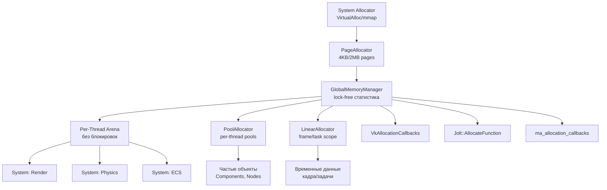

# Memory Manager Architecture: DOD-аллокаторы для ProjectV

## 🎯 Цель и философия

**Цель:** Создать систему управления памятью, которая:
1. **Уничтожает `malloc`** — ни одна библиотека не выделяет память в обход движка
2. **Избегает contention** — минимизирует блокировки и атомики в горячих путях
3. **Следует DOD** — разделяет данные по типам доступа и частоте использования
4. **Интегрируется со всем стеком** — Vulkan, Jolt, Draco, SDL и другие библиотеки используют наш аллокатор

**Философия:** Глобальный менеджер выделяет только большие блоки (страницы/арены). Каждая система (или Job в ThreadPool) получает свой локальный аллокатор, из которого выделяет память без атомиков и локов.

## 🏗️ Архитектурная иерархия



## 📦 Типы аллокаторов

### 1. PageAllocator (Базовый уровень)

Управляет страницами памяти через системные вызовы:

```cpp
module;
#include <Windows.h>  // или #include <sys/mman.h> для Linux
export module projectv.core.memory.page_allocator;

import std;

namespace projectv::core::memory {

class PageAllocator {
public:
    // Выделить выровненную страницу памяти
    [[nodiscard]] static std::expected<void*, AllocationError>
    allocatePage(size_t size, size_t alignment = 64) noexcept {
        // Windows: VirtualAlloc с PAGE_READWRITE
        // Linux: mmap с MAP_PRIVATE | MAP_ANONYMOUS
        // Выравнивание гарантируется системой для размеров страниц
    }
    
    // Освободить страницу
    static void freePage(void* page, size_t size) noexcept {
        // Windows: VirtualFree с MEM_RELEASE
        // Linux: munmap
    }
    
    // Получить размер страницы системы
    [[nodiscard]] static size_t getSystemPageSize() noexcept {
        // Windows: GetSystemInfo
        // Linux: sysconf(_SC_PAGESIZE)
        return 4096;  // 4KB для большинства систем
    }
    
    // Выделить huge page (2MB) если поддерживается
    [[nodiscard]] static std::expected<void*, AllocationError>
    allocateHugePage(size_t size) noexcept {
        // Только для больших аллокаций (> 1MB)
        // Windows: Large Page поддержка требует привилегий
        // Linux: MAP_HUGETLB
    }
};

} // namespace projectv::core::memory
```

### 2. GlobalMemoryManager (Статистика и мониторинг)

Глобальный менеджер с lock-free статистикой:

```cpp
module;
export module projectv.core.memory.global_manager;

import std;
import projectv.core.memory.page_allocator;

namespace projectv::core::memory {

class GlobalMemoryManager {
    // Lock-free статистика через атомики
    struct Statistics {
        std::atomic<size_t> totalAllocated{0};
        std::atomic<size_t> totalFreed{0};
        std::atomic<size_t> peakUsage{0};
        std::atomic<size_t> currentAllocations{0};
        std::atomic<size_t> pageAllocations{0};
        std::atomic<size_t> arenaAllocations{0};
        std::atomic<size_t> poolAllocations{0};
    };
    
    Statistics stats_;
    
    // Per-thread TLS для быстрого доступа к локальным аренам
    static inline thread_local ArenaAllocator* threadArena = nullptr;
    
public:
    GlobalMemoryManager() = default;
    ~GlobalMemoryManager() = default;
    
    // Запрещаем копирование и перемещение
    GlobalMemoryManager(const GlobalMemoryManager&) = delete;
    GlobalMemoryManager& operator=(const GlobalMemoryManager&) = delete;
    
    // Получить локальную арену для текущего потока
    [[nodiscard]] ArenaAllocator& getThreadArena() noexcept {
        if (!threadArena) {
            // Выделяем новую арену из PageAllocator
            threadArena = createArenaForThread();
        }
        return *threadArena;
    }
    
    // Создать PoolAllocator для объектов определённого размера
    [[nodiscard]] PoolAllocator createPool(size_t objectSize, size_t capacity) noexcept {
        // Выделяем память через PageAllocator
        // Инициализируем free-list
        stats_.poolAllocations.fetch_add(1, std::memory_order_relaxed);
        return PoolAllocator{/* ... */};
    }
    
    // Получить статистику (thread-safe)
    [[nodiscard]] Statistics getStatistics() const noexcept {
        Statistics result;
        result.totalAllocated = stats_.totalAllocated.load(std::memory_order_acquire);
        result.totalFreed = stats_.totalFreed.load(std::memory_order_acquire);
        result.peakUsage = stats_.peakUsage.load(std::memory_order_acquire);
        result.currentAllocations = stats_.currentAllocations.load(std::memory_order_acquire);
        result.pageAllocations = stats_.pageAllocations.load(std::memory_order_acquire);
        result.arenaAllocations = stats_.arenaAllocations.load(std::memory_order_acquire);
        result.poolAllocations = stats_.poolAllocations.load(std::memory_order_acquire);
        return result;
    }
    
private:
    [[nodiscard]] ArenaAllocator* createArenaForThread() noexcept {
        // Выделяем 64KB арену для потока
        constexpr size_t arenaSize = 64 * 1024;
        void* memory = PageAllocator::allocatePage(arenaSize).value_or(nullptr);
        if (!memory) return nullptr;
        
        stats_.arenaAllocations.fetch_add(1, std::memory_order_relaxed);
        return new (memory) ArenaAllocator(memory, arenaSize);
    }
};

// Глобальный экземпляр (не синглтон для аллокаций!)
inline GlobalMemoryManager& getGlobalMemoryManager() {
    static GlobalMemoryManager instance;
    return instance;
}

} // namespace projectv::core::memory
```

### 3. ArenaAllocator (Локальные арены без блокировок)

Аллокатор для систем/джобов, работающий в пределах одного потока:

```cpp
module;
export module projectv.core.memory.arena_allocator;

import std;

namespace projectv::core::memory {

class ArenaAllocator {
    std::byte* memory_;
    size_t size_;
    std::atomic<size_t> offset_;  // Только для этого потока - атомик не нужен в hot path
    
public:
    ArenaAllocator(void* memory, size_t size) noexcept
        : memory_(static_cast<std::byte*>(memory))
        , size_(size)
        , offset_(0) {}
    
    // Выделение памяти (только из текущего потока!)
    [[nodiscard]] void* allocate(size_t size, size_t alignment = alignof(std::max_align_t)) noexcept {
        // Вычисляем выровненный offset
        size_t current = offset_.load(std::memory_order_relaxed);
        size_t aligned = (current + alignment - 1) & ~(alignment - 1);
        
        // Проверяем, хватает ли места
        if (aligned + size > size_) {
            return nullptr;  // Арена переполнена
        }
        
        // Обновляем offset атомарно (но только этот поток пишет)
        offset_.store(aligned + size, std::memory_order_relaxed);
        
        return memory_ + aligned;
    }
    
    // Сброс арены (в конце кадра/задачи)
    void reset() noexcept {
        offset_.store(0, std::memory_order_relaxed);
    }
    
    // Получить использованный объём
    [[nodiscard]] size_t getUsed() const noexcept {
        return offset_.load(std::memory_order_relaxed);
    }
    
    // Получить свободный объём
    [[nodiscard]] size_t getFree() const noexcept {
        return size_ - getUsed();
    }
};

} // namespace projectv::core::memory
```

### 4. PoolAllocator (Per-thread pools для частых объектов)

Аллокатор для объектов одного размера с free-list:

```cpp
module;
export module projectv.core.memory.pool_allocator;

import std;

namespace projectv::core::memory {

class PoolAllocator {
    struct Node {
        Node* next;
    };
    
    void* memory_;
    size_t objectSize_;
    size_t capacity_;
    std::atomic<Node*> freeList_;
    
public:
    PoolAllocator(size_t objectSize, size_t capacity) noexcept
        : objectSize_(std::max(objectSize, sizeof(Node)))
        , capacity_(capacity)
        , freeList_(nullptr) {
        
        // Выделяем память через GlobalMemoryManager
        memory_ = getGlobalMemoryManager().getThreadArena()
            .allocate(objectSize_ * capacity_);
        
        if (memory_) {
            initializeFreeList();
        }
    }
    
    // Выделить объект
    [[nodiscard]] void* allocate() noexcept {
        Node* head = freeList_.load(std::memory_order_acquire);
        
        // Lock-free pop из free-list
        while (head) {
            if (freeList_.compare_exchange_weak(head, head->next,
                                               std::memory_order_release,
                                               std::memory_order_acquire)) {
                return head;
            }
        }
        
        return nullptr;  // Пул переполнен
    }
    
    // Освободить объект
    void deallocate(void* ptr) noexcept {
        if (!ptr) return;
        
        Node* node = static_cast<Node*>(ptr);
        Node* head = freeList_.load(std::memory_order_acquire);
        
        // Lock-free push в free-list
        do {
            node->next = head;
        } while (!freeList_.compare_exchange_weak(head, node,
                                                 std::memory_order_release,
                                                 std::memory_order_acquire));
    }
    
private:
    void initializeFreeList() noexcept {
        std::byte* base = static_cast<std::byte*>(memory_);
        Node* head = nullptr;
        
        // Создаём linked list всех объектов в пуле
        for (size_t i = 0; i < capacity_; ++i) {
            Node* node = reinterpret_cast<Node*>(base + i * objectSize_);
            node->next = head;
            head = node;
        }
        
        freeList_.store(head, std::memory_order_release);
    }
};

} // namespace projectv::core::memory
```

### 5. LinearAllocator (Временные данные кадра/задачи)

Аллокатор с автоматическим сбросом в конце scope:

```cpp
module;
export module projectv.core.memory.linear_allocator;

import std;

namespace projectv::core::memory {

class LinearAllocator {
    ArenaAllocator& arena_;
    size_t startOffset_;
    
public:
    // Создаётся в начале кадра/задачи
    explicit LinearAllocator(ArenaAllocator& arena) noexcept
        : arena_(arena)
        , startOffset_(arena.getUsed()) {}
    
    // Автоматически сбрасывается в деструкторе
    ~LinearAllocator() noexcept {
        // В реальной реализации нужно маркировать память как свободную
        // или использовать stack-like подход
    }
    
    // Выделение в пределах scope
    [[nodiscard]] void* allocate(size_t size, size_t alignment = alignof(std::max_align_t)) noexcept {
        return arena_.allocate(size, alignment);
    }
    
    // Явный сброс (если нужно раньше деструктора)
    void reset() noexcept {
        // В реальной реализации нужно отслеживать выделения в этом scope
    }
    
    // RAII wrapper для удобства
    class Scope {
        LinearAllocator& allocator_;
        
    public:
        explicit Scope(LinearAllocator& allocator) noexcept : allocator_(allocator) {}
        ~Scope() noexcept { allocator_.reset(); }
        
        [[nodiscard]] void* allocate(size_t size, size_t alignment = alignof(std::max_align_t)) noexcept {
            return allocator_.allocate(size, alignment);
        }
    };
};

} // namespace projectv::core::memory
```

## 🔧 Интеграция со сторонними библиотеками

### 1. Vulkan/VMA Allocation Callbacks

```cpp
module;
#include <vulkan/vulkan.h>
export module projectv.graphics.vulkan.memory_integration;

import std;
import projectv.core.memory;

namespace projectv::graphics::vulkan {

// Кастомные аллокаторы для Vulkan
class VulkanAllocator {
public:
    static VkAllocationCallbacks getAllocationCallbacks() noexcept {
        return VkAllocationCallbacks{
            .pUserData = nullptr,
            .pfnAllocation = &vulkanAllocation,
            .pfnReallocation = &vulkanReallocation,
            .pfnFree = &vulkanFree,
            .pfnInternalAllocation = nullptr,
            .pfnInternalFree = nullptr,
        };
    }
    
private:
    static void* VKAPI_CALL vulkanAllocation(
        void* pUserData, size_t size, size_t alignment,
        VkSystemAllocationScope allocationScope) {
        
        // Используем GlobalMemoryManager в зависимости от scope
        switch (allocationScope) {
            case VK_SYSTEM_ALLOCATION_SCOPE_COMMAND:
                // Временные данные команды - LinearAllocator
                return getGlobalMemoryManager().getThreadArena()
                    .allocate(size, alignment);
                
            case VK_SYSTEM_ALLOCATION_SCOPE_OBJECT:
            case VK_SYSTEM_ALLOCATION_SCOPE_CACHE:
                // Объекты Vulkan - PoolAllocator
                return getGlobalMemoryManager()
                    .createPool(size, 100).allocate();
                
            case VK_SYSTEM_ALLOCATION_SCOPE_DEVICE:
            case VK_SYSTEM_ALLOCATION_SCOPE_INSTANCE:
                // Долгоживущие объекты - PageAllocator
                return PageAllocator::allocatePage(size, alignment)
                    .value_or(nullptr);
                
            default:
                return nullptr;
        }
    }
    
    static void* VKAPI_CALL vulkanReallocation(
        void* pUserData, void* pOriginal, size_t size,
        size_t alignment, VkSystemAllocationScope allocationScope) {
        
        // В реальной реализации нужно копировать данные
        void* newPtr = vulkanAllocation(pUserData, size, alignment, allocationScope);
        if (newPtr && pOriginal) {
            std::memcpy(newPtr, pOriginal, std::min(size, /* original size */));
            vulkanFree(pUserData, pOriginal);
        }
        return newPtr;
    }
    
    static void VKAPI_CALL vulkanFree(
        void* pUserData, void* pMemory) {
        
        if (!pMemory) return;
        
        // В реальной реализации нужно определить, из какого аллокатора выделена память
        // и вернуть её туда
        // Для простоты примера - игнорируем
    }
};

} // namespace projectv::graphics::vulkan
```

### 2. JoltPhysics Allocation Functions

```cpp
module;
export module projectv.physics.jolt.memory_integration;

import std;
import projectv.core.memory;

namespace projectv::physics::jolt {

class JoltAllocator {
public:
    static void* allocate(size_t size) {
        // Jolt часто выделяет много мелких объектов
        // Используем PoolAllocator для физических тел, constraints и т.д.
        return getGlobalMemoryManager()
            .createPool(size, 1000).allocate();
    }
    
    static void free(void* ptr) {
        if (!ptr) return;
        // Возвращаем в соответствующий пул
        // В реальной реализации нужно отслеживать размер объекта
    }
    
    static void* alignedAllocate(size_t size, size_t alignment) {
        return getGlobalMemoryManager().getThreadArena()
            .allocate(size, alignment);
    }
    
    static void alignedFree(void* ptr) {
        // Для aligned allocations используем arena
        // В реальной реализации нужна более сложная логика
    }
};

// Установка аллокаторов Jolt
void configureJoltAllocators() {
    JPH::Allocate = &JoltAllocator::allocate;
    JPH::Free = &JoltAllocator::free;
    JPH::AlignedAllocate = &JoltAllocator::alignedAllocate;
    JPH::AlignedFree = &JoltAllocator::alignedFree;
    
    projectv::core::Log::info("Physics", "JoltPhysics allocators configured with ProjectV MemoryManager");
}

} // namespace projectv::physics::jolt

### 3. MiniAudio Allocation Callbacks

```cpp
module;
#include <miniaudio.h>
export module projectv.audio.miniaudio.memory_integration;

import std;
import projectv.core.memory;

namespace projectv::audio::miniaudio {

class MiniAudioAllocator {
public:
    static ma_allocation_callbacks getAllocationCallbacks() noexcept {
        return ma_allocation_callbacks{
            .pUserData = nullptr,
            .onMalloc = &maAllocation,
            .onRealloc = &maReallocation,
            .onFree = &maFree,
        };
    }
    
private:
    static void* maAllocation(size_t size, void* pUserData) {
        // Аудио данные обычно временные - используем LinearAllocator
        return getGlobalMemoryManager().getThreadArena()
            .allocate(size, alignof(std::max_align_t));
    }
    
    static void* maReallocation(void* pOriginal, size_t size, void* pUserData) {
        void* newPtr = maAllocation(size, pUserData);
        if (newPtr && pOriginal) {
            std::memcpy(newPtr, pOriginal, std::min(size, /* original size */));
            maFree(pOriginal, pUserData);
        }
        return newPtr;
    }
    
    static void maFree(void* pMemory, void* pUserData) {
        if (!pMemory) return;
        // В реальной реализации нужно вернуть память в соответствующий аллокатор
    }
};

} // namespace projectv::audio::miniaudio
```

## 🚀 Использование в ProjectV

### 1. Инициализация MemoryManager

```cpp
module;
export module projectv.core.engine;

import std;
import projectv.core.memory;
import projectv.graphics.vulkan.memory_integration;
import projectv.physics.jolt.memory_integration;
import projectv.audio.miniaudio.memory_integration;

namespace projectv::core {

class Engine {
public:
    Engine() {
        // Инициализация MemoryManager (автоматически через static initialization)
        projectv::core::Log::info("Engine", "MemoryManager initialized");
        
        // Настройка аллокаторов для сторонних библиотек
        configureExternalAllocators();
    }
    
    ~Engine() {
        // Получение статистики памяти
        auto stats = getGlobalMemoryManager().getStatistics();
        projectv::core::Log::info("Engine", "Memory statistics:");
        projectv::core::Log::info("Engine", "  Total allocated: {} bytes", stats.totalAllocated);
        projectv::core::Log::info("Engine", "  Total freed: {} bytes", stats.totalFreed);
        projectv::core::Log::info("Engine", "  Peak usage: {} bytes", stats.peakUsage);
        projectv::core::Log::info("Engine", "  Current allocations: {}", stats.currentAllocations);
    }
    
private:
    void configureExternalAllocators() {
        // Vulkan
        auto vulkanCallbacks = projectv::graphics::vulkan::VulkanAllocator::getAllocationCallbacks();
        projectv::core::Log::info("Engine", "Vulkan allocators configured");
        
        // JoltPhysics
        projectv::physics::jolt::configureJoltAllocators();
        
        // MiniAudio
        auto maCallbacks = projectv::audio::miniaudio::MiniAudioAllocator::getAllocationCallbacks();
        projectv::core::Log::info("Engine", "MiniAudio allocators configured");
    }
};

} // namespace projectv::core
```

### 2. Пример использования в системе рендеринга

```cpp
module;
export module projectv.graphics.voxel.render_system;

import std;
import projectv.core.memory;

namespace projectv::graphics::voxel {

class VoxelRenderSystem {
    // Per-thread arena для временных данных рендеринга
    ArenaAllocator& renderArena_;
    
    // Pool для voxel chunks (одинакового размера)
    PoolAllocator voxelChunkPool_;
    
public:
    VoxelRenderSystem()
        : renderArena_(getGlobalMemoryManager().getThreadArena())
        , voxelChunkPool_(getGlobalMemoryManager().createPool(sizeof(VoxelChunk), 1000)) {
        
        projectv::core::Log::info("VoxelRender", "Render system initialized with custom allocators");
    }
    
    void renderFrame() {
        // LinearAllocator для временных данных кадра
        LinearAllocator frameAllocator(renderArena_);
        
        // Временные данные кадра автоматически освобождаются при выходе из scope
        {
            LinearAllocator::Scope frameScope(frameAllocator);
            
            // Выделение временных буферов
            void* tempBuffer = frameScope.allocate(1024 * 1024); // 1MB
            void* commandBuffer = frameScope.allocate(sizeof(VkCommandBuffer));
            
            // ... рендеринг ...
        } // Все временные данные автоматически освобождаются здесь
        
        // Выделение voxel chunk из пула
        VoxelChunk* chunk = static_cast<VoxelChunk*>(voxelChunkPool_.allocate());
        if (chunk) {
            // ... работа с chunk ...
            voxelChunkPool_.deallocate(chunk);
        }
    }
};

} // namespace projectv::graphics::voxel
```

## 📊 Бенчмарки и производительность

### Ожидаемые преимущества:

1. **Устранение contention:** Per-thread арены исключают блокировки между потоками
2. **Локальность данных:** PoolAllocator группирует объекты одного типа для лучшей кэш-локальности
3. **Предсказуемое выделение:** LinearAllocator обеспечивает O(1) аллокации для временных данных
4. **Интеграция со стеком:** Все библиотеки используют единую систему управления памятью

### Метрики для измерения:

```cpp
void benchmarkMemoryManager() {
    auto& manager = getGlobalMemoryManager();
    
    // 1. Скорость аллокации (vs malloc)
    auto start = std::chrono::high_resolution_clock::now();
    for (int i = 0; i < 1000000; ++i) {
        void* ptr = manager.getThreadArena().allocate(64);
        // ... использование ...
    }
    auto end = std::chrono::high_resolution_clock::now();
    
    // 2. Потребление памяти
    auto stats = manager.getStatistics();
    projectv::core::Log::info("Benchmark", "Arena allocations: {}", stats.arenaAllocations);
    projectv::core::Log::info("Benchmark", "Pool allocations: {}", stats.poolAllocations);
    projectv::core::Log::info("Benchmark", "Memory overhead: {}%", 
        (stats.totalAllocated - stats.totalFreed) * 100 / stats.totalAllocated);
}
```

## 🎯 Заключение

**MemoryManager для ProjectV** — это не просто замена `malloc`, а архитектурный фундамент для высокопроизводительного движка:

1. **DOD-ориентированный дизайн:** Разделение данных по типам доступа и частоте использования
2. **Lock-free архитектура:** Минимизация contention через per-thread аллокаторы
3. **Полная интеграция:** Все сторонние библиотеки используют единую систему
4. **Профилируемость:** Tracy hooks для отслеживания аллокаций в реальном времени
5. **Предсказуемая производительность:** O(1) аллокации в горячих путях

Система обеспечивает основу для реализации остальных компонентов ProjectV с гарантированной производительностью и контролем над памятью на всех уровнях стека.
