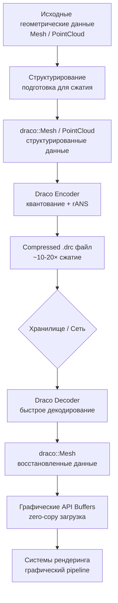

## Архитектурная интеграция Draco в современные C++ проекты

Draco интегрируется в современные C++ проекты через многоуровневую архитектуру, где каждый слой решает конкретную
задачу: от
низкоуровневого сжатия геометрических данных до высокоуровневой интеграции с графическими API и системами управления
сущностями. Эта интеграция обеспечивает
эффективное сжатие 3D моделей, point cloud данных и сетевых данных с минимальными накладными расходами.

**Архитектурная метафора:** Draco выступает в роли специализированного процессора геометрических данных, который
трансформирует пространственно-коррелированные структуры (SVO, sparse voxel структуры, greedy meshes) в компактные
битовые потоки, оптимизированные для хранения, передачи и быстрого декодирования в GPU-совместимые форматы.

### Архитектурный жизненный цикл геометрических данных



**Архитектурные принципы интеграции:**

- **Data-Oriented Design** — Draco работает с SoA (Structure of Arrays) представлением геометрических данных
- **Zero-Copy Pipeline** — прямое декодирование в GPU memory через mapped memory
- **Asynchronous Processing** — декодирование в фоновых потоках с приоритизацией по важности данных
- **Sparse Data Optimization** — специализированные prediction schemes для sparse структур данных

## Архитектурные паттерны интеграции

### 1. Модульная архитектура Draco в современных C++ проектах

Draco интегрируется как независимый модуль с чёткими интерфейсами, использующими современные возможности C++26:

```cpp
// Архитектурный интерфейс для работы с Draco - C++26 Deducing This
// Заменяет виртуальные методы на статический полиморфизм для zero-cost abstraction
class IDracoCompressionModule {
public:
    // Deducing This - C++26 позволяет вызывать без virtual
    template<typename Self>
    [[nodiscard]] std::expected<std::vector<std::byte>, CompressionError>
    compressGeometryData(this Self&& self, const GeometryData& geometry) noexcept {
        return self.doCompressGeometryData(geometry);
    }

    template<typename Self>
    [[nodiscard]] std::expected<GpuMeshData, DecompressionError>
    decompressToGpu(this Self&& self, std::span<const std::byte> compressed) noexcept {
        return self.doDecompressToGpu(compressed);
    }

    template<typename Self>
    void submitAsyncDecompress(
        this Self&& self,
        std::span<const std::byte> compressed,
        std::function<void(std::expected<GpuMeshData, DecompressionError>)> callback) noexcept {
        self.doSubmitAsyncDecompress(std::move(compressed), std::move(callback));
    }

protected:
    // Protected abstract methods для реализации
    template<typename Self>
    std::expected<std::vector<std::byte>, CompressionError>
    doCompressGeometryData(this Self&& self, const GeometryData& geometry) noexcept;

    template<typename Self>
    std::expected<GpuMeshData, DecompressionError>
    doDecompressToGpu(this Self&& self, std::span<const std::byte> compressed) noexcept;

    template<typename Self>
    void doSubmitAsyncDecompress(
        this Self&& self,
        std::span<const std::byte> compressed,
        std::function<void(std::expected<GpuMeshData, DecompressionError>)> callback) noexcept;
};
```

**Архитектурная метафора:** Этот интерфейс действует как универсальный адаптер, преобразующий специфичные для приложения
структуры данных в формат, понятный Draco, подобно тому как USB-адаптер преобразует различные типы разъёмов в
стандартный USB-интерфейс.

### 2. Интеграция с системой сборки CMake

Современные C++ проекты используют CMake с модульной архитектурой для внешних библиотек:

```cmake
# В корневом CMakeLists.txt проекта
include(cmake/ExternalLibraries.cmake)

# Draco настраивается с оптимизациями для конкретного use case
setup_draco_library(
  ENABLE_TRANSCODER OFF      # Отключено для минимального runtime
  ENABLE_ANIMATION OFF       # Не требуется для статических геометрических данных
  BUILD_EXECUTABLES OFF      # Только библиотека
  OPTIMIZE_FOR_DECODING ON   # Оптимизация для декодирования (чаще используется)
  USE_SIMD_OPTIMIZATIONS ON  # Использовать SIMD оптимизации
)

# Автоматическая интеграция с графическими API
target_link_libraries(core_engine
  PRIVATE
  draco::draco
  GraphicsAPI::Core          # Абстракция над Vulkan/DirectX
  ECS::Framework            # Абстракция над flecs/entt
)
```

### 3. Архитектурные конфигурации Draco для различных use cases

| Конфигурация        | Назначение                       | Оптимизации                                | Архитектурная метафора                         |
|---------------------|----------------------------------|--------------------------------------------|------------------------------------------------|
| **Runtime Decoder** | Декодирование в реальном времени | Минимальный decoder, fast SIMD, zero-copy  | Быстрый переводчик для live-переводов          |
| **Asset Pipeline**  | Оффлайн сжатие 3D моделей        | Полный encoder/decoder, transcoder support | Архивный компрессор для долгосрочного хранения |
| **Network Bridge**  | Сетевая синхронизация            | Delta compression, predictive coding       | Дипломатический курьер с минимальным baggage   |

### 4. Zero-Copy архитектура с GPU memory mapping

```cpp
// Архитектурный паттерн: прямой декодирование в GPU memory
class DracoGpuIntegration {
    GpuAllocator allocator_;
    draco::Decoder decoder_;

public:
    struct DecodeResult {
        GpuBuffer vertexBuffer;
        GpuAllocation vertexAllocation;
        GpuBuffer indexBuffer;
        GpuAllocation indexAllocation;
        uint32_t vertexCount;
        uint32_t indexCount;
    };

    [[nodiscard]] std::expected<DecodeResult, std::string>
    decodeDirectToGpu(std::span<const std::byte> compressed) noexcept {
        // 1. Декодирование в промежуточный буфер
        draco::DecoderBuffer buffer;
        buffer.Init(reinterpret_cast<const char*>(compressed.data()), compressed.size());

        auto meshResult = decoder_.DecodeMeshFromBuffer(&buffer);
        if (!meshResult.ok()) {
            return std::unexpected(meshResult.status().error_msg());
        }

        // 2. Создание GPU буферов через абстрактный аллокатор
        return createGpuBuffers(*std::move(meshResult).value());
    }
};
```

**Архитектурная метафора:** Этот паттерн подобен доставке товаров прямо на склад без промежуточных складов — данные
поступают непосредственно в GPU память, минуя лишние копирования.

### 5. Интеграция с Entity Component System (ECS)

```cpp
// ECS компоненты для работы с Draco
namespace engine::components::geometry {

    // Компонент сжатых геометрических данных
    struct CompressedGeometry {
        std::vector<std::byte> data;
        CompressionFormat format;
        bool needsDecompression = true;
    };

    // Компонент декодированной геометрии
    struct GpuGeometry {
        GpuBuffer vertexBuffer;
        GpuAllocation vertexAllocation;
        GpuBuffer indexBuffer;
        GpuAllocation indexAllocation;
        uint32_t vertexCount;
        uint32_t indexCount;
    };

    // Система асинхронного декодирования
    class DracoDecompressionSystem {
    public:
        DracoDecompressionSystem(ECS::World& world) {
            world.system<CompressedGeometry, GpuGeometry>("DracoDecompress")
                .kind(ECS::OnUpdate)
                .each([this](ECS::Entity e, CompressedGeometry& compressed,
                             GpuGeometry& geometry) {
                    if (!compressed.needsDecompression) return;

                    // Асинхронное декодирование через Job System
                    jobSystem_.submit([e, &compressed, &geometry]() {
                        auto result = dracoModule_.decompressToGpu(compressed.data);
                        if (result) {
                            geometry = std::move(*result);
                            compressed.needsDecompression = false;
                        }
                    });
                });
        }
    };
}
```

### 6. Интеграция с современными Job System

Современные C++ проекты используют M:N fibers или work stealing для асинхронной обработки:

```cpp
class DracoJobSystemIntegration {
    JobSystem& jobSystem_;
    DracoDecoderPool decoderPool_;

public:
    struct DecodeTask {
        std::span<const std::byte> compressedData;
        std::function<void(std::expected<GpuMeshData, std::string>)> callback;
        Priority priority = Priority::Normal;
    };

    void submitDecodeTask(DecodeTask task) noexcept {
        jobSystem_.submit([this, task = std::move(task)]() {
            // Получение декодера из пула (thread-safe)
            auto decoder = decoderPool_.acquire();

            // Декодирование
            auto result = decoder->decode(task.compressedData);

            // Возврат в пул
            decoderPool_.release(std::move(decoder));

            // Вызов callback в основном потоке
            jobSystem_.dispatchToMain([result = std::move(result), callback = task.callback]() {
                callback(result);
            });
        }, task.priority);
    }
};
```

## Роль Draco в современных графических приложениях: архитектура сжатия геометрических данных

Draco интегрируется в современные графические приложения как специализированный процессор геометрических данных,
решающий три фундаментальные
проблемы:

1. **Сжатие структурных данных** — трансформация sparse voxel octree (SVO) структур, point clouds и greedy meshes в
   компактные битовые
   потоки с сохранением пространственных корреляций
2. **Оптимизация 3D моделей** — интеграция с `KHR_draco_mesh_compression` для уменьшения размера импортируемых
   3D-моделей на 80-90%
3. **Сетевая синхрони

## Архитектурные паттерны для специализированных данных

### 1. Структурирование пользовательских данных для Draco

Draco может работать с любыми структурированными данными, не только с традиционными 3D моделями. Ключевой принцип —
преобразование пользовательских данных в формат, понятный Draco:

```cpp
#include <draco/mesh/mesh.h>
#include <draco/attributes/geometry_attribute.h>

// Пример: структура данных для научной визуализации
struct ScientificData {
    std::vector<float> positions;      // XYZ координаты точек
    std::vector<float> values;         // Научные значения (температура, давление и т.д.)
    std::vector<uint32_t> categories;  // Категории точек
    std::vector<uint8_t> flags;        // Флаги состояния
};

// Конвертация пользовательских данных в Draco PointCloud
[[nodiscard]] std::expected<std::unique_ptr<draco::PointCloud>, std::string>
convertCustomDataToDraco(const ScientificData& data) noexcept {
    auto pc = std::make_unique<draco::PointCloud>();

    // Устанавливаем количество точек
    pc->set_num_points(data.positions.size() / 3);

    // Создаём атрибут для позиций
    draco::GeometryAttribute posAttr;
    posAttr.Init(
        draco::GeometryAttribute::POSITION,
        nullptr, 3, draco::DT_FLOAT32, false, sizeof(float) * 3, 0
    );
    int posAttrId = pc->AddAttribute(posAttr, true, data.positions.size() / 3);

    // Создаём атрибут для научных значений
    draco::GeometryAttribute valueAttr;
    valueAttr.Init(
        draco::GeometryAttribute::GENERIC,
        nullptr, 1, draco::DT_FLOAT32, false, sizeof(float), 0
    );
    int valueAttrId = pc->AddAttribute(valueAttr, true, data.values.size());

    // Заполняем атрибуты
    for (size_t i = 0; i < data.positions.size() / 3; ++i) {
        pc->attribute(posAttrId)->SetAttributeValue(
            draco::AttributeValueIndex(i), &data.positions[i * 3]);
        pc->attribute(valueAttrId)->SetAttributeValue(
            draco::AttributeValueIndex(i), &data.values[i]);
    }

    return pc;
}
```

**Архитектурная метафора:** Draco действует как универсальный переводчик, который может работать с любым
структурированным языком данных, преобразуя его в компактный бинарный формат.

### 2. Оптимизация квантования для различных типов данных

Разные типы данных требуют разной точности квантования:

```cpp
// Архитектурный паттерн: адаптивное квантование
class AdaptiveQuantizationEncoder {
    draco::ExpertEncoder encoder_;

public:
    void configureForData(const DataProfile& profile) noexcept {
        // Научные данные: высокая точность для значений
        if (profile.type == DataType::Scientific) {
            encoder_.SetAttributeQuantization(draco::GeometryAttribute::POSITION, 14);
            encoder_.SetAttributeQuantization(draco::GeometryAttribute::GENERIC, 12);
        }
        // Игровые ассеты: баланс качества и размера
        else if (profile.type == DataType::GameAsset) {
            encoder_.SetAttributeQuantization(draco::GeometryAttribute::POSITION, 12);
            encoder_.SetAttributeQuantization(draco::GeometryAttribute::NORMAL, 10);
            encoder_.SetAttributeQuantization(draco::GeometryAttribute::TEX_COORD, 10);
        }
        // Процедурные данные: скорость важнее качества
        else if (profile.type == DataType::Procedural) {
            encoder_.SetAttributeQuantization(draco::GeometryAttribute::POSITION, 8);
            encoder_.SetSpeedOptions(8, 10);  // Максимальная скорость
        }
    }
};
```

## Интеграция с графическими API

### Архитектурный паттерн: абстракция над графическими API

Draco может интегрироваться с любым графическим API через абстрактный интерфейс, что позволяет проектам поддерживать
Vulkan, DirectX, Metal или другие API без изменения кода обработки данных:

```cpp
#include <draco/compression/decode.h>
#include <span>
#include <expected>
#include <memory>

// Абстрактный интерфейс для графического аллокатора
class IGraphicsAllocator {
public:
    struct BufferInfo {
        void* handle;           // API-specific handle (VkBuffer, ID3D12Resource, etc.)
        void* allocation;       // API-specific allocation handle
        size_t size;           // Размер буфера в байтах
        void* mappedData;      // Mapped pointer (если поддерживается)
    };

    struct BufferCreateInfo {
        size_t size;
        uint32_t usageFlags;    // API-specific usage flags
        bool hostVisible;       // Доступен ли CPU для записи
        bool deviceLocal;       // Оптимизирован ли для GPU
    };

    [[nodiscard]] virtual std::expected<BufferInfo, std::string>
    createBuffer(const BufferCreateInfo& info) noexcept = 0;

    virtual void destroyBuffer(const BufferInfo& buffer) noexcept = 0;

    virtual ~IGraphicsAllocator() = default;
};

// Абстрактная структура для графических данных
struct GraphicsMeshData {
    BufferInfo vertexBuffer;
    BufferInfo indexBuffer;
    uint32_t vertexCount;
    uint32_t indexCount;
};

// Универсальный декодер для любого графического API
class UniversalDracoDecoder {
    std::unique_ptr<IGraphicsAllocator> allocator_;
    draco::Decoder decoder_;

public:
    explicit UniversalDracoDecoder(std::unique_ptr<IGraphicsAllocator> allocator)
        : allocator_(std::move(allocator)) {}

    [[nodiscard]] std::expected<GraphicsMeshData, std::string>
    decodeToGraphicsMemory(std::span<const std::byte> compressed) noexcept {
        // 1. Декодирование в CPU
        draco::DecoderBuffer buffer;
        buffer.Init(reinterpret_cast<const char*>(compressed.data()), compressed.size());

        auto meshResult = decoder_.DecodeMeshFromBuffer(&buffer);
        if (!meshResult.ok()) {
            return std::unexpected(meshResult.status().error_msg());
        }

        auto mesh = std::move(meshResult).value();

        // 2. Создание графических буферов через абстрактный аллокатор
        return createGraphicsBuffers(*mesh);
    }

private:
    [[nodiscard]] std::expected<GraphicsMeshData, std::string>
    createGraphicsBuffers(const draco::Mesh& mesh) noexcept {
        const auto* posAttr = mesh.GetNamedAttribute(draco::GeometryAttribute::POSITION);
        if (!posAttr) {
            return std::unexpected("Mesh has no position attribute");
        }

        GraphicsMeshData result{};

        // Создание vertex buffer
        auto vertexBufferResult = createVertexBuffer(mesh, *posAttr);
        if (!vertexBufferResult) {
            return std::unexpected(vertexBufferResult.error());
        }
        result.vertexBuffer = *vertexBufferResult;
        result.vertexCount = static_cast<uint32_t>(mesh.num_points());

        // Создание index buffer
        auto indexBufferResult = createIndexBuffer(mesh);
        if (!indexBufferResult) {
            allocator_->destroyBuffer(result.vertexBuffer);
            return std::unexpected(indexBufferResult.error());
        }
        result.indexBuffer = *indexBufferResult;
        result.indexCount = static_cast<uint32_t>(mesh.num_faces() * 3);

        return result;
    }

    [[nodiscard]] std::expected<BufferInfo, std::string>
    createVertexBuffer(const draco::Mesh& mesh, const draco::PointAttribute& posAttr) noexcept {
        const size_t vertexCount = mesh.num_points();
        const size_t vertexSize = sizeof(float) * 3;  // xyz
        const size_t bufferSize = vertexCount * vertexSize;

        IGraphicsAllocator::BufferCreateInfo createInfo{
            .size = bufferSize,
            .usageFlags = 0x1 | 0x100,  // VERTEX_BUFFER_BIT | TRANSFER_DST_BIT (пример)
            .hostVisible = true,
            .deviceLocal = false
        };

        auto bufferResult = allocator_->createBuffer(createInfo);
        if (!bufferResult) {
            return std::unexpected(bufferResult.error());
        }

        auto buffer = *bufferResult;

        // Запись данных в mapped memory
        if (buffer.mappedData) {
            float* dst = static_cast<float*>(buffer.mappedData);
            for (draco::PointIndex i(0); i < vertexCount; ++i) {
                std::array<float, 3> pos;
                posAttr.GetValue(posAttr.mapped_index(i), &pos);
                *dst++ = pos[0];
                *dst++ = pos[1];
                *dst++ = pos[2];
            }
        } else {
            // Если нет mapped memory, нужна staging buffer стратегия
            return std::unexpected("Allocator doesn't support mapped memory");
        }

        return buffer;
    }

    [[nodiscard]] std::expected<BufferInfo, std::string>
    createIndexBuffer(const draco::Mesh& mesh) noexcept {
        const size_t indexCount = mesh.num_faces() * 3;
        const size_t bufferSize = indexCount * sizeof(uint32_t);

        IGraphicsAllocator::BufferCreateInfo createInfo{
            .size = bufferSize,
            .usageFlags = 0x2 | 0x100,  // INDEX_BUFFER_BIT | TRANSFER_DST_BIT (пример)
            .hostVisible = true,
            .deviceLocal = false
        };

        auto bufferResult = allocator_->createBuffer(createInfo);
        if (!bufferResult) {
            return std::unexpected(bufferResult.error());
        }

        auto buffer = *bufferResult;

        // Запись данных в mapped memory
        if (buffer.mappedData) {
            uint32_t* dst = static_cast<uint32_t*>(buffer.mappedData);
            for (draco::FaceIndex f(0); f < mesh.num_faces(); ++f) {
                const auto& face = mesh.face(f);
                *dst++ = face[0].value();
                *dst++ = face[1].value();
                *dst++ = face[2].value();
            }
        }

        return buffer;
    }
};
```

**Архитектурная метафора:** Этот паттерн подобен универсальному зарядному устройству с адаптерами для разных типов
розеток — один интерфейс работает с любым графическим API через соответствующие реализации.

### Стратегии загрузки данных в GPU

```cpp
// Архитектурный паттерн: стратегия загрузки данных
enum class UploadStrategy {
    DirectMapping,      // Прямая запись в mapped memory
    StagingBuffer,      // Использование staging buffer
    AsyncUpload,        // Асинхронная загрузка через очередь команд
    ZeroCopy            // Zero-copy через shared memory
};

class DataUploadStrategy {
public:
    virtual ~DataUploadStrategy() = default;

    [[nodiscard]] virtual std::expected<void, std::string>
    uploadToGpu(const draco::Mesh& mesh, BufferInfo& targetBuffer) noexcept = 0;

    [[nodiscard]] virtual UploadStrategy getStrategyType() const noexcept = 0;
};

// Пример реализации для DirectMapping стратегии
class DirectMappingStrategy : public DataUploadStrategy {
public:
    [[nodiscard]] std::expected<void, std::string>
    uploadToGpu(const draco::Mesh& mesh, BufferInfo& targetBuffer) noexcept override {
        if (!targetBuffer.mappedData) {
            return std::unexpected("Buffer doesn't support direct mapping");
        }

        // Прямая запись в mapped memory (как в примере выше)
        // ...
        return {};
    }

    [[nodiscard]] UploadStrategy getStrategyType() const noexcept override {
        return UploadStrategy::DirectMapping;
    }
};
```

---

## Интеграция с системами управления сущностями (ECS)

### Архитектурный паттерн: абстракция над ECS

Draco может интегрироваться с любой системой управления сущностями через абстрактный интерфейс, что позволяет проектам
использовать Flecs, EnTT, или другие ECS-фреймворки без изменения кода обработки данных:

```cpp
#include <draco/compression/decode.h>
#include <span>
#include <expected>
#include <memory>
#include <functional>

// Абстрактный интерфейс для ECS
class IEntityComponentSystem {
public:
    // Абстрактные типы для работы с ECS
    struct EntityHandle {
        void* id;  // ECS-specific entity ID
    };

    struct ComponentType {
        void* typeId;  // ECS-specific component type ID
    };

    // Абстрактные методы для работы с ECS
    [[nodiscard]] virtual EntityHandle createEntity() noexcept = 0;
    virtual void destroyEntity(EntityHandle entity) noexcept = 0;

    template<typename Component>
    [[nodiscard]] virtual bool hasComponent(EntityHandle entity) const noexcept = 0;

    template<typename Component>
    [[nodiscard]] virtual Component* getComponent(EntityHandle entity) noexcept = 0;

    template<typename Component>
    [[nodiscard]] virtual Component* addComponent(EntityHandle entity, Component&& component) noexcept = 0;

    virtual void registerSystem(std::function<void()> system) noexcept = 0;

    virtual ~IEntityComponentSystem() = default;
};

// Абстрактные компоненты для работы с Draco
namespace ecs::components::geometry {

    // Компонент сжатых геометрических данных
    struct CompressedGeometry {
        std::vector<std::byte> data;
        CompressionFormat format;
        bool needsDecompression = true;
    };

    // Компонент декодированной геометрии
    struct GpuGeometry {
        void* vertexBuffer;      // API-specific handle
        void* vertexAllocation;  // API-specific allocation
        void* indexBuffer;       // API-specific handle
        void* indexAllocation;   // API-specific allocation
        uint32_t vertexCount;
        uint32_t indexCount;
    };
}

// Универсальная система декомпрессии Draco
class UniversalDracoDecompressionSystem {
    std::unique_ptr<IEntityComponentSystem> ecs_;
    std::function<std::expected<ecs::components::geometry::GpuGeometry, std::string>(
        std::span<const std::byte>)> decompressFunc_;

public:
    UniversalDracoDecompressionSystem(
        std::unique_ptr<IEntityComponentSystem> ecs,
        std::function<std::expected<ecs::components::geometry::GpuGeometry, std::string>(
            std::span<const std::byte>)> decompressFunc)
        : ecs_(std::move(ecs)), decompressFunc_(std::move(decompressFunc)) {

        // Регистрация системы декомпрессии
        ecs_->registerSystem([this]() { processDecompression(); });
    }

private:
    void processDecompression() noexcept {
        // Абстрактная обработка сущностей с компонентами CompressedGeometry и GpuGeometry
        // Реализация зависит от конкретного ECS фреймворка
    }
};
```

**Архитектурная метафора:** Этот паттерн подобен универсальному разъёму, который позволяет подключать Draco к любой
ECS-системе через соответствующий адаптер, подобно тому как USB-C разъём работает с различными устройствами через
адаптеры.

### Паттерн: асинхронная загрузка с Job System

```cpp
// Архитектурный паттерн: абстрактная асинхронная загрузка
class IAsyncLoader {
public:
    struct LoadRequest {
        std::span<const std::byte> compressedData;
        std::function<void(std::expected<std::unique_ptr<draco::Mesh>, std::string>)> callback;
        int priority = 0;
    };

    virtual void submitLoadRequest(LoadRequest request) noexcept = 0;
    virtual void processCompletedRequests() noexcept = 0;
    virtual void waitForCompletion() noexcept = 0;

    virtual ~IAsyncLoader() = default;
};

// Реализация с использованием stdexec (P2300) Job System
class StdexecJobSystemLoader : public IAsyncLoader {
    struct InternalRequest {
        std::vector<std::byte> compressedData;
        std::function<void(std::expected<std::unique_ptr<draco::Mesh>, std::string>)> callback;
        int priority;
    };

    // stdexec scheduler для асинхронного выполнения
    stdexec::scheduler auto scheduler_;
    
    // Очередь запросов с приоритетом (lock-free через атомарные операции)
    std::vector<InternalRequest> pendingRequests_;
    std::atomic<size_t> pendingCount_{0};
    
    // Активные задачи как stdexec sender'ы
    struct ActiveTask {
        stdexec::sender auto sender;
        std::function<void(std::expected<std::unique_ptr<draco::Mesh>, std::string>)> callback;
    };
    
    std::vector<ActiveTask> activeTasks_;
    draco::DecoderPool decoderPool_;
    std::atomic<size_t> activeTaskCount_{0};

public:
    explicit StdexecJobSystemLoader(stdexec::scheduler auto scheduler)
        : scheduler_(scheduler) {}

    void submitLoadRequest(LoadRequest request) noexcept override {
        // Создаем внутренний запрос
        InternalRequest internalRequest{
            std::vector<std::byte>(request.compressedData.begin(), request.compressedData.end()),
            std::move(request.callback),
            request.priority
        };

        // Атомарно добавляем в очередь
        size_t oldCount = pendingCount_.fetch_add(1, std::memory_order_acq_rel);
        
        // В реальной реализации нужно использовать lock-free очередь
        // Для простоты примера используем вектор с атомарным счетчиком
        if (oldCount < pendingRequests_.capacity()) {
            pendingRequests_.push_back(std::move(internalRequest));
            
            // Сортируем по приоритету (в реальной реализации это делалось бы при извлечении)
            std::sort(pendingRequests_.begin(), pendingRequests_.end(),
                [](const InternalRequest& a, const InternalRequest& b) {
                    return a.priority > b.priority;
                });
        }
        
        // Запускаем обработку если есть свободные слоты
        processPendingRequests();
    }

    void processCompletedRequests() noexcept override {
        // В stdexec архитектуре completion обрабатывается автоматически через continuation
        // Здесь просто проверяем и удаляем завершенные задачи
        auto it = std::remove_if(activeTasks_.begin(), activeTasks_.end(),
            [](const ActiveTask& task) {
                // В реальной реализации нужно проверять состояние sender'а
                // Для простоты примера считаем, что sender уже завершился
                return false; // Заглушка
            });
        
        if (it != activeTasks_.end()) {
            activeTasks_.erase(it, activeTasks_.end());
            activeTaskCount_.store(activeTasks_.size(), std::memory_order_release);
        }
        
        processPendingRequests();
    }

    void waitForCompletion() noexcept override {
        // В stdexec можно использовать sync_wait или другие synchronization примитивы
        // Для простоты примера используем stdexec::schedule для переключения контекста
        while (activeTaskCount_.load(std::memory_order_acquire) > 0) {
            stdexec::schedule(scheduler_);
        }
    }

private:
    void processPendingRequests() noexcept {
        size_t maxConcurrent = decoderPool_.getMaxConcurrentTasks();
        size_t currentActive = activeTaskCount_.load(std::memory_order_acquire);
        
        while (!pendingRequests_.empty() && currentActive < maxConcurrent) {
            // Извлекаем запрос с наивысшим приоритетом
            auto request = std::move(pendingRequests_.back());
            pendingRequests_.pop_back();
            pendingCount_.fetch_sub(1, std::memory_order_acq_rel);
            
            // Создаем stdexec sender для декодирования
            auto decodeSender = stdexec::schedule(scheduler_)
                | stdexec::then([this, data = std::move(request.compressedData)]() 
                    -> std::expected<std::unique_ptr<draco::Mesh>, std::string> {
                    auto decoder = decoderPool_.acquire();
                    draco::DecoderBuffer buffer;
                    buffer.Init(reinterpret_cast<const char*>(data.data()), data.size());

                    auto result = decoder->DecodeMeshFromBuffer(&buffer);
                    decoderPool_.release(std::move(decoder));

                    if (result.ok()) {
                        return std::move(result).value();
                    }
                    return std::unexpected(result.status().error_msg());
                })
                | stdexec::upon_error([](std::string error) {
                    return std::unexpected<std::unique_ptr<draco::Mesh>, std::string>(std::move(error));
                });
            
            // Запускаем sender с обработкой результата
            stdexec::start_detached(
                std::move(decodeSender),
                [callback = std::move(request.callback)](std::expected<std::unique_ptr<draco::Mesh>, std::string> result) {
                    callback(std::move(result));
                }
            );
            
            activeTaskCount_.fetch_add(1, std::memory_order_acq_rel);
            currentActive = activeTaskCount_.load(std::memory_order_acquire);
        }
    }
};
```

### Паттерн: кэширование декодированных данных

```cpp
// Архитектурный паттерн: абстрактный кэш
class IMeshCache {
public:
    [[nodiscard]] virtual std::shared_ptr<draco::Mesh>
    getOrDecode(const std::string& key, std::span<const std::byte> compressed) noexcept = 0;

    virtual void clear() noexcept = 0;
    virtual size_t getSize() const noexcept = 0;
    virtual size_t getMaxSize() const noexcept = 0;
    virtual void setMaxSize(size_t maxSize) noexcept = 0;

    virtual ~IMeshCache() = default;
};

// Реализация с LRU (Least Recently Used) стратегией с lock-free доступом
class LockFreeLruMeshCache : public IMeshCache {
    struct CacheEntry {
        std::shared_ptr<draco::Mesh> mesh;
        std::atomic<std::chrono::steady_clock::time_point> lastAccess;
        size_t size;
        
        CacheEntry(std::shared_ptr<draco::Mesh> m, size_t s)
            : mesh(std::move(m))
            , lastAccess(std::chrono::steady_clock::now())
            , size(s) {}
    };

    // Используем concurrent unordered_map или аналогичную структуру
    // Для простоты примера используем обычный unordered_map с атомарными операциями
    std::unordered_map<std::string, std::unique_ptr<CacheEntry>> cache_;
    std::atomic<size_t> currentSize_{0};
    size_t maxSize_ = 1024 * 1024 * 1024;  // 1 GB по умолчанию
    draco::Decoder decoder_;
    
    // Для thread-safe операций используем reader-writer lock-free подход
    std::atomic_flag modificationFlag_ = ATOMIC_FLAG_INIT;

public:
    [[nodiscard]] std::shared_ptr<draco::Mesh>
    getOrDecode(const std::string& key, std::span<const std::byte> compressed) noexcept override {
        // Пытаемся получить из кэша без блокировки (read-mostly оптимизация)
        {
            // Чтение без блокировки - безопасно для атомарных операций
            auto it = cache_.find(key);
            if (it != cache_.end()) {
                // Обновляем время доступа атомарно
                it->second->lastAccess.store(std::chrono::steady_clock::now(), 
                                           std::memory_order_release);
                return it->second->mesh;
            }
        }

        // Если не нашли в кэше, декодируем
        draco::DecoderBuffer buffer;
        buffer.Init(reinterpret_cast<const char*>(compressed.data()), compressed.size());

        auto result = decoder_.DecodeMeshFromBuffer(&buffer);
        if (!result.ok()) {
            return nullptr;
        }

        auto mesh = std::make_shared<draco::Mesh>(std::move(result).value());
        size_t meshSize = estimateMeshSize(*mesh);

        // Проверяем, нужно ли освободить место
        if (currentSize_.load(std::memory_order_acquire) + meshSize > maxSize_) {
            makeSpaceFor(meshSize);
        }

        // Добавляем в кэш с минимальной блокировкой
        while (modificationFlag_.test_and_set(std::memory_order_acquire)) {
            // Spin wait - в stdexec архитектуре используем scheduler вместо yield
            // Вместо yield используем stdexec::schedule для переключения контекста
            stdexec::schedule(scheduler_);
        }
        
        // Проверяем еще раз (другой поток мог добавить тот же ключ)
        auto it = cache_.find(key);
        if (it != cache_.end()) {
            // Ключ уже добавлен, возвращаем существующий
            it->second->lastAccess.store(std::chrono::steady_clock::now(),
                                       std::memory_order_release);
            modificationFlag_.clear(std::memory_order_release);
            return it->second->mesh;
        }
        
        // Добавляем новый элемент без исключений
        // Используем std::unique_ptr с явным созданием через new
        CacheEntry* rawEntry = new (std::nothrow) CacheEntry(mesh, meshSize);
        if (!rawEntry) {
            // Не удалось выделить память - очищаем флаг и возвращаем nullptr
            modificationFlag_.clear(std::memory_order_release);
            return nullptr;
        }
        
        std::unique_ptr<CacheEntry> entry(rawEntry);
        cache_[key] = std::move(entry);
        currentSize_.fetch_add(meshSize, std::memory_order_acq_rel);
        
        modificationFlag_.clear(std::memory_order_release);
        return mesh;
    }

    void clear() noexcept override {
        // Атомарная очистка кэша
        while (modificationFlag_.test_and_set(std::memory_order_acquire)) {
            // Вместо yield используем stdexec::schedule для переключения контекста
            stdexec::schedule(scheduler_);
        }
        
        cache_.clear();
        currentSize_.store(0, std::memory_order_release);
        
        modificationFlag_.clear(std::memory_order_release);
    }

    size_t getSize() const noexcept override {
        return currentSize_.load(std::memory_order_acquire);
    }

    size_t getMaxSize() const noexcept override {
        return maxSize_;
    }

    void setMaxSize(size_t maxSize) noexcept override {
        maxSize_ = maxSize;
        makeSpaceFor(0);
    }

private:
    size_t estimateMeshSize(const draco::Mesh& mesh) const noexcept {
        // Простая оценка размера mesh в памяти
        size_t size = 0;
        size += mesh.num_points() * sizeof(float) * 3;  // Позиции
        size += mesh.num_faces() * sizeof(uint32_t) * 3; // Индексы

        // Атрибуты
        for (int i = 0; i < mesh.num_attributes(); ++i) {
            const auto* attr = mesh.attribute(i);
            size += attr->size() * attr->byte_stride();
        }

        return size;
    }

    void makeSpaceFor(size_t requiredSize) noexcept {
        size_t current = currentSize_.load(std::memory_order_acquire);
        if (current + requiredSize <= maxSize_) {
            return;
        }

        // Получаем блокировку для модификации
        while (modificationFlag_.test_and_set(std::memory_order_acquire)) {
            // Вместо yield используем stdexec::schedule для переключения контекста
            stdexec::schedule(scheduler_);
        }

        // Собираем статистику использования
        struct EntryInfo {
            std::string key;
            std::chrono::steady_clock::time_point lastAccess;
            size_t size;
        };
        
        std::vector<EntryInfo> entries;
        entries.reserve(cache_.size());
        
        for (const auto& [key, entry] : cache_) {
            entries.push_back({
                key,
                entry->lastAccess.load(std::memory_order_acquire),
                entry->size
            });
        }
        
        // Сортируем по времени доступа (старые сначала)
        std::sort(entries.begin(), entries.end(),
            [](const EntryInfo& a, const EntryInfo& b) {
                return a.lastAccess < b.lastAccess;
            });
        
        // Удаляем старые элементы пока не освободим достаточно места
        size_t spaceToFree = (current + requiredSize) - maxSize_;
        size_t freed = 0;
        
        for (const auto& entry : entries) {
            if (freed >= spaceToFree) {
                break;
            }
            
            auto it = cache_.find(entry.key);
            if (it != cache_.end()) {
                freed += it->second->size;
                cache_.erase(it);
            }
        }
        
        currentSize_.fetch_sub(freed, std::memory_order_acq_rel);
        modificationFlag_.clear(std::memory_order_release);
    }
};
```

---

## Работа с разреженными и иерархическими данными

### Архитектурный паттерн: сжатие иерархических структур

Draco отлично подходит для сжатия иерархических структур данных, таких как деревья, графы и другие разреженные
структуры. Ключевой принцип — представление иерархических данных в виде point cloud с метаданными:

```cpp
#include <draco/mesh/mesh.h>
#include <draco/attributes/geometry_attribute.h>
#include <draco/metadata/metadata.h>

// Пример: структура данных для иерархического дерева
struct TreeNodeData {
    uint32_t parentId;       // ID родительского узла
    uint32_t firstChildId;   // ID первого дочернего узла
    uint32_t childCount;     // Количество дочерних узлов
    uint8_t nodeType;        // Тип узла
    float value;            // Значение узла (например, научные данные)
};

// Конвертация иерархических данных в Draco PointCloud
[[nodiscard]] std::expected<std::unique_ptr<draco::PointCloud>, std::string>
convertHierarchicalDataToDraco(const std::vector<TreeNodeData>& nodes) noexcept {
    auto pc = std::make_unique<draco::PointCloud>();

    // Устанавливаем количество узлов
    pc->set_num_points(nodes.size());

    // Создаём атрибуты для иерархической структуры
    draco::GeometryAttribute parentAttr;
    parentAttr.Init(
        draco::GeometryAttribute::GENERIC,
        nullptr, 1, draco::DT_UINT32, false, sizeof(uint32_t), 0
    );
    int parentId = pc->AddAttribute(parentAttr, true, nodes.size());

    draco::GeometryAttribute firstChildAttr;
    firstChildAttr.Init(
        draco::GeometryAttribute::GENERIC,
        nullptr, 1, draco::DT_UINT32, false, sizeof(uint32_t), 0
    );
    int firstChildId = pc->AddAttribute(firstChildAttr, true, nodes.size());

    draco::GeometryAttribute childCountAttr;
    childCountAttr.Init(
        draco::GeometryAttribute::GENERIC,
        nullptr, 1, draco::DT_UINT32, false, sizeof(uint32_t), 0
    );
    int childCountId = pc->AddAttribute(childCountAttr, true, nodes.size());

    draco::GeometryAttribute nodeTypeAttr;
    nodeTypeAttr.Init(
        draco::GeometryAttribute::GENERIC,
        nullptr, 1, draco::DT_UINT8, false, sizeof(uint8_t), 0
    );
    int nodeTypeId = pc->AddAttribute(nodeTypeAttr, true, nodes.size());

    draco::GeometryAttribute valueAttr;
    valueAttr.Init(
        draco::GeometryAttribute::GENERIC,
        nullptr, 1, draco::DT_FLOAT32, false, sizeof(float), 0
    );
    int valueId = pc->AddAttribute(valueAttr, true, nodes.size());

    // Заполняем атрибуты
    for (size_t i = 0; i < nodes.size(); ++i) {
        pc->attribute(parentId)->SetAttributeValue(
            draco::AttributeValueIndex(i), &nodes[i].parentId);
        pc->attribute(firstChildId)->SetAttributeValue(
            draco::AttributeValueIndex(i), &nodes[i].firstChildId);
        pc->attribute(childCountId)->SetAttributeValue(
            draco::AttributeValueIndex(i), &nodes[i].childCount);
        pc->attribute(nodeTypeId)->SetAttributeValue(
            draco::AttributeValueIndex(i), &nodes[i].nodeType);
        pc->attribute(valueId)->SetAttributeValue(
            draco::AttributeValueIndex(i), &nodes[i].value);
    }

    return pc;
}

// Добавление метаданных для иерархической структуры
void addHierarchicalMetadata(draco::PointCloud& pc,
                            const std::string& structureType,
                            uint32_t maxDepth,
                            uint32_t totalNodes,
                            const std::string& version = "1.0") noexcept {
    auto metadata = std::make_unique<draco::GeometryMetadata>();

    metadata->AddEntryString("structure_type", structureType);
    metadata->AddEntryInt("max_depth", maxDepth);
    metadata->AddEntryInt("total_nodes", totalNodes);
    metadata->AddEntryString("version", version);
    metadata->AddEntryString("compression_scheme", "draco_hierarchical");

    pc.AddMetadata(std::move(metadata));
}
```

**Архитектурная метафора:** Draco действует как архивариус для сложных структур данных, упаковывая иерархические связи в
компактный формат, подобно тому как архивариус организует документы в логические папки и подпапки.

### Паттерн: оптимизация для разреженных данных

Разреженные данные (sparse data) имеют особые характеристики, которые можно использовать для оптимизации сжатия:

```cpp
// Архитектурный паттерн: адаптивное кодирование для разреженных данных
class SparseDataEncoder {
    draco::ExpertEncoder encoder_;

public:
    void configureForSparseData(const SparseDataProfile& profile) noexcept {
        // Настройка prediction schemes для разреженных данных
        if (profile.sparsityPattern == SparsityPattern::RegularGrid) {
            // Для регулярных сеток используем parallelogram prediction
            encoder_.SetPredictionScheme(draco::GeometryAttribute::POSITION,
                                        draco::PREDICTION_PARALLELOGRAM);
        } else if (profile.sparsityPattern == SparsityPattern::Hierarchical) {
            // Для иерархических данных используем geometric normal prediction
            encoder_.SetPredictionScheme(draco::GeometryAttribute::GENERIC,
                                        draco::PREDICTION_GEOMETRIC_NORMAL);
        } else if (profile.sparsityPattern == SparsityPattern::Random) {
            // Для случайных данных используем delta coding
            encoder_.SetPredictionScheme(draco::GeometryAttribute::GENERIC,
                                        draco::PREDICTION_DIFFERENCE);
        }

        // Настройка квантования в зависимости от плотности данных
        if (profile.density < 0.1f) {
            // Очень разреженные данные: можно использовать более агрессивное квантование
            encoder_.SetAttributeQuantization(draco::GeometryAttribute::GENERIC, 6);
        } else if (profile.density < 0.5f) {
            // Умеренно разреженные данные: баланс качества и сжатия
            encoder_.SetAttributeQuantization(draco::GeometryAttribute::GENERIC, 8);
        } else {
            // Плотные данные: сохраняем качество
            encoder_.SetAttributeQuantization(draco::GeometryAttribute::GENERIC, 10);
        }

        // Настройка скорости кодирования
        encoder_.SetSpeedOptions(profile.encodeSpeed, profile.decodeSpeed);
    }

    struct SparseDataProfile {
        SparsityPattern sparsityPattern;
        float density;           // Плотность данных (0.0 - 1.0)
        int encodeSpeed;         // Скорость кодирования (0-10)
        int decodeSpeed;         // Скорость декодирования (0-10)
    };

    enum class SparsityPattern {
        RegularGrid,     // Регулярная сетка (например, воксельная сетка)
        Hierarchical,    // Иерархическая структура (например, octree)
        Random,          // Случайное распределение
        Clustered        // Кластерное распределение
    };
};
```

### Паттерн: delta compression для инкрементальных обновлений

```cpp
// Архитектурный паттерн: сжатие разницы между версиями данных
class DeltaCompressionEncoder {
    draco::Encoder encoder_;

public:
    [[nodiscard]] std::expected<std::vector<std::byte>, std::string>
    compressDelta(const DataVersion& oldVersion, const DataVersion& newVersion) noexcept {
        // 1. Вычисление разницы между версиями
        auto diff = computeDifference(oldVersion, newVersion);
        if (diff.empty()) {
            return std::vector<std::byte>{};  // Пустой результат если нет изменений
        }

        // 2. Структурирование diff для Draco
        auto pointCloud = structureDiffForDraco(diff);

        // 3. Кодирование diff через Draco
        draco::EncoderBuffer buffer;
        auto status = encoder_.EncodePointCloudToBuffer(*pointCloud, &buffer);

        if (!status.ok()) {
            return std::unexpected(status.error_msg());
        }

        // 4. Конвертация в std::vector<std::byte>
        std::vector<std::byte> result(buffer.size());
        std::memcpy(result.data(), buffer.data(), buffer.size());

        return result;
    }

private:
    struct DataDiff {
        std::vector<uint32_t> changedIndices;  // Индексы изменённых элементов
        std::vector<std::byte> newValues;      // Новые значения
        std::vector<uint8_t> valueSizes;       // Размеры значений (для гетерогенных данных)
    };

    [[nodiscard]] DataDiff computeDifference(const DataVersion& oldVersion,
                                            const DataVersion& newVersion) const noexcept {
        DataDiff diff;

        // Простой алгоритм сравнения (можно оптимизировать для конкретного use case)
        for (size_t i = 0; i < newVersion.data.size(); ++i) {
            if (i >= oldVersion.data.size() ||
                !std::equal(newVersion.data[i].begin(), newVersion.data[i].end(),
                           oldVersion.data[i].begin())) {
                diff.changedIndices.push_back(static_cast<uint32_t>(i));
                diff.newValues.insert(diff.newValues.end(),
                                     newVersion.data[i].begin(),
                                     newVersion.data[i].end());
                diff.valueSizes.push_back(static_cast<uint8_t>(newVersion.data[i].size()));
            }
        }

        return diff;
    }

    [[nodiscard]] std::unique_ptr<draco::PointCloud>
    structureDiffForDraco(const DataDiff& diff) const noexcept {
        auto pc = std::make_unique<draco::PointCloud>();
        pc->set_num_points(diff.changedIndices.size());

        // Атрибут для индексов
        draco::GeometryAttribute indexAttr;
        indexAttr.Init(draco::GeometryAttribute::GENERIC, nullptr, 1,
                      draco::DT_UINT32, false, sizeof(uint32_t), 0);
        int indexId = pc->AddAttribute(indexAttr, true, diff.changedIndices.size());

        // Атрибут для размеров значений
        draco::GeometryAttribute sizeAttr;
        sizeAttr.Init(draco::GeometryAttribute::GENERIC, nullptr, 1,
                     draco::DT_UINT8, false, sizeof(uint8_t), 0);
        int sizeId = pc->AddAttribute(sizeAttr, true, diff.valueSizes.size());

        // Заполняем атрибуты
        for (size_t i = 0; i < diff.changedIndices.size(); ++i) {
            pc->attribute(indexId)->SetAttributeValue(
                draco::AttributeValueIndex(i), &diff.changedIndices[i]);
            pc->attribute(sizeId)->SetAttributeValue(
                draco::AttributeValueIndex(i), &diff.valueSizes[i]);
        }

        // Для значений используем generic атрибут с переменным размером
        // (в реальной реализации нужно обработать гетерогенные данные)

        return pc;
    }
};
```

---

## Профилирование с Tracy

```cpp
#include <tracy/Tracy.hpp>

class ProfiledDracoDecoder {
public:
    std::unique_ptr<draco::Mesh> decode(const void* data, size_t size) {
        ZoneScopedN("DracoDecode");

        draco::DecoderBuffer buffer;
        buffer.Init(reinterpret_cast<const char*>(data), size);

        draco::Decoder decoder;

        auto start = std::chrono::high_resolution_clock::now();
        auto result = decoder.DecodeMeshFromBuffer(&buffer);
        auto end = std::chrono::high_resolution_clock::now();

        if (result.ok()) {
            auto mesh = std::move(result).value();

            auto duration = std::chrono::duration_cast<std::chrono::microseconds>(end - start);
            TracyPlot("DracoDecodeTime", duration.count());
            TracyPlot("DracoVertexCount", static_cast<int64_t>(mesh->num_points()));
            TracyPlot("DracoFaceCount", static_cast<int64_t>(mesh->num_faces()));

            return mesh;
        }

        return nullptr;
    }
};
```

---

## Сетевая оптимизация и распределённые системы

### Архитектурный паттерн: эффективная передача геометрических данных

Draco играет ключевую роль в оптимизации сетевой передачи геометрических данных, особенно в распределённых системах и
multiplayer приложениях:

```cpp
#include <draco/compression/encode.h>
#include <draco/compression/decode.h>
#include <span>
#include <expected>
#include <vector>
#include <chrono>

// Архитектурный паттерн: адаптивное сетевое сжатие
class AdaptiveNetworkCompressor {
    struct CompressionProfile {
        int targetBitrate;      // Целевой битрейт (бит/вершина)
        int maxLatencyMs;       // Максимальная допустимая задержка
        bool allowLossy;        // Разрешено ли lossy сжатие
        NetworkCondition condition; // Состояние сети
    };

    draco::ExpertEncoder encoder_;
    draco::Decoder decoder_;

public:
    [[nodiscard]] std::expected<std::vector<std::byte>, std::string>
    compressForNetwork(const draco::Mesh& mesh, const CompressionProfile& profile) noexcept {
        // Настройка encoder в зависимости от профиля
        configureEncoderForProfile(profile);

        // Кодирование mesh
        draco::EncoderBuffer buffer;
        auto status = encoder_.EncodeMeshToBuffer(mesh, &buffer);

        if (!status.ok()) {
            return std::unexpected(status.error_msg());
        }

        // Конвертация в std::vector<std::byte>
        std::vector<std::byte> result(buffer.size());
        std::memcpy(result.data(), buffer.data(), buffer.size());

        return result;
    }

    [[nodiscard]] std::expected<std::unique_ptr<draco::Mesh>, std::string>
    decompressFromNetwork(std::span<const std::byte> compressed) noexcept {
        draco::DecoderBuffer buffer;
        buffer.Init(reinterpret_cast<const char*>(compressed.data()), compressed.size());

        auto result = decoder_.DecodeMeshFromBuffer(&buffer);
        if (!result.ok()) {
            return std::unexpected(result.status().error_msg());
        }

        return std::move(result).value();
    }

private:
    void configureEncoderForProfile(const CompressionProfile& profile) noexcept {
        // Настройка качества в зависимости от битрейта
        if (profile.targetBitrate < 100) {
            // Низкий битрейт: агрессивное сжатие
            encoder_.SetAttributeQuantization(draco::GeometryAttribute::POSITION, 10);
            encoder_.SetAttributeQuantization(draco::GeometryAttribute::NORMAL, 8);
            encoder_.SetSpeedOptions(8, 10);  // Быстрое кодирование
        } else if (profile.targetBitrate < 500) {
            // Средний битрейт: баланс качества и размера
            encoder_.SetAttributeQuantization(draco::GeometryAttribute::POSITION, 12);
            encoder_.SetAttributeQuantization(draco::GeometryAttribute::NORMAL, 10);
            encoder_.SetSpeedOptions(5, 7);
        } else {
            // Высокий битрейт: высокое качество
            encoder_.SetAttributeQuantization(draco::GeometryAttribute::POSITION, 14);
            encoder_.SetAttributeQuantization(draco::GeometryAttribute::NORMAL, 12);
            encoder_.SetSpeedOptions(3, 5);
        }

        // Настройка в зависимости от состояния сети
        switch (profile.condition) {
            case NetworkCondition::Excellent:
                // Отличное соединение: можно отправлять больше данных
                encoder_.SetSpeedOptions(3, 5);  // Лучшее качество
                break;
            case NetworkCondition::Good:
                // Хорошее соединение: баланс
                encoder_.SetSpeedOptions(5, 7);
                break;
            case NetworkCondition::Poor:
                // Плохое соединение: приоритет скорости
                encoder_.SetSpeedOptions(8, 10);
                break;
            case NetworkCondition::VeryPoor:
                // Очень плохое соединение: максимальная скорость
                encoder_.SetSpeedOptions(10, 10);
                break;
        }
    }

    enum class NetworkCondition {
        Excellent,  // < 50ms latency, > 100 Mbps
        Good,       // 50-100ms latency, 10-100 Mbps
        Poor,       // 100-200ms latency, 1-10 Mbps
        VeryPoor    // > 200ms latency, < 1 Mbps
    };
};
```

**Архитектурная метафора:** Draco действует как умный курьер, который адаптирует упаковку посылки (сжатие данных) в
зависимости от состояния дорог (сети) и важности груза (качество данных).

### Паттерн: приоритетная загрузка на основе значимости

```cpp
// Архитектурный паттерн: загрузка на основе значимости данных с использованием stdexec
class StdexecPriorityBasedLoader {
    struct LoadTask {
        std::string id;
        std::vector<std::byte> compressedData;
        Priority priority;
        std::function<void(std::expected<std::unique_ptr<draco::Mesh>, std::string>)> callback;
        std::chrono::steady_clock::time_point submitTime;
    };

    enum class Priority {
        Critical,    // Данные, необходимые для немедленного рендеринга
        High,        // Данные в поле зрения пользователя
        Medium,      // Данные рядом с полем зрения
        Low,         // Данные вдали от пользователя
        Background   // Фоновые данные (prefetch)
    };

    // stdexec scheduler для асинхронного выполнения
    stdexec::scheduler auto scheduler_;
    
    // Очередь задач с приоритетом (lock-free через атомарные операции)
    struct TaskQueue {
        std::vector<LoadTask> criticalTasks_;
        std::vector<LoadTask> highTasks_;
        std::vector<LoadTask> mediumTasks_;
        std::vector<LoadTask> lowTasks_;
        std::vector<LoadTask> backgroundTasks_;
        
        std::atomic<size_t> totalCount_{0};
        
        void push(LoadTask task) noexcept {
            switch (task.priority) {
                case Priority::Critical:
                    criticalTasks_.push_back(std::move(task));
                    break;
                case Priority::High:
                    highTasks_.push_back(std::move(task));
                    break;
                case Priority::Medium:
                    mediumTasks_.push_back(std::move(task));
                    break;
                case Priority::Low:
                    lowTasks_.push_back(std::move(task));
                    break;
                case Priority::Background:
                    backgroundTasks_.push_back(std::move(task));
                    break;
            }
            totalCount_.fetch_add(1, std::memory_order_acq_rel);
        }
        
        std::optional<LoadTask> pop() noexcept {
            if (!criticalTasks_.empty()) {
                auto task = std::move(criticalTasks_.back());
                criticalTasks_.pop_back();
                totalCount_.fetch_sub(1, std::memory_order_acq_rel);
                return task;
            }
            if (!highTasks_.empty()) {
                auto task = std::move(highTasks_.back());
                highTasks_.pop_back();
                totalCount_.fetch_sub(1, std::memory_order_acq_rel);
                return task;
            }
            if (!mediumTasks_.empty()) {
                auto task = std::move(mediumTasks_.back());
                mediumTasks_.pop_back();
                totalCount_.fetch_sub(1, std::memory_order_acq_rel);
                return task;
            }
            if (!lowTasks_.empty()) {
                auto task = std::move(lowTasks_.back());
                lowTasks_.pop_back();
                totalCount_.fetch_sub(1, std::memory_order_acq_rel);
                return task;
            }
            if (!backgroundTasks_.empty()) {
                auto task = std::move(backgroundTasks_.back());
                backgroundTasks_.pop_back();
                totalCount_.fetch_sub(1, std::memory_order_acq_rel);
                return task;
            }
            return std::nullopt;
        }
        
        size_t size() const noexcept {
            return totalCount_.load(std::memory_order_acquire);
        }
        
        bool empty() const noexcept {
            return size() == 0;
        }
    };
    
    TaskQueue pendingTasks_;
    draco::DecoderPool decoderPool_;
    size_t maxConcurrentTasks_;
    std::atomic<size_t> activeTaskCount_{0};

public:
    explicit StdexecPriorityBasedLoader(stdexec::scheduler auto scheduler, size_t maxConcurrentTasks = 4)
        : scheduler_(scheduler), maxConcurrentTasks_(maxConcurrentTasks) {}

    void submitLoadTask(LoadTask task) noexcept {
        task.submitTime = std::chrono::steady_clock::now();
        pendingTasks_.push(std::move(task));
        
        // Запускаем обработку если есть свободные слоты
        processPendingTasks();
    }

    void update() noexcept {
        // В stdexec архитектуре completion обрабатывается автоматически
        // Просто проверяем и запускаем новые задачи
        processPendingTasks();
    }

private:
    void processPendingTasks() noexcept {
        size_t currentActive = activeTaskCount_.load(std::memory_order_acquire);
        
        while (!pendingTasks_.empty() && currentActive < maxConcurrentTasks_) {
            auto taskOpt = pendingTasks_.pop();
            if (!taskOpt) {
                break;
            }
            
            auto task = std::move(*taskOpt);
            
            // Создаем stdexec sender для декодирования
            auto decodeSender = stdexec::schedule(scheduler_)
                | stdexec::then([this, data = std::move(task.compressedData)]() 
                    -> std::expected<std::unique_ptr<draco::Mesh>, std::string> {
                    auto decoder = decoderPool_.acquire();
                    draco::DecoderBuffer buffer;
                    buffer.Init(reinterpret_cast<const char*>(data.data()), data.size());

                    auto result = decoder->DecodeMeshFromBuffer(&buffer);
                    decoderPool_.release(std::move(decoder));

                    if (result.ok()) {
                        return std::move(result).value();
                    }
                    return std::unexpected(result.status().error_msg());
                })
                | stdexec::upon_error([](std::string error) {
                    return std::unexpected<std::unique_ptr<draco::Mesh>, std::string>(std::move(error));
                });
            
            // Запускаем sender с обработкой результата
            stdexec::start_detached(
                std::move(decodeSender),
                [callback = std::move(task.callback), this](std::expected<std::unique_ptr<draco::Mesh>, std::string> result) {
                    callback(std::move(result));
                    activeTaskCount_.fetch_sub(1, std::memory_order_acq_rel);
                    // После завершения задачи проверяем, можно ли запустить новые
                    processPendingTasks();
                }
            );
            
            activeTaskCount_.fetch_add(1, std::memory_order_acq_rel);
            currentActive = activeTaskCount_.load(std::memory_order_acquire);
        }
    }
};

// Функция для вычисления приоритета на основе расстояния и важности
PriorityBasedLoader::Priority calculatePriority(
    const glm::vec3& dataPosition,
    const glm::vec3& viewerPosition,
    float viewerFov,
    DataImportance importance) noexcept {

    // Вычисляем расстояние до данных
    float distance = glm::distance(dataPosition, viewerPosition);

    // Вычисляем угол между направлением взгляда и направлением к данным
    glm::vec3 toData = glm::normalize(dataPosition - viewerPosition);
    // (в реальной реализации нужно учитывать направление взгляда)

    // Определяем приоритет на основе расстояния и важности
    if (distance < 10.0f && importance == DataImportance::Critical) {
        return PriorityBasedLoader::Priority::Critical;
    } else if (distance < 50.0f) {
        return PriorityBasedLoader::Priority::High;
    } else if (distance < 100.0f) {
        return PriorityBasedLoader::Priority::Medium;
    } else if (distance < 500.0f) {
        return PriorityBasedLoader::Priority::Low;
    } else {
        return PriorityBasedLoader::Priority::Background;
    }
}
```

### Паттерн: предсказательное предзагрузка (predictive prefetching)

```cpp
// Архитектурный паттерн: предсказательная предзагрузка
class PredictivePrefetcher {
    struct PredictionModel {
        glm::vec3 currentPosition;
        glm::vec3 velocity;
        glm::vec3 acceleration;
        std::chrono::steady_clock::time_point lastUpdate;

        [[nodiscard]] glm::vec3 predictPosition(
            std::chrono::milliseconds timeAhead) const noexcept {
            float t = timeAhead.count() / 1000.0f;  // Конвертация в секунды
            return currentPosition + velocity * t + 0.5f * acceleration * t * t;
        }
    };

    PriorityBasedLoader& loader_;
    PredictionModel predictionModel_;
    std::unordered_map<std::string, glm::vec3> dataLocations_;
    std::unordered_set<std::string> prefetchedData_;

public:
    explicit PredictivePrefetcher(PriorityBasedLoader& loader) : loader_(loader) {}

    void updateViewerPosition(const glm::vec3& position,
                             const glm::vec3& velocity,
                             const glm::vec3& acceleration) noexcept {
        predictionModel_.currentPosition = position;
        predictionModel_.velocity = velocity;
        predictionModel_.acceleration = acceleration;
        predictionModel_.lastUpdate = std::chrono::steady_clock::now();

        // Предсказываем позицию через 500ms
        auto predictedPos = predictionModel_.predictPosition(std::chrono::milliseconds(500));

        // Находим данные, которые будут нужны в предсказанной позиции
        prefetchDataForPosition(predictedPos);
    }

    void registerData(const std::string& id, const glm::vec3& position,
                     DataImportance importance) noexcept {
        dataLocations_[id] = position;
        // Можно также сохранить importance для более точного предсказания
    }

private:
    void prefetchDataForPosition(const glm::vec3& position) noexcept {
        for (const auto& [id, dataPos] : dataLocations_) {
            // Если данные уже предзагружены, пропускаем
            if (prefetchedData_.contains(id)) {
                continue;
            }

            // Вычисляем расстояние до предсказанной позиции
            float distance = glm::distance(position, dataPos);

            // Если данные достаточно близко, предзагружаем их
            if (distance < 100.0f) {
                // В реальной реализации здесь нужно получить compressedData
                // и отправить задачу в loader_
                prefetchedData_.insert(id);
            }
        }
    }
};
```

---

## Рекомендации по использованию Draco в различных сценариях

### Архитектурный паттерн: адаптивные настройки для различных типов данных

Draco предоставляет гибкие настройки для оптимизации сжатия под конкретные типы данных и use cases:

```cpp
// Архитектурный паттерн: фабрика encoder'ов для различных сценариев
class DracoEncoderFactory {
public:
    [[nodiscard]] static draco::Encoder createEncoderForScenario(CompressionScenario scenario) noexcept {
        draco::Encoder encoder;

        switch (scenario) {
            case CompressionScenario::RealTimeStreaming:
                // Для real-time стриминга: приоритет скорости декодирования
                encoder.SetSpeedOptions(8, 10);
                encoder.SetAttributeQuantization(draco::GeometryAttribute::POSITION, 10);
                encoder.SetAttributeQuantization(draco::GeometryAttribute::NORMAL, 8);
                encoder.SetEncodingMethod(draco::MESH_EDGEBREAKER_ENCODING);
                break;

            case CompressionScenario::AssetStorage:
                // Для хранения ассетов: баланс качества и размера
                encoder.SetSpeedOptions(3, 5);
                encoder.SetAttributeQuantization(draco::GeometryAttribute::POSITION, 14);
                encoder.SetAttributeQuantization(draco::GeometryAttribute::NORMAL, 10);
                encoder.SetAttributeQuantization(draco::GeometryAttribute::TEX_COORD, 12);
                encoder.SetEncodingMethod(draco::MESH_EDGEBREAKER_ENCODING);
                break;

            case CompressionScenario::ScientificData:
                // Для научных данных: высокая точность
                encoder.SetSpeedOptions(5, 7);
                encoder.SetAttributeQuantization(draco::GeometryAttribute::POSITION, 16);
                encoder.SetAttributeQuantization(draco::GeometryAttribute::GENERIC, 14);
                encoder.SetEncodingMethod(draco::POINT_CLOUD_SEQUENTIAL_ENCODING);
                break;

            case CompressionScenario::NetworkTransmission:
                // Для сетевой передачи: агрессивное сжатие
                encoder.SetSpeedOptions(10, 10);
                encoder.SetAttributeQuantization(draco::GeometryAttribute::POSITION, 8);
                encoder.SetAttributeQuantization(draco::GeometryAttribute::NORMAL, 6);
                encoder.SetEncodingMethod(draco::MESH_EDGEBREAKER_ENCODING);
                break;
        }

        return encoder;
    }

    enum class CompressionScenario {
        RealTimeStreaming,   // Real-time стриминг (игры, VR)
        AssetStorage,        // Хранение ассетов (3D модели, текстуры)
        ScientificData,      // Научные данные (point clouds, измерения)
        NetworkTransmission  // Сетевая передача (multiplayer, облако)
    };
};
```

**Архитектурная метафора:** Draco предоставляет набор "пресетов" настроек, подобно тому как фотоаппарат предоставляет
режимы съёмки (портрет, пейзаж, спорт) — каждый режим оптимизирован под конкретную задачу.

### Паттерн: стратегии кэширования для различных workload'ов

```cpp
// Архитектурный паттерн: адаптивное кэширование
class AdaptiveCacheManager {
public:
    [[nodiscard]] static std::unique_ptr<IMeshCache> createCacheForWorkload(
        CacheWorkload workload, size_t availableMemory) noexcept {

        switch (workload) {
            case CacheWorkload::MemoryConstrained:
                // Ограниченная память: LRU с агрессивным удалением
                return createLruCache(availableMemory * 0.5);  // Используем только 50% памяти

            case CacheWorkload::PerformanceCritical:
                // Критичная производительность: большой кэш с предзагрузкой
                auto cache = createLruCache(availableMemory * 0.8);
                cache->enablePrefetching(true);
                return cache;

            case CacheWorkload::DataIntensive:
                // Data-intensive: кэш с компрессией данных
                auto compressedCache = createCompressedCache(availableMemory);
                compressedCache->setCompressionLevel(CompressionLevel::Balanced);
                return compressedCache;

            case CacheWorkload::MixedWorkload:
                // Смешанный workload: адаптивный кэш
                return createAdaptiveCache(availableMemory);
        }

        return createLruCache(availableMemory);  // По умолчанию
    }

    enum class CacheWorkload {
        MemoryConstrained,   // Ограниченная память (мобильные устройства)
        PerformanceCritical, // Критичная производительность (игры, VR)
        DataIntensive,       // Data-intensive (научные вычисления)
        MixedWorkload        // Смешанный workload (универсальные приложения)
    };
};

// Пример реализации адаптивного кэша с lock-free доступом
class LockFreeAdaptiveMeshCache : public IMeshCache {
    struct AdaptiveCacheEntry {
        std::shared_ptr<draco::Mesh> mesh;
        std::atomic<std::chrono::steady_clock::time_point> lastAccess;
        size_t size;
        std::atomic<uint32_t> accessCount;      // Количество обращений
        std::atomic<float> importanceScore;     // Оценка важности (на основе частоты и времени)
        
        AdaptiveCacheEntry(std::shared_ptr<draco::Mesh> m, size_t s, float initialImportance)
            : mesh(std::move(m))
            , lastAccess(std::chrono::steady_clock::now())
            , size(s)
            , accessCount(1)
            , importanceScore(initialImportance) {}
    };

    // Используем concurrent unordered_map или аналогичную структуру
    std::unordered_map<std::string, std::unique_ptr<AdaptiveCacheEntry>> cache_;
    std::atomic<size_t> currentSize_{0};
    size_t maxSize_;
    draco::Decoder decoder_;
    CacheWorkload currentWorkload_;
    
    // Для thread-safe операций используем reader-writer lock-free подход
    std::atomic_flag modificationFlag_ = ATOMIC_FLAG_INIT;
    
    // stdexec scheduler для асинхронного выполнения (вместо yield)
    stdexec::scheduler auto scheduler_;

public:
    LockFreeAdaptiveMeshCache(size_t maxSize, CacheWorkload workload, stdexec::scheduler auto scheduler)
        : maxSize_(maxSize), currentWorkload_(workload), scheduler_(scheduler) {}

    [[nodiscard]] std::shared_ptr<draco::Mesh>
    getOrDecode(const std::string& key, std::span<const std::byte> compressed) noexcept override {
        // Пытаемся получить из кэша без блокировки (read-mostly оптимизация)
        {
            auto it = cache_.find(key);
            if (it != cache_.end()) {
                // Обновляем статистику доступа атомарно
                it->second->lastAccess.store(std::chrono::steady_clock::now(), 
                                           std::memory_order_release);
                it->second->accessCount.fetch_add(1, std::memory_order_acq_rel);
                updateImportanceScore(*it->second);
                return it->second->mesh;
            }
        }

        // Если не нашли в кэше, декодируем
        draco::DecoderBuffer buffer;
        buffer.Init(reinterpret_cast<const char*>(compressed.data()), compressed.size());

        auto result = decoder_.DecodeMeshFromBuffer(&buffer);
        if (!result.ok()) {
            return nullptr;
        }

        auto mesh = std::make_shared<draco::Mesh>(std::move(result).value());
        size_t meshSize = estimateMeshSize(*mesh);
        float initialImportance = calculateInitialImportance(key);

        // Проверяем, нужно ли освободить место
        if (currentSize_.load(std::memory_order_acquire) + meshSize > maxSize_) {
            makeSpaceFor(meshSize);
        }

        // Добавляем в кэш с минимальной блокировкой
        while (modificationFlag_.test_and_set(std::memory_order_acquire)) {
            stdexec::schedule(scheduler_);
        }
        
        // Проверяем еще раз (другой поток мог добавить тот же ключ)
        auto it = cache_.find(key);
        if (it != cache_.end()) {
            // Ключ уже добавлен, возвращаем существующий
            it->second->lastAccess.store(std::chrono::steady_clock::now(),
                                       std::memory_order_release);
            it->second->accessCount.fetch_add(1, std::memory_order_acq_rel);
            updateImportanceScore(*it->second);
            modificationFlag_.clear(std::memory_order_release);
            return it->second->mesh;
        }
        
        // Добавляем новый элемент
        cache_[key] = std::make_unique<AdaptiveCacheEntry>(mesh, meshSize, initialImportance);
        currentSize_.fetch_add(meshSize, std::memory_order_acq_rel);
        modificationFlag_.clear(std::memory_order_release);
        return mesh;
    }

    void clear() noexcept override {
        while (modificationFlag_.test_and_set(std::memory_order_acquire)) {
            stdexec::schedule(scheduler_);
        }
        
        cache_.clear();
        currentSize_.store(0, std::memory_order_release);
        
        modificationFlag_.clear(std::memory_order_release);
    }

    size_t getSize() const noexcept override {
        return currentSize_.load(std::memory_order_acquire);
    }

    size_t getMaxSize() const noexcept override {
        return maxSize_;
    }

    void setMaxSize(size_t maxSize) noexcept override {
        maxSize_ = maxSize;
        makeSpaceFor(0);
    }

private:
    void updateImportanceScore(AdaptiveCacheEntry& entry) noexcept {
        // Адаптивная оценка важности на основе workload
        auto now = std::chrono::steady_clock::now();
        auto lastAccess = entry.lastAccess.load(std::memory_order_acquire);
        auto timeSinceAccess = std::chrono::duration_cast<std::chrono::seconds>(
            now - lastAccess).count();
        
        uint32_t accessCount = entry.accessCount.load(std::memory_order_acquire);
        float newScore = 0.0f;

        switch (currentWorkload_) {
            case CacheWorkload::MemoryConstrained:
                // Для ограниченной памяти: приоритет частоты обращений
                newScore = accessCount * 0.7f + (1.0f / (timeSinceAccess + 1)) * 0.3f;
                break;

            case CacheWorkload::PerformanceCritical:
                // Для критичной производительности: приоритет времени доступа
                newScore = (1.0f / (timeSinceAccess + 1)) * 0.8f + accessCount * 0.2f;
                break;

            case CacheWorkload::DataIntensive:
                // Для data-intensive: баланс размера и частоты
                float sizeFactor = 1.0f - (static_cast<float>(entry.size) / maxSize_);
                newScore = accessCount * 0.4f + (1.0f / (timeSinceAccess + 1)) * 0.3f + sizeFactor * 0.3f;
                break;

            case CacheWorkload::MixedWorkload:
                // Для смешанного workload: адаптивная формула
                newScore = calculateMixedImportance(entry, timeSinceAccess, accessCount);
                break;
        }
        
        entry.importanceScore.store(newScore, std::memory_order_release);
    }

    void makeSpaceFor(size_t requiredSize) noexcept {
        size_t current = currentSize_.load(std::memory_order_acquire);
        if (current + requiredSize <= maxSize_) {
            return;
        }

        // Получаем блокировку для модификации
        while (modificationFlag_.test_and_set(std::memory_order_acquire)) {
            stdexec::schedule(scheduler_);
        }

        // Собираем статистику использования
        struct EntryInfo {
            std::string key;
            float importanceScore;
            size_t size;
        };
        
        std::vector<EntryInfo> entries;
        entries.reserve(cache_.size());
        
        for (const auto& [key, entry] : cache_) {
            entries.push_back({
                key,
                entry->importanceScore.load(std::memory_order_acquire),
                entry->size
            });
        }
        
        // Сортируем по важности (наименее важные сначала)
        std::sort(entries.begin(), entries.end(),
            [](const EntryInfo& a, const EntryInfo& b) {
                return a.importanceScore < b.importanceScore;
            });
        
        // Удаляем наименее важные элементы пока не освободим достаточно места
        size_t spaceToFree = (current + requiredSize) - maxSize_;
        size_t freed = 0;
        
        for (const auto& entry : entries) {
            if (freed >= spaceToFree) {
                break;
            }
            
            auto it = cache_.find(entry.key);
            if (it != cache_.end()) {
                freed += it->second->size;
                cache_.erase(it);
            }
        }
        
        currentSize_.fetch_sub(freed, std::memory_order_acq_rel);
        modificationFlag_.clear(std::memory_order_release);
    }

    size_t estimateMeshSize(const draco::Mesh& mesh) const noexcept {
        // Простая оценка размера mesh в памяти
        size_t size = 0;
        size += mesh.num_points() * sizeof(float) * 3;  // Позиции
        size += mesh.num_faces() * sizeof(uint32_t) * 3; // Индексы

        // Атрибуты
        for (int i = 0; i < mesh.num_attributes(); ++i) {
            const auto* attr = mesh.attribute(i);
            size += attr->size() * attr->byte_stride();
        }

        return size;
    }
    
    float calculateInitialImportance(const std::string& key) const noexcept {
        // Простая начальная оценка важности
        // В реальной реализации можно использовать дополнительные факторы
        return 1.0f;
    }
    
    float calculateMixedImportance(const AdaptiveCacheEntry& entry, 
                                  long long timeSinceAccess, 
                                  uint32_t accessCount) const noexcept {
        // Адаптивная формула для смешанного workload
        float timeFactor = 1.0f / (timeSinceAccess + 1);
        float sizeFactor = 1.0f - (static_cast<float>(entry.size) / maxSize_);
        float frequencyFactor = std::log1p(static_cast<float>(accessCount));
        
        return timeFactor * 0.4f + frequencyFactor * 0.4f + sizeFactor * 0.2f;
    }
};
```

### Паттерн: мониторинг и адаптация в runtime

```cpp
// Архитектурный паттерн: runtime мониторинг и адаптация с lock-free доступом
class LockFreeRuntimeMonitor {
    struct PerformanceMetrics {
        std::atomic<float> decodeTimeMs;          // Среднее время декодирования
        std::atomic<float> cacheHitRate;          // Hit rate кэша
        std::atomic<size_t> memoryUsage;          // Использование памяти
        std::atomic<float> networkBandwidth;      // Доступная bandwidth сети
        std::atomic<uint32_t> concurrentDecodes;  // Количество concurrent декодирований
        std::atomic<std::chrono::steady_clock::time_point> lastUpdate;
        
        PerformanceMetrics() 
            : decodeTimeMs(0.0f)
            , cacheHitRate(0.0f)
            , memoryUsage(0)
            , networkBandwidth(0.0f)
            , concurrentDecodes(0)
            , lastUpdate(std::chrono::steady_clock::now()) {}
    };

    PerformanceMetrics currentMetrics_;

public:
    void updateMetrics(const PerformanceMetrics& metrics) noexcept {
        // Атомарное обновление всех метрик
        currentMetrics_.decodeTimeMs.store(metrics.decodeTimeMs, std::memory_order_release);
        currentMetrics_.cacheHitRate.store(metrics.cacheHitRate, std::memory_order_release);
        currentMetrics_.memoryUsage.store(metrics.memoryUsage, std::memory_order_release);
        currentMetrics_.networkBandwidth.store(metrics.networkBandwidth, std::memory_order_release);
        currentMetrics_.concurrentDecodes.store(metrics.concurrentDecodes, std::memory_order_release);
        currentMetrics_.lastUpdate.store(std::chrono::steady_clock::now(), std::memory_order_release);
    }

    [[nodiscard]] OptimizationSuggestions getSuggestions() const noexcept {
        OptimizationSuggestions suggestions;

        // Чтение метрик атомарно
        float decodeTime = currentMetrics_.decodeTimeMs.load(std::memory_order_acquire);
        float cacheHitRate = currentMetrics_.cacheHitRate.load(std::memory_order_acquire);
        size_t memoryUsage = currentMetrics_.memoryUsage.load(std::memory_order_acquire);
        float networkBandwidth = currentMetrics_.networkBandwidth.load(std::memory_order_acquire);
        uint32_t concurrentDecodes = currentMetrics_.concurrentDecodes.load(std::memory_order_acquire);

        // Анализ метрик и генерация suggestions
        if (decodeTime > 16.0f) {  // > 60 FPS threshold
            suggestions.suggestLowerQuality();
        }

        if (cacheHitRate < 0.7f) {
            suggestions.suggestIncreaseCacheSize();
        }

        if (memoryUsage > 0.9f * getAvailableMemory()) {
            suggestions.suggestAggressiveCaching();
        }

        if (networkBandwidth < 10.0f) {  // < 10 Mbps
            suggestions.suggestHigherCompression();
        }

        if (concurrentDecodes > 8) {  // Слишком много concurrent задач
            suggestions.suggestReduceConcurrency();
        }

        // Проверяем, когда последний раз обновлялись метрики
        auto lastUpdate = currentMetrics_.lastUpdate.load(std::memory_order_acquire);
        auto now = std::chrono::steady_clock::now();
        auto timeSinceUpdate = std::chrono::duration_cast<std::chrono::seconds>(now - lastUpdate);
        
        if (timeSinceUpdate > std::chrono::seconds(5)) {
            suggestions.suggestEnablePrefetching();  // Если данные устарели, включаем предзагрузку
        }

        return suggestions;
    }

    struct OptimizationSuggestions {
        bool lowerQuality = false;
        bool increaseCacheSize = false;
        bool aggressiveCaching = false;
        bool higherCompression = false;
        bool enablePrefetching = false;
        bool reduceConcurrency = false;

        [[nodiscard]] std::string toString() const noexcept {
            std::string result;
            if (lowerQuality) result += "• Снизить качество сжатия для скорости\n";
            if (increaseCacheSize) result += "• Увеличить размер кэша\n";
            if (aggressiveCaching) result += "• Включить агрессивное кэширование\n";
            if (higherCompression) result += "• Увеличить уровень сжатия\n";
            if (enablePrefetching) result += "• Включить предзагрузку\n";
            if (reduceConcurrency) result += "• Уменьшить concurrency декодирования\n";
            return result;
        }
        
        void suggestLowerQuality() { lowerQuality = true; }
        void suggestIncreaseCacheSize() { increaseCacheSize = true; }
        void suggestAggressiveCaching() { aggressiveCaching = true; }
        void suggestHigherCompression() { higherCompression = true; }
        void suggestEnablePrefetching() { enablePrefetching = true; }
        void suggestReduceConcurrency() { reduceConcurrency = true; }
    };
    
private:
    [[nodiscard]] size_t getAvailableMemory() const noexcept {
        // В реальной реализации нужно получить доступную память системы
        // Для примера возвращаем фиксированное значение
        return 8ULL * 1024 * 1024 * 1024;  // 8 GB
    }
};
```

## Архитектурные выводы: роль Draco в современных графических приложениях

Draco интегрируется в современные графические приложения как специализированный процессор геометрических данных,
решающий три фундаментальные проблемы:

1. **Эффективное сжатие структурных данных** — трансформация sparse voxel octree (SVO) структур, point clouds и greedy
   meshes в компактные битовые потоки с сохранением пространственных корреляций, обеспечивая 10-20× уменьшение размера
   геометрических данных
2. **Оптимизация 3D моделей** — интеграция с `KHR_draco_mesh_compression` для уменьшения размера импортируемых
   3D-моделей на 80-90% без видимой потери качества
3. **Сетевая синхронизация** — delta compression и адаптивное сжатие для эффективной передачи геометрических данных в
   распределённых системах и multiplayer приложениях

### Ключевые архитектурные преимущества:

- **Zero-Copy Pipeline** — прямое декодирование в GPU memory через абстрактные аллокаторы, минимизирующее CPU-GPU
  копирования
- **Асинхронная обработка** — интеграция с современными Job System для фонового декодирования с приоритизацией по
  значимости данных
- **Адаптивное сжатие** — динамическая настройка параметров кодирования в зависимости от типа данных, требований к
  качеству и доступных ресурсов
- **Кроссплатформенность** — абстрактные интерфейсы для работы с различными графическими API (Vulkan, DirectX, Metal) и
  ECS-фреймворками
- **Масштабируемость** — поддержка от мобильных устройств до high-end рабочих станций через адаптивные стратегии
  кэширования и загрузки

### Архитектурная метафора: Draco как универсальный переводчик геометрических данных

Draco действует как специализированный переводчик, который преобразует различные "языки" геометрических данных (mesh,
point cloud, иерархические структуры) в универсальный компактный формат, оптимизированный для хранения, передачи и
быстрого декодирования. Подобно тому как опытный переводчик адаптирует свой стиль в зависимости от аудитории и
контекста, Draco адаптирует стратегии сжатия в зависимости от типа данных, требований к качеству и доступных
вычислительных ресурсов.

Эта архитектурная интеграция позволяет современным графическим приложениям эффективно работать с огромными объёмами
геометрических данных, минимизируя требования к памяти и bandwidth, сохраняя при этом высокую производительность
рендеринга и обеспечивая плавный пользовательский опыт даже на устройствах с ограниченными ресурсами.
