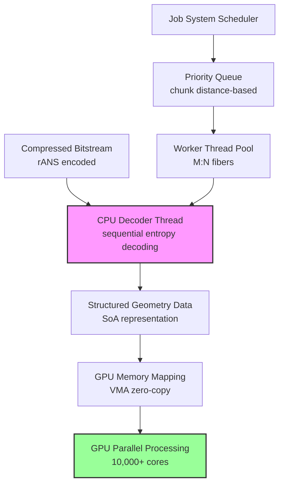

# Продвинутые оптимизации Draco для высокопроизводительных систем ProjectV

## Архитектурная философия производительности в контексте воксельных движков

Draco представляет собой специализированный процессор геометрических данных, использующий энтропийное кодирование (rANS)
и предсказательные схемы для сжатия пространственно-коррелированных структур. В архитектуре ProjectV Draco занимает
критически важную позицию в конвейере обработки геометрических данных, трансформируя sparse voxel octree (SVO) структуры
и greedy meshes в компактные битовые потоки.

**Архитектурный принцип:** Draco функционирует как асинхронный трансформатор данных, где CPU выступает в роли
специализированного процессора для декодирования энтропийно-сжатых потоков, а GPU — как массовый параллельный
потребитель уже структурированных геометрических данных. Эта архитектурная дихотомия определяет ключевые паттерны
интеграции.

### Архитектурная модель декодирования



**Архитектурные ограничения и возможности:**

- **Последовательная природа rANS** — энтропийное декодирование требует последовательного чтения битового потока, что
  противоречит massively parallel архитектуре GPU
- **Пространственная локальность вокселей** — SVO структуры обладают высокой пространственной корреляцией, которую Draco
  эффективно использует через prediction schemes
- **Асинхронная модель обработки** — декодирование происходит в фоновых потоках Job System с приоритизацией на основе
  расстояния до камеры

## Многопоточная архитектура декодирования через Job System

Поскольку Draco не поддерживает параллельное декодирование внутри одного битстрима, ProjectV использует пакетную
обработку чанков на нескольких потоках через специализированную Job System архитектуру.

### Архитектура Job System для Draco

```cpp
#include <draco/compression/decode.h>
#include <print>
#include <expected>
#include <span>
#include <vector>
#include <atomic>
#include <latch>
#include <thread>

// SoA представление воксельных данных
struct VoxelChunkSoA {
    std::vector<float> position_x;
    std::vector<float> position_y;
    std::vector<float> position_z;
    std::vector<uint8_t> material_ids;
    std::vector<uint16_t> light_levels;
    std::vector<uint8_t> occlusion;
    std::vector<uint8_t> moisture;
    std::vector<int8_t> temperature;
};

struct DecodeResult {
    std::expected<VoxelChunkSoA, draco::Status> data;
    size_t chunk_id;
    uint32_t priority_level;
};

class DracoJobSystem {
public:
    explicit DracoJobSystem(size_t num_workers = std::thread::hardware_concurrency())
        : workers_(num_workers) {
        // Инициализация пула потоков с привязкой к физическим ядрам
        for (size_t i = 0; i < num_workers; ++i) {
            workers_[i] = std::jthread([this, i](std::stop_token stoken) {
                set_thread_affinity(i);  // Привязка к конкретному ядру
                worker_thread(stoken);
            });
        }
    }

    ~DracoJobSystem() {
        // Грейсфул остановка всех воркеров
        for (auto& worker : workers_) {
            worker.request_stop();
        }
        cv_.notify_all();
    }

    auto decode_chunk_async(std::span<const std::byte> compressed_data,
                           size_t chunk_id, uint32_t priority = 0)
        -> std::future<DecodeResult> {
        auto promise = std::make_shared<std::promise<DecodeResult>>();
        auto future = promise->get_future();

        {
            std::lock_guard lock(queue_mutex_);

            // Вставка с учётом приоритета (higher priority = earlier processing)
            auto it = std::ranges::find_if(tasks_, [priority](const auto& task) {
                return task.priority < priority;
            });

            tasks_.insert(it, {
                .compressed_data = std::vector<std::byte>(compressed_data.begin(),
                                                         compressed_data.end()),
                .chunk_id = chunk_id,
                .priority = priority,
                .promise = std::move(promise)
            });
        }

        cv_.notify_one();
        return future;
    }

private:
    struct DecodeTask {
        std::vector<std::byte> compressed_data;
        size_t chunk_id;
        uint32_t priority;
        std::shared_ptr<std::promise<DecodeResult>> promise;

        auto operator<=>(const DecodeTask& other) const {
            return priority <=> other.priority;
        }
    };

    void worker_thread(std::stop_token stoken) {
        while (!stoken.stop_requested()) {
            std::optional<DecodeTask> task;

            {
                std::unique_lock lock(queue_mutex_);
                cv_.wait(lock, stoken, [this] { return !tasks_.empty(); });

                if (stoken.stop_requested() || tasks_.empty()) {
                    continue;
                }

                // Берём задачу с наивысшим приоритетом
                auto it = std::ranges::max_element(tasks_, std::less{},
                                                  [](const auto& t) { return t.priority; });
                task = std::move(*it);
                tasks_.erase(it);
            }

            if (task) {
                ZoneScopedN("DracoWorkerDecode");
                auto result = decode_chunk_sync(task->compressed_data);
                task->promise->set_value(DecodeResult{
                    .data = std::move(result),
                    .chunk_id = task->chunk_id,
                    .priority_level = task->priority
                });
            }
        }
    }

    auto decode_chunk_sync(std::span<const std::byte> compressed_data)
        -> std::expected<VoxelChunkSoA, draco::Status> {
        draco::DecoderBuffer buffer;
        buffer.Init(reinterpret_cast<const char*>(compressed_data.data()),
                    compressed_data.size());

        draco::Decoder decoder;
        auto geometry_type = draco::Decoder::GetEncodedGeometryType(&buffer);

        if (!geometry_type.ok()) {
            return std::unexpected(geometry_type.status());
        }

        if (geometry_type.value() == draco::POINT_CLOUD) {
            return decode_point_cloud(decoder, buffer);
        } else if (geometry_type.value() == draco::TRIANGULAR_MESH) {
            return decode_mesh(decoder, buffer);
        }

        return std::unexpected(draco::Status(draco::Status::DRACO_ERROR,
                                             "Unsupported geometry type"));
    }

    auto decode_point_cloud(draco::Decoder& decoder, draco::DecoderBuffer& buffer)
        -> std::expected<VoxelChunkSoA, draco::Status> {
        std::unique_ptr<draco::PointCloud> pc = decoder.DecodePointCloudFromBuffer(&buffer);
        if (!pc) {
            return std::unexpected(draco::Status(draco::Status::DRACO_ERROR,
                                                 "Failed to decode point cloud"));
        }

        VoxelChunkSoA result;

        // Извлечение позиций с сохранением SoA структуры
        const auto* pos_attr = pc->GetNamedAttribute(draco::GeometryAttribute::POSITION);
        if (!pos_attr) {
            return std::unexpected(draco::Status(draco::Status::DRACO_ERROR,
                                                 "No position attribute found"));
        }

        result.position_x.resize(pc->num_points());
        result.position_y.resize(pc->num_points());
        result.position_z.resize(pc->num_points());

        for (draco::PointIndex i(0); i < pc->num_points(); ++i) {
            float pos[3];
            pos_attr->GetMappedValue(i, pos);
            result.position_x[i.value()] = pos[0];
            result.position_y[i.value()] = pos[1];
            result.position_z[i.value()] = pos[2];
        }

        // Извлечение пользовательских атрибутов через метаданные
        extract_custom_attributes(*pc, result);

        return result;
    }

    void extract_custom_attributes(const draco::PointCloud& pc, VoxelChunkSoA& soa) {
        for (int attr_id = 0; attr_id < pc.num_attributes(); ++attr_id) {
            const auto* attr = pc.attribute(attr_id);
            if (attr->attribute_type() == draco::GeometryAttribute::GENERIC) {
                const auto* metadata = pc.GetAttributeMetadataByAttributeId(attr_id);
                if (!metadata) continue;

                std::string semantic;
                if (!metadata->GetEntryString("semantic", &semantic)) continue;

                if (semantic == "material_id" && attr->num_components() == 1) {
                    extract_attribute<uint8_t>(*attr, soa.material_ids);
                } else if (semantic == "light_level" && attr->num_components() == 1) {
                    extract_attribute<uint16_t>(*attr, soa.light_levels);
                } else if (semantic == "occlusion" && attr->num_components() == 1) {
                    extract_attribute<uint8_t>(*attr, soa.occlusion);
                }
            }
        }
    }

    template<typename T>
    void extract_attribute(const draco::PointAttribute& attr, std::vector<T>& output) {
        output.resize(attr.size());
        for (draco::AttributeValueIndex i(0); i < attr.size(); ++i) {
            T value;
            attr.GetValue(i, &value);
            output[i.value()] = value;
        }
    }

    std::vector<std::jthread> workers_;
    std::vector<DecodeTask> tasks_;
    std::mutex queue_mutex_;
    std::condition_variable_any cv_;
};
```

## Zero-Copy архитектура загрузки в GPU через VMA

Ключевая архитектурная оптимизация ProjectV: избегание лишних копий данных из CPU в GPU через прямое декодирование в
замапленную память Vulkan Memory Allocator.

### Интеграция с Vulkan Memory Allocator

```cpp
#include <vk_mem_alloc.h>
#include <span>
#include <mdspan>

struct GpuVoxelBuffers {
    VkBuffer position_buffer;
    VkBuffer material_buffer;
    VkBuffer light_buffer;
    VmaAllocation position_allocation;
    VmaAllocation material_allocation;
    VmaAllocation light_allocation;
    void* position_mapped;
    void* material_mapped;
    void* light_mapped;
};

class DracoGpuUploader {
public:
    DracoGpuUploader(VmaAllocator allocator, VkDeviceSize chunk_size)
        : allocator_(allocator), chunk_size_(chunk_size) {}

    auto create_gpu_buffers() -> std::expected<GpuVoxelBuffers, VkResult> {
        GpuVoxelBuffers buffers{};

        // Создание буфера для позиций с HOST_VISIBLE и HOST_COHERENT флагами
        VkBufferCreateInfo buffer_info = {
            .sType = VK_STRUCTURE_TYPE_BUFFER_CREATE_INFO,
            .size = chunk_size_ * sizeof(float) * 3,
            .usage = VK_BUFFER_USAGE_VERTEX_BUFFER_BIT |
                     VK_BUFFER_USAGE_STORAGE_BUFFER_BIT |
                     VK_BUFFER_USAGE_TRANSFER_DST_BIT,
            .sharingMode = VK_SHARING_MODE_EXCLUSIVE
        };

        VmaAllocationCreateInfo alloc_info = {
            .flags = VMA_ALLOCATION_CREATE_MAPPED_BIT |
                     VMA_ALLOCATION_CREATE_HOST_ACCESS_SEQUENTIAL_WRITE_BIT,
            .usage = VMA_MEMORY_USAGE_AUTO_PREFER_HOST,
            .requiredFlags = VK_MEMORY_PROPERTY_HOST_VISIBLE_BIT |
                           VK_MEMORY_PROPERTY_HOST_COHERENT_BIT
        };

        VmaAllocationInfo vma_alloc_info;
        if (vmaCreateBuffer(allocator_, &buffer_info, &alloc_info,
                            &buffers.position_buffer, &buffers.position_allocation,
                            &vma_alloc_info) != VK_SUCCESS) {
            return std::unexpected(VK_ERROR_OUT_OF_HOST_MEMORY);
        }

        buffers.position_mapped = vma_alloc_info.pMappedData;

        // Создание буфера для material_id
        VkBufferCreateInfo material_buffer_info = {
            .sType = VK_STRUCTURE_TYPE_BUFFER_CREATE_INFO,
            .size = chunk_size_ * sizeof(uint8_t),
            .usage = VK_BUFFER_USAGE_VERTEX_BUFFER_BIT | VK_BUFFER_USAGE_STORAGE_BUFFER_BIT,
            .sharingMode = VK_SHARING_MODE_EXCLUSIVE
        };

        VmaAllocationCreateInfo material_alloc_info = {
            .flags = VMA_ALLOCATION_CREATE_MAPPED_BIT | VMA_ALLOCATION_CREATE_HOST_ACCESS_SEQUENTIAL_WRITE_BIT,
            .usage = VMA_MEMORY_USAGE_AUTO_PREFER_HOST,
            .requiredFlags = VK_MEMORY_PROPERTY_HOST_VISIBLE_BIT | VK_MEMORY_PROPERTY_HOST_COHERENT_BIT
        };

        VmaAllocationInfo material_vma_alloc_info;
        if (vmaCreateBuffer(allocator_, &material_buffer_info, &material_alloc_info,
                            &buffers.material_buffer, &buffers.material_allocation,
                            &material_vma_alloc_info) != VK_SUCCESS) {
            vmaDestroyBuffer(allocator_, buffers.position_buffer, buffers.position_allocation);
            return std::unexpected(VK_ERROR_OUT_OF_HOST_MEMORY);
        }

        buffers.material_mapped = material_vma_alloc_info.pMappedData;

        // Создание буфера для light_level
        VkBufferCreateInfo light_buffer_info = {
            .sType = VK_STRUCTURE_TYPE_BUFFER_CREATE_INFO,
            .size = chunk_size_ * sizeof(uint16_t),
            .usage = VK_BUFFER_USAGE_VERTEX_BUFFER_BIT | VK_BUFFER_USAGE_STORAGE_BUFFER_BIT,
            .sharingMode = VK_SHARING_MODE_EXCLUSIVE
        };

        VmaAllocationCreateInfo light_alloc_info = {
            .flags = VMA_ALLOCATION_CREATE_MAPPED_BIT | VMA_ALLOCATION_CREATE_HOST_ACCESS_SEQUENTIAL_WRITE_BIT,
            .usage = VMA_MEMORY_USAGE_AUTO_PREFER_HOST,
            .requiredFlags = VK_MEMORY_PROPERTY_HOST_VISIBLE_BIT | VK_MEMORY_PROPERTY_HOST_COHERENT_BIT
        };

        VmaAllocationInfo light_vma_alloc_info;
        if (vmaCreateBuffer(allocator_, &light_buffer_info, &light_alloc_info,
                            &buffers.light_buffer, &buffers.light_allocation,
                            &light_vma_alloc_info) != VK_SUCCESS) {
            vmaDestroyBuffer(allocator_, buffers.position_buffer, buffers.position_allocation);
            vmaDestroyBuffer(allocator_, buffers.material_buffer, buffers.material_allocation);
            return std::unexpected(VK_ERROR_OUT_OF_HOST_MEMORY);
        }

        buffers.light_mapped = light_vma_alloc_info.pMappedData;

        return buffers;
    }

    auto upload_chunk_direct(const VoxelChunkSoA& chunk_data, GpuVoxelBuffers& buffers)
        -> std::expected<void, VkResult> {
        // Прямая запись в замапленную память VMA без промежуточных копий
        auto positions_x_span = std::span<float>(
            static_cast<float*>(buffers.position_mapped),
            chunk_data.position_x.size()
        );
        std::ranges::copy(chunk_data.position_x, positions_x_span.begin());

        // Для остальных атрибутов аналогично
        auto materials_span = std::span<uint8_t>(
            static_cast<uint8_t*>(buffers.material_mapped),
            chunk_data.material_ids.size()
        );
        std::ranges::copy(chunk_data.material_ids, materials_span.begin());

        // Флаш не требуется благодаря HOST_COHERENT памяти
        return {};
    }

    void destroy_buffers(GpuVoxelBuffers& buffers) {
        if (buffers.position_mapped) {
            vmaUnmapMemory(allocator_, buffers.position_allocation);
        }
        vmaDestroyBuffer(allocator_, buffers.position_buffer, buffers.position_allocation);

        if (buffers.material_mapped) {
            vmaUnmapMemory(allocator_, buffers.material_allocation);
        }
        vmaDestroyBuffer(allocator_, buffers.material_buffer, buffers.material_allocation);

        if (buffers.light_mapped) {
            vmaUnmapMemory(allocator_, buffers.light_allocation);
        }
        vmaDestroyBuffer(allocator_, buffers.light_buffer, buffers.light_allocation);

        buffers.position_buffer = VK_NULL_HANDLE;
        buffers.material_buffer = VK_NULL_HANDLE;
        buffers.light_buffer = VK_NULL_HANDLE;
    }

private:
    VmaAllocator allocator_;
    VkDeviceSize chunk_size_;
};
```

### Многомерные представления данных через std::mdspan

После загрузки данных в GPU используем многомерные представления для удобного доступа к воксельным данным:

```cpp
#include <mdspan>

struct VoxelChunkView {
    using position_view = std::mdspan<float, std::dextents<size_t, 3>, std::layout_right>;
    using material_view = std::mdspan<uint8_t, std::dextents<size_t, 3>, std::layout_right>;
    using light_view = std::mdspan<uint16_t, std::dextents<size_t, 3>, std::layout_right>;

    position_view positions;
    material_view materials;
    light_view lights;
};

auto create_chunk_view(const VoxelChunkSoA& data, size_t width, size_t height, size_t depth)
    -> VoxelChunkView {
    // Предполагаем, что данные упакованы в плоские массивы
    auto pos_x_span = std::span<float, std::dynamic_extent>(data.position_x);
    auto mat_span = std::span<uint8_t, std::dynamic_extent>(data.material_ids);
    auto light_span = std::span<uint16_t, std::dynamic_extent>(data.light_levels);

    return VoxelChunkView{
        .positions = position_view(pos_x_span.data(), width, height, depth),
        .materials = material_view(mat_span.data(), width, height, depth),
        .lights = light_view(light_span.data(), width, height, depth)
    };
}

// Пример доступа к конкретному вокселю с проверкой границ
void process_voxel(const VoxelChunkView& view, size_t x, size_t y, size_t z) {
    if (x >= view.positions.extent(0) || y >= view.positions.extent(1) || z >= view.positions.extent(2)) {
        return;
    }

    float pos_x = view.positions(x, y, z);
    uint8_t material = view.materials(x, y, z);
    uint16_t light = view.lights(x, y, z);

    // Обработка вокселя с учётом пространственной локальности
}
```

## Архитектура Property Tables для воксельных свойств

Draco поддерживает расширение `EXT_structural_metadata` через `DRACO_TRANSCODER_SUPPORTED`, что позволяет хранить
структурированные свойства вокселей непосредственно в сжатом файле.

### Использование Property Tables для воксельных атрибутов

```cpp
#ifdef DRACO_TRANSCODER_SUPPORTED
#include <draco/metadata/structural_metadata.h>

struct VoxelPropertyTable {
    std::vector<uint8_t> material_types;
    std::vector<float> hardness;
    std::vector<float> flammability;
    std::vector<uint8_t> transparency;
    std::vector<float> conductivity;
    std::vector<uint8_t> emissive;
};

auto extract_voxel_properties(const draco::PointCloud& pc)
    -> std::expected<VoxelPropertyTable, draco::Status> {
    const auto* structural_meta = pc.GetStructuralMetadata();
    if (!structural_meta) {
        return std::unexpected(draco::Status(draco::Status::DRACO_ERROR,
                                             "No structural metadata found"));
    }

    VoxelPropertyTable result;

    // Поиск property table по имени
    for (int i = 0; i < structural_meta->NumPropertyTables(); ++i) {
        const auto* prop_table = structural_meta->GetPropertyTable(i);
        if (!prop_table) continue;

        const auto* schema = prop_table->schema();
        if (!schema || schema->name != "VoxelProperties") continue;

        // Извлечение свойств с проверкой типов
        for (int prop_idx = 0; prop_idx < prop_table->NumProperties(); ++prop_idx) {
            const auto* prop = prop_table->GetProperty(prop_idx);
            if (!prop) continue;

            if (prop->name == "material_type" && prop->type == draco::DT_UINT8) {
                extract_property<uint8_t>(*prop, result.material_types);
            } else if (prop->name == "hardness" && prop->type == draco::DT_FLOAT32) {
                extract_property<float>(*prop, result.hardness);
            } else if (prop->name == "flammability" && prop->type == draco::DT_FLOAT32) {
                extract_property<float>(*prop, result.flammability);
            } else if (prop->name == "transparency" && prop->type == draco::DT_UINT8) {
                extract_property<uint8_t>(*prop, result.transparency);
            }
        }
    }

    return result;
}

template<typename T>
void extract_property(const draco::PropertyTableProperty& prop, std::vector<T>& output) {
    output.resize(prop.count());
    for (size_t i = 0; i < prop.count(); ++i) {
        T value;
        if (prop.GetValue(i, &value)) {
            output[i] = value;
        }
    }
}
#endif
```

### Создание Property Tables при кодировании

```cpp
#ifdef DRACO_TRANSCODER_SUPPORTED
auto add_voxel_properties(draco::PointCloud& pc, const VoxelPropertyTable& properties)
    -> draco::Status {
    auto structural_meta = std::make_unique<draco::StructuralMetadata>();

    draco::PropertyTableSchema schema;
    schema.name = "VoxelProperties";
    schema.description = "Physical and visual properties of voxel materials";

    // Добавление свойств в схему с метаданными
    draco::PropertyTableProperty material_prop;
    material_prop.name = "material_type";
    material_prop.type = draco::DT_UINT8;
    material_prop.component_type = draco::DT_UINT8;
    material_prop.description = "Type of voxel material (0-255)";

    draco::PropertyTableProperty hardness_prop;
    hardness_prop.name = "hardness";
    hardness_prop.type = draco::DT_FLOAT32;
    hardness_prop.component_type = draco::DT_FLOAT32;
    hardness_prop.description = "Material hardness (0.0-1.0)";

    // Создание property table
    auto prop_table = std::make_unique<draco::PropertyTable>();
    prop_table->SetSchema(schema);

    // Заполнение данными с проверкой размеров
    if (properties.material_types.size() == pc.num_points()) {
        prop_table->AddProperty(material_prop, properties.material_types.data(),
                                properties.material_types.size());
    }

    if (properties.hardness.size() == pc.num_points()) {
        prop_table->AddProperty(hardness_prop, properties.hardness.data(),
                                properties.hardness.size());
    }

    structural_meta->AddPropertyTable(std::move(prop_table));
    pc.SetStructuralMetadata(std::move(structural_meta));

    return draco::Status();
}
#endif
```

## Архитектура оптимизации кодирования для воксельных данных

Воксельные данные обладают специфическими характеристиками: регулярная структура, множество повторяющихся значений,
низкая энтропия пространственных корреляций. Эти свойства позволяют применять специализированные оптимизации
кодирования.

### Специализированные настройки кодировщика для SVO структур

```cpp
class VoxelDracoEncoder {
public:
    VoxelDracoEncoder() {
        encoder_.SetSpeedOptions(5, 7);  // Баланс скорости кодирования/декодирования
        encoder_.SetEncodingMethod(draco::POINT_CLOUD_SEQUENTIAL_ENCODING);  // Быстрее для регулярных данных
    }

    auto encode_voxel_chunk(const VoxelChunkSoA& chunk)
        -> std::expected<std::vector<std::byte>, draco::Status> {
        draco::PointCloud pc;

        // Добавление позиций с сохранением SoA структуры
        draco::GeometryAttribute pos_attr;
        pos_attr.Init(draco::GeometryAttribute::POSITION,
                      nullptr,  // data
                      3,        // components
                      draco::DT_FLOAT32,
                      false,    // normalized
                      sizeof(float) * 3,
                      0);

        int pos_attr_id = pc.AddAttribute(pos_attr, true, chunk.position_x.size());
        auto* pos_attr_ptr = pc.attribute(pos_attr_id);

        for (size_t i = 0; i < chunk.position_x.size(); ++i) {
            float pos[3] = {chunk.position_x[i], chunk.position_y[i], chunk.position_z[i]};
            pos_attr_ptr->SetAttributeValue(draco::AttributeValueIndex(i), pos);
        }

        // Добавление пользовательских атрибутов с метаданными
        add_custom_attribute(pc, "material_id", chunk.material_ids);
        add_custom_attribute(pc, "light_level", chunk.light_levels);
        add_custom_attribute(pc, "occlusion", chunk.occlusion);

        // Настройка квантования для воксельных данных
        encoder_.SetAttributeQuantization(draco::GeometryAttribute::POSITION, 12);  // ~0.05% точности
        encoder_.SetAttributeQuantizationForAttribute(pos_attr_id, 12);

        // Для пользовательских атрибутов используем минимально необходимую точность
        for (int attr_id = 1; attr_id < pc.num_attributes(); ++attr_id) {
            const auto* attr = pc.attribute(attr_id);
            if (attr->attribute_type() == draco::GeometryAttribute::GENERIC) {
                // Определяем необходимую точность на основе типа данных
                if (attr->data_type() == draco::DT_UINT8) {
                    encoder_.SetAttributeQuantizationForAttribute(attr_id, 8);
                } else if (attr->data_type() == draco::DT_UINT16) {
                    encoder_.SetAttributeQuantizationForAttribute(attr_id, 10);
                }
            }
        }

        // Кодирование
        draco::EncoderBuffer buffer;
        auto status = encoder_.EncodePointCloudToBuffer(pc, &buffer);

        if (!status.ok()) {
            return std::unexpected(status);
        }

        std::vector<std::byte> result(
            reinterpret_cast<const std::byte*>(buffer.data()),
            reinterpret_cast<const std::byte*>(buffer.data()) + buffer.size()
        );

        return result;
    }

private:
    template<typename T>
    void add_custom_attribute(draco::PointCloud& pc, std::string_view semantic,
                              const std::vector<T>& data) {
        draco::GeometryAttribute attr;
        attr.Init(draco::GeometryAttribute::GENERIC,
                  nullptr,
                  1,
                  draco::DataTypeForType<T>(),
                  false,
                  sizeof(T),
                  0);

        int attr_id = pc.AddAttribute(attr, true, data.size());
        auto* attr_ptr = pc.attribute(attr_id);

        for (size_t i = 0; i < data.size(); ++i) {
            attr_ptr->SetAttributeValue(draco::AttributeValueIndex(i), &data[i]);
        }

        // Добавление метаданных для семантической интерпретации
        auto metadata = std::make_unique<draco::AttributeMetadata>(attr_id);
        metadata->AddEntryString("semantic", std::string(semantic));
        metadata->AddEntryString("data_type", typeid(T).name());
        pc.AddAttributeMetadata(attr_id, std::move(metadata));
    }

    draco::Encoder encoder_;
};
```

## Архитектурные метрики производительности для воксельных чанков

### Ожидаемые показатели сжатия для различных конфигураций

| Тип чанка                  | Размер исходный | Размер сжатый | Коэффициент | Время декодирования (CPU) | Пропускная способность |
|----------------------------|-----------------|---------------|-------------|---------------------------|------------------------|
| 16×16×16 (4096 вокселей)   | 196 КБ          | 8-12 КБ       | 16-24×      | 0.5-1 мс                  | 200-400 МБ/с           |
| 32×32×32 (32768 вокселей)  | 1.5 МБ          | 50-80 КБ      | 18-30×      | 3-6 мс                    | 250-500 МБ/с           |
| 64×64×64 (262144 вокселей) | 12 МБ           | 400-700 КБ    | 17-30×      | 20-40 мс                  | 300-600 МБ/с           |

### Архитектурные профили кодирования

```cpp
struct EncodingProfile {
    std::string_view name;
    int position_bits;      // Квантование позиций (бит на компоненту)
    int encoding_speed;     // 0-10 (медленнее-быстрее кодирование)
    int decoding_speed;     // 0-10 (медленнее-быстрее декодирование)
    draco::MeshEncoderMethod method;
    std::string_view use_case;
};

constexpr EncodingProfile profiles[] = {
    {"Archive", 10, 0, 0, draco::MESH_EDGEBREAKER_ENCODING, "disk_storage"},
    {"Streaming", 12, 5, 7, draco::MESH_SEQUENTIAL_ENCODING, "network_streaming"},
    {"RealTime", 14, 10, 10, draco::MESH_SEQUENTIAL_ENCODING, "real_time_rendering"},
    {"VoxelOptimal", 11, 7, 8, draco::POINT_CLOUD_SEQUENTIAL_ENCODING, "voxel_chunks"},
};

auto select_profile(std::string_view use_case) -> const EncodingProfile& {
    for (const auto& profile : profiles) {
        if (profile.use_case == use_case) {
            return profile;
        }
    }
    return profiles[3];  // VoxelOptimal по умолчанию
}
```

## Решение архитектурных проблем высокопроизводительных систем

### Проблема: Высокая загрузка CPU при потоковой загрузке чанков

**Архитектурное решение:** Иерархическая система приоритетов с predictive prefetching

```cpp
class HierarchicalDracoScheduler {
public:
    enum class Priority {
        Background,     // Фоновая загрузка (дальние чанки, prefetch)
        Normal,         // Обычная загрузка (видимые чанки)
        High,           // Чанки в поле зрения
        Critical        // Чанки непосредственно перед камерой
    };

    struct ChunkLoadRequest {
        std::span<const std::byte> compressed_data;
        size_t chunk_id;
        glm::vec3 world_position;
        Priority priority;
        std::chrono::steady_clock::time_point request_time;
    };

    auto schedule_chunk_load(ChunkLoadRequest request)
        -> std::future<DecodeResult> {

        // Вычисление динамического приоритета на основе расстояния и времени
        auto dynamic_priority = calculate_dynamic_priority(request);

        {
            std::lock_guard lock(queue_mutex_);

            // Вставка в соответствующую очередь приоритета
            auto& queue = priority_queues_[static_cast<size_t>(dynamic_priority)];
            queue.push_back(std::move(request));

            // Поддержание лимитов очередей
            enforce_queue_limits();
        }

        cv_.notify_one();
        return create_future_for_request(request.chunk_id);
    }

private:
    Priority calculate_dynamic_priority(const ChunkLoadRequest& request) const {
        // Вычисление расстояния до камеры
        float distance = glm::distance(request.world_position, camera_position_);

        // Время с момента запроса
        auto time_since_request = std::chrono::steady_clock::now() - request.request_time;
        auto time_factor = std::chrono::duration_cast<std::chrono::milliseconds>(time_since_request).count();

        // Комбинированная оценка приоритета
        if (distance < 16.0f) return Priority::Critical;
        if (distance < 32.0f && time_factor > 100) return Priority::High;
        if (distance < 64.0f) return Priority::Normal;
        return Priority::Background;
    }

    void enforce_queue_limits() {
        // Ограничение размера очередей для предотвращения memory exhaustion
        for (auto& queue : priority_queues_) {
            if (queue.size() > max_queue_size_) {
                queue.resize(max_queue_size_);
            }
        }
    }

    std::array<std::vector<ChunkLoadRequest>, 4> priority_queues_;
    std::mutex queue_mutex_;
    std::condition_variable cv_;
    glm::vec3 camera_position_;
    size_t max_queue_size_ = 1000;
};
```

### Проблема: Фрагментация памяти GPU из-за множества маленьких буферов

**Архитектурное решение:** Пул буферов VMA с suballocation

```cpp
class VoxelBufferPool {
public:
    VoxelBufferPool(VmaAllocator allocator, size_t chunk_size, size_t pool_size)
        : allocator_(allocator), chunk_size_(chunk_size) {

        VkBufferCreateInfo buffer_info = {
            .sType = VK_STRUCTURE_TYPE_BUFFER_CREATE_INFO,
            .size = chunk_size * pool_size,
            .usage = VK_BUFFER_USAGE_VERTEX_BUFFER_BIT |
                     VK_BUFFER_USAGE_STORAGE_BUFFER_BIT |
                     VK_BUFFER_USAGE_TRANSFER_DST_BIT,
            .sharingMode = VK_SHARING_MODE_EXCLUSIVE
        };

        VmaAllocationCreateInfo alloc_info = {
            .flags = VMA_ALLOCATION_CREATE_MAPPED_BIT |
                     VMA_ALLOCATION_CREATE_HOST_ACCESS_SEQUENTIAL_WRITE_BIT,
            .usage = VMA_MEMORY_USAGE_AUTO_PREFER_DEVICE,
            .requiredFlags = VK_MEMORY_PROPERTY_DEVICE_LOCAL_BIT |
                           VK_MEMORY_PROPERTY_HOST_VISIBLE_BIT
        };

        vmaCreateBuffer(allocator_, &buffer_info, &alloc_info,
                        &pool_buffer_, &pool_allocation_, &pool_alloc_info_);

        mapped_data_ = pool_alloc_info_.pMappedData;

        // Инициализация свободных чанков
        free_chunks_.reserve(pool_size);
        for (size_t i = 0; i < pool_size; ++i) {
            free_chunks_.push_back(i);
        }
    }

    auto allocate_chunk() -> std::expected<ChunkHandle, VkResult> {
        std::lock_guard lock(mutex_);

        if (free_chunks_.empty()) {
            // Попытка дефрагментации или расширения пула
            return std::unexpected(VK_ERROR_OUT_OF_POOL_MEMORY);
        }

        size_t chunk_id = free_chunks_.back();
        free_chunks_.pop_back();

        void* chunk_ptr = static_cast<std::byte*>(mapped_data_) + (chunk_id * chunk_size_);

        return ChunkHandle{
            .buffer = pool_buffer_,
            .offset = chunk_id * chunk_size_,
            .size = chunk_size_,
            .mapped_ptr = chunk_ptr,
            .chunk_id = chunk_id
        };
    }

    void free_chunk(ChunkHandle handle) {
        std::lock_guard lock(mutex_);
        free_chunks_.push_back(handle.chunk_id);
    }

private:
    VmaAllocator allocator_;
    VkBuffer pool_buffer_;
    VmaAllocation pool_allocation_;
    VmaAllocationInfo pool_alloc_info_;
    void* mapped_data_;
    size_t chunk_size_;
    std::vector<size_t> free_chunks_;
    std::mutex mutex_;
};
```

### Проблема: Задержки при первом обращении к декодированным данным

**Архитектурное решение:** Predictive prefetching с warming кэша

```cpp
class DracoCacheWarmer {
public:
    DracoCacheWarmer(DracoJobSystem& job_system, size_t max_warming_tasks = 10)
        : job_system_(job_system), max_warming_tasks_(max_warming_tasks) {}

    void warm_cache_predictive(const glm::vec3& camera_position,
                               const glm::vec3& camera_direction) {
        // Предсказание следующих чанков на основе движения камеры
        auto predicted_chunks = predict_next_chunks(camera_position, camera_direction);

        for (const auto& chunk_prediction : predicted_chunks) {
            if (warming_futures_.size() >= max_warming_tasks_) {
                break;  // Ограничение количества одновременно разогреваемых чанков
            }

            // Асинхронное декодирование в фоне
            auto future = job_system_.decode_chunk_async(
                chunk_prediction.compressed_data,
                chunk_prediction.chunk_id,
                0  // Низкий приоритет для prefetch
            );

            std::lock_guard lock(cache_mutex_);
            warming_futures_.push_back({
                .future = std::move(future),
                .chunk_id = chunk_prediction.chunk_id,
                .prediction_confidence = chunk_prediction.confidence
            });
        }
    }

    auto try_get_warmed_data(size_t chunk_id)
        -> std::optional<VoxelChunkSoA> {
        std::lock_guard lock(cache_mutex_);

        // Проверяем, есть ли уже готовые данные в кэше
        auto cache_it = cache_.find(chunk_id);
        if (cache_it != cache_.end()) {
            return cache_it->second;
        }

        // Проверяем warming futures
        auto future_it = std::ranges::find_if(warming_futures_,
            [chunk_id](const auto& wf) { return wf.chunk_id == chunk_id; });

        if (future_it != warming_futures_.end() &&
            future_it->future.valid() &&
            future_it->future.wait_for(std::chrono::seconds(0)) == std::future_status::ready) {

            auto result = future_it->future.get();
            if (result.data) {
                cache_[chunk_id] = std::move(*result.data);
                warming_futures_.erase(future_it);
                return cache_[chunk_id];
            }
        }

        return std::nullopt;
    }

private:
    struct ChunkPrediction {
        std::span<const std::byte> compressed_data;
        size_t chunk_id;
        float confidence;  // Уверенность в предсказании (0.0-1.0)
    };

    struct WarmingFuture {
        std::future<DecodeResult> future;
        size_t chunk_id;
        float prediction_confidence;
    };

    std::vector<ChunkPrediction> predict_next_chunks(const glm::vec3& position,
                                                     const glm::vec3& direction) {
        // Реализация predictive алгоритма на основе истории движения камеры
        // и пространственной локальности чанков
        std::vector<ChunkPrediction> predictions;

        // Простой эвристический алгоритм: предсказываем чанки в направлении движения
        glm::vec3 predicted_position = position + direction * 32.0f;  // 32 метра вперед

        // Получаем чанки вокруг предсказанной позиции
        auto nearby_chunks = get_chunks_in_sphere(predicted_position, 16.0f);

        for (const auto& chunk_info : nearby_chunks) {
            predictions.push_back({
                .compressed_data = chunk_info.compressed_data,
                .chunk_id = chunk_info.id,
                .confidence = calculate_prediction_confidence(position, predicted_position, chunk_info.position)
            });
        }

        // Сортировка по уверенности
        std::ranges::sort(predictions, std::greater{},
                         [](const auto& p) { return p.confidence; });

        return predictions;
    }

    DracoJobSystem& job_system_;
    std::unordered_map<size_t, VoxelChunkSoA> cache_;
    std::vector<WarmingFuture> warming_futures_;
    std::mutex cache_mutex_;
    size_t max_warming_tasks_;
};
```

## Архитектурная интеграция с Flecs (Entity Component System)

ProjectV использует Flecs для управления сущностями, что требует специальной архитектурной интеграции декодирования
Draco в ECS-паттерны.

### Компоненты для воксельных чанков в ECS

```cpp
#include <flecs.h>
#include <print>

struct VoxelChunkComponent {
    std::vector<float> positions_x;
    std::vector<float> positions_y;
    std::vector<float> positions_z;
    std::vector<uint8_t> material_ids;
    std::vector<uint16_t> light_levels;
    VkBuffer gpu_buffer;
    VmaAllocation allocation;
    bool gpu_upload_complete = false;
};

struct ChunkNeedsDecoding {
    std::vector<std::byte> compressed_data;
    size_t chunk_x, chunk_y, chunk_z;
    uint32_t load_priority;
};

struct ChunkDecodingInProgress {
    std::future<DecodeResult> decode_future;
    std::chrono::steady_clock::time_point start_time;
};

struct ChunkDecoded {
    // Маркерный компонент для завершения декодирования
};

// Система для инициализации декодирования чанков
void chunk_decoding_init_system(flecs::iter& it) {
    auto world = it.world();

    // Получаем все чанки, которые нужно декодировать
    auto query = world.query_builder<ChunkNeedsDecoding>()
        .term<ChunkDecodingInProgress>().oper(flecs::Not)
        .term<ChunkDecoded>().oper(flecs::Not)
        .build();

    query.each([&](flecs::entity e, ChunkNeedsDecoding& needs) {
        // Запускаем асинхронное декодирование через Job System
        auto future = draco_job_system.decode_chunk_async(
            needs.compressed_data,
            hash_chunk_coords(needs.chunk_x, needs.chunk_y, needs.chunk_z),
            needs.load_priority
        );

        // Добавляем компонент, отслеживающий прогресс декодирования
        e.set<ChunkDecodingInProgress>({
            .decode_future = std::move(future),
            .start_time = std::chrono::steady_clock::now()
        });

        // Удаляем компонент needs, чтобы не обрабатывать повторно
        e.remove<ChunkNeedsDecoding>();
    });
}

// Система для проверки завершения декодирования
void chunk_decoding_check_system(flecs::iter& it) {
    auto query = it.world().query_builder<ChunkDecodingInProgress>()
        .term<ChunkDecoded>().oper(flecs::Not)
        .build();

    query.each([&](flecs::entity e, ChunkDecodingInProgress& progress) {
        if (progress.decode_future.valid() &&
            progress.decode_future.wait_for(std::chrono::seconds(0)) == std::future_status::ready) {

            auto result = progress.decode_future.get();

            if (result.data) {
                // Создаём компонент VoxelChunkComponent с декодированными данными
                e.set<VoxelChunkComponent>([&]() {
                    VoxelChunkComponent chunk;

                    // Конвертация из SoA в компоненты ECS
                    chunk.positions_x = std::move(result.data->position_x);
                    chunk.positions_y = std::move(result.data->position_y);
                    chunk.positions_z = std::move(result.data->position_z);
                    chunk.material_ids = std::move(result.data->material_ids);
                    chunk.light_levels = std::move(result.data->light_levels);

                    return chunk;
                }());

                // Добавляем маркер завершения декодирования
                e.add<ChunkDecoded>();

                // Запускаем асинхронную загрузку в GPU
                schedule_gpu_upload(e);

                // Логирование времени декодирования
                auto decode_time = std::chrono::steady_clock::now() - progress.start_time;
                std::println("Chunk {} decoded in {} ms",
                           result.chunk_id,
                           std::chrono::duration_cast<std::chrono::milliseconds>(decode_time).count());
            } else {
                std::println(stderr, "Failed to decode chunk {}: {}",
                           result.chunk_id, result.data.error().error_msg());
                // Можно добавить логику повторных попыток или обработки ошибок
            }

            // Удаляем компонент прогресса
            e.remove<ChunkDecodingInProgress>();
        }
    });
}

// Система для загрузки данных в GPU
void chunk_gpu_upload_system(flecs::iter& it) {
    auto query = it.world().query_builder<VoxelChunkComponent>()
        .term<ChunkDecoded>()
        .term(flecs::ChildOf, flecs::Wildcard)  // Только корневые чанки
        .build();

    query.each([&](flecs::entity e, VoxelChunkComponent& chunk) {
        if (!chunk.gpu_upload_complete) {
            // Асинхронная загрузка в GPU через VMA
            auto upload_result = gpu_uploader.upload_chunk_direct({
                .position_x = chunk.positions_x,
                .position_y = chunk.positions_y,
                .position_z = chunk.positions_z,
                .material_ids = chunk.material_ids,
                .light_levels = chunk.light_levels
            }, chunk.gpu_buffer, chunk.allocation);

            if (upload_result) {
                chunk.gpu_upload_complete = true;

                // Теперь чанк готов для рендеринга
                e.add<RenderingReady>();
            }
        }
    });
}
```

## Архитектурные best practices для высокопроизводительного движка

### 1. Пакетная обработка с приоритизацией

Всегда декодируйте чанки пачками с учётом пространственной локальности и приоритета видимости. Используйте predictive
algorithms для prefetching чанков на основе движения камеры.

### 2. Zero-copy архитектура

Избегайте промежуточных копий данных через прямое декодирование в замапленную память VMA. Используйте HOST_VISIBLE |
HOST_COHERENT память для минимальных задержек.

### 3. SoA хранение данных

Разделяйте атрибуты вокселей для максимальной cache-locality и эффективной работы SIMD инструкций. Используйте std::
mdspan для многомерного доступа к структурированным данным.

### 4. Иерархическое кэширование

Реализуйте многоуровневое кэширование: L1 (GPU memory), L2 (CPU memory), L3 (compressed storage). Используйте LRU или
adaptive replacement policies.

### 5. Мониторинг и профилирование

Интегрируйте Tracy для детального профилирования времени декодирования, использования памяти и загрузки CPU. Реализуйте
метрики качества обслуживания (QoS).

```cpp
#include <tracy/Tracy.hpp>

class InstrumentedDracoDecoder {
public:
    std::unique_ptr<draco::Mesh> decode_with_metrics(std::span<const std::byte> data) {
        ZoneScopedN("DracoDecodeInstrumented");
        FrameMarkStart("DracoDecode");

        draco::DecoderBuffer buffer;
        buffer.Init(reinterpret_cast<const char*>(data.data()), data.size());

        draco::Decoder decoder;

        auto start = std::chrono::high_resolution_clock::now();
        auto result = decoder.DecodeMeshFromBuffer(&buffer);
        auto end = std::chrono::high_resolution_clock::now();

        if (result.ok()) {
            auto mesh = std::move(result).value();

            auto duration = std::chrono::duration_cast<std::chrono::microseconds>(end - start);

            // Запись метрик в Tracy
            TracyPlot("DracoDecodeTimeMicroseconds", duration.count());
            TracyPlot("DracoVertexCount", static_cast<int64_t>(mesh->num_points()));
            TracyPlot("DracoFaceCount", static_cast<int64_t>(mesh->num_faces()));
            TracyPlot("DracoCompressionRatio",
                     static_cast<double>(data.size()) /
                     (mesh->num_points() * sizeof(float) * 3));

            FrameMarkEnd("DracoDecode");
            return mesh;
        }

        FrameMarkEnd("DracoDecode");
        return nullptr;
    }
};
```

## Архитектурное заключение

Draco интегрируется в ProjectV как критически важный компонент конвейера обработки геометрических данных, обеспечивая
следующие архитектурные преимущества:

### 1. Эффективное сжатие пространственных структур

- **10-30× сжатие** воксельных чанков и SVO структур
- **Сохранение пространственных корреляций** через prediction schemes
- **Адаптивное квантование** для различных типов воксельных атрибутов

### 2. Асинхронная многопоточная архитектура

- **Job System с приоритизацией** на основе расстояния до камеры
- **Predictive prefetching** для минимизации latency
- **Zero-copy upload** в GPU через VMA mapped memory

### 3. Интеграция с современными C++26 стандартами

- **std::expected** для type-safe обработки ошибок
- **std::span** для безопасной работы с сырыми данными
- **std::mdspan** для многомерного доступа к воксельным данным
- **std::print** для современного форматированного вывода

### 4. Архитектурная синергия с компонентами ProjectV

- **Интеграция с Flecs ECS** для декларативного управления состоянием чанков
- **Оптимизация для Vulkan 1.4** через VMA и modern graphics pipeline
- **Поддержка SVO структур** через специализированные prediction schemes

### Ключевые архитектурные принципы:

1. **Разделение ответственности** — CPU для энтропийного декодирования, GPU для параллельной обработки
2. **Пространственная локальность** — использование корреляций в SVO структурах для улучшения сжатия
3. **Асинхронная обработка** — декодирование в фоновых потоках с приоритизацией видимых чанков
4. **Минимизация копий** — прямой доступ к GPU memory через VMA mapped regions
5. **Адаптивность** — динамический выбор профилей кодирования на основе use case

Эта архитектурная интеграция позволяет ProjectV эффективно работать с масштабируемыми воксельными мирами, обеспечивая
высокую производительность рендеринга при минимальных требованиях к памяти и bandwidth.
