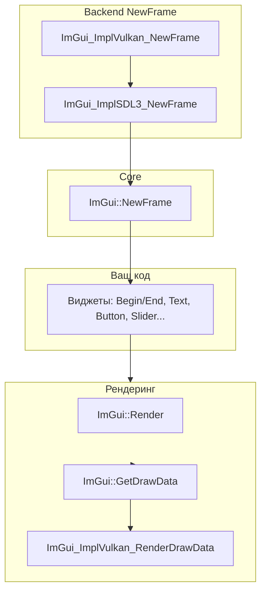
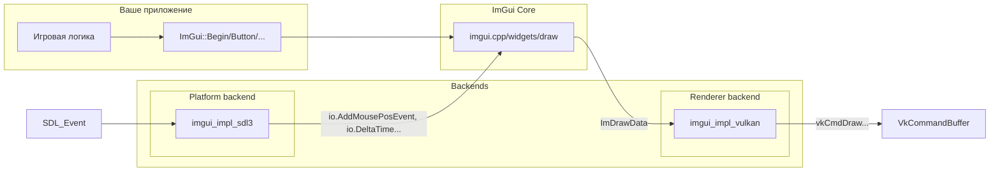
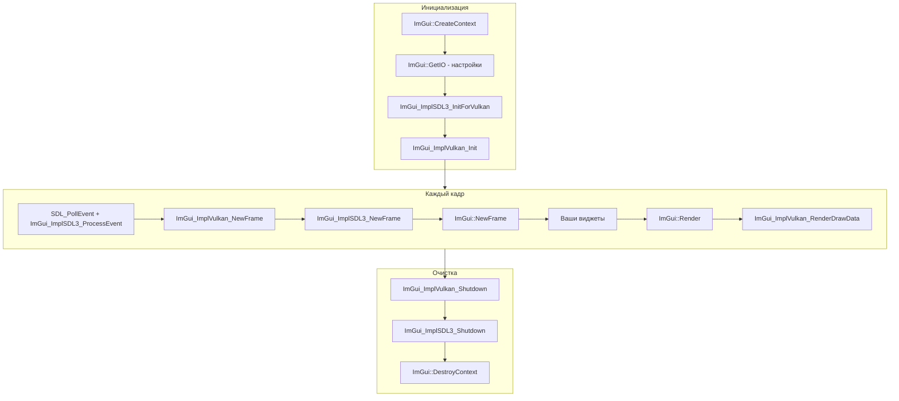

## Обзор Dear ImGui

<!-- anchor: 00_overview -->


**Dear ImGui** — библиотека графического интерфейса для C++ с архитектурой immediate mode. Используется для создания
инструментов отладки, редакторов и игровых UI. Отличается отсутствием сохранённого состояния виджетов: интерфейс
создаётся и отрисовывается каждый кадр заново.

Версия: **1.92+**
Исходники: [ocornut/imgui](https://github.com/ocornut/imgui)

## Основные возможности

- **Immediate mode архитектура** — виджеты создаются вызовами функций каждый кадр
- **Минимальные зависимости** — только стандартная библиотека C++
- **Кроссплатформенность** — Windows, Linux, macOS
- **Backend-архитектура** — раздельные Platform и Renderer backends
- **Отладочные инструменты** — встроенные демо-окна, метрики, инспектор стилей

## Типичное применение

- Debug UI для движков и приложений
- Инспекторы объектов и свойств
- Профилировщики и консоли
- Редакторы уровней и инструментов
- Внутриигровые меню и HUD

## Структура библиотеки

```
imgui/
├── imgui.cpp          # Ядро
├── imgui_draw.cpp     # Отрисовка
├── imgui_widgets.cpp  # Виджеты
├── imgui_tables.cpp   # Таблицы
├── backends/          # Platform и Renderer backends
│   ├── imgui_impl_sdl3.cpp
│   ├── imgui_impl_vulkan.cpp
│   └── ...
└── misc/              # Утилиты (cpp/imgui_stdlib.h и др.)
```

## Архитектура: Platform + Renderer

ImGui разделён на ядро и два типа backend'ов:

| Backend      | Назначение                                              | Примеры                 |
|--------------|---------------------------------------------------------|-------------------------|
| **Platform** | Ввод (мышь, клавиатура), размер окна, курсор, clipboard | SDL3, GLFW, Win32       |
| **Renderer** | Создание шрифтовой текстуры, отрисовка вершин           | Vulkan, OpenGL, DirectX |

Один Platform backend + один Renderer backend.

## Карта заголовков

| Заголовок                        | Содержимое                                            |
|----------------------------------|-------------------------------------------------------|
| `<imgui.h>`                      | Основной API: Context, Begin/End, виджеты             |
| `<imgui_internal.h>`             | Внутренние структуры (для продвинутого использования) |
| `<backends/imgui_impl_sdl3.h>`   | Platform backend для SDL3                             |
| `<backends/imgui_impl_vulkan.h>` | Renderer backend для Vulkan                           |
| `<misc/cpp/imgui_stdlib.h>`      | InputText с std::string                               |

## Основные понятия Dear ImGui

<!-- anchor: 02_concepts -->

## Immediate mode vs Retained mode

| Парадигма             | Как создаётся UI                                            | Где хранится состояние                          |
|-----------------------|-------------------------------------------------------------|-------------------------------------------------|
| **Retained**          | Создаёшь дерево виджетов один раз (конструкторы, setParent) | В вашем коде (узлы дерева, флаги)               |
| **Immediate (ImGui)** | Каждый кадр вызываешь `ImGui::Button("Click")` и т.д.       | Внутри ImGui. Вы не храните указатели на кнопки |

В immediate mode, если код не вызвал виджет — его нет. Нет отдельного «создания» и «уничтожения». Это упрощает
интеграцию: можно вызывать `ImGui::Begin("Debug")` только когда `show_debug == true`, и окно появится/исчезнет само.

## Цикл кадра ImGui



1. **ImGui_ImplVulkan_NewFrame()** — подготовка renderer backend
2. **ImGui_ImplSDL3_NewFrame()** — передача ввода (мышь, клавиатура) в ImGui, обновление `io.DeltaTime`,
   `io.DisplaySize`
3. **ImGui::NewFrame()** — начало нового кадра ImGui
4. **Виджеты** — `ImGui::Begin`, `ImGui::Text`, `ImGui::Button`, `ImGui::End` и т.д.
5. **ImGui::Render()** — генерация команд отрисовки
6. **ImGui::GetDrawData()** — получить `ImDrawData*`
7. **ImGui_ImplVulkan_RenderDrawData(draw_data, command_buffer)** — записать в Vulkan command buffer

Порядок NewFrame **важен**: сначала Renderer, затем Platform, затем `ImGui::NewFrame()`.

## Архитектура: Platform + Renderer

ImGui разделён на ядро и два типа backend'ов:



| Backend      | Назначение                                                                                                                | Пример реализации   |
|--------------|---------------------------------------------------------------------------------------------------------------------------|---------------------|
| **Platform** | Ввод (мышь, клавиатура, геймпад), размер окна, курсор, clipboard. Вызывает `io.AddMousePosEvent`, `io.AddKeyEvent` и т.д. | `imgui_impl_sdl3`   |
| **Renderer** | Создание шрифтовой текстуры, отрисовка вершин. Вызывает `vkCmdDraw*`, создаёт pipeline и descriptor sets.                 | `imgui_impl_vulkan` |

Один Platform backend + один Renderer backend.

## WantCaptureMouse и WantCaptureKeyboard

В приложениях часто требуется разделение ввода между UI и другой логикой. ImGui предоставляет флаги в `ImGuiIO`:

| Флаг                       | Значение                                                                | Типичное использование                     |
|----------------------------|-------------------------------------------------------------------------|--------------------------------------------|
| **io.WantCaptureMouse**    | `true` — ImGui «владеет» мышью (курсор над окном ImGui, перетаскивание) | Блокировать вращение камеры, клики по миру |
| **io.WantCaptureKeyboard** | `true` — ImGui «владеет» клавиатурой (поле ввода, фокус в окне ImGui)   | Блокировать WASD, горячие клавиши          |
| **io.WantTextInput**       | `true` — ImGui ожидает текст (IME, ввод символов)                       | Активировать системное поле ввода          |

### Пример обработки ввода

```cpp
void process_input(SDL_Event& event) {
    // Сначала передаём события в ImGui
    ImGui_ImplSDL3_ProcessEvent(&event);

    ImGuiIO& io = ImGui::GetIO();

    switch (event.type) {
        case SDL_EVENT_MOUSE_MOTION:
            if (!io.WantCaptureMouse) {
                // Обработка мыши только если ImGui не захватил её
            }
            break;

        case SDL_EVENT_KEY_DOWN:
            if (!io.WantCaptureKeyboard) {
                // Обработка клавиатуры только если ImGui не захватил её
            }
            break;
    }
}
```

### Отладка проблем с вводом

```cpp
// Дебаг-окно для отслеживания ввода
void debug_input_ui() {
    ImGuiIO& io = ImGui::GetIO();

    ImGui::Begin("Input Debug");
    ImGui::Text("WantCaptureMouse: %s", io.WantCaptureMouse ? "YES" : "NO");
    ImGui::Text("WantCaptureKeyboard: %s", io.WantCaptureKeyboard ? "YES" : "NO");
    ImGui::Text("WantTextInput: %s", io.WantTextInput ? "YES" : "NO");
    ImGui::Text("Mouse Pos: (%.1f, %.1f)", io.MousePos.x, io.MousePos.y);
    ImGui::End();
}
```

## ID Stack: PushID и PopID

ImGui различает виджеты по **ID** — хешу от строки в «стеке ID». В циклах виджеты получают один и тот же label и,
значит, один ID — возникает конфликт.

**Решение 1 — PushID/PopID:**

```cpp
for (int i = 0; i < items_count; i++) {
    ImGui::PushID(i);
    if (ImGui::Button("Delete"))
        delete_item(i);
    ImGui::PopID();
}
```

**Решение 2 — синтаксис "Label##id":** текст до `##` отображается, после — только для ID:

```cpp
ImGui::Button("Save##save_btn");
ImGui::Button("Load##load_btn");
```

**Решение 3 — PushID(const void*):** указатель как ID:

```cpp
for (const auto& item : items) {
    ImGui::PushID(&item);  // Указатель как ID
    ImGui::Text("Item: %s", item.name.c_str());
    ImGui::PopID();
}
```

Без `PushID` все кнопки в цикле получают один ID — ImGui воспринимает их как один виджет; клик «переключает» сразу все.

## Паттерн Begin/End

Многие функции ImGui работают парами Begin/End: `Begin`, `BeginMenu`, `BeginTable`, `BeginCombo`, `BeginPopup` и т.д.

**Важно:** для `BeginMenu`, `BeginTable`, `BeginCombo`, `BeginPopup` вызывайте соответствующий `End` **только если**
`Begin` вернул `true`:

```cpp
if (ImGui::Begin("MyWindow")) {
    // ...
}
ImGui::End();   // Begin/End окна — End всегда, даже при false

if (ImGui::BeginMenu("File")) {
    if (ImGui::MenuItem("Open")) { /* ... */ }
    ImGui::EndMenu();   // Только т.к. BeginMenu вернул true
}

if (ImGui::BeginTable("table", 3)) {
    // ...
    ImGui::EndTable();
}
```

Исключение: `Begin()` и `BeginChild()` — для них `End()` вызывают всегда.

## SetNext vs Set

Для позиции и размера окна есть две группы функций:

| Тип          | Функции                             | Когда вызывать                                  |
|--------------|-------------------------------------|-------------------------------------------------|
| **SetNext*** | SetNextWindowPos, SetNextWindowSize | **До** `Begin()` — применится к следующему окну |
| **Set***     | SetWindowPos, SetWindowSize         | **Внутри** `Begin()`/`End()` — к текущему окну  |

Рекомендуется **SetNext***: меньше побочных эффектов, применяется в начале кадра. `Set*` внутри Begin/End может вызывать
«дёргание» и артефакты.

```cpp
// Правильно: SetNextWindowPos до Begin
ImGui::SetNextWindowPos(ImVec2(100, 100), ImGuiCond_FirstUseEver);
ImGui::Begin("My Window");
ImGui::Text("Hello!");
ImGui::End();
```

## Общая схема жизненного цикла



---

## 07_glossary

<!-- anchor: 07_glossary -->

# Глоссарий Dear ImGui

Словарь терминов ImGui.

---

## Ядро

| Термин              | Объяснение                                                                                                                                                                                                   |
|---------------------|--------------------------------------------------------------------------------------------------------------------------------------------------------------------------------------------------------------|
| **Immediate mode**  | Парадигма UI: виджеты создаются в коде каждый кадр. Нет отдельного «создания» и «разрушения» — если код не вызвал `ImGui::Button()`, кнопки нет. Состояние хранится в ImGui, а не в вашем коде.              |
| **ImGuiContext**    | Непрозрачная структура контекста ImGui (состояние, окна, стили, шрифты). Создаётся через `ImGui::CreateContext()`, передаётся неявно через вызовы `ImGui::*`. Один контекст на приложение обычно достаточно. |
| **ImGuiIO**         | Структура ввода-вывода между вашим приложением и ImGui. Через неё передаются размер экрана, время кадра, позиция мыши, нажатия клавиш и т.д. Platform backend заполняет её в `ImGui_ImplXXX_NewFrame()`.     |
| **ImGuiPlatformIO** | Расширение ImGuiIO: доступ через `GetPlatformIO()`. Содержит хуки для clipboard, IME, кастомных backend-функций. Platform/Renderer backends регистрируют там свои колбэки.                                   |
| **ImGuiStyle**      | Визуальный стиль: цвета, отступы, скругления. `ImGui::GetStyle()` возвращает ссылку; можно менять поля напрямую или вызывать `ImGui::StyleColorsDark()` / `StyleColorsLight()`.                              |
| **ImGuiID**         | Уникальный идентификатор виджета (хеш строки в стеке ID). ImGui использует его для различения кнопок, окон и т.д. При конфликтах ID — неожиданное поведение; `PushID`/`PopID` помогает.                      |

---

## ID и состояние

| Термин                | Объяснение                                                                                                                                                                                                         |
|-----------------------|--------------------------------------------------------------------------------------------------------------------------------------------------------------------------------------------------------------------|
| **PushID / PopID**    | Стек ID для различения виджетов. В циклах: `PushID(i); ImGui::Button(...); PopID();`. Альтернатива — синтаксис `"Label##unique_id"` в label (текст до `##` виден, после — только ID).                              |
| **ImGuiCond**         | Условие применения для SetNextWindowPos/Size: `ImGuiCond_Once` (при первом применении), `ImGuiCond_FirstUseEver` (если ещё не было), `ImGuiCond_Always` (каждый кадр), `ImGuiCond_Appearing` (при появлении окна). |
| **Begin/End-паттерн** | Многие функции (Begin, BeginMenu, BeginTable, BeginCombo, BeginPopup) возвращают `bool`. Вызывать соответствующий `End` только если `Begin` вернул `true`. Исключение: `Begin()` окна — `End()` всегда.            |

---

## Окна и Layout

| Термин               | Объяснение                                                                                                                                                               |
|----------------------|--------------------------------------------------------------------------------------------------------------------------------------------------------------------------|
| **ImGuiWindowFlags** | Флаги окна для `Begin()`: `NoTitleBar`, `NoResize`, `NoMove`, `AlwaysAutoResize`, `NoDecoration` (без заголовка, resize и т.д.), `NoInputs` (без ввода), `MenuBar` и др. |
| **ImGuiChildFlags**  | Флаги дочернего окна для `BeginChild()`.                                                                                                                                 |
| **ImGuiTableFlags**  | Флаги таблицы для `BeginTable()`: `Borders`, `Resizable`, `Sortable`, `RowBg` и др.                                                                                      |

---

## Ввод

| Термин                  | Объяснение                                                                                                                                           |
|-------------------------|------------------------------------------------------------------------------------------------------------------------------------------------------|
| **WantCaptureMouse**    | `io.WantCaptureMouse == true` означает, что ImGui хочет получать ввод мыши (окно под курсором). Не передавайте события мыши в приложение, пока true. |
| **WantCaptureKeyboard** | `io.WantCaptureKeyboard == true` — ImGui «владеет» клавиатурой (например, поле ввода). Не передавайте клавиши в приложение.                          |
| **WantTextInput**       | `io.WantTextInput == true` — ImGui ожидает текстовый ввод. Активируйте IME/экранную клавиатуру.                                                      |
| **ImGuiConfigFlags**    | Флаги конфигурации в `io.ConfigFlags`: `NavEnableKeyboard`, `NavEnableGamepad`, `NoMouseCursorChange` и др.                                          |
| **ImGuiBackendFlags**   | Флаги возможностей backend в `io.BackendFlags`: `HasGamepad`, `HasMouseCursors`, `RendererHasVtxOffset`. Устанавливаются backend'ом.                 |

---

## Отрисовка

| Термин           | Объяснение                                                                                                                                                               |
|------------------|--------------------------------------------------------------------------------------------------------------------------------------------------------------------------|
| **ImDrawData**   | Результат `ImGui::Render()`: список команд отрисовки (вершины, индексы, текстуры, clip rect). Передаётся в `ImGui_ImplVulkan_RenderDrawData(draw_data, command_buffer)`. |
| **ImDrawList**   | Список draw-команд для одного окна (вершины + индексы). ImGui собирает их в ImDrawData. Используется при custom rendering через `ImGui::GetWindowDrawList()`.            |
| **ImTextureID**  | Низкоуровневый идентификатор текстуры. В Vulkan backend — `VkDescriptorSet`. Регистрация своих текстур: `ImGui_ImplVulkan_AddTexture(sampler, image_view, layout)`.      |
| **ImTextureRef** | Обёртка над ImTextureID или ImTextureData* (1.92+). Используется в `Image()`, `ImageButton()`.                                                                           |
| **ImFontAtlas**  | Атлас шрифтов: одна текстура со всеми глифами. `io.Fonts` — указатель. Backend загружает текстуру на GPU.                                                                |
| **ImFont**       | Загруженный шрифт. Используется с `PushFont()`/`PopFont()`.                                                                                                              |

---

## Типы данных

| Термин      | Объяснение                                                       |
|-------------|------------------------------------------------------------------|
| **ImVec2**  | Вектор 2D: `ImVec2(x, y)` — позиция/размер.                      |
| **ImVec4**  | Вектор 4D: `ImVec4(x, y, z, w)` — цвет (RGBA) или прямоугольник. |
| **ImColor** | Обёртка над ImVec4 для удобства работы с цветами.                |
| **ImU32**   | 32-bit unsigned int — упакованный цвет (RGBA).                   |

---

## Drag-and-drop

| Термин           | Объяснение                                                                                                                                                                                       |
|------------------|--------------------------------------------------------------------------------------------------------------------------------------------------------------------------------------------------|
| **ImGuiPayload** | Данные drag-and-drop. Возвращается из `AcceptDragDropPayload()`; поля `Data`, `DataSize`, `IsDataType("type")`. ImGui копирует данные при `SetDragDropPayload()`, хранит до завершения операции. |

---

## Оптимизации

| Термин               | Объяснение                                                                                                                                                           |
|----------------------|----------------------------------------------------------------------------------------------------------------------------------------------------------------------|
| **ImGuiListClipper** | Вспомогательный объект для отрисовки больших списков: вычисляет видимый диапазон (`DisplayStart`..`DisplayEnd`), чтобы не создавать виджеты для невидимых элементов. |

---

## Backends

| Термин                 | Объяснение                                                                                                                                                    |
|------------------------|---------------------------------------------------------------------------------------------------------------------------------------------------------------|
| **Backend (Platform)** | Код, отвечающий за ввод и окно: мышь, клавиатура, геймпад, курсор, размер дисплея. Примеры: `imgui_impl_sdl3`, `imgui_impl_glfw`, `imgui_impl_win32`.         |
| **Backend (Renderer)** | Код, отвечающий за отрисовку: создание шрифтовой текстуры, запись вершин и вызовы GPU. Примеры: `imgui_impl_vulkan`, `imgui_impl_opengl3`, `imgui_impl_dx11`. |

---

## Отладка

| Термин                      | Объяснение                                                                |
|-----------------------------|---------------------------------------------------------------------------|
| **ShowDemoWindow()**        | Демо-окно со всеми виджетами и примерами кода. Запускайте при разработке. |
| **ShowMetricsWindow()**     | Окно с метриками и внутренним состоянием ImGui.                           |
| **ShowIDStackToolWindow()** | Инструмент для отладки ID конфликтов.                                     |
