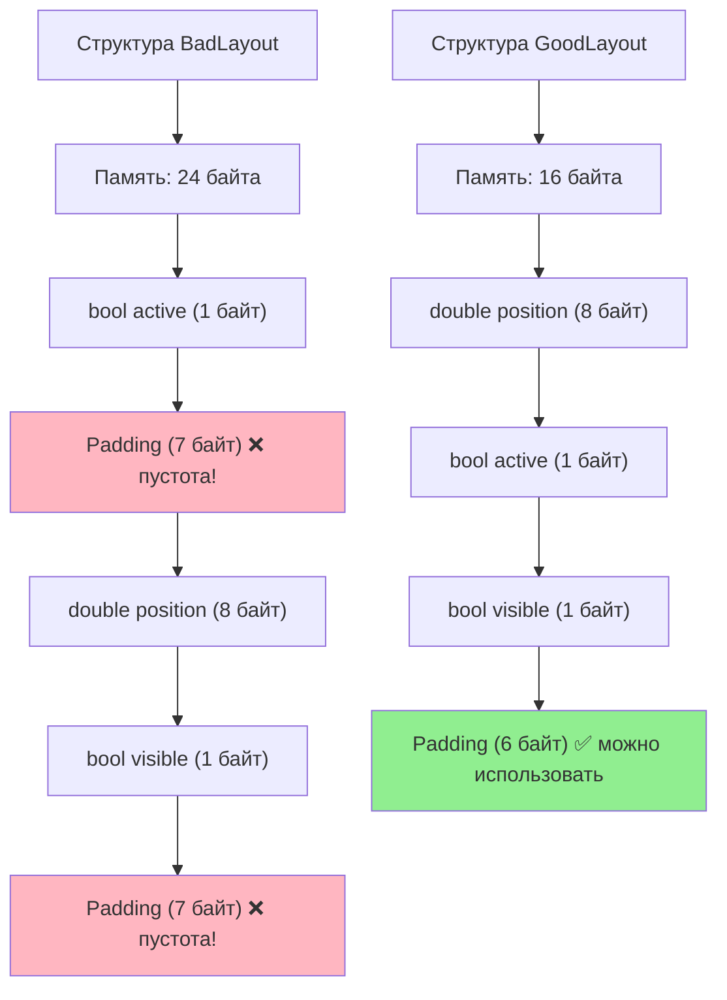

# Философия расположения данных: Паддинг и Выравнивание

Студенты знают про `sizeof()`, но они не знают про **padding** (выравнивание памяти). Если студент напишет структуру
`struct { bool a; double b; bool c; }`, компилятор сделает её размером **24 байта** (из-за пустот между полями). Если
переставить поля: `struct { double b; bool a; bool c; }`, она станет **16 байт**. При миллионе сущностей это 8 МБ
сэкономленной памяти и +30% к скорости кэша из воздуха.

---

## Почему компилятор добавляет padding?

Процессор читает память не по одному байту, а блоками (кэш-линиями по 64 байта). Для эффективности данные должны быть *
*выровнены** по границам, удобным для CPU.

**Правила выравнивания:**

- `char` (1 байт) — любое выравнивание
- `short` (2 байта) — чётные адреса
- `int` (4 байта) — адреса, кратные 4
- `double` (8 байт) — адреса, кратные 8
- `__m256` (32 байта) — адреса, кратные 32

Если данные не выровнены, процессор делает **два чтения** вместо одного. Это называется **misaligned access** и стоит
2–3× дороже.

> **Метафора:** Представь, что ты грузишь коробки в фургон. Коробки бывают маленькие (1 кг), средние (4 кг), большие (8
> кг). Фургон загружается паллетами по 8 кг. Если ты положишь маленькую коробку, потом большую, потом снова маленькую —
> между ними останутся пустоты (padding). А если положишь сначала все большие коробки, потом средние, потом засыплешь
> пустоты мелочью — фургон будет загружен плотно. Компилятор — это грузчик, который старается упаковать твои данные в
> «паллеты» памяти.

---

## Пример: как padding убивает память

```cpp
// ПЛОХО: наивная структура
struct BadLayout {
    bool active;      // 1 байт
    // 7 байт padding (пустота!)
    double position;  // 8 байт (требует выравнивания 8)
    bool visible;     // 1 байт
    // 7 байт padding (пустота!)
}; // Итого: 24 байта (используется только 10!)

// ХОРОШО: оптимизированная структура
struct GoodLayout {
    double position;  // 8 байт (выровнено по 8)
    bool active;      // 1 байт
    bool visible;     // 1 байт
    // 6 байт padding (но это в конце, можно использовать для других данных)
}; // Итого: 16 байт (экономия 33%!)
```

**Математика для 1 миллиона объектов:**

- `BadLayout`: 24 × 1,000,000 = 24 МБ
- `GoodLayout`: 16 × 1,000,000 = 16 МБ
- **Экономия:** 8 МБ (целый чанк вокселей!)

Но важнее не память, а **кэш**. 24 МБ данных хуже помещаются в кэш L3 (обычно 16–32 МБ). Больше cache misses → больше
обращений к RAM (100+ тактов вместо 10).

---

## Mermaid диаграмма: Padding в памяти



**Объяснение диаграммы:**

- **BadLayout:** 14 байт полезных данных + 10 байт пустоты (42% отходов!)
- **GoodLayout:** 10 байт полезных данных + 6 байт пустоты (можно использовать для выравнивания массива)
- **Красные блоки:** Бесполезный padding, который только занимает место
- **Зелёный блок:** Padding в конце структуры, который можно использовать при размещении в массиве

---

## Правила оптимизации структур

### 1. Сортируй поля по размеру (от большего к меньшему)

```cpp
// ПРАВИЛО: double → int → short → char → bool
struct Optimized {
    double big;      // 8 байт
    int medium;      // 4 байта
    short small;     // 2 байта
    char tiny;       // 1 байт
    bool flag;       // 1 байт
    // 0 байт padding (идеально!)
}; // 16 байт, выровнено по 8
```

### 2. Используй `alignas` для принудительного выравнивания

```cpp
struct CacheLineAligned {
    alignas(64) float data[16]; // Выровнено по границе кэш-линии
    // Гарантированно попадает в одну кэш-линию
};
```

### 3. `#pragma pack` — осторожно!

```cpp
#pragma pack(push, 1) // Убрать весь padding
struct TightPacked {
    bool a;
    double b; // Опасно: misaligned access!
    bool c;
};
#pragma pack(pop) // Вернуть нормальное выравнивание
```

**Проблема:** Без padding `double b` может оказаться по невыровненному адресу. Чтение будет работать, но медленно (2
чтения вместо 1).

**Когда использовать:** Только для сетевых пакетов или файловых форматов, где каждый байт на счету.

---

## Hot/Cold splitting: разделение горячих и холодных данных

Не все поля структуры используются часто. Некоторые (например, `last_modified_time`) читаются раз в кадр. Другие (
например, `position`) читаются каждый тик физики.

```cpp
// ПЛОХО: всё в одной структуре
struct Entity {
    Vec3 position;      // Горячее (читается каждый кадр)
    Quat rotation;      // Горячее
    Material material;  // Горячее
    time_t created_at;  // Холодное (читается при создании)
    string debug_name;  // Холодное (только в редакторе)
    // ...
};

// ХОРОШО: Hot/Cold splitting
struct EntityHot {
    Vec3 position;
    Quat rotation;
    Material material;
    // Маленькая структура, помещается в кэш
};

struct EntityCold {
    time_t created_at;
    string debug_name;
    // Большая структура, живёт в отдельном массиве
};

// Связь через индекс
EntityHot hot_entities[MAX_ENTITIES];
EntityCold cold_entities[MAX_ENTITIES];
```

**Преимущества:**

- Горячие данные плотно упакованы → лучше использование кэша
- Холодные данные можно хранить в отдельной памяти (даже на диске)
- Можно обновлять горячие данные, не трогая холодные

> **Метафора:** Представь кухню ресторана. Ножи, сковородки, ингредиенты для текущих заказов (горячие данные) лежат на
> столешнице (кэш L1). Архив рецептов, отчёты за прошлый месяц, сертификаты поставщиков (холодные данные) — в шкафу (RAM)
> или архиве (диск). Повар (процессор) работает быстро, потому что всё нужное под рукой.

---

## SoA (Structure of Arrays) vs AoS (Array of Structures)

Это фундаментальный выбор в Data-Oriented Design. Подробнее о философии DOD и SoA читай
в [Data‑Oriented Design](../../02_paradigms/02_dod-philosophy.md).

```cpp
// AoS (традиционный ООП)
struct Particle {
    Vec3 position;
    Vec3 velocity;
    float lifetime;
};
Particle particles[1000];

// SoA (DOD)
struct Particles {
    Vec3 positions[1000];
    Vec3 velocities[1000];
    float lifetimes[1000];
};
```

**Когда использовать SoA:**

- Обрабатываешь все объекты одним алгоритмом (физика, рендеринг)
- Нужна векторизация (SIMD)
- Только часть полей нужна в hot path

**Когда использовать AoS:**

- Объекты обрабатываются индивидуально (AI, логика)
- Нужна локальность при случайном доступе
- Все поля используются вместе

---

## Практические инструменты

### 1. `alignof` и `offsetof`

```cpp
struct Test {
    bool a;
    double b;
    bool c;
};

static_assert(alignof(Test) == 8); // Выравнивание структуры
static_assert(offsetof(Test, b) == 8); // Смещение поля b
static_assert(sizeof(Test) == 24); // Размер структуры
```

### 2. Compiler Explorer (Godbolt)

Смотри ассемблерный код. Компилятор часто добавляет инструкции для работы с невыровненными данными.

### 3. `-Wpadded` (Clang/GCC)

Включает предупреждения о padding:

```bash
clang++ -Wpadded -c file.cpp
# warning: padding struct 'Test' with 7 bytes
```

### 4. Tracy Memory Profiler

Показывает, сколько памяти занимают твои структуры и где padding.

---

## Золотые правила

1. **Сортируй поля по убыванию размера:** `double` → `int64_t` → `int` → `short` → `char` → `bool`
2. **Используй `alignas` для критичных данных:** кэш-линии, SIMD, GPU буферы
3. **Hot/Cold splitting:** разделяй часто и редко используемые данные
4. **Выбирай SoA для batch processing:** когда обрабатываешь тысячи объектов одним алгоритмом
5. **Измеряй:** `sizeof()`, `alignof()`, профилируй кэш-промахи

> **Метафора итоговая:** Упаковка чемодана в отпуск. Сначала кладёшь большие вещи (джинсы, куртки), потом средние (
> футболки, носки), потом забиваешь щели мелочью (носки, зарядки). Если сделать наоборот — останется куча пустот, и
> чемодан не закроется. Память — это чемодан. Данные — это вещи. Компилятор — это твой бесплатный упаковщик, но только
> если ты дашь ему правильный порядок.

---

*"Память не бесконечна. Кэш ещё меньше. Каждый байт padding — это преступление против производительности."*
