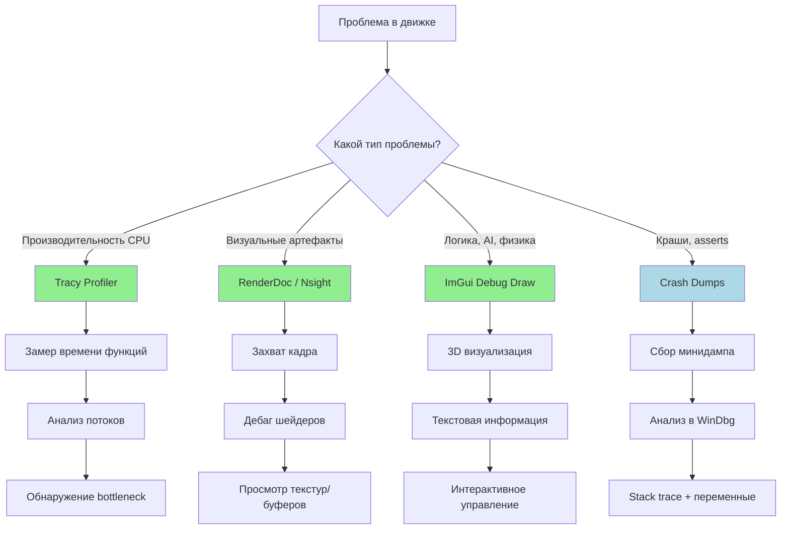

# Философия отладки: Чёрный ящик и Телеметрия

Студенты привыкли ставить `breakpoint` в IDE и ходить по шагам (F10). В многопоточном Job System на 10 000 файберов или
в Mesh-шейдере на миллион вызовов брейкпоинты не работают — всё зависает, контекст теряется. В нашем движке мы делаем
сдвиг парадигмы: от "остановки времени" к **Телеметрии и Визуализации**.

---

## Почему брейкпоинты не работают в реальном времени?

### 1. Многопоточность

Job System запускает тысячи задач параллельно. Если остановить один поток, остальные продолжают работать. Они
заблокируют мьютексы, deadlock неизбежен.

### 2. GPU

Шейдеры выполняются на тысячах ядер GPU. Невозможно "остановить" GPU для дебага. Даже если бы можно было — состояние
потерялось бы за микросекунды.

### 3. Время

Игровой движок должен выдавать 60 FPS (16.6 мс на кадр). Остановка на 1 секунду — это пропуск 60 кадров. Игрок увидит
заморозку.

### 4. Детерминизм

Остановка меняет timing. Гонки данных (race conditions) проявляются только при определённом порядке выполнения.
Брейкпоинт ломает этот порядок → баг исчезает.

> **Метафора:** Представь, что ты пытаешься починить летящий самолёт, поставив его на паузу. Ты не можешь: 1) Самолёт
> упадёт, 2) Двигатели перегреются, 3) Пассажиры запаникуют. Вместо этого у пилота есть приборная панель (телеметрия) и
> камеры на крыльях (визуализация). Он видит проблему в реальном времени и принимает решения, не останавливая полёт.

---

## Три столпа современной отладки

### 1. Телеметрия (Tracy Profiler)

Tracy — это не профайлер в классическом смысле. Это **окно в работу движка в реальном времени**.

```cpp
#include <tracy/Tracy.hpp>

void update_physics() {
    ZoneScopedN("Physics Update"); // Tracy отслеживает эту зону

    // ... физика ...

    FrameMark; // Отметка конца кадра
}
```

**Что даёт Tracy:**

- Визуализация всех потоков (таймлайн)
- Замер времени каждой функции
- Обнаружение простаивающих потоков
- Анализ использования кэша
- Трассировка аллокаций памяти

**Преимущества:**

- Нет оверхеда в релизе (макросы превращаются в `(void)0`)
- Работает в реальном времени
- Можно подключиться к уже работающему движку

### 2. Визуализация (ImGui + Debug Draw)

Мы рисуем отладочную информацию прямо поверх игрового мира.

```cpp
void debug_draw_colliders() {
    for (const auto& collider : colliders) {
        // Рисуем bounding box
        debug_draw::aabb(collider.bounds, Color::red);

        // Рисуем нормали
        debug_draw::arrow(collider.center, collider.normal, Color::green);

        // Выводим текст в 3D пространстве
        debug_draw::text_3d(collider.center,
            fmt::format("ID: {}, Mass: {:.1f}", collider.id, collider.mass));
    }
}
```

**Что можно визуализировать:**

- Коллайдеры и физические тела
- Пути AI (pathfinding)
- Зоны освещения и тени
- Границы чанков вокселей
- Производительность систем (FPS, memory usage)

### 3. Инструменты GPU (RenderDoc, Nsight)

Для дебага шейдеров и GPU пайплайна:

```cpp
// Вставка маркеров для RenderDoc
void render_scene() {
    glPushDebugGroup(GL_DEBUG_SOURCE_APPLICATION, 0, -1, "Main Scene");
    // ... рендеринг ...
    glPopDebugGroup();

    // Или для Vulkan
    vkCmdBeginDebugUtilsLabelEXT(cmd, "Main Scene");
    vkCmdEndDebugUtilsLabelEXT(cmd);
}
```

**Возможности:**

- Захват одного кадра (frame capture)
- Пошаговое выполнение шейдеров
- Просмотр текстур, буферов, дескрипторов
- Анализ bottlenecks в GPU пайплайне

---

## Mermaid диаграмма: Пайплайн отладки



**Объяснение диаграммы:**

- **Tracy Profiler:** Для проблем производительности CPU (медленные функции, deadlocks)
- **RenderDoc/Nsight:** Для проблем GPU (артефакты рендеринга, медленные шейдеры)
- **ImGui Debug Draw:** Для проблем логики (неправильное поведение AI, физики)
- **Crash Dumps:** Для крашей (сбор информации после падения)

---

## Паттерны отладки в реальном времени

### 1. "Летающая камера" (Free Camera)

```cpp
class DebugCamera {
public:
    void update(float dt) {
        if (ImGui::IsKeyDown(ImGuiKey_F3)) {
            // Режим свободного полёта
            m_position += m_velocity * dt;
            m_rotation += m_rotation_speed * dt;
        }
    }

    void draw_ui() {
        ImGui::Begin("Debug Camera");
        ImGui::Text("Pos: %.1f, %.1f, %.1f",
            m_position.x, m_position.y, m_position.z);
        ImGui::SliderFloat("Speed", &m_speed, 0.1f, 100.0f);
        ImGui::End();
    }
};
```

Позволяет "пролететь" в любую точку мира для инспекции.

### 2. "Замедление времени" (Time Scale)

```cpp
float g_time_scale = 1.0f;

void update_game(float dt) {
    float scaled_dt = dt * g_time_scale;
    update_physics(scaled_dt);
    update_ai(scaled_dt);
}

// В ImGui
ImGui::SliderFloat("Time Scale", &g_time_scale, 0.0f, 2.0f);
```

Замедление в 10 раз (time_scale = 0.1) позволяет рассмотреть быстрые процессы.

### 3. "Изоляция систем" (System Toggle)

```cpp
bool g_enable_physics = true;
bool g_enable_ai = true;
bool g_enable_rendering = true;

void update_frame(float dt) {
    if (g_enable_physics) update_physics(dt);
    if (g_enable_ai) update_ai(dt);
    if (g_enable_rendering) render_frame();
}

// В ImGui
ImGui::Checkbox("Physics", &g_enable_physics);
ImGui::Checkbox("AI", &g_enable_ai);
ImGui::Checkbox("Rendering", &g_enable_rendering);
```

Позволяет отключать системы по одной для локализации проблемы.

### 4. "Телепортация объектов" (Object Warp)

```cpp
void debug_teleport_to_object(EntityId id) {
    auto* transform = world.get_component<Transform>(id);
    if (transform) {
        g_debug_camera.set_position(transform->position);
        g_debug_camera.set_rotation(transform->rotation);
    }
}
```

Быстрый переход к проблемному объекту.

---

## Логирование нового поколения

Мы не используем `printf` или `std::cout`. Наш логгер:

```cpp
PV_LOG_TRACE("Loading texture: {}", path);      // Детальная отладка
PV_LOG_DEBUG("Chunk generated: {}", coord);     // Отладка
PV_LOG_INFO("Player joined: {}", player_name);  // Информация
PV_LOG_WARNING("Low memory: {} MB free", free_mb); // Предупреждение
PV_LOG_ERROR("Failed to load: {}", path);       // Ошибка
PV_LOG_FATAL("GPU device lost");                // Критическая ошибка
```

**Особенности:**

- **Structured logging:** JSON формат для машинного анализа
- **Async writing:** Не блокирует основной поток
- **Rotating files:** Автоматическая ротация логов
- **Runtime filtering:** Можно менять уровень логирования без перезапуска
- **Context capture:** Автоматически добавляет thread ID, timestamp, stack trace

---

## Crash Dumps и постмортем анализ

Когда движок падает, мы собираем максимум информации:

```cpp
void setup_crash_handler() {
    SetUnhandledExceptionFilter(crash_handler);
}

LONG WINAPI crash_handler(EXCEPTION_POINTERS* info) {
    // Создаём минидамп
    MiniDumpWriteDump(...);

    // Сохраняем последние N строк лога
    save_recent_logs();

    // Сохраняем состояние ECS
    save_entity_snapshot();

    // Показываем friendly сообщение
    show_crash_dialog();

    return EXCEPTION_EXECUTE_HANDLER;
}
```

**Что сохраняем в дамп:**

- Stack trace всех потоков
- Значения переменных в момент краша
- Последние 1000 строк лога
- Снимок состояния игрового мира
- Информацию о системе (CPU, GPU, RAM)

---

## Интеграция с CI/CD

Отладка начинается не когда баг найден, а когда он написан.

### 1. Статический анализ

```yaml
# .github/workflows/analysis.yml
- uses: sonarsource/sonarqube-scan-action@v1
- uses: reviewdog/action-clang-tidy@v1
```

### 2. Sanitizers

```cmake
target_compile_options(projectv PRIVATE
    -fsanitize=address
    -fsanitize=undefined
    -fsanitize=thread
)
```

### 3. Unit тесты с покрытием

```cpp
TEST(Physics, CollisionDetection) {
    World world;
    auto entity = world.create();
    world.add<Collider>(entity, Sphere{1.0f});

    // Тестируем коллизию
    auto result = physics::check_collision(entity, entity);
    EXPECT_FALSE(result.collided);
}
```

---

## Золотые правила

1. **Никаких брейкпоинтов в многопоточном коде.** Используй Tracy.
2. **Визуализируй, не выводи в консоль.** Рисуй bounding boxes, стрелки, текст.
3. **Логгируй структурированно.** JSON, а не plain text.
4. **Готовься к крашам.** Минидампы должны содержать всю информацию.
5. **Отладка — часть дизайна.** Системы должны быть наблюдаемыми с рождения.

> **Метафора итоговая:** Представь, что ты не врач в операционной (брейкпоинты), а диспетчер в центре управления
> полётами (телеметрия). У тебя на экранах: карта самолётов (Tracy), камеры на борту (Debug Draw), показания датчиков (
> логи). Ты видишь проблему в реальном времени, не останавливая полёт. Ты можешь дать команду "снизить скорость" (time
> scale), "отключить систему" (system toggle), "перелететь к объекту" (teleport). Это и есть современная отладка.

---

*"Хороший движок не тот, в котором нет багов. Хороший движок — тот, в котором баги быстро находятся и фиксируются."*
