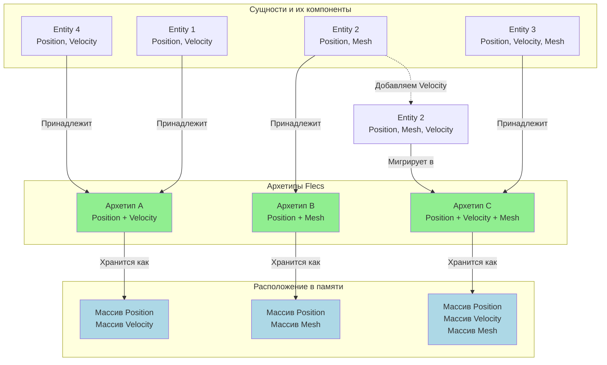

# ECS: композиция вместо наследования, база данных поликлиники

В нашем движке Entity Component System (ECS) — это не просто библиотека. Это философский выбор в пользу композиции (
`Has‑A`) вместо наследования (`Is‑A`).

Мы пишем ECS код не потому что «все так делают», а потому что это **масштабируемо** и **эффективно** для сложных игровых
миров.

---

## Почему не ООП?

### Проблема «Алмазного Наследования»

Классическое наследование часто приводит к запутанным иерархиям, где невозможно переиспользовать код без боли.

```cpp
// Классическая иерархия
class Entity { ... };
class Movable : public Entity { vec3 pos; };
class Renderable : public Entity { Mesh mesh; };
class Player : public Movable, public Renderable { ... };

// А что если мне нужен просто рендеринг без движения?
// Начинается копипаста.
// А если Player наследует от обоих, и оба наследуют Entity?
// Virtual Base Classes, Diamond Problem...
```

> **Для понимания:** «Алмазное наследование» — это когда класс наследует от двух классов, которые оба наследуют от
> одного базового. На диаграмме это выглядит как ромб (алмаз). Проблема: базовый класс дублируется. `Entity` существует в
`Player` дважды? Или один раз? C++ требует `virtual` наследования, что добавляет ещё больше косвенности и overhead. А в
> рантайме — два `vtable` pointer'а, путаница с `this`, и головная боль при кастах. Это не теоретическая проблема — это
> реальность любого большого ООП‑проекта.

### Решение ECS

Мы не создаём классы. Мы **собираем сущности из компонентов** как конструктор LEGO.

```cpp
// Компоненты (Данные)
struct Position { vec3 val; };
struct Mesh { ... };
struct PlayerTag {};

// Сущность (ID)
auto entity = world.entity();

// Композиция (Has‑A)
entity.add<Position>();
entity.add<Mesh>();
entity.add<PlayerTag>();

// Системы (Логика)
// RenderingSystem работает со ВСЕМИ сущностями, у которых есть Position и Mesh
```

---

## Принципы ECS в нашем движке

### 1. Компоненты — только данные

Компоненты (Component) — это простые структуры данных (`struct`).

* **POD (Plain Old Data):** `float`, `int`, `vec3`.
* **Никакой логики:** Компонент не знает, как его обрабатывают.
* **Никаких зависимостей:** Компонент `Position` не зависит от `Mesh`.

> **Для понимания:** В классическом ООП объект — это данные + методы. `Player.Move()`, `Enemy.Attack()`. Кажется
> логичным. Но это нарушает принцип разделения данных. Если у тебя 10 000 врагов, и у каждого свой метод `Attack()` — ты
> не можешь обработать их всех одним линейным проходом. Ты вынужден вызывать виртуальный метод для каждого, прыгая по
> vtable. ECS разделяет: данные лежат в компонентах, логика — в системах. Система `AttackSystem` берёт массив компонентов
`Health` и `Attack` и обрабатывает их одним циклом. Никаких виртуальных вызовов.

### 2. Системы — чистая логика

Системы (System) — это функции, обрабатывающие данные.

* **Stateless:** Система не хранит состояние сущностей.
* **Query‑based:** Система запрашивает у мира: «Дай мне все сущности с `Position` и `Velocity`».
* **Single Responsibility:** Одна система делает одну вещь (`MovementSystem`, `RenderingSystem`).

### 3. Сущности — просто ID

Сущность (Entity) — это уникальный идентификатор (`uint64_t`).

* Это не объект в памяти.
* Это не контейнер указателей.
* Это просто **ключ** для поиска компонентов в базе данных ECS (Flecs).

> **Метафора:** Представь базу данных больницы. Пациент — это не объект с методами. Пациент — это ID в базе. Карты в
> разных кабинетах: карта болезней, карта прививок, карта визитов. Когда врач (система) работает с пациентом, он не
> вызывает `patient.treat()`. Он берёт нужные карты (компоненты) и обновляет их. Анализы отдельно, диагнозы отдельно,
> назначения отдельно. Нет монолитного объекта «Пациент» с сотней методов. Есть данные, и есть специалисты, которые эти
> данные обрабатывают.

---

## Композиция в действии: воксельный мир

### Пример: воксельный чанк

```cpp
// Компоненты
struct VoxelData { vector<uint32_t> voxels; };
struct ChunkPos { ivec3 val; };
struct NeedsMeshing {}; // Тег‑компонент
struct IsVisible {};    // Тег‑компонент

// Создание
auto chunk = world.entity()
    .add<VoxelData>()
    .add<ChunkPos>({0, 0, 0})
    .add<NeedsMeshing>(); // Система мешинга подхватит этот чанк

// Логика
// MeshingSystem: Видит NeedsMeshing → Генерирует меш → Удаляет NeedsMeshing
// CullingSystem: Проверяет видимость → Добавляет/Удаляет IsVisible
// RenderSystem: Видит IsVisible → Рисует
```

**Гибкость:** Мы можем добавить `IsVisible` любому объекту (сундуку, монстру), и он начнёт обрабатываться системой
рендеринга (при наличии меша), не меняя иерархию классов.

---

## ECS и DOD: идеальный симбиоз

ECS (Flecs) автоматически организует компоненты в памяти оптимальным образом (SoA).

* **Архетипы (Archetypes):** Сущности с одинаковым набором компонентов хранятся вместе.
* **Кэш‑локальность:** Итерация по компонентам в системе линейна и кэш‑дружелюбна.
* **Параллелизм:** Системы, работающие с разными компонентами, могут выполняться параллельно без блокировок.

Мы используем ECS, потому что это **архитектура, которая не боится сложности**.

> **Для понимания:** Архетип — это уникальная комбинация компонентов. Все сущности с `[Position, Velocity]` лежат в
> одном массиве. Все с `[Position, Mesh]` — в другом. Когда система запрашивает «дай мне все с Position и Velocity», она
> получает плотный массив без мусора. Никаких `if (entity.has<Position>())` — фильтрация происходит на уровне архитектуры,
> а не в рантайме. Это и есть симбиоз ECS и DOD: ECS даёт архитектурную структуру, DOD — оптимальную укладку данных.

---

## Почему ECS масштабируется?

### Добавление фич без переписывания кода

Хочешь добавить физику? Добавь компонент `PhysicsBody` нужным сущностям. Система `PhysicsSystem` автоматически начнёт их
обрабатывать.

Хочешь добавить горение? Добавь компонент `OnFire`. Система `FireSystem` обновит его.

Никаких изменений в иерархии классов. Никаких переписываний базового кода.

### Оптимизация через данные

Если система `RenderingSystem` работает только с `Position` и `Mesh`, она не видит другие компоненты. Кэш не засоряется.
Производительность растёт линейно с количеством сущностей.

### Тестируемость

Система — это чистая функция. Чтобы её протестировать, достаточно подать на вход массив компонентов и проверить выход.
Никаких моков, никаких сложных setup.

---

## Когда не использовать ECS?

ECS — не серебряная пуля. Он плохо подходит для:

* **UI:** Окна, кнопки, текстовые поля — здесь классическое ООП с наследованием работает лучше.
* **Сложная бизнес‑логика:** Если у тебя 10 объектов с уникальным поведением, ECS добавит сложности без выгоды.
* **Прототипирование:** Для быстрого прототипа проще написать пару классов, чем настраивать ECS.

Но для **ядра движка** — рендеринга, физики, AI, обработки тысяч сущностей — ECS незаменим.

---

## Mermaid диаграмма: Архетипы Flecs и миграция сущностей



**Объяснение диаграммы:**

- **Архетипы (сверху):** Группируют сущности по одинаковым наборам компонентов
- **Сущности (слева):** Каждая сущность принадлежит одному архетипу
- **Память (справа):** Каждый архетип хранит компоненты в отдельных массивах (SoA)
- **Миграция (стрелка внизу):** При добавлении компонента `Velocity` к Entity 2, она мигрирует из Архетипа B в Архетип C

**Преимущества:**

1. **Кэш-локальность:** Система, работающая с `Position + Velocity`, читает только массивы M1
2. **Быстрая итерация:** Нет проверок `if (has<Component>)` — все сущности в архетипе гарантированно имеют нужные
   компоненты
3. **Автоматическая оптимизация:** Flecs сам управляет памятью и миграцией

---

*«Не спрашивай, кем является объект. Спроси, из чего он состоит.»*
