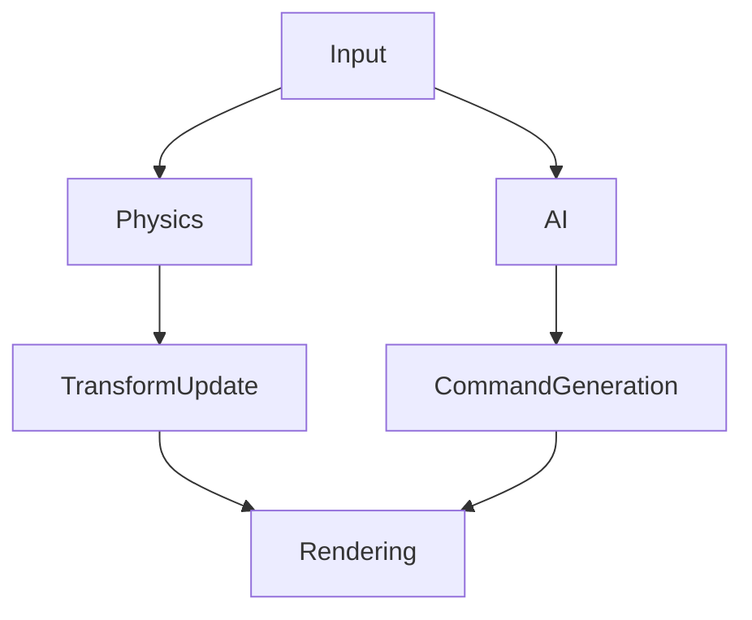

# Философия конкурентности: Job System вместо потоков ОС, 8 мастеров и тысячи карточек задач

В 2026 году процессор — это не одно быстрое ядро, а 16–32 «медленных». Чтобы утилизировать их все, нам нужна правильная
модель. **`std::thread` — это для ОС. Fiber — это для движка.**

---

## Проблема с `std::thread`

Создание потока ОС — это дорого (сискол, аллокация стека 1 MB+). Переключение контекста (context switch) — это
катастрофа для кэша (тысячи циклов). Если у вас 1000 задач, создавать 1000 потоков — самоубийство.

> **Для понимания:** `std::thread` — это поток операционной системы. Создание потока требует системного вызова (
> syscall), аллокации стека (обычно 1 MB), регистрации в планировщике ОС. Это дорого — микросекунды. Переключение между
> потоками ещё дороже: нужно сохранить все регистры, переключить контекст, обновить TLB (кэш адресов). В процессе теряется
> кэш L1/L2. Для сервера с миллисекундными задержками это норм. Для игры с 16.6 ms на кадр — это смерть.

---

## Job System & Fibers

Мы используем архитектуру **M:N Threading**:

* **N Worker Threads:** По одному на логическое ядро CPU (минус 1–2 для OS/Audio). Эти потоки никогда не спят и никогда
  не блокируются (по возможности).
* **M Fibers (Jobs):** Легковесные задачи с крошечным стеком (64 KB). Их тысячи.

> **Метафора:** Представь завод с 8 опытными мастерами (OS Threads). Они стоят у конвейера. Задач (джобов) — тысячи.
>
> **Подход `std::thread`:** Для каждой задачи нанимаем нового мастера. 1000 задач = 1000 мастеров. Но мастер требует
> свой кабинет (1 MB стека), его нужно оформить в HR (syscall) — это дорого и долго. К тому же, мастеров некуда посадить —
> мест 16.
>
> **Подход M:N Fibers:** 8 мастеров работают всегда. Задачи — это карточки в стопке (fibers, стек 64 KB). Мастер берёт
> карточку, делает работу. Если карточка говорит «подожди данные от другой задачи» — мастер **не стоит сложа руки**. Он
> откладывает карточку и берёт следующую из стопки. Мастера (потоки ОС) всегда заняты, карточки (fibers) ждут в очереди.
> Переключение карточки — мгновенное, переключение мастера — долгое.
>
> **Результат:** CPU загружен на 100%, переключений контекста ОС — ноль.

### Как это работает:

1. Вы создаёте задачу (Job): «Обновить физику для чанка #42».
2. Задача кладётся в очередь (Global Queue или Thread‑Local Deque).
3. Свободный Worker берёт задачу и выполняет её.
4. Если задача ждёт другую задачу (Dependency), текущий файбер «засыпает» (yield), но поток **не блокируется**. Он берёт
   другую задачу.

---

## Lock‑Free Data Structures

Мьютексы (`std::mutex`) — это зло. Они заставляют поток спать (syscall), убивая производительность. В Job System мы
используем:

1. **Work Stealing Deques:** Каждый воркер имеет свою очередь. Если она пуста, он «крадёт» задачу у соседа. (C++
   `std::atomic` + CAS).
2. **MPSC/MPMC Queues:** Для общения между системами.

> **Для понимания:** Mutex — это «туалет с замком». Один человек зашёл, закрыл дверь, остальные ждут. Пока ждут — они
> ничего не делают. В Job System мы не ждём. Если туалет занят — идём работать в другой комнате. Work Stealing — это когда
> у каждого работника своя очередь задач. Если твоя очередь пуста — ты берёшь задачу у соседа. Никто не простаивает.

> **Метафора:** Mutex — это болевая точка многопоточности. Когда 8 потоков пытаются захватить один mutex, они
> выстраиваются в очередь. Первый взял — 7 ждут. Второй взял — 6 ждут. Это не параллелизм, это сериализация. Lock‑free
> структуры позволяют всем работать одновременно, координируясь через атомарные операции. Сложнее написать, но в разы
> быстрее.

---

## Task Graph (DAG)

Кадр — это не список последовательных функций, а **Направленный Ациклический Граф (DAG)** зависимостей.

Движок строит этот граф и скармливает его Job System. Системы, которые не зависят друг от друга, выполняются параллельно
автоматически.

> **Для понимания:** Вместо того чтобы писать код последовательно: «сначала физика, потом AI, потом рендеринг», мы
> описываем зависимости: «рендеринг требует результат физики и AI». Job System сама решает, что можно выполнить
> параллельно. Физика и AI не зависят друг от друга — значит, выполняются одновременно на разных ядрах. Это автоматический
> параллелизм: ты описываешь *что* нужно сделать, система решает *как*.

---

## Data Racing

В такой системе Data Race — главный враг. Мы решаем это архитектурно:

* **Double Buffering:** Читаем из State N, пишем в State N+1.
* **Partitioning:** Разные чанки обрабатываются разными джобами независимо.
* **Read‑Only Components:** Большинство систем только читают данные.

> **Для понимания:** Data Race — это когда два потока одновременно читают и пишут одну память без синхронизации.
> Результат непредсказуем: могут прочитать мусор, могут перезаписать друг друга. Мьютексы решают проблему, но убивают
> производительность. Лучшее решение — не делить данные вообще. Double Buffering: один буфер для чтения, другой для
> записи. Никаких гонок. Partitioning: каждый поток работает со своим куском данных. Read‑Only: если никто не пишет, гонки
> не бывает.

> **Метафора:** Представь библиотеку. Data Race — это когда два человека одновременно пытаются читать и писать одну
> книгу. Один пишет «Вася», другой в это же время пишет «Петя». Результат: «Вася» или «Петя» или «Вася» с частью от
> «Петя». Хаос.
>
> **Double Buffering:** Две одинаковые книги. Один пишет в книгу А, другой читает из книги Б. Когда первый закончил —
> книги меняются местами. Никто не мешает друг другу.
>
> **Partitioning:** Библиотека разделена на секции. Каждый библиотекарь работает в своей секции. Никаких конфликтов.

---

## Почему не `std::async`?

`std::async` — это абстракция над потоками ОС или thread pool. Она не даёт контроля над планированием, не умеет в
fibers, не строит граф зависимостей. Это инструмент для простых задач, не для high‑performance движка.

Мы используем **stdexec** (Senders/Receivers) — стандарт C++26 для асинхронного программирования. Он даёт:

- Композицию задач через операторы (`then`, `when_all`, `when_any`)
- Автоматическое построение графа зависимостей
- Переносимый execution context (CPU, GPU, сеть)

---

## Практика: как мы организуем работу

### 1. Разделение данных

Каждая система работает со своим набором компонентов. Если система только читает `Position` — она может работать
параллельно с системой, которая пишет `Velocity`.

### 2. Чанкование

Мир разбит на чанки. Каждый чанк обрабатывается независимым джобом. Нет гонок между чанками.

### 3. Frame‑Based синхронизация

Вместо fine‑grained синхронизации (мьютексы на каждый объект) мы синхронизируемся на границах кадров. Кадр N читает
данные, кадр N+1 пишет. Double buffering решает все проблемы.

### 4. Профилирование

Tracy показывает, какие воркеры простаивают, какие очереди переполнены, где есть contention. Мы оптимизируем не на глаз,
а по данным.

---

## Итог: потоки как ресурс, задачи как логика

Мы не думаем в терминах «поток делает X». Мы думаем: «задача X должна быть выполнена, а планировщик решит, на каком
потоке».

Правила:

1. **Никаких `std::thread` в hot path.** Только Job System.
2. **Никаких мьютексов.** Lock‑free структуры или архитектурное избегание гонок.
3. **Граф зависимостей — закон.** Задачи описывают зависимости, система выполняет параллельно что может.
4. **Данные разделены по умолчанию.** Если два потока пишут в одну память — архитектура сломана.

---

*«Потоки — это ресурс. Задачи — это логика. Не смешивай их.»*
