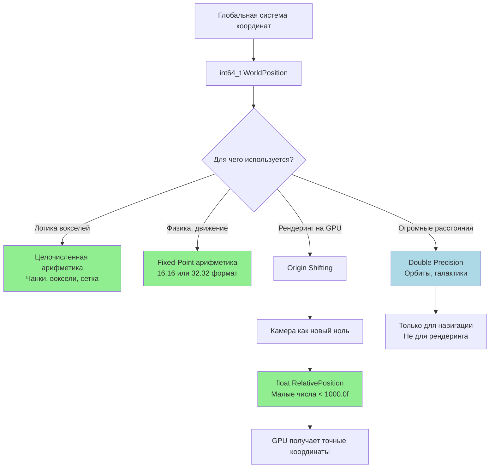

# Философия математики и пространства (Большие миры и точность)

Для воксельного движка, где миры могут быть огромными (миллионы чанков в каждом измерении), математика — это не просто
`x + y`. Это борьба с ограничениями представления чисел в компьютере. Студенты привыкли, что `float` точен всегда. Они
не знают, что на координате `x = 100 000.0f` у `float` заканчивается точность, и анимации начнут дёргаться ("float
jitter"), а физика проваливаться сквозь пол.

---

## Проблема: Float Jitter (Дрожание float)

`float` в IEEE 754 — это число с плавающей точкой. Оно хранит:

- Знак (1 бит)
- Экспонента (8 бит)
- Мантисса (23 бита)

**Точность зависит от величины числа:**

- При `x = 1.0f`: точность ~7 десятичных цифр (можно представить `1.000001`)
- При `x = 100 000.0f`: точность ~1 десятичная цифра (можно представить `100 000.0` и `100 001.0`, но не `100 000.5`!)
- При `x = 10 000 000.0f`: точность 0 цифр (соседние значения отличаются на 1.0)

**Что это значит для движка?**

```cpp
// Камера на координате 100,000.0
Vector3 camera_pos = {100000.0f, 0.0f, 0.0f};

// Объект на координате 100,000.5 (в 50 см от камеры)
Vector3 object_pos = {100000.5f, 0.0f, 0.0f};

// Разница в мировых координатах
Vector3 delta = object_pos - camera_pos; // Ожидаем {0.5f, 0.0f, 0.0f}

// Но из-за потери точности float:
// delta = {0.0f, 0.0f, 0.0f} или {1.0f, 0.0f, 0.0f}
// Объект "прыгает" между 0 и 1 метром от камеры!
```

Это называется **Float Jitter** — объекты дёргаются, трясутся, проваливаются сквозь текстуры.

> **Метафора:** `float` — это телескоп. Ты можешь рассмотреть бактерию прямо перед объективом (малые числа), но если ты
> посмотришь на луну (большие числа), погрешность в миллиметр на линзе даст ошибку в километры на поверхности. Мы не
> измеряем луну телескопом с Земли — мы летим на луну и измеряем всё вблизи.

---

## Решение 1: Целочисленные координаты для логики

Воксели (чанки) всегда лежат в целочисленной сетке. Мы используем `int64_t` для глобальных координат:

```cpp
struct WorldPosition {
    int64_t x, y, z; // В единицах вокселей (1 воксель = 1 единица)

    // Преобразование в float для рендеринга (только когда нужно)
    Vector3 to_render_space() const {
        return {
            static_cast<float>(x),
            static_cast<float>(y),
            static_cast<float>(z)
        };
    }
};

struct ChunkCoord {
    int32_t chunk_x, chunk_y, chunk_z; // Координаты чанка
    uint8_t voxel_x, voxel_y, voxel_z; // Координаты внутри чанка (0-31)

    WorldPosition to_world_position() const {
        return {
            static_cast<int64_t>(chunk_x) * CHUNK_SIZE + voxel_x,
            static_cast<int64_t>(chunk_y) * CHUNK_SIZE + voxel_y,
            static_cast<int64_t>(chunk_z) * CHUNK_SIZE + voxel_z
        };
    }
};
```

**Почему `int64_t`?**

- `int32_t`: максимум ±2.1 млрд вокселей (±2,147,483,647)
- `int64_t`: максимум ±9.2 квинтиллиона вокселей (±9,223,372,036,854,775,807)
- Для мира размером 1 млн чанков × 32³ = 32 млрд вокселей — `int32_t` хватит, но `int64_t` даёт запас.

---

## Решение 2: Origin Shifting (Сдвиг начала координат)

GPU ненавидит большие числа. При рендеринге мы всегда передаём позиции относительно камеры:

```cpp
class RenderSystem {
    WorldPosition camera_origin; // "Ноль" для рендеринга

    void update_origin(WorldPosition new_camera_pos) {
        // Сдвигаем origin, если камера ушла далеко
        if (distance(new_camera_pos, camera_origin) > ORIGIN_THRESHOLD) {
            camera_origin = new_camera_pos;
            // Пересчитываем все позиции относительно нового origin
            rebuild_render_data();
        }
    }

    Vector3 to_render_space(WorldPosition world_pos) const {
        // Преобразуем в float ТОЛЬКО разницу
        return {
            static_cast<float>(world_pos.x - camera_origin.x),
            static_cast<float>(world_pos.y - camera_origin.y),
            static_cast<float>(world_pos.z - camera_origin.z)
        };
    }
};
```

**Как это работает:**

1. Камера на координате `(100000, 200000, 300000)`
2. Устанавливаем `camera_origin = (100000, 200000, 300000)`
3. Объект на `(100050, 200100, 300020)` → рендерим как `(50, 100, 20)`
4. Все координаты для GPU — маленькие числа (< 1000.0f)
5. Точность float сохраняется

> **Для понимания:** Представь, что ты картограф. Ты не рисуешь карту всего мира на одном листе бумаги — ты разбиваешь
> мир на квадраты 10×10 км. Когда путешественник идёт из Москвы в Петербург, ты не перерисовываешь всю карту России — ты
> просто перекладываешь листы бумаги под ним. Origin Shifting — это перекладывание листов.

---

## Решение 3: Fixed-Point арифметика для физики

Физика (коллизии, движение) требует точности, но работает с небольшими относительными перемещениями. Используем
Fixed-Point:

```cpp
// Fixed-point с 16 бит дробной части
using Fixed32 = int32_t; // 16.16 формат
using Fixed64 = int64_t; // 32.32 формат

constexpr Fixed32 float_to_fixed(float f) {
    return static_cast<Fixed32>(f * 65536.0f); // 2^16
}

constexpr float fixed_to_float(Fixed32 f) {
    return static_cast<float>(f) / 65536.0f;
}

// Сложение/вычитание — обычные целые операции
Fixed32 a = float_to_fixed(1.5f);  // 1.5 * 65536 = 98304
Fixed32 b = float_to_fixed(2.25f); // 2.25 * 65536 = 147456
Fixed32 sum = a + b;               // 245760 = 3.75 * 65536

// Умножение требует сдвига
Fixed32 mul = (a * b) >> 16;       // (1.5 * 2.25) * 65536
```

**Преимущества Fixed-Point:**

- Детерминированность (одинаковые результаты на всех CPU)
- Нет потери точности на больших координатах
- Быстрее чем float на некоторых архитектурах (нет FPU)

---

## Решение 4: Двойная точность только где нужно

Иногда нужна высокая точность на больших расстояниях (орбитальные симуляции, огромные миры):

```cpp
struct DoublePrecisionPosition {
    double x, y, z; // Высокая точность даже на 1e9

    Vector3 to_render_space(DoublePrecisionPosition camera_pos) const {
        // Разница в double, затем в float
        double dx = x - camera_pos.x;
        double dy = y - camera_pos.y;
        double dz = z - camera_pos.z;

        // Преобразуем в float только когда разница мала
        if (std::abs(dx) < 10000.0 && std::abs(dy) < 10000.0 && std::abs(dz) < 10000.0) {
            return {
                static_cast<float>(dx),
                static_cast<float>(dy),
                static_cast<float>(dz)
            };
        }
        // Иначе — используем другой метод (LOD, упрощение)
    }
};
```

---

## Mermaid диаграмма: Иерархия систем координат



---

## Практические рекомендации

### 1. Типы для разных задач:

```cpp
// Логика мира
using VoxelCoord = int64_t;
using ChunkCoord = int32_t;

// Физика
using Fixed32 = int32_t; // 16.16
using Fixed64 = int64_t; // 32.32

// Рендеринг
using RenderCoord = float;
using RenderVec3 = Vector3; // glm::vec3

// Навигация/карты
using MapCoord = double;
```

### 2. Преобразования (явные, не неявные):

```cpp
// ПЛОХО: неявное преобразование
void render(Vector3 pos); // Где Vector3 = glm::vec3
render({world_pos.x, world_pos.y, world_pos.z}); // Потеря точности!

// ХОРОШО: явное преобразование
void render(RenderCoord pos);
render(world_pos.to_render_space(camera_origin));
```

### 3. Пороговые значения:

```cpp
constexpr float RENDER_THRESHOLD = 1000.0f; // Максимум для GPU
constexpr int64_t ORIGIN_THRESHOLD = 10000; // Когда сдвигать origin
constexpr double PRECISION_LIMIT = 1e-6;    // Точность сравнения
```

### 4. Тестирование:

```cpp
TEST(Math, FloatJitter) {
    Vector3 far_pos = {100000.0f, 0.0f, 0.0f};
    Vector3 near_pos = {100000.5f, 0.0f, 0.0f};

    Vector3 delta = near_pos - far_pos;
    // Этот тест УПАДЁТ из-за float jitter!
    // ASSERT_NEAR(delta.x, 0.5f, 0.001f);

    // Вместо этого тестируем целочисленные координаты
    WorldPosition wp1 = {100000, 0, 0};
    WorldPosition wp2 = {100000, 0, 0};
    wp2.x += 1; // 1 воксель = 0.5 метра?

    ASSERT_EQ(wp2.x - wp1.x, 1); // Всегда точно
}
```

---

## Золотые правила

1. **Никогда не используй `float` для глобальных координат.** Только `int64_t`.
2. **Origin Shifting — обязательно** для рендеринга больших миров.
3. **Fixed-Point для физики**, если нужна детерминированность.
4. **Явные преобразования** между системами координат.
5. **Тестируй на граничных случаях:** `x = 10,000,000`, `x = -10,000,000`.

> **Метафора итоговая:** Представь, что ты строишь небоскрёб. Ты не используешь сантиметровую ленту для измерения
> расстояния между городами (float для глобальных координат). Ты используешь:
> - Карту с координатами (int64_t для логики)
> - Лазерный дальномер для точных измерений на стройплощадке (fixed-point для физики)
> - Относительные измерения от угла здания (origin shifting для рендеринга)
    > Каждый инструмент — для своей задачи.

---

*"Математика в GameDev — это не про формулы. Это про понимание, как компьютер хранит числа, и как обойти его
ограничения."*
