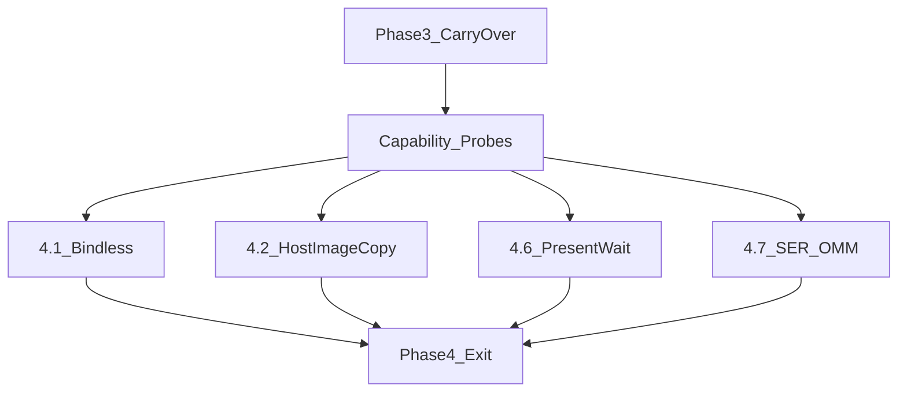

# Vulkan 1.4 Phase 4 — Hardware-Gated + Phase 3 Carry-Over

> **For agentic workers:** REQUIRED SUB-SKILL: Use `superpowers:subagent-driven-development` (recommended) or `superpowers:executing-plans`. Steps use checkbox (`- [ ]`) syntax.
>
> **Repo protocol:** Work only on `master` ([AGENTS.md](AGENTS.md) §5.4). Agent proposes commit messages; operator commits ([AGENTS.md](AGENTS.md) §5.1). Failed attempts → archive under `legacy/docs/archive/YYYY-MM-DD-<task>-attempt/` before rollback (§7.2).

**Goal:** Enable Vulkan 1.4 / post-1.4 capabilities that need runtime probes (audit §4.1 / §4.4 [C]), and land Phase 3 follow-ups that unblock future perf work (HZB min-reduction, async RT init structure, stress bench).

**Architecture:** Each task is probe → env/capability gate → integrate → validate. Unsupported hardware falls back to the Phase 1–3 path. Perf re-entries of rolled-back 3.2/3.3 require a heavier scene and true HZB min-mips first.

**Tech Stack:** C++26, Vulkan 1.4 (+ optional KHR/EXT/NV), Tracy, NSight Graphics, VoxelLab + stress preset.

**Deliverable file:** Write plan to [`docs/superpowers/plans/2026-07-14-vulkan-1.4-phase-4-hardware-gated.md`](docs/superpowers/plans/2026-07-14-vulkan-1.4-phase-4-hardware-gated.md). Mark the 2026-07-12 Phase 4 draft as superseded (one-line pointer at top of old file or delete if operator prefers replace-in-place).

**Current baseline (post Phase 3):** 3.1 push descriptors + 3.5 TLAS refit landed; 3.2/3.3 rolled back (no ≥10% on VoxelLab); 3.4 `PROJECTV_RTX_PIPELINE_LIBRARY` documented ([agent/knowledge.md](agent/knowledge.md) §37). Bootstrap split: [`VulkanBootstrapFeatures.cpp`](src/render/vulkan/VulkanBootstrapFeatures.cpp) / [`VulkanBootstrapDevice.cpp`](src/render/vulkan/VulkanBootstrapDevice.cpp) (old plan paths pointing at monolithic `VulkanBootstrap.cpp` are stale).

## Global Constraints

- No regression of Phase 1/2 validation cleanliness or Phase 3 landed paths.
- Probe at startup; disable cleanly when unsupported / env OFF.
- Green: `cmake --build build/linux-clang-debug --target ProjectV`, `ctest --test-dir build/linux-clang-debug -j8` (44/44), `PROJECTV_ENABLE_VALIDATION=ON` smoke.
- Perf re-bench of 3.2/3.3 style work: ≥10% Tracy/NSight on **stress** scene, not tiny VoxelLab alone.
- Commits: propose §5.1 message; operator commits on `master`.

---

### Task 4.0: Phase 3 carry-over enablers

**Goal:** Unblock future indirect RT / accurate HZB and remove RT cold-start from the critical init path.

**Files:**
- Modify: [`src/render/HizCullingBuild.cpp`](src/render/HizCullingBuild.cpp) (replace LINEAR blit downsample with compute min-reduction)
- Create: `src/shaders/hiz_minify.comp` (or equivalent)
- Modify: [`src/render/RayTracedShadowsMask.cpp`](src/render/RayTracedShadowsMask.cpp), [`src/render/RtxShadowPipeline.cpp`](src/render/RtxShadowPipeline.cpp), [`src/render/RendererDrawFrame.cpp`](src/render/RendererDrawFrame.cpp) for async RT readiness poll
- Optional: new stress scene preset / `runtime/scene.json` override + `agent/knowledge.md` note
- Archive references: `legacy/docs/archive/2026-07-14-task32-attempt/`, `...-task34-attempt/`

- [ ] **Step 1:** Implement HZB mip min-reduction compute; keep blit path as env fallback (`PROJECTV_HZB_MIN_MIP=ON` default ON when shader ready).
- [ ] **Step 2:** Smoke + Tracy: confirm HZB consumers ([`hzb_cull.comp`](src/shaders/hzb_cull.comp), archive 3.2 shader) see conservative min depths.
- [ ] **Step 3:** Restructure voxel-aware RT init so `RtxShadowPipeline::Initialize` can complete offline / polled (`FinishVoxelAwareRtxResources`) without blocking first frames; document that worker-thread `VkDeferredOperationKHR` while submitting deadlocks (knowledge §37).
- [ ] **Step 4:** Add or document a stress benchmark preset (higher chunk count / draw distance) for future 3.2/3.3 re-entry.
- [ ] **Step 5:** Propose commit: `perf(hiz): min-reduction HZB mips` / `refactor(rtx): defer RT pipeline ready until SBT ready`.

**Do not** re-land 3.2/3.3 in Phase 4 unless stress gate ≥10% after Step 1–4; treat as optional re-entry appendix at end of plan.

---

### Task 4.1: Bindless descriptors

**Files:**
- Modify: [`VulkanBootstrapFeatures.cpp`](src/render/vulkan/VulkanBootstrapFeatures.cpp) — probe `descriptorIndexing` / `runtimeDescriptorArray` / partially-bound / variable-count / update-after-bind
- Modify: graphics layout in [`VulkanGraphicsPipelineCreate.cpp`](src/render/vulkan/VulkanGraphicsPipelineCreate.cpp) + consumers
- Modify: shaders ([`voxel.frag`](src/shaders/voxel.frag), material/atlas bindings) toward `layout(...) type name[];`
- Test: validation smoke + bind-count Tracy

- [ ] Probe and store flags on `VulkanContextState` / `features14`.
- [ ] Introduce one bindless set (sampled images first) with `PARTIALLY_BOUND` + `VARIABLE_DESCRIPTOR_COUNT`.
- [ ] Migrate one consumer path; gate `PROJECTV_BINDLESS=ON`.
- [ ] Measure; keep fallback layouts.
- [ ] Propose: `feat(vulkan): bindless descriptor arrays (gated)`.

---

### Task 4.2: Host image copy

**Files:**
- Modify: [`VulkanBootstrapFeatures.cpp`](src/render/vulkan/VulkanBootstrapFeatures.cpp) — `hostImageCopy`
- Modify: upload paths (NanoVDB / world-gen / asset textures as applicable): [`SceneResourcesUpdate.cpp`](src/render/SceneResourcesUpdate.cpp), [`VulkanWorldGenPipeline.cpp`](src/render/vulkan/VulkanWorldGenPipeline.cpp), [`asset/`](src/asset/)
- Test: upload Tracy zone + validation

- [ ] Probe `features14.hostImageCopy`.
- [ ] Replace eligible staging→image copies with `vkCopyMemoryToImage` where layout/usage allow.
- [ ] Gate `PROJECTV_HOST_IMAGE_COPY=ON`; fallback staging.
- [ ] Propose: `feat(vulkan): host image copy for CPU uploads`.

---

### Task 4.3: `indexTypeUint8`

**Files:**
- Modify: [`MeshGpuResources.cpp`](src/asset/MeshGpuResources.cpp) / model draw paths
- Probe: `indexTypeUint8` in Features14

- [ ] For meshes with max index ≤ 255, pack `uint8` indices + `VK_INDEX_TYPE_UINT8`.
- [ ] Gate by capability; keep uint16/uint32 paths.
- [ ] Propose: `perf(asset): uint8 indices for small meshes`.

---

### Task 4.4: `dynamicRenderingLocalRead`

**Files:**
- Probe in Features14; use for PostFX / passes that sample just-written attachments ([`PostFxPass.cpp`](src/render/PostFxPass.cpp), [`RendererRecordCommands.cpp`](src/render/RendererRecordCommands.cpp))
- Note: mesh-shader path already hit VUID about barriers inside dynamic rendering — local-read may fix some of those patterns

- [ ] Probe + enable when useful.
- [ ] Convert one pass (prefer PostFX or depth-reuse) off sampled-image round-trip.
- [ ] Validation ON smoke.
- [ ] Propose: `feat(render): dynamic rendering local read`.

---

### Task 4.5: `shaderFloatControls2`

**Files:** Fluid CA / world-gen compute shaders; Features14 probe

- [ ] Probe feature; apply precise FP modes where determinism matters (`fluid_ca.comp`).
- [ ] Add/extend a determinism-oriented test if feasible.
- [ ] Propose: `feat(shaders): shaderFloatControls2 for Fluid CA`.

---

### Task 4.6: `VK_KHR_present_id` / `VK_KHR_present_wait`

**Files:**
- [`VulkanBootstrapFeatures.cpp`](src/render/vulkan/VulkanBootstrapFeatures.cpp), [`VulkanSwapchain.cpp`](src/render/vulkan/VulkanSwapchain.cpp), [`RendererDrawFrame.cpp`](src/render/RendererDrawFrame.cpp)

- [ ] Enable extensions when present.
- [ ] Tag presents with `VkPresentIdKHR`; optional `vkWaitForPresentKHR` via `PROJECTV_PRESENT_WAIT=N` (max latency frames).
- [ ] Measure frame-time variance / latency.
- [ ] Propose: `feat(swapchain): present_id / present_wait frame pacing`.

---

### Task 4.7: NVIDIA SER / OMM

**Files:**
- RT feature probe near [`HardwareRayTracingProbe.cpp`](src/render/vulkan/HardwareRayTracingProbe.cpp)
- RT shaders / BLAS build when alpha-tested assets exist

- [ ] Probe `VK_NV_shader_invocation_reorder` / `VK_EXT_opacity_micromap`.
- [ ] SER: reorder in high-divergence shadow/GI rays if extension present (`PROJECTV_RTX_SER=ON`).
- [ ] OMM: only if real alpha-tested assets appear; otherwise document “blocked on assets” and skip.
- [ ] Tracy RT pass; propose commit only if landed.

---

### Optional re-entry: 3.2 / 3.3 on stress scene

After Task 4.0 HZB min-mips + stress preset: revive archives, env-gate, require ≥10% on stress scene; else keep rolled back.

---

## Phase 4 Exit Criteria

- [ ] Implemented features are capability- and env-gated with clean fallbacks.
- [ ] HZB min-reduction shipped or explicitly deferred with rationale in `agent/knowledge.md`.
- [ ] Async RT init either landed or blocked with documented structure requirement.
- [ ] `ctest` 44/44 + validation smoke clean for enabled gates.
- [ ] [`agent/workspace.md`](agent/workspace.md) Phase 4 exit section + knowledge updates; no drive-by docs.

## Out of scope

- Reintroducing TAA / Streamline DLSS (separate track; see polish docs).
- Creating feature branches (forbidden).
- Implementing 4.7 OMM without assets.
