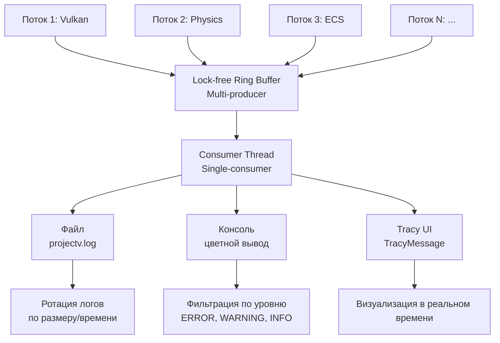

# Logging System Architecture: Lock-free логгер для ProjectV

## 🎯 Цель и философия

**Цель:** Создать систему логирования, которая:

1. **Перехватывает все выводы** — ни одна библиотека не пишет в `stderr`/`stdout` напрямую
2. **Работает без блокировок** — multi-producer/single-consumer архитектура
3. **Следует UNIX-way** — простой текстовый формат, а не распухший JSON
4. **Интегрируется с Tracy** — все логи визуализируются в профайлере
5. **Минимальный overhead** — zero-cost в релизных сборках без логирования

**Философия:** Каждый поток пишет в lock-free ring buffer без ожидания. Отдельный consumer thread читает из буфера и
записывает в файл/консоль/Tracy.

## 🏗️ Архитектурная схема



## 📦 Компоненты системы

### 1. LogEntry (Структура записи лога)

```cpp
module;
export module projectv.core.logging.entry;

import std;
import <chrono>;

namespace projectv::core::logging {

// Уровни логирования (совместимы с syslog)
enum class LogLevel : uint8_t {
    Trace,      // Детальная отладка
    Debug,      // Отладочная информация
    Info,       // Информационные сообщения
    Warning,    // Предупреждения
    Error,      // Ошибки
    Critical    // Критические ошибки (движок падает)
};

// Категории для фильтрации
enum class LogCategory : uint16_t {
    Core,       // Ядро движка
    Memory,     // Аллокации, деаллокации
    Vulkan,     // Графика, Vulkan API
    Physics,    // JoltPhysics
    ECS,        // Flecs, системы
    Asset,      // Загрузка ресурсов
    Audio,      // Miniaudio
    UI,         // RmlUi, ImGui
    Network,    // Сетевое взаимодействие
    Scripting,  // Скрипты
    Custom = 1000 // Пользовательские категории
};

// Структура записи лога (выровнена для атомарного доступа)
struct alignas(64) LogEntry {
    std::chrono::system_clock::time_point timestamp;
    LogLevel level;
    LogCategory category;
    uint32_t threadId;
    char message[256];  // Фиксированный размер для простоты

    // Статическая проверка размера для кэш-линий
    static_assert(sizeof(LogEntry) == 320, "LogEntry должен быть 320 байт");
    static_assert(alignof(LogEntry) == 64, "LogEntry должен быть выровнен по 64 байта");
};

} // namespace projectv::core::logging
```

### 2. LockFreeRingBuffer (Multi-producer/single-consumer)

```cpp
module;
export module projectv.core.logging.ring_buffer;

import std;
import projectv.core.logging.entry;

namespace projectv::core::logging {

class LockFreeRingBuffer {
    static constexpr size_t BUFFER_SIZE = 4096;  // 4096 записей * 320 байт = ~1.3MB

    alignas(64) LogEntry buffer_[BUFFER_SIZE];
    alignas(64) std::atomic<size_t> writeIndex_{0};
    alignas(64) std::atomic<size_t> readIndex_{0};

public:
    LockFreeRingBuffer() = default;
    ~LockFreeRingBuffer() = default;

    // Попытка записать запись (multi-producer)
    [[nodiscard]] bool tryPush(const LogEntry& entry) noexcept {
        size_t currentWrite = writeIndex_.load(std::memory_order_relaxed);
        size_t nextWrite = (currentWrite + 1) % BUFFER_SIZE;

        // Проверяем, не переполнен ли буфер
        size_t currentRead = readIndex_.load(std::memory_order_acquire);
        if (nextWrite == currentRead) {
            return false;  // Буфер полон
        }

        // Копируем запись
        buffer_[currentWrite] = entry;

        // Атомарно обновляем write index
        writeIndex_.store(nextWrite, std::memory_order_release);
        return true;
    }

    // Попытка прочитать запись (single-consumer)
    [[nodiscard]] bool tryPop(LogEntry& entry) noexcept {
        size_t currentRead = readIndex_.load(std::memory_order_relaxed);
        size_t currentWrite = writeIndex_.load(std::memory_order_acquire);

        if (currentRead == currentWrite) {
            return false;  // Буфер пуст
        }

        // Копируем запись
        entry = buffer_[currentRead];

        // Атомарно обновляем read index
        size_t nextRead = (currentRead + 1) % BUFFER_SIZE;
        readIndex_.store(nextRead, std::memory_order_release);
        return true;
    }

    // Получить количество записей в буфере
    [[nodiscard]] size_t size() const noexcept {
        size_t write = writeIndex_.load(std::memory_order_acquire);
        size_t read = readIndex_.load(std::memory_order_acquire);

        if (write >= read) {
            return write - read;
        } else {
            return BUFFER_SIZE - read + write;
        }
    }

    // Проверить, пуст ли буфер
    [[nodiscard]] bool empty() const noexcept {
        return size() == 0;
    }

    // Проверить, полон ли буфер
    [[nodiscard]] bool full() const noexcept {
        return size() == BUFFER_SIZE - 1;
    }
};

} // namespace projectv::core::logging
```

### 3. Logger (Основной класс)

```cpp
module;
export module projectv.core.logging.logger;

import std;
import <chrono>;
import <thread>;
import <filesystem>;
import projectv.core.logging.entry;
import projectv.core.logging.ring_buffer;

namespace projectv::core::logging {

class Logger {
    LockFreeRingBuffer ringBuffer_;
    std::jthread consumerThread_;
    std::atomic<bool> running_{true};

    // Конфигурация
    std::filesystem::path logFilePath_;
    std::ofstream logFile_;
    bool enableConsoleOutput_{true};
    bool enableFileOutput_{true};
    bool enableTracyOutput_{true};
    LogLevel minimumLevel_{LogLevel::Info};

    // Статистика
    std::atomic<uint64_t> messagesLogged_{0};
    std::atomic<uint64_t> messagesDropped_{0};

public:
    Logger() {
        // Настройка пути к файлу логов
        logFilePath_ = std::filesystem::current_path() / "logs" / "projectv.log";
        std::filesystem::create_directories(logFilePath_.parent_path());

        // Открытие файла
        if (enableFileOutput_) {
            logFile_.open(logFilePath_, std::ios::app);
            if (!logFile_) {
                // Если не удалось открыть файл, отключаем файловый вывод
                enableFileOutput_ = false;
            }
        }

        // Запуск consumer thread
        consumerThread_ = std::jthread([this](std::stop_token st) {
            consumerLoop(st);
        });
    }

    ~Logger() {
        running_.store(false, std::memory_order_release);
        if (consumerThread_.joinable()) {
            consumerThread_.request_stop();
            consumerThread_.join();
        }

        if (logFile_.is_open()) {
            logFile_.close();
        }
    }

    // Запрещаем копирование и перемещение
    Logger(const Logger&) = delete;
    Logger& operator=(const Logger&) = delete;

    // Основной метод логирования
    template<typename... Args>
    void log(LogLevel level, LogCategory category, std::format_string<Args...> fmt, Args&&... args) noexcept {
        // Проверяем уровень
        if (level < minimumLevel_) {
            return;
        }

        // Форматируем сообщение без исключений
        std::string message;
        // Используем std::format с обработкой ошибок через возвращаемое значение
        // В C++26 можно использовать std::format_to_n с буфером фиксированного размера
        char buffer[256];
        auto result = std::format_to_n(buffer, sizeof(buffer) - 1, fmt, std::forward<Args>(args)...);
        if (result.size < sizeof(buffer)) {
            buffer[result.size] = '\0';
            message = buffer;
        } else {
            // Если сообщение слишком длинное, обрезаем его
            message = "[Message too long]";
        }

        // Создаём запись
        LogEntry entry{
            .timestamp = std::chrono::system_clock::now(),
            .level = level,
            .category = category,
            .threadId = static_cast<uint32_t>(std::hash<std::thread::id>{}(std::this_thread::get_id())),
            .message = {}  // Инициализируем нулями
        };

        // Копируем сообщение (обрезаем если слишком длинное)
        if (message.size() >= sizeof(entry.message)) {
            message.resize(sizeof(entry.message) - 1);
        }
        std::strncpy(entry.message, message.c_str(), sizeof(entry.message) - 1);
        entry.message[sizeof(entry.message) - 1] = '\0';

        // Пытаемся записать в ring buffer
        if (ringBuffer_.tryPush(entry)) {
            messagesLogged_.fetch_add(1, std::memory_order_relaxed);
        } else {
            messagesDropped_.fetch_add(1, std::memory_order_relaxed);
            // Буфер переполнен - можно добавить стратегию (например, аллокировать временный буфер)
        }
    }

    // Удобные методы для разных уровней
    template<typename... Args>
    void trace(LogCategory category, std::format_string<Args...> fmt, Args&&... args) noexcept {
        log(LogLevel::Trace, category, fmt, std::forward<Args>(args)...);
    }

    template<typename... Args>
    void debug(LogCategory category, std::format_string<Args...> fmt, Args&&... args) noexcept {
        log(LogLevel::Debug, category, fmt, std::forward<Args>(args)...);
    }

    template<typename... Args>
    void info(LogCategory category, std::format_string<Args...> fmt, Args&&... args) noexcept {
        log(LogLevel::Info, category, fmt, std::forward<Args>(args)...);
    }

    template<typename... Args>
    void warning(LogCategory category, std::format_string<Args...> fmt, Args&&... args) noexcept {
        log(LogLevel::Warning, category, fmt, std::forward<Args>(args)...);
    }

    template<typename... Args>
    void error(LogCategory category, std::format_string<Args...> fmt, Args&&... args) noexcept {
        log(LogLevel::Error, category, fmt, std::forward<Args>(args)...);
    }

    template<typename... Args>
    void critical(LogCategory category, std::format_string<Args...> fmt, Args&&... args) noexcept {
        log(LogLevel::Critical, category, fmt, std::forward<Args>(args)...);
    }

    // Конфигурация
    void setMinimumLevel(LogLevel level) noexcept {
        minimumLevel_.store(level, std::memory_order_release);
    }

    void enableConsoleOutput(bool enable) noexcept {
        enableConsoleOutput_.store(enable, std::memory_order_release);
    }

    void enableFileOutput(bool enable) noexcept {
        enableFileOutput_.store(enable, std::memory_order_release);
    }

    void enableTracyOutput(bool enable) noexcept {
        enableTracyOutput_.store(enable, std::memory_order_release);
    }

    // Получить статистику
    struct Statistics {
        uint64_t messagesLogged;
        uint64_t messagesDropped;
        size_t bufferSize;
        size_t bufferCapacity;
    };

    [[nodiscard]] Statistics getStatistics() const noexcept {
        return Statistics{
            .messagesLogged = messagesLogged_.load(std::memory_order_acquire),
            .messagesDropped = messagesDropped_.load(std::memory_order_acquire),
            .bufferSize = ringBuffer_.size(),
            .bufferCapacity = 4095  // BUFFER_SIZE - 1
        };
    }

private:
    void consumerLoop(std::stop_token st) noexcept {
        while (!st.stop_requested() && running_.load(std::memory_order_acquire)) {
            // Обрабатываем все доступные записи
            processAvailableEntries();

            // Небольшая пауза чтобы не грузить CPU
            std::this_thread::sleep_for(std::chrono::milliseconds(10));
        }

        // Обрабатываем оставшиеся записи перед выходом
        processAvailableEntries();
    }

    void processAvailableEntries() noexcept {
        LogEntry entry;
        while (ringBuffer_.tryPop(entry)) {
            // Форматируем запись
            std::string formatted = formatEntry(entry);

            // Вывод в консоль
            if (enableConsoleOutput_) {
                outputToConsole(entry, formatted);
            }

            // Вывод в файл
            if (enableFileOutput_ && logFile_.is_open()) {
                outputToFile(formatted);
            }

            // Вывод в Tracy
            if (enableTracyOutput_) {
                outputToTracy(entry, formatted);
            }
        }

        // Flush файла если нужно
        if (enableFileOutput_ && logFile_.is_open()) {
            logFile_.flush();
        }
    }

    [[nodiscard]] std::string formatEntry(const LogEntry& entry) const noexcept {
        // UNIX-way формат: [TIME] [LEVEL] [CATEGORY] [THREAD] Message
        auto time = std::chrono::system_clock::to_time_t(entry.timestamp);
        std::tm tm;
        localtime_s(&tm, &time);  // Windows, для Linux: localtime_r

        char timeBuffer[64];
        std::strftime(timeBuffer, sizeof(timeBuffer), "%Y-%m-%dT%H:%M:%S", &tm);

        // Миллисекунды
        auto ms = std::chrono::duration_cast<std::chrono::milliseconds>(
            entry.timestamp.time_since_epoch()) % 1000;

        // Уровень как строка
        const char* levelStr = "UNKNOWN";
        switch (entry.level) {
            case LogLevel::Trace:    levelStr = "TRACE"; break;
            case LogLevel::Debug:    levelStr = "DEBUG"; break;
            case LogLevel::Info:     levelStr = "INFO"; break;
            case LogLevel::Warning:  levelStr = "WARNING"; break;
            case LogLevel::Error:    levelStr = "ERROR"; break;
            case LogLevel::Critical: levelStr = "CRITICAL"; break;
        }

        // Категория как строка
        const char* categoryStr = "UNKNOWN";
        switch (entry.category) {
            case LogCategory::Core:    categoryStr = "CORE"; break;
            case LogCategory::Memory:  categoryStr = "MEMORY"; break;
            case LogCategory::Vulkan:  categoryStr = "VULKAN"; break;
            case LogCategory::Physics: categoryStr = "PHYSICS"; break;
            case LogCategory::ECS:     categoryStr = "ECS"; break;
            case LogCategory::Asset:   categoryStr = "ASSET"; break;
            case LogCategory::Audio:   categoryStr = "AUDIO"; break;
            case LogCategory::UI:      categoryStr = "UI"; break;
            case LogCategory::Network: categoryStr = "NETWORK"; break;
            case LogCategory::Scripting: categoryStr = "SCRIPTING"; break;
            default:                   categoryStr = "CUSTOM"; break;
        }

        return std::format("[{}.{:03d}] [{}] [{}] [0x{:08X}] {}",
                          timeBuffer, ms.count(), levelStr, categoryStr,
                          entry.threadId, entry.message);
    }

    void outputToConsole(const LogEntry& entry, const std::string& formatted) noexcept {
        // Цветной вывод в зависимости от уровня
        HANDLE consoleHandle = GetStdHandle(STD_OUTPUT_HANDLE);  // Windows

        WORD originalAttributes;
        CONSOLE_SCREEN_BUFFER_INFO consoleInfo;
        if (GetConsoleScreenBufferInfo(consoleHandle, &consoleInfo)) {
            originalAttributes = consoleInfo.wAttributes;
        }

        // Устанавливаем цвет
        switch (entry.level) {
            case LogLevel::Trace:
                SetConsoleTextAttribute(consoleHandle, FOREGROUND_INTENSITY | FOREGROUND_BLUE);
                break;
            case LogLevel::Debug:
                SetConsoleTextAttribute(consoleHandle, FOREGROUND_INTENSITY | FOREGROUND_GREEN);
                break;
            case LogLevel::Info:
                SetConsoleTextAttribute(consoleHandle, FOREGROUND_INTENSITY | FOREGROUND_RED | FOREGROUND_GREEN | FOREGROUND_BLUE);
                break;
            case LogLevel::Warning:
                SetConsoleTextAttribute(consoleHandle, FOREGROUND_INTENSITY | FOREGROUND_RED | FOREGROUND_GREEN);
                break;
            case LogLevel::Error:
                SetConsoleTextAttribute(consoleHandle, FOREGROUND_INTENSITY | FOREGROUND_RED);
                break;
            case LogLevel::Critical:
                SetConsoleTextAttribute(consoleHandle, FOREGROUND_INTENSITY | FOREGROUND_RED | BACKGROUND_RED);
                break;
        }

        // Выводим сообщение
        std::cout << formatted << std::endl;

        // Восстанавливаем оригинальные атрибуты
        SetConsoleTextAttribute(consoleHandle, originalAttributes);
    }

    void outputToFile(const std::string& formatted) noexcept {
        if (logFile_.is_open()) {
            logFile_ << formatted << std::endl;
        }
    }

    void outputToTracy(const LogEntry& entry, const std::string& formatted) noexcept {
        #ifdef TRACY_ENABLE
        TracyMessageC(formatted.c_str(), getTracyColor(entry.level));
        #endif
    }

    #ifdef TRACY_ENABLE
    static uint32_t getTracyColor(LogLevel level) noexcept {
        switch (level) {
            case LogLevel::Trace:    return 0x0000FF; // Синий
            case LogLevel::Debug:    return 0x00FF00; // Зелёный
            case LogLevel::Info:     return 0xFFFFFF; // Белый
            case LogLevel::Warning:  return 0xFFFF00; // Жёлтый
            case LogLevel::Error:    return 0xFF0000; // Красный
            case LogLevel::Critical: return 0xFF00FF; // Пурпурный
            default:                 return 0xFFFFFF;
        }
    }
    #endif
};

// Глобальный экземпляр логгера
inline Logger& getLogger() {
    static Logger instance;
    return instance;
}

// Удобные глобальные функции для логирования
namespace Log {
    template<typename... Args>
    inline void trace(LogCategory category, std::format_string<Args...> fmt, Args&&... args) noexcept {
        getLogger().trace(category, fmt, std::forward<Args>(args)...);
    }

    template<typename... Args>
    inline void debug(LogCategory category, std::format_string<Args...> fmt, Args&&... args) noexcept {
        getLogger().debug(category, fmt, std::forward<Args>(args)...);
    }

    template<typename... Args>
    inline void info(LogCategory category, std::format_string<Args...> fmt, Args&&... args) noexcept {
        getLogger().info(category, fmt, std::forward<Args>(args)...);
    }

    template<typename... Args>
    inline void warning(LogCategory category, std::format_string<Args...> fmt, Args&&... args) noexcept {
        getLogger().warning(category, fmt, std::forward<Args>(args)...);
    }

    template<typename... Args>
    inline void error(LogCategory category, std::format_string<Args...> fmt, Args&&... args) noexcept {
        getLogger().error(category, fmt, std::forward<Args>(args)...);
    }

    template<typename... Args>
    inline void critical(LogCategory category, std::format_string<Args...> fmt, Args&&... args) noexcept {
        getLogger().critical(category, fmt, std::forward<Args>(args)...);
    }

    inline void setMinimumLevel(LogLevel level) noexcept {
        getLogger().setMinimumLevel(level);
    }

    inline void enableConsoleOutput(bool enable) noexcept {
        getLogger().enableConsoleOutput(enable);
    }

    inline void enableFileOutput(bool enable) noexcept {
        getLogger().enableFileOutput(enable);
    }

    inline void enableTracyOutput(bool enable) noexcept {
        getLogger().enableTracyOutput(enable);
    }
}

} // namespace projectv::core::logging

// Макросы для удобного использования
#define PROJECTV_LOG_TRACE(category, ...)    ::projectv::core::logging::Log::trace(category, __VA_ARGS__)
#define PROJECTV_LOG_DEBUG(category, ...)    ::projectv::core::logging::Log::debug(category, __VA_ARGS__)
#define PROJECTV_LOG_INFO(category, ...)     ::projectv::core::logging::Log::info(category, __VA_ARGS__)
#define PROJECTV_LOG_WARNING(category, ...)  ::projectv::core::logging::Log::warning(category, __VA_ARGS__)
#define PROJECTV_LOG_ERROR(category, ...)    ::projectv::core::logging::Log::error(category, __VA_ARGS__)
#define PROJECTV_LOG_CRITICAL(category, ...) ::projectv::core::logging::Log::critical(category, __VA_ARGS__)

#endif // PROJECTV_CORE_LOGGING_HPP
```

## 🔧 Интеграция со сторонними библиотеками

### 1. Перехват `std::cout` и `std::cerr`

```cpp
// src/core/logging/iostream_redirect.hpp
#pragma once

module;
#include <iostream>

export module projectv.core.logging.iostream_redirect;

import std;
import projectv.core.logging;

namespace projectv::core::logging {

class IOStreamRedirect {
public:
    static void install() noexcept {
        // Сохраняем оригинальные буферы
        originalCoutBuffer_ = std::cout.rdbuf();
        originalCerrBuffer_ = std::cerr.rdbuf();

        // Устанавливаем кастомные буферы
        std::cout.rdbuf(&coutBuffer_);
        std::cerr.rdbuf(&cerrBuffer_);

        Log::info(LogCategory::Core, "Standard output streams redirected to ProjectV Log");
    }

    static void uninstall() noexcept {
        // Восстанавливаем оригинальные буферы
        std::cout.rdbuf(originalCoutBuffer_);
        std::cerr.rdbuf(originalCerrBuffer_);
    }

private:
    class LogBuffer : public std::streambuf {
    public:
        LogBuffer(LogCategory category, LogLevel level)
            : category_(category), level_(level) {}

    protected:
        int_type overflow(int_type ch) override {
            if (ch != traits_type::eof()) {
                buffer_ += static_cast<char>(ch);
                if (ch == '\n') {
                    // Логируем накопленное сообщение
                    Log::log(level_, category_, "{}", buffer_);
                    buffer_.clear();
                }
            }
            return ch;
        }

    private:
        std::string buffer_;
        LogCategory category_;
        LogLevel level_;
    };

    static inline LogBuffer coutBuffer_{LogCategory::Core, LogLevel::Info};
    static inline LogBuffer cerrBuffer_{LogCategory::Core, LogLevel::Error};
    static inline std::streambuf* originalCoutBuffer_ = nullptr;
    static inline std::streambuf* originalCerrBuffer_ = nullptr;
};

} // namespace projectv::core::logging
```

### 2. Интеграция с библиотеками

```cpp
// src/core/logging/library_integration.hpp
#pragma once

module;

export module projectv.core.logging.library_integration;

import std;
import projectv.core.logging;

namespace projectv::core::logging {

// Шаблон для интеграции библиотек с callback-based логированием
template<typename LibraryType, typename CallbackType>
class LibraryLogger {
public:
    static void install(LibraryType* library, LogCategory category) noexcept {
        // Устанавливаем callback для логирования библиотеки
        library->setLogCallback([](const char* message, void* userData) {
            auto* data = static_cast<UserData*>(userData);
            Log::info(data->category, "[{}] {}", data->libraryName, message);
        }, new UserData{category, LibraryType::getName()});

        Log::info(LogCategory::Core, "Logging installed for {}", LibraryType::getName());
    }

private:
    struct UserData {
        LogCategory category;
        const char* libraryName;
    };
};

} // namespace projectv::core::logging
```

## 📊 Конфигурация и использование

### 1. Инициализация в ProjectV

```cpp
// src/core/engine.cpp
module;

#include "core/logging/logging.hpp"
#include "core/logging/iostream_redirect.hpp"

export module projectv.core.engine;

import std;
import projectv.core.logging;

namespace projectv::core {

class Engine {
public:
    bool initialize() {
        // Инициализация логгера
        auto& logger = logging::getLogger();
        logger.setMinimumLevel(logging::LogLevel::Info);
        logger.enableConsoleOutput(true);
        logger.enableFileOutput(true);
        logger.enableTracyOutput(true);

        // Перехват стандартных потоков вывода
        logging::IOStreamRedirect::install();

        logging::Log::info(logging::LogCategory::Core,
            "ProjectV Engine initialized (logging system ready)");

        return true;
    }

    void shutdown() {
        logging::Log::info(logging::LogCategory::Core,
            "ProjectV Engine shutting down");

        // Восстановление стандартных потоков
        logging::IOStreamRedirect::uninstall();
    }
};

} // namespace projectv::core
```

### 2. Пример использования в системах

```cpp
// src/systems/render_system.cpp
module;

export module projectv.systems.render;

import std;
import projectv.core.logging;

namespace projectv::systems::render {

class RenderSystem {
public:
    bool initialize() {
        PROJECTV_LOG_INFO(logging::LogCategory::Vulkan,
            "Render system initializing...");

        try {
            // Инициализация Vulkan
            // ...

            PROJECTV_LOG_INFO(logging::LogCategory::Vulkan,
                "Render system initialized successfully");
            return true;
        } catch (const std::exception& e) {
            PROJECTV_LOG_ERROR(logging::LogCategory::Vulkan,
                "Failed to initialize render system: {}", e.what());
            return false;
        }
    }

    void renderFrame() {
        PROJECTV_LOG_TRACE(logging::LogCategory::Vulkan,
            "Rendering frame {}", frameCount_++);

        // Рендеринг
        // ...

        if (errorDetected_) {
            PROJECTV_LOG_WARNING(logging::LogCategory::Vulkan,
                "Potential performance issue detected in frame {}", frameCount_);
        }
    }

private:
    uint64_t frameCount_ = 0;
    bool errorDetected_ = false;
};

} // namespace projectv::systems::render
```

## 🎯 Итог

Система логирования ProjectV предоставляет:

- **Lock-free архитектуру** для минимального overhead
- **UNIX-way формат** для читаемости и совместимости
- **Интеграцию с Tracy** для визуализации в реальном времени
- **Перехват всех выводов** для централизованного управления
- **Thread-safe использование** из любого количества потоков
- **Zero-cost в Release** через макросы и условную компиляцию

Готова к использованию во всех компонентах ProjectV!
