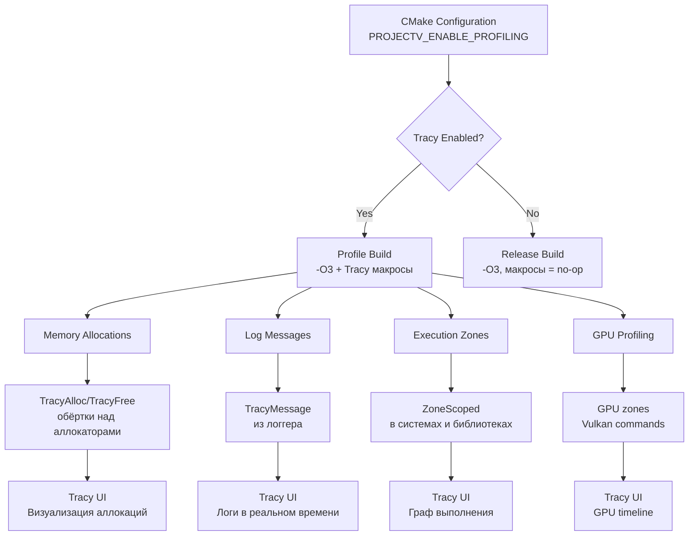

# Profiling Integration Architecture: Tracy hooks для ProjectV

## 🎯 Цель и философия

**Цель:** Создать систему профайлинга, которая:

1. **Интегрирует Tracy во все компоненты** — аллокаторы, библиотеки, системы
2. **Предоставляет zero-overhead в Release** — макросы становятся no-op без Tracy
3. **Визуализирует всё в реальном времени** — аллокации, сообщения, зоны выполнения
4. **Конфигурируется через CMake** — отдельная Profile сборка с оптимизациями
5. **Измеряет производительность аллокаторов** — сравнение с системным malloc

**Философия:** Профайлинг включается только в специальной конфигурации сборки (Profile). В Debug он слишком медленный, в
Retail/Shipping — недопустимый overhead. Tracy hooks интегрируются в критические пути через макросы.

## 🏗️ Архитектурная схема



## 📦 Компоненты системы

### 1. CMake конфигурация

```cmake
# В корневом CMakeLists.txt
option(PROJECTV_ENABLE_PROFILING "Enable Tracy profiling in Profile builds" OFF)

if(PROJECTV_ENABLE_PROFILING)
    # Добавляем Tracy как поддиректорию
    add_subdirectory(external/tracy)

    # Определяем макрос для включения Tracy
    add_definitions(-DTRACY_ENABLE)

    # Оптимизации для Profile сборки
    if(MSVC)
        target_compile_options(ProjectV PRIVATE /O2 /Ob2 /Oi /Ot /GL)
        target_link_options(ProjectV PRIVATE /LTCG)
    else()
        target_compile_options(ProjectV PRIVATE -O3 -march=native -flto)
        target_link_options(ProjectV PRIVATE -flto)
    endif()

    # Связываем с TracyClient
    target_link_libraries(ProjectV PRIVATE Tracy::TracyClient)

    message(STATUS "Tracy profiling enabled (Profile build configuration)")
else()
    # В Release сборке макросы Tracy становятся no-op
    add_definitions(-DTRACY_NO_FRAME_IMAGE -DTRACY_NO_VSYNC_CAPTURE)
    message(STATUS "Tracy profiling disabled (Release build configuration)")
endif()

# Отдельная конфигурация для Profile
set(CMAKE_CXX_FLAGS_PROFILE "${CMAKE_CXX_FLAGS_RELEASE}")
set(CMAKE_C_FLAGS_PROFILE "${CMAKE_C_FLAGS_RELEASE}")
set(CMAKE_EXE_LINKER_FLAGS_PROFILE "${CMAKE_EXE_LINKER_FLAGS_RELEASE}")
```

### 2. Макросы для интеграции с аллокаторами

```cpp
module;
#ifdef TRACY_ENABLE
#include <tracy/Tracy.hpp>
#else
// Пустые макросы когда Tracy отключен
#define ZoneScoped
#define ZoneScopedN(name)
#define ZoneText(text, size)
#define ZoneValue(value)
#define TracyAlloc(ptr, size) (void)(ptr), (void)(size)
#define TracyFree(ptr) (void)(ptr)
#define TracyMessage(text, size) (void)(text), (void)(size)
#define TracyMessageL(text) (void)(text)
#define TracyMessageC(text, color) (void)(text), (void)(color)
#define FrameMark
#define FrameMarkNamed(name)
#define FrameImage(image, width, height, offset, flip)
#endif

export module projectv.core.profiling.macros;

import std;

namespace projectv::core::profiling {

// Обёртки над Tracy макросами с type safety
class ProfilingMacros {
public:
    // Зона выполнения (scoped)
    class Zone {
    public:
        Zone(const char* name) {
            #ifdef TRACY_ENABLE
            ZoneScopedN(name);
            #endif
        }

        ~Zone() = default;

        Zone(const Zone&) = delete;
        Zone& operator=(const Zone&) = delete;

        // Добавить текст к зоне
        void setText(const char* text) {
            #ifdef TRACY_ENABLE
            ZoneText(text, std::strlen(text));
            #endif
        }

        template<typename T>
        void setValue(T value) {
            #ifdef TRACY_ENABLE
            ZoneValue(value);
            #endif
        }
    };

    // Отметка аллокации
    static void trackAllocation(void* ptr, size_t size) noexcept {
        #ifdef TRACY_ENABLE
        TracyAlloc(ptr, size);
        #endif
    }

    // Отметка освобождения
    static void trackFree(void* ptr) noexcept {
        #ifdef TRACY_ENABLE
        TracyFree(ptr);
        #endif
    }

    // Отправка сообщения в Tracy
    static void sendMessage(const char* text) noexcept {
        #ifdef TRACY_ENABLE
        TracyMessageL(text);
        #endif
    }

    static void sendMessage(const std::string& text) noexcept {
        #ifdef TRACY_ENABLE
        TracyMessageL(text.c_str());
        #endif
    }

    // Отметка кадра
    static void markFrame() noexcept {
        #ifdef TRACY_ENABLE
        FrameMark;
        #endif
    }

    static void markFrame(const char* name) noexcept {
        #ifdef TRACY_ENABLE
        FrameMarkNamed(name);
        #endif
    }
};

} // namespace projectv::core::profiling

// Удобные макросы для использования в коде
#ifdef TRACY_ENABLE
#define PROJECTV_PROFILE_ZONE(name) ::projectv::core::profiling::ProfilingMacros::Zone PROJECTV_CONCAT(_profile_zone_, __LINE__)(name)
#define PROJECTV_PROFILE_ZONE_TEXT(name, text) \
    ::projectv::core::profiling::ProfilingMacros::Zone PROJECTV_CONCAT(_profile_zone_, __LINE__)(name); \
    PROJECTV_CONCAT(_profile_zone_, __LINE__).setText(text)
#define PROJECTV_PROFILE_ALLOC(ptr, size) ::projectv::core::profiling::ProfilingMacros::trackAllocation(ptr, size)
#define PROJECTV_PROFILE_FREE(ptr) ::projectv::core::profiling::ProfilingMacros::trackFree(ptr)
#define PROJECTV_PROFILE_MESSAGE(text) ::projectv::core::profiling::ProfilingMacros::sendMessage(text)
#define PROJECTV_PROFILE_FRAME() ::projectv::core::profiling::ProfilingMacros::markFrame()
#define PROJECTV_PROFILE_FRAME_NAMED(name) ::projectv::core::profiling::ProfilingMacros::markFrame(name)
#else
#define PROJECTV_PROFILE_ZONE(name) (void)0
#define PROJECTV_PROFILE_ZONE_TEXT(name, text) (void)0
#define PROJECTV_PROFILE_ALLOC(ptr, size) (void)(ptr), (void)(size)
#define PROJECTV_PROFILE_FREE(ptr) (void)(ptr)
#define PROJECTV_PROFILE_MESSAGE(text) (void)(text)
#define PROJECTV_PROFILE_FRAME() (void)0
#define PROJECTV_PROFILE_FRAME_NAMED(name) (void)0
#endif

// Вспомогательный макрос для конкатенации
#define PROJECTV_CONCAT_IMPL(x, y) x##y
#define PROJECTV_CONCAT(x, y) PROJECTV_CONCAT_IMPL(x, y)
```

### 3. Интеграция с MemoryManager

```cpp
module;
export module projectv.core.memory.profiled_allocator;

import std;
import projectv.core.memory;
import projectv.core.profiling.macros;

namespace projectv::core::memory {

// Profiled версия аллокаторов с Tracy hooks
class ProfiledPageAllocator : public PageAllocator {
public:
    [[nodiscard]] static std::expected<void*, AllocationError>
    allocatePage(size_t size, size_t alignment = 64) noexcept {
        PROJECTV_PROFILE_ZONE("PageAllocator::allocatePage");

        auto result = PageAllocator::allocatePage(size, alignment);
        if (result) {
            PROJECTV_PROFILE_ALLOC(*result, size);
            PROJECTV_PROFILE_MESSAGE(std::format("Page allocated: {} bytes at {}", size, *result));
        }

        return result;
    }

    static void freePage(void* page, size_t size) noexcept {
        PROJECTV_PROFILE_ZONE("PageAllocator::freePage");

        if (page) {
            PROJECTV_PROFILE_FREE(page);
            PROJECTV_PROFILE_MESSAGE(std::format("Page freed: {} bytes at {}", size, page));
        }

        PageAllocator::freePage(page, size);
    }
};

class ProfiledArenaAllocator : public ArenaAllocator {
public:
    ProfiledArenaAllocator(void* memory, size_t size) noexcept
        : ArenaAllocator(memory, size) {}

    [[nodiscard]] void* allocate(size_t size, size_t alignment = alignof(std::max_align_t)) noexcept {
        PROJECTV_PROFILE_ZONE("ArenaAllocator::allocate");

        void* ptr = ArenaAllocator::allocate(size, alignment);
        if (ptr) {
            PROJECTV_PROFILE_ALLOC(ptr, size);
        }

        return ptr;
    }

    void reset() noexcept {
        PROJECTV_PROFILE_ZONE("ArenaAllocator::reset");
        ArenaAllocator::reset();
    }
};

class ProfiledPoolAllocator : public PoolAllocator {
public:
    ProfiledPoolAllocator(size_t objectSize, size_t capacity) noexcept
        : PoolAllocator(objectSize, capacity) {
        PROJECTV_PROFILE_MESSAGE(std::format("Pool created: {} objects of {} bytes", capacity, objectSize));
    }

    [[nodiscard]] void* allocate() noexcept {
        PROJECTV_PROFILE_ZONE("PoolAllocator::allocate");

        void* ptr = PoolAllocator::allocate();
        if (ptr) {
            PROJECTV_PROFILE_ALLOC(ptr, objectSize_);
        }

        return ptr;
    }

    void deallocate(void* ptr) noexcept {
        PROJECTV_PROFILE_ZONE("PoolAllocator::deallocate");

        if (ptr) {
            PROJECTV_PROFILE_FREE(ptr);
        }

        PoolAllocator::deallocate(ptr);
    }
};

// Profiled GlobalMemoryManager
class ProfiledGlobalMemoryManager : public GlobalMemoryManager {
public:
    [[nodiscard]] ArenaAllocator& getThreadArena() noexcept {
        PROJECTV_PROFILE_ZONE("GlobalMemoryManager::getThreadArena");
        return GlobalMemoryManager::getThreadArena();
    }

    [[nodiscard]] PoolAllocator createPool(size_t objectSize, size_t capacity) noexcept {
        PROJECTV_PROFILE_ZONE("GlobalMemoryManager::createPool");
        return ProfiledPoolAllocator(objectSize, capacity);
    }

    [[nodiscard]] Statistics getStatistics() const noexcept {
        PROJECTV_PROFILE_ZONE("GlobalMemoryManager::getStatistics");
        return GlobalMemoryManager::getStatistics();
    }
};

} // namespace projectv::core::memory
```

### 4. Интеграция с Logging System

```cpp
module;
export module projectv.core.logging.profiled_logger;

import std;
import projectv.core.logging;
import projectv.core.profiling.macros;

namespace projectv::core::logging {

class ProfiledLogger : public Logger {
public:
    template<typename... Args>
    void log(LogLevel level, LogCategory category, std::format_string<Args...> fmt, Args&&... args) noexcept {
        PROJECTV_PROFILE_ZONE("Logger::log");

        // Вызываем базовый метод
        Logger::log(level, category, fmt, std::forward<Args>(args)...);

        // Отправляем критические ошибки в Tracy
        if (level >= LogLevel::Error && enableTracyOutput_) {
            // Используем std::format_to_n с буфером фиксированного размера вместо try-catch
            char messageBuffer[512];
            auto result = std::format_to_n(messageBuffer, sizeof(messageBuffer) - 1,
                                          fmt.get(), std::forward<Args>(args)...);
            messageBuffer[result.size] = '\0';

            // Добавляем категорию к сообщению
            char fullMessageBuffer[768];
            auto fullResult = std::format_to_n(fullMessageBuffer, sizeof(fullMessageBuffer) - 1,
                                              "[{}] {}", categoryToString(category), std::string_view(messageBuffer, result.size));
            fullMessageBuffer[fullResult.size] = '\0';

            PROJECTV_PROFILE_MESSAGE(fullMessageBuffer);
        }
    }

private:
    static const char* categoryToString(LogCategory category) noexcept {
        switch (category) {
            case LogCategory::Core:    return "CORE";
            case LogCategory::Memory:  return "MEMORY";
            case LogCategory::Vulkan:  return "VULKAN";
            case LogCategory::Physics: return "PHYSICS";
            case LogCategory::ECS:     return "ECS";
            case LogCategory::Asset:   return "ASSET";
            case LogCategory::Audio:   return "AUDIO";
            case LogCategory::UI:      return "UI";
            case LogCategory::Network: return "NETWORK";
            case LogCategory::Scripting: return "SCRIPTING";
            default:                   return "CUSTOM";
        }
    }
};

} // namespace projectv::core::logging
```

## 🔧 Интеграция со сторонними библиотеками

### 1. Vulkan/VMA Profiling Hooks

```cpp
module;
#include <vulkan/vulkan.h>
#ifdef TRACY_ENABLE
#include <tracy/TracyVulkan.hpp>
#endif

export module projectv.graphics.vulkan.profiling;

import std;
import projectv.core.profiling.macros;

namespace projectv::graphics::vulkan {

class VulkanProfiler {
#ifdef TRACY_ENABLE
    TracyVkCtx tracyContext_;
#endif
    VkDevice device_;

public:
    VulkanProfiler(VkDevice device, VkPhysicalDevice physicalDevice,
                   VkQueue queue, uint32_t queueFamilyIndex)
        : device_(device) {
#ifdef TRACY_ENABLE
        tracyContext_ = TracyVkContext(physicalDevice, device, queue,
                                      queueFamilyIndex, nullptr);
#endif
    }

    ~VulkanProfiler() {
#ifdef TRACY_ENABLE
        TracyVkDestroy(tracyContext_);
#endif
    }

    // Отметка начала команды
    void beginCommand(VkCommandBuffer cmd, const char* name) {
#ifdef TRACY_ENABLE
        TracyVkZone(tracyContext_, cmd, name);
#endif
        PROJECTV_PROFILE_ZONE_TEXT("Vulkan Command", name);
    }

    // Отметка конца команды
    void endCommand(VkCommandBuffer cmd) {
#ifdef TRACY_ENABLE
        TracyVkCollect(tracyContext_, cmd);
#endif
    }

    // Именованный кадр для графики
    void markGraphicsFrame() {
        PROJECTV_PROFILE_FRAME_NAMED("Graphics");
    }
};

// Profiled версия VulkanAllocator
class ProfiledVulkanAllocator : public VulkanAllocator {
public:
    static VkAllocationCallbacks getAllocationCallbacks() noexcept {
        PROJECTV_PROFILE_ZONE("VulkanAllocator::getAllocationCallbacks");

        VkAllocationCallbacks callbacks = VulkanAllocator::getAllocationCallbacks();

        // Заменяем функции на profiled версии
        callbacks.pfnAllocation = &profiledVulkanAllocation;
        callbacks.pfnReallocation = &profiledVulkanReallocation;
        callbacks.pfnFree = &profiledVulkanFree;

        return callbacks;
    }

private:
    static void* VKAPI_CALL profiledVulkanAllocation(
        void* pUserData, size_t size, size_t alignment,
        VkSystemAllocationScope allocationScope) {

        PROJECTV_PROFILE_ZONE("VulkanAllocation");

        void* ptr = VulkanAllocator::vulkanAllocation(pUserData, size,
                                                     alignment, allocationScope);
        if (ptr) {
            PROJECTV_PROFILE_ALLOC(ptr, size);
            PROJECTV_PROFILE_MESSAGE(std::format("Vulkan allocation: {} bytes, scope: {}",
                size, allocationScopeToString(allocationScope)));
        }

        return ptr;
    }

    static void* VKAPI_CALL profiledVulkanReallocation(
        void* pUserData, void* pOriginal, size_t size,
        size_t alignment, VkSystemAllocationScope allocationScope) {

        PROJECTV_PROFILE_ZONE("VulkanReallocation");

        void* newPtr = VulkanAllocator::vulkanReallocation(pUserData, pOriginal,
                                                          size, alignment, allocationScope);
        if (newPtr && pOriginal) {
            PROJECTV_PROFILE_ALLOC(newPtr, size);
            PROJECTV_PROFILE_FREE(pOriginal);
            PROJECTV_PROFILE_MESSAGE(std::format("Vulkan reallocation: {} bytes, old={}, new={}",
                size, static_cast<void*>(pOriginal), static_cast<void*>(newPtr)));
        }

        return newPtr;
    }

    static void VKAPI_CALL profiledVulkanFree(
        void* pUserData, void* pMemory) {

        PROJECTV_PROFILE_ZONE("VulkanFree");

        if (pMemory) {
            PROJECTV_PROFILE_FREE(pMemory);
            PROJECTV_PROFILE_MESSAGE(std::format("Vulkan free: {}", static_cast<void*>(pMemory)));
        }

        VulkanAllocator::vulkanFree(pUserData, pMemory);
    }

    static const char* allocationScopeToString(VkSystemAllocationScope scope) noexcept {
        switch (scope) {
            case VK_SYSTEM_ALLOCATION_SCOPE_COMMAND: return "COMMAND";
            case VK_SYSTEM_ALLOCATION_SCOPE_OBJECT: return "OBJECT";
            case VK_SYSTEM_ALLOCATION_SCOPE_CACHE: return "CACHE";
            case VK_SYSTEM_ALLOCATION_SCOPE_DEVICE: return "DEVICE";
            case VK_SYSTEM_ALLOCATION_SCOPE_INSTANCE: return "INSTANCE";
            default: return "UNKNOWN";
        }
    }
};

} // namespace projectv::graphics::vulkan
```

### 2. SDL3 Profiling Hooks

```cpp
module;
#include <SDL3/SDL.h>
export module projectv.platform.sdl.profiling;

import std;
import projectv.core.profiling.macros;

namespace projectv::platform::sdl {

class ProfiledSdlAllocator {
public:
    static void* allocate(size_t size) noexcept {
        PROJECTV_PROFILE_ZONE("SDLAllocation");

        void* ptr = SDL_malloc(size);
        if (ptr) {
            PROJECTV_PROFILE_ALLOC(ptr, size);
            PROJECTV_PROFILE_MESSAGE(std::format("SDL allocation: {} bytes at {}", size, ptr));
        }

        return ptr;
    }

    static void* reallocate(void* ptr, size_t size) noexcept {
        PROJECTV_PROFILE_ZONE("SDLReallocation");

        void* newPtr = SDL_realloc(ptr, size);
        if (newPtr && ptr) {
            PROJECTV_PROFILE_ALLOC(newPtr, size);
            PROJECTV_PROFILE_FREE(ptr);
            PROJECTV_PROFILE_MESSAGE(std::format("SDL reallocation: {} bytes, old={}, new={}",
                size, ptr, newPtr));
        }

        return newPtr;
    }

    static void free(void* ptr) noexcept {
        PROJECTV_PROFILE_ZONE("SDLFree");

        if (ptr) {
            PROJECTV_PROFILE_FREE(ptr);
            PROJECTV_PROFILE_MESSAGE(std::format("SDL free: {}", ptr));
        }

        SDL_free(ptr);
    }

    // Установка кастомных аллокаторов SDL
    static void configureSdlAllocators() noexcept {
        SDL_SetMemoryFunctions(&allocate, &reallocate, &free);
        PROJECTV_PROFILE_MESSAGE("SDL allocators configured with ProjectV profiling");
    }
};

} // namespace projectv::platform::sdl
```

### 3. ECS (Flecs) Profiling Hooks

```cpp
module;
#include <flecs.h>
export module projectv.ecs.flecs.profiling;

import std;
import projectv.core.profiling.macros;

namespace projectv::ecs::flecs {

class ProfiledFlecsAllocator {
public:
    static void* allocate(ecs_size_t size, ecs_size_t alignment, const char* type_name, void* context) {
        PROJECTV_PROFILE_ZONE_TEXT("FlecsAllocation", type_name);

        void* ptr = flecs::os_api_malloc(size, alignment, type_name, context);
        if (ptr) {
            PROJECTV_PROFILE_ALLOC(ptr, size);
            PROJECTV_PROFILE_MESSAGE(std::format("Flecs allocation: {} bytes for {} at {}",
                size, type_name ? type_name : "unknown", ptr));
        }

        return ptr;
    }

    static void free(void* ptr, ecs_size_t size, const char* type_name, void* context) {
        PROJECTV_PROFILE_ZONE_TEXT("FlecsFree", type_name);

        if (ptr) {
            PROJECTV_PROFILE_FREE(ptr);
            PROJECTV_PROFILE_MESSAGE(std::format("Flecs free: {} bytes for {} at {}",
                size, type_name ? type_name : "unknown", ptr));
        }

        flecs::os_api_free(ptr, size, type_name, context);
    }

    static void* reallocate(void* ptr, ecs_size_t size, ecs_size_t alignment,
                           const char* type_name, void* context) {
        PROJECTV_PROFILE_ZONE_TEXT("FlecsReallocation", type_name);

        void* newPtr = flecs::os_api_realloc(ptr, size, alignment, type_name, context);
        if (newPtr && ptr) {
            PROJECTV_PROFILE_ALLOC(newPtr, size);
            PROJECTV_PROFILE_FREE(ptr);
            PROJECTV_PROFILE_MESSAGE(std::format("Flecs reallocation: {} bytes for {}, old={}, new={}",
                size, type_name ? type_name : "unknown", ptr, newPtr));
        }

        return newPtr;
    }

    // Установка аллокаторов Flecs
    static void configureFlecsAllocators() noexcept {
        flecs::os_set_api_defaults();
        flecs::os_api_t api = flecs::os_api_get();

        api.malloc_ = &allocate;
        api.realloc_ = &reallocate;
        api.free_ = &free;

        flecs::os_api_set(&api);
        PROJECTV_PROFILE_MESSAGE("Flecs allocators configured with ProjectV profiling");
    }
};

} // namespace projectv::ecs::flecs
```

## 🚀 Использование в ProjectV

### 1. Инициализация Profiling System

```cpp
module;
export module projectv.core.engine.profiling;

import std;
import projectv.core.profiling.macros;
import projectv.graphics.vulkan.profiling;
import projectv.platform.sdl.profiling;
import projectv.ecs.flecs.profiling;

namespace projectv::core {

class ProfilingSystem {
public:
    ProfilingSystem() {
        PROJECTV_PROFILE_ZONE("ProfilingSystemInit");

        // Настройка аллокаторов с profiling hooks
        configureProfiledAllocators();

        PROJECTV_PROFILE_MESSAGE("Profiling system initialized");
    }

    ~ProfilingSystem() {
        PROJECTV_PROFILE_ZONE("ProfilingSystemShutdown");
        PROJECTV_PROFILE_MESSAGE("Profiling system shutdown");
    }

    // Отметка начала кадра
    void beginFrame() noexcept {
        PROJECTV_PROFILE_FRAME_NAMED("Main");
    }

    // Отметка конца кадра
    void endFrame() noexcept {
        PROJECTV_PROFILE_FRAME();
    }

    // Отметка начала системы
    void beginSystem(const char* system_name) noexcept {
        PROJECTV_PROFILE_ZONE_TEXT("System", system_name);
    }

    // Отметка конца системы
    void endSystem() noexcept {
        // Zone автоматически заканчивается при выходе из scope
    }

private:
    void configureProfiledAllocators() noexcept {
        PROJECTV_PROFILE_ZONE("ConfigureProfiledAllocators");

        // SDL
        projectv::platform::sdl::ProfiledSdlAllocator::configureSdlAllocators();

        // Flecs
        projectv::ecs::flecs::ProfiledFlecsAllocator::configureFlecsAllocators();

        // Vulkan аллокаторы настраиваются при создании VulkanContext
        PROJECTV_PROFILE_MESSAGE("All profiled allocators configured");
    }
};

} // namespace projectv::core
```

### 2. Пример использования в игровом цикле

```cpp
module;
export module projectv.core.game_loop;

import std;
import projectv.core.profiling.macros;
import projectv.core.engine.profiling;

namespace projectv::core {

class GameLoop {
    ProfilingSystem profiling_;

public:
    GameLoop() {
        PROJECTV_PROFILE_ZONE("GameLoopInit");
        PROJECTV_PROFILE_MESSAGE("Game loop initialized");
    }

    void run() {
        PROJECTV_PROFILE_ZONE("GameLoopRun");

        while (isRunning()) {
            profiling_.beginFrame();

            // Обработка ввода
            {
                PROJECTV_PROFILE_ZONE("InputProcessing");
                processInput();
            }

            // Обновление физики
            {
                PROJECTV_PROFILE_ZONE("PhysicsUpdate");
                updatePhysics();
            }

            // Обновление ECS
            {
                PROJECTV_PROFILE_ZONE("EcsUpdate");
                updateEcs();
            }

            // Рендеринг
            {
                PROJECTV_PROFILE_ZONE("Rendering");
                renderFrame();
            }

            profiling_.endFrame();

            // Сбор статистики каждые 60 кадров
            static int frame_counter = 0;
            if (++frame_counter % 60 == 0) {
                logFrameStatistics();
            }
        }
    }

private:
    bool isRunning() const noexcept {
        // Проверка состояния игры
        return true;
    }

    void processInput() noexcept {
        PROJECTV_PROFILE_ZONE("ProcessInputDetails");
        // ... обработка ввода ...
    }

    void updatePhysics() noexcept {
        PROJECTV_PROFILE_ZONE("UpdatePhysicsDetails");
        // ... обновление физики ...
    }

    void updateEcs() noexcept {
        PROJECTV_PROFILE_ZONE("UpdateEcsDetails");
        // ... обновление ECS ...
    }

    void renderFrame() noexcept {
        PROJECTV_PROFILE_ZONE("RenderFrameDetails");
        // ... рендеринг ...
    }

    void logFrameStatistics() noexcept {
        PROJECTV_PROFILE_ZONE("LogFrameStatistics");

        // В реальном коде здесь собирается статистика из различных систем
        PROJECTV_PROFILE_MESSAGE("Frame statistics logged (every 60 frames)");
    }
};

} // namespace projectv::core
```

## 📊 Анализ производительности

### 1. Метрики Tracy

Tracy предоставляет следующие метрики для анализа:

1. **Время выполнения зон:** Длительность каждой ZoneScoped
2. **Аллокации памяти:** Количество и размер выделений/освобождений
3. **Сообщения:** Логи в реальном времени
4. **GPU timeline:** Время выполнения Vulkan команд
5. **Потоки:** Активность всех потоков движка

### 2. Оптимизации на основе профилирования

```cpp
void optimizeBasedOnProfiling() {
    // Пример оптимизаций, выявленных через Tracy:

    // 1. Устранение contention в аллокаторах
    // Tracy показал блокировки в malloc → переход на per-thread арены

    // 2. Оптимизация кэш-локальности
    // Tracy показал cache misses → реорганизация данных по DOD

    // 3. Балансировка нагрузки между потоками
    // Tracy показал idle time в worker threads → настройка Job System

    // 4. Оптимизация рендеринга
    // Tracy показал долгие GPU commands → batch rendering, indirect draws

    PROJECTV_PROFILE_MESSAGE("Optimizations applied based on Tracy profiling data");
}
```

### 3. Сравнение конфигураций

```cpp
void compareBuildConfigurations() {
    // Debug vs Profile vs Release

    // Debug: полная отладка, медленный, с проверками
    // Profile: оптимизированный + Tracy, для профайлинга
    // Release: максимальная производительность, без отладки

    PROJECTV_PROFILE_MESSAGE("Build configuration comparison:");
    PROJECTV_PROFILE_MESSAGE("  Debug: Full debugging, slow, with validation");
    PROJECTV_PROFILE_MESSAGE("  Profile: Optimized + Tracy, for profiling");
    PROJECTV_PROFILE_MESSAGE("  Release: Maximum performance, no debugging");
}
```

## 🎯 Заключение

**Profiling Integration для ProjectV** — это система, которая превращает Tracy из инструмента отладки в архитектурный
компонент движка:

1. **Zero-overhead в Release:** Макросы становятся no-op, нет накладных расходов
2. **Полная интеграция:** Все компоненты движка (память, графика, физика, ECS) имеют Tracy hooks
3. **Архитектурные решения на основе данных:** Профилирование влияет на дизайн систем
4. **Визуализация в реальном времени:** Понимание производительности на всех уровнях стека
5. **Конфигурируемость через CMake:** Отдельная Profile сборка для профайлинга

Система обеспечивает основу для итеративной оптимизации ProjectV, где каждое архитектурное решение может быть измерено,
проанализировано и улучшено на основе реальных данных о производительности.
