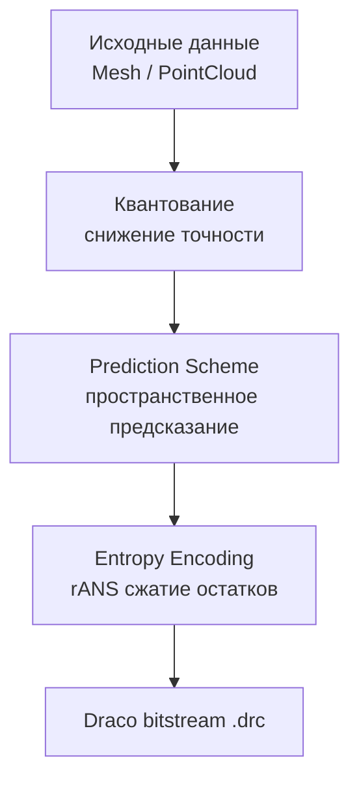

# Draco: Архитектура сжатия геометрии

**Draco** — библиотека сжатия и распаковки 3D геометрических данных (mesh и point cloud) от Google. Решает
фундаментальную проблему передачи объёмных 3D-моделей через сети с ограниченной пропускной способностью и хранения на
устройствах с ограниченной памятью.

---

## Фундаментальная проблема и решение

Трёхмерная геометрия обладает высокой избыточностью: соседние вершины коррелируют по позициям, нормалям и текстурным
координатам. Наивное хранение (массив float) игнорирует эту корреляцию, приводя к избыточному расходу памяти и трафика.

Draco применяет трёхэтапный конвейер сжатия:

1. **Квантование** — снижение точности float значений до дискретных уровней
2. **Предсказание** — использование пространственной корреляции для предсказания значений атрибутов
3. **Энтропийное кодирование** — сжатие остатков (разниц между предсказанным и реальным значением) через rANS (range
   Asymmetric Numeral Systems)

**Архитектурная метафора:** Draco — это не просто архиватор, а лингвист, изучающий язык геометрии. Он не сжимает каждое
слово отдельно, а анализирует грамматику (топологию меша) и предсказывает следующее слово на основе контекста, записывая
только отклонения от предсказания.

---

## Возможности

- **Сжатие mesh** — треугольные меши с connectivity data
- **Сжатие point cloud** — облака точек с произвольными атрибутами
- **Квантование** — контролируемая потеря точности для лучшего сжатия
- **Prediction schemes** — предсказание значений атрибутов по соседним элементам
- **glTF интеграция** — расширение `KHR_draco_mesh_compression`
- **Metadata** — пользовательские данные в сжатом файле
- **Анимации и скиннинг** — через опцию `DRACO_TRANSCODER_SUPPORTED`

## Архитектура сжатия

Конвейер сжатия Draco реализует трёхэтапную архитектуру, где каждый этап решает конкретную задачу по уменьшению
избыточности:



**Архитектурный принцип:** Draco не является простым архиватором — это специализированный процессор геометрических
данных, который анализирует пространственные корреляции, предсказывает значения атрибутов на основе топологии и кодирует
только дельты (разницы) между предсказанными и фактическими значениями. Такой подход обеспечивает сжатие до 90% от
исходного объёма.

## Compression ratio

| Тип данных            | Без сжатия | Draco (default) | Сжатие |
|-----------------------|------------|-----------------|--------|
| Mesh 100K triangles   | 12.5 MB    | 0.8 MB          | 15×    |
| Point cloud 1M points | 28 MB      | 2.1 MB          | 13×    |
| Skinned mesh          | 18 MB      | 1.4 MB          | 12×    |

> **Примечание:** Результаты зависят от настроек квантования и типа геометрии.

## Сравнение с альтернативами

| Функция                 | Draco    | Open3D  | MeshOptimizer |
|-------------------------|----------|---------|---------------|
| Mesh compression        | Да       | Да      | Да            |
| Point cloud compression | Да       | Да      | Нет           |
| Lossless                | Частично | Да      | Нет           |
| glTF extension          | Да       | Нет     | Да            |
| GPU decoding            | Нет      | Нет     | Да            |
| C++ API                 | Да       | Да      | Да            |
| Decode speed            | Средняя  | Быстрая | Быстрая       |

**Когда выбрать Draco:**

- Нужна интеграция с glTF через `KHR_draco_mesh_compression`
- Требуется сжатие point cloud
- Важен максимальный compression ratio
- Данные передаются по сети

**Когда выбрать альтернативы:**

- **MeshOptimizer** — если нужен GPU decoding или lossless
- **Open3D** — если нужен полный pipeline обработки 3D данных

## Компоненты библиотеки

| Компонент              | Назначение                              |
|------------------------|-----------------------------------------|
| `draco::Decoder`       | Декодирование .drc в Mesh/PointCloud    |
| `draco::Encoder`       | Кодирование с базовыми настройками      |
| `draco::ExpertEncoder` | Детальный контроль над каждым атрибутом |
| `draco::Mesh`          | Треугольный меш с атрибутами            |
| `draco::PointCloud`    | Облако точек с атрибутами               |
| `draco_transcoder`     | CLI инструмент для glTF                 |

## Методы кодирования

### Mesh

| Метод       | Описание           | Compression | Decode speed |
|-------------|--------------------|-------------|--------------|
| Edgebreaker | Connectivity-first | Лучший      | Средняя      |
| Sequential  | Simple traversal   | Хороший     | Быстрая      |

### Point Cloud

| Метод      | Описание             | Compression | Decode speed |
|------------|----------------------|-------------|--------------|
| KD-Tree    | Spatial partitioning | Лучший      | Медленная    |
| Sequential | Linear traversal     | Хороший     | Быстрая      |

## Prediction schemes: архитектура пространственного предсказания

Prediction schemes — это семейство алгоритмов, которые используют пространственную корреляцию геометрических данных для
предсказания значений атрибутов. Вместо кодирования абсолютных значений, Draco кодирует остатки (residuals) — разницы
между предсказанными и фактическими значениями, что существенно снижает энтропию данных.

**Архитектурный принцип:** Каждый prediction scheme анализирует локальный контекст (соседние вершины, треугольники,
топологические связи) и строит математическую модель для предсказания следующего значения. Ошибка предсказания (
residual) имеет значительно меньшую дисперсию, чем исходные данные, что делает её идеальной для последующего
энтропийного кодирования.

| Scheme              | Применение     | Математическая модель                      | Пространственный контекст          |
|---------------------|----------------|--------------------------------------------|------------------------------------|
| Parallelogram       | Mesh positions | P = B + C - A (векторная сумма)            | Смежный треугольник ABC            |
| Multi-parallelogram | Mesh positions | P = Σ wᵢ(B + Cᵢ - Aᵢ) (взвешенное среднее) | Множество смежных треугольников    |
| Geometric normal    | Normals        | N = normalize(∇S) (градиент поверхности)   | Локальная геометрия поверхности    |
| Delta               | Generic        | Pᵢ = Vᵢ₋₁ (предыдущее значение)            | Временная/пространственная ося     |
| Tex coords portable | UV             | P_uv = B_uv + C_uv - A_uv (в UV space)     | UV mapping и texture atlas границы |

**Энтропийный выигрыш:** Prediction schemes снижают энтропию данных на 60-80%, что позволяет rANS кодированию достичь
коэффициентов сжатия 3-5× для остатков по сравнению с исходными значениями.

## Квантование: архитектура потери точности

Квантование в Draco — это процесс преобразования непрерывных float значений в дискретные целочисленные уровни с
контролируемой потерей точности. Это фундаментальный этап сжатия, который позволяет существенно уменьшить размер данных
за счёт устранения избыточной точности, невидимой для человеческого восприятия.

**Математическая модель:** Для атрибута с bounding box [min, max] и quantization_bits = N, квантование преобразует float
значение f ∈ [min, max] в целое число q ∈ [0, 2ᴺ-1]:

```
q = round((f - min) / (max - min) * (2ᴺ - 1))
```

Обратное преобразование (де-квантование) восстанавливает приближённое значение:

```
f' = min + q * (max - min) / (2ᴺ - 1)
```

### Архитектура квантования позиций

```cpp
#include <draco/compression/encode.h>
#include <print>

draco::Encoder encoder;

// Автоматическое квантование на основе bounding box
encoder.SetAttributeQuantization(
    draco::GeometryAttribute::POSITION,
    14  // 14 бит на компонент (точность ~0.006%)
);

// Явное задание bounding box для детерминированного квантования
std::array<float, 3> origin = {0.0f, 0.0f, 0.0f};
float range = 100.0f;  // Диапазон [origin, origin + range]

encoder.SetAttributeExplicitQuantization(
    draco::GeometryAttribute::POSITION,
    14,     // quantization_bits
    3,      // num_dims
    origin.data(),
    range
);
```

### Влияние битности на точность и размер

| Бит на компонент | Точность (относительная) | Квантов на диапазон | Эффективный размер данных |
|------------------|--------------------------|---------------------|---------------------------|
| 8                | ~0.4%                    | 256                 | 3× уменьшение             |
| 11               | ~0.05%                   | 2048                | 2× уменьшение             |
| 14               | ~0.006%                  | 16384               | 1.5× уменьшение           |
| 16               | ~0.0015%                 | 65536               | Базовый размер            |

**Архитектурный компромисс:** Выбор битности представляет собой trade-off между точностью геометрии и степенью сжатия.
Для большинства визуальных применений 11-14 бит обеспечивают оптимальный баланс, сохраняя визуальное качество при
значительном уменьшении размера данных.

### Dequantization при декодировании

```cpp
#include <draco/compression/decode.h>
#include <expected>
#include <print>

[[nodiscard]] std::expected<std::unique_ptr<draco::Mesh>, draco::Status> decode_draco(
    std::span<const std::byte> compressed_data) noexcept
{
    draco::DecoderBuffer buffer;
    buffer.Init(reinterpret_cast<const char*>(compressed_data.data()),
                compressed_data.size());

    draco::Decoder decoder;
    // По умолчанию: автоматическая деквантование
    auto result = decoder.DecodeMeshFromBuffer(&buffer);
    if (!result.ok()) {
        return std::unexpected(result.status());
    }
    return std::move(result).value();
}
```

## Требования и архитектурные ограничения

Draco спроектирована как кроссплатформенная библиотека с минимальными зависимостями, что позволяет интегрировать её в
широкий спектр проектов — от настольных приложений до высокопроизводительных систем.

### Языковые требования

- **C++26** (рекомендуется для использования современных возможностей: `std::print`, `std::expected`, `std::span`,
  `std::mdspan`)
- **C++17** (минимальная версия для базовой функциональности)
- **C++14** (ограниченная поддержка через макросы совместимости)

**Архитектурный выбор C++26:** Draco активно использует современные возможности C++ для повышения безопасности,
производительности и выразительности кода:

- `std::expected<T, E>` заменяет исключения для обработки ошибок в performance-critical путях
- `std::span<const T>` обеспечивает безопасный доступ к непрерывным массивам данных
- `std::print` предоставляет типобезопасный форматированный вывод для отладки
- `std::mdspan` (в разработке) оптимизирует работу с многомерными геометрическими данными

### Платформенная поддержка

| Платформа | Компиляторы            | Особенности                        |
|-----------|------------------------|------------------------------------|
| Windows   | MSVC 2019+, Clang, GCC | Поддержка Win32 API, Unicode paths |
| Linux     | GCC 9+, Clang 10+      | POSIX-совместимые системы          |

### Зависимости

**Базовые зависимости:**

- Стандартная библиотека C++ (STL)
- CMake 3.15+ (для сборки)

**Опциональные зависимости:**

- `libpng`, `libjpeg` — для Draco Transcoder (конвертация текстур)
- `zlib` — для дополнительного сжатия метаданных
- `simdjson` — для ускоренного парсинга JSON в glTF интеграции

**Архитектурный принцип минимализма:** Draco сознательно минимизирует внешние зависимости, чтобы обеспечить простую
интеграцию в существующие проекты и избежать конфликтов версий.

## Основные понятия

Ключевые концепции Draco: геометрия, атрибуты, квантование.

### Геометрия

#### PointCloud

Базовый класс для хранения облака точек с атрибутами:

```cpp
#include <draco/point_cloud/point_cloud.h>
#include <span>

draco::PointCloud pc;

// Количество точек
pc.set_num_points(1000);

// Добавление атрибутов
draco::GeometryAttribute positionAttribute;
positionAttribute.Init(draco::GeometryAttribute::POSITION,
                       nullptr, 3, draco::DT_FLOAT32, false,
                       sizeof(float) * 3, 0);
int posAttrId = pc.AddAttribute(positionAttribute, true, 1000);

// Доступ к атрибутам
const draco::PointAttribute* attr = pc.GetNamedAttribute(
    draco::GeometryAttribute::POSITION
);
```

#### Mesh

Расширение PointCloud с connectivity data (грани):

```cpp
#include <draco/mesh/mesh.h>

draco::Mesh mesh;

// Количество граней
mesh.SetNumFaces(500);

// Установка грани
draco::Mesh::Face face;
face[0] = draco::PointIndex(0);
face[1] = draco::PointIndex(1);
face[2] = draco::PointIndex(2);
mesh.SetFace(draco::FaceIndex(0), face);

// Доступ к грани
const draco::Mesh::Face& f = mesh.face(draco::FaceIndex(0));
```

#### Отношения между классами

```
draco::PointCloud
├── num_points()
├── attributes[]
└── metadata

draco::Mesh : public PointCloud
├── num_faces()
├── faces[]
└── corner_table (топология)
```

### Атрибуты

#### GeometryAttribute

Базовое описание атрибута (тип, формат данных):

```cpp
#include <draco/attributes/geometry_attribute.h>

draco::GeometryAttribute posAttr;
posAttr.Init(
    draco::GeometryAttribute::POSITION,  // Тип
    nullptr,                              // DataBuffer (позже)
    3,                                    // num_components (x, y, z)
    draco::DT_FLOAT32,                    // data_type
    false,                                // normalized
    sizeof(float) * 3,                    // byte_stride
    0                                     // byte_offset
);
```

#### Типы атрибутов

```cpp
enum Type {
    POSITION = 0,   // Позиции вершин
    NORMAL,         // Нормали
    COLOR,          // Цвета
    TEX_COORD,      // Текстурные координаты
    GENERIC,        // Пользовательские данные
#ifdef DRACO_TRANSCODER_SUPPORTED
    TANGENT,        // Тангенты
    MATERIAL,       // Material indices
    JOINTS,         // Bone indices (skinning)
    WEIGHTS,        // Bone weights (skinning)
#endif
};
```

#### Типы данных

```cpp
enum DataType {
    DT_INT8,
    DT_UINT8,
    DT_INT16,
    DT_UINT16,
    DT_INT32,
    DT_UINT32,
    DT_INT64,
    DT_UINT64,
    DT_FLOAT32,
    DT_FLOAT64,
    DT_BOOL
};
```

#### PointAttribute

Расширяет GeometryAttribute с mapping данных:

```cpp
#include <draco/attributes/point_attribute.h>

// Создание через PointCloud
int attrId = mesh.AddAttribute(
    geomAttr,           // GeometryAttribute
    true,               // identity_mapping (1:1)
    num_values          // количество значений
);

// Доступ
draco::PointAttribute* attr = mesh.attribute(attrId);

// Установка значения
std::array<float, 3> pos = {1.0f, 2.0f, 3.0f};
attr->SetAttributeValue(draco::AttributeValueIndex(0), pos.data());

// Чтение значения
std::array<float, 3> outPos;
attr->GetValue(draco::AttributeValueIndex(0), outPos.data());
```

#### Mapping точек к значениям

Каждая точка может ссылаться на значение атрибута:

```cpp
// Identity mapping: point i → value i
// Используется при AddAttribute(..., true, ...)

// Explicit mapping: точка → произвольное значение
// Используется при AddAttribute(..., false, ...)
for (draco::PointIndex i(0); i < mesh.num_points(); ++i) {
    attr->SetPointMapEntry(i, draco::AttributeValueIndex(i.value() % 3));
}
```

### Индексы

Draco использует типизированные индексы для безопасности:

```cpp
// Типы индексов
draco::PointIndex           // Индекс точки
draco::FaceIndex            // Индекс грани
draco::CornerIndex          // Индекс угла (3 угла на грань)
draco::AttributeValueIndex  // Индекс значения атрибута

// Использование
draco::PointIndex pt(42);
uint32_t value = pt.value();  // Получение числового значения

// Сравнение
if (pt == draco::PointIndex(42)) { /* ... */ }

// Инкремент
for (draco::PointIndex i(0); i < mesh.num_points(); ++i) { /* ... */ }
```

#### Corner Table

Топология меша для навигации по смежным элементам:

```cpp
#include <draco/mesh/corner_table.h>

// Corner = вершина в конкретной грани
// Каждая грань имеет 3 corner: 0, 1, 2

// Получение corner для грани
draco::CornerIndex c0(3 * faceIndex.value() + 0);  // Первый corner
draco::CornerIndex c1(3 * faceIndex.value() + 1);  // Второй corner
draco::CornerIndex c2(3 * faceIndex.value() + 2);  // Третий corner

// Навигация (через CornerTable)
draco::CornerTable ct(mesh);
draco::CornerIndex next = ct.Next(c0);   // Следующий corner в грани
draco::CornerIndex prev = ct.Previous(c0); // Предыдущий corner в грани
draco::CornerIndex opp = ct.Opposite(c0);  // Противоположный corner
```

### BoundingBox

Вычисление границ геометрии:

```cpp
#include <draco/core/bounding_box.h>

draco::BoundingBox bbox = mesh.ComputeBoundingBox();

draco::Vector3f min = bbox.GetMinPoint();
draco::Vector3f max = bbox.GetMaxPoint();

// Размер
draco::Vector3f size = bbox.Size();
```

### Deduplication

Устранение дубликатов:

```cpp
#ifdef DRACO_ATTRIBUTE_INDICES_DEDUPLICATION_SUPPORTED
// Дедупликация точек с одинаковыми атрибутами
mesh.DeduplicatePointIds();
#endif

#ifdef DRACO_ATTRIBUTE_VALUES_DEDUPLICATION_SUPPORTED
// Дедупликация одинаковых значений атрибутов
mesh.DeduplicateAttributeValues();
#endif
```

### Metadata

Пользовательские данные в сжатом файле:

```cpp
#include <draco/metadata/geometry_metadata.h>
#include <memory>

// Добавление metadata в PointCloud
auto metadata = std::make_unique<draco::GeometryMetadata>();
metadata->AddEntryString("name", "MyModel");
metadata->AddEntryInt("version", 1);

pc.AddMetadata(std::move(metadata));

// Metadata для атрибута
auto attrMetadata = std::make_unique<draco::AttributeMetadata>(posAttrId);
attrMetadata->AddEntryString("semantic", "vertex_position");
pc.AddAttributeMetadata(posAttrId, std::move(attrMetadata));

// Чтение metadata
const draco::GeometryMetadata* meta = pc.GetMetadata();
if (meta) {
    std::string name;
    if (meta->GetEntryString("name", &name)) {
        std::println("Model name: {}", name);
    }
}
```

## Формат файла

### Заголовок Draco

```
Offset  Size  Field
------  ----  -----
0       5     "DRACO"
5       1     version_major
6       1     version_minor
7       1     encoder_type (mesh/point cloud)
8       1     encoder_method
9       2     flags
```

### Проверка типа геометрии

```cpp
#include <draco/compression/decode.h>
#include <expected>
#include <print>

[[nodiscard]] std::expected<draco::EncodedGeometryType, draco::Status> get_geometry_type(
    std::span<const std::byte> data) noexcept
{
    draco::DecoderBuffer buffer;
    buffer.Init(reinterpret_cast<const char*>(data.data()), data.size());
    return draco::Decoder::GetEncodedGeometryType(&buffer);
}

int main() {
    std::vector<std::byte> data = load_file("model.drc");
    auto type = get_geometry_type(data);
    if (!type) {
        std::println(stderr, "Ошибка: {}", type.error().error_msg());
        return 1;
    }

    switch (*type) {
        case draco::TRIANGULAR_MESH:
            std::println("Mesh");
            break;
        case draco::POINT_CLOUD:
            std::println("Point cloud");
            break;
        case draco::INVALID_GEOMETRY_TYPE:
            std::println("Invalid");
            break;
    }
    return 0;
}
```

---

## Методы кодирования

Описание методов сжатия для mesh и point cloud.

### Обзор

Draco использует разные стратегии для mesh и point cloud:

```
Mesh          Point Cloud
─────         ───────────
Edgebreaker   KD-Tree
Sequential    Sequential
```

### Mesh Encoding

#### Edgebreaker: архитектура сжатия связности

Edgebreaker — это алгоритм сжатия connectivity data (топологии) треугольных мешей, основанный на обходе графа граней.
Алгоритм преобразует трёхмерную топологию в последовательность символов CLERS (Create, Left, End, Right, Split), которая
компактно описывает структуру меша.

**Математическая модель:** Для ориентированного меша с эйлеровой характеристикой χ = V - E + F, Edgebreaker генерирует
последовательность длиной примерно 2F бит, что близко к теоретическому пределу сжатия для треугольных мешей.

```cpp
#include <draco/compression/encode.h>
#include <print>

draco::Encoder encoder;
encoder.SetEncodingMethod(draco::MESH_EDGEBREAKER_ENCODING);
```

**Архитектурные компоненты:**

1. **Connectivity traversal** — обход меша в глубину с поддержкой hole sealing
2. **CLERS encoding** — преобразование пути обхода в символьную последовательность
3. **Valence coding** — дополнительное сжатие на основе валентности вершин
4. **Entropy coding** — применение rANS к символьному потоку

**Преимущества архитектуры:**

- **Оптимальное сжатие связности** — достигает 1-2 бита на треугольник
- **Поддержка произвольной топологии** — работает с мешами любой сложности
- **Детерминированность** — гарантированное восстановление исходной топологии

**Ограничения:**

- **Вычислительная сложность** — O(F) по времени и памяти
- **Зависимость от валентности** — эффективность снижается для high-valence мешей
- **Последовательная природа** — ограниченный потенциал для параллелизации

#### Sequential

Простой линейный обход mesh.

```cpp
draco::Encoder encoder;
encoder.SetEncodingMethod(draco::MESH_SEQUENTIAL_ENCODING);
encoder.SetSpeedOptions(10, 10);  // Максимальная скорость
```

**Принцип работы:**

1. Последовательное кодирование вершин
2. Последовательное кодирование граней
3. Delta coding для атрибутов

**Преимущества:**

- Быстрое кодирование и декодирование
- Простая реализация
- Предсказуемое время работы

**Недостатки:**

- Худший compression ratio
- Не использует топологию

#### Сравнение методов для Mesh

| Характеристика | Edgebreaker | Sequential |
|----------------|-------------|------------|
| Compression    | Лучший      | Хороший    |
| Decode speed   | Средняя     | Быстрая    |
| Encode speed   | Медленная   | Быстрая    |
| Сложность      | Высокая     | Низкая     |

#### Выбор метода

```cpp
// Максимальное сжатие
encoder.SetEncodingMethod(draco::MESH_EDGEBREAKER_ENCODING);
encoder.SetSpeedOptions(0, 0);

// Баланс
encoder.SetEncodingMethod(draco::MESH_EDGEBREAKER_ENCODING);
encoder.SetSpeedOptions(5, 5);

// Максимальная скорость
encoder.SetEncodingMethod(draco::MESH_SEQUENTIAL_ENCODING);
encoder.SetSpeedOptions(10, 10);
```

### Point Cloud Encoding

#### KD-Tree Encoding

Оптимальный метод для point cloud.

```cpp
draco::Encoder encoder;
encoder.SetEncodingMethod(draco::POINT_CLOUD_KD_TREE_ENCODING);
encoder.SetSpeedOptions(0, 0);  // Лучший compression
```

**Принцип работы:**

1. Построение KD-tree по позициям точек
2. Рекурсивное разбиение пространства
3. Кодирование позиций через tree traversal
4. Кодирование атрибутов с учётом spatial locality

**Преимущества:**

- Лучший compression ratio
- Использует spatial coherence
- Эффективен для плотных облаков

**Недостатки:**

- Медленное кодирование
- Требует квантования позиций

#### Sequential Encoding

Простой линейный обход.

```cpp
draco::Encoder encoder;
encoder.SetEncodingMethod(draco::POINT_CLOUD_SEQUENTIAL_ENCODING);
encoder.SetSpeedOptions(10, 10);
```

**Преимущества:**

- Быстрое кодирование
- Быстрое декодирование
- Не требует квантования

**Недостатки:**

- Худший compression ratio
- Не использует spatial coherence

#### Сравнение методов для Point Cloud

| Характеристика       | KD-Tree   | Sequential |
|----------------------|-----------|------------|
| Compression          | Лучший    | Хороший    |
| Decode speed         | Медленная | Быстрая    |
| Encode speed         | Медленная | Быстрая    |
| Требует quantization | Да        | Нет        |

### Speed Options

Параметр `SetSpeedOptions(encoding_speed, decoding_speed)` контролирует trade-off:

```cpp
// 0 = максимальное сжатие, минимальная скорость
// 10 = минимальное сжатие, максимальная скорость

encoder.SetSpeedOptions(0, 0);   // Максимальный compression
encoder.SetSpeedOptions(5, 5);   // Баланс
encoder.SetSpeedOptions(10, 10); // Максимальная скорость
encoder.SetSpeedOptions(0, 10);  // Медленное кодирование, быстрое декодирование
```

#### Влияние на алгоритмы

| Speed | Prediction schemes | Entropy coding |
|-------|--------------------|----------------|
| 0     | Все доступные      | rANS adaptive  |
| 5     | Основные           | rANS           |
| 10    | Delta only         | Direct         |

### Внутренняя структура encoding

#### Pipeline для Mesh (Edgebreaker)

```
Mesh
  ↓
Connectivity Encoding (Edgebreaker)
  ├── Traversal (depth-first)
  ├── Clers encoding
  └── Hole sealing
  ↓
Attribute Encoding
  ├── Prediction (parallelogram)
  ├── Transform (quantization)
  └── Entropy coding (rANS)
  ↓
Bitstream
```

#### Pipeline для Point Cloud (KD-Tree)

```
PointCloud
  ↓
Position Encoding
  ├── Quantization
  ├── KD-Tree construction
  └── Tree encoding
  ↓
Attribute Encoding
  ├── Prediction (spatial)
  ├── Transform
  └── Entropy coding
  ↓
Bitstream
```

### Traversal методы

Для mesh encoding доступны разные traversal стратегии:

```cpp
// Depth-first traversal (default)
// MESH_TRAVERSAL_DEPTH_FIRST

// Prediction degree traversal
// MESH_TRAVERSAL_PREDICTION_DEGREE
```

Traversal влияет на порядок обработки вершин и качество предсказания.

### Entropy Coding

Draco использует rANS (range Asymmetric Numeral Systems):

```cpp
// Автоматически выбирается на основе speed options
// Низкий speed = rANS adaptive
// Высокий speed = direct bit coding
```

#### Типы entropy coders

| Coder                    | Использование         |
|--------------------------|-----------------------|
| `RAnsBitEncoder`         | Базовый rANS          |
| `AdaptiveRAnsBitEncoder` | Адаптивный rANS       |
| `DirectBitEncoder`       | Без сжатия (speed=10) |
| `SymbolBitEncoder`       | Для symbol data       |

### Connectivity Encoding Variants

Для Edgebreaker доступны варианты:

```cpp
enum MeshEdgebreakerConnectivityEncodingMethod {
    MESH_EDGEBREAKER_STANDARD_ENCODING = 0,
    MESH_EDGEBREAKER_PREDICTIVE_ENCODING = 1,  // Deprecated
    MESH_EDGEBREAKER_VALENCE_ENCODING = 2,     // Лучший compression
};
```

#### Valence Encoding

Использует valence (количество соседних граней) для лучшего сжатия:

```cpp
// Valence encoding включается автоматически при низком speed
encoder.SetSpeedOptions(0, 0);  // Valence encoding активен
```

### Примеры конфигураций

#### Максимальное сжатие (offline)

```cpp
draco::Encoder encoder;
encoder.SetEncodingMethod(draco::MESH_EDGEBREAKER_ENCODING);
encoder.SetSpeedOptions(0, 0);
encoder.SetAttributeQuantization(draco::GeometryAttribute::POSITION, 11);
encoder.SetAttributeQuantization(draco::GeometryAttribute::NORMAL, 8);
encoder.SetAttributeQuantization(draco::GeometryAttribute::TEX_COORD, 10);
```

#### Быстрое кодирование (real-time)

```cpp
draco::Encoder encoder;
encoder.SetEncodingMethod(draco::MESH_SEQUENTIAL_ENCODING);
encoder.SetSpeedOptions(10, 10);
encoder.SetAttributeQuantization(draco::GeometryAttribute::POSITION, 14);
```

#### Быстрое декодирование (runtime)

```cpp
draco::Encoder encoder;
encoder.SetEncodingMethod(draco::MESH_EDGEBREAKER_ENCODING);
encoder.SetSpeedOptions(5, 10);  // Медленное кодирование, быстрое декодирование
encoder.SetAttributeQuantization(draco::GeometryAttribute::POSITION, 12);
```

#### Streaming (point cloud)

```cpp
draco::Encoder encoder;
encoder.SetEncodingMethod(draco::POINT_CLOUD_SEQUENTIAL_ENCODING);
encoder.SetSpeedOptions(10, 10);
// Без квантования для сохранения точности
```

#### Dense point cloud (LiDAR)

```cpp
draco::Encoder encoder;
encoder.SetEncodingMethod(draco::POINT_CLOUD_KD_TREE_ENCODING);
encoder.SetSpeedOptions(0, 0);
encoder.SetAttributeQuantization(draco::GeometryAttribute::POSITION, 16);
encoder.SetAttributeQuantization(draco::GeometryAttribute::COLOR, 8);
```

### Compression ratios

Ориентировочные значения для типичных моделей:

#### Mesh

| Модель               | Original | Edgebreaker | Sequential |
|----------------------|----------|-------------|------------|
| Character (50K tris) | 2.8 MB   | 180 KB      | 280 KB     |
| Building (200K tris) | 12 MB    | 600 KB      | 1.1 MB     |
| Terrain (1M tris)    | 58 MB    | 2.5 MB      | 4.8 MB     |

#### Point Cloud

| Модель                   | Original | KD-Tree | Sequential |
|--------------------------|----------|---------|------------|
| LiDAR scan (1M pts)      | 28 MB    | 2.1 MB  | 4.2 MB     |
| Photogrammetry (10M pts) | 280 MB   | 18 MB   | 42 MB      |

> **Примечание:** Результаты сильно зависят от квантования и типа данных.

---

## Prediction Schemes

Методы предсказания значений атрибутов для улучшения сжатия.

### Принцип работы

Prediction schemes предсказывают значение атрибута на основе соседних элементов. Вместо хранения абсолютных значений
кодируется разница (residual) между предсказанием и реальным значением.

```
Original:    [1.0, 1.1, 1.2, 1.3, 1.4]
Predicted:   [---, 1.0, 1.1, 1.2, 1.3]
Residual:    [1.0, 0.1, 0.1, 0.1, 0.1]  ← Меньше энтропия
```

### Доступные schemes

```cpp
enum PredictionSchemeMethod {
    PREDICTION_NONE = -2,
    PREDICTION_UNDEFINED = -1,
    PREDICTION_DIFFERENCE = 0,           // Delta coding
    MESH_PREDICTION_PARALLELOGRAM = 1,   // Параллелограмм
    MESH_PREDICTION_MULTI_PARALLELOGRAM = 2,
    MESH_PREDICTION_TEX_COORDS_PORTABLE = 5,
    MESH_PREDICTION_GEOMETRIC_NORMAL = 6,
};
```

### Delta Coding (PREDICTION_DIFFERENCE)

Базовый метод — предсказание через предыдущее значение.

```cpp
encoder.SetAttributePredictionScheme(
    draco::GeometryAttribute::GENERIC,
    draco::PREDICTION_DIFFERENCE
);
```

**Использование:**

- Generic атрибуты
- Point cloud данные
- Когда нет topology information

**Пример:**

```
Values:     [100, 102, 105, 103, 108]
Predicted:  [---, 100, 102, 105, 103]
Delta:      [100,   2,   3,  -2,   5]
```

### Parallelogram Prediction

Предсказание позиции вершины через смежные треугольники.

```cpp
encoder.SetAttributePredictionScheme(
    draco::GeometryAttribute::POSITION,
    draco::MESH_PREDICTION_PARALLELOGRAM
);
```

**Принцип:**

```
    C
   / \
  /   \
 A-----B-----> P (predicted)

P = B + C - A
```

Для нового угла при вершине B предсказание вычисляется из смежного треугольника ABC.

**Использование:**

- Mesh positions
- Только для triangle meshes
- Требует connectivity data

**Точность:**

- Работает хорошо для гладких поверхностей
- Ошибки на sharp edges, creases

### Multi-Parallelogram Prediction

Улучшенный parallelogram с несколькими соседними треугольниками.

```cpp
encoder.SetAttributePredictionScheme(
    draco::GeometryAttribute::POSITION,
    draco::MESH_PREDICTION_MULTI_PARALLELOGRAM
);
```

**Принцип:**

```
       C       D
      / \     / \
     /   \   /   \
    A-----B-----E-----F
            \
             P (predicted)

P = weighted_average(parallelogram_predictions)
```

**Использование:**

- Mesh positions
- Лучше для валиков (valence > 4)
- Выше точность на гладких поверхностях

**Trade-offs:**

- Лучшее предсказание
- Медленнее encoding/decoding
- Больше overhead

### Constrained Multi-Parallelogram

Вариант с ограничением на количество используемых соседей.

```cpp
// Выбирается автоматически при средних speed values
encoder.SetSpeedOptions(3, 3);
```

Оптимизация между точностью и скоростью.

### Geometric Normal Prediction

Специализированный метод для нормалей.

```cpp
encoder.SetAttributePredictionScheme(
    draco::GeometryAttribute::NORMAL,
    draco::MESH_PREDICTION_GEOMETRIC_NORMAL
);
```

**Принцип:**

1. Вычисление геометрической нормали из позиций вершин
2. Предсказание нормали атрибута на основе геометрической
3. Кодирование разницы через octahedron transform

**Octahedron Transform:**

Octahedron transform — это проекция трёхмерного единичного вектора нормали на поверхность октаэдра с последующим
развёртыванием в двумерные координаты (u, v). Это обратимое преобразование, которое сохраняет равномерное распределение
направлений и минимизирует ошибки квантования.

```
3D normal (x, y, z) → 2D octahedron coordinates (u, v)

     /\
    /  \     Нормали отображаются
   /    \    на поверхность октаэдра
  /______\
```

**Математические свойства:**

- Сохраняет геодезические расстояния с минимальной дисторсией
- Обеспечивает равномерное покрытие единичной сферы
- Позволяет эффективное квантование с 8-16 битами на компонент
- Обратимость с точностью до ошибок округления

### Tex Coords Portable Prediction

Специализированный метод для UV координат.

```cpp
encoder.SetAttributePredictionScheme(
    draco::GeometryAttribute::TEX_COORD,
    draco::MESH_PREDICTION_TEX_COORDS_PORTABLE
);
```

**Принцип:**

1. Анализ смежных UV координат в mesh
2. Предсказание через parallelogram prediction в UV space
3. Учёт wrapping (повторение текстур) через modular arithmetic
4. Кодирование разницы с учётом texture atlas boundaries

**Особенности:**

- Работает с texture atlases (разбитыми текстурами)
- Поддерживает UV wrapping (repeat, mirror, clamp)
- Учитывает seams (швы) в UV mapping
- Оптимизирован для real-time применения

**Пример UV prediction:**

```
UV space:
   (0,1)        (1,1)
      ┌──────────┐
      │    C     │
      │   / \    │
      │  /   \   │
      │ A─────B  │
      │          │
      └──────────┘
   (0,0)        (1,0)

Предсказание для B: P_uv = B_uv + C_uv - A_uv
```

**Архитектурный принцип Tex Coords Portable Prediction:** Алгоритм анализирует локальную структуру UV mapping,
предсказывая координаты на основе пространственной корреляции в UV space. Это особенно критично для texture atlases, где
координаты могут испытывать разрывы на границах атласа. Алгоритм учитывает wrapping режимы (repeat, mirror, clamp) и
seams (швы) через модульную арифметику, обеспечивая корректное предсказание даже в сложных случаях.

### Transform Types

Draco поддерживает различные трансформации для residual значений:

```cpp
enum TransformType {
    TRANSFORM_NONE = 0,
    TRANSFORM_QUANTIZATION = 1,
    TRANSFORM_OCTAHEDRON = 2,      // Для нормалей
    TRANSFORM_ATTRIBUTE_INDICES = 3,
};
```

#### Octahedron Transform для нормалей

```cpp
// Автоматически применяется при Geometric Normal Prediction
// Преобразует 3D нормаль в 2D координаты на октаэдре

std::array<float, 2> octahedron_encode(std::array<float, 3> normal) {
    // Нормализация
    float length = std::sqrt(normal[0]*normal[0] +
                            normal[1]*normal[1] +
                            normal[2]*normal[2]);
    normal[0] /= length; normal[1] /= length; normal[2] /= length;

    // Проекция на октаэдр
    float abs_sum = std::abs(normal[0]) + std::abs(normal[1]) + std::abs(normal[2]);
    float u = normal[0] / abs_sum;
    float v = normal[1] / abs_sum;

    // Обработка отрицательных октантов
    if (normal[2] < 0.0f) {
        float temp_u = (1.0f - std::abs(v)) * (u >= 0.0f ? 1.0f : -1.0f);
        float temp_v = (1.0f - std::abs(u)) * (v >= 0.0f ? 1.0f : -1.0f);
        u = temp_u;
        v = temp_v;
    }

    return {u, v};
}
```

### Выбор prediction scheme

#### Автоматический выбор

Draco автоматически выбирает prediction scheme на основе:

- Типа атрибута (position, normal, texcoord, etc.)
- Speed options
- Типа геометрии (mesh vs point cloud)

```cpp
// Автоматический выбор (рекомендуется)
encoder.SetSpeedOptions(5, 5);  // Draco выберет оптимальные схемы

// Ручной выбор для полного контроля
encoder.SetAttributePredictionScheme(
    draco::GeometryAttribute::POSITION,
    draco::MESH_PREDICTION_MULTI_PARALLELOGRAM
);
encoder.SetAttributePredictionScheme(
    draco::GeometryAttribute::NORMAL,
    draco::MESH_PREDICTION_GEOMETRIC_NORMAL
);
encoder.SetAttributePredictionScheme(
    draco::GeometryAttribute::TEX_COORD,
    draco::MESH_PREDICTION_TEX_COORDS_PORTABLE
);
```

#### Рекомендации по выбору

| Атрибут     | Рекомендуемая схема                 | Альтернатива                  |
|-------------|-------------------------------------|-------------------------------|
| POSITION    | MESH_PREDICTION_MULTI_PARALLELOGRAM | MESH_PREDICTION_PARALLELOGRAM |
| NORMAL      | MESH_PREDICTION_GEOMETRIC_NORMAL    | PREDICTION_DIFFERENCE         |
| TEX_COORD   | MESH_PREDICTION_TEX_COORDS_PORTABLE | PREDICTION_DIFFERENCE         |
| COLOR       | PREDICTION_DIFFERENCE               | -                             |
| GENERIC     | PREDICTION_DIFFERENCE               | -                             |
| Point cloud | PREDICTION_DIFFERENCE               | -                             |

### Примеры использования

#### Базовый пример с автоматическим выбором

```cpp
#include <draco/compression/encode.h>
#include <expected>
#include <print>
#include <span>

[[nodiscard]] std::expected<std::vector<std::byte>, draco::Status> encode_mesh_auto(
    const draco::Mesh& mesh) noexcept
{
    draco::Encoder encoder;

    // Автоматический выбор оптимальных параметров
    encoder.SetSpeedOptions(5, 5);  // Баланс скорости и сжатия

    // Квантование
    encoder.SetAttributeQuantization(draco::GeometryAttribute::POSITION, 11);
    encoder.SetAttributeQuantization(draco::GeometryAttribute::NORMAL, 8);
    encoder.SetAttributeQuantization(draco::GeometryAttribute::TEX_COORD, 10);

    // Кодирование
    draco::EncoderBuffer buffer;
    auto status = encoder.EncodeMeshToBuffer(mesh, &buffer);
    if (!status.ok()) {
        return std::unexpected(status);
    }

    // Конвертация в std::byte
    const char* data = buffer.data();
    size_t size = buffer.size();
    std::vector<std::byte> result(size);
    std::memcpy(result.data(), data, size);

    return result;
}
```

#### Расширенный пример с ручной настройкой

```cpp
#include <draco/compression/encode.h>
#include <print>

[[nodiscard]] std::expected<std::vector<std::byte>, draco::Status> encode_mesh_advanced(
    const draco::Mesh& mesh) noexcept
{
    draco::Encoder encoder;

    // Метод кодирования
    encoder.SetEncodingMethod(draco::MESH_EDGEBREAKER_ENCODING);

    // Speed options
    encoder.SetSpeedOptions(2, 8);  // Медленное кодирование, быстрое декодирование

    // Prediction schemes
    encoder.SetAttributePredictionScheme(
        draco::GeometryAttribute::POSITION,
        draco::MESH_PREDICTION_MULTI_PARALLELOGRAM
    );
    encoder.SetAttributePredictionScheme(
        draco::GeometryAttribute::NORMAL,
        draco::MESH_PREDICTION_GEOMETRIC_NORMAL
    );
    encoder.SetAttributePredictionScheme(
        draco::GeometryAttribute::TEX_COORD,
        draco::MESH_PREDICTION_TEX_COORDS_PORTABLE
    );

    // Квантование
    encoder.SetAttributeQuantization(draco::GeometryAttribute::POSITION, 12);
    encoder.SetAttributeQuantization(draco::GeometryAttribute::NORMAL, 10);
    encoder.SetAttributeQuantization(draco::GeometryAttribute::TEX_COORD, 12);

    // Явное bounding box для позиций
    auto bbox = mesh.ComputeBoundingBox();
    std::array<float, 3> origin = {
        bbox.GetMinPoint()[0],
        bbox.GetMinPoint()[1],
        bbox.GetMinPoint()[2]
    };
    float range = std::max({
        bbox.Size()[0],
        bbox.Size()[1],
        bbox.Size()[2]
    });

    encoder.SetAttributeExplicitQuantization(
        draco::GeometryAttribute::POSITION,
        12, 3, origin.data(), range
    );

    // Кодирование
    draco::EncoderBuffer buffer;
    auto status = encoder.EncodeMeshToBuffer(mesh, &buffer);
    if (!status.ok()) {
        return std::unexpected(status);
    }

    std::vector<std::byte> result(buffer.size());
    std::memcpy(result.data(), buffer.data(), buffer.size());
    return result;
}
```

### Влияние на compression

#### Эффективность различных схем

| Схема                               | Compression улучшение | Overhead |
|-------------------------------------|-----------------------|----------|
| PREDICTION_DIFFERENCE               | 1.5×                  | Низкий   |
| MESH_PREDICTION_PARALLELOGRAM       | 2.8×                  | Средний  |
| MESH_PREDICTION_MULTI_PARALLELOGRAM | 3.2×                  | Высокий  |
| MESH_PREDICTION_GEOMETRIC_NORMAL    | 3.5×                  | Средний  |
| MESH_PREDICTION_TEX_COORDS_PORTABLE | 3.0×                  | Высокий  |

> **Примечание:** Улучшение compression измеряется относительно кодирования без prediction.

#### Влияние на скорость

| Схема                               | Encode speed | Decode speed |
|-------------------------------------|--------------|--------------|
| PREDICTION_DIFFERENCE               | Быстрая      | Быстрая      |
| MESH_PREDICTION_PARALLELOGRAM       | Средняя      | Средняя      |
| MESH_PREDICTION_MULTI_PARALLELOGRAM | Медленная    | Медленная    |
| MESH_PREDICTION_GEOMETRIC_NORMAL    | Средняя      | Средняя      |
| MESH_PREDICTION_TEX_COORDS_PORTABLE | Медленная    | Медленная    |

### Диагностика

#### Проверка используемых prediction schemes

```cpp
#include <draco/compression/decode.h>
#include <print>

void analyze_compressed_data(std::span<const std::byte> data) {
    draco::DecoderBuffer buffer;
    buffer.Init(reinterpret_cast<const char*>(data.data()), data.size());

    draco::Decoder decoder;
    auto type_status = decoder.GetEncodedGeometryType(&buffer);
    if (!type_status.ok()) {
        std::println(stderr, "Ошибка определения типа: {}",
                    type_status.status().error_msg());
        return;
    }

    // Сброс буфера для декодирования
    buffer.Init(reinterpret_cast<const char*>(data.data()), data.size());

    // Декодирование с сохранением информации о prediction
    decoder.SetSkipAttributeTransform(draco::POSITION, true);
    decoder.SetSkipAttributeTransform(draco::NORMAL, true);
    decoder.SetSkipAttributeTransform(draco::TEX_COORD, true);

    auto mesh_status = decoder.DecodeMeshFromBuffer(&buffer);
    if (!mesh_status.ok()) {
        std::println(stderr, "Ошибка декодирования: {}",
                    mesh_status.status().error_msg());
        return;
    }

    std::unique_ptr<draco::Mesh> mesh = std::move(mesh_status).value();

    // Анализ атрибутов
    for (int i = 0; i < mesh->num_attributes(); ++i) {
        const draco::PointAttribute* attr = mesh->attribute(i);
        draco::GeometryAttribute::Type type = attr->attribute_type();

        std::string type_name;
        switch (type) {
            case draco::GeometryAttribute::POSITION:
                type_name = "POSITION";
                break;
            case draco::GeometryAttribute::NORMAL:
                type_name = "NORMAL";
                break;
            case draco::GeometryAttribute::TEX_COORD:
                type_name = "TEX_COORD";
                break;
            case draco::GeometryAttribute::COLOR:
                type_name = "COLOR";
                break;
            default:
                type_name = "GENERIC";
                break;
        }

        std::println("Атрибут {}: {} ({} значений)",
                    i, type_name, attr->size());
    }
}
```

#### Анализ compression ratio

```cpp
#include <draco/compression/decode.h>
#include <print>
#include <span>

[[nodiscard]] std::expected<double, draco::Status> calculate_compression_ratio(
    std::span<const std::byte> compressed_data,
    const draco::Mesh& original_mesh) noexcept
{
    // Размер сжатых данных
    size_t compressed_size = compressed_data.size();

    // Размер несжатых данных
    size_t original_size = 0;

    // Позиции: 3 float × 4 байта × количество точек
    if (const draco::PointAttribute* pos_attr =
        original_mesh.GetNamedAttribute(draco::GeometryAttribute::POSITION)) {
        original_size += pos_attr->size() * 3 * sizeof(float);
    }

    // Нормали: 3 float × 4 байта × количество точек
    if (const draco::PointAttribute* normal_attr =
        original_mesh.GetNamedAttribute(draco::GeometryAttribute::NORMAL)) {
        original_size += normal_attr->size() * 3 * sizeof(float);
    }

    // UV координаты: 2 float × 4 байта × количество точек
    if (const draco::PointAttribute* texcoord_attr =
        original_mesh.GetNamedAttribute(draco::GeometryAttribute::TEX_COORD)) {
        original_size += texcoord_attr->size() * 2 * sizeof(float);
    }

    // Индексы граней: 3 uint32_t × 4 байта × количество граней
    original_size += original_mesh.num_faces() * 3 * sizeof(uint32_t);

    if (original_size == 0) {
        return std::unexpected(draco::Status(draco::Status::DRACO_ERROR, "Empty mesh"));
    }

    double ratio = static_cast<double>(original_size) / compressed_size;
    return ratio;
}
```

## Заключение

Draco представляет собой высокооптимизированную библиотеку сжатия геометрических данных, основанную на трёх
фундаментальных принципах:

### Архитектурные принципы Draco

1. **Пространственная корреляция** — использование локальных зависимостей между соседними вершинами для предсказания
   значений
2. **Контролируемая потеря точности** — квантование с настраиваемой битностью для баланса между качеством и степенью
   сжатия
3. **Энтропийное кодирование** — применение rANS для эффективного сжатия остатков предсказания

### Ключевые архитектурные решения

**Edgebreaker для mesh:**

- Сжатие связности до 1-2 бит на треугольник
- Использование CLERS кодирования для описания топологии
- Поддержка произвольных мешей с hole sealing

**KD-Tree для point cloud:**

- Пространственное разбиение для эффективного сжатия позиций
- Учёт spatial locality для атрибутов
- Оптимальное сжатие плотных облаков точек

**Prediction schemes:**

- Parallelogram и Multi-parallelogram для позиций
- Geometric normal с octahedron transform для нормалей
- Tex coords portable с учётом texture atlas boundaries

### Практические рекомендации

1. **Для максимального сжатия:**

- Edgebreaker encoding
- Speed options 0, 0
- Квантование позиций 11 бит, нормалей 8 бит, UV 10 бит
- Multi-parallelogram prediction для позиций

2. **Для real-time применения:**

- Sequential encoding
- Speed options 10, 10
- Квантование позиций 14 бит
- Delta prediction для всех атрибутов

3. **Для баланса скорости и качества:**

- Edgebreaker encoding
- Speed options 5, 5
- Автоматический выбор prediction schemes
- Квантование позиций 12 бит

### Ограничения и будущие направления

**Текущие ограничения:**

- Отсутствие GPU decoding
- Ограниченная поддержка анимаций и скиннинга
- Последовательная природа алгоритмов (ограниченный параллелизм)

**Будущие направления:**

- Интеграция с Vulkan/DirectX для GPU decoding
- Поддержка lossless сжатия
- Параллельные алгоритмы для многоядерных систем
- Улучшенная поддержка динамических мешей

### Архитектурная метафора: Draco как лингвист геометрии

Draco не просто сжимает данные — он изучает язык геометрии. Каждый prediction scheme — это грамматическое правило,
квантование — это упрощение сложных конструкций, а энтропийное кодирование — это запись только существенных отклонений
от предсказанного текста. Такой подход позволяет достичь сжатия до 90% от исходного объёма, сохраняя при этом визуальное
качество для большинства применений.

**Ключевой вывод:** Draco — это не универсальный архиватор, а специализированный инструмент для геометрических данных,
который использует глубокое понимание пространственных корреляций для достижения исключительных коэффициентов сжатия.

---
