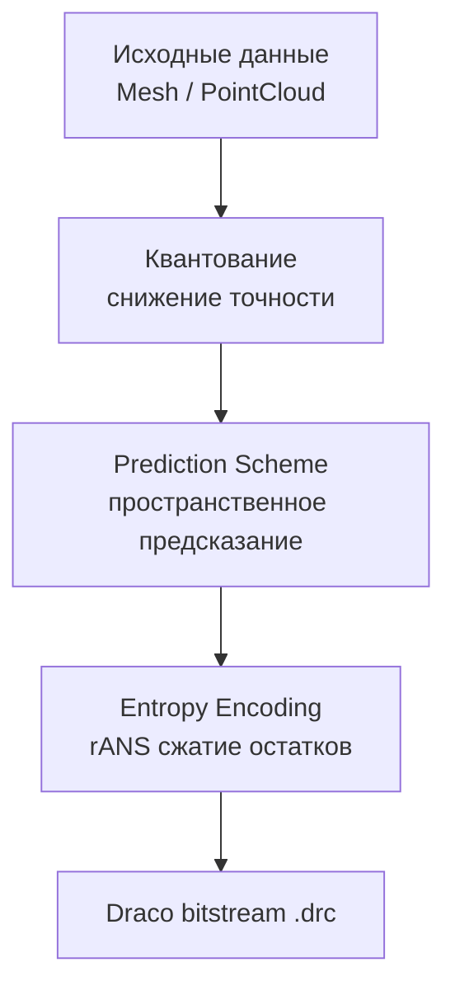

# Draco: Архитектура сжатия геометрии

**Draco** — библиотека сжатия и распаковки 3D геометрических данных (mesh и point cloud) от Google. Решает
фундаментальную проблему передачи объёмных 3D-моделей через сети с ограниченной пропускной способностью и хранения на
устройствах с ограниченной памятью.

---

## Фундаментальная проблема и решение

Трёхмерная геометрия обладает высокой избыточностью: соседние вершины коррелируют по позициям, нормалям и текстурным
координатам. Наивное хранение (массив float) игнорирует эту корреляцию, приводя к избыточному расходу памяти и трафика.

Draco применяет трёхэтапный конвейер сжатия:

1. **Квантование** — снижение точности float значений до дискретных уровней
2. **Предсказание** — использование пространственной корреляции для предсказания значений атрибутов
3. **Энтропийное кодирование** — сжатие остатков (разниц между предсказанным и реальным значением) через rANS (range
   Asymmetric Numeral Systems)

**Архитектурная метафора:** Draco — это не просто архиватор, а лингвист, изучающий язык геометрии. Он не сжимает каждое
слово отдельно, а анализирует грамматику (топологию меша) и предсказывает следующее слово на основе контекста, записывая
только отклонения от предсказания.

---

## Возможности

- **Сжатие mesh** — треугольные меши с connectivity data
- **Сжатие point cloud** — облака точек с произвольными атрибутами
- **Квантование** — контролируемая потеря точности для лучшего сжатия
- **Prediction schemes** — предсказание значений атрибутов по соседним элементам
- **glTF интеграция** — расширение `KHR_draco_mesh_compression`
- **Metadata** — пользовательские данные в сжатом файле
- **Анимации и скиннинг** — через опцию `DRACO_TRANSCODER_SUPPORTED`

## Архитектура сжатия

Конвейер сжатия Draco реализует трёхэтапную архитектуру, где каждый этап решает конкретную задачу по уменьшению
избыточности:



**Архитектурный принцип:** Draco не является простым архиватором — это специализированный процессор геометрических
данных, который анализирует пространственные корреляции, предсказывает значения атрибутов на основе топологии и кодирует
только дельты (разницы) между предсказанными и фактическими значениями. Такой подход обеспечивает сжатие до 90% от
исходного объёма.

## Compression ratio

| Тип данных            | Без сжатия | Draco (default) | Сжатие |
|-----------------------|------------|-----------------|--------|
| Mesh 100K triangles   | 12.5 MB    | 0.8 MB          | 15×    |
| Point cloud 1M points | 28 MB      | 2.1 MB          | 13×    |
| Skinned mesh          | 18 MB      | 1.4 MB          | 12×    |

> **Примечание:** Результаты зависят от настроек квантования и типа геометрии.

## Сравнение с альтернативами

| Функция                 | Draco    | Open3D  | MeshOptimizer |
|-------------------------|----------|---------|---------------|
| Mesh compression        | Да       | Да      | Да            |
| Point cloud compression | Да       | Да      | Нет           |
| Lossless                | Частично | Да      | Нет           |
| glTF extension          | Да       | Нет     | Да            |
| GPU decoding            | Нет      | Нет     | Да            |
| C++ API                 | Да       | Да      | Да            |
| Decode speed            | Средняя  | Быстрая | Быстрая       |

**Когда выбрать Draco:**

- Нужна интеграция с glTF через `KHR_draco_mesh_compression`
- Требуется сжатие point cloud
- Важен максимальный compression ratio
- Данные передаются по сети

**Когда выбрать альтернативы:**

- **MeshOptimizer** — если нужен GPU decoding или lossless
- **Open3D** — если нужен полный pipeline обработки 3D данных

## Компоненты библиотеки

| Компонент              | Назначение                              |
|------------------------|-----------------------------------------|
| `draco::Decoder`       | Декодирование .drc в Mesh/PointCloud    |
| `draco::Encoder`       | Кодирование с базовыми настройками      |
| `draco::ExpertEncoder` | Детальный контроль над каждым атрибутом |
| `draco::Mesh`          | Треугольный меш с атрибутами            |
| `draco::PointCloud`    | Облако точек с атрибутами               |
| `draco_transcoder`     | CLI инструмент для glTF                 |

## Методы кодирования

### Mesh

| Метод       | Описание           | Compression | Decode speed |
|-------------|--------------------|-------------|--------------|
| Edgebreaker | Connectivity-first | Лучший      | Средняя      |
| Sequential  | Simple traversal   | Хороший     | Быстрая      |

### Point Cloud

| Метод      | Описание             | Compression | Decode speed |
|------------|----------------------|-------------|--------------|
| KD-Tree    | Spatial partitioning | Лучший      | Медленная    |
| Sequential | Linear traversal     | Хороший     | Быстрая      |

## Prediction schemes: архитектура пространственного предсказания

Prediction schemes — это семейство алгоритмов, которые используют пространственную корреляцию геометрических данных для
предсказания значений атрибутов. Вместо кодирования абсолютных значений, Draco кодирует остатки (residuals) — разницы
между предсказанными и фактическими значениями, что существенно снижает энтропию данных.

**Архитектурный принцип:** Каждый prediction scheme анализирует локальный контекст (соседние вершины, треугольники,
топологические связи) и строит математическую модель для предсказания следующего значения. Ошибка предсказания (
residual) имеет значительно меньшую дисперсию, чем исходные данные, что делает её идеальной для последующего
энтропийного кодирования.

| Scheme              | Применение     | Математическая модель                      | Пространственный контекст          |
|---------------------|----------------|--------------------------------------------|------------------------------------|
| Parallelogram       | Mesh positions | P = B + C - A (векторная сумма)            | Смежный треугольник ABC            |
| Multi-parallelogram | Mesh positions | P = Σ wᵢ(B + Cᵢ - Aᵢ) (взвешенное среднее) | Множество смежных треугольников    |
| Geometric normal    | Normals        | N = normalize(∇S) (градиент поверхности)   | Локальная геометрия поверхности    |
| Delta               | Generic        | Pᵢ = Vᵢ₋₁ (предыдущее значение)            | Временная/пространственная ося     |
| Tex coords portable | UV             | P_uv = B_uv + C_uv - A_uv (в UV space)     | UV mapping и texture atlas границы |

**Энтропийный выигрыш:** Prediction schemes снижают энтропию данных на 60-80%, что позволяет rANS кодированию достичь
коэффициентов сжатия 3-5× для остатков по сравнению с исходными значениями.

## Квантование: архитектура потери точности

Квантование в Draco — это процесс преобразования непрерывных float значений в дискретные целочисленные уровни с
контролируемой потерей точности. Это фундаментальный этап сжатия, который позволяет существенно уменьшить размер данных
за счёт устранения избыточной точности, невидимой для человеческого восприятия.

**Математическая модель:** Для атрибута с bounding box [min, max] и quantization_bits = N, квантование преобразует float
значение f ∈ [min, max] в целое число q ∈ [0, 2ᴺ-1]:

```
q = round((f - min) / (max - min) * (2ᴺ - 1))
```

Обратное преобразование (де-квантование) восстанавливает приближённое значение:

```
f' = min + q * (max - min) / (2ᴺ - 1)
```

### Архитектура квантования позиций

```cpp
#include <draco/compression/encode.h>

draco::Encoder encoder;

// Автоматическое квантование на основе bounding box
encoder.SetAttributeQuantization(
    draco::GeometryAttribute::POSITION,
    14  // 14 бит на компонент (точность ~0.006%)
);

// Явное задание bounding box для детерминированного квантования
std::array<float, 3> origin = {0.0f, 0.0f, 0.0f};
float range = 100.0f;  // Диапазон [origin, origin + range]

encoder.SetAttributeExplicitQuantization(
    draco::GeometryAttribute::POSITION,
    14,     // quantization_bits
    3,      // num_dims
    origin.data(),
    range
);
```

### Влияние битности на точность и размер

| Бит на компонент | Точность (относительная) | Квантов на диапазон | Эффективный размер данных |
|------------------|--------------------------|---------------------|---------------------------|
| 8                | ~0.4%                    | 256                 | 3× уменьшение             |
| 11               | ~0.05%                   | 2048                | 2× уменьшение             |
| 14               | ~0.006%                  | 16384               | 1.5× уменьшение           |
| 16               | ~0.0015%                 | 65536               | Базовый размер            |

**Архитектурный компромисс:** Выбор битности представляет собой trade-off между точностью геометрии и степенью сжатия.
Для большинства визуальных применений 11-14 бит обеспечивают оптимальный баланс, сохраняя визуальное качество при
значительном уменьшении размера данных.

### Dequantization при декодировании

```cpp
#include <draco/compression/decode.h>
#include <expected>

[[nodiscard]] std::expected<std::unique_ptr<draco::Mesh>, draco::Status> decode_draco(
    std::span<const std::byte> compressed_data) noexcept
{
    draco::DecoderBuffer buffer;
    buffer.Init(reinterpret_cast<const char*>(compressed_data.data()),
                compressed_data.size());

    draco::Decoder decoder;
    // По умолчанию: автоматическая деквантование
    auto result = decoder.DecodeMeshFromBuffer(&buffer);
    if (!result.ok()) {
        return std::unexpected(result.status());
    }
    return std::move(result).value();
}
```

## Требования и архитектурные ограничения

Draco спроектирована как кроссплатформенная библиотека с минимальными зависимостями, что позволяет интегрировать её в
широкий спектр проектов — от настольных приложений до высокопроизводительных систем.

### Языковые требования

- **C++26** (рекомендуется для использования современных возможностей: `std::print`, `std::expected`, `std::span`,
  `std::mdspan`)
- **C++17** (минимальная версия для базовой функциональности)
- **C++14** (ограниченная поддержка через макросы совместимости)

**Архитектурный выбор C++26:** Draco активно использует современные возможности C++ для повышения безопасности,
производительности и выразительности кода:

- `std::expected<T, E>` заменяет исключения для обработки ошибок в performance-critical путях
- `std::span<const T>` обеспечивает безопасный доступ к непрерывным массивам данных
- `std::print` предоставляет типобезопасный форматированный вывод для отладки
- `std::mdspan` (в разработке) оптимизирует работу с многомерными геометрическими данными

### Платформенная поддержка

| Платформа | Компиляторы            | Особенности                        |
|-----------|------------------------|------------------------------------|
| Windows   | MSVC 2019+, Clang, GCC | Поддержка Win32 API, Unicode paths |
| Linux     | GCC 9+, Clang 10+      | POSIX-совместимые системы          |

### Зависимости

**Базовые зависимости:**

- Стандартная библиотека C++ (STL)
- CMake 3.15+ (для сборки)

**Опциональные зависимости:**

- `libpng`, `libjpeg` — для Draco Transcoder (конвертация текстур)
- `zlib` — для дополнительного сжатия метаданных
- `simdjson` — для ускоренного парсинга JSON в glTF интеграции

**Архитектурный принцип минимализма:** Draco сознательно минимизирует внешние зависимости, чтобы обеспечить простую
интеграцию в существующие проекты и избежать конфликтов версий.

## Основные понятия

Ключевые концепции Draco: геометрия, атрибуты, квантование.

### Геометрия

#### PointCloud

Базовый класс для хранения облака точек с атрибутами:

```cpp
#include <draco/point_cloud/point_cloud.h>

draco::PointCloud pc;

// Количество точек
pc.set_num_points(1000);

// Добавление атрибутов
draco::GeometryAttribute positionAttribute;
positionAttribute.Init(draco::GeometryAttribute::POSITION,
                       nullptr, 3, draco::DT_FLOAT32, false,
                       sizeof(float) * 3, 0);
int posAttrId = pc.AddAttribute(positionAttribute, true, 1000);

// Доступ к атрибутам
const draco::PointAttribute* attr = pc.GetNamedAttribute(
    draco::GeometryAttribute::POSITION
);
```

#### Mesh

Расширение PointCloud с connectivity data (грани):

```cpp
#include <draco/mesh/mesh.h>

draco::Mesh mesh;

// Количество граней
mesh.SetNumFaces(500);

// Установка грани
draco::Mesh::Face face;
face[0] = draco::PointIndex(0);
face[1] = draco::PointIndex(1);
face[2] = draco::PointIndex(2);
mesh.SetFace(draco::FaceIndex(0), face);

// Доступ к грани
const draco::Mesh::Face& f = mesh.face(draco::FaceIndex(0));
```

#### Отношения между классами

```
draco::PointCloud
├── num_points()
├── attributes[]
└── metadata

draco::Mesh : public PointCloud
├── num_faces()
├── faces[]
└── corner_table (топология)
```

### Атрибуты

#### GeometryAttribute

Базовое описание атрибута (тип, формат данных):

```cpp
#include <draco/attributes/geometry_attribute.h>

draco::GeometryAttribute posAttr;
posAttr.Init(
    draco::GeometryAttribute::POSITION,  // Тип
    nullptr,                              // DataBuffer (позже)
    3,                                    // num_components (x, y, z)
    draco::DT_FLOAT32,                    // data_type
    false,                                // normalized
    sizeof(float) * 3,                    // byte_stride
    0                                     // byte_offset
);
```

#### Типы атрибутов

Draco определяет следующие типы атрибутов в `GeometryAttribute::Type`:

```cpp
enum Type {
    INVALID = -1,                     // Невалидный атрибут
    POSITION = 0,                     // Позиции вершин (x, y, z)
    NORMAL,                           // Нормали (nx, ny, nz)
    COLOR,                            // Цвета (r, g, b, a)
    TEX_COORD,                        // Текстурные координаты (u, v)
    GENERIC,                          // Пользовательские данные произвольного типа
#ifdef DRACO_TRANSCODER_SUPPORTED
    TANGENT,                          // Тангенты (tx, ty, tz, tw)
    MATERIAL,                         // Индексы материалов
    JOINTS,                           // Индексы костей для скиннинга
    WEIGHTS,                          // Веса костей для скиннинга
#endif
    // Всего именованных типов атрибутов (всегда последний)
    NAMED_ATTRIBUTES_COUNT,
};
```

**Классификация атрибутов:**

- **Именованные атрибуты** (POSITION, NORMAL, COLOR, TEX_COORD) — имеют семантическое значение, Draco применяет к ним
  специализированные алгоритмы сжатия
- **GENERIC** — универсальный тип для пользовательских данных, сжимается общими методами
- **Атрибуты трансформера** (TANGENT, MATERIAL, JOINTS, WEIGHTS) — доступны только при сборке с
  `DRACO_TRANSCODER_SUPPORTED`, используются для расширенной интеграции с glTF

**Особенности именованных атрибутов:**

- `POSITION` — обязательный атрибут для mesh и point cloud, участвует в вычислении bounding box
- `NORMAL` — нормализованные векторы, для которых применяется специализированный prediction scheme
  `MESH_PREDICTION_GEOMETRIC_NORMAL`
- `COLOR` — может быть нормализованным (значения в диапазоне [0, 1]) или ненормализованным
- `TEX_COORD` — текстурные координаты, поддерживают prediction scheme `MESH_PREDICTION_TEX_COORDS_PORTABLE`

**Идентификация атрибутов:** Каждый атрибут имеет уникальный ID (`unique_id`), который используется для связи метаданных
с конкретным атрибутом, даже если в геометрии присутствует несколько атрибутов одного типа.

#### Типы данных

Draco поддерживает следующие типы данных для атрибутов, определенные в `DataType`:

```cpp
enum DataType {
    DT_INT8,      // 8-битное знаковое целое
    DT_UINT8,     // 8-битное беззнаковое целое
    DT_INT16,     // 16-битное знаковое целое
    DT_UINT16,    // 16-битное беззнаковое целое
    DT_INT32,     // 32-битное знаковое целое
    DT_UINT32,    // 32-битное беззнаковое целое
    DT_INT64,     // 64-битное знаковое целое
    DT_UINT64,    // 64-битное беззнаковое целое
    DT_FLOAT32,   // 32-битное число с плавающей точкой (IEEE 754)
    DT_FLOAT64,   // 64-битное число с плавающей точкой (IEEE 754)
    DT_BOOL       // Булево значение (true/false)
};
```

**Особенности типов данных:**

| Тип данных   | Размер (байты) | Диапазон значений             | Применение                              |
|--------------|----------------|-------------------------------|-----------------------------------------|
| `DT_INT8`    | 1              | -128..127                     | Компактное хранение целых значений      |
| `DT_UINT8`   | 1              | 0..255                        | Цвета, нормализованные значения         |
| `DT_INT16`   | 2              | -32,768..32,767               | Среднеразмерные целые значения          |
| `DT_UINT16`  | 2              | 0..65,535                     | Индексы, веса, нормализованные значения |
| `DT_INT32`   | 4              | -2³¹..2³¹-1                   | Большие целые значения                  |
| `DT_UINT32`  | 4              | 0..2³²-1                      | Большие беззнаковые значения            |
| `DT_INT64`   | 8              | -2⁶³..2⁶³-1                   | Очень большие целые значения            |
| `DT_UINT64`  | 8              | 0..2⁶⁴-1                      | Очень большие беззнаковые значения      |
| `DT_FLOAT32` | 4              | ±3.4×10³⁸ (7 значащих цифр)   | Позиции, нормали, текстурные координаты |
| `DT_FLOAT64` | 8              | ±1.8×10³⁰⁸ (15 значащих цифр) | Высокоточные вычисления                 |
| `DT_BOOL`    | 1              | true/false                    | Флаги, бинарные атрибуты                |

**Архитектурный выбор типов данных:**

- **Для позиций**: `DT_FLOAT32` (баланс точности и размера) или `DT_FLOAT64` (высокая точность)
- **Для цветов**: `DT_UINT8` (нормализованный) или `DT_FLOAT32` (прямые значения)
- **Для нормалей**: `DT_FLOAT32` (точность направления) или `DT_INT16` (квантованные)
- **Для текстурных координат**: `DT_FLOAT32` (стандарт) или `DT_UINT16` (квантованные)
- **Для индексов**: `DT_UINT16` (до 65K вершин) или `DT_UINT32` (большие меши)

### Prediction Schemes

Draco использует различные prediction schemes для предсказания значений атрибутов на основе пространственных корреляций.
Все схемы определены в `PredictionSchemeMethod`:

```cpp
enum PredictionSchemeMethod {
    // Специальные значения
    PREDICTION_NONE = -2,                     // Схема предсказания не используется
    PREDICTION_UNDEFINED = -1,                // Схема не определена

    // Базовые схемы
    PREDICTION_DIFFERENCE = 0,                // Разностное предсказание

    // Схемы для mesh
    MESH_PREDICTION_PARALLELOGRAM = 1,        // Параллелограммное предсказание
    MESH_PREDICTION_MULTI_PARALLELOGRAM = 2,  // Многопараллелограммное предсказание
    MESH_PREDICTION_TEX_COORDS_DEPRECATED = 3,// Устаревшее предсказание текстурных координат
    MESH_PREDICTION_CONSTRAINED_MULTI_PARALLELOGRAM = 4, // Ограниченное многопараллелограммное
    MESH_PREDICTION_TEX_COORDS_PORTABLE = 5,  // Портативное предсказание текстурных координат
    MESH_PREDICTION_GEOMETRIC_NORMAL = 6,     // Геометрическое предсказание нормалей

    // Количество схем предсказания
    NUM_PREDICTION_SCHEMES
};
```

**Применение prediction schemes:**

| Схема                                 | Тип геометрии | Атрибуты  | Описание                                                                     |
|---------------------------------------|---------------|-----------|------------------------------------------------------------------------------|
| `PREDICTION_DIFFERENCE`               | Любой         | Любые     | Простое разностное предсказание (предыдущее значение)                        |
| `MESH_PREDICTION_PARALLELOGRAM`       | Mesh          | POSITION  | Использует параллелограммное правило для предсказания позиций вершин         |
| `MESH_PREDICTION_MULTI_PARALLELOGRAM` | Mesh          | POSITION  | Улучшенная версия с использованием нескольких соседних треугольников         |
| `MESH_PREDICTION_TEX_COORDS_PORTABLE` | Mesh          | TEX_COORD | Портативное предсказание текстурных координат, независимое от параметризации |
| `MESH_PREDICTION_GEOMETRIC_NORMAL`    | Mesh          | NORMAL    | Использует геометрию поверхности для предсказания нормалей                   |

### Методы кодирования

Draco предоставляет различные методы кодирования для mesh и point cloud:

```cpp
// Методы кодирования для point cloud
enum PointCloudEncodingMethod {
    POINT_CLOUD_SEQUENTIAL_ENCODING = 0,  // Последовательное кодирование
    POINT_CLOUD_KD_TREE_ENCODING          // KD-дерево кодирование
};

// Методы кодирования для mesh
enum MeshEncoderMethod {
    MESH_SEQUENTIAL_ENCODING = 0,      // Последовательное кодирование
    MESH_EDGEBREAKER_ENCODING          // Edgebreaker кодирование
};

// Подметоды Edgebreaker
enum MeshEdgebreakerConnectivityEncodingMethod {
    MESH_EDGEBREAKER_STANDARD_ENCODING = 0,  // Стандартное кодирование
    MESH_EDGEBREAKER_VALENCE_ENCODING = 2    // Кодирование на основе валентности
};
```

### Версии битстрима

Draco использует версионирование битстрима для обеспечения обратной совместимости:

```cpp
// Версии битстрима для mesh
static constexpr uint8_t kDracoMeshBitstreamVersionMajor = 2;
static constexpr uint8_t kDracoMeshBitstreamVersionMinor = 2;
static constexpr uint16_t kDracoMeshBitstreamVersion = DRACO_BITSTREAM_VERSION(
    kDracoMeshBitstreamVersionMajor, kDracoMeshBitstreamVersionMinor);

// Версии битстрима для point cloud
static constexpr uint8_t kDracoPointCloudBitstreamVersionMajor = 2;
static constexpr uint8_t kDracoPointCloudBitstreamVersionMinor = 3;
static constexpr uint16_t kDracoPointCloudBitstreamVersion =
    DRACO_BITSTREAM_VERSION(kDracoPointCloudBitstreamVersionMajor,
                            kDracoPointCloudBitstreamVersionMinor);
```

### Поддержка трансформера (DRACO_TRANSCODER_SUPPORTED)

При сборке с опцией `DRACO_TRANSCODER_SUPPORTED` Draco предоставляет дополнительные возможности для интеграции с glTF и
другими форматами:

```cpp
#ifdef DRACO_TRANSCODER_SUPPORTED
// Дополнительные типы атрибутов
TANGENT,    // Тангенты (tx, ty, tz, tw)
MATERIAL,   // Индексы материалов
JOINTS,     // Индексы костей для скиннинга
WEIGHTS,    // Веса костей для скиннинга

// Grid quantization для point cloud
expert_encoder.SetAttributeGridQuantization(pc, pos_attr_id, 0.01f);
#endif
```

### Нормализация

Флаг `normalized` в `GeometryAttribute` указывает, нужно ли преобразовывать целочисленные значения в нормализованный
диапазон:

```cpp
// Нормализованный атрибут цвета (uint8 → [0, 1])
draco::GeometryAttribute colorAttr;
colorAttr.Init(draco::GeometryAttribute::COLOR,
               nullptr, 3, draco::DT_UINT8, true,  // normalized = true
               sizeof(uint8_t) * 3, 0);

// Ненормализованный атрибут позиций (float как есть)
draco::GeometryAttribute posAttr;
posAttr.Init(draco::GeometryAttribute::POSITION,
             nullptr, 3, draco::DT_FLOAT32, false,  // normalized = false
             sizeof(float) * 3, 0);
```

**Преобразование при нормализации:**

- `uint8` → `[0, 1]`: `value / 255.0`
- `int8` → `[-1, 1]`: `max(value / 127.0, -1.0)`
- `uint16` → `[0, 1]`: `value / 65535.0`
- `int16` → `[-1, 1]`: `max(value / 32767.0, -1.0)`

## Расширенные возможности

### ExpertEncoder: детальный контроль над атрибутами

`draco::ExpertEncoder` предоставляет точный контроль над параметрами сжатия для каждого атрибута индивидуально, в
отличие от базового `Encoder`, который применяет настройки ко всем атрибутам одного типа.

```cpp
#include <draco/compression/expert_encode.h>

draco::Mesh mesh;
// ... инициализация mesh

draco::ExpertEncoder expert_encoder(mesh);

// Установка скорости кодирования/декодирования (0-10)
expert_encoder.SetSpeedOptions(5, 7);

// Квантование конкретного атрибута по его ID
int pos_attr_id = mesh.GetNamedAttributeId(draco::GeometryAttribute::POSITION);
expert_encoder.SetAttributeQuantization(pos_attr_id, 12);

// Явное квантование с заданным bounding box
float origin[3] = {0.0f, 0.0f, 0.0f};
float range = 100.0f;
expert_encoder.SetAttributeExplicitQuantization(pos_attr_id, 12, 3, origin, range);

// Выбор prediction scheme для атрибута
expert_encoder.SetAttributePredictionScheme(
    pos_attr_id,
    draco::MESH_PREDICTION_PARALLELOGRAM
);

// Включение/выключение встроенного сжатия атрибутов
expert_encoder.SetUseBuiltInAttributeCompression(true);

// Выбор метода кодирования
expert_encoder.SetEncodingMethod(draco::MESH_EDGEBREAKER_ENCODING);

// Выбор подметода Edgebreaker (стандартный или валентный)
expert_encoder.SetEncodingSubmethod(draco::MESH_EDGEBREAKER_VALENCE_ENCODING);

// Кодирование
draco::EncoderBuffer buffer;
auto status = expert_encoder.EncodeToBuffer(&buffer);
```

### Подметоды Edgebreaker

Edgebreaker encoding имеет два подметода, влияющих на сжатие connectivity data:

| Подметод                             | Сжатие        | Скорость декодирования | Описание                                         |
|--------------------------------------|---------------|------------------------|--------------------------------------------------|
| `MESH_EDGEBREAKER_STANDARD_ENCODING` | Высокое       | Средняя                | Стандартный алгоритм Edgebreaker                 |
| `MESH_EDGEBREAKER_VALENCE_ENCODING`  | Очень высокое | Медленная              | Использует валентность вершин для лучшего сжатия |

### Пропуск трансформаций атрибутов

При декодировании можно пропустить де-квантование и другие трансформации, получив сырые квантованные значения:

```cpp
draco::Decoder decoder;
decoder.SetSkipAttributeTransform(draco::GeometryAttribute::POSITION);

// После декодирования атрибут будет содержать квантованные значения
// и объект AttributeTransform для ручного применения трансформаций
```

### Метаданные и пользовательские данные

Draco поддерживает иерархические метаданные для геометрии и отдельных атрибутов:

```cpp
#include <draco/metadata/geometry_metadata.h>

draco::PointCloud pc;
auto metadata = std::make_unique<draco::GeometryMetadata>();
metadata->AddEntryString("author", "Artist Name");
metadata->AddEntryInt("version", 2);
pc.AddMetadata(std::move(metadata));

// Метаданные для атрибутов
int attr_id = ...;
auto attr_metadata = std::make_unique<draco::AttributeMetadata>(attr_id);
attr_metadata->AddEntryString("name", "vertex_position");
pc.AddAttributeMetadata(attr_id, std::move(attr_metadata));
```

### Поддержка трансформера (DRACO_TRANSCODER_SUPPORTED)

При сборке с опцией `DRACO_TRANSCODER_SUPPORTED` Draco предоставляет дополнительные возможности:

- **Grid quantization** — равномерное квантование по сетке для позиций
- **Расширенные типы атрибутов** — tangent, material, joints, weights
- **Интеграция с glTF** — полная поддержка расширений `EXT_mesh_features` и `EXT_structural_metadata`
- **Материалы и текстуры** — библиотеки материалов и текстур

```cpp
#ifdef DRACO_TRANSCODER_SUPPORTED
// Grid quantization для point cloud
expert_encoder.SetAttributeGridQuantization(pc, pos_attr_id, 0.01f);
#endif
```

### Анимация и скиннинг

Для скинированных мешей Draco поддерживает атрибуты joints и weights:

```cpp
#ifdef DRACO_TRANSCODER_SUPPORTED
// Добавление атрибутов скиннинга
draco::GeometryAttribute joints_attr;
joints_attr.Init(draco::GeometryAttribute::JOINTS, nullptr, 4,
                 draco::DT_UINT16, false, sizeof(uint16_t) * 4, 0);
int joints_id = mesh.AddAttribute(joints_attr, true, num_vertices);

draco::GeometryAttribute weights_attr;
weights_attr.Init(draco::GeometryAttribute::WEIGHTS, nullptr, 4,
                  draco::DT_FLOAT32, false, sizeof(float) * 4, 0);
int weights_id = mesh.AddAttribute(weights_attr, true, num_vertices);
#endif
```

### Дедупликация вершин и атрибутов

Draco автоматически удаляет дубликаты вершин и значений атрибутов для улучшения сжатия:

```cpp
// Включение дедупликации (включено по умолчанию)
#ifdef DRACO_ATTRIBUTE_VALUES_DEDUPLICATION_SUPPORTED
pc.DeduplicateAttributeValues();
#endif

#ifdef DRACO_ATTRIBUTE_INDICES_DEDUPLICATION_SUPPORTED
pc.DeduplicatePointIds();
#endif
```

## Архитектурное заключение

Draco представляет собой специализированную библиотеку сжатия геометрических данных, построенную на трёх фундаментальных
принципах:

### 1. **Архитектура трёхэтапного конвейера**

- **Квантование**: Контролируемое снижение точности для уменьшения энтропии
- **Предсказание**: Использование пространственных корреляций для предсказания значений
- **Энтропийное кодирование**: Сжатие остатков через rANS алгоритм

### 2. **Архитектурные паттерны**

- **Strategy Pattern**: Различные prediction schemes для разных типов данных
- **Factory Pattern**: Создание атрибутов и геометрии через унифицированные интерфейсы
- **Builder Pattern**: Постепенное построение mesh и point cloud

### 3. **Архитектурные компромиссы**

- **Точность vs Сжатие**: Квантование позволяет контролировать этот баланс
- **Скорость кодирования vs декодирования**: Раздельные настройки speed options
- **Connectivity vs Sequential**: Edgebreaker для лучшего сжатия, Sequential для скорости

### 4. **Интеграционные возможности**

- **glTF 2.0**: Полная поддержка через KHR_draco_mesh_compression
- **C++26**: Современный API с `std::expected`, `std::span`, `std::print`
- **Кроссплатформенность**: Поддержка Windows, Linux

### Ключевые архитектурные решения

1. **Использование rANS вместо Huffman**: rANS обеспечивает лучшее сжатие для геометрических данных с низкой энтропией
2. **Пространственные prediction schemes**: Учёт топологии меша для предсказания значений атрибутов
3. **Адаптивное квантование**: Автоматический выбор битности на основе bounding box
4. **Разделение mesh и point cloud**: Специализированные алгоритмы для разных типов геометрии

### Рекомендации по архитектурному использованию

1. **Для real-time приложений**: Используйте Sequential encoding с высокими speed options
2. **Для оффлайн обработки**: Edgebreaker encoding с максимальным сжатием
3. **Для сетевой передачи**: Адаптивное квантование с балансом качества и размера
4. **Для долгосрочного хранения**: Используйте lossless режим с минимальным квантованием

Draco демонстрирует, как специализированные алгоритмы сжатия, построенные на глубоком понимании предметной области (3D
геометрия), могут превзойти универсальные архиваторы в 10-20 раз по эффективности сжатия, сохраняя при этом гибкость и
простоту интеграции в современные C++ проекты.
