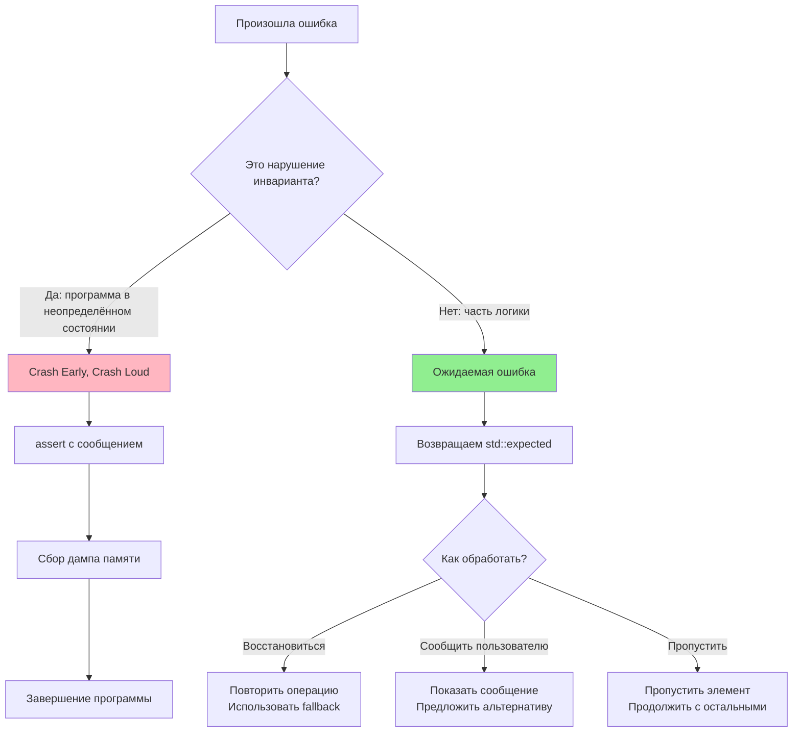

# Философия обработки ошибок (Crash Culture)

Мы сказали "не используй exceptions" в анти-паттернах. Но студент спросит: *"А что делать, если файл не найден? А если
GPU не смог выделить буфер?"*. Если не дать им инструмент, они начнут возвращать `bool`, `nullptr` или писать спагетти
из `if (err != 0)`.

В нашем движке ошибки делятся на два типа: **инварианты движка** (которые никогда не должны нарушаться) и **ожидаемые
ошибки** (часть логики приложения). Для каждого типа — свой подход.

---

## Crash Early, Crash Loud (Умри быстро и громко)

Если нарушен инвариант движка — мы не пытаемся "аккуратно обработать" это. Мы вызываем `assert` и роняем программу с
коркой памяти.

**Что такое инвариант движка?**

- Передали `nullptr` туда, где ожидался валидный указатель
- Индекс массива вышел за границы
- Состояние GPU стало невалидным (после `vkCreateDevice` получили `VK_NULL_HANDLE`)
- Время кадра отрицательное или нулевое

```cpp
void render_mesh(const Mesh* mesh) {
    CORE_ASSERT(mesh != nullptr); // Если nullptr — падаем сразу
    CORE_ASSERT(mesh->vertex_count > 0);

    // ... рендеринг ...
}

// Макрос CORE_ASSERT в Debug собирается в assert, в Release — в nothing
#ifdef DEBUG
    #define CORE_ASSERT(cond) assert(cond)
#else
    #define CORE_ASSERT(cond) ((void)0)
#endif
```

**Почему не обрабатывать?**
Потому что инвариант — это гарантия корректности программы. Если он нарушен, программа уже в неопределённом состоянии.
Попытка "продолжить работу" приведёт к:

- Повреждению данных (corruption)
- Непредсказуемому поведению (undefined behavior)
- Сложным для отладки багам (симптом далеко от причины)

> **Метафора:** Если на заводе станок начал плеваться огнём — не нужно писать код "если огонь, то работай медленнее".
> Нужно бить по красной кнопке и эвакуировать цех. Потому что огонь — это инвариант: станок не должен гореть. Если он
> горит — что-то сломалось фундаментально. Продолжать производство на горящем станке — это гарантированная катастрофа.

---

## Ожидаемые ошибки (`std::expected<T, E>`)

Если ошибка — это часть логики (не нарушение инварианта), мы возвращаем `std::expected<Data, Error>`.

**Что такое ожидаемая ошибка?**

- Игрок пытается загрузить битый сейв
- По сети пришёл невалидный пакет
- Файл не найден (но путь был введён пользователем)
- GPU не смог выделить буфер (out of memory)

```cpp
enum class LoadError {
    FileNotFound,
    CorruptedData,
    VersionMismatch,
    OutOfMemory
};

std::expected<LevelData, LoadError> load_level(std::string_view path) {
    auto file = open_file(path);
    if (!file) {
        return std::unexpected(LoadError::FileNotFound);
    }

    auto data = parse_level(file);
    if (!data) {
        return std::unexpected(LoadError::CorruptedData);
    }

    return data;
}

// Использование
auto level = load_level("level01.pv");
if (!level) {
    switch (level.error()) {
        case LoadError::FileNotFound:
            show_message("Уровень не найден");
            break;
        case LoadError::CorruptedData:
            show_message("Файл повреждён");
            break;
        // ...
    }
    return;
}

// Если успешно — работаем с данными
render_level(*level);
```

**Преимущества `std::expected`:**

- Типобезопасность (нельзя забыть проверить ошибку)
- Явное указание, какие ошибки возможны
- Композиция через `.and_then()`, `.transform()`
- Не требует исключений (zero-cost)

> **Метафора:** Если на заводе кончился картон для коробок — это проблема отдела поставок, но не инвариант. Конвейер
> просто останавливается и ждёт (`std::expected`). Менеджер звонит поставщику, заказывает новый картон. Это часть
> бизнес-логики, а не авария.

---

## Mermaid диаграмма: Дерево решений для ошибок



---

## Уровни критичности ошибок

Не все ошибки одинаковы. Мы разделяем их по уровням:

### Уровень 1: Fatal (Инвариант движка)

- **Действие:** `assert` + crash
- **Пример:** `nullptr` в рендерере, деление на ноль, double-free
- **Логирование:** `CORE_LOG_FATAL` + stack trace

### Уровень 2: Error (Ожидаемая, но критичная)

- **Действие:** Возврат `std::expected` с ошибкой
- **Пример:** Не удалось загрузить шейдер, GPU out of memory
- **Логирование:** `CORE_LOG_ERROR`

### Уровень 3: Warning (Не критично, но важно)

- **Действие:** Продолжить работу, записать в лог
- **Пример:** Медленная загрузка ассета, deprecated API
- **Логирование:** `CORE_LOG_WARNING`

### Уровень 4: Info (Информация)

- **Действие:** Только логирование
- **Пример:** Уровень загружен, соединение установлено
- **Логирование:** `CORE_LOG_INFO`

---

## Паттерны обработки ожидаемых ошибок

### 1. `Result<T>` alias для читаемости

```cpp
template<typename T>
using Result = std::expected<T, ErrorCode>;

Result<Texture> load_texture(std::string_view path);
```

### 2. Композиция через `.and_then()`

```cpp
auto result = load_config("config.json")
    .and_then(validate_config)
    .and_then(apply_config);

if (!result) {
    handle_error(result.error());
}
```

### 3. Преобразование через `.transform()`

```cpp
auto user_id = parse_request(request)
    .transform([](Request& req) { return req.user_id; });
```

### 4. Fallback через `.or_else()`

```cpp
auto texture = load_texture("high_res.png")
    .or_else([](Error) { return load_texture("low_res.png"); });
```

---

## Исключения из правил

### Системные библиотеки (STL, Vulkan)

Некоторые библиотеки бросают исключения (`std::filesystem`) или возвращают коды ошибок (Vulkan). Оборачиваем их:

```cpp
Result<std::string> read_file(std::string_view path) {
    try {
        return std::filesystem::read_file(path);
    } catch (const std::exception& e) {
        return std::unexpected(Error::FileSystemError);
    }
}

Result<VkBuffer> create_buffer(VkDevice device, const VkBufferCreateInfo& info) {
    VkBuffer buffer;
    VkResult result = vkCreateBuffer(device, &info, nullptr, &buffer);
    if (result != VK_SUCCESS) {
        return std::unexpected(convert_vk_error(result));
    }
    return buffer;
}
```

### Граница с C кодом

При работе с C библиотеками (SDL, zstd) используем коды ошибок, но сразу конвертируем в `std::expected`.

---

## Золотые правила

1. **Инвариант нарушен?** → `assert` и crash. Не пытайся "восстановиться".
2. **Ожидаемая ошибка?** → `std::expected<T, E>`. Явно обрабатывай.
3. **Знай уровень критичности:** Fatal, Error, Warning, Info.
4. **Логируй всё:** Даже если крашишься, оставь stack trace.
5. **Не скрывай ошибки:** `[[nodiscard]]` на функциях, возвращающих `Result`.

> **Метафора итоговая:** Представь самолёт. Если отвалилось крыло (инвариант) — пилот не пытается "аккуратно посадить".
> Он катапультируется (crash). Если закончилось топливо (ожидаемая ошибка) — пилот включает запасной бак (fallback) или
> ищет аэродром для посадки (обработка). В первом случае продолжать полёт невозможно. Во втором — это часть работы
> пилота.

---

*"Хорошая программа не та, в которой нет ошибок. Таких не бывает. Хорошая программа — та, в которой ошибки не скрываются
и не игнорируются."*
