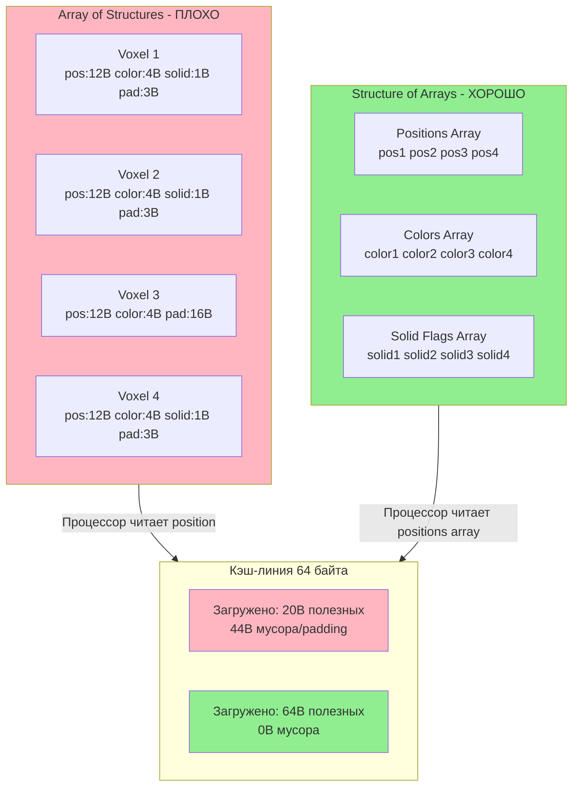

# Data‑Oriented Design: SoA vs AoS, Hot/Cold splitting, пакетная обработка

Data‑Oriented Design (DOD) — это не паттерн, это **мировоззрение**. В отличие от ООП, где мы думаем объектами (
`VoxelChunk`, `Entity`), в DOD мы думаем **данными и их трансформациями**.

Это фундаментальный сдвиг в том, как мы строим код для высокопроизводительных систем.

---

## Смена парадигмы: от объектов к данным

### Традиционный подход (ООП)

«У меня есть `VoxelChunk`. У него есть метод `update()`. Внутри есть `voxels`, `mesh`, `collision`. Я вызываю
`chunk→update()`.»

**Проблема:** Инкапсуляция скрывает данные. Процессор вынужден прыгать по памяти (Pointer Chasing), загружая кэш‑линии с
ненужной информацией.

**Результат:** Cache Misses убивают производительность.

> **Метафора:** Представь, что ты работаешь в огромной библиотеке. В подходе ООП каждый объект — это отдельная комната.
> Чтобы прочитать книгу, ты идёшь в комнату A, берёшь книгу, идёшь в комнату B за закладкой, идёшь в комнату C за
> очками.
> Каждая комната — это отдельный объект в памяти. Пока ты бегаешь между комнатами — ты не читаешь. Это и есть **Pointer
Chasing**: ты тратишь время на дорогу, а не на работу.
>
> Теперь представь, что все нужные книги лежат стопкой на одном столе. Ты берёшь первую, вторую, третью — не вставая.
> Это DOD. Данные лежат рядом, процессор читает их подряд, без «беготни» по памяти.

### Наш подход (DOD)

«У меня есть массив позиций `std::vector<vec3>`, массив цветов `std::vector<uint32_t>`. Система `RenderingSystem` берёт
эти массивы и рисует их.»

**Решение:** Данные открыты и лежат плотно. Процессор читает их линейно (Stream Processing).

**Результат:** Кэш (L1/L2) работает эффективно.

**DOD — это организация данных для процессора, а не для удобства программиста.**

> **Подробнее о том, как укладывать структуры данных в кэш-линии, читай
в [Паддинг и Выравнивание](../01_foundation/09_data-layout-philosophy.md).**

---

## Почему данные важнее кода?

Физические ограничения железа диктуют архитектуру:

1. **Память медленная (Memory Wall):** Обращение к RAM в ~100 раз медленнее, чем к L1 кэшу.
2. **Процессор быстрый:** Он простаивает (Stall), ожидая данные из памяти.
3. **Кэш конечен:** L1 кэш (32–64 KB) — самый ценный ресурс. Храним там только полезные данные.
4. **Предсказание ветвлений:** Линейный код без `if` выполняется быстрее благодаря конвейеру.

Любой алгоритм, игнорирующий эти ограничения, обречён быть медленным.

> **Для понимания:** В университете тебя учили, что процессор — это «мозг», который выполняет инструкции. Но в
> реальности процессор — это гоночный болид, который 90% времени стоит в пробке (ждёт данные из памяти). Проблема не в
> том, насколько быстры инструкции, а в том, насколько быстро данные до них доедут. DOD — это проектирование «дорог» для
> данных, чтобы болид не стоял в пробках.

---

## SoA vs AoS: книжная полка

### AoS (Array of Structures) — детектив с примотанной поваренной книгой

```cpp
struct Voxel {
    vec3 position;  // 12 байт
    uint32_t color; // 4 байта
    bool is_solid;  // 1 байт + 3 байта padding
};
std::vector<Voxel> voxels;
```

**Проблема:** При рендеринге мы читаем `position` и `color`, но загружаем и `is_solid` (зря!). Кэш‑линия (64 байта)
забита лишними данными.

> **Метафора:** Книги стоят вперемешку — детектив, потом кулинарная книга, потом учебник по квантовой физике, потом
> снова детектив. Тебе нужны только детективы. Но кэш‑линия (64 байта) — это «захват рукой». Ты хватаешь книгу — но
> вместе
> с ней в руку попадает кулинарная книга и учебник. Мусор! Ты читаешь только детектив, остальное — зря.

### SoA (Structure of Arrays) — берёшь с полки только нужные книги

```cpp
struct VoxelChunkData {
    std::vector<vec3>     positions;   // Массив позиций
    std::vector<uint32_t> colors;      // Массив цветов
    std::vector<bool>     solid_flags; // Массив флагов
};
```

**Преимущество:** При рендеринге система читает **ТОЛЬКО** `positions` и `colors`. Кэш заполнен полезными данными на
100%.

> **Метафора:** Детективы на одной полке, кулинария на другой, физика на третьей. Хватаешь детективы — в руке только
> детективы. 100% полезных данных. Процессор счастлив.

---

## Hot/Cold Splitting

Данные, которые используются часто (Hot), должны лежать отдельно от данных, которые используются редко (Cold).

```cpp
// Плохо: всё в одной структуре
struct Entity {
    vec3 position;       // Hot: нужна каждый кадр
    vec3 velocity;       // Hot: нужна каждый кадр
    std::string name;    // Cold: нужна редко
    Inventory inventory; // Cold: нужна редко
};

// Хорошо: разделяем по частоте доступа
struct HotData  { vec3 position; vec3 velocity; };
struct ColdData { std::string name; Inventory inventory; };
```

Когда физическая система проходит по всем сущностям, она загружает только `HotData` — и кэш не засоряется `ColdData`.

> **Метафора:** Представь рабочий стол клерка. Hot‑данные — это документы, которые нужны каждый час: они лежат прямо
> перед ним на столе. Cold‑данные — архивы, которые нужны раз в месяц: они в шкафу в другом помещении. Если свалить всё
> на
> стол — клерк не сможет работать, ему придётся перерывать кучу бумаг, чтобы найти нужное. А если оставить на столе
> только
> то, что нужно сейчас — работа летит.
>
> Кэш‑линия — это «захват рукой» (64 байта). Когда процессор читает одно поле структуры, он «захватывает» всё, что лежит
> рядом. Если рядом лежит мусор (Cold‑данные) — процессор зря тратит драгоценное место в кэше.

---

## Пакетная обработка (Batch Processing)

Обрабатываем массивы, а не одиночные объекты.

- Циклы `for (size_t i = 0; i < count; ++i)` — идеальны для процессора.
- Компилятор может векторизовать (SIMD/AVX) такой код.
- Предсказатель переходов (Branch Predictor) работает эффективно.

**Пример:** Вместо вызова `voxel→update()` для каждого вокселя, мы делаем:

```cpp
void update_positions(std::vector<vec3>& positions, std::vector<vec3>& velocities, float dt) {
    for (size_t i = 0; i < positions.size(); ++i) {
        positions[i] += velocities[i] * dt;
    }
}
```

Один цикл, линейный доступ, векторизация, счастье.

---

## Принципы DOD в нашем движке

### 1. Данные прежде кода

Сначала проектируем структуры данных (`struct`), потом пишем функции (`system`).

- **Memory Layout:** Как данные лежат в памяти? (SoA vs AoS)
- **Data Cohesion:** Какие данные используются вместе?
- **Access Patterns:** Как часто мы читаем/пишем эти данные?

### 2. Трансформации, а не состояния

Системы — это функции: `Input Data → Output Data`.

- Нет скрытого состояния внутри объектов.
- Легко тестировать: подал данные → проверил результат.
- Легко параллелить: данные независимы, нет гонок (Data Races).

### 3. Локальность — это всё

Данные, которые обрабатываются вместе, должны лежать рядом.

- **SoA (Structure of Arrays):** Массивы компонентов вместо массивов объектов.
- **Hot/Cold Splitting:** Часто используемые данные (Hot) отдельно от редких (Cold).

### 4. Пакетная обработка (Batch Processing)

Обрабатываем массивы, а не одиночные объекты.

---

## Как думать данными: практика

Это самое сложное: переучить интуицию с «объектного» мышления на «потоковое».

### Задай себе правильные вопросы

Вместо: *«Какой объект мне нужен?»*
Спроси: *«Какие данные мне нужны, и как они меняются?»*

Вместо: *«Какой метод вызвать?»*
Спроси: *«Какая трансформация происходит с этим массивом?»*

### Паттерн мышления

1. **Начни со `struct`** — что именно будет обрабатываться?
2. **Думай трансформациями** — `Input Array → [System] → Output Array`
3. **Разделяй по частоте** — Hot vs Cold, читаемое vs записываемое
4. **Измеряй** — где Tracy показывает Cache Misses?

---

## Мифы о DOD

- **«DOD — это сложно»**: Нет. Простые массивы и функции вместо сложной иерархии классов и фабрик.
- **«DOD убивает инкапсуляцию»**: Мы инкапсулируем данные на уровне модулей/систем, а не внутри каждого объекта.
- **«DOD только для C++»**: Принципы работают везде, но C++ даёт необходимый контроль над памятью.

> **Для понимания:** DOD не отменяет ООП полностью. Для UI, для конфигурации, для высокоуровневой логики — ООП прекрасно
> работает. Проблемы начинаются там, где нужно обработать миллионы элементов за миллисекунды. Там любая лишняя
> косвенность, любой лишний байт в структуре, каждый cache miss — это падение FPS. DOD — это инструмент для hot path, не
> религия.

---

## Mermaid диаграмма: SoA vs AoS в кэш-линии



**Объяснение диаграммы:**

- **AoS (слева):** Когда процессор читает `position` первого вокселя, он загружает всю структуру (20 байт) в кэш-линию.
  Но полезны только 12 байт позиции, остальное — мусор.
- **SoA (справа):** Когда процессор читает позиции, он загружает массив `positions` — все 64 байта кэш-линии заполнены
  полезными данными.
- **Результат:** SoA даёт 3-5x ускорение за счёт эффективного использования кэша.

---

*«Данные — это король. Код — всего лишь придворный.»*
