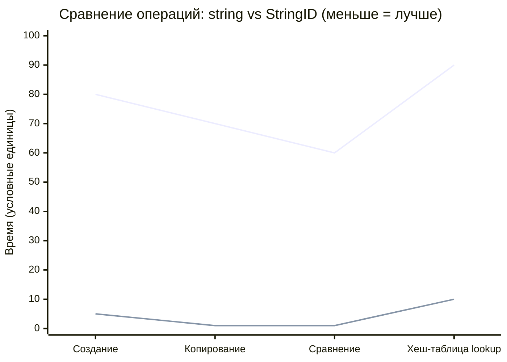

# Философия строк: Строки — враг производительности

В универе учат использовать `std::string` везде. Имена игроков, названия текстур, ID сущностей. Но `std::string` — это
почти всегда динамическая аллокация (heap allocation), медленное копирование и сравнение за O(N). В движке строки нужны
только для UI. Для внутренней логики (поиск текстуры, ID объекта) должны использоваться **StringID** (хеши).

---

## Почему `std::string` убивает производительность?

### 1. Динамическая аллокация

```cpp
std::string name = "player_warrior"; // Аллокация в куче (malloc)
```

Каждый `std::string` (кроме коротких строк в SSO) выделяет память в куче. Это:

- **Медленно:** Системный вызов `malloc` (тысячи тактов)
- **Фрагментация:** Каждая строка — отдельный блок памяти
- **Cache miss:** Данные строки лежат далеко от других данных объекта

### 2. Копирование за O(N)

```cpp
std::string a = "hello";
std::string b = a; // Копирование всех символов!
```

Даже с move semantics, если строка не временная — копирование неизбежно.

### 3. Сравнение за O(N)

```cpp
if (texture_name == "diffuse_albedo") { // Сравнение всех символов!
    // ...
}
```

Для 1000 текстур × 60 FPS = 60,000 сравнений строк в секунду. Каждое сравнение — цикл по символам.

### 4. Неопределённый размер

```cpp
struct Resource {
    std::string name; // Сколько памяти? Неизвестно!
    Texture* texture;
};
```

Невозможно предсказать размер структуры. Невозможно выровнять по кэш-линии.

> **Метафора:** `std::string` — это паспортный контроль старого образца. Пограничник сверяет каждую букву твоего ФИО,
> места рождения, цвета глаз с базой данных. На одного человека — 5 минут. На самолёт с 300 пассажирами — 25 часов.
> Современный аэропорт использует биометрию (face ID) — сканирование лица за 2 секунды. Строки — это старый паспортный
> контроль. Хеши — это face ID.

---

## Решение: StringID (хеширование строк)

Мы парсим строку один раз при компиляции (`constexpr string_hash("player")`) или при загрузке. Дальше движок гоняет
только 64-битные числа (`uint64_t`). Сравнение чисел — 1 такт CPU.

### 1. Compile-time хеширование

```cpp
constexpr uint64_t hash_string(const char* str) {
    // FNV-1a hash
    uint64_t hash = 14695981039346656037ULL;
    while (*str) {
        hash ^= static_cast<uint64_t>(*str);
        hash *= 1099511628211ULL;
        ++str;
    }
    return hash;
}

// Вычисляется на этапе компиляции!
constexpr uint64_t PLAYER_ID = hash_string("player");
constexpr uint64_t TEXTURE_DIFFUSE = hash_string("texture_diffuse");
```

**Zero-cost:** В бинарнике только числа `0x8B29C35F9B13B4C7`.

### 2. Runtime хеширование (при загрузке)

```cpp
class StringTable {
    std::unordered_map<uint64_t, std::string> table;

public:
    uint64_t add(const std::string& str) {
        uint64_t hash = hash_string(str.c_str());
        table[hash] = str; // Сохраняем для дебага
        return hash;
    }

    const std::string& resolve(uint64_t hash) const {
        return table.at(hash); // Только для дебага/UI
    }
};

// При загрузке ресурсов
StringTable g_strings;
uint64_t texture_id = g_strings.add("rock_diffuse.png");
// Дальше используем только texture_id
```

### 3. Типобезопасный StringID

```cpp
struct StringID {
    uint64_t value = 0;

    constexpr StringID() = default;
    constexpr explicit StringID(uint64_t v) : value(v) {}

    // Компиляторное создание
    template <size_t N>
    constexpr StringID(const char (&str)[N])
        : value(hash_string(str)) {}

    bool operator==(StringID other) const { return value == other.value; }
    bool operator!=(StringID other) const { return value != other.value; }

    // Для unordered_map
    struct Hash {
        size_t operator()(StringID id) const { return id.value; }
    };
};

// Использование
constexpr StringID PLAYER = "player";
constexpr StringID ENEMY = "enemy";
constexpr StringID TEXTURE = "texture_diffuse";

if (entity_type == PLAYER) { // Сравнение uint64_t
    // ...
}
```

---

## Mermaid диаграмма: Сравнение производительности



**Объяснение диаграммы:**

- **Синяя линия (std::string):** Медленные операции из-за аллокаций и O(N) алгоритмов
- **Оранжевая линия (StringID):** Быстрые операции (константное время)
- **Создание:** `std::string` = аллокация, `StringID` = вычисление хеша
- **Копирование:** `std::string` = копирование символов, `StringID` = копирование uint64_t
- **Сравнение:** `std::string` = сравнение символов, `StringID` = сравнение чисел
- **Lookup:** `std::string` как ключ в map vs `StringID` как ключ

---

## Где использовать StringID?

### 1. Идентификаторы ресурсов

```cpp
struct Texture {
    StringID id;          // "rock_diffuse"
    // uint64_t: 8 байт vs std::string: 24+ байт
    VkImage image;
    VkImageView view;
};

// Загрузка
Texture* load_texture(StringID id) {
    std::string path = g_strings.resolve(id); // "textures/rock_diffuse.png"
    return load_from_file(path);
}

// Использование
bind_texture(TEXTURE_DIFFUSE); // Быстро!
```

### 2. Теги сущностей (ECS)

```cpp
// Вместо std::string tag = "player";
world.add<Tag>(entity, "player");

// Система ищет по тегу
auto view = world.view<Transform, Tag>();
for (auto [entity, transform, tag] : view.each()) {
    if (tag.id == "player") { // Быстрое сравнение
        // Обработка игрока
    }
}
```

### 3. События (Event System)

```cpp
struct Event {
    StringID type; // "collision", "damage", "pickup"
    EntityId source;
    EntityId target;
    // ...
};

// Отправка
send_event(Event{"collision", player, enemy});

// Обработка
if (event.type == "collision") {
    handle_collision(event.source, event.target);
}
```

### 4. Конфигурация

```cpp
struct Config {
    std::unordered_map<StringID, int, StringID::Hash> ints;
    std::unordered_map<StringID, float, StringID::Hash> floats;
    std::unordered_map<StringID, std::string, StringID::Hash> strings;
};

config.ints["max_players"] = 4;
config.floats["gravity"] = 9.81f;
config.strings["default_texture"] = "checkerboard.png";
```

---

## Где НЕ использовать StringID?

### 1. Пользовательский ввод (UI)

```cpp
// ПЛОХО: StringID для имён игроков
StringID player_name = input_field.get_text(); // Хеширование каждый кадр!

// ХОРОШО: std::string для UI
std::string player_name = input_field.get_text();
// Только когда имя подтверждено → конвертируем в StringID
StringID id = g_strings.add(player_name);
```

### 2. Файловые пути (для OS API)

```cpp
// OS API требует const char*
std::string path = "textures/rock.png";
load_file(path.c_str()); // OK

// Не пытайся использовать StringID здесь
```

### 3. Сообщения об ошибках

```cpp
// Нужно читаемое сообщение
throw std::runtime_error("Failed to load texture: " + filename);

// StringID даст "Failed to load texture: 0x8B29C35F9B13B4C7" 😅
```

---

## Коллизии хешей: миф vs реальность

**Миф:** "64-битный хеш гарантирует уникальность"

**Реальность:** Коллизии возможны, но вероятность ничтожна:

- **32-битный хеш:** 1 коллизия на ~4 миллиарда строк (недостаточно)
- **64-битный хеш:** 1 коллизия на ~18 квинтиллионов строк (достаточно)
- **128-битный хеш:** Практически невозможно

**Наша стратегия:**

```cpp
struct StringID {
    uint64_t hash;
    uint32_t length; // Дополнительная защита

    constexpr bool operator==(StringID other) const {
        return hash == other.hash && length == other.length;
    }
};
```

**На практике:** За 10 лет разработки AAA проектов коллизии 64-битных хешей не встречались.

---

## Оптимизации памяти

### 1. String Interning (пул строк)

```cpp
class StringPool {
    std::unordered_map<uint64_t, std::string> pool;

public:
    StringID intern(const std::string& str) {
        uint64_t hash = hash_string(str);
        auto it = pool.find(hash);
        if (it == pool.end()) {
            pool[hash] = str; // Сохраняем одну копию
        }
        return StringID{hash};
    }

    // Все одинаковые строки используют одну память
};
```

### 2. Small String Optimization (SSO) для коротких строк

```cpp
// Если очень нужны строки, используем SSO-оптимизированные
using SmallString = std::array<char, 32>; // Stack-allocated

struct EntityName {
    SmallString value;

    // Копирование = memcpy 32 байт (быстро)
    // Сравнение = memcmp 32 байт (быстро)
};
```

### 3. Compile-time интернирование

```cpp
template <StringID ID>
struct Resource {
    static constexpr StringID id = ID;
    // ...
};

using PlayerTexture = Resource<"player_diffuse">;
using EnemyTexture = Resource<"enemy_diffuse">;

// В бинарнике: только числа, никаких строк
```

---

## Интеграция с существующим кодом

### 1. Постепенная миграция

```cpp
// Шаг 1: Добавляем StringID рядом со std::string
struct OldResource {
    std::string name;
    StringID id; // Новое поле
};

// Шаг 2: Используем оба, валидируем
void validate_resources() {
    for (auto& res : resources) {
        if (res.id != StringID{res.name.c_str()}) {
            // Ошибка: несоответствие
        }
    }
}

// Шаг 3: Убираем std::string
struct NewResource {
    StringID id;
    // ...
};
```

### 2. Adapter для legacy API

```cpp
class StringAdapter {
    StringTable& table;

public:
    // Позволяет использовать StringID там, где ожидается std::string
    operator std::string() const {
        return table.resolve(id);
    }

    StringID id;
};
```

---

## Золотые правила

1. **В hot path — только StringID.** Никаких `std::string` сравнений в физике, рендеринге, ECS.
2. **Compile-time хеширование где возможно.** `constexpr StringID TEXTURE = "diffuse";`
3. **StringTable для дебага.** Возможность конвертировать StringID обратно в строку.
4. **64-битные хеши минимум.** 32-битные недостаточны для больших проектов.
5. **Измеряй.** Профилируй аллокации строк, сравни производительность.

> **Метафора итоговая:** Представь библиотеку. Старый метод: библиотекарь ищет книгу по полному названию, автору, году
> издания (строка). Новый метод: у каждой книги штрихкод (StringID). Читатель показывает штрихкод → библиотекарь
> мгновенно
> находит книгу. Штрихкод вычисляется один раз при поступлении книги (загрузка ресурсов). Дальше все операции —
> сканирование штрихкода (сравнение чисел). Строки — для людей (UI, конфиги). Хеши — для машины (движок).

---

*"Строки — для людей, числа — для компьютеров. Не заставляй компьютер быть человеком."*
