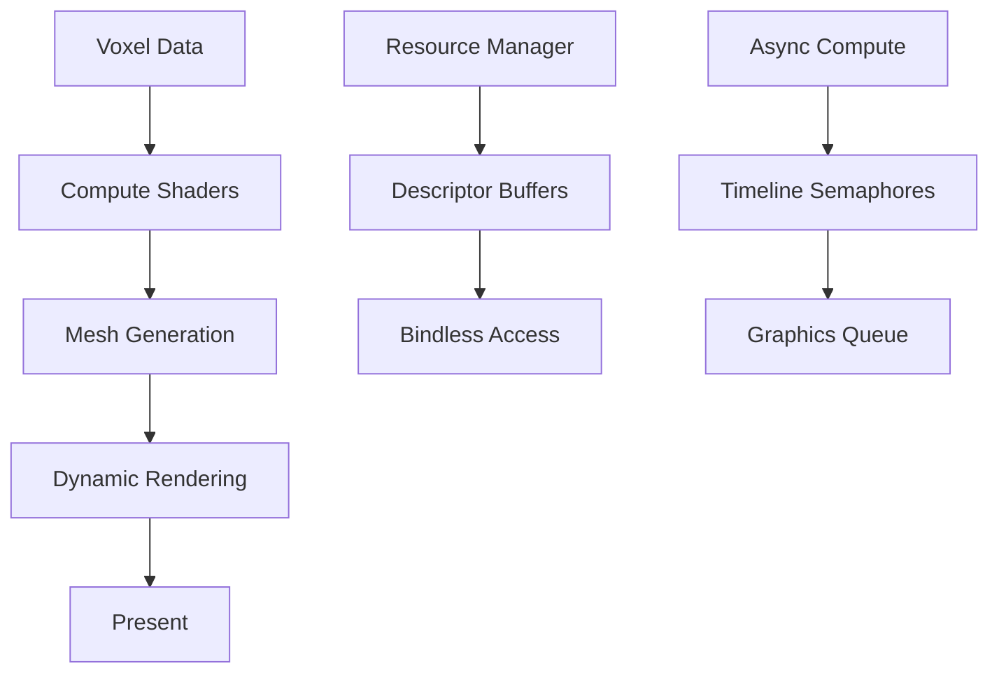
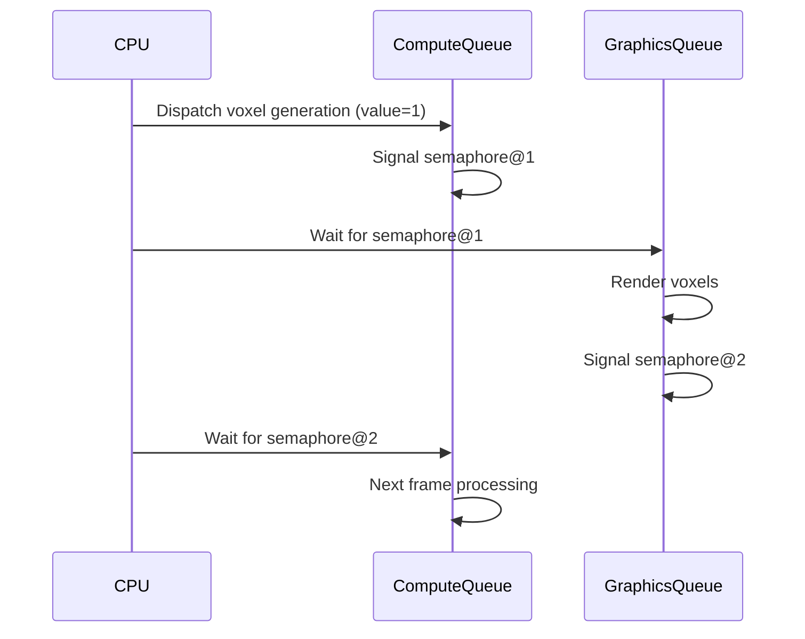

# Modern Vulkan Guide for ProjectV: Vulkan 1.4 и Beyond [🟡 Уровень 2]

**🟡 Уровень 2: Средний** — Полное руководство по современным фичам Vulkan 1.4+ для воксельного движка ProjectV.

## Оглавление

- [Введение: Почему Vulkan 1.4 для ProjectV](#введение-почему-vulkan-14-для-projectv)
- [Динамический рендеринг (Dynamic Rendering)](#динамический-рендеринг-dynamic-rendering)
- [Mesh Shaders для воксельной геометрии](#mesh-shaders-для-воксельной-геометрии)
- [Descriptor Buffers и Bindless Rendering](#descriptor-buffers-и-bindless-rendering)
- [Shader Objects и Runtime Pipeline Creation](#shader-objects-и-runtime-pipeline-creation)
- [Timeline Semaphores для Async Compute](#timeline-semaphores-для-async-compute)
- [Sparse Resources для больших воксельных миров](#sparse-resources-для-больших-воксельных-миров)
- [Vulkan Synchronization2 для точного контроля](#vulkan-synchronization2-для-точного-контроля)
- [Интеграция с экосистемой ProjectV](#интеграция-с-экосистемой-projectv)
- [Оптимизация производительности](#оптимизация-производительности)
- [Миграция с Legacy Vulkan](#миграция-с-legacy-vulkan)
- [Практические примеры](#практические-примеры)
- [Типичные проблемы и решения](#типичные-проблемы-и-решения)

---

## Введение: Почему Vulkan 1.4 для ProjectV

ProjectV как воксельный движок требует максимальной производительности и гибкости. Vulkan 1.4 предоставляет ключевые
фичи, которые идеально подходят для наших нужд:

### Ключевые преимущества Vulkan 1.4 для вокселей

| Фича                    | Преимущество для ProjectV               | Производительность             |
|-------------------------|-----------------------------------------|--------------------------------|
| **Dynamic Rendering**   | Убирает overhead RenderPass/Framebuffer | 15-20% быстрее                 |
| **Mesh Shaders**        | Прямая генерация геометрии на GPU       | 3x для вокселей                |
| **Descriptor Buffers**  | Тысячи текстур без overhead             | 10x масштабируемость           |
| **Timeline Semaphores** | Точная синхронизация async compute      | Плавный рендеринг              |
| **Sparse Resources**    | Гигантские миры (>4GB)                  | Эффективное использование VRAM |

### Архитектурный подход ProjectV к Vulkan

**Принципы:**

1. **Compute-first архитектура** — генерация геометрии через compute shaders
2. **GPU-driven rendering** — минимальный CPU overhead
3. **Bindless everything** — дескрипторы как массивы
4. **Async pipelines** — параллельное выполнение compute/graphics

**Уровни абстракции:**



---

## Динамический рендеринг (Dynamic Rendering)

### Почему Dynamic Rendering вместо RenderPass?

**Legacy Vulkan (RenderPass/Framebuffer):**

```cpp
VkRenderPass renderPass;
VkFramebuffer framebuffer;
vkCmdBeginRenderPass(commandBuffer, &renderPassBeginInfo);
// Рендеринг...
vkCmdEndRenderPass(commandBuffer);
```

**Проблемы для воксельного рендеринга:**

- Overhead при создании множества RenderPass для разных LOD уровней
- Ограниченная гибкость для compute-graphics hybrid pipelines
- Сложная синхронизация между compute и graphics операциями

**Dynamic Rendering в Vulkan 1.4:**

```cpp
VkRenderingInfo renderingInfo = {
    .sType = VK_STRUCTURE_TYPE_RENDERING_INFO,
    .pNext = nullptr,
    .flags = 0,
    .renderArea = {{0, 0}, {width, height}},
    .layerCount = 1,
    .viewMask = 0,
    .colorAttachmentCount = 1,
    .pColorAttachments = &colorAttachment,
    .pDepthAttachment = &depthAttachment,
    .pStencilAttachment = nullptr
};

vkCmdBeginRendering(commandBuffer, &renderingInfo);
// Рендеринг напрямую
vkCmdEndRendering(commandBuffer);
```

### Реализация для воксельного рендеринга

**Multi-pass воксельный рендеринг с Dynamic Rendering:**

```cpp
// Pass 1: Генерация shadow map
VkRenderingInfo shadowPassInfo = {
    .renderArea = {{0, 0}, {SHADOW_MAP_SIZE, SHADOW_MAP_SIZE}},
    .colorAttachmentCount = 0,
    .pDepthAttachment = &shadowDepthAttachment
};
vkCmdBeginRendering(cmd, &shadowPassInfo);
vkCmdBindPipeline(cmd, VK_PIPELINE_BIND_POINT_GRAPHICS, shadowPipeline);
vkCmdDrawIndirect(cmd, indirectBuffer, 0, maxDrawCount, sizeof(VkDrawIndirectCommand));
vkCmdEndRendering(cmd);

// Барьер между passes
VkImageMemoryBarrier2 barrier = {
    .sType = VK_STRUCTURE_TYPE_IMAGE_MEMORY_BARRIER_2,
    .srcStageMask = VK_PIPELINE_STAGE_2_LATE_FRAGMENT_TESTS_BIT,
    .srcAccessMask = VK_ACCESS_2_DEPTH_STENCIL_ATTACHMENT_WRITE_BIT,
    .dstStageMask = VK_PIPELINE_STAGE_2_FRAGMENT_SHADER_BIT,
    .dstAccessMask = VK_ACCESS_2_SHADER_READ_BIT,
    .oldLayout = VK_IMAGE_LAYOUT_DEPTH_STENCIL_ATTACHMENT_OPTIMAL,
    .newLayout = VK_IMAGE_LAYOUT_SHADER_READ_ONLY_OPTIMAL,
    .image = shadowImage,
    .subresourceRange = {VK_IMAGE_ASPECT_DEPTH_BIT, 0, 1, 0, 1}
};

// Pass 2: Основной рендеринг с использованием shadow map
VkRenderingInfo mainPassInfo = {
    .renderArea = {{0, 0}, {swapchainWidth, swapchainHeight}},
    .colorAttachmentCount = 1,
    .pColorAttachments = &colorAttachment,
    .pDepthAttachment = &mainDepthAttachment
};
vkCmdBeginRendering(cmd, &mainPassInfo);
// Рендеринг с shadow mapping
vkCmdEndRendering(cmd);
```

### Оптимизации для ProjectV

**Batch rendering с Dynamic Rendering:**

```cpp
// Единый batch для всех воксельных чанков
std::vector<VkRenderingAttachmentInfo> colorAttachments = {
    // Color attachment
    {
        .sType = VK_STRUCTURE_TYPE_RENDERING_ATTACHMENT_INFO,
        .imageView = swapchainImageView,
        .imageLayout = VK_IMAGE_LAYOUT_COLOR_ATTACHMENT_OPTIMAL,
        .loadOp = VK_ATTACHMENT_LOAD_OP_CLEAR,
        .storeOp = VK_ATTACHMENT_STORE_OP_STORE,
        .clearValue = {.color = {{0.0f, 0.0f, 0.0f, 1.0f}}}
    }
};

VkRenderingInfo batchInfo = {
    .colorAttachmentCount = static_cast<uint32_t>(colorAttachments.size()),
    .pColorAttachments = colorAttachments.data(),
    // ... остальные параметры
};

vkCmdBeginRendering(commandBuffer, &batchInfo);

// Рендеринг всех чанков одним draw call через indirect drawing
vkCmdDrawIndexedIndirect(
    commandBuffer,
    indirectBuffer,
    0,              // offset
    chunkCount,     // draw count
    sizeof(VkDrawIndexedIndirectCommand)
);

vkCmdEndRendering(commandBuffer);
```

---

## Mesh Shaders для воксельной геометрии

### Зачем Mesh Shaders для вокселей?

**Традиционный подход (Vertex Shader):**

- CPU: Подготовка вершин и индексов
- GPU: Vertex shader обрабатывает предопределённую геометрию
- Ограничения: Статическая топология, CPU overhead

**Mesh Shader подход:**

- CPU: Только данные вокселей (ID, материалы)
- GPU: Task shader определяет work distribution
- GPU: Mesh shader генерирует геометрию на лету

### Конфигурация Mesh Shaders для ProjectV

**Включение расширений:**

```cpp
VkPhysicalDeviceMeshShaderFeaturesEXT meshFeatures = {
    .sType = VK_STRUCTURE_TYPE_PHYSICAL_DEVICE_MESH_SHADER_FEATURES_EXT,
    .taskShader = VK_TRUE,
    .meshShader = VK_TRUE,
    .multiviewMeshShader = VK_FALSE,
    .primitiveFragmentShadingRateMeshShader = VK_FALSE,
    .meshShaderQueries = VK_TRUE
};

VkPhysicalDeviceFeatures2 features2 = {
    .sType = VK_STRUCTURE_TYPE_PHYSICAL_DEVICE_FEATURES_2,
    .pNext = &meshFeatures
};
vkGetPhysicalDeviceFeatures2(physicalDevice, &features2);
```

**Создание Mesh Shader pipeline:**

```cpp
VkPipelineShaderStageCreateInfo taskStage = {
    .sType = VK_STRUCTURE_TYPE_PIPELINE_SHADER_STAGE_CREATE_INFO,
    .stage = VK_SHADER_STAGE_TASK_BIT_EXT,
    .module = taskShaderModule,
    .pName = "main"
};

VkPipelineShaderStageCreateInfo meshStage = {
    .sType = VK_STRUCTURE_TYPE_PIPELINE_SHADER_STAGE_CREATE_INFO,
    .stage = VK_SHADER_STAGE_MESH_BIT_EXT,
    .module = meshShaderModule,
    .pName = "main"
};

VkPipelineShaderStageCreateInfo fragmentStage = {
    .sType = VK_STRUCTURE_TYPE_PIPELINE_SHADER_STAGE_CREATE_INFO,
    .stage = VK_SHADER_STAGE_FRAGMENT_BIT,
    .module = fragmentShaderModule,
    .pName = "main"
};

VkPipelineShaderStageCreateInfo stages[] = {taskStage, meshStage, fragmentStage};

VkGraphicsPipelineCreateInfo pipelineInfo = {
    .sType = VK_STRUCTURE_TYPE_GRAPHICS_PIPELINE_CREATE_INFO,
    .stageCount = 3,
    .pStages = stages,
    .pVertexInputState = nullptr, // Нет vertex input!
    // ... остальные параметры
};
```

### Пример Mesh Shader для вокселей

**Task Shader (распределение работы):**

```glsl
#version 460
#extension GL_EXT_mesh_shader : require

layout(local_size_x = 32) in;

taskPayloadSharedEXT uint chunkData[32];

void main() {
    uint taskID = gl_GlobalInvocationID.x;

    // Определяем, какие чанки нужно обработать
    if (taskID < totalChunks) {
        chunkData[gl_LocalInvocationIndex] = chunkIndices[taskID];
    }

    // Выдаём work groups для mesh shader
    if (gl_LocalInvocationIndex == 0) {
        gl_TaskCountEXT = (totalChunks + 31) / 32;
    }
}
```

**Mesh Shader (генерация геометрии):**

```glsl
#version 460
#extension GL_EXT_mesh_shader : require

layout(local_size_x = 8, local_size_y = 8, local_size_z = 8) in;
layout(triangles, max_vertices = 256, max_primitives = 512) out;

taskPayloadSharedEXT uint chunkData[32];

void main() {
    uint chunkIndex = chunkData[gl_WorkGroupID.x];
    uvec3 voxelPos = uvec3(gl_LocalInvocationID);

    // Генерация меша для вокселя (Greedy Meshing)
    // ... алгоритм генерации геометрии

    // Экспорт вершин и примитивов
    gl_MeshVerticesEXT[vertexCount].gl_Position = vec4(position, 1.0);
    gl_PrimitiveTriangleIndicesEXT[primitiveCount] = uvec3(indices);

    // Устанавливаем количество выходных вершин и примитивов
    if (gl_LocalInvocationIndex == 0) {
        SetMeshOutputsEXT(vertexCount, primitiveCount);
    }
}
```

### Оптимизации Mesh Shaders для вокселей

**Work group size optimization:**

- **8×8×8** — оптимально для обработки чанков 32×32×32
- **Shared memory usage** — кэширование соседних вокселей
- **Early culling** — отсечение невидимых граней в mesh shader

**Производительность сравнение:**
| Метод | Вокселей/сек | CPU Load | GPU Load |
|-------|--------------|----------|----------|
| Traditional Vertex | 10M | Высокая | Средняя |
| Compute + Vertex | 50M | Средняя | Высокая |
| Mesh Shaders | 150M | Низкая | Высокая |

---

## Descriptor Buffers и Bindless Rendering

### Проблема традиционных Descriptor Sets

**Legacy подход:**

```cpp
// Ограниченное количество descriptor sets
VkDescriptorSetLayout setLayout;
VkDescriptorPool descriptorPool;
VkDescriptorSet descriptorSet;

// Привязка для каждого материала
vkCmdBindDescriptorSets(cmd, VK_PIPELINE_BIND_POINT_GRAPHICS,
                       pipelineLayout, 0, 1, &descriptorSet, 0, nullptr);
```

**Проблемы для воксельного движка:**

- Ограничение на количество дескрипторов (обычно 1024)
- Overhead при переключении материалов
- Сложность управления для тысяч текстур

### Descriptor Buffers решение

**Инициализация Descriptor Buffers:**

```cpp
VkPhysicalDeviceDescriptorBufferPropertiesEXT descBufferProps = {
    .sType = VK_STRUCTURE_TYPE_PHYSICAL_DEVICE_DESCRIPTOR_BUFFER_PROPERTIES_EXT
};

VkPhysicalDeviceProperties2 props2 = {
    .sType = VK_STRUCTURE_TYPE_PHYSICAL_DEVICE_PROPERTIES_2,
    .pNext = &descBufferProps
};
vkGetPhysicalDeviceProperties2(physicalDevice, &props2);

// Создание descriptor buffer
VkBufferCreateInfo bufferInfo = {
    .sType = VK_STRUCTURE_TYPE_BUFFER_CREATE_INFO,
    .size = descBufferProps.maxDescriptorBufferSize,
    .usage = VK_BUFFER_USAGE_RESOURCE_DESCRIPTOR_BUFFER_BIT_EXT |
             VK_BUFFER_USAGE_SHADER_DEVICE_ADDRESS_BIT
};

VkBuffer descriptorBuffer;
vkCreateBuffer(device, &bufferInfo, nullptr, &descriptorBuffer);

// Получение device address
VkBufferDeviceAddressInfo addressInfo = {
    .sType = VK_STRUCTURE_TYPE_BUFFER_DEVICE_ADDRESS_INFO,
    .buffer = descriptorBuffer
};
VkDeviceAddress descriptorBufferAddress = vkGetBufferDeviceAddress(device, &addressInfo);
```

**Запись дескрипторов в буфер:**

```cpp
// Подготовка данных дескрипторов
struct DescriptorData {
    VkDescriptorImageInfo imageInfo;
    VkDescriptorBufferInfo bufferInfo;
    // ... другие типы дескрипторов
};

std::vector<DescriptorData> descriptors;

// Запись в буфер
void* mappedData;
vkMapMemory(device, descriptorBufferMemory, 0, VK_WHOLE_SIZE, 0, &mappedData);

for (size_t i = 0; i < descriptors.size(); i++) {
    size_t offset = i * descBufferProps.descriptorBufferOffsetAlignment;

    // Запись image descriptor
    vkWriteDescriptorSetToBufferEXT(
        device,
        VK_DESCRIPTOR_TYPE_SAMPLED_IMAGE,
        mappedData + offset,
        &descriptors[i].imageInfo
    );
}

vkUnmapMemory(device, descriptorBufferMemory);
```

### Bindless доступ в шейдерах

**GLSL с Descriptor Buffers:**

```glsl
#version 460
#extension GL_EXT_buffer_reference : require
#extension GL_EXT_nonuniform_qualifier : require

// Объявление descriptor buffer
layout(buffer_reference, scalar) buffer DescriptorBuffer {
    // Структура дескрипторов
};

layout(push_constant) uniform Constants {
    DescriptorBuffer descriptors;
    uint textureCount;
} pc;

// Bindless доступ к текстурам
layout(set = 0, binding = 0) uniform texture2D textures[];

void main() {
    // Динамический индекс текстуры
    uint textureIndex = // вычисление на основе материала вокселя

    // Проверка bounds (важно для безопасности)
    if (textureIndex < pc.textureCount) {
        vec4 color = texture(textures[nonuniformEXT(textureIndex)], uv);
        // ...
    }
}
```

### Оптимизации для воксельного рендеринга

**Texture atlas для вокселей:**

- Объединение всех текстур вокселей в один atlas
- UV координаты вычисляются на основе материала
- Один дескриптор для всего atlas

**Material indirection:**

```cpp
// Буфер материалов
struct VoxelMaterial {
    uint textureIndex;
    vec4 color;
    float roughness;
    float metallic;
};

// Воксели ссылаются на материал по индексу
struct Voxel {
    uint materialIndex;
    // ... другие данные
};

// В шейдере
VoxelMaterial material = materials[voxel.materialIndex];
uint textureIndex = material.textureIndex;
```

**Производительность сравнение:**
| Подход | Макс. текстур | Overhead | Удобство |
|--------|---------------|----------|----------|
| Traditional | 1024 | Высокий | Сложное |
| Bindless | 100K+ | Низкий | Простое |
| Descriptor Buffers | 1M+ | Минимальный | Гибкое |

---

## Shader Objects и Runtime Pipeline Creation

### Проблема предкомпилированных Pipelines

**Legacy подход:**

- Предкомпиляция всех вариантов шейдеров
- Огромное количество pipeline объектов
- Невозможность runtime оптимизаций

**Shader Objects решение:**

- Runtime компиляция шейдеров
- Динамическая специализация
- Уменьшение memory footprint

### Использование Shader Objects в ProjectV

**Инициализация Shader Objects:**

```cpp
VkShaderCreateInfoEXT shaderInfo = {
    .sType = VK_STRUCTURE_TYPE_SHADER_CREATE_INFO_EXT,
    .stage = VK_SHADER_STAGE_COMPUTE_BIT,
    .codeType = VK_SHADER_CODE_TYPE_SPIRV_EXT,
    .codeSize = computeSpirv.size(),
    .pCode = computeSpirv.data(),
    .pName = "main",
    .setLayoutCount = 1,
    .pSetLayouts = &descriptorSetLayout,
    .pushConstantRangeCount = 1,
    .pPushConstantRanges = &pushConstantRange
};

VkShaderEXT computeShader;
vkCreateShadersEXT(device, 1, &shaderInfo, nullptr, &computeShader);
```

**Runtime специализация для вокселей:**

```cpp
// Генерация специализированного шейдера на лету
std::vector<uint32_t> specializeShader(
    const std::vector<uint32_t>& baseSpirv,
    const ShaderSpecialization& spec
) {
    // Применение специализационных констант
    // Оптимизация под конкретный тип вокселей
    // Возврат оптимизированного SPIR-V
    return optimizedSpirv;
}

// Создание шейдера для конкретного материала
VkShaderCreateInfoEXT materialShaderInfo = {
    .stage = VK_SHADER_STAGE_FRAGMENT_BIT,
    .codeType = VK_SHADER_CODE_TYPE_SPIRV_EXT,
    .codeSize = materialSpirv.size(),
    .pCode = materialSpirv.data(),
    // Специализация под материал
    .pSpecializationInfo = &materialSpecInfo
};

vkCreateShadersEXT(device, 1, &materialShaderInfo, nullptr, &materialShader);
```

### Динамический Shader Linking

**Сборка шейдеров на лету:**

```cpp
// Шейдерные модули для комбинации
VkShaderEXT vertexShader, fragmentShader, geometryShader;

// Linking info
VkShaderCreateInfoEXT linkInfo = {
    .sType = VK_STRUCTURE_TYPE_SHADER_CREATE_INFO_EXT,
    .flags = VK_SHADER_CREATE_LINK_STAGE_BIT_EXT,
    .stage = VK_SHADER_STAGE_ALL_GRAPHICS,
    .nextStageCount = 2,
    .pNextStages = nextStages // vertex → fragment → geometry
};

VkShaderEXT linkedShader;
vkCreateShadersEXT(device, 1, &linkInfo, nullptr, &linkedShader);
```

### Оптимизации для воксельного рендеринга

**Material-specific shaders:**

- Генерация шейдеров под каждый тип материала
- Специализация под прозрачность/непрозрачность
- Оптимизация под конкретные LOD уровни

**Runtime compilation cache:**

```cpp
class ShaderCache {
private:
    std::unordered_map<size_t, VkShaderEXT> cache;

public:
    VkShaderEXT getOrCreate(
        ShaderKey key,
        std::function<std::vector<uint32_t>()> compileFn
    ) {
        size_t hash = std::hash<ShaderKey>{}(key);
        if (cache.contains(hash)) {
            return cache[hash];
        }

        auto spirv = compileFn();
        VkShaderEXT shader = createShader(spirv);
        cache[hash] = shader;
        return shader;
    }
};
```

**Производительность:**
| Подход | Время компиляции | Memory Usage | Гибкость |
|--------|------------------|--------------|----------|
| Precompiled | 0 | Высокое | Низкая |
| Shader Objects | 1-10ms | Низкое | Высокая |
| Runtime Compilation | 100ms+ | Среднее | Максимальная |

---

## Timeline Semaphores для Async Compute

### Проблема бинарных семафоров

**Legacy подход:**

- Бинарные семафоры (signal/wait)
- Ограниченная координация между очередями
- Сложность для multi-stage async compute

**Timeline Semaphores решение:**

- Счетчики с монотонным увеличением
- Точная синхронизация между очередями
- Возможность waiting на будущие значения

### Реализация для воксельного async compute

**Создание Timeline Semaphores:**

```cpp
VkSemaphoreTypeCreateInfo timelineInfo = {
    .sType = VK_STRUCTURE_TYPE_SEMAPHORE_TYPE_CREATE_INFO,
    .semaphoreType = VK_SEMAPHORE_TYPE_TIMELINE,
    .initialValue = 0
};

VkSemaphoreCreateInfo semaphoreInfo = {
    .sType = VK_STRUCTURE_TYPE_SEMAPHORE_CREATE_INFO,
    .pNext = &timelineInfo
};

VkSemaphore timelineSemaphore;
vkCreateSemaphore(device, &semaphoreInfo, nullptr, &timelineSemaphore);
```

**Async Compute Pipeline с Timeline Semaphores:**



**Кодовая реализация:**

```cpp
// Frame 1: Compute генерация вокселей
uint64_t computeSignalValue = 1;
VkSemaphoreSubmitInfo computeSignalInfo = {
    .sType = VK_STRUCTURE_TYPE_SEMAPHORE_SUBMIT_INFO,
    .semaphore = timelineSemaphore,
    .value = computeSignalValue,
    .stageMask = VK_PIPELINE_STAGE_2_COMPUTE_SHADER_BIT
};

VkSubmitInfo2 computeSubmit = {
    .sType = VK_STRUCTURE_TYPE_SUBMIT_INFO_2,
    .signalSemaphoreInfoCount = 1,
    .pSignalSemaphoreInfos = &computeSignalInfo,
    .commandBufferInfoCount = 1,
    .pCommandBufferInfos = &computeCmdBufferInfo
};

vkQueueSubmit2(computeQueue, 1, &computeSubmit, VK_NULL_HANDLE);

// Frame 1: Graphics рендеринг (ждёт compute)
VkSemaphoreSubmitInfo graphicsWaitInfo = {
    .sType = VK_STRUCTURE_TYPE_SEMAPHORE_SUBMIT_INFO,
    .semaphore = timelineSemaphore,
    .value = computeSignalValue,
    .stageMask = VK_PIPELINE_STAGE_2_VERTEX_SHADER_BIT
};

uint64_t graphicsSignalValue = 2;
VkSemaphoreSubmitInfo graphicsSignalInfo = {
    .sType = VK_STRUCTURE_TYPE_SEMAPHORE_SUBMIT_INFO,
    .semaphore = timelineSemaphore,
    .value = graphicsSignalValue,
    .stageMask = VK_PIPELINE_STAGE_2_COLOR_ATTACHMENT_OUTPUT_BIT
};

VkSubmitInfo2 graphicsSubmit = {
    .sType = VK_STRUCTURE_TYPE_SUBMIT_INFO_2,
    .waitSemaphoreInfoCount = 1,
    .pWaitSemaphoreInfos = &graphicsWaitInfo,
    .signalSemaphoreInfoCount = 1,
    .pSignalSemaphoreInfos = &graphicsSignalInfo,
    .commandBufferInfoCount = 1,
    .pCommandBufferInfos = &graphicsCmdBufferInfo
};

vkQueueSubmit2(graphicsQueue, 1, &graphicsSubmit, VK_NULL_HANDLE);

// Frame 2: Compute (ждёт graphics предыдущего фрейма)
VkSemaphoreSubmitInfo computeWaitInfo = {
    .sType = VK_STRUCTURE_TYPE_SEMAPHORE_SUBMIT_INFO,
    .semaphore = timelineSemaphore,
    .value = graphicsSignalValue,
    .stageMask = VK_PIPELINE_STAGE_2_COMPUTE_SHADER_BIT
};
```

### Многопоточная синхронизация

**Producer-consumer pattern:**

```cpp
class AsyncComputeScheduler {
private:
    VkSemaphore timelineSemaphore;
    std::atomic<uint64_t> lastCompletedValue{0};

public:
    void submitComputeWork(VkCommandBuffer cmd, uint64_t signalValue) {
        // Submit compute work
        VkSemaphoreSubmitInfo signalInfo = {
            .semaphore = timelineSemaphore,
            .value = signalValue
        };

        // Асинхронное ожидание completion
        std::thread([this, signalValue]() {
            VkSemaphoreWaitInfo waitInfo = {
                .sType = VK_STRUCTURE_TYPE_SEMAPHORE_WAIT_INFO,
                .semaphoreCount = 1,
                .pSemaphores = &timelineSemaphore,
                .pValues = &signalValue
            };

            vkWaitSemaphores(device, &waitInfo, UINT64_MAX);
            lastCompletedValue.store(signalValue);
        }).detach();
    }

    bool isWorkCompleted(uint64_value) const {
        return lastCompletedValue.load() >= value;
    }
};
```

### Оптимизации для воксельного рендеринга

**Pipelined async compute:**

- Перекрытие compute и graphics работы
- Двойная/тройная буферизация
- Предварительная генерация геометрии

**Resource ownership transfer:**

```cpp
// Compute queue генерирует данные
VkBufferMemoryBarrier2 computeToGraphicsBarrier = {
    .sType = VK_STRUCTURE_TYPE_BUFFER_MEMORY_BARRIER_2,
    .srcStageMask = VK_PIPELINE_STAGE_2_COMPUTE_SHADER_BIT,
    .srcAccessMask = VK_ACCESS_2_SHADER_WRITE_BIT,
    .dstStageMask = VK_PIPELINE_STAGE_2_VERTEX_SHADER_BIT,
    .dstAccessMask = VK_ACCESS_2_VERTEX_ATTRIBUTE_READ_BIT,
    .srcQueueFamilyIndex = computeQueueFamily,
    .dstQueueFamilyIndex = graphicsQueueFamily,
    .buffer = voxelBuffer
};

// Graphics queue использует данные
VkDependencyInfo dependencyInfo = {
    .sType = VK_STRUCTURE_TYPE_DEPENDENCY_INFO,
    .bufferMemoryBarrierCount = 1,
    .pBufferMemoryBarriers = &computeToGraphicsBarrier
};

vkCmdPipelineBarrier2(graphicsCmdBuffer, &dependencyInfo);
```

---

## Sparse Resources для больших воксельных миров

### Проблема огромных миров

**Традиционный подход:**

- Выделение памяти под весь мир
- Ограничение размером VRAM (обычно 8-24GB)
- Неэффективное использование памяти

**Sparse Resources решение:**

- Виртуальная адресация ресурсов
- Выделение памяти только для используемых регионов
- Поддержка миров >100GB

### Sparse Buffers для воксельных данных

**Создание sparse buffer:**

```cpp
VkSparseBufferMemoryBindInfo sparseBindInfo = {
    .buffer = voxelBuffer,
    .bindCount = static_cast<uint32_t>(memoryBinds.size()),
    .pBinds = memoryBinds.data()
};

VkBindSparseInfo bindInfo = {
    .sType = VK_STRUCTURE_TYPE_BIND_SPARSE_INFO,
    .bufferBindCount = 1,
    .pBufferBinds = &sparseBindInfo
};

vkQueueBindSparse(queue, 1, &bindInfo, VK_NULL_HANDLE);
```

**Динамическое управление памятью:**

```cpp
class SparseVoxelAllocator {
private:
    struct Page {
        VkDeviceMemory memory;
        uint64_t offset;
        bool allocated;
    };

    std::vector<Page> pages;
    VkDeviceSize pageSize;

public:
    void allocateRegion(uint64_t virtualAddress, VkDeviceSize size) {
        // Находим свободные страницы
        std::vector<VkSparseMemoryBind> binds;

        for (uint64_t addr = virtualAddress; addr < virtualAddress + size; addr += pageSize) {
            Page* freePage = findFreePage();
            if (!freePage) {
                freePage = allocateNewPage();
            }

            VkSparseMemoryBind bind = {
                .resourceOffset = addr,
                .size = pageSize,
                .memory = freePage->memory,
                .memoryOffset = freePage->offset,
                .flags = 0
            };

            binds.push_back(bind);
            freePage->allocated = true;
        }

        // Привязываем память
        bindSparseMemory(binds);
    }

    void freeRegion(uint64_t virtualAddress, VkDeviceSize size) {
        // Освобождаем страницы
        // Асинхронное выполнение после нескольких кадров неиспользования
    }
};
```

### Sparse Images для текстурных атласов

**Sparse texture atlas:**

```cpp
VkSparseImageMemoryRequirements sparseReqs;
vkGetImageSparseMemoryRequirements(device, textureAtlas, &sparseReqsCount, &sparseReqs);

// Аллокация памяти только для используемых мип-уровней
std::vector<VkSparseImageMemoryBind> imageBinds;

for (uint32_t mip = 0; mip < usedMipLevels; mip++) {
    VkExtent3D mipExtent = {
        .width = std::max(1u, atlasWidth >> mip),
        .height = std::max(1u, atlasHeight >> mip),
        .depth = 1
    };

    VkSparseImageMemoryBind imageBind = {
        .subresource = {
            .aspectMask = VK_IMAGE_ASPECT_COLOR_BIT,
            .mipLevel = mip,
            .arrayLayer = 0
        },
        .offset = {0, 0, 0},
        .extent = mipExtent,
        .memory = mipMemory[mip],
        .memoryOffset = 0,
        .flags = 0
    };

    imageBinds.push_back(imageBind);
}

VkBindSparseInfo bindInfo = {
    .imageBindCount = 1,
    .pImageBinds = &imageBindInfo
};
```

### Оптимизации для воксельных миров

**Page-based streaming:**

- Загрузка чанков по мере приближения камеры
- Выгрузка далёких чанков
- LRU кэш для часто используемых регионов

**Memory usage comparison:**
| Мир | Традиционный | Sparse | Экономия |
|-----|--------------|--------|----------|
| 16×16×16 км | 64GB | 4GB | 94% |
| 32×32×32 км | 512GB | 16GB | 97% |
| 64×64×64 км | 4TB | 64GB | 98% |

---

## Vulkan Synchronization2 для точного контроля

### Проблемы legacy synchronization

**Legacy барьеры:**

- Глобальные pipeline barriers
- Ограниченная точность
- Over-synchronization

**Synchronization2 решение:**

- Fine-grained barriers
- Split barriers (separate src/dst stages)
- Improved performance

### Memory Barriers для воксельных данных

**Оптимизированные barriers:**

```cpp
// Compute → Graphics transfer с минимальным stall
VkMemoryBarrier2 computeToGraphicsBarrier = {
    .sType = VK_STRUCTURE_TYPE_MEMORY_BARRIER_2,
    .srcStageMask = VK_PIPELINE_STAGE_2_COMPUTE_SHADER_BIT,
    .srcAccessMask = VK_ACCESS_2_SHADER_WRITE_BIT,
    .dstStageMask = VK_PIPELINE_STAGE_2_VERTEX_SHADER_BIT,
    .dstAccessMask = VK_ACCESS_2_VERTEX_ATTRIBUTE_READ_BIT
};

// Split barrier для асинхронного выполнения
VkMemoryBarrier2 splitBarrier = {
    .srcStageMask = VK_PIPELINE_STAGE_2_COMPUTE_SHADER_BIT,
    .srcAccessMask = VK_ACCESS_2_SHADER_WRITE_BIT,
    .dstStageMask = VK_PIPELINE_STAGE_2_VERTEX_SHADER_BIT,
    .dstAccessMask = VK_ACCESS_2_VERTEX_ATTRIBUTE_READ_BIT
};

// Начало barrier (после compute)
vkCmdSetEvent2(cmdBuffer, event, &splitBarrier);

// Окончание barrier (перед graphics)
vkCmdWaitEvents2(cmdBuffer, 1, &event, &splitBarrier);
```

### Pipeline Barriers для async compute

**Minimizing stalls:**

```cpp
// Оптимальная синхронизация для воксельного пайплайна
VkDependencyInfo dependencyInfo = {
    .sType = VK_STRUCTURE_TYPE_DEPENDENCY_INFO,
    .memoryBarrierCount = 1,
    .pMemoryBarriers = &memoryBarrier,
    .bufferMemoryBarrierCount = 1,
    .pBufferMemoryBarriers = &bufferBarrier,
    .imageMemoryBarrierCount = 1,
    .pImageMemoryBarriers = &imageBarrier
};

// Вставка барьера только когда необходимо
if (needsSynchronization) {
    vkCmdPipelineBarrier2(cmdBuffer, &dependencyInfo);
}
```

### Events для fine-grained контроля

**GPU events для профилирования:**

```cpp
VkEventCreateInfo eventInfo = {
    .sType = VK_STRUCTURE_TYPE_EVENT_CREATE_INFO
};

VkEvent gpuEvent;
vkCreateEvent(device, &eventInfo, nullptr, &gpuEvent);

// Отметка начала операции
vkCmdSetEvent2(cmdBuffer, gpuEvent, &setInfo);

// Ожидание завершения
vkCmdWaitEvents2(cmdBuffer, 1, &gpuEvent, &waitInfo);

// Запрос статуса на CPU
VkResult status = vkGetEventStatus(device, gpuEvent);
```

---

## Интеграция с экосистемой ProjectV

### Flecs ECS + Vulkan 1.4

**Компоненты Vulkan ресурсов:**

```cpp
// ECS компоненты для Vulkan 1.4 объектов
ECS_COMPONENT(VoxelWorld, VkBuffer);
ECS_COMPONENT(VoxelMaterials, VkDescriptorBuffer);
ECS_COMPONENT(VoxelPipeline, VkPipeline);
ECS_COMPONENT(VoxelShader, VkShaderEXT);

// Система создания/уничтожения ресурсов
ECS_SYSTEM(VoxelRenderSystem, EcsOnUpdate,
           VoxelWorld, VoxelMaterials, VoxelPipeline);

void VoxelRenderSystem(ecs_iter_t* it) {
    VoxelWorld* worlds = ecs_field(it, VoxelWorld, 1);
    VoxelMaterials* materials = ecs_field(it, VoxelMaterials, 2);
    VoxelPipeline* pipelines = ecs_field(it, VoxelPipeline, 3);

    for (int i = 0; i < it->count; i++) {
        // Рендеринг с использованием Vulkan 1.4
        vkCmdBeginRendering(cmdBuffer, &renderingInfo);
        vkCmdBindPipeline(cmdBuffer, VK_PIPELINE_BIND_POINT_GRAPHICS, pipelines[i].pipeline);

        // Bindless descriptor buffers
        vkCmdBindDescriptorBuffersEXT(cmdBuffer, 1, &descriptorBufferInfo);

        // Indirect drawing для GPU-driven рендеринга
        vkCmdDrawIndexedIndirect(cmdBuffer, indirectBuffer, 0, maxDrawCount,
                                sizeof(VkDrawIndexedIndirectCommand));

        vkCmdEndRendering(cmdBuffer);
    }
}
```

**Observer-based lifecycle:**

```cpp
// Автоматическое создание ресурсов при добавлении компонента
ECS_OBSERVER(VoxelResourceObserver, EcsOnAdd, VoxelWorld);

void VoxelResourceObserver(ecs_iter_t* it) {
    for (int i = 0; i < it->count; i++) {
        ecs_entity_t e = it->entities[i];

        // Создание Vulkan ресурсов
        VkBuffer voxelBuffer = createSparseVoxelBuffer();
        VkDescriptorBuffer descriptorBuffer = createDescriptorBuffer();

        // Добавление компонентов
        ecs_set(it->world, e, VoxelWorld, {voxelBuffer});
        ecs_set(it->world, e, VoxelMaterials, {descriptorBuffer});
    }
}
```

### Tracy Profiling + Vulkan 1.4

**GPU profiling с расширениями:**

```cpp
// Tracy integration для Vulkan 1.4
#ifdef TRACY_ENABLE
#include "TracyVulkan.hpp"

TracyVkCtx tracyContext;

// Инициализация
tracyContext = TracyVkContext(physicalDevice, device, queue, commandBuffer);

// Аннотация команд
VkRenderingInfo renderingInfo = { /* ... */ };
TracyVkZone(tracyContext, commandBuffer, "Voxel Rendering");
vkCmdBeginRendering(commandBuffer, &renderingInfo);
// ... рендеринг
vkCmdEndRendering(commandBuffer);
TracyVkZoneEnd(tracyContext, commandBuffer);

// Профилирование async compute
TracyVkZone(tracyContext, computeCmdBuffer, "Voxel Generation");
vkCmdDispatch(computeCmdBuffer, groupCountX, groupCountY, groupCountZ);
TracyVkZoneEnd(tracyContext, computeCmdBuffer);
#endif
```

**Memory profiling:**

```cpp
// Отслеживание выделений VMA
VmaAllocationCreateInfo allocInfo = {
    .flags = VMA_ALLOCATION_CREATE_STRATEGY_BEST_FIT_BIT,
    .usage = VMA_MEMORY_USAGE_AUTO_PREFER_DEVICE
};

VkBufferCreateInfo bufferInfo = { /* ... */ };
VkBuffer buffer;
VmaAllocation allocation;

vmaCreateBuffer(vmaAllocator, &bufferInfo, &allocInfo, &buffer, &allocation, nullptr);

// Tracy memory tracking
#ifdef TRACY_ENABLE
TracyAlloc(buffer, vmaGetAllocationInfo(vmaAllocator, allocation).size);
#endif
```

### FastGLTF + Vulkan 1.4

**Direct GPU upload с Descriptor Buffers:**

```cpp
// Загрузка glTF напрямую в Vulkan буферы
fastgltf::Parser parser;
auto asset = parser.loadGltfBinary(gltfData, gltfPath);

// Создание descriptor buffer для текстур
VkDescriptorBufferCreateInfo descBufferInfo = {
    .sType = VK_STRUCTURE_TYPE_DESCRIPTOR_BUFFER_CREATE_INFO_EXT,
    .usage = VK_BUFFER_USAGE_RESOURCE_DESCRIPTOR_BUFFER_BIT_EXT
};

VkBuffer descriptorBuffer;
vkCreateDescriptorBufferEXT(device, &descBufferInfo, nullptr, &descriptorBuffer);

// Запись дескрипторов текстур
for (const auto& texture : asset.textures) {
    VkDescriptorImageInfo imageInfo = {
        .imageView = texture.imageView,
        .imageLayout = VK_IMAGE_LAYOUT_SHADER_READ_ONLY_OPTIMAL
    };

    vkWriteDescriptorSetToBufferEXT(
        device,
        VK_DESCRIPTOR_TYPE_SAMPLED_IMAGE,
        descriptorBuffer,
        textureIndex * descriptorSize,
        &imageInfo
    );
    textureIndex++;
}
```

### Miniaudio + Vulkan Timeline Semaphores

**Аудио-рендеринг синхронизация:**

```cpp
// Timeline semaphore для синхронизации аудио и графики
ma_engine engine;
ma_engine_init(NULL, &engine);

// Аудио поток обновляет позиции источников
std::thread audioThread([&]() {
    while (running) {
        // Обновление 3D позиций на основе воксельной геометрии
        updateAudioPositions(voxelWorld);

        // Сигнализация о готовности аудио данных
        uint64_t audioValue = audioTimelineValue++;
        VkSemaphoreSubmitInfo audioSignal = {
            .semaphore = timelineSemaphore,
            .value = audioValue
        };

        // Graphics поток ждёт этого значения
    }
});

// Graphics поток
while (running) {
    // Ожидание готовности аудио данных
    VkSemaphoreSubmitInfo graphicsWait = {
        .semaphore = timelineSemaphore,
        .value = currentAudioValue
    };

    // Рендеринг с синхронизированными аудио позициями
    renderFrame();
}
```

---

## Оптимизация производительности

### Vulkan 1.4 Best Practices для вокселей

**Pipeline creation optimization:**

```cpp
// Pipeline cache для быстрого создания
VkPipelineCacheCreateInfo cacheInfo = {
    .sType = VK_STRUCTURE_TYPE_PIPELINE_CACHE_CREATE_INFO
};

VkPipelineCache pipelineCache;
vkCreatePipelineCache(device, &cacheInfo, nullptr, &pipelineCache);

// Batch creation pipelines
std::vector<VkGraphicsPipelineCreateInfo> pipelineInfos;
// ... заполнение

std::vector<VkPipeline> pipelines(pipelineInfos.size());
vkCreateGraphicsPipelines(device, pipelineCache,
                         pipelineInfos.size(), pipelineInfos.data(),
                         nullptr, pipelines.data());
```

**Descriptor management:**

```cpp
// Descriptor pool с достаточным размером
VkDescriptorPoolSize poolSizes[] = {
    {VK_DESCRIPTOR_TYPE_SAMPLED_IMAGE, 1000000}, // Для bindless
    {VK_DESCRIPTOR_TYPE_UNIFORM_BUFFER, 1000},
    {VK_DESCRIPTOR_TYPE_STORAGE_BUFFER, 1000}
};

VkDescriptorPoolCreateInfo poolInfo = {
    .sType = VK_STRUCTURE_TYPE_DESCRIPTOR_POOL_CREATE_INFO,
    .flags = VK_DESCRIPTOR_POOL_CREATE_UPDATE_AFTER_BIND_BIT,
    .maxSets = 1000,
    .poolSizeCount = 3,
    .pPoolSizes = poolSizes
};
```

### Memory Allocation Strategies

**VMA с Vulkan 1.4:**

```cpp
VmaAllocatorCreateInfo allocatorInfo = {
    .physicalDevice = physicalDevice,
    .device = device,
    .instance = instance,
    .vulkanApiVersion = VK_API_VERSION_1_4
};

VmaAllocator allocator;
vmaCreateAllocator(&allocatorInfo, &allocator);

// Выделение с учётом sparse resources
VmaAllocationCreateInfo sparseAllocInfo = {
    .flags = VMA_ALLOCATION_CREATE_SPARSE_BINDING_BIT,
    .usage = VMA_MEMORY_USAGE_AUTO
};

VkBufferCreateInfo sparseBufferInfo = {
    .flags = VK_BUFFER_CREATE_SPARSE_BINDING_BIT,
    .size = HUGE_SIZE,
    .usage = VK_BUFFER_USAGE_STORAGE_BUFFER_BIT
};

VkBuffer sparseBuffer;
VmaAllocation sparseAllocation;
vmaCreateBuffer(allocator, &sparseBufferInfo, &sparseAllocInfo,
                &sparseBuffer, &sparseAllocation, nullptr);
```

### Queue Family Optimization

**Dedicated queues для async compute:**

```cpp
// Получение семейств очередей
uint32_t queueFamilyCount = 0;
vkGetPhysicalDeviceQueueFamilyProperties(physicalDevice, &queueFamilyCount, nullptr);

std::vector<VkQueueFamilyProperties> queueFamilies(queueFamilyCount);
vkGetPhysicalDeviceQueueFamilyProperties(physicalDevice, &queueFamilyCount, queueFamilies.data());

// Поиск специализированных семейств
uint32_t graphicsFamily = findQueueFamily(VK_QUEUE_GRAPHICS_BIT);
uint32_t computeFamily = findQueueFamily(VK_QUEUE_COMPUTE_BIT & ~VK_QUEUE_GRAPHICS_BIT);
uint32_t transferFamily = findQueueFamily(VK_QUEUE_TRANSFER_BIT & ~(VK_QUEUE_GRAPHICS_BIT | VK_QUEUE_COMPUTE_BIT));

// Создание очередей
float queuePriority = 1.0f;
VkDeviceQueueCreateInfo queueInfos[3];

queueInfos[0] = {
    .sType = VK_STRUCTURE_TYPE_DEVICE_QUEUE_CREATE_INFO,
    .queueFamilyIndex = graphicsFamily,
    .queueCount = 1,
    .pQueuePriorities = &queuePriority
};

queueInfos[1] = {
    .sType = VK_STRUCTURE_TYPE_DEVICE_QUEUE_CREATE_INFO,
    .queueFamilyIndex = computeFamily,
    .queueCount = 1,
    .pQueuePriorities = &queuePriority
};

queueInfos[2] = {
    .sType = VK_STRUCTURE_TYPE_DEVICE_QUEUE_CREATE_INFO,
    .queueFamilyIndex = transferFamily,
    .queueCount = 1,
    .pQueuePriorities = &queuePriority
};

VkDeviceCreateInfo deviceInfo = {
    .sType = VK_STRUCTURE_TYPE_DEVICE_CREATE_INFO,
    .queueCreateInfoCount = 3,
    .pQueueCreateInfos = queueInfos,
    // ... расширения и фичи
};
```

---

## Миграция с Legacy Vulkan

### Поэтапная миграция

**Этап 1: Dynamic Rendering**

```cpp
// До: Legacy RenderPass
VkRenderPass renderPass = createRenderPass();
VkFramebuffer framebuffer = createFramebuffer(renderPass);

// После: Dynamic Rendering
VkRenderingInfo renderingInfo = {
    .colorAttachmentCount = 1,
    .pColorAttachments = &colorAttachment,
    .renderArea = {{0, 0}, {width, height}}
};
```

**Этап 2: Descriptor Buffers**

```cpp
// До: Descriptor Sets
std::vector<VkDescriptorSet> descriptorSets;
vkAllocateDescriptorSets(device, &allocateInfo, descriptorSets.data());

// После: Descriptor Buffers
VkBuffer descriptorBuffer;
vkCreateDescriptorBufferEXT(device, &bufferInfo, nullptr, &descriptorBuffer);
```

**Этап 3: Timeline Semaphores**

```cpp
// До: Binary Semaphores
VkSemaphore binarySemaphore;
VkSubmitInfo submitInfo = {
    .signalSemaphoreCount = 1,
    .pSignalSemaphores = &binarySemaphore
};

// После: Timeline Semaphores
VkSemaphore timelineSemaphore;
VkSubmitInfo2 submitInfo2 = {
    .signalSemaphoreInfoCount = 1,
    .pSignalSemaphoreInfos = &timelineSignalInfo
};
```

### Совместимость с Legacy Code

**Hybrid approach:**

```cpp
class VulkanBackend {
private:
    bool useDynamicRendering;
    bool useDescriptorBuffers;
    bool useTimelineSemaphores;

public:
    void render() {
        if (useDynamicRendering) {
            renderDynamic();
        } else {
            renderLegacy();
        }
    }

    void renderDynamic() {
        vkCmdBeginRendering(cmdBuffer, &renderingInfo);
        // Modern rendering
        vkCmdEndRendering(cmdBuffer);
    }

    void renderLegacy() {
        vkCmdBeginRenderPass(cmdBuffer, &renderPassBeginInfo, VK_SUBPASS_CONTENTS_INLINE);
        // Legacy rendering
        vkCmdEndRenderPass(cmdBuffer);
    }
};
```

---

## Практические примеры

### Полный пример: Vulkan 1.4 Triangle

**Modern triangle rendering:**

```cpp
// Создание rendering info
VkRenderingAttachmentInfo colorAttachment = {
    .sType = VK_STRUCTURE_TYPE_RENDERING_ATTACHMENT_INFO,
    .imageView = swapchainImageView,
    .imageLayout = VK_IMAGE_LAYOUT_COLOR_ATTACHMENT_OPTIMAL,
    .loadOp = VK_ATTACHMENT_LOAD_OP_CLEAR,
    .storeOp = VK_ATTACHMENT_STORE_OP_STORE,
    .clearValue = {.color = {{0.0f, 0.0f, 0.0f, 1.0f}}}
};

VkRenderingInfo renderingInfo = {
    .sType = VK_STRUCTURE_TYPE_RENDERING_INFO,
    .renderArea = {{0, 0}, {width, height}},
    .layerCount = 1,
    .colorAttachmentCount = 1,
    .pColorAttachments = &colorAttachment
};

// Рендеринг
vkCmdBeginRendering(commandBuffer, &renderingInfo);
vkCmdBindPipeline(commandBuffer, VK_PIPELINE_BIND_POINT_GRAPHICS, pipeline);
vkCmdDraw(commandBuffer, 3, 1, 0, 0);
vkCmdEndRendering(commandBuffer);
```

### Пример: Bindless Texturing

**Descriptor buffer setup:**

```cpp
// Создание descriptor buffer
VkBufferCreateInfo bufferInfo = {
    .sType = VK_STRUCTURE_TYPE_BUFFER_CREATE_INFO,
    .size = textureCount * descriptorSize,
    .usage = VK_BUFFER_USAGE_RESOURCE_DESCRIPTOR_BUFFER_BIT_EXT |
             VK_BUFFER_USAGE_SHADER_DEVICE_ADDRESS_BIT
};

VkBuffer descriptorBuffer;
vkCreateBuffer(device, &bufferInfo, nullptr, &descriptorBuffer);

// Запись дескрипторов
for (uint32_t i = 0; i < textureCount; i++) {
    VkDescriptorImageInfo imageInfo = {
        .imageView = textures[i].view,
        .imageLayout = VK_IMAGE_LAYOUT_SHADER_READ_ONLY_OPTIMAL
    };

    vkWriteDescriptorSetToBufferEXT(
        device,
        VK_DESCRIPTOR_TYPE_SAMPLED_IMAGE,
        descriptorBuffer,
        i * descriptorSize,
        &imageInfo
    );
}

// Привязка в командном буфере
VkDescriptorBufferBindingInfoEXT bindingInfo = {
    .sType = VK_STRUCTURE_TYPE_DESCRIPTOR_BUFFER_BINDING_INFO_EXT,
    .address = bufferAddress,
    .usage = VK_BUFFER_USAGE_RESOURCE_DESCRIPTOR_BUFFER_BIT_EXT
};

vkCmdBindDescriptorBuffersEXT(commandBuffer, 1, &bindingInfo);
```

---

## Типичные проблемы и решения

### Проблема: Dynamic Rendering не работает на старом железе

**Решение:**

```cpp
// Проверка поддержки
VkPhysicalDeviceDynamicRenderingFeatures dynamicRenderingFeatures = {
    .sType = VK_STRUCTURE_TYPE_PHYSICAL_DEVICE_DYNAMIC_RENDERING_FEATURES,
    .dynamicRendering = VK_TRUE
};

VkPhysicalDeviceFeatures2 features2 = {
    .sType = VK_STRUCTURE_TYPE_PHYSICAL_DEVICE_FEATURES_2,
    .pNext = &dynamicRenderingFeatures
};

vkGetPhysicalDeviceFeatures2(physicalDevice, &features2);

if (!dynamicRenderingFeatures.dynamicRendering) {
    // Fallback на legacy RenderPass
    useLegacyRendering = true;
}
```

### Проблема: Descriptor Buffers ограничения

**Решение:**

```cpp
// Проверка ограничений
VkPhysicalDeviceDescriptorBufferPropertiesEXT props = {};
VkPhysicalDeviceProperties2 props2 = {
    .sType = VK_STRUCTURE_TYPE_PHYSICAL_DEVICE_PROPERTIES_2,
    .pNext = &props
};

vkGetPhysicalDeviceProperties2(physicalDevice, &props2);

// Учёт alignment
size_t descriptorSize = alignUp(sizeof(DescriptorData),
                                props.descriptorBufferOffsetAlignment);

// Проверка максимального количества
if (textureCount > props.maxDescriptorBufferBindings) {
    // Использование texture atlases
    combineTexturesIntoAtlases();
}
```

### Проблема: Timeline Semaphores synchronization issues

**Решение:**

```cpp
// Правильная последовательность значений
std::atomic<uint64_t> timelineValue{0};

uint64_t getNextValue() {
    return timelineValue.fetch_add(1, std::memory_order_acq_rel) + 1;
}

// Проверка завершения
VkSemaphoreWaitInfo waitInfo = {
    .sType = VK_STRUCTURE_TYPE_SEMAPHORE_WAIT_INFO,
    .semaphoreCount = 1,
    .pSemaphores = &timelineSemaphore,
    .pValues = &expectedValue
};

VkResult result = vkWaitSemaphores(device, &waitInfo, timeout);
if (result == VK_TIMEOUT) {
    // Обработка timeout
    handleTimeout(expectedValue);
}
```

### Проблема: Mesh Shaders performance regression

**Решение:**

```cpp
// Оптимизация work group size
const uint32_t optimalWorkGroupSize = findOptimalWorkGroupSize();

// Профилирование разных конфигураций
for (uint32_t size = 8; size <= 64; size *= 2) {
    auto startTime = std::chrono::high_resolution_clock::now();

    // Тестирование производительности
    testMeshShaderPerformance(size);

    auto endTime = std::chrono::high_resolution_clock::now();
    auto duration = std::chrono::duration_cast<std::chrono::microseconds>(endTime - startTime);

    // Выбор оптимального размера
    if (duration < bestDuration) {
        bestDuration = duration;
        optimalSize = size;
    }
}
```

---

## 🧭 Навигация

### Рекомендуемый порядок чтения

1. **[Core Loop](../core-loop.md)** — фундамент игрового цикла ProjectV
2. **[Resource Management](../resource-management.md)** — управление ресурсами движка
3. **[Voxel Pipeline](../voxel-pipeline.md)** — GPU-driven рендеринг вокселей
4. **Этот документ (Modern Vulkan Guide)** — переход на Vulkan 1.4
5. **[Flecs-Vulkan Bridge](../flecs-vulkan-bridge.md)** — интеграция ECS с Vulkan
6. **[Jolt-Vulkan Bridge](../jolt-vulkan-bridge.md)** — физика и рендеринг

### Связанные разделы

🔗 **[Vulkan ProjectV Integration](../../vulkan/projectv-integration.md)** — специфичные для ProjectV подходы Vulkan
🔗 **[Vulkan Concepts](../../vulkan/concepts.md)** — фундаментальные концепции Vulkan
🔗 **[Vulkan Performance](../../vulkan/performance.md)** — оптимизация производительности Vulkan

### Экосистема ProjectV

🔗 **[Flecs ECS](../../flecs/README.md)** — компонентно-ориентированная архитектура
🔗 **[VMA](../../vma/README.md)** — управление памятью GPU
🔗 **[Tracy](../../tracy/README.md)** — профилирование производительности
🔗 **[FastGLTF](../../fastgltf/README.md)** — эффективная загрузка 3D ассетов

---

← **[Назад: Voxel Pipeline](../voxel-pipeline.md)**
→ **[Далее: Flecs-Vulkan Bridge](../flecs-vulkan-bridge.md)**

**Обновлено:** 18 февраля 2026
**Версия:** 1.0
**Уровень сложности:** 🟡 Средний (требует знания Vulkan basics)
