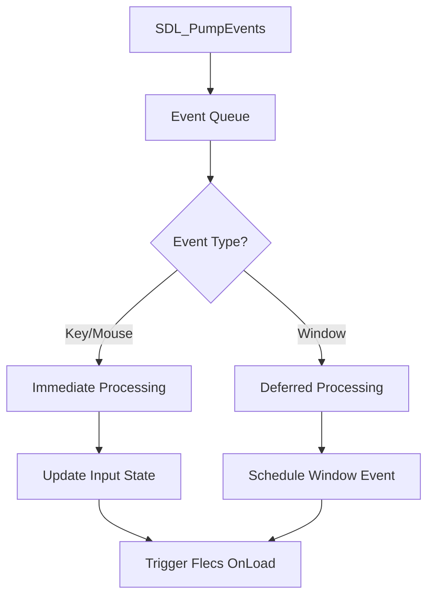
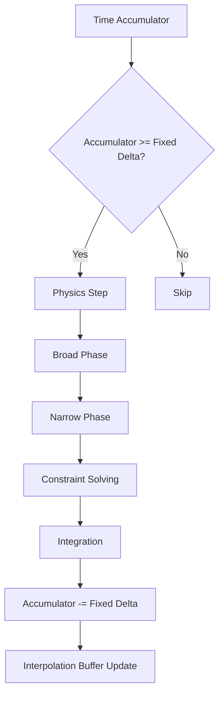
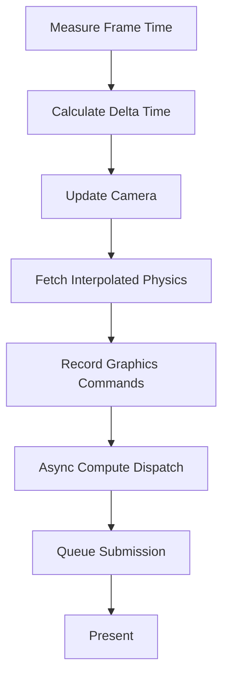
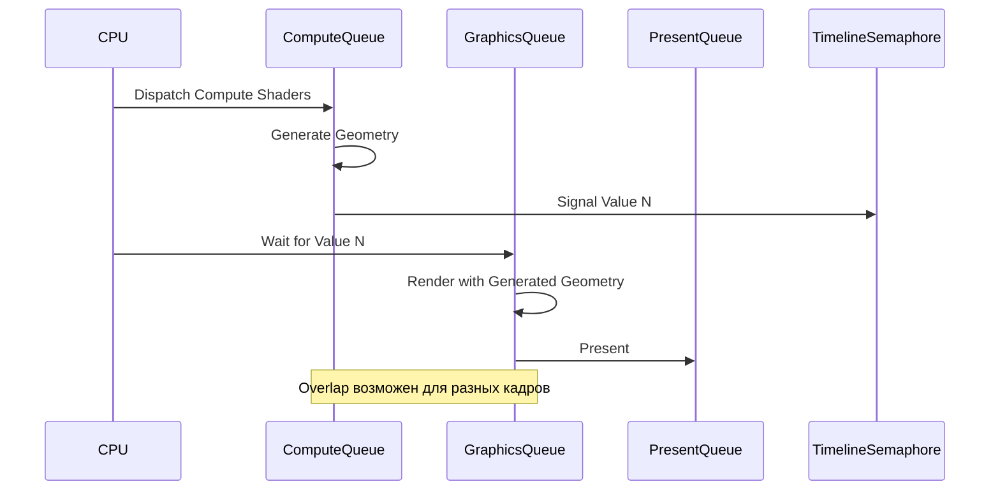
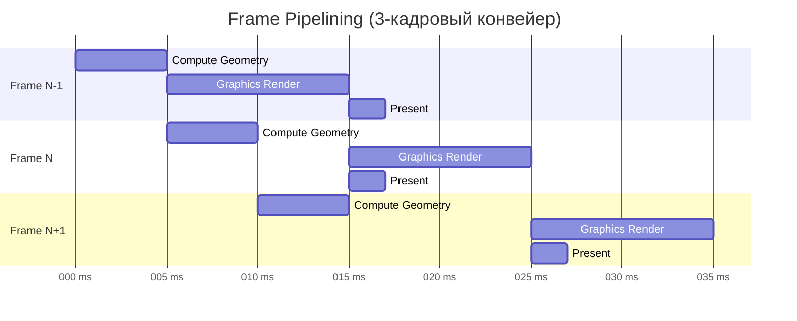
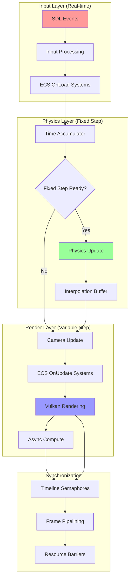
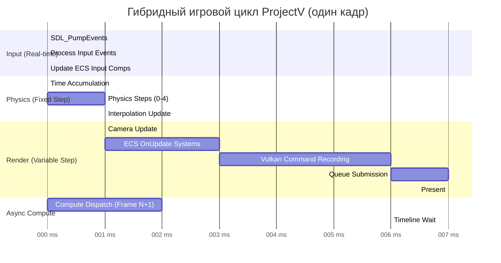

# Гибридный Игровой Цикл ProjectV

**🟡 Уровень 2: Средний** — Архитектурный документ ProjectV

## Введение

ProjectV использует **гибридный игровой цикл**, объединяющий три независимых подсистемы с разными требованиями к
времени:

1. **SDL Input** — обработка ввода в реальном времени (variable rate)
2. **Jolt Physics** — физические вычисления с фиксированным шагом (fixed step)
3. **Vulkan Render** — графический рендеринг с переменным шагом (variable step)

**Проблема традиционных подходов:** Физика, привязанная к частоте рендеринга, приводит к нестабильности симуляции (
особенно при низком FPS).

**Решение ProjectV:** Разделение временных доменов через аккумулятор времени и Timeline Semaphores.

---

## Архитектурные требования

### 1. Независимость подсистем

ProjectV использует **гибридный игровой цикл** на базе **std::execution (P2300)**, объединяющий три независимых
подсистемы:

- **Input**: Должен обрабатываться немедленно (latency-critical)
- **Physics**: Должен работать с фиксированным шагом (stability-critical)
- **Render**: Должен адаптироваться к доступному времени (throughput-critical)

### 2. Предсказуемость

- Физика не должна зависеть от FPS
- Рендеринг не должен блокировать ввод
- Подсистемы должны работать параллельно при возможности

### 3. Синхронизация

- Данные между подсистемами должны быть согласованы
- Минимизация копирования данных
- Избегание race conditions

---

## Компоненты цикла

### SDL Input Handler



**Особенности для ProjectV:**

- Использование `SDL_MAIN_USE_CALLBACKS` для интеграции с Vulkan
- Immediate-mode обработка критичных ко времени событий (ввод)
- Deferred-mode обработка некритичных событий (окно)

### Jolt Physics Engine (Fixed Step)



**Параметры для ProjectV:**

- **Fixed Delta**: 16.67ms (60Hz) для игровой физики
- **Max Accumulation**: 3-4 шага (предотвращение spiral of death)
- **Interpolation**: Линейная интерполяция для высокого FPS мониторов

### Vulkan Renderer (Variable Step)



**Оптимизации для вокселей:**

- GPU-driven rendering через indirect draws
- Compute shaders для генерации геометрии
- Timeline semaphores для async compute

---

## Детальная реализация

### Структура AppState

```cpp
struct AppState {
    // SDL & Window
    SDL_Window* window = nullptr;

    // Flecs ECS
    flecs::world* ecs = nullptr;

    // Jolt Physics
    JPH::PhysicsSystem* physics = nullptr;
    JPH::BodyInterface* bodyInterface = nullptr;

    // Vulkan
    VkInstance instance = VK_NULL_HANDLE;
    VkDevice device = VK_NULL_HANDLE;
    VkQueue graphicsQueue = VK_NULL_HANDLE;
    VkQueue computeQueue = VK_NULL_HANDLE;

    // Timing
    uint64_t frameCounter = 0;
    double lastTime = 0.0;
    double accumulator = 0.0;
    const double fixedDelta = 1.0 / 60.0;  // 60Hz

    // Synchronization
    VkSemaphore graphicsTimelineSemaphore = VK_NULL_HANDLE;
    VkSemaphore computeTimelineSemaphore = VK_NULL_HANDLE;
    uint64_t graphicsTimelineValue = 0;
    uint64_t computeTimelineValue = 0;

    // Interpolation
    std::unordered_map<JPH::BodyID, Transform> prevTransforms;
    std::unordered_map<JPH::BodyID, Transform> currTransforms;
    float interpolationAlpha = 0.0f;
};
```

### Алгоритм гибридного цикла

```cpp
// Псевдокод основного цикла
void hybridGameLoop(AppState& state) {
    while (!shouldQuit) {
        // 1. Input Processing (Real-time)
        processSDLInput(state);

        // 2. Time Management
        double currentTime = getHighResolutionTime();
        double frameTime = currentTime - state.lastTime;
        state.lastTime = currentTime;

        // Clamp frame time to prevent spiral of death
        frameTime = std::min(frameTime, 0.25);

        // 3. Physics Accumulation
        state.accumulator += frameTime;

        // 4. Fixed-step Physics Updates
        while (state.accumulator >= state.fixedDelta) {
            // Сохраняем предыдущие трансформы для интерполяции
            state.prevTransforms = state.currTransforms;

            // Обновляем физику
            updatePhysics(state, state.fixedDelta);

            // Сохраняем текущие трансформы
            state.currTransforms = getPhysicsTransforms(state);

            state.accumulator -= state.fixedDelta;
        }

        // 5. Calculate Interpolation Alpha
        state.interpolationAlpha = state.accumulator / state.fixedDelta;

        // 6. Variable-step Rendering
        updateCamera(state, frameTime);
        renderFrame(state, frameTime);

        // 7. Async Compute (параллельно с рендерингом следующего кадра)
        dispatchAsyncCompute(state);
    }
}
```

---

## Синхронизация через Timeline Semaphores

### Проблема

- Compute shaders (генерация геометрии) и Graphics (рендеринг) должны работать параллельно
- Compute должен завершиться до использования его результатов в Graphics
- Graphics не должен ждать Compute дольше необходимого

### Решение: Timeline Semaphores

```cpp
// Инициализация
VkSemaphoreTypeCreateInfo timelineCreateInfo = {
    .sType = VK_STRUCTURE_TYPE_SEMAPHORE_TYPE_CREATE_INFO,
    .semaphoreType = VK_SEMAPHORE_TYPE_TIMELINE,
    .initialValue = 0
};

VkSemaphoreCreateInfo semaphoreInfo = {
    .sType = VK_STRUCTURE_TYPE_SEMAPHORE_CREATE_INFO,
    .pNext = &timelineCreateInfo
};

vkCreateSemaphore(device, &semaphoreInfo, nullptr, &state.graphicsTimelineSemaphore);
vkCreateSemaphore(device, &semaphoreInfo, nullptr, &state.computeTimelineSemaphore);

// Compute Queue Submission
VkSubmitInfo computeSubmitInfo = {
    .sType = VK_STRUCTURE_TYPE_SUBMIT_INFO,
    .signalSemaphoreCount = 1,
    .pSignalSemaphores = &state.computeTimelineSemaphore
};

uint64_t computeSignalValue = ++state.computeTimelineValue;
VkTimelineSemaphoreSubmitInfo computeTimelineInfo = {
    .sType = VK_STRUCTURE_TYPE_TIMELINE_SEMAPHORE_SUBMIT_INFO,
    .signalSemaphoreValueCount = 1,
    .pSignalSemaphoreValues = &computeSignalValue
};

computeSubmitInfo.pNext = &computeTimelineInfo;
vkQueueSubmit(computeQueue, 1, &computeSubmitInfo, VK_NULL_HANDLE);

// Graphics Queue Submission (ждёт compute)
uint64_t waitValue = state.computeTimelineValue;
VkSemaphoreWaitInfo waitInfo = {
    .sType = VK_STRUCTURE_TYPE_SEMAPHORE_WAIT_INFO,
    .semaphoreCount = 1,
    .pSemaphores = &state.computeTimelineSemaphore,
    .pValues = &waitValue
};

vkWaitSemaphores(device, &waitInfo, UINT64_MAX);

VkSubmitInfo graphicsSubmitInfo = { ... };
vkQueueSubmit(graphicsQueue, 1, &graphicsSubmitInfo, VK_NULL_HANDLE);
```

### Диаграмма синхронизации



---

## Пример кода

### Полная реализация SDL_AppIterate

```cpp
SDL_AppResult SDL_AppIterate(void* appstate) {
    AppState* state = static_cast<AppState*>(appstate);

    // 1. Input Processing
    SDL_Event event;
    while (SDL_PollEvent(&event)) {
        // Обработка немедленных событий
        if (event.type == SDL_EVENT_KEY_DOWN || event.type == SDL_EVENT_MOUSE_MOTION) {
            // Обновляем компоненты ввода в ECS
            flecs::entity inputEntity = state->ecs->entity("input");
            inputEntity.set<InputState>({
                .keys = getKeyboardState(),
                .mousePos = {event.motion.x, event.motion.y},
                .mouseButtons = getMouseButtonState()
            });
        }

        // Обработка отложенных событий
        if (event.type == SDL_EVENT_WINDOW_RESIZED) {
            // Планируем пересоздание swapchain
            scheduleSwapchainRecreation(state);
        }
    }

    // 2. Time Management
    static double lastTime = SDL_GetPerformanceCounter() / (double)SDL_GetPerformanceFrequency();
    double currentTime = SDL_GetPerformanceCounter() / (double)SDL_GetPerformanceFrequency();
    double frameTime = currentTime - lastTime;
    lastTime = currentTime;

    // Clamp для стабильности
    if (frameTime > 0.25) frameTime = 0.25;

    // 3. Physics Accumulation
    state->accumulator += frameTime;
    const double fixedDelta = 1.0 / 60.0;

    // 4. Fixed-step Physics (максимум 4 шага для предотвращения spiral of death)
    int physicsSteps = 0;
    while (state->accumulator >= fixedDelta && physicsSteps < 4) {
        // Обновляем предыдущие трансформы для интерполяции
        updatePreviousTransforms(state);

        // Шаг физики
        state->physics->Update(fixedDelta,
                               state->bodyInterface->GetMaxConcurrentJobs(),
                               state->bodyInterface->GetTempAllocator());

        // Обновляем текущие трансформы
        updateCurrentTransforms(state);

        state->accumulator -= fixedDelta;
        physicsSteps++;

        // Обновляем ECS компоненты физики
        updatePhysicsComponents(state);
    }

    // 5. Interpolation Alpha
    state->interpolationAlpha = state->accumulator / fixedDelta;

    // 6. ECS Systems (Variable-step)
    // Flecs системы выполняются с переменным шагом
    state->ecs->progress(static_cast<float>(frameTime));

    // 7. Rendering (Variable-step)
    renderFrame(state, frameTime);

    // 8. Async Compute для следующего кадра
    if (state->computeQueue != VK_NULL_HANDLE) {
        dispatchVoxelGenerationCompute(state);
    }

    return SDL_APP_CONTINUE;
}
```

### Интерполяция физических трансформов

```cpp
Transform getInterpolatedTransform(const AppState& state, JPH::BodyID bodyId) {
    auto prevIt = state.prevTransforms.find(bodyId);
    auto currIt = state.currTransforms.find(bodyId);

    if (prevIt == state.prevTransforms.end() || currIt == state.currTransforms.end()) {
        return currIt != state.currTransforms.end() ? currIt->second : Transform{};
    }

    // Линейная интерполяция
    const Transform& prev = prevIt->second;
    const Transform& curr = currIt->second;
    float alpha = state.interpolationAlpha;

    return Transform{
        .position = glm::mix(prev.position, curr.position, alpha),
        .rotation = glm::slerp(prev.rotation, curr.rotation, alpha),
        .scale = glm::mix(prev.scale, curr.scale, alpha)
    };
}
```

---

## Производительность и оптимизации

### 1. Memory Locality для ECS

```cpp
// Плохо: разрозненные компоненты
struct GameObject {
    Transform transform;
    PhysicsBody physics;
    RenderMesh mesh;
};

// Хорошо: SoA (Structure of Arrays) через Flecs
world.component<Transform>();
world.component<PhysicsBody>();
world.component<RenderMesh>();

// Системы обрабатывают компоненты в непрерывных массивах
world.system<Transform, PhysicsBody>()
    .kind(flecs::OnUpdate)
    .each( {
        // Обработка в cache-friendly режиме
    });
```

### 2. Parallel Processing

- **SDL Input**: Основной поток (latency-critical)
- **Jolt Physics**: Worker threads (через JPH::JobSystem)
- **Vulkan Compute**: Async compute queue
- **Vulkan Graphics**: Graphics queue

### 3. Frame Pipelining



### 4. Performance Metrics

| Метрика           | Целевое значение           | Мониторинг         |
|-------------------|----------------------------|--------------------|
| Physics Step Time | < 8ms (для 60Hz)           | Tracy CPU Profiler |
| Render Time       | < 16ms (для 60Hz)          | Tracy GPU Profiler |
| Input Latency     | < 16ms                     | SDL Event Timing   |
| CPU Utilization   | < 80% (оставить для ОС)    | System Metrics     |
| Memory Usage      | < 4GB для воксельного мира | VMA Statistics     |

---

## Интеграция с экосистемой ProjectV

### Flecs ECS Integration

```cpp
// Компоненты для игрового цикла
struct TimeComponent {
    double deltaTime;
    double totalTime;
    float interpolationAlpha;
};

struct InputComponent {
    std::array<bool, 512> keys;
    glm::vec2 mousePosition;
    std::array<bool, 8> mouseButtons;
};

// Системы с разными фазами
world.system<InputComponent>("ProcessInput")
    .kind(flecs::OnLoad)  // Выполняется первым
    .each(processInput);

world.system<PhysicsBody, Transform>("FixedUpdate")
    .kind(flecs::OnStore)  // Выполняется с фиксированным шагом
    .iter([fixedDelta](flecs::iter& it) {
        // Только когда требуется фиксированный шаг
        if (shouldDoFixedStep(it.world())) {
            for (auto i : it) {
                auto& pb = it.get<PhysicsBody>(i);
                auto& t = it.get<Transform>(i);
                updatePhysics(pb, t, fixedDelta);
            }
        }
    });

world.system<Transform, RenderMesh>("RenderUpdate")
    .kind(flecs::OnUpdate)  // Выполняется каждый кадр
    .each(updateRender);
```

### Tracy Profiling Integration

```cpp
// В SDL_AppIterate
ZoneScopedN("GameLoop");

{
    ZoneScopedN("InputProcessing");
    processSDLInput(state);
}

{
    ZoneScopedN("PhysicsUpdate");
    // Фиксированные шаги физики
    for (int i = 0; i < physicsSteps; i++) {
        ZoneScopedN("PhysicsStep");
        state->physics->Update(fixedDelta, ...);
    }
}

{
    ZoneScopedN("ECSSystems");
    state->ecs->progress(static_cast<float>(frameTime));
}

{
    ZoneScopedN("Rendering");
    FrameMarkStart("RenderFrame");
    renderFrame(state, frameTime);
    FrameMarkEnd("RenderFrame");
}
```

### Vulkan Timeline Semaphores

```cpp
// Инициализация в SDL_AppInit
void initTimelineSemaphores(AppState* state) {
    VkSemaphoreTypeCreateInfo timelineInfo = {
        .sType = VK_STRUCTURE_TYPE_SEMAPHORE_TYPE_CREATE_INFO,
        .semaphoreType = VK_SEMAPHORE_TYPE_TIMELINE
    };

    VkSemaphoreCreateInfo semaphoreInfo = {
        .sType = VK_STRUCTURE_TYPE_SEMAPHORE_CREATE_INFO,
        .pNext = &timelineInfo
    };

    vkCreateSemaphore(state->device, &semaphoreInfo, nullptr,
                      &state->graphicsTimelineSemaphore);
    vkCreateSemaphore(state->device, &semaphoreInfo, nullptr,
                      &state->computeTimelineSemaphore);
}

// Использование в рендерере
void waitForComputeAndRender(AppState* state) {
    // Ждём завершения compute шейдеров
    VkSemaphoreWaitInfo waitInfo = {
        .sType = VK_STRUCTURE_TYPE_SEMAPHORE_WAIT_INFO,
        .semaphoreCount = 1,
        .pSemaphores = &state->computeTimelineSemaphore,
        .pValues = &state->computeTimelineValue
    };

    vkWaitSemaphores(state->device, &waitInfo, UINT64_MAX);

    // Рендеринг
    renderWithGeneratedGeometry(state);

    // Сигналим graphics очередь
    state->graphicsTimelineValue++;
    VkSemaphoreSignalInfo signalInfo = {
        .sType = VK_STRUCTURE_TYPE_SEMAPHORE_SIGNAL_INFO,
        .semaphore = state->graphicsTimelineSemaphore,
        .value = state->graphicsTimelineValue
    };

    vkSignalSemaphore(state->device, &signalInfo);
}
```

---

## Типичные проблемы и решения

### Проблема 1: Spiral of Death

**Симптомы:** При низком FPS физика пытается "нагнать" время, выполняя множество шагов, что ещё больше снижает FPS.

**Решение:**

```cpp
// Ограничение максимального количества шагов физики
const int MAX_PHYSICS_STEPS_PER_FRAME = 4;

while (accumulator >= fixedDelta && physicsSteps < MAX_PHYSICS_STEPS_PER_FRAME) {
    updatePhysics(fixedDelta);
    accumulator -= fixedDelta;
    physicsSteps++;
}

// Если накопилось слишком много времени - сброс
if (physicsSteps == MAX_PHYSICS_STEPS_PER_FRAME && accumulator > fixedDelta * 4) {
    accumulator = fixedDelta * 2;  // Сохраняем некоторую интерполяцию
    SDL_LogWarn(SDL_LOG_CATEGORY_APPLICATION,
                "Physics falling behind, resetting accumulator");
}
```

### Проблема 2: Input Lag при высокой нагрузке

**Симптомы:** Задержка между нажатием клавиши и реакцией игры.

**Решение:**

```cpp
// Выделение input processing в отдельную высокоприоритетную фазу
void processInputHighPriority(AppState* state) {
    // 1. Немедленная обработка
    SDL_PumpEvents();

    // 2. Обновление состояния ввода до physics/rendering
    updateInputComponents(state);

    // 3. Применение ввода к physics bodies
    applyInputToPhysics(state);
}

// В основном цикле - обрабатываем ввод ДО физики
processInputHighPriority(state);
updatePhysics(state);
renderFrame(state);
```

### Проблема 3: Tearing при variable refresh rate

**Симптомы:** Разрывы изображения при изменении частоты кадров.

**Решение:**

```cpp
// Использование VK_PRESENT_MODE_MAILBOX_KHR для минимальной задержки
// или VK_PRESENT_MODE_FIFO_RELAXED_KHR для VRR

VkPresentModeKHR choosePresentMode(const std::vector<VkPresentModeKHR>& modes) {
    // Предпочтения для ProjectV
    for (VkPresentModeKHR mode : modes) {
        if (mode == VK_PRESENT_MODE_MAILBOX_KHR) {
            return mode;  // Минимальная задержка
        }
    }

    for (VkPresentModeKHR mode : modes) {
        if (mode == VK_PRESENT_MODE_FIFO_RELAXED_KHR) {
            return mode;  // Поддержка VRR
        }
    }

    return VK_PRESENT_MODE_FIFO_KHR;  // Гарантированная работа
}
```

### Проблема 4: Stuttering при загрузке ресурсов

**Симптомы:** Проседание FPS при загрузке текстур/моделей.

**Решение:**

```cpp
// Async resource loading с приоритизацией
class ResourceLoader {
public:
    void loadAsync(const std::string& path, ResourcePriority priority) {
        // Добавляем в очередь с приоритетом
        loadingQueue_.emplace(priority, path);

        // Запускаем worker thread если не запущен
        if (!workerThread_.joinable()) {
            workerThread_ = std::thread(&ResourceLoader::workerThread, this);
        }
    }

    void processCompletedLoads() {
        // Обрабатываем только в начале кадра
        // Ограничиваем время обработки (например, 2ms)
        auto startTime = std::chrono::high_resolution_clock::now();

        while (!completedQueue_.empty()) {
            auto resource = completedQueue_.pop();
            uploadToGPU(resource);

            auto currentTime = std::chrono::high_resolution_clock::now();
            auto elapsed = std::chrono::duration_cast<std::chrono::milliseconds>(
                currentTime - startTime);

            if (elapsed.count() > 2) {
                break;  // Прерываем чтобы не вызывать stutter
            }
        }
    }
};
```

---

## Диаграммы

### Полная архитектура гибридного цикла



### Временная диаграмма кадра



---

## Критерии успешной реализации

### Обязательные

- [ ] Физика работает с фиксированным шагом 60Hz независимо от FPS
- [ ] Ввод обрабатывается с задержкой < 16ms
- [ ] Интерполяция трансформов работает плавно
- [ ] Timeline Semaphores обеспечивают правильную синхронизацию
- [ ] Spiral of death предотвращается (максимум 4 шага физики за кадр)

### Опциональные (рекомендуемые)

- [ ] Frame pipelining (3+ кадра в конвейере)
- [ ] Async compute для генерации геометрии
- [ ] Tracy profiling для всех компонентов цикла
- [ ] Поддержка VRR (Variable Refresh Rate)

---

## Архитектура

### Memory Layout

```
GameLoop (PIMPL)
┌─────────────────────────────────────────────────────────────┐
│  std::unique_ptr<Impl> (8 bytes)                            │
│  └── Impl:                                                  │
│      ├── scheduler_: std::execution::run_loop               │
│      ├── subsystems_: std::vector<SubsystemEntry>           │
│      ├── accumulator_: double (8 bytes)                     │
│      ├── frame_time_: FrameTime (40 bytes)                  │
│      ├── exit_code_: std::atomic<int32_t> (4 bytes)         │
│      ├── running_: std::atomic<bool> (1 byte + padding)     │
│      └── config_: GameLoopConfig (24 bytes)                 │
│  Total: 8 bytes (external) + ~256 bytes (internal)          │
└─────────────────────────────────────────────────────────────┘

FrameTime
┌─────────────────────────────────────────────────────────────┐
│  total_time: double (8 bytes)                               │
│  delta_time: double (8 bytes)                               │
│  interpolation_alpha: double (8 bytes)                      │
│  frame_number: uint64_t (8 bytes)                           │
│  physics_steps: uint32_t (4 bytes)                          │
│  padding: 4 bytes                                           │
│  Total: 40 bytes (aligned to 8)                             │
└─────────────────────────────────────────────────────────────┘

InputState
┌─────────────────────────────────────────────────────────────┐
│  keyboard: KeyboardState (512 bytes)                        │
│  keyboard_prev: KeyboardState (512 bytes)                   │
│  mouse: MouseState (40 bytes)                               │
│  mouse_prev: MouseState (40 bytes)                          │
│  Total: 1104 bytes (aligned to 16)                          │
└─────────────────────────────────────────────────────────────┘
```

### State Machine

```
GameLoop Lifecycle
       ┌────────────┐
       │  CREATED   │ ←── Constructor
       └─────┬──────┘
             │ initialize()
             ▼
       ┌────────────┐
       │ INITIALIZED│ ←── Subsystems registered
       └─────┬──────┘
             │ run()
             ▼
    ┌────────────────┐
    │    RUNNING     │ ←── Main loop active
    │  (loop state)  │
    └───────┬────────┘
            │ request_exit() or error
            ▼
    ┌────────────────┐
    │   SHUTDOWN     │ ←── Cleaning up
    └───────┬────────┘
            │
            ▼
    ┌────────────────┐
    │   TERMINATED   │ ←── Final state
    └────────────────┘

Physics Update State (within frame)
    ┌─────────────┐
    │  ACCUMULATE │ ←── accumulator += delta_time
    └──────┬──────┘
           │ accumulator >= fixed_delta
           ▼
    ┌─────────────┐
    │ STEP_PHYSICS│ ←── One physics step
    └──────┬──────┘
           │ steps < max_steps && accumulator >= fixed_delta
           │ (loop back to STEP_PHYSICS)
           │
           │ steps >= max_steps || accumulator < fixed_delta
           ▼
    ┌─────────────┐
    │ INTERPOLATE │ ←── alpha = accumulator / fixed_delta
    └─────────────┘
```

---

## API Contracts

### GameLoop Module

```cpp
// ProjectV.Core.GameLoop.cppm
export module ProjectV.Core.GameLoop;

import std;
import std.execution;

export namespace projectv::core {

/// Конфигурация игрового цикла.
export struct GameLoopConfig {
    double fixed_delta_time{1.0 / 60.0};   ///< Фиксированный шаг физики (60Hz)
    double max_frame_time{0.25};           ///< Максимальное время кадра
    uint32_t max_physics_steps_per_frame{4}; ///< Максимум шагов физики за кадр
    bool enable_interpolation{true};       ///< Интерполяция трансформов
};

/// Временные данные кадра.
///
/// ## Invariants
/// - delta_time <= max_frame_time
/// - interpolation_alpha ∈ [0.0, 1.0)
/// - frame_number монотонно возрастает
export struct FrameTime {
    double total_time{0.0};
    double delta_time{0.0};
    double interpolation_alpha{0.0};
    uint64_t frame_number{0};
    uint32_t physics_steps{0};
};

/// Результат выполнения кадра.
export enum class FrameResult : uint8_t {
    Continue,
    Exit,
    Error
};

/// Концепт для подсистемы.
///
/// ## Requirements
/// - must have `auto init() -> std::expected<void, SubsystemError>`
/// - must have `auto shutdown() -> void`
/// - must have `auto update(FrameTime const&) -> std::execution::sender<FrameResult>`
export template<typename T>
concept GameLoopSubsystem = requires(T t, FrameTime const& ft) {
    { t.init() } -> std::same_as<std::expected<void, SubsystemError>>;
    { t.shutdown() } -> std::same_as<void>;
    { t.update(ft) } -> std::execution::sender<FrameResult>;
};

/// Главный игровой цикл на std::execution.
///
/// ## Thread Safety
/// - run() должен вызываться из одного потока
/// - request_exit() thread-safe
///
/// ## Invariants
/// - accumulator_ всегда < fixed_delta_time * max_physics_steps_per_frame
/// - exit_code_ валиден только после run() вернул управление
export class GameLoop {
public:
    /// Создаёт игровой цикл.
    ///
    /// @pre config.fixed_delta_time > 0
    /// @pre config.max_frame_time > config.fixed_delta_time
    explicit GameLoop(GameLoopConfig const& config = {}) noexcept;

    ~GameLoop() noexcept;

    GameLoop(GameLoop&&) noexcept;
    GameLoop& operator=(GameLoop&&) noexcept;
    GameLoop(const GameLoop&) = delete;
    GameLoop& operator=(const GameLoop&) = delete;

    /// Регистрирует подсистему.
    ///
    /// @tparam S тип, удовлетворяющий GameLoopSubsystem
    /// @param priority Порядок выполнения (меньше = раньше)
    ///
    /// @pre Должен быть вызван до initialize()
    template<GameLoopSubsystem S>
    auto register_subsystem(uint32_t priority = 100) noexcept -> void;

    /// Инициализирует все подсистемы.
    ///
    /// @return void или ошибку
    [[nodiscard]] auto initialize() noexcept
        -> std::expected<void, GameLoopError>;

    /// Запускает главный цикл.
    ///
    /// @pre initialize() был успешно вызван
    /// @post Все подсистемы shutdown при выходе
    /// @return Код возврата (0 = успех)
    [[nodiscard]] auto run() noexcept -> int;

    /// Запрашивает остановку цикла.
    ///
    /// @param exit_code Код возврата
    ///
    /// @post is_exit_requested() == true
    auto request_exit(int exit_code = 0) noexcept -> void;

    /// @return true если запрошен выход
    [[nodiscard]] auto is_exit_requested() const noexcept -> bool;

    /// @return Текущие временные данные
    [[nodiscard]] auto frame_time() const noexcept -> FrameTime const&;

private:
    struct Impl;
    std::unique_ptr<Impl> impl_;

    /// Main loop sender (P2300).
    [[nodiscard]] auto main_loop() noexcept -> std::execution::sender auto;

    /// Fixed step update sender.
    [[nodiscard]] auto fixed_step_update() noexcept -> std::execution::sender auto;

    /// Variable step update sender.
    [[nodiscard]] auto variable_step_update() noexcept
        -> std::execution::sender<FrameResult>;
};

/// Коды ошибок GameLoop.
export enum class GameLoopError : uint8_t {
    AlreadyRunning,
    NotInitialized,
    SubsystemInitFailed,
    InvalidConfig
};

} // namespace projectv::core
```

---

### Input Subsystem

```cpp
// ProjectV.Input.System.cppm
export module ProjectV.Input.System;

import std;
import std.execution;
import glm;
import ProjectV.Core.GameLoop;

export namespace projectv::input {

/// Код клавиши (SDL scancode compatible).
export enum class KeyCode : uint16_t {
    Unknown = 0,
    A = 4, B = 5, C = 6, D = 7, E = 8, F = 9, G = 10, H = 11,
    I = 12, J = 13, K = 14, L = 15, M = 16, N = 17, O = 18, P = 19,
    Q = 20, R = 21, S = 22, T = 23, U = 24, V = 25, W = 26, X = 27,
    Y = 28, Z = 29,
    // ... остальные коды
};

/// Код кнопки мыши.
export enum class MouseButton : uint8_t {
    None = 0,
    Left = 1,
    Middle = 2,
    Right = 3
};

/// Состояние клавиатуры.
///
/// ## Memory Layout
/// - 512 bytes (512 keys × 1 byte each)
/// - Cache-line sized for efficient copying
export struct KeyboardState {
    std::array<bool, 512> keys{false};

    /// Проверяет, нажата ли клавиша.
    ///
    /// @pre key < keys.size()
    [[nodiscard]] auto is_pressed(KeyCode key) const noexcept -> bool;

    /// Проверяет, была ли клавиша только что нажата.
    [[nodiscard]] auto just_pressed(KeyCode key, KeyboardState const& prev) const noexcept
        -> bool;

    /// Проверяет, была ли клавиша только что отпущена.
    [[nodiscard]] auto just_released(KeyCode key, KeyboardState const& prev) const noexcept
        -> bool;
};

/// Состояние мыши.
export struct alignas(16) MouseState {
    glm::vec2 position{0.0f};
    glm::vec2 delta{0.0f};
    glm::vec2 scroll{0.0f};
    std::array<bool, 8> buttons{false};

    [[nodiscard]] auto is_pressed(MouseButton button) const noexcept -> bool;
    [[nodiscard]] auto just_pressed(MouseButton button, MouseState const& prev) const noexcept
        -> bool;
};

/// Input event.
export struct InputEvent {
    enum class Type : uint8_t {
        KeyPress,
        KeyRelease,
        MouseMove,
        MousePress,
        MouseRelease,
        MouseScroll
    };

    Type type;
    uint64_t timestamp_ns;

    union {
        KeyCode key;
        MouseButton mouse_button;
        glm::vec2 motion;
        glm::vec2 scroll;
    } data;
};

/// Полное состояние ввода.
///
/// ## Invariants
/// - keyboard_prev содержит состояние предыдущего кадра
/// - mouse_prev содержит состояние предыдущего кадра
export struct InputState {
    KeyboardState keyboard;
    KeyboardState keyboard_prev;
    MouseState mouse;
    MouseState mouse_prev;

    /// Копирует текущее состояние в prev.
    ///
    /// @post keyboard_prev == keyboard (до вызова)
    /// @post mouse_prev == mouse (до вызова)
    auto advance() noexcept -> void;
};

/// Input subsystem.
///
/// ## Performance
/// - Event processing: O(n) где n = количество событий
/// - State queries: O(1)
///
/// ## Thread Safety
/// - update() вызывается из main thread
/// - state() thread-safe для чтения после update()
export class InputSubsystem {
public:
    InputSubsystem() noexcept;
    ~InputSubsystem() noexcept;

    /// Инициализация.
    ///
    /// @pre SDL инициализирован
    /// @post state() валиден
    [[nodiscard]] auto init() noexcept
        -> std::expected<void, InputError>;

    /// Завершение работы.
    auto shutdown() noexcept -> void;

    /// Обновление состояния.
    ///
    /// @param ft Временные данные кадра
    /// @pre init() был успешно вызван
    /// @post state() отражает текущий ввод
    /// @post events() содержит события этого кадра
    [[nodiscard]] auto update(core::FrameTime const& ft) noexcept
        -> std::execution::sender<core::FrameResult>;

    /// Получает текущее состояние.
    [[nodiscard]] auto state() const noexcept -> InputState const&;

    /// Получает события текущего кадра.
    [[nodiscard]] auto events() const noexcept -> std::span<InputEvent const>;

    /// Устанавливает захват мыши.
    auto set_mouse_captured(bool captured) noexcept -> void;

    /// Устанавливает чувствительность.
    auto set_mouse_sensitivity(float sensitivity) noexcept -> void;

private:
    struct Impl;
    std::unique_ptr<Impl> impl_;
};

/// Коды ошибок ввода.
export enum class InputError : uint8_t {
    SDLNotInitialized,
    EventQueueOverflow
};

} // namespace projectv::input
```

---

### Physics Subsystem

```cpp
// ProjectV.Physics.Gameplay.cppm
export module ProjectV.Physics.Gameplay;

import std;
import std.execution;
import glm;
import ProjectV.Core.GameLoop;
import ProjectV.Physics.Jolt;

export namespace projectv::physics {

/// Интерполированный transform.
///
/// ## Interpolation Formula
/// position = lerp(prev_position, curr_position, alpha)
/// rotation = slerp(prev_rotation, curr_rotation, alpha)
export struct InterpolatedTransform {
    glm::vec3 prev_position{0.0f};
    glm::quat prev_rotation{1.0f, 0.0f, 0.0f, 0.0f};
    glm::vec3 curr_position{0.0f};
    glm::quat curr_rotation{1.0f, 0.0f, 0.0f, 0.0f};

    /// Вычисляет интерполированный transform.
    ///
    /// @param alpha Фактор интерполяции ∈ [0.0, 1.0]
    /// @return Пара (position, rotation)
    [[nodiscard]] auto interpolate(float alpha) const noexcept
        -> std::pair<glm::vec3, glm::quat>;
};

/// Конфигурация физики.
export struct PhysicsConfig {
    uint32_t max_bodies{65536};
    uint32_t max_body_pairs{65536};
    uint32_t max_contact_constraints{10240};
    glm::vec3 gravity{0.0f, -15.0f, 0.0f};
    uint32_t collision_steps{1};
    uint32_t integration_substeps{1};
};

/// Physics subsystem.
///
/// ## Fixed Step Guarantee
/// - step() всегда вызывается с одинаковым delta_time
/// - Количество шагов ограничено max_physics_steps_per_frame
///
/// ## Thread Safety
/// - update() использует JobSystem для параллельных вычислений
/// - Interpolation buffers lock-free для чтения
export class PhysicsSubsystem {
public:
    explicit PhysicsSubsystem(PhysicsConfig const& config = {}) noexcept;
    ~PhysicsSubsystem() noexcept;

    /// Инициализация.
    [[nodiscard]] auto init() noexcept
        -> std::expected<void, PhysicsError>;

    /// Завершение работы.
    auto shutdown() noexcept -> void;

    /// Шаг физики (fixed delta).
    ///
    /// @param ft FrameTime с delta_time = fixed_delta_time
    /// @pre init() успешно вызван
    /// @post Физическое состояние обновлено
    /// @post Interpolation buffers обновлены
    [[nodiscard]] auto update(core::FrameTime const& ft) noexcept
        -> std::execution::sender<core::FrameResult>;

    /// Получает интерполированный transform.
    ///
    /// @param body_id ID тела
    /// @param alpha Фактор интерполяции
    /// @return Пара (position, rotation) или ошибка
    [[nodiscard]] auto get_interpolated_transform(
        BodyID body_id,
        float alpha
    ) const noexcept -> std::expected<std::pair<glm::vec3, glm::quat>, PhysicsError>;

    /// Получает PhysicsSystem.
    [[nodiscard]] auto physics_system() noexcept -> PhysicsSystem&;

    /// Регистрирует тело для интерполяции.
    auto register_for_interpolation(BodyID body_id) noexcept -> void;

    /// Удаляет тело из интерполяции.
    auto unregister_from_interpolation(BodyID body_id) noexcept -> void;

private:
    auto update_interpolation_buffers() noexcept -> void;

    struct Impl;
    std::unique_ptr<Impl> impl_;
};

} // namespace projectv::physics
```

---

### Render Subsystem

```cpp
// ProjectV.Render.Gameplay.cppm
export module ProjectV.Render.Gameplay;

import std;
import std.execution;
import glm;
import ProjectV.Core.GameLoop;
import ProjectV.Render.Vulkan;

export namespace projectv::render {

/// Статистика рендеринга.
export struct RenderStats {
    uint32_t draw_calls{0};
    uint32_t triangles{0};
    uint32_t vertices{0};
    float gpu_time_ms{0.0f};
    float cpu_time_ms{0.0f};
    uint64_t vram_used{0};
    uint64_t vram_budget{0};
};

/// Render subsystem.
///
/// ## Vulkan 1.4 Requirements
/// - Dynamic Rendering (no VkRenderPass)
/// - Synchronization2
/// - Timeline Semaphores
///
/// ## Thread Safety
/// - update() вызывает begin_frame/end_frame из одного потока
/// - Resource creation thread-safe через external synchronization
export class RenderSubsystem {
public:
    explicit RenderSubsystem(RendererConfig const& config = {}) noexcept;
    ~RenderSubsystem() noexcept;

    /// Инициализация.
    ///
    /// @param native_window_handle HWND или equivalent
    /// @pre Vulkan 1.4 support available
    [[nodiscard]] auto init(void* native_window_handle) noexcept
        -> std::expected<void, RenderError>;

    /// Завершение работы.
    auto shutdown() noexcept -> void;

    /// Рендеринг кадра.
    ///
    /// @param ft Временные данные кадра
    /// @pre init() успешно вызван
    /// @post Кадр представлен на экран
    [[nodiscard]] auto update(core::FrameTime const& ft) noexcept
        -> std::execution::sender<core::FrameResult>;

    /// Получает рендерер.
    [[nodiscard]] auto renderer() noexcept -> VulkanRenderer&;

    /// Получает статистику.
    [[nodiscard]] auto stats() const noexcept -> RenderStats const&;

    /// Обрабатывает resize.
    auto on_resize(uint32_t width, uint32_t height) noexcept -> void;

    /// Устанавливает VSync.
    auto set_vsync(bool enabled) noexcept -> void;

private:
    struct Impl;
    std::unique_ptr<Impl> impl_;
};

/// Коды ошибок рендеринга.
export enum class RenderError : uint8_t {
    VulkanInitFailed,
    SwapchainCreationFailed,
    OutOfMemory,
    DeviceLost
};

} // namespace projectv::render
```

---

## Timeline Semaphores

### Memory Layout

```
TimelineSemaphore
┌─────────────────────────────────────────────────────────────┐
│  device_: VkDevice (8 bytes)                                │
│  semaphore_: VkSemaphore (8 bytes)                          │
│  current_value_: std::atomic<uint64_t> (8 bytes)            │
│  Total: 24 bytes                                            │
└─────────────────────────────────────────────────────────────┘

ComputeGraphicsSync
┌─────────────────────────────────────────────────────────────┐
│  semaphore_: TimelineSemaphore (24 bytes)                   │
│  frame_value_: uint64_t (8 bytes)                           │
│  Total: 32 bytes                                            │
└─────────────────────────────────────────────────────────────┘
```

### API Contracts

```cpp
// ProjectV.Render.Synchronization.cppm
export module ProjectV.Render.Synchronization;

import std;
import ProjectV.Render.Vulkan;

export namespace projectv::render {

/// Timeline semaphore (Vulkan 1.4).
///
/// ## Invariants
/// - current_value_ monotonically increases
/// - signal(value) requires value > current_value_
export class TimelineSemaphore {
public:
    /// Создаёт timeline semaphore.
    ///
    /// @param device Vulkan device
    /// @param initial_value Начальное значение
    ///
    /// @pre device != VK_NULL_HANDLE
    /// @post value() == initial_value
    [[nodiscard]] static auto create(
        VkDevice device,
        uint64_t initial_value = 0
    ) noexcept -> std::expected<TimelineSemaphore, VulkanError>;

    ~TimelineSemaphore() noexcept;

    TimelineSemaphore(TimelineSemaphore&&) noexcept;
    TimelineSemaphore& operator=(TimelineSemaphore&&) noexcept;
    TimelineSemaphore(const TimelineSemaphore&) = delete;
    TimelineSemaphore& operator=(const TimelineSemaphore&) = delete;

    /// Сигнализирует semaphore.
    ///
    /// @param value Новое значение
    /// @pre value > current value
    /// @post value() == value
    auto signal(uint64_t value) noexcept -> void;

    /// Ожидает достижения значения.
    ///
    /// @param value Значение для ожидания
    /// @param timeout_ns Таймаут (UINT64_MAX = бесконечно)
    /// @return true если значение достигнуто
    [[nodiscard]] auto wait(
        uint64_t value,
        uint64_t timeout_ns = UINT64_MAX
    ) const noexcept -> bool;

    /// Получает текущее значение.
    [[nodiscard]] auto value() const noexcept -> uint64_t;

    /// Получает native handle.
    [[nodiscard]] auto native() const noexcept -> VkSemaphore;

private:
    TimelineSemaphore() noexcept = default;
    VkDevice device_{VK_NULL_HANDLE};
    VkSemaphore semaphore_{VK_NULL_HANDLE};
    std::atomic<uint64_t> current_value_{0};
};

/// Синхронизация Compute ↔ Graphics.
///
/// ## Usage Pattern
/// 1. Compute signals value = frame_index
/// 2. Graphics waits for value = frame_index
/// 3. Advance to next frame
export class ComputeGraphicsSync {
public:
    /// Создаёт объект синхронизации.
    [[nodiscard]] static auto create(VkDevice device) noexcept
        -> std::expected<ComputeGraphicsSync, VulkanError>;

    ~ComputeGraphicsSync() noexcept;

    ComputeGraphicsSync(ComputeGraphicsSync&&) noexcept;
    ComputeGraphicsSync& operator=(ComputeGraphicsSync&&) noexcept;
    ComputeGraphicsSync(const ComputeGraphicsSync&) = delete;
    ComputeGraphicsSync& operator=(const ComputeGraphicsSync&) = delete;

    /// Подготавливает wait для graphics queue.
    ///
    /// @return VkSemaphoreSubmitInfo для VkSubmitInfo2
    [[nodiscard]] auto prepare_graphics_wait() noexcept -> VkSemaphoreSubmitInfo;

    /// Подготавливает signal после compute.
    ///
    /// @return VkSemaphoreSubmitInfo для VkSubmitInfo2
    [[nodiscard]] auto prepare_compute_signal() noexcept -> VkSemaphoreSubmitInfo;

    /// Увеличивает значение для следующего кадра.
    ///
    /// @post current_value() == old current_value() + 1
    auto advance_frame() noexcept -> void;

    /// @return Текущее значение
    [[nodiscard]] auto current_value() const noexcept -> uint64_t;

private:
    ComputeGraphicsSync() noexcept = default;
    TimelineSemaphore semaphore_;
    uint64_t frame_value_{0};
};

} // namespace projectv::render
```

---

## Диаграммы

### Timing Diagram

```
┌──────────────────────────────────────────────────────────────────────────┐
│ Frame N                                                                   │
├──────────────────────────────────────────────────────────────────────────┤
│ Input (std::execution sender chain)                                       │
│ ├── sdl_pump_events() → sender                                            │
│ ├── process_events() → sender                                             │
│ └── update_state() → sender<FrameResult>                                  │
├──────────────────────────────────────────────────────────────────────────┤
│ Physics (Fixed Step, parallel_for)                                        │
│ ├── accumulator += delta_time                                             │
│ ├── while (accumulator >= fixed_delta && steps < max):                    │
│ │   ├── update_previous_transforms() // parallel_for                      │
│ │   ├── physics_step() // JobSystem                                       │
│ │   ├── update_current_transforms() // parallel_for                       │
│ │   └── accumulator -= fixed_delta                                        │
│ └── alpha = accumulator / fixed_delta                                     │
├──────────────────────────────────────────────────────────────────────────┤
│ Render (Variable Step)                                                    │
│ ├── begin_frame()                                                         │
│ ├── record_commands() // sender chain                                     │
│ ├── submit() // Timeline Semaphore                                        │
│ └── end_frame()                                                           │
├──────────────────────────────────────────────────────────────────────────┤
│ Async Compute (Parallel, Timeline Semaphore)                              │
│ ├── wait(frame_n - 1)                                                     │
│ ├── dispatch_voxel_generation()                                           │
│ └── signal(frame_n)                                                       │
└──────────────────────────────────────────────────────────────────────────┘
```

---

## Метрики

| Метрика         | Цель   | Мониторинг |
|-----------------|--------|------------|
| Physics Step    | < 8ms  | Tracy CPU  |
| Render Time     | < 16ms | Tracy GPU  |
| Input Latency   | < 16ms | SDL Events |
| CPU Utilization | < 80%  | System     |
| Memory          | < 4GB  | VMA Stats  |

---

## std::execution Integration

### P2300 Sender/Receiver Pattern

```cpp
// ProjectV.Core.Execution.cppm
export module ProjectV.Core.Execution;

import std;
import std.execution;

export namespace projectv::core::exec {

/// Type-erased sender for game loop operations.
template<typename Result>
using AnySender = std::execution::any_sender_of<Result>;

/// Scheduler wrapper for main thread.
export class MainThreadScheduler {
public:
    explicit MainThreadScheduler(std::execution::run_loop& loop) noexcept;

    /// Получает scheduler.
    [[nodiscard]] auto schedule() const noexcept
        -> std::execution::schedule_result_t<std::execution::run_loop_scheduler>;

private:
    std::execution::run_loop_scheduler scheduler_;
};

/// Scheduler wrapper for thread pool.
export class ThreadPoolScheduler {
public:
    explicit ThreadPoolScheduler(JobSystem& jobs) noexcept;

    /// Планирует выполнение на thread pool.
    [[nodiscard]] auto schedule() const noexcept;

    /// Параллельное выполнение for-loop.
    template<typename Range, typename Func>
    [[nodiscard]] auto parallel_for(Range&& range, Func&& func) const noexcept;

private:
    JobSystem* jobs_;
};

} // namespace projectv::core::exec
```

### Sender Chains

```cpp
// === Input Update Sender Chain ===

auto InputSubsystem::update(core::FrameTime const& ft) noexcept
    -> std::execution::sender<core::FrameResult> {

    return std::execution::schedule(main_thread_scheduler_)
        | std::execution::let_value([this, ft]() {
            // Pump SDL events
            SDL_PumpEvents();

            // Process event queue
            return process_sdl_events()
                | std::execution::then([this]() {
                    // Update state from events
                    update_keyboard_state();
                    update_mouse_state();
                    return core::FrameResult::Continue;
                });
        });
}

// === Physics Update Sender Chain ===

auto PhysicsSubsystem::update(core::FrameTime const& ft) noexcept
    -> std::execution::sender<core::FrameResult> {

    return std::execution::schedule(thread_pool_scheduler_)
        | std::execution::let_value([this, ft]() {
            // Store previous transforms for interpolation
            return store_previous_transforms()
                | std::execution::then([this, ft]() {
                    // Step physics
                    physics_system_->Update(
                        static_cast<float>(ft.delta_time),
                        collision_steps_,
                        integration_substeps_
                    );
                    return core::FrameResult::Continue;
                })
                | std::execution::then([this]() {
                    // Update current transforms
                    update_current_transforms();
                });
        });
}

// === Render Update Sender Chain ===

auto RenderSubsystem::update(core::FrameTime const& ft) noexcept
    -> std::execution::sender<core::FrameResult> {

    return std::execution::schedule(main_thread_scheduler_)
        | std::execution::let_value([this, ft]() {
            // Begin frame
            return begin_frame_sender()
                | std::execution::let_value([this, ft]() {
                    // Record commands
                    return record_commands_sender(ft)
                        | std::execution::let_value([this]() {
                            // Submit and present
                            return submit_and_present_sender();
                        });
                });
        })
        | std::execution::then([]() {
            return core::FrameResult::Continue;
        });
}
```

### Parallel_for Implementation

```cpp
// ProjectV.Core.Execution.Parallel.cppm
export module ProjectV.Core.Execution.Parallel;

import std;
import std.execution;
import ProjectV.Core.Jobs;

export namespace projectv::core::exec {

/// parallel_for sender.
///
/// ## Usage
/// ```cpp
/// co_await parallel_for(scheduler, items, [](Item& item) {
///     process(item);
/// });
/// ```
template<typename Scheduler, typename Range, typename Func>
[[nodiscard]] auto parallel_for(
    Scheduler&& sched,
    Range&& range,
    Func&& func
) noexcept -> std::execution::sender auto {

    using std::begin, std::end, std::size;

    auto first = begin(range);
    auto last = end(range);
    auto count = size(range);

    if (count == 0) {
        return std::execution::just();
    }

    // Determine chunk size based on thread count
    const size_t hardware_threads = std::thread::hardware_concurrency();
    const size_t chunk_size = std::max(1ull, count / (hardware_threads * 4));

    return std::execution::transfer_just(std::forward<Scheduler>(sched))
        | std::execution::let_value([first, last, count, chunk_size,
                                     func = std::forward<Func>(func)]() {

            std::vector<std::execution::sender auto> senders;
            senders.reserve((count + chunk_size - 1) / chunk_size);

            for (auto it = first; it != last; ) {
                auto chunk_end = it;
                auto remaining = std::distance(it, last);
                auto advance = std::min(static_cast<size_t>(remaining), chunk_size);
                std::advance(chunk_end, advance);

                senders.push_back(
                    std::execution::schedule(thread_pool_scheduler())
                    | std::execution::then([it, chunk_end, &func]() {
                        for (auto i = it; i != chunk_end; ++i) {
                            func(*i);
                        }
                    })
                );

                it = chunk_end;
            }

            return std::execution::when_all(std::move(senders));
        });
}

/// parallel_transform sender.
///
/// ## Usage
/// ```cpp
/// auto results = co_await parallel_transform(scheduler, inputs,
///     [](Input const& in) { return process(in); });
/// ```
template<typename Scheduler, typename Range, typename Func>
[[nodiscard]] auto parallel_transform(
    Scheduler&& sched,
    Range&& range,
    Func&& func
) noexcept -> std::execution::sender auto {

    using std::begin, std::end, std::size;
    using Result = std::invoke_result_t<Func, decltype(*begin(range))>;

    auto count = size(range);

    if (count == 0) {
        return std::execution::just(std::vector<Result>{});
    }

    return std::execution::transfer_just(std::forward<Scheduler>(sched))
        | std::execution::let_value([&range, count, func = std::forward<Func>(func)]() {

            std::vector<Result> results(count);
            auto first = begin(range);

            return parallel_for(
                thread_pool_scheduler(),
                std::views::iota(0u, count),
                [&results, first, &func](size_t index) {
                    results[index] = func(*(first + index));
                }
            ) | std::execution::then([results = std::move(results)]() mutable {
                return std::move(results);
            });
        });
}

} // namespace projectv::core::exec
```

---

## Job System Bridge

### JobSystem Integration with std::execution

```cpp
// ProjectV.Core.Jobs.Bridge.cppm
export module ProjectV.Core.Jobs.Bridge;

import std;
import std.execution;
import ProjectV.Core.Jobs;

export namespace projectv::core {

/// JobSystem → std::execution bridge.
///
/// ## Purpose
/// Позволяет использовать JobSystem как scheduler для P2300 senders.
export class JobSystemScheduler {
public:
    explicit JobSystemScheduler(JobSystem& jobs) noexcept
        : jobs_(&jobs) {}

    /// Получает scheduler.
    [[nodiscard]] auto get_scheduler() const noexcept
        -> JobSystemSchedulerAdapter {
        return JobSystemSchedulerAdapter{*jobs_};
    }

private:
    JobSystem* jobs_;
};

/// Adapter для std::execution scheduler concept.
export class JobSystemSchedulerAdapter {
public:
    explicit JobSystemSchedulerAdapter(JobSystem& jobs) noexcept
        : jobs_(&jobs) {}

    /// Schedule operation.
    struct ScheduleOperation {
        JobSystem* jobs;

        auto start() noexcept -> void {
            jobs->submit([this]() {
                // Complete the operation
                continuation_.resume();
            });
        }

        std::coroutine_handle<> continuation_;
    };

    /// Sender type.
    struct Sender {
        JobSystem* jobs;

        using value_types = std::tuple<>;
        using error_types = std::tuple<std::exception_ptr>;
        using sender_concept = std::execution::sender_t;

        template<typename Receiver>
        struct Operation {
            JobSystem* jobs;
            Receiver receiver;

            auto start() noexcept -> void {
                jobs->submit([this]() {
                    std::execution::set_value(std::move(receiver));
                });
            }
        };

        template<typename Receiver>
        auto connect(Receiver r) const noexcept -> Operation<Receiver> {
            return {jobs, std::move(r)};
        }
    };

    /// Creates sender.
    [[nodiscard]] auto schedule() const noexcept -> Sender {
        return {jobs_};
    }

private:
    JobSystem* jobs_;
};

} // namespace projectv::core
```

---

## Main Loop Implementation

### GameLoop::run() with std::execution

```cpp
// ProjectV.Core.GameLoop.cpp
module ProjectV.Core.GameLoop;

import std;
import std.execution;
import ProjectV.Core.Execution;

namespace projectv::core {

auto GameLoop::main_loop() noexcept -> std::execution::sender auto {
    using std::execution::let_value, std::execution::then, std::execution::just;

    return std::execution::repeat_effect_until(
        // Frame sender
        let_value([this]() {
            return frame_sender();
        }),
        // Stop condition
        [this]() { return is_exit_requested(); }
    );
}

auto GameLoop::frame_sender() noexcept -> std::execution::sender auto {
    return std::execution::schedule(main_thread_scheduler_)
        | std::execution::then([this]() {
            // Update frame time
            update_frame_time();
        })
        | std::execution::let_value([this]() {
            // Input phase (latency-critical)
            return input_phase_sender();
        })
        | std::execution::let_value([this]() {
            // Physics phase (fixed step)
            return physics_phase_sender();
        })
        | std::execution::let_value([this]() {
            // Render phase (variable step)
            return render_phase_sender();
        })
        | std::execution::then([this]() {
            // Advance frame counter
            ++impl_->frame_time_.frame_number;
            return FrameResult::Continue;
        });
}

auto GameLoop::input_phase_sender() noexcept -> std::execution::sender auto {
    std::vector<std::execution::sender auto> input_senders;

    for (auto& subsystem : input_subsystems_) {
        input_senders.push_back(subsystem.update(impl_->frame_time_));
    }

    return std::execution::when_all(std::move(input_senders))
        | std::execution::then([](auto... results) {
            // Check for exit requests
            if (((results == FrameResult::Exit) || ...)) {
                return FrameResult::Exit;
            }
            return FrameResult::Continue;
        });
}

auto GameLoop::physics_phase_sender() noexcept -> std::execution::sender auto {
    return std::execution::just()
        | std::execution::then([this]() {
            // Accumulate time
            impl_->accumulator_ += impl_->frame_time_.delta_time;

            // Clamp accumulator
            if (impl_->accumulator_ > impl_->config_.max_frame_time) {
                impl_->accumulator_ = impl_->config_.max_frame_time;
            }
        })
        | std::execution::let_value([this]() {
            // Fixed step loop
            return fixed_step_loop_sender();
        });
}

auto GameLoop::fixed_step_loop_sender() noexcept -> std::execution::sender auto {
    return std::execution::repeat_effect_until(
        std::execution::then([this]() {
            // Step physics
            return physics_step_sender();
        }),
        [this]() {
            // Continue while accumulator >= fixed_delta
            // and steps < max_steps
            return impl_->accumulator_ < impl_->config_.fixed_delta_time
                || impl_->frame_time_.physics_steps >=
                   impl_->config_.max_physics_steps_per_frame;
        }
    )
    | std::execution::then([this]() {
        // Calculate interpolation alpha
        impl_->frame_time_.interpolation_alpha =
            impl_->accumulator_ / impl_->config_.fixed_delta_time;
    });
}

auto GameLoop::physics_step_sender() noexcept -> std::execution::sender auto {
    std::vector<std::execution::sender auto> physics_senders;

    for (auto& subsystem : physics_subsystems_) {
        physics_senders.push_back(subsystem.update(impl_->frame_time_));
    }

    return std::execution::when_all(std::move(physics_senders))
        | std::execution::then([this]() {
            impl_->accumulator_ -= impl_->config_.fixed_delta_time;
            ++impl_->frame_time_.physics_steps;
        });
}

auto GameLoop::render_phase_sender() noexcept -> std::execution::sender auto {
    std::vector<std::execution::sender auto> render_senders;

    for (auto& subsystem : render_subsystems_) {
        render_senders.push_back(subsystem.update(impl_->frame_time_));
    }

    return std::execution::when_all(std::move(render_senders))
        | std::execution::then([](auto... results) {
            if (((results == FrameResult::Exit) || ...)) {
                return FrameResult::Exit;
            }
            return FrameResult::Continue;
        });
}

auto GameLoop::run() noexcept -> int {
    if (impl_->state_ != LoopState::Initialized) {
        return -1;
    }

    impl_->state_ = LoopState::Running;
    impl_->start_time_ = std::chrono::steady_clock::now();

    // Run main loop with std::execution
    std::execution::sync_wait(main_loop());

    impl_->state_ = LoopState::Terminated;

    // Shutdown subsystems
    for (auto& subsystem : impl_->subsystems_) {
        subsystem.shutdown();
    }

    return impl_->exit_code_.load(std::memory_order_acquire);
}

} // namespace projectv::core
```

---

## Async Compute Integration

### Compute-Render Overlap

```cpp
// ProjectV.Render.AsyncCompute.cppm
export module ProjectV.Render.AsyncCompute;

import std;
import std.execution;
import ProjectV.Render.Vulkan;
import ProjectV.Render.Synchronization;

export namespace projectv::render {

/// Async compute manager.
///
/// ## Timeline
/// ```
/// Frame N:
/// [Graphics]──►signal(N)──►[Present]
///                │
///                ▼
/// [Compute]◄──wait(N-1)──►dispatch──►signal(N)
/// ```
export class AsyncComputeManager {
public:
    /// Создаёт async compute manager.
    [[nodiscard]] static auto create(
        VkDevice device,
        VkQueue compute_queue,
        uint32_t queue_family_index
    ) noexcept -> std::expected<AsyncComputeManager, VulkanError>;

    ~AsyncComputeManager() noexcept;

    /// Выполняет compute work.
    [[nodiscard]] auto dispatch_compute(
        VkCommandBuffer cmd,
        std::function<void(VkCommandBuffer)> record_func
    ) noexcept -> std::execution::sender auto {

        return std::execution::just()
            | std::execution::then([this, cmd, record_func]() {
                // Wait for previous frame
                compute_semaphore_.wait(frame_value_ - 1);
            })
            | std::execution::then([cmd, record_func]() {
                // Record commands
                record_func(cmd);
            })
            | std::execution::then([this]() {
                // Signal completion
                compute_semaphore_.signal(frame_value_);
            });
    }

    /// Подготавливает wait для graphics.
    [[nodiscard]] auto prepare_graphics_wait() noexcept
        -> VkSemaphoreSubmitInfo;

    /// Подготавливает signal после compute.
    [[nodiscard]] auto prepare_compute_signal() noexcept
        -> VkSemaphoreSubmitInfo;

    /// Advance to next frame.
    auto advance_frame() noexcept -> void;

private:
    AsyncComputeManager() noexcept = default;

    VkDevice device_{VK_NULL_HANDLE};
    VkQueue compute_queue_{VK_NULL_HANDLE};
    uint32_t queue_family_index_{0};
    TimelineSemaphore compute_semaphore_;
    uint64_t frame_value_{0};

    VkCommandPool command_pool_{VK_NULL_HANDLE};
    std::array<VkCommandBuffer, MAX_FRAMES_IN_FLIGHT> command_buffers_{};
};

} // namespace projectv::render
```

---

## Performance Instrumentation

### Tracy Integration Points

```cpp
// Автоматическая инструментация через sender wrappers

template<typename Sender>
auto instrumented_sender(Sender&& sender, std::string_view name) {
    return std::execution::let_value(
        std::forward<Sender>(sender),
        [name]<typename... Args>(Args&&... args) {
            TracyScoped zone(name.data());
            return std::execution::just(std::forward<Args>(args)...);
        }
    );
}

// Usage in GameLoop
auto GameLoop::frame_sender() noexcept -> std::execution::sender auto {
    return std::execution::schedule(main_thread_scheduler_)
        | std::execution::then([this]() {
            FrameMark;  // Tracy frame marker
            update_frame_time();
        })
        | instrumented_sender(input_phase_sender(), "Input")
        | instrumented_sender(physics_phase_sender(), "Physics")
        | instrumented_sender(render_phase_sender(), "Render");
}
```

---

## Расширенные метрики

| Метрика             | Цель     | Мониторинг | Алерт   |
|---------------------|----------|------------|---------|
| Physics Step        | < 8ms    | Tracy CPU  | > 12ms  |
| Render Time         | < 16ms   | Tracy GPU  | > 20ms  |
| Input Latency       | < 16ms   | SDL Events | > 32ms  |
| Frame Time Spike    | < 2x avg | FrameTime  | > 100ms |
| CPU Utilization     | < 80%    | System     | > 90%   |
| Memory              | < 4GB    | VMA Stats  | > 6GB   |
| Job Queue Depth     | < 100    | Tracy      | > 500   |
| Sender Chain Length | < 20     | Debug      | > 50    |

---

## Ссылки

- [ADR-0004: Build System & C++26 Modules](../adr/0004-build-and-modules-spec.md)
- [Physics Specification](./06_jolt-vulkan-bridge.md)
- [Vulkan 1.4 Specification](./04_vulkan_spec.md)
- [GPU Staging Contracts](./05_gpu_staging_contracts.md)
- [Engine Bootstrap Specification](./02_engine_bootstrap_spec.md)
- [Physics-Voxel Integration](./08_physics_voxel_integration.md)
