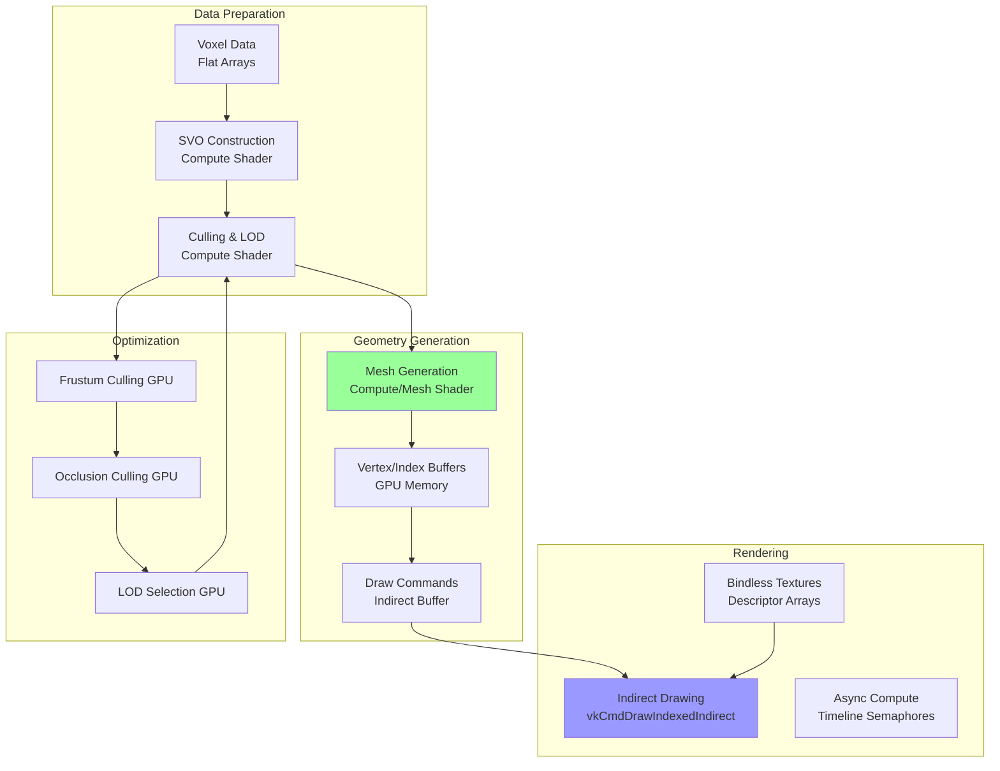
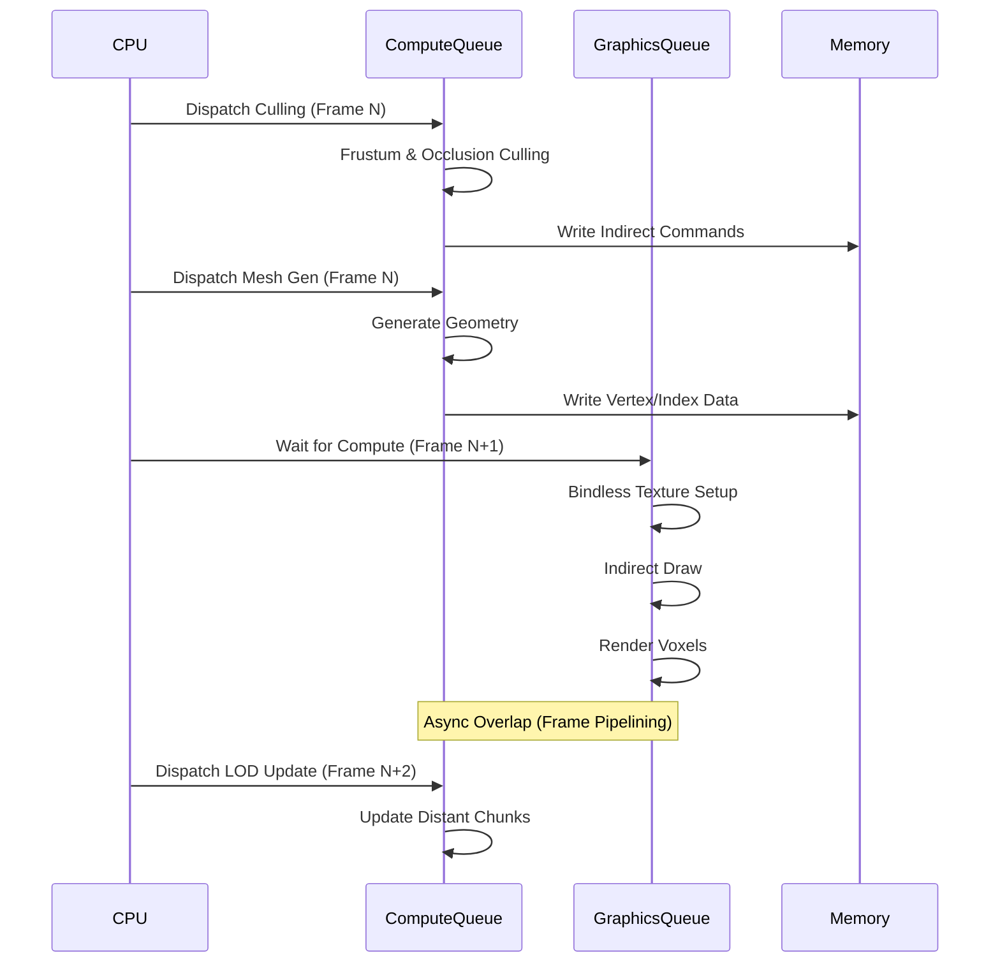
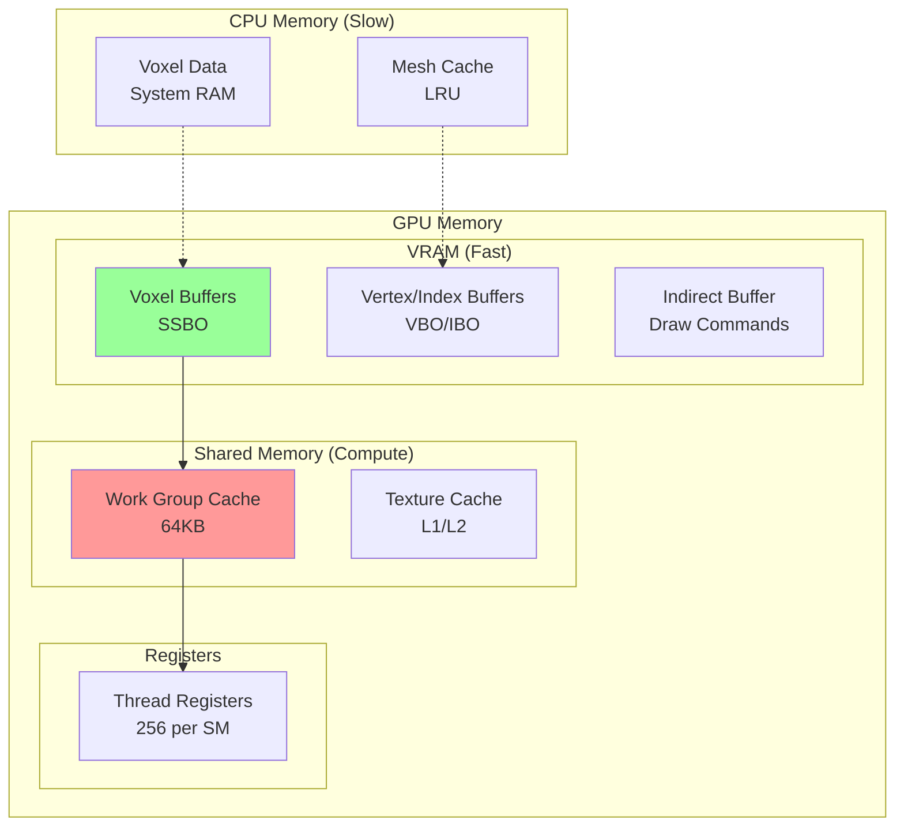

# Спецификация воксельного пайплайна ProjectV

**🔴 Уровень 3: Продвинутый** — Архитектурный документ ProjectV

## MVP подход: Простой чанк для начала

**🟢 Уровень 1: Начальный** — Начните с простого, прежде чем переходить к сложному

---

### Философия MVP (Minimum Viable Product)

ProjectV следует принципу **постепенной сложности**. Прежде чем реализовывать продвинутые техники (GPU-Driven рендеринг,
SVO, Mesh Shaders), начните с простого работающего чанка:

1. **32x32x32 чанк** — Управляемый размер для отладки
2. **Brute Force Meshing** — Простой алгоритм генерации мешей
3. **CPU-based рендеринг** — Для понимания основ
4. **Без оптимизаций** — Сначала работает, потом оптимизируем

### Простая структура чанка

```cpp
// Минимальная структура воксельного чанка
struct SimpleVoxelChunk {
    static constexpr uint32_t SIZE = 32;

    // Плоский массив вокселей (0 = воздух, 1+ = материал)
    uint8_t voxels[SIZE][SIZE][SIZE];

    // Позиция чанка в мире (в единицах чанков)
    glm::ivec3 worldPosition;

    // Простые меши для рендеринга
    std::vector<Vertex> vertices;
    std::vector<uint32_t> indices;

    // Флаг обновления
    bool needsMeshRegeneration = true;
};
```

### Brute Force Meshing (Наивный алгоритм)

```cpp
// Простой алгоритм генерации мешей (CPU)
void generateSimpleMesh(SimpleVoxelChunk& chunk) {
    chunk.vertices.clear();
    chunk.indices.clear();

    // Проверяем каждый воксель
    for (uint32_t x = 0; x < chunk.SIZE; x++) {
        for (uint32_t y = 0; y < chunk.SIZE; y++) {
            for (uint32_t z = 0; z < chunk.SIZE; z++) {
                uint8_t voxel = chunk.voxels[x][y][z];

                // Если воксель не воздух
                if (voxel != 0) {
                    // Проверяем 6 соседей
                    bool neighbors[6] = {
                        (x > 0) ? (chunk.voxels[x-1][y][z] == 0) : true,          // -X
                        (x < chunk.SIZE-1) ? (chunk.voxels[x+1][y][z] == 0) : true, // +X
                        (y > 0) ? (chunk.voxels[x][y-1][z] == 0) : true,          // -Y
                        (y < chunk.SIZE-1) ? (chunk.voxels[x][y+1][z] == 0) : true, // +Y
                        (z > 0) ? (chunk.voxels[x][y][z-1] == 0) : true,          // -Z
                        (z < chunk.SIZE-1) ? (chunk.voxels[x][y][z+1] == 0) : true  // +Z
                    };

                    // Добавляем грани только там, где есть воздух
                    addFacesForVoxel(chunk, x, y, z, voxel, neighbors);
                }
            }
        }
    }

    chunk.needsMeshRegeneration = false;
}
```

### Преимущества простого подхода

1. **Быстрая реализация** — Работающий прототип за несколько часов
2. **Простая отладка** — Легко отслеживать проблемы
3. **Базовое понимание** — Освоение основ воксельного рендеринга
4. **Фундамент для оптимизаций** — Можно постепенно добавлять сложность

### Когда переходить к продвинутым техникам?

Переходите к GPU-Driven рендерингу когда:

- [ ] Простой чанк работает стабильно
- [ ] Понимаете flow данных (воксели → меши → рендеринг)
- [ ] Столкнулись с проблемами производительности
- [ ] Готовы к сложной отладке GPU кода

### Пример: Простой воксельный мир

```cpp
// Минимальный пример с одним чанком
class SimpleVoxelWorld {
public:
    void init() {
        // Создаём один чанк
        chunk.worldPosition = glm::ivec3(0, 0, 0);

        // Заполняем простой ландшафт
        for (uint32_t x = 0; x < chunk.SIZE; x++) {
            for (uint32_t z = 0; z < chunk.SIZE; z++) {
                // Синусоидальный ландшафт
                uint32_t height = 10 + (uint32_t)(5.0f * sin(x * 0.2f) * cos(z * 0.2f));

                for (uint32_t y = 0; y < chunk.SIZE; y++) {
                    chunk.voxels[x][y][z] = (y < height) ? 1 : 0; // 1 = земля
                }
            }
        }

        // Генерируем меш
        generateSimpleMesh(chunk);

        // Загружаем в GPU
        uploadToGPU(chunk);
    }

    void render() {
        // Простой рендеринг одного чанка
        renderChunk(chunk);
    }

private:
    SimpleVoxelChunk chunk;
};
```

### Следующие шаги после MVP

1. **Greedy Meshing** — Объединение одинаковых граней (уменьшение вершин на 50-90%)
2. **Чанкирование** — Множество чанков для большого мира
3. **LOD система** — Разные уровни детализации для дальних чанков
4. **GPU генерация** — Перенос генерации мешей на compute shaders
5. **Оптимизации** — Frustum culling, occlusion culling, etc.

---

## Введение

ProjectV как воксельный движок рендерит **миллионы вокселей в реальном времени**. Традиционные подходы (CPU-based mesh
generation) не масштабируются:

- **CPU Bottleneck**: Генерация мешей на CPU для 1M+ вокселей занимает >16ms
- **Memory Bandwidth**: Передача вершин с CPU на GPU ограничивает throughput
- **Draw Calls**: Тысячи draw calls для отдельных чанков

**Решение ProjectV**: Полностью **GPU-Driven pipeline**:

1. **Compute Shaders** генерируют геометрию на GPU
2. **Indirect Drawing** минимизирует draw calls
3. **Bindless Rendering** позволяет тысячи текстур без overhead
4. **Sparse Voxel Octree** эффективно хранит разреженные воксельные миры
5. **Async Compute** параллелизирует генерацию и рендеринг

---

## Проблемы традиционного рендеринга вокселей

### 1. CPU Mesh Generation

```cpp
// Традиционный подход (плохо масштабируется)
void generateVoxelMeshCPU(const VoxelChunk& chunk, std::vector<Vertex>& vertices) {
    for (int x = 0; x < CHUNK_SIZE; x++) {
        for (int y = 0; y < CHUNK_SIZE; y++) {
            for (int z = 0; z < CHUNK_SIZE; z++) {
                if (chunk.isSolid(x, y, z)) {
                    // Проверка соседей (6 направлений)
                    if (!chunk.isSolid(x+1, y, z)) addQuad(vertices, RIGHT, ...);
                    if (!chunk.isSolid(x-1, y, z)) addQuad(vertices, LEFT, ...);
                    // ... и так для всех граней
                }
            }
        }
    }
    // Передача vertices в GPU буфер (дорого!)
}
```

**Проблемы:**

- **O(n³) сложность** — 16³ чанк = 4096 итераций
- **Memory transfer** — vertices → staging buffer → GPU
- **Single-threaded** — плохо параллелизуется на CPU

### 2. Draw Call Overhead

```cpp
// Тысячи draw calls (убийство производительности)
for (const auto& chunk : visibleChunks) {
    vkCmdBindVertexBuffers(cmd, 0, 1, &chunk.vertexBuffer, &offset);
    vkCmdBindIndexBuffer(cmd, chunk.indexBuffer, 0, VK_INDEX_TYPE_UINT32);
    vkCmdDrawIndexed(cmd, chunk.indexCount, 1, 0, 0, 0);
    // Повторить для 1000+ чанков
}
```

### 3. Texture Binding Overhead

```cpp
// Для каждого материала - свой descriptor set
for (const auto& material : materials) {
    vkCmdBindDescriptorSets(cmd, VK_PIPELINE_BIND_POINT_GRAPHICS,
                           pipelineLayout, 0, 1, &material.descriptorSet, 0, nullptr);
    // Рендеринг всех мешей с этим материалом
}
// При 100+ материалах - огромный overhead
```

---

## Архитектура GPU-Driven Pipeline

### Обзор пайплайна



### Преимущества GPU-Driven подхода

| Метрика          | CPU-Driven           | GPU-Driven            | Улучшение |
|------------------|----------------------|-----------------------|-----------|
| Mesh Generation  | 8-16ms (CPU)         | 0.5-2ms (GPU)         | 8-32x     |
| Draw Calls       | 1000+                | 1 (indirect)          | 1000x     |
| Memory Bandwidth | Высокая (CPU→GPU)    | Низкая (GPU only)     | 10-100x   |
| Scalability      | Линейно с ядрами CPU | Линейно с CUDA ядрами | Better    |
| LOD Updates      | CPU-bound (медленно) | GPU (параллельно)     | Instant   |

---

## Детальная реализация

### Структуры данных

```cpp
// Воксельные данные (SoA для cache locality)
struct VoxelData {
    // Плоские массивы для GPU-friendly доступа
    std::vector<uint32_t> voxelIDs;      // ID вокселей (материал + тип)
    std::vector<uint8_t> lightLevels;    // Уровень освещения
    std::vector<uint8_t> occlusion;      // Occlusion данные

    // Для SVO
    std::vector<uint64_t> octreeNodes;   // Сжатые узлы octree
    std::vector<uint32_t> nodeMaterials; // Материалы для leaf узлов
};

// GPU буферы
struct VoxelGPUResources {
    VkBuffer voxelBuffer;          // SSBO с воксельными данными
    VkBuffer octreeBuffer;         // SSBO с SVO
    VkBuffer indirectBuffer;       // Indirect draw commands
    VkBuffer counterBuffer;        // Atomic counters для compute shaders

    // Для mesh generation
    VkBuffer vertexBuffer;         // Output: vertices
    VkBuffer indexBuffer;          // Output: indices
    VkBuffer meshletBuffer;        // Для mesh shaders (опционально)
};

// Draw command (совместим с VkDrawIndexedIndirectCommand)
struct VoxelDrawCommand {
    uint32_t indexCount;
    uint32_t instanceCount;
    uint32_t firstIndex;
    int32_t vertexOffset;
    uint32_t firstInstance;

    // Дополнительные данные для вокселей
    uint32_t chunkID;
    uint32_t materialID;
    uint32_t LODLevel;
};
```

### Основной пайплайн

```cpp
class VoxelPipeline {
public:
    void renderFrame(VkCommandBuffer cmd, const Camera& camera) {
        // 1. Update voxel data (если были изменения)
        if (voxelDataDirty_) {
            updateVoxelBuffers(cmd);
        }

        // 2. Culling compute pass
        dispatchCullingCompute(cmd, camera);

        // 3. Mesh generation compute pass (async)
        dispatchMeshGenerationCompute(cmd);

        // 4. Wait for mesh generation (timeline semaphore)
        waitForMeshGeneration(cmd);

        // 5. Indirect rendering pass
        renderIndirect(cmd);
    }

private:
    VoxelGPUResources gpuResources_;
    VoxelData cpuVoxelData_;
    bool voxelDataDirty_ = true;

    // Timeline semaphores для async compute
    VkSemaphore computeTimelineSemaphore_;
    uint64_t computeTimelineValue_ = 0;
};
```

---

## Compute Shaders для генерации геометрии

### Алгоритм Marching Cubes на GPU

```
// Compute shader для генерации мешей вокселей
#version 460
#extension GL_EXT_scalar_block_layout : require

layout(local_size_x = 8, local_size_y = 8, local_size_z = 8) in;

// Воксельные данные
layout(std430, binding = 0) readonly buffer VoxelBuffer {
    uint voxels[];
};

// Выходные буферы
layout(std430, binding = 1) writeonly buffer VertexBuffer {
    vec4 vertices[];
};

layout(std430, binding = 2) writeonly buffer IndexBuffer {
    uint indices[];
};

// Atomic counters
layout(std430, binding = 3) buffer CounterBuffer {
    atomic_uint vertexCount;
    atomic_uint indexCount;
};

// Таблица Marching Cubes (256 комбинаций)
shared uint mcEdgeTable[256];
shared vec3 mcVertexTable[256][15];

void main() {
    ivec3 voxelPos = ivec3(gl_GlobalInvocationID.xyz);

    // Получаем значения 8 соседних вокселей
    uint cubeIndex = 0;
    if (getVoxel(voxelPos + ivec3(0, 0, 0)) > 0) cubeIndex |= 1;
    if (getVoxel(voxelPos + ivec3(1, 0, 0)) > 0) cubeIndex |= 2;
    if (getVoxel(voxelPos + ivec3(1, 0, 1)) > 0) cubeIndex |= 4;
    if (getVoxel(voxelPos + ivec3(0, 0, 1)) > 0) cubeIndex |= 8;
    if (getVoxel(voxelPos + ivec3(0, 1, 0)) > 0) cubeIndex |= 16;
    if (getVoxel(voxelPos + ivec3(1, 1, 0)) > 0) cubeIndex |= 32;
    if (getVoxel(voxelPos + ivec3(1, 1, 1)) > 0) cubeIndex |= 64;
    if (getVoxel(voxelPos + ivec3(0, 1, 1)) > 0) cubeIndex |= 128;

    // Если куб полностью пустой или полностью заполненный - пропускаем
    if (mcEdgeTable[cubeIndex] == 0) return;

    // Генерируем вершины и индексы
    uint edgeMask = mcEdgeTable[cubeIndex];

    // Для каждого ребра в маске
    for (int i = 0; i < 12; i++) {
        if ((edgeMask & (1 << i)) != 0) {
            // Интерполяция позиции вершины
            vec3 vertexPos = interpolateVertex(i, voxelPos);

            // Atomic добавление вершины
            uint vertexIdx = atomicAdd(vertexCount, 1);
            vertices[vertexIdx] = vec4(vertexPos, 1.0);

            // Добавление индекса (триангуляция)
            // ... логика триангуляции Marching Cubes
        }
    }

    memoryBarrierBuffer();
}
```

### Оптимизации для вокселей

```glsl
// Greedy Meshing - объединение одинаковых граней
void greedyMeshing(ivec3 chunkPos) {
    // Scanline алгоритм на GPU
    for (int axis = 0; axis < 3; axis++) {
        ivec3 pos = ivec3(0);

        while (pos.x < CHUNK_SIZE) {
            // Находим старт квада
            uint startMaterial = getVoxelMaterial(chunkPos + pos);

            // Расширяем квад по ширине
            int width = 1;
            while (pos.x + width < CHUNK_SIZE &&
                   getVoxelMaterial(chunkPos + pos + ivec3(width, 0, 0)) == startMaterial) {
                width++;
            }

            // Расширяем квад по высоте
            int height = 1;
            bool canExpandHeight = true;
            while (canExpandHeight && pos.y + height < CHUNK_SIZE) {
                for (int w = 0; w < width; w++) {
                    if (getVoxelMaterial(chunkPos + pos + ivec3(w, height, 0)) != startMaterial) {
                        canExpandHeight = false;
                        break;
                    }
                }
                if (canExpandHeight) height++;
            }

            // Добавляем квад
            addQuad(pos, width, height, axis, startMaterial);

            // Продолжаем сканирование
            pos.x += width;
        }
    }
}

// Преимущества Greedy Meshing:
// - Уменьшение количества вершин на 50-90%
// - Более cache-friendly рендеринг
// - Меньше overdraw
```

### Mesh Shaders (VK_EXT_mesh_shader)

```cpp
// Конфигурация mesh shaders для вокселей
VkMeshShaderPropertiesEXT meshProps = {};
meshProps.maxTaskWorkGroupSize[0] = 32;
meshProps.maxTaskWorkGroupSize[1] = 1;
meshProps.maxTaskWorkGroupSize[2] = 1;
meshProps.maxMeshWorkGroupSize[0] = 128;
meshProps.maxMeshWorkGroupSize[1] = 1;
meshProps.maxMeshWorkGroupSize[2] = 1;
meshProps.maxMeshOutputVertices = 256;
meshProps.maxMeshOutputPrimitives = 512;

// Task shader распределяет работу
taskShaderCode = R"glsl(
#version 460
#extension GL_EXT_mesh_shader : enable

taskPayloadSharedEXT uint chunkData[32];

void main() {
    // Каждая task группа обрабатывает один чанк
    uint chunkID = gl_WorkGroupID.x;

    // Culling на уровне task shader
    if (!isChunkVisible(chunkID)) {
        return;  // Пропускаем невидимые чанки
    }

    // Передаём данные в mesh shader
    chunkData[gl_LocalInvocationIndex] = chunkID;

    // Emit mesh tasks
    EmitMeshTasksEXT(1, 1, 1);  // Одна mesh группа на чанк
}
)glsl";

// Mesh shader генерирует геометрию
meshShaderCode = R"glsl(
#version 460
#extension GL_EXT_mesh_shader : enable

taskPayloadSharedEXT uint chunkData[32];

layout(location = 0) out vec3 outPosition[];
layout(location = 1) out vec2 outUV[];
layout(location = 2) out vec3 outNormal[];

void main() {
    uint chunkID = chunkData[0];

    // Генерация меша для чанка
    uint vertexCount = generateVoxelMesh(chunkID, outPosition, outUV, outNormal);
    uint primitiveCount = vertexCount / 3;

    // Set mesh output
    SetMeshOutputsEXT(vertexCount, primitiveCount);

    // Генерация индексов (треугольный список)
    for (uint i = 0; i < primitiveCount; i++) {
        gl_PrimitiveTriangleIndicesEXT[i] = uvec3(i*3, i*3+1, i*3+2);
    }
}
)glsl";
```

## Исследовательские пути рендеринга вокселей

**🔴 Уровень 3: Продвинутый** — ProjectV реализует **несколько параллельных подходов** к рендерингу вокселей. Каждый
подход имеет свои преимущества и будет протестирован для выбора оптимального.

### Философия исследования

Воксельный рендеринг — активно развивающаяся область. Не существует единого "правильного" подхода. ProjectV
проектируется с **абстракцией пайплайна**, позволяющей:

1. **Тестировать все подходы** на реальных данных
2. **Выбрать оптимальный** для целевого оборудования
3. **Комбинировать подходы** (например, Mesh Shaders для близких, Compute для дальних)

### Иерархия методов рендеринга вокселей

```cpp
enum class VoxelRenderingMethod {
    MeshShaders,      // VK_EXT_mesh_shader (самый эффективный)
    TaskShaders,      // VK_EXT_mesh_shader без mesh stage
    ComputeShaders,   // Compute-based mesh generation
    Traditional,      // Vertex/index buffers (CPU/GPU)
    Software,         // CPU fallback (медленно, но работает)
};

VoxelRenderingMethod selectRenderingMethod(const VkPhysicalDeviceProperties& props) {
    // Проверка поддержки расширений
    bool hasMeshShaders = checkExtensionSupport("VK_EXT_mesh_shader");
    bool hasTaskShaders = checkExtensionSupport("VK_EXT_mesh_shader");

    // Выбор метода на основе возможностей GPU
    if (hasMeshShaders && props.limits.maxMeshOutputVertices >= 256) {
        return VoxelRenderingMethod::MeshShaders;
    } else if (hasTaskShaders) {
        return VoxelRenderingMethod::TaskShaders;
    } else if (props.limits.maxComputeWorkGroupCount[0] > 65535) {
        return VoxelRenderingMethod::ComputeShaders;
    } else {
        return VoxelRenderingMethod::Traditional;
    }
}
```

**Реализация fallback для традиционного пайплайна:**

```cpp
class VoxelFallbackRenderer {
public:
    void initialize(VoxelRenderingMethod method) {
        currentMethod = method;

        switch (method) {
            case VoxelRenderingMethod::MeshShaders:
                initializeMeshShaders();
                break;

            case VoxelRenderingMethod::ComputeShaders:
                initializeComputePipeline();
                initializeTraditionalPipeline();  // Для рендеринга результатов
                break;

            case VoxelRenderingMethod::Traditional:
                initializeTraditionalPipeline();
                initializeCPUMeshGenerator();     // Резервная генерация на CPU
                break;
        }
    }

    void render(VkCommandBuffer cmd, const VoxelWorld& world) {
        switch (currentMethod) {
            case VoxelRenderingMethod::MeshShaders:
                renderWithMeshShaders(cmd, world);
                break;

            case VoxelRenderingMethod::ComputeShaders:
                // 1. Генерация мешей через compute shader
                vkCmdBindPipeline(cmd, VK_PIPELINE_BIND_POINT_COMPUTE, computePipeline);
                vkCmdDispatch(cmd, world.getVoxelCount() / 64, 1, 1);

                // 2. Барьер для синхронизации
                VkMemoryBarrier memoryBarrier = {
                    .sType = VK_STRUCTURE_TYPE_MEMORY_BARRIER,
                    .srcAccessMask = VK_ACCESS_SHADER_WRITE_BIT,
                    .dstAccessMask = VK_ACCESS_VERTEX_ATTRIBUTE_READ_BIT
                };

                vkCmdPipelineBarrier(cmd,
                    VK_PIPELINE_STAGE_COMPUTE_SHADER_BIT,
                    VK_PIPELINE_STAGE_VERTEX_INPUT_BIT,
                    0, 1, &memoryBarrier, 0, nullptr, 0, nullptr);

                // 3. Рендеринг через традиционный пайплайн
                renderTraditional(cmd, world);
                break;

            case VoxelRenderingMethod::Traditional:
                renderTraditional(cmd, world);
                break;
        }
    }

private:
    VoxelRenderingMethod currentMethod;
    VkPipeline computePipeline;
    VkPipeline traditionalPipeline;
    VkPipeline meshShaderPipeline;

    void renderTraditional(VkCommandBuffer cmd, const VoxelWorld& world) {
        // Классический вертексный пайплайн
        vkCmdBindPipeline(cmd, VK_PIPELINE_BIND_POINT_GRAPHICS, traditionalPipeline);

        // Bind vertex/index buffers
        VkDeviceSize offset = 0;
        vkCmdBindVertexBuffers(cmd, 0, 1, &vertexBuffer, &offset);
        vkCmdBindIndexBuffer(cmd, indexBuffer, 0, VK_INDEX_TYPE_UINT32);

        // Multi-draw indirect для эффективности
        vkCmdDrawIndexedIndirect(cmd, indirectBuffer, 0,
                                 world.getChunkCount(),
                                 sizeof(VkDrawIndexedIndirectCommand));
    }
};
```

**Автоматическое переключение методов:**

```cpp
class AdaptiveVoxelRenderer {
public:
    void updateRenderingMethod() {
        // Мониторинг производительности
        float currentFPS = getCurrentFPS();
        float targetFPS = 60.0f;

        // Если FPS ниже целевого, переключаемся на более простой метод
        if (currentFPS < targetFPS * 0.8f) {
            switchToSimplerMethod();
        }
        // Если FPS стабильно высокий, пробуем более продвинутый метод
        else if (currentFPS > targetFPS * 1.2f &&
                 canUseMoreAdvancedMethod()) {
            switchToAdvancedMethod();
        }
    }

private:
    void switchToSimplerMethod() {
        switch (currentMethod) {
            case VoxelRenderingMethod::MeshShaders:
                currentMethod = VoxelRenderingMethod::ComputeShaders;
                break;
            case VoxelRenderingMethod::ComputeShaders:
                currentMethod = VoxelRenderingMethod::Traditional;
                break;
            case VoxelRenderingMethod::Traditional:
                // Уже на самом простом методе
                break;
        }

        SDL_LogInfo("Switched to simpler rendering method: %s",
                   toString(currentMethod));
        reinitializeRenderer();
    }

    void switchToAdvancedMethod() {
        // Проверяем поддержку перед переключением
        if (currentMethod == VoxelRenderingMethod::Traditional &&
            supportsComputeShaders()) {
            currentMethod = VoxelRenderingMethod::ComputeShaders;
        }
        else if (currentMethod == VoxelRenderingMethod::ComputeShaders &&
                 supportsMeshShaders()) {
            currentMethod = VoxelRenderingMethod::MeshShaders;
        }

        SDL_LogInfo("Switched to advanced rendering method: %s",
                   toString(currentMethod));
        reinitializeRenderer();
    }
};
```

**Рекомендации по выбору метода:**

| GPU Класс                            | Рекомендуемый метод | Примечания                                         |
|--------------------------------------|---------------------|----------------------------------------------------|
| **High-end** (RTX 40xx, RX 7xxx)     | Mesh Shaders        | Максимальная производительность                    |
| **Mid-range** (RTX 30xx, RX 6xxx)    | Compute Shaders     | Хороший баланс производительности и совместимости  |
| **Low-end** (GTX 16xx, RX 5xxx)      | Traditional         | Стабильная работа на старом железе                 |
| **Integrated** (Intel Iris, AMD APU) | Traditional         | Избегать compute shaders из-за ограниченной памяти |
| **Mobile** (Adreno, Mali)            | Compute Shaders     | Если поддерживается, иначе Traditional             |

**Настройка через конфигурацию ProjectV:**

```
// В конфигурационном файле проекта
{
    "voxel_rendering": {
        "preferred_method": "auto",
        "fallback_enabled": true,
        "performance_threshold_fps": 45,
        "adaptive_quality": true
    }
}
```

---

## Bindless Rendering для текстур вокселей

### Descriptor Indexing

```cpp
// Инициализация bindless descriptor array
void initBindlessTextures(VkDevice device, VkDescriptorPool descriptorPool) {
    // Запрашиваем поддержку descriptor indexing
    VkPhysicalDeviceDescriptorIndexingFeatures indexingFeatures = {
        .sType = VK_STRUCTURE_TYPE_PHYSICAL_DEVICE_DESCRIPTOR_INDEXING_FEATURES,
        .descriptorBindingPartiallyBound = VK_TRUE,
        .runtimeDescriptorArray = VK_TRUE,
        .shaderSampledImageArrayNonUniformIndexing = VK_TRUE
    };

    // Создаём descriptor set layout с unbounded array
    VkDescriptorSetLayoutBinding binding = {
        .binding = 0,
        .descriptorType = VK_DESCRIPTOR_TYPE_COMBINED_IMAGE_SAMPLER,
        .descriptorCount = 1024,  // До 1024 текстур в массиве
        .stageFlags = VK_SHADER_STAGE_FRAGMENT_BIT | VK_SHADER_STAGE_COMPUTE_BIT
    };

    VkDescriptorBindingFlags flags =
        VK_DESCRIPTOR_BINDING_PARTIALLY_BOUND_BIT |
        VK_DESCRIPTOR_BINDING_VARIABLE_DESCRIPTOR_COUNT_BIT;

    VkDescriptorSetLayoutBindingFlagsCreateInfo flagsInfo = {
        .sType = VK_STRUCTURE_TYPE_DESCRIPTOR_SET_LAYOUT_BINDING_FLAGS_CREATE_INFO,
        .bindingCount = 1,
        .pBindingFlags = &flags
    };

    VkDescriptorSetLayoutCreateInfo layoutInfo = {
        .sType = VK_STRUCTURE_TYPE_DESCRIPTOR_SET_LAYOUT_CREATE_INFO,
        .pNext = &flagsInfo,
        .bindingCount = 1,
        .pBindings = &binding
    };

    vkCreateDescriptorSetLayout(device, &layoutInfo, nullptr, &bindlessLayout_);

    // Аллоцируем descriptor set
    VkDescriptorSetVariableDescriptorCountAllocateInfo variableCountInfo = {
        .sType = VK_STRUCTURE_TYPE_DESCRIPTOR_SET_VARIABLE_DESCRIPTOR_COUNT_ALLOCATE_INFO,
        .descriptorSetCount = 1,
        .pDescriptorCounts = &maxTextures_
    };

    VkDescriptorSetAllocateInfo allocInfo = {
        .sType = VK_STRUCTURE_TYPE_DESCRIPTOR_SET_ALLOCATE_INFO,
        .pNext = &variableCountInfo,
        .descriptorPool = descriptorPool,
        .descriptorSetCount = 1,
        .pSetLayouts = &bindlessLayout_
    };

    vkAllocateDescriptorSets(device, &allocInfo, &bindlessSet_);
}
```

### Shader Access

```glsl
// Bindless доступ к текстурам в шейдере
#version 460
#extension GL_EXT_nonuniform_qualifier : enable
#extension GL_EXT_samplerless_texture_functions : enable

layout(set = 0, binding = 0) uniform texture2D textures[];

vec4 sampleVoxelTexture(uint textureIndex, vec2 uv) {
    // nonuniform_qualifier для динамического индекса
    return texture(sampler2D(textures[nonuniformEXT(textureIndex)], linearSampler), uv);
}

// В фрагментном шейдере
void main() {
    // Материал вокселя определяет текстуру
    uint materialID = voxelMaterial();
    uint textureIndex = materialTextures[materialID];

    // Безопасный доступ с проверкой границ
    if (textureIndex < textureCount) {
        vec4 color = sampleVoxelTexture(textureIndex, texCoord);
        // ...
    }
}
```

### Texture Streaming для вокселей

```cpp
class VoxelTextureStreamer {
public:
    void update(const Camera& camera) {
        // 1. Определяем приоритет текстур на основе расстояния
        std::vector<TexturePriority> priorities = calculatePriorities(camera);

        // 2. Загружаем высокоприоритетные текстуры
        for (const auto& priority : priorities) {
            if (priority.distance < STREAMING_DISTANCE &&
                !isTextureLoaded(priority.textureID)) {

                // Async загрузка
                loadTextureAsync(priority.textureID);
            }
        }

        // 3. Выгружаем далёкие текстуры
        for (auto& [textureID, lastUsed] : loadedTextures_) {
            if (shouldUnloadTexture(textureID, camera)) {
                unloadTexture(textureID);
            }
        }
    }

private:
    struct TexturePriority {
        uint32_t textureID;
        float distance;
        float screenCoverage;
    };

    std::unordered_map<uint32_t, std::chrono::steady_clock::time_point> loadedTextures_;

    void loadTextureAsync(uint32_t textureID) {
        // Progressive loading: сначала low-res, потом high-res
        auto lowResFuture = loader_.loadMipLevel(textureID, 4);  // 1/16 размера
        auto highResFuture = loader_.loadMipLevel(textureID, 0); // Полный размер

        // Обновляем descriptor array по мере загрузки
        updateDescriptor(textureID, lowResFuture.get());
        updateDescriptor(textureID, highResFuture.get());
    }
};
```

---

## Sparse Voxel Octree (SVO)

### Структура данных

```cpp
// Сжатый узел SVO (64 бита)
struct SVONode {
    union {
        struct {
            uint64_t childrenMask : 8;   // Биты для существующих детей (0-255)
            uint64_t leafMask : 8;       // Биты для leaf детей
            uint64_t materialID : 20;    // ID материала (для leaf узлов)
            uint64_t lodLevel : 4;       // Уровень детализации
            uint64_t reserved : 24;
        };
        uint64_t data;
    };

    bool hasChild(uint8_t childIndex) const {
        return (childrenMask >> childIndex) & 1;
    }

    bool isLeaf(uint8_t childIndex) const {
        return (leafMask >> childIndex) & 1;
    }
};

// GPU представление
struct SVOGPU {
    VkBuffer nodeBuffer;          // Буфер с узлами SVONode
    VkBuffer materialBuffer;      // Буфер с материалами leaf узлов
    VkBuffer positionBuffer;      // Позиции узлов (для traversal)

    // Для dynamic updates
    VkBuffer updateBuffer;        // Буфер для инкрементальных обновлений
    VkBuffer counterBuffer;       // Atomic counters
};

// Построение SVO на GPU
void buildSVOCompute(VkCommandBuffer cmd, const VoxelData& voxels) {
    // 1. Clear buffers
    vkCmdFillBuffer(cmd, gpuResources_.counterBuffer, 0,
                   sizeof(uint32_t) * 2, 0);

    // 2. Build octree bottom-up
    vkCmdBindPipeline(cmd, VK_PIPELINE_BIND_POINT_COMPUTE, buildPipeline_);
    vkCmdDispatch(cmd, voxelCount / 64, 1, 1);

    // 3. Compact leaf nodes
    vkCmdPipelineBarrier(cmd, ...);
    vkCmdBindPipeline(cmd, VK_PIPELINE_BIND_POINT_COMPUTE, compactPipeline_);
    vkCmdDispatch(cmd, nodeCount / 64, 1, 1);
}
```

### Traversal в шейдере

```
// Ray tracing через SVO
float svoTraceRay(vec3 rayOrigin, vec3 rayDir, float maxDist) {
    vec3 invDir = 1.0 / rayDir;
    ivec3 sign = ivec3(sign(rayDir));

    // Начинаем с корневого узла
    uint nodeIndex = 0;
    float t = 0.0;

    while (t < maxDist && nodeIndex != INVALID_NODE) {
        SVONode node = nodes[nodeIndex];

        // Если leaf узел - проверяем пересечение
        if (node.isLeaf) {
            vec3 voxelPos = getVoxelPosition(node);
            float hitDist = intersectVoxel(rayOrigin, rayDir, voxelPos);

            if (hitDist > 0.0) {
                return t + hitDist;
            }
        }

        // Иначе идём глубже в octree
        vec3 nodeCenter = getNodeCenter(nodeIndex);
        vec3 nodeSize = getNodeSize(node.level);

        // Определяем, в какого ребёнка попадает луч
        uint childIndex = 0;
        if (rayOrigin.x > nodeCenter.x) childIndex |= 1;
        if (rayOrigin.y > nodeCenter.y) childIndex |= 2;
        if (rayOrigin.z > nodeCenter.z) childIndex |= 4;

        if (node.hasChild(childIndex)) {
            // Спускаемся к ребёнку
            nodeIndex = node.children[childIndex];
            t += distanceToChild(rayOrigin, rayDir, childIndex, nodeCenter, nodeSize);
        } else {
            // Переходим к следующему узлу на этом уровне
            nodeIndex = getNextNode(nodeIndex, rayDir, sign);
        }
    }

    return -1.0;  // No hit
}
```

### Dynamic Updates

```cpp
class DynamicSVO {
public:
    void updateVoxel(ivec3 position, uint32_t newMaterial) {
        // 1. Находим affected nodes
        std::vector<uint32_t> affectedNodes = findAffectedNodes(position);

        // 2. Подготавливаем update buffer
        UpdateData update = {
            .position = position,
            .newMaterial = newMaterial,
            .nodeIndices = affectedNodes
        };

        // 3. Отправляем compute shader
        VkCommandBuffer cmd = beginOneTimeCommandBuffer();

        vkCmdUpdateBuffer(cmd, updateBuffer_, 0, sizeof(UpdateData), &update);

        vkCmdBindPipeline(cmd, VK_PIPELINE_BIND_POINT_COMPUTE, updatePipeline_);
        vkCmdDispatch(cmd, affectedNodes.size() / 64 + 1, 1, 1);

        submitOneTimeCommandBuffer(cmd);

        // 4. Mark as dirty для следующего кадра
        needsRebuild_ = true;
    }

private:
    std::vector<uint32_t> findAffectedNodes(ivec3 pos) {
        // Рекурсивный поиск узлов от leaf до root
        std::vector<uint32_t> nodes;

        uint32_t nodeIndex = findLeafNode(pos);
        while (nodeIndex != INVALID_NODE) {
            nodes.push_back(nodeIndex);
            nodeIndex = getParentNode(nodeIndex);
        }

        return nodes;
    }
};
```

---

## Async Compute Pipeline

### Timeline Semaphores для синхронизации

```cpp
class AsyncVoxelPipeline {
public:
    void renderFrame(VkCommandBuffer graphicsCmd) {
        // Frame N: Compute для генерации геометрии
        uint64_t computeSignalValue = ++timelineValue_;

        // Submit compute work
        VkSubmitInfo computeSubmit = {
            .sType = VK_STRUCTURE_TYPE_SUBMIT_INFO,
            .commandBufferCount = 1,
            .pCommandBuffers = &computeCmd_,
            .signalSemaphoreCount = 1,
            .pSignalSemaphores = &timelineSemaphore_
        };

        VkTimelineSemaphoreSubmitInfo timelineInfo = {
            .sType = VK_STRUCTURE_TYPE_TIMELINE_SEMAPHORE_SUBMIT_INFO,
            .signalSemaphoreValueCount = 1,
            .pSignalSemaphoreValues = &computeSignalValue
        };

        computeSubmit.pNext = &timelineInfo;
        vkQueueSubmit(computeQueue_, 1, &computeSubmit, VK_NULL_HANDLE);

        // Frame N+1: Graphics ждёт compute
        VkSemaphoreWaitInfo waitInfo = {
            .sType = VK_STRUCTURE_TYPE_SEMAPHORE_WAIT_INFO,
            .semaphoreCount = 1,
            .pSemaphores = &timelineSemaphore_,
            .pValues = &timelineValue_
        };

        vkWaitSemaphores(device_, &waitInfo, UINT64_MAX);

        // Graphics рендеринг с сгенерированной геометрией
        renderIndirect(graphicsCmd);
    }

private:
    VkSemaphore timelineSemaphore_;
    uint64_t timelineValue_ = 0;
    VkQueue computeQueue_;
    VkQueue graphicsQueue_;
};
```

### Compute Queue Specialization

```cpp
void setupAsyncCompute() {
    // Ищем отдельную compute queue family
    uint32_t queueFamilyCount = 0;
    vkGetPhysicalDeviceQueueFamilyProperties(physicalDevice_, &queueFamilyCount, nullptr);

    std::vector<VkQueueFamilyProperties> families(queueFamilyCount);
    vkGetPhysicalDeviceQueueFamilyProperties(physicalDevice_, &queueFamilyCount, families.data());

    // Ищем family с compute но без graphics
    for (uint32_t i = 0; i < families.size(); i++) {
        if ((families[i].queueFlags & VK_QUEUE_COMPUTE_BIT) &&
            !(families[i].queueFlags & VK_QUEUE_GRAPHICS_BIT)) {
            computeQueueFamily_ = i;
            break;
        }
    }

    // Если не нашли - используем ту же family что и graphics
    if (computeQueueFamily_ == VK_QUEUE_FAMILY_IGNORED) {
        computeQueueFamily_ = graphicsQueueFamily_;
    }

    // Создаём queue
    vkGetDeviceQueue(device_, computeQueueFamily_, 0, &computeQueue_);

    // Настраиваем priority (выше чем у graphics для минимизации stalls)
    VkDeviceQueueCreateInfo queueInfo = {
        .sType = VK_STRUCTURE_TYPE_DEVICE_QUEUE_CREATE_INFO,
        .queueFamilyIndex = computeQueueFamily_,
        .queueCount = 1,
        .pQueuePriorities = &computePriority_
    };
}
```

---

## Производительность и оптимизации

### 1. Memory Access Patterns

```cpp
// Плохо: random access
for (int i = 0; i < voxelCount; i++) {
    processVoxel(voxels[randomIndices[i]]);  // Cache misses
}

// Хорошо: sequential access
for (int i = 0; i < voxelCount; i++) {
    processVoxel(voxels[i]);  // Cache friendly
}

// Лучше: SOA vs AOS
struct VoxelAOS {  // Array of Structures (плохо)
    uint32_t id;
    uint8_t light;
    uint8_t occlusion;
    // ...
};

struct VoxelSOA {  // Structure of Arrays (хорошо для GPU)
    std::vector<uint32_t> ids;
    std::vector<uint8_t> lights;
    std::vector<uint8_t> occlusions;
    // ...
};
```

### 2. Compute Shader Optimization

```
// Оптимизации compute shaders для вокселей:

// 1. Shared memory для часто используемых данных
shared uint sharedVoxels[GROUP_SIZE][GROUP_SIZE][GROUP_SIZE];

// 2. Предзагрузка данных в shared memory
void preloadVoxels(ivec3 groupBase) {
    ivec3 localPos = ivec3(gl_LocalInvocationID);
    ivec3 globalPos = groupBase + localPos;

    sharedVoxels[localPos.x][localPos.y][localPos.z] =
        getVoxelGlobal(globalPos);

    barrier();  // Синхронизация внутри work group
}

// 3. Векторизация операций
uvec4 voxelData = texelFetch(voxelTexture, texCoord);
uint result = dot(voxelData, uvec4(1, 256, 65536, 16777216));

// 4. Branch reduction
// Вместо:
if (voxelID == 0) { /* air */ }
else if (voxelID == 1) { /* stone */ }
// Используем:
uint materialIndex = materialLUT[voxelID];
processMaterial(materialIndex);
```

### 3. LOD System для вокселей

```cpp
class VoxelLODSystem {
public:
    struct LODLevel {
        uint32_t voxelResolution;  // Например: 16, 8, 4, 2
        float transitionDistance;   // Расстояние перехода
        uint32_t mipmapLevel;       // Уровень мипмапа текстур
    };

    void update(const Camera& camera) {
        // Для каждого чанка определяем LOD уровень
        for (auto& chunk : chunks_) {
            float distance = glm::distance(camera.position, chunk.center);

            // Выбираем LOD уровень
            uint32_t lodLevel = 0;
            for (uint32_t i = 0; i < lodLevels_.size(); i++) {
                if (distance < lodLevels_[i].transitionDistance) {
                    lodLevel = i;
                    break;
                }
            }

            // Если LOD изменился - перегенерируем меш
            if (chunk.currentLOD != lodLevel) {
                scheduleLODUpdate(chunk, lodLevel);
            }
        }
    }

private:
    std::vector<LODLevel> lodLevels_ = {
        {16, 10.0f, 0},   // Высокая детализация (близко)
        {8,  30.0f, 1},   // Средняя детализация
        {4,  50.0f, 2},   // Низкая детализация
        {2,  100.0f, 3}   // Очень низкая детализация (далеко)
    };

    void scheduleLODUpdate(VoxelChunk& chunk, uint32_t newLOD) {
        // Async генерация нового LOD уровня
        auto future = std::async(std::launch::async, [&chunk, newLOD]() {
            // Генерация упрощённого меша
            auto simplifiedMesh = generateSimplifiedMesh(chunk, newLOD);

            // Загрузка в GPU
            uploadMeshToGPU(chunk, simplifiedMesh);

            chunk.currentLOD = newLOD;
        });

        lodUpdateFutures_.push_back(std::move(future));
    }
};
```

### 4. Performance Metrics

| Операция         | Target Time       | Monitoring   | Optimization          |
|------------------|-------------------|--------------|-----------------------|
| Mesh Generation  | < 2ms @ 1M voxels | Tracy GPU    | Greedy Meshing        |
| Culling          | < 0.5ms           | GPU counters | Hierarchical Z-Buffer |
| Indirect Draw    | < 0.1ms           | VK metrics   | Multi-draw indirect   |
| Texture Sampling | < 1ms             | GPU cache    | Texture Atlases       |
| SVO Traversal    | < 1ms/ray         | Ray counters | Cone Tracing          |

---

## Интеграция с экосистемой ProjectV

### Flecs ECS Integration

```cpp
// Компоненты для воксельного рендеринга
struct VoxelChunkComponent {
    ResourceHandle voxelDataHandle;    // Ссылка на воксельные данные
    ResourceHandle meshHandle;         // Сгенерированный меш
    ResourceHandle svoHandle;          // SVO для ray tracing
    glm::ivec3 chunkPosition;          // Позиция чанка в мире
    uint32_t LODLevel;                 // Текущий уровень детализации
    bool needsRegeneration;            // Флаг для перегенерации
};

struct VoxelRenderSystem {
    VoxelRenderSystem(flecs::world& world) {
        world.system<const VoxelChunkComponent>("RenderVoxels")
            .kind(flecs::OnUpdate)
            .iter([this](flecs::iter& it, const VoxelChunkComponent* chunks) {
                renderVoxelChunks(it, chunks);
            });

        world.system<VoxelChunkComponent>("UpdateVoxelLOD")
            .kind(flecs::OnStore)
            .each([this](flecs::entity e, VoxelChunkComponent& chunk) {
                updateLOD(e, chunk);
            });

        world.observer<VoxelChunkComponent>("OnVoxelModified")
            .event<VoxelModifiedEvent>()
            .each([this](flecs::entity e, VoxelChunkComponent& chunk) {
                chunk.needsRegeneration = true;
                scheduleMeshRegeneration(e, chunk);
            });
    }

private:
    void renderVoxelChunks(flecs::iter& it, const VoxelChunkComponent* chunks) {
        // Подготовка indirect draw commands
        std::vector<VoxelDrawCommand> commands;

        for (int i = 0; i < it.count(); i++) {
            if (shouldRenderChunk(chunks[i])) {
                commands.push_back(createDrawCommand(chunks[i]));
            }
        }

        // Единственный indirect draw call
        if (!commands.empty()) {
            updateIndirectBuffer(commands);
            vkCmdDrawIndexedIndirect(cmd, indirectBuffer_,
                                     0, commands.size(),
                                     sizeof(VoxelDrawCommand));
        }
    }
};
```

### Tracy Profiling Integration

```cpp
void profileVoxelPipeline() {
    // CPU profiling
    ZoneScopedN("VoxelPipeline");

    {
        ZoneScopedN("Culling");
        TracyGpuZone("Culling");
        dispatchCullingCompute();
    }

    {
        ZoneScopedN("MeshGeneration");
        TracyGpuZone("MeshGeneration");
        dispatchMeshGenerationCompute();
    }

    {
        ZoneScopedN("Rendering");
        TracyGpuZone("Rendering");
        FrameMarkStart("VoxelRender");
        renderIndirect();
        FrameMarkEnd("VoxelRender");
    }

    // GPU memory tracking
    TracyPlot("VoxelMemoryMB", getVoxelMemoryUsage() / (1024 * 1024));
    TracyPlot("VisibleChunks", getVisibleChunkCount());
    TracyPlot("GeneratedVertices", getGeneratedVertexCount());
}
```

### ResourceManager Integration

```cpp
class VoxelResourceManager {
public:
    ResourceHandle allocateVoxelChunk(const VoxelChunk& chunk) {
        auto& rm = ResourceManager::get();

        // Voxel data buffer
        ResourceHandle voxelBuffer = rm.createBuffer(
            "voxel_chunk_" + std::to_string(chunk.id),
            chunk.getSizeInBytes(),
            VK_BUFFER_USAGE_STORAGE_BUFFER_BIT | VK_BUFFER_USAGE_TRANSFER_DST_BIT,
            VMA_MEMORY_USAGE_GPU_ONLY
        );

        // Mesh buffers (vertex + index)
        ResourceHandle meshBuffers = rm.createMeshBuffer(
            "voxel_mesh_" + std::to_string(chunk.id),
            chunk.estimateVertexCount(),
            chunk.estimateIndexCount()
        );

        // SVO buffer (если используется)
        ResourceHandle svoBuffer = rm.createBuffer(
            "voxel_svo_" + std::to_string(chunk.id),
            chunk.estimateSVOSize(),
            VK_BUFFER_USAGE_STORAGE_BUFFER_BIT,
            VMA_MEMORY_USAGE_GPU_ONLY
        );

        // Создаём компонент ресурсов
        VoxelResources resources = {
            .voxelBuffer = voxelBuffer,
            .meshBuffers = meshBuffers,
            .svoBuffer = svoBuffer
        };

        // Сохраняем в ResourceManager
        return rm.createResource(ResourceType::VoxelChunk,
                                "chunk_" + std::to_string(chunk.id),
                                std::make_unique<VoxelResourceData>(std::move(resources)));
    }
};
```

---

## Типичные проблемы и решения

### Проблема 1: Stuttering при генерации мешей

**Симптомы:** FPS проседает при первой генерации мешей для новых чанков.

**Решение:**

```cpp
class ProgressiveMeshGenerator {
public:
    void update() {
        // Ограничиваем время генерации за кадр
        auto startTime = std::chrono::high_resolution_clock::now();

        while (!generationQueue_.empty()) {
            auto& task = generationQueue_.front();

            // Генерируем часть меша (например, 1/4 чанка за кадр)
            bool completed = task.generator->generatePartial(25);  // 25%

            if (completed) {
                // Загрузка в GPU
                uploadMeshToGPU(task);
                generationQueue_.pop();
            }

            // Проверяем лимит времени
            auto currentTime = std::chrono::high_resolution_clock::now();
            auto elapsed = std::chrono::duration_cast<std::chrono::milliseconds>(
                currentTime - startTime);

            if (elapsed.count() > 2) {  // Максимум 2ms за кадр
                break;
            }
        }
    }

private:
    std::queue<GenerationTask> generationQueue_;
};
```

### Проблема 2: Memory Fragmentation для воксельных буферов

**Симптомы:** `VK_ERROR_OUT_OF_DEVICE_MEMORY` при частых аллокациях/освобождениях.

**Решение:**

```cpp
class VoxelBufferPool {
public:
    ResourceHandle acquireChunkBuffer(size_t size) {
        // Ищем подходящий буфер в пуле
        for (auto& entry : pool_) {
            if (entry.size >= size && !entry.inUse &&
                (entry.size - size) < size * 0.1f) {  // Не более 10% overhead
                entry.inUse = true;
                return entry.handle;
            }
        }

        // Не нашли - создаём новый с запасом для будущих чанков
        size_t allocatedSize = roundUpToPowerOfTwo(size);
        auto handle = ResourceManager::get().createBuffer(
            "voxel_pool_" + std::to_string(pool_.size()),
            allocatedSize,
            VK_BUFFER_USAGE_STORAGE_BUFFER_BIT,
            VMA_MEMORY_USAGE_GPU_ONLY
        );

        pool_.push_back({handle, allocatedSize, true});
        return handle;
    }

    void defragment() {
        // Перераспределяем чанки для уменьшения fragmentation
        std::vector<ChunkRelocation> relocations;

        // Определяем оптимальное расположение
        calculateOptimalLayout(relocations);

        // Выполняем relocations на GPU
        executeRelocations(relocations);

        // Освобождаем пустые буферы
        cleanupEmptyBuffers();
    }

private:
    struct PoolEntry {
        ResourceHandle handle;
        size_t size;
        bool inUse;
        std::vector<ChunkReference> chunks;
    };

    std::vector<PoolEntry> pool_;
};
```

### Проблема 3: Z-Fighting при рендеринге соседних чанков

**Симптомы:** Мерцание на границах чанков из-за precision errors.

**Решение:**

```cpp
// 1. Использование conservative rasterization
VkPipelineRasterizationConservativeStateCreateInfoEXT conservativeRaster = {
    .sType = VK_STRUCTURE_TYPE_PIPELINE_RASTERIZATION_CONSERVATIVE_STATE_CREATE_INFO_EXT,
    .conservativeRasterizationMode = VK_CONSERVATIVE_RASTERIZATION_MODE_OVERESTIMATE_EXT,
    .extraPrimitiveOverestimationSize = 0.001f  // Маленькое расширение
};

// 2. Depth bias на основе расстояния
float calculateDepthBias(float distance) {
    // Увеличиваем bias для дальних чанков
    const float baseBias = 0.001f;
    const float distanceScale = 0.0001f;
    return baseBias + distance * distanceScale;
}

// 3. Рендеринг чанков в порядке back-to-front для прозрачных граней
void renderChunksSorted(std::vector<VoxelChunk>& chunks, const Camera& camera) {
    // Сортируем по расстоянию (дальние первыми)
    std::sort(chunks.begin(), chunks.end(),
              [&camera](const VoxelChunk& a, const VoxelChunk& b) {
                  return glm::distance(camera.position, a.center) >
                         glm::distance(camera.position, b.center);
              });

    // Рендеринг
    for (const auto& chunk : chunks) {
        renderChunk(chunk);
    }
}

// 4. Использование дополненных граней (увеличенных на epsilon)
void generateExpandedFaces(const VoxelChunk& chunk) {
    const float EPSILON = 0.001f;

    for (const auto& face : chunk.faces) {
        // Слегка расширяем грань чтобы перекрывать соседние чанки
        Face expandedFace = face;
        expandedFace.min -= glm::vec3(EPSILON);
        expandedFace.max += glm::vec3(EPSILON);

        addFace(expandedFace);
    }
}
```

### Проблема 4: Aliasing при distant LOD уровнях

**Симптомы:** Мерцание и артефакты на дальних LOD уровнях.

**Решение:**

```cpp
class TemporalAntiAliasing {
public:
    void applyTAA(VkCommandBuffer cmd, VkImageView currentFrame,
                  VkImageView previousFrame, VkImageView velocityBuffer) {
        // 1. History accumulation
        vkCmdBindPipeline(cmd, VK_PIPELINE_BIND_POINT_COMPUTE, taaPipeline_);
        vkCmdDispatch(cmd, width_ / 8, height_ / 8, 1);

        // 2. Clamping к соседним пикселям текущего кадра
        vkCmdPipelineBarrier(cmd, ...);
        vkCmdBindPipeline(cmd, VK_PIPELINE_BIND_POINT_COMPUTE, clampPipeline_);
        vkCmdDispatch(cmd, width_ / 8, height_ / 8, 1);

        // 3. Sharpening для компенсации blur
        vkCmdPipelineBarrier(cmd, ...);
        vkCmdBindPipeline(cmd, VK_PIPELINE_BIND_POINT_COMPUTE, sharpenPipeline_);
        vkCmdDispatch(cmd, width_ / 8, height_ / 8, 1);
    }

private:
    VkPipeline taaPipeline_;
    VkPipeline clampPipeline_;
    VkPipeline sharpenPipeline_;

    // Для вокселей - дополнительный temporal supersampling
    void supersampleVoxels() {
        // Рендеринг в 2x разрешении с последующим downscale
        renderVoxelsAtDoubleResolution();

        // Temporal accumulation across frames
        accumulateTemporalSamples();

        // Edge-aware blur для smooth LOD transitions
        applyEdgeAwareBlur();
    }
};
```

---

## Диаграммы

### Полный GPU-Driven пайплайн



### Memory Hierarchy для вокселей



---

## Воксельное сжатие данных

**🟡 Уровень 2: Средний** — Оптимизация памяти для воксельных миров.

### Проблема: Размер данных

Чанк 32×32×32 = 32,768 вокселей. При 4 байтах на воксель = 128 KB на чанк. Мир 1024×1024×256 = 4 TB данных!

### RLE (Run-Length Encoding)

```cpp
// RLE кодирование для вокселей
struct RLERun {
    uint16_t length;    // Длина серии (до 65535)
    uint16_t material;  // ID материала
};

std::vector<RLERun> encodeRLE(const std::vector<uint16_t>& voxels) {
    std::vector<RLERun> result;

    if (voxels.empty()) return result;

    uint16_t currentMaterial = voxels[0];
    uint16_t currentLength = 1;

    for (size_t i = 1; i < voxels.size(); ++i) {
        if (voxels[i] == currentMaterial && currentLength < 65535) {
            ++currentLength;
        } else {
            result.push_back({currentLength, currentMaterial});
            currentMaterial = voxels[i];
            currentLength = 1;
        }
    }

    result.push_back({currentLength, currentMaterial});
    return result;
}

// Декодирование на GPU
std::vector<uint16_t> decodeRLE(const std::vector<RLERun>& runs, size_t totalSize) {
    std::vector<uint16_t> result(totalSize);
    size_t offset = 0;

    for (const auto& run : runs) {
        std::fill(result.begin() + offset,
                  result.begin() + offset + run.length,
                  run.material);
        offset += run.length;
    }

    return result;
}

// GPU декодирование (GLSL)
// Decode RLE in compute shader
uint decodeRLE(uint index, RLERun[] runs) {
    uint accumulated = 0;
    for (uint i = 0; i < runs.length(); ++i) {
        accumulated += runs[i].length;
        if (index < accumulated) {
            return runs[i].material;
        }
    }
    return 0;  // Air
}
```

### Palette Compression

```cpp
// Палитровое сжатие для ограниченного набора материалов
class PaletteCompressor {
public:
    struct Palette {
        std::array<uint32_t, 256> colors;     // До 256 цветов
        std::array<uint32_t, 256> materials;  // До 256 материалов
        uint8_t count;
    };

    // Сжатие чанка в 8-bit palette indices
    struct CompressedChunk {
        Palette palette;
        std::vector<uint8_t> indices;  // 1 byte per voxel вместо 4-8
    };

    CompressedChunk compress(const std::vector<Voxel>& voxels) {
        CompressedChunk result;

        // 1. Строим палитру (frequency-based)
        std::unordered_map<uint32_t, uint8_t> materialToIndex;

        for (const auto& voxel : voxels) {
            uint32_t key = voxel.material | (voxel.color << 16);

            if (materialToIndex.find(key) == materialToIndex.end()) {
                uint8_t index = result.palette.count++;
                materialToIndex[key] = index;
                result.palette.materials[index] = voxel.material;
                result.palette.colors[index] = voxel.color;
            }
        }

        // 2. Кодируем индексы
        result.indices.resize(voxels.size());
        for (size_t i = 0; i < voxels.size(); ++i) {
            uint32_t key = voxels[i].material | (voxels[i].color << 16);
            result.indices[i] = materialToIndex[key];
        }

        return result;
    }

    // GPU декодирование
    Voxel decompress(uint8_t index, const Palette& palette) {
        return Voxel{
            .material = palette.materials[index],
            .color = palette.colors[index]
        };
    }
};
```

### Bit Packing

```cpp
// Bit packing для компактного хранения
struct PackedVoxel {
    // Для большинства вокселей достаточно:
    // - 8 bits material ID (до 256 материалов)
    // - 4 bits light level (0-15)
    // - 4 bits flags/occlusion
    // Total: 16 bits = 2 bytes вместо 8+

    uint16_t data;

    uint8_t getMaterial() const { return data & 0xFF; }
    uint8_t getLight() const { return (data >> 8) & 0xF; }
    uint8_t getFlags() const { return (data >> 12) & 0xF; }

    void set(uint8_t material, uint8_t light, uint8_t flags) {
        data = material | (light << 8) | (flags << 12);
    }
};

// Ещё более компактный вариант для ограниченных данных
struct UltraPackedVoxel {
    // - 6 bits material (до 64 материалов)
    // - 4 bits light (0-15)
    // - 1 bit solid
    // - 1 bit visible
    // - 4 bits occlusion (Ambient Occlusion)
    // Total: 16 bits

    uint16_t data;

    static constexpr uint8_t MATERIAL_MASK = 0x3F;  // 6 bits
    static constexpr uint8_t LIGHT_SHIFT = 6;
    static constexpr uint8_t LIGHT_MASK = 0xF;      // 4 bits
    static constexpr uint8_t SOLID_SHIFT = 10;
    static constexpr uint8_t VISIBLE_SHIFT = 11;
    static constexpr uint8_t OCCLUSION_SHIFT = 12;

    uint8_t getMaterial() const { return data & MATERIAL_MASK; }
    uint8_t getLight() const { return (data >> LIGHT_SHIFT) & LIGHT_MASK; }
    bool isSolid() const { return (data >> SOLID_SHIFT) & 1; }
    bool isVisible() const { return (data >> VISIBLE_SHIFT) & 1; }
    uint8_t getOcclusion() const { return (data >> OCCLUSION_SHIFT) & 0xF; }
};
```

### Zstandard (zstd) Compression для чанков

```cpp
#include <zstd.h>

class ChunkCompressor {
public:
    // Сжатие чанка для хранения на диске
    std::vector<uint8_t> compress(const VoxelChunk& chunk) {
        // 1. Подготавливаем сырые данные
        std::vector<uint8_t> rawData = serializeChunk(chunk);

        // 2. Сжимаем с zstd
        size_t bound = ZSTD_compressBound(rawData.size());
        std::vector<uint8_t> compressed(bound);

        size_t compressedSize = ZSTD_compress(
            compressed.data(), compressed.size(),
            rawData.data(), rawData.size(),
            3  // Compression level (1-22)
        );

        if (ZSTD_isError(compressedSize)) {
            throw std::runtime_error("ZSTD compression failed");
        }

        compressed.resize(compressedSize);
        return compressed;
    }

    // Декомпрессия при загрузке
    VoxelChunk decompress(const std::vector<uint8_t>& compressed) {
        // Получаем оригинальный размер
        size_t decompressedSize = ZSTD_getFrameContentSize(
            compressed.data(), compressed.size());

        std::vector<uint8_t> decompressed(decompressedSize);

        size_t result = ZSTD_decompress(
            decompressed.data(), decompressed.size(),
            compressed.data(), compressed.size()
        );

        if (ZSTD_isError(result)) {
            throw std::runtime_error("ZSTD decompression failed");
        }

        return deserializeChunk(decompressed);
    }

private:
    std::vector<uint8_t> serializeChunk(const VoxelChunk& chunk) {
        std::vector<uint8_t> data;
        // Serialize header, voxels, lighting, etc.
        // ...
        return data;
    }

    VoxelChunk deserializeChunk(const std::vector<uint8_t>& data) {
        VoxelChunk chunk;
        // Deserialize...
        return chunk;
    }
};
```

### Результаты сжатия

| Метод               | Размер (32³ чанк) | Сжатие | CPU decode | GPU decode |
|---------------------|-------------------|--------|------------|------------|
| Raw (4 bytes/voxel) | 128 KB            | 1.0×   | -          | -          |
| Palette (1 byte)    | 32 KB             | 4×     | Fast       | Fast       |
| RLE (средний мир)   | 8-20 KB           | 6-16×  | Fast       | Medium     |
| Bit Pack (16-bit)   | 64 KB             | 2×     | Fast       | Fast       |
| Zstd level 3        | 5-15 KB           | 8-25×  | Slow       | CPU only   |
| RLE + Zstd          | 2-8 KB            | 16-64× | Slow       | CPU only   |

---

## Iso-surfaces и Marching Cubes

**🔴 Уровень 3: Продвинутый** — Генерация гладких поверхностей из вокселей.

### Что такое Iso-surfaces?

Iso-surface — это поверхность, построенная по значениям скалярного поля. В воксельных движках используется для:

- **Terrain generation** — гладкий ландшафт вместо блочного
- **Metaballs** — органические формы
- **Fluid simulation** — вода, лава
- **Destruction** — реалистичное разрушение

### Marching Cubes Algorithm

```cpp
// Таблицы Marching Cubes (256 конфигураций)
namespace MarchingCubes {
    // Edge table: для каждого из 256 случаев, какие рёбра пересекаются
    constexpr int edgeTable[256] = {
        0x000, 0x109, 0x203, 0x30a, 0x406, 0x50f, 0x605, 0x70c,
        // ... все 256 значений
    };

    // Triangle table: для каждого случая, какие треугольники создать
    constexpr int triTable[256][16] = {
        {-1, -1, -1, -1, -1, -1, -1, -1, -1, -1, -1, -1, -1, -1, -1, -1},
        {0, 8, 3, -1, -1, -1, -1, -1, -1, -1, -1, -1, -1, -1, -1, -1},
        // ... все 256 конфигураций
    };

    // 8 вершин куба
    constexpr glm::vec3 cubeVertices[8] = {
        {0, 0, 0}, {1, 0, 0}, {1, 1, 0}, {0, 1, 0},
        {0, 0, 1}, {1, 0, 1}, {1, 1, 1}, {0, 1, 1}
    };

    // 12 рёбер куба
    constexpr int cubeEdges[12][2] = {
        {0, 1}, {1, 2}, {2, 3}, {3, 0},  // Bottom face
        {4, 5}, {5, 6}, {6, 7}, {7, 4},  // Top face
        {0, 4}, {1, 5}, {2, 6}, {3, 7}   // Vertical edges
    };
}

// CPU реализация Marching Cubes
class MarchingCubesCPU {
public:
    struct Vertex {
        glm::vec3 position;
        glm::vec3 normal;
    };

    std::vector<Vertex> generateMesh(
        const std::vector<float>& densityField,
        const glm::ivec3& size,
        float isoLevel = 0.5f
    ) {
        std::vector<Vertex> vertices;

        // Проходим по всем ячейкам
        for (int z = 0; z < size.z - 1; ++z) {
            for (int y = 0; y < size.y - 1; ++y) {
                for (int x = 0; x < size.x - 1; ++x) {
                    processCell(vertices, densityField, size,
                               glm::ivec3(x, y, z), isoLevel);
                }
            }
        }

        return vertices;
    }

private:
    void processCell(
        std::vector<Vertex>& vertices,
        const std::vector<float>& density,
        const glm::ivec3& size,
        const glm::ivec3& pos,
        float isoLevel
    ) {
        // Получаем значения в 8 вершинах куба
        float cubeValues[8];
        for (int i = 0; i < 8; ++i) {
            glm::ivec3 vertexPos = pos + glm::ivec3(MarchingCubes::cubeVertices[i]);
            cubeValues[i] = getDensity(density, size, vertexPos);
        }

        // Определяем конфигурацию (какие вершины внутри/снаружи)
        int cubeIndex = 0;
        for (int i = 0; i < 8; ++i) {
            if (cubeValues[i] < isoLevel) {
                cubeIndex |= (1 << i);
            }
        }

        // Полностью внутри или снаружи
        if (MarchingCubes::edgeTable[cubeIndex] == 0) {
            return;
        }

        // Интерполируем позиции вершин на рёбрах
        glm::vec3 edgeVertices[12];
        for (int i = 0; i < 12; ++i) {
            if (MarchingCubes::edgeTable[cubeIndex] & (1 << i)) {
                int v0 = MarchingCubes::cubeEdges[i][0];
                int v1 = MarchingCubes::cubeEdges[i][1];

                glm::vec3 p0 = glm::vec3(pos) + MarchingCubes::cubeVertices[v0];
                glm::vec3 p1 = glm::vec3(pos) + MarchingCubes::cubeVertices[v1];

                // Линейная интерполяция
                float t = (isoLevel - cubeValues[v0]) /
                         (cubeValues[v1] - cubeValues[v0]);
                edgeVertices[i] = p0 + t * (p1 - p0);
            }
        }

        // Создаём треугольники
        for (int i = 0; MarchingCubes::triTable[cubeIndex][i] != -1; i += 3) {
            Vertex v0, v1, v2;
            v0.position = edgeVertices[MarchingCubes::triTable[cubeIndex][i]];
            v1.position = edgeVertices[MarchingCubes::triTable[cubeIndex][i + 1]];
            v2.position = edgeVertices[MarchingCubes::triTable[cubeIndex][i + 2]];

            // Нормаль через cross product
            glm::vec3 edge1 = v1.position - v0.position;
            glm::vec3 edge2 = v2.position - v0.position;
            glm::vec3 normal = glm::normalize(glm::cross(edge1, edge2));

            v0.normal = normal;
            v1.normal = normal;
            v2.normal = normal;

            vertices.push_back(v0);
            vertices.push_back(v1);
            vertices.push_back(v2);
        }
    }

    float getDensity(const std::vector<float>& density,
                     const glm::ivec3& size,
                     const glm::ivec3& pos) {
        if (pos.x < 0 || pos.x >= size.x ||
            pos.y < 0 || pos.y >= size.y ||
            pos.z < 0 || pos.z >= size.z) {
            return 0.0f;  // Outside = air
        }
        return density[pos.x + pos.y * size.x + pos.z * size.x * size.y];
    }
};
```

### GPU Marching Cubes с Compute Shaders

```glsl
#version 460

layout(local_size_x = 4, local_size_y = 4, local_size_z = 4) in;

// Density field (3D texture или SSBO)
layout(binding = 0) uniform sampler3D densityTexture;
// layout(std430, binding = 0) readonly buffer DensityBuffer { float densities[]; };

// Output buffers
layout(std430, binding = 1) writeonly buffer VertexBuffer {
    vec4 vertices[];  // xyz = position, w = normal.x
};

layout(std430, binding = 2) buffer CounterBuffer {
    atomic_uint vertexCount;
};

// Marching Cubes tables (uniform или constant arrays)
layout(std140, binding = 3) uniform MCTables {
    int edgeTable[256];
    int triTable[256][16];
};

uniform float isoLevel = 0.5;
uniform ivec3 volumeSize;

// Interpolate vertex position along edge
vec3 interpolate(vec3 p0, vec3 p1, float d0, float d1) {
    float t = (isoLevel - d0) / (d1 - d0);
    return mix(p0, p1, t);
}

void main() {
    ivec3 cellPos = ivec3(gl_GlobalInvocationID);

    if (cellPos.x >= volumeSize.x - 1 ||
        cellPos.y >= volumeSize.y - 1 ||
        cellPos.z >= volumeSize.z - 1) {
        return;
    }

    // Sample 8 corners
    float d[8];
    d[0] = texelFetch(densityTexture, cellPos + ivec3(0, 0, 0), 0).r;
    d[1] = texelFetch(densityTexture, cellPos + ivec3(1, 0, 0), 0).r;
    d[2] = texelFetch(densityTexture, cellPos + ivec3(1, 1, 0), 0).r;
    d[3] = texelFetch(densityTexture, cellPos + ivec3(0, 1, 0), 0).r;
    d[4] = texelFetch(densityTexture, cellPos + ivec3(0, 0, 1), 0).r;
    d[5] = texelFetch(densityTexture, cellPos + ivec3(1, 0, 1), 0).r;
    d[6] = texelFetch(densityTexture, cellPos + ivec3(1, 1, 1), 0).r;
    d[7] = texelFetch(densityTexture, cellPos + ivec3(0, 1, 1), 0).r;

    // Determine cube configuration
    int cubeIndex = 0;
    for (int i = 0; i < 8; ++i) {
        if (d[i] < isoLevel) cubeIndex |= (1 << i);
    }

    // Early exit if inside or outside
    if (edgeTable[cubeIndex] == 0) return;

    // Interpolate edge vertices
    vec3 edgeVerts[12];

    // Edge 0: between vertices 0 and 1
    if ((edgeTable[cubeIndex] & 1) != 0) {
        edgeVerts[0] = interpolate(vec3(0, 0, 0), vec3(1, 0, 0), d[0], d[1]);
    }
    // ... остальные 11 рёбер аналогично

    // Generate triangles
    for (int i = 0; triTable[cubeIndex][i] != -1; i += 3) {
        uint idx = atomicAdd(vertexCount, 3);

        vec3 v0 = edgeVerts[triTable[cubeIndex][i]];
        vec3 v1 = edgeVerts[triTable[cubeIndex][i + 1]];
        vec3 v2 = edgeVerts[triTable[cubeIndex][i + 2]];

        // Normal
        vec3 normal = normalize(cross(v1 - v0, v2 - v0));

        vertices[idx] = vec4(vec3(cellPos) + v0, normal.x);
        vertices[idx + 1] = vec4(vec3(cellPos) + v1, normal.y);
        vertices[idx + 2] = vec4(vec3(cellPos) + v2, normal.z);
    }
}
```

### Dual Contouring (более качественные поверхности)

```cpp
// Dual Contouring для более гладких поверхностей
// Преимущество: лучше сохраняет острые края

class DualContouring {
public:
    struct HermiteData {
        bool intersects;
        glm::vec3 position;
        glm::vec3 normal;
    };

    std::vector<Vertex> generateMesh(
        const std::vector<float>& density,
        const glm::ivec3& size,
        float isoLevel
    ) {
        // 1. Вычисляем Hermite data для каждого ребра
        std::vector<HermiteData> edges = computeHermiteData(density, size, isoLevel);

        // 2. Для каждой ячейки вычисляем позицию вершины
        std::vector<glm::vec3> cellVertices = computeCellVertices(edges, size);

        // 3. Генерируем квадсы для каждого пересечения ребра
        return generateQuads(cellVertices, edges, size);
    }

private:
    std::vector<HermiteData> computeHermiteData(
        const std::vector<float>& density,
        const glm::ivec3& size,
        float isoLevel
    ) {
        std::vector<HermiteData> edges;
        // ... вычисляем пересечения и нормали
        return edges;
    }

    std::vector<glm::vec3> computeCellVertices(
        const std::vector<HermiteData>& edges,
        const glm::ivec3& size
    ) {
        std::vector<glm::vec3> vertices;

        // Для каждой ячейки находим оптимальную позицию вершины
        // через QEF (Quadratic Error Function)
        for (int z = 0; z < size.z; ++z) {
            for (int y = 0; y < size.y; ++y) {
                for (int x = 0; x < size.x; ++x) {
                    // Собираем точки пересечения для этой ячейки
                    std::vector<glm::vec3> points;
                    std::vector<glm::vec3> normals;

                    // Проверяем 12 рёбер ячейки
                    collectEdgeData(edges, glm::ivec3(x, y, z), points, normals);

                    if (!points.empty()) {
                        // Минимизируем QEF для нахождения лучшей позиции
                        glm::vec3 vertexPos = solveQEF(points, normals);
                        vertices.push_back(vertexPos);
                    }
                }
            }
        }

        return vertices;
    }

    glm::vec3 solveQEF(
        const std::vector<glm::vec3>& points,
        const std::vector<glm::vec3>& normals
    ) {
        // QEF: minimize Σ (nᵢ · (p - pᵢ))²
        // Решается через Least Squares

        glm::mat3 ATA(0.0f);
        glm::vec3 ATb(0.0f);

        for (size_t i = 0; i < points.size(); ++i) {
            glm::vec3 n = normals[i];
            glm::vec3 p = points[i];

            ATA += glm::outerProduct(n, n);
            ATb += n * glm::dot(n, p);
        }

        // Решаем ATA * x = ATb
        return glm::inverse(ATA) * ATb;
    }
};
```

### Transvoxel Algorithm (LOD для Terrain)

```cpp
// Transvoxel для бесшовного LOD terrain
class TransvoxelAlgorithm {
public:
    // Классификация ячеек по LOD
    enum class CellClass {
        Regular,        // Все соседи одного LOD
        TransitionX,    // Переход по X к другому LOD
        TransitionY,    // Переход по Y
        TransitionZ,    // Переход по Z
        TransitionXY,   // Переход по X и Y
        TransitionXYZ   // Переход по всем осям
    };

    // Transition cells lookup tables (содержит специальные треугольники)
    static constexpr int transitionCases[8][12] = {
        // ... специальные конфигурации для переходов
    };

    std::vector<Vertex> generateLODTerrain(
        const std::vector<float>& density,
        const glm::ivec3& size,
        const std::vector<uint8_t>& lodLevels
    ) {
        std::vector<Vertex> vertices;

        for (int z = 0; z < size.z - 1; ++z) {
            for (int y = 0; y < size.y - 1; ++y) {
                for (int x = 0; x < size.x - 1; ++x) {
                    glm::ivec3 pos(x, y, z);

                    // Определяем класс ячейки
                    CellClass cellClass = classifyCell(pos, lodLevels, size);

                    switch (cellClass) {
                        case CellClass::Regular:
                            processRegularCell(vertices, density, pos);
                            break;

                        case CellClass::TransitionX:
                        case CellClass::TransitionY:
                        case CellClass::TransitionZ:
                            processTransitionCell(vertices, density, pos, cellClass);
                            break;

                        case CellClass::TransitionXY:
                        case CellClass::TransitionXYZ:
                            processComplexTransition(vertices, density, pos, cellClass);
                            break;
                    }
                }
            }
        }

        return vertices;
    }

private:
    CellClass classifyCell(
        const glm::ivec3& pos,
        const std::vector<uint8_t>& lodLevels,
        const glm::ivec3& size
    ) {
        uint8_t currentLOD = lodLevels[getIndex(pos, size)];

        bool transitionX = false, transitionY = false, transitionZ = false;

        if (pos.x + 1 < size.x) {
            transitionX = lodLevels[getIndex(pos + glm::ivec3(1, 0, 0), size)] != currentLOD;
        }
        if (pos.y + 1 < size.y) {
            transitionY = lodLevels[getIndex(pos + glm::ivec3(0, 1, 0), size)] != currentLOD;
        }
        if (pos.z + 1 < size.z) {
            transitionZ = lodLevels[getIndex(pos + glm::ivec3(0, 0, 1), size)] != currentLOD;
        }

        if (transitionX && transitionY && transitionZ) return CellClass::TransitionXYZ;
        if (transitionX && transitionY) return CellClass::TransitionXY;
        if (transitionX) return CellClass::TransitionX;
        if (transitionY) return CellClass::TransitionY;
        if (transitionZ) return CellClass::TransitionZ;

        return CellClass::Regular;
    }
};
```

### Применения в ProjectV

| Техника             | Применение               | Преимущества          |
|---------------------|--------------------------|-----------------------|
| **Marching Cubes**  | Terrain, caves           | Простота, скорость    |
| **Dual Contouring** | Destruction, sharp edges | Качество, острые углы |
| **Transvoxel**      | LOD terrain              | Бесшовные переходы    |
| **Metaballs**       | Fluid simulation         | Органические формы    |

---

## DDA Raycasting: "Куда смотрю — туда ставлю блок"

**🟡 Уровень 2: Средний** — Быстрый raycast без физического движка.

### Проблема: Физика для raycast — это оверхед

Для простых операций "поставить/убрать блок" использовать JoltPhysics — это "из пушки по воробьям":

- Создание ray query в физическом мире
- Проверка коллизий с тысячами чанков
- Overhead на синхронизацию физики и вокселей

**Решение:** DDA (Digital Differential Analyzer) — алгоритм Брезенхэма для 3D.

### Алгоритм DDA для вокселей

DDA шагает по сетке вокселей, проверяя только ячейки на пути луча. Сложность: O(distance) вместо O(volume).

```cpp
// Результат raycast
struct VoxelHit {
    glm::ivec3 position;      // Позиция вокселя
    glm::ivec3 normal;        // Нормаль грани (для размещения нового блока)
    float distance;           // Расстояние от origin
    bool hit;                 // Было ли пересечение
};

// DDA Raycast для воксельной сетки
VoxelHit dda_raycast(const glm::vec3& origin, const glm::vec3& direction,
                     float max_distance, const VoxelWorld& world) {
    VoxelHit result{};
    result.hit = false;

    // Нормализуем направление
    glm::vec3 dir = glm::normalize(direction);

    // Текущая позиция в сетке
    glm::ivec3 grid_pos = glm::ivec3(glm::floor(origin));

    // Направление шага (+1 или -1 для каждой оси)
    glm::ivec3 step = glm::ivec3(
        dir.x >= 0 ? 1 : -1,
        dir.y >= 0 ? 1 : -1,
        dir.z >= 0 ? 1 : -1
    );

    // t_max: расстояние до следующей границы сетки по каждой оси
    glm::vec3 t_max = glm::vec3(
        intbound(origin.x, dir.x),
        intbound(origin.y, dir.y),
        intbound(origin.z, dir.z)
    );

    // t_delta: расстояние между границами сетки (в единицах t)
    glm::vec3 t_delta = glm::vec3(
        (float)step.x / dir.x,
        (float)step.y / dir.y,
        (float)step.z / dir.z
    );

    // Нормаль грани (определяется по последней оси шага)
    glm::ivec3 normal(0, 0, 0);

    float t = 0.0f;

    while (t < max_distance) {
        // Проверяем текущий воксель
        if (world.is_solid(grid_pos)) {
            result.hit = true;
            result.position = grid_pos;
            result.normal = normal;
            result.distance = t;
            return result;
        }

        // Выбираем ось с минимальным t_max
        if (t_max.x < t_max.y) {
            if (t_max.x < t_max.z) {
                // Шаг по X
                t = t_max.x;
                t_max.x += t_delta.x;
                grid_pos.x += step.x;
                normal = glm::ivec3(-step.x, 0, 0);
            } else {
                // Шаг по Z
                t = t_max.z;
                t_max.z += t_delta.z;
                grid_pos.z += step.z;
                normal = glm::ivec3(0, 0, -step.z);
            }
        } else {
            if (t_max.y < t_max.z) {
                // Шаг по Y
                t = t_max.y;
                t_max.y += t_delta.y;
                grid_pos.y += step.y;
                normal = glm::ivec3(0, -step.y, 0);
            } else {
                // Шаг по Z
                t = t_max.z;
                t_max.z += t_delta.z;
                grid_pos.z += step.z;
                normal = glm::ivec3(0, 0, -step.z);
            }
        }
    }

    return result;  // Не попали
}

// Helper: расстояние до следующей границы сетки
float intbound(float s, float ds) {
    if (ds < 0) {
        return intbound(-s, -ds);
    }

    s = modf(s, &s);  // s = fractional part
    return (1 - s) / ds;
}
```

### Оптимизированная версия с SIMD

Для raycast множества лучей (например, AI sight, particle collision):

```cpp
// SIMD DDA для 8 лучей параллельно (AVX2)
struct VoxelHit8 {
    __m256i position_x, position_y, position_z;
    __m256i normal_x, normal_y, normal_z;
    __m256 distance;
    __m256i hit;  // 0 или 1
};

VoxelHit8 dda_raycast_avx2(
    const __m256 origin_x, const __m256 origin_y, const __m256 origin_z,
    const __m256 dir_x, const __m256 dir_y, const __m256 dir_z,
    float max_distance,
    const VoxelWorld& world
) {
    VoxelHit8 result;

    // Инициализация
    __m256i grid_x = _mm256_cvttps_epi32(_mm256_floor_ps(origin_x));
    __m256i grid_y = _mm256_cvttps_epi32(_mm256_floor_ps(origin_y));
    __m256i grid_z = _mm256_cvttps_epi32(_mm256_floor_ps(origin_z));

    // ... SIMD версия DDA
    // Сложность: разные лучи требуют разное количество шагов
    // Решение: mask для завершённых лучей

    return result;
}
```

### Использование для строительства

```cpp
// Поставить блок "куда смотрю"
class PlayerInteraction {
public:
    void update(const Camera& camera, VoxelWorld& world) {
        // Raycast из позиции камеры
        glm::vec3 origin = camera.position;
        glm::vec3 direction = camera.forward;

        VoxelHit hit = dda_raycast(origin, direction, 10.0f, world);

        if (hit.hit) {
            // Показываем preview блока
            preview_position_ = hit.position + hit.normal;
            show_preview_ = true;

            // При клике — ставим блок
            if (input_.is_mouse_pressed(MouseButton::Left)) {
                world.set_voxel(preview_position_, selected_block_type_);
            }

            // При правом клике — убираем блок
            if (input_.is_mouse_pressed(MouseButton::Right)) {
                world.set_voxel(hit.position, 0);  // 0 = air
            }
        } else {
            show_preview_ = false;
        }
    }

private:
    glm::ivec3 preview_position_;
    bool show_preview_ = false;
    uint8_t selected_block_type_ = 1;  // Stone
};
```

### Интеграция с ECS (flecs)

```cpp
// Компоненты
struct RaycastTarget {
    float max_distance = 10.0f;
};

struct VoxelInteraction {
    uint8_t selected_block = 1;
    bool can_place = false;
    bool can_break = false;
    glm::ivec3 target_position;
    glm::ivec3 target_normal;
};

// Система raycast
world.system<const Transform, const Camera, RaycastTarget, VoxelInteraction>("RaycastSystem")
    .kind(flecs::OnUpdate)
    .iter( {
        auto* world = it.world().get<VoxelWorld>();

        for (int i = 0; i < it.count(); ++i) {
            const auto& camera = cameras[i];

            VoxelHit hit = dda_raycast(
                transforms[i].position,
                camera.forward,
                targets[i].max_distance,
                *world
            );

            if (hit.hit) {
                interactions[i].can_place = true;
                interactions[i].can_break = true;
                interactions[i].target_position = hit.position;
                interactions[i].target_normal = hit.normal;
            } else {
                interactions[i].can_place = false;
                interactions[i].can_break = false;
            }
        }
    });
```

### Производительность

| Метод               | Время (1000 raycast) | Память |
|---------------------|----------------------|--------|
| JoltPhysics Raycast | 8.5 ms               | High   |
| DDA Scalar          | 1.2 ms               | Low    |
| DDA AVX2 (8 rays)   | 0.25 ms              | Low    |

**DDA в 7-34× быстрее** физического движка для простого raycast.

### Ограничения DDA

1. **Только воксельные миры** — не работает для произвольной геометрии
2. **Без точной точки попадания** — только позиция вокселя
3. **Без материалов** — нужно дополнительное чтение из мира

### Расширенная версия с UV координатами

```cpp
// Расширенный результат с точной точкой попадания
struct VoxelHitExact : VoxelHit {
    glm::vec3 hit_point;      // Точная точка попадания
    glm::vec2 uv;             // UV на грани вокселя
    VoxelFace face;           // Какая грань (top, bottom, north, south, east, west)
};

VoxelHitExact dda_raycast_exact(const glm::vec3& origin, const glm::vec3& direction,
                                 float max_distance, const VoxelWorld& world) {
    VoxelHitExact result{};

    // Сначала базовый DDA
    VoxelHit basic = dda_raycast(origin, direction, max_distance, world);
    if (!basic.hit) {
        result.hit = false;
        return result;
    }

    // Копируем базовые данные
    static_cast<VoxelHit&>(result) = basic;

    // Вычисляем точную точку попадания
    result.hit_point = origin + direction * basic.distance;

    // Определяем грань по нормали
    if (basic.normal.x != 0) {
        result.face = (basic.normal.x > 0) ? VoxelFace::East : VoxelFace::West;
        result.uv = glm::vec2(
            result.hit_point.z - basic.position.z,
            result.hit_point.y - basic.position.y
        );
    } else if (basic.normal.y != 0) {
        result.face = (basic.normal.y > 0) ? VoxelFace::Top : VoxelFace::Bottom;
        result.uv = glm::vec2(
            result.hit_point.x - basic.position.x,
            result.hit_point.z - basic.position.z
        );
    } else {
        result.face = (basic.normal.z > 0) ? VoxelFace::North : VoxelFace::South;
        result.uv = glm::vec2(
            result.hit_point.x - basic.position.x,
            result.hit_point.y - basic.position.y
        );
    }

    return result;
}
```

---

## Критерии успешной реализации

### Обязательные

- [ ] GPU-Driven mesh generation (compute/mesh shaders)
- [ ] Indirect drawing с одним draw call для всех видимых чанков
- [ ] Bindless texture rendering с поддержкой 1000+ текстур
- [ ] Async compute pipeline с timeline semaphores
- [ ] LOD система с плавными переходами

### Опциональные (рекомендуемые)

- [ ] Sparse Voxel Octree для эффективного хранения
- [ ] Ray tracing через SVO для освещения/теней
- [ ] Progressive mesh generation без stuttering
- [ ] Temporal anti-aliasing для вокселей
- [ ] GPU memory pooling и defragmentation

---

## Обзор

ProjectV рендерит миллионы вокселей в реальном времени через полностью **GPU-Driven pipeline**:

1. **Compute Shaders** генерируют геометрию на GPU
2. **Indirect Drawing** минимизирует draw calls
3. **Bindless Rendering** позволяет тысячи текстур
4. **Sparse Voxel Octree** хранит разреженные миры
5. **Async Compute** параллелизирует генерацию и рендеринг

---

## Интерфейсы Voxel Data

```cpp
// ProjectV.Voxel.Data.cppm
export module ProjectV.Voxel.Data;

import std;
import glm;

export namespace projectv::voxel {

/// Данные одного вокселя (4 байта).
export struct VoxelData {
    uint16_t material_id{0};   ///< ID материала (0-65535, 0 = air)
    uint8_t flags{0};          ///< Флаги (solid, transparent, etc.)
    uint8_t light{0};          ///< Уровень освещённости (0-255)

    [[nodiscard]] auto is_solid() const noexcept -> bool {
        return material_id != 0;
    }

    [[nodiscard]] auto is_transparent() const noexcept -> bool {
        return (flags & 0x01) != 0;
    }
};

/// Константы чанка.
export constexpr uint32_t CHUNK_SIZE = 32;
export constexpr uint32_t CHUNK_VOLUME = CHUNK_SIZE * CHUNK_SIZE * CHUNK_SIZE;
export constexpr float VOXEL_SIZE = 1.0f;

/// Координаты вокселя в чанке.
export using VoxelCoord = glm::ivec3;

/// Координаты чанка в мире.
export struct ChunkCoord {
    int32_t x{0};
    int32_t y{0};
    int32_t z{0};

    [[nodiscard]] auto operator==(ChunkCoord const& other) const noexcept -> bool = default;
    [[nodiscard]] auto operator<=>(ChunkCoord const& other) const noexcept = default;
};

/// Hash для ChunkCoord.
export struct ChunkCoordHash {
    [[nodiscard]] auto operator()(ChunkCoord const& c) const noexcept -> size_t;
};

} // namespace projectv::voxel
```

---

## Интерфейсы Chunk Storage (с std::mdspan)

```cpp
// ProjectV.Voxel.Storage.cppm
export module ProjectV.Voxel.Storage;

import std;
import glm;
import ProjectV.Voxel.Data;

export namespace projectv::voxel {

/// Хранилище вокселей чанка с multidimensional access.
export class ChunkStorage {
public:
    /// Создаёт хранилище заданного размера.
    explicit ChunkStorage(uint32_t size = CHUNK_SIZE) noexcept;

    ~ChunkStorage() noexcept;

    ChunkStorage(ChunkStorage&&) noexcept;
    ChunkStorage& operator=(ChunkStorage&&) noexcept;
    ChunkStorage(const ChunkStorage&) = delete;
    ChunkStorage& operator=(const ChunkStorage&) = delete;

    /// Получает воксель по координатам.
    /// @param coord Локальные координаты в чанке
    [[nodiscard]] auto get(VoxelCoord coord) const noexcept
        -> std::expected<VoxelData, VoxelError>;

    /// Устанавливает воксель.
    [[nodiscard]] auto set(VoxelCoord coord, VoxelData voxel) noexcept
        -> std::expected<void, VoxelError>;

    /// Получает mdspan для векторизованного доступа.
    /// @return 3D view данных чанка
    [[nodiscard]] auto as_mdspan() noexcept
        -> std::mdspan<VoxelData, std::dextents<size_t, 3>>;

    /// Получает const mdspan.
    [[nodiscard]] auto as_mdspan() const noexcept
        -> std::mdspan<VoxelData const, std::dextents<size_t, 3>>;

    /// Получает сырые данные.
    [[nodiscard]] auto data() noexcept -> VoxelData*;
    [[nodiscard]] auto data() const noexcept -> VoxelData const*;

    /// Получает размер чанка.
    [[nodiscard]] auto size() const noexcept -> uint32_t;

    /// Заполняет весь чанк одним значением.
    auto fill(VoxelData voxel) noexcept -> void;

    /// Проверяет, все ли воксели air.
    [[nodiscard]] auto is_empty() const noexcept -> bool;

    /// Подсчитывает непустые воксели.
    [[nodiscard]] auto count_solid() const noexcept -> size_t;

private:
    struct Impl;
    std::unique_ptr<Impl> impl_;
};

/// Утилиты для работы с координатами.
export class CoordUtils {
public:
    /// Конвертирует мировые координаты в координаты чанка.
    [[nodiscard]] static auto world_to_chunk(glm::vec3 world_pos) noexcept -> ChunkCoord;

    /// Конвертирует мировые координаты в локальные координаты чанка.
    [[nodiscard]] static auto world_to_local(glm::ivec3 world_coord) noexcept -> VoxelCoord;

    /// Конвертирует координаты чанка в мировые.
    [[nodiscard]] static auto chunk_to_world(ChunkCoord chunk) noexcept -> glm::vec3;

    /// Вычисляет линейный индекс в массиве.
    [[nodiscard]] static auto to_index(VoxelCoord coord, uint32_t size) noexcept -> uint32_t;

    /// Вычисляет 3D координаты из индекса.
    [[nodiscard]] static auto from_index(uint32_t index, uint32_t size) noexcept -> VoxelCoord;

    /// Проверяет валидность координат.
    [[nodiscard]] static auto is_valid(VoxelCoord coord, uint32_t size) noexcept -> bool;
};

} // namespace projectv::voxel
```

---

## Интерфейсы SIMD Processing

```cpp
// ProjectV.Voxel.SIMD.cppm
export module ProjectV.Voxel.SIMD;

import std;
import glm;
import ProjectV.Voxel.Data;

export namespace projectv::voxel {

/// SIMD-ускоренная обработка вокселей.
export class VoxelSIMD {
public:
    /// Векторизованное заполнение чанка.
    static auto fill_simd(
        std::mdspan<VoxelData, std::dextents<size_t, 3>> data,
        VoxelData value
    ) noexcept -> void;

    /// Векторизованный подсчёт solid вокселей.
    [[nodiscard]] static auto count_solid_simd(
        std::mdspan<VoxelData const, std::dextents<size_t, 3>> data
    ) noexcept -> size_t;

    /// Векторизованная проверка на пустоту.
    [[nodiscard]] static auto is_empty_simd(
        std::mdspan<VoxelData const, std::dextents<size_t, 3>> data
    ) noexcept -> bool;

    /// Векторизованное копирование чанка.
    static auto copy_simd(
        std::mdspan<VoxelData const, std::dextents<size_t, 3>> src,
        std::mdspan<VoxelData, std::dextents<size_t, 3>> dst
    ) noexcept -> void;

    /// Векторизованная проверка соседей для mesh generation.
    struct NeighborMask {
        std::simd_mask<uint8_t, std::simd_abi::native> mask;
    };

    [[nodiscard]] static auto check_neighbors_simd(
        std::mdspan<VoxelData const, std::dextents<size_t, 3>> data,
        VoxelCoord coord
    ) noexcept -> NeighborMask;

private:
    static constexpr size_t SIMD_WIDTH = std::simd_abi::native<uint8_t>::size;
};

/// Векторизованный итератор чанка.
export class ChunkIteratorSIMD {
public:
    explicit ChunkIteratorSIMD(uint32_t size) noexcept;

    /// Обрабатывает batch вокселей.
    /// @param process Функция обработки (вызывается для SIMD_WIDTH вокселей)
    template<typename ProcessFunc>
    auto for_each_batch(ProcessFunc&& process) noexcept -> void;

    /// @return Текущая позиция в чанке
    [[nodiscard]] auto position() const noexcept -> VoxelCoord;

    /// @return Количество обработанных вокселей
    [[nodiscard]] auto processed_count() const noexcept -> size_t;

private:
    uint32_t size_;
    size_t current_index_{0};
    size_t total_count_;
};

} // namespace projectv::voxel
```

---

## Интерфейсы Mesh Generation

```cpp
// ProjectV.Voxel.MeshGen.cppm
export module ProjectV.Voxel.MeshGen;

import std;
import glm;
import ProjectV.Voxel.Data;
import ProjectV.Voxel.Storage;
import ProjectV.Render.Vulkan;

export namespace projectv::voxel {

/// Вершина воксельного меша.
export struct VoxelVertex {
    glm::vec3 position{0.0f};
    glm::vec3 normal{0.0f, 1.0f, 0.0f};
    glm::vec2 uv{0.0f};
    uint16_t material_id{0};
    uint8_t ao{0};  // Ambient Occlusion
    uint8_t _pad{0};
};

/// Результат генерации меша.
export struct MeshGenResult {
    std::vector<VoxelVertex> vertices;
    std::vector<uint32_t> indices;
    glm::vec3 bounds_min{};
    glm::vec3 bounds_max{};
    uint32_t opaque_face_count{0};
    uint32_t transparent_face_count{0};
};

/// Алгоритмы генерации мешей.
export enum class MeshGenAlgorithm : uint8_t {
    Naive,          ///< По одной грани на каждый видимый воксель
    Greedy,         ///< Объединение граней (50-90% меньше вершин)
    MarchingCubes,  ///< Плавные поверхности из density field
    DualContouring  ///< Острые углы + плавные поверхности
};

/// Конфигурация генератора.
export struct MeshGenConfig {
    MeshGenAlgorithm algorithm{MeshGenAlgorithm::Greedy};
    bool calculate_ao{true};        ///< Вычислять ambient occlusion
    bool separate_transparent{true}; ///< Отдельные меши для прозрачных
    float voxel_size{1.0f};
};

/// Коды ошибок генерации.
export enum class MeshGenError : uint8_t {
    InvalidChunk,
    EmptyChunk,
    AllocationFailed,
    GpuUploadFailed
};

/// CPU генератор мешей.
export class CPUMeshGenerator {
public:
    explicit CPUMeshGenerator(MeshGenConfig const& config = {}) noexcept;

    /// Генерирует меш для чанка.
    [[nodiscard]] auto generate(ChunkStorage const& chunk) noexcept
        -> std::expected<MeshGenResult, MeshGenError>;

    /// Генерирует меш с учётом соседних чанков.
    [[nodiscard]] auto generate_with_neighbors(
        ChunkStorage const& chunk,
        ChunkStorage const* neighbor_px,
        ChunkStorage const* neighbor_nx,
        ChunkStorage const* neighbor_py,
        ChunkStorage const* neighbor_ny,
        ChunkStorage const* neighbor_pz,
        ChunkStorage const* neighbor_nz
    ) noexcept -> std::expected<MeshGenResult, MeshGenError>;

    /// Устанавливает конфигурацию.
    auto set_config(MeshGenConfig const& config) noexcept -> void;

private:
    auto generate_naive(ChunkStorage const& chunk) noexcept -> MeshGenResult;
    auto generate_greedy(ChunkStorage const& chunk) noexcept -> MeshGenResult;
    auto calculate_vertex_ao(
        ChunkStorage const& chunk,
        VoxelCoord coord,
        glm::ivec3 normal
    ) noexcept -> uint8_t;

    MeshGenConfig config_;
};

} // namespace projectv::voxel
```

---

## Интерфейсы GPU Mesh Generation

```cpp
// ProjectV.Voxel.GPUMesh.cppm
export module ProjectV.Voxel.GPUMesh;

import std;
import glm;
import ProjectV.Voxel.Data;
import ProjectV.Voxel.Storage;
import ProjectV.Render.Vulkan;

export namespace projectv::voxel {

/// GPU ресурсы для генерации мешей.
export struct GPUMeshResources {
    VkBuffer voxel_buffer{VK_NULL_HANDLE};
    VkBuffer vertex_buffer{VK_NULL_HANDLE};
    VkBuffer index_buffer{VK_NULL_HANDLE};
    VkBuffer indirect_buffer{VK_NULL_HANDLE};
    VkBuffer counter_buffer{VK_NULL_HANDLE};
};

/// GPU генератор мешей через Compute Shaders.
export class GPUMeshGenerator {
public:
    /// Создаёт GPU генератор.
    [[nodiscard]] static auto create(
        VkDevice device,
        VmaAllocator allocator,
        uint32_t max_vertices_per_chunk = 65536
    ) noexcept -> std::expected<GPUMeshGenerator, MeshGenError>;

    ~GPUMeshGenerator() noexcept;

    GPUMeshGenerator(GPUMeshGenerator&&) noexcept;
    GPUMeshGenerator& operator=(GPUMeshGenerator&&) noexcept;
    GPUMeshGenerator(const GPUMeshGenerator&) = delete;
    GPUMeshGenerator& operator=(const GPUMeshGenerator&) = delete;

    /// Загружает данные чанка на GPU.
    [[nodiscard]] auto upload_chunk(
        VkCommandBuffer cmd,
        ChunkStorage const& chunk,
        ChunkCoord coord
    ) noexcept -> std::expected<void, MeshGenError>;

    /// Генерирует меш на GPU.
    auto dispatch_generation(
        VkCommandBuffer cmd,
        ChunkCoord coord
    ) noexcept -> void;

    /// Получает результаты генерации.
    [[nodiscard]] auto read_results(
        VkCommandBuffer cmd,
        ChunkCoord coord
    ) noexcept -> std::expected<MeshGenResult, MeshGenError>;

    /// Получает indirect draw command.
    [[nodiscard]] auto get_indirect_command(ChunkCoord coord) const noexcept
        -> VkDrawIndexedIndirectCommand;

    /// Получает GPU буферы.
    [[nodiscard]] auto resources(ChunkCoord coord) const noexcept
        -> GPUMeshResources const*;

private:
    GPUMeshGenerator() noexcept = default;
    struct Impl;
    std::unique_ptr<Impl> impl_;
};

/// Mesh Shader генератор (VK_EXT_mesh_shader).
export class MeshShaderGenerator {
public:
    /// Создаёт генератор.
    [[nodiscard]] static auto create(
        VkDevice device,
        VkPhysicalDevice physical_device
    ) noexcept -> std::expected<MeshShaderGenerator, MeshGenError>;

    ~MeshShaderGenerator() noexcept;

    MeshShaderGenerator(MeshShaderGenerator&&) noexcept;
    MeshShaderGenerator& operator=(MeshShaderGenerator&&) noexcept;
    MeshShaderGenerator(const MeshShaderGenerator&) = delete;
    MeshShaderGenerator& operator=(const MeshShaderGenerator&) = delete;

    /// Проверяет поддержку mesh shaders.
    [[nodiscard]] static auto is_supported(VkPhysicalDevice physical_device) noexcept -> bool;

    /// Генерирует и рендерит чанк через mesh shaders.
    auto render_chunk(
        VkCommandBuffer cmd,
        ChunkCoord coord,
        ChunkStorage const& chunk
    ) noexcept -> void;

    /// Получает pipeline.
    [[nodiscard]] auto pipeline() const noexcept -> VkPipeline;

private:
    MeshShaderGenerator() noexcept = default;
    struct Impl;
    std::unique_ptr<Impl> impl_;
};

} // namespace projectv::voxel
```

---

## Интерфейсы SVO (Sparse Voxel Octree)

```cpp
// ProjectV.Voxel.SVO.cppm
export module ProjectV.Voxel.SVO;

import std;
import glm;
import ProjectV.Voxel.Data;
import ProjectV.Render.Vulkan;

export namespace projectv::voxel {

/// Сжатый узел SVO (64 бита).
export struct SVONode {
    uint64_t data{0};

    // Bit fields (access через методы для portability)
    // children_mask: 8 бит - какие дети существуют
    // leaf_mask: 8 бит - какие дети являются leaf
    // child_ptr: 24 бита - указатель на детей
    // material_ptr: 24 бита - указатель на материалы

    [[nodiscard]] auto has_child(uint8_t index) const noexcept -> bool;
    [[nodiscard]] auto is_leaf(uint8_t index) const noexcept -> bool;
    [[nodiscard]] auto child_ptr() const noexcept -> uint32_t;
    [[nodiscard]] auto material_ptr() const noexcept -> uint32_t;

    auto set_child(uint8_t index, bool exists) noexcept -> void;
    auto set_leaf(uint8_t index, bool is_leaf) noexcept -> void;
    auto set_child_ptr(uint32_t ptr) noexcept -> void;
    auto set_material_ptr(uint32_t ptr) noexcept -> void;
};

/// Конфигурация SVO.
export struct SVOConfig {
    uint32_t max_depth{10};            ///< Максимальная глубина (1024³ max size)
    uint32_t initial_node_capacity{65536};
    bool enable_dag_compression{true}; ///< Сжатие одинаковых subtree
};

/// Sparse Voxel Octree.
export class SVOTree {
public:
    /// Создаёт пустое SVO.
    explicit SVOTree(SVOConfig const& config = {}) noexcept;

    ~SVOTree() noexcept;

    SVOTree(SVOTree&&) noexcept;
    SVOTree& operator=(SVOTree&&) noexcept;
    SVOTree(const SVOTree&) = delete;
    SVOTree& operator=(const SVOTree&) = delete;

    /// Получает воксель по координатам.
    [[nodiscard]] auto get(VoxelCoord coord) const noexcept
        -> std::expected<VoxelData, SVOError>;

    /// Устанавливает воксель.
    [[nodiscard]] auto set(VoxelCoord coord, VoxelData voxel) noexcept
        -> std::expected<void, SVOError>;

    /// Строит SVO из плотного массива.
    auto build_from_dense(
        std::mdspan<VoxelData const, std::dextents<size_t, 3>> data
    ) noexcept -> void;

    /// Выполняет DAG сжатие.
    [[nodiscard]] auto compress_dag() noexcept -> size_t;

    /// Загружает на GPU.
    [[nodiscard]] auto upload_to_gpu(
        VkDevice device,
        VmaAllocator allocator
    ) noexcept -> std::expected<void, SVOError>;

    /// @return Количество узлов
    [[nodiscard]] auto node_count() const noexcept -> size_t;

    /// @return Использование памяти
    [[nodiscard]] auto memory_usage() const noexcept -> size_t;

    /// @return GPU буфер с узлами
    [[nodiscard]] auto gpu_buffer() const noexcept -> VkBuffer;

private:
    struct Impl;
    std::unique_ptr<Impl> impl_;
};

/// GPU SVO traversal для ray tracing.
export class SVORayTracer {
public:
    /// Создаёт ray tracer.
    [[nodiscard]] static auto create(
        VkDevice device,
        SVOTree const& svo
    ) noexcept -> std::expected<SVORayTracer, SVOError>;

    ~SVORayTracer() noexcept;

    SVORayTracer(SVORayTracer&&) noexcept;
    SVORayTracer& operator=(SVORayTracer&&) noexcept;
    SVORayTracer(const SVORayTracer&) = delete;
    SVORayTracer& operator=(const SVORayTracer&) = delete;

    /// Traces ray через SVO.
    struct RayResult {
        bool hit{false};
        glm::vec3 hit_point{0.0f};
        glm::vec3 hit_normal{0.0f};
        float distance{0.0f};
        VoxelData voxel{};
    };

    [[nodiscard]] auto trace_ray(
        glm::vec3 origin,
        glm::vec3 direction,
        float max_distance
    ) const noexcept -> RayResult;

    /// Traces ray на GPU через compute shader.
    auto dispatch_trace(
        VkCommandBuffer cmd,
        VkBuffer ray_buffer,
        VkBuffer result_buffer,
        uint32_t ray_count
    ) noexcept -> void;

private:
    SVORayTracer() noexcept = default;
    struct Impl;
    std::unique_ptr<Impl> impl_;
};

} // namespace projectv::voxel
```

---

## Интерфейсы DDA Raycast

```cpp
// ProjectV.Voxel.Raycast.cppm
export module ProjectV.Voxel.Raycast;

import std;
import glm;
import ProjectV.Voxel.Data;
import ProjectV.Voxel.Storage;

export namespace projectv::voxel {

/// Результат raycast.
export struct VoxelHit {
    bool hit{false};
    VoxelCoord position{0};
    VoxelCoord normal{0};      ///< Нормаль грани (для размещения блоков)
    float distance{0.0f};
    VoxelData voxel{};
};

/// DDA (Digital Differential Analyzer) raycast.
/// O(distance) вместо O(volume) для ray-box intersection.
export class DDARaycast {
public:
    /// Выполняет raycast через чанк.
    /// @param origin Начальная точка
    /// @param direction Направление (нормализованное)
    /// @param max_distance Максимальная дистанция
    /// @param chunk Хранилище вокселей
    [[nodiscard]] static auto cast(
        glm::vec3 origin,
        glm::vec3 direction,
        float max_distance,
        ChunkStorage const& chunk
    ) noexcept -> VoxelHit;

    /// Выполняет raycast через мир (несколько чанков).
    template<typename WorldAccessor>
    [[nodiscard]] static auto cast_world(
        glm::vec3 origin,
        glm::vec3 direction,
        float max_distance,
        WorldAccessor&& world
    ) noexcept -> VoxelHit;

private:
    /// Вычисляет расстояние до следующей границы сетки.
    [[nodiscard]] static auto intbound(float s, float ds) noexcept -> float;
};

/// SIMD версия raycast для множества лучей.
export class DDARaycastSIMD {
public:
    /// Результат для 8 лучей.
    struct HitBatch {
        std::array<bool, 8> hits{};
        std::array<VoxelCoord, 8> positions{};
        std::array<VoxelCoord, 8> normals{};
        std::array<float, 8> distances{};
    };

    /// Raycast для 8 лучей одновременно.
    [[nodiscard]] static auto cast_batch(
        std::array<glm::vec3, 8> const& origins,
        std::array<glm::vec3, 8> const& directions,
        float max_distance,
        ChunkStorage const& chunk
    ) noexcept -> HitBatch;
};

} // namespace projectv::voxel
```

---

## Интерфейсы Voxel Renderer

```cpp
// ProjectV.Voxel.Render.cppm
export module ProjectV.Voxel.Render;

import std;
import glm;
import ProjectV.Voxel.Data;
import ProjectV.Voxel.Storage;
import ProjectV.Voxel.MeshGen;
import ProjectV.Render.Vulkan;

export namespace projectv::voxel {

/// Метод рендеринга вокселей.
export enum class RenderMethod : uint8_t {
    MeshShaders,      ///< VK_EXT_mesh_shader (самый эффективный)
    ComputeToVertex,  ///< Compute генерация + vertex shader
    Traditional,      ///< CPU генерация + vertex buffer
    SoftwareFallback  ///< CPU рендеринг (для отладки)
};

/// Конфигурация рендерера.
export struct VoxelRendererConfig {
    RenderMethod method{RenderMethod::ComputeToVertex};
    uint32_t max_chunks{4096};
    uint32_t max_vertices_per_chunk{65536};
    bool use_bindless_textures{true};
    bool enable_lod{true};
    float lod_distances[4] = {50.0f, 100.0f, 200.0f, 400.0f};
};

/// Воксельный рендерер.
export class VoxelRenderer {
public:
    /// Создаёт рендерер.
    [[nodiscard]] static auto create(
        VkDevice device,
        VmaAllocator allocator,
        VoxelRendererConfig const& config = {}
    ) noexcept -> std::expected<VoxelRenderer, VoxelError>;

    ~VoxelRenderer() noexcept;

    VoxelRenderer(VoxelRenderer&&) noexcept;
    VoxelRenderer& operator=(VoxelRenderer&&) noexcept;
    VoxelRenderer(const VoxelRenderer&) = delete;
    VoxelRenderer& operator=(const VoxelRenderer&) = delete;

    /// Регистрирует чанк для рендеринга.
    [[nodiscard]] auto register_chunk(
        ChunkCoord coord,
        ChunkStorage const& storage
    ) noexcept -> std::expected<void, VoxelError>;

    /// Обновляет данные чанка.
    [[nodiscard]] auto update_chunk(
        ChunkCoord coord,
        ChunkStorage const& storage
    ) noexcept -> std::expected<void, VoxelError>;

    /// Удаляет чанк.
    auto unregister_chunk(ChunkCoord coord) noexcept -> void;

    /// Выполняет frustum culling на GPU.
    auto perform_culling(
        VkCommandBuffer cmd,
        glm::mat4 const& view_proj
    ) noexcept -> void;

    /// Рендерит все видимые чанки.
    auto render(
        VkCommandBuffer cmd,
        glm::mat4 const& view_proj,
        glm::vec3 const& camera_position
    ) noexcept -> void;

    /// Получает статистику.
    struct Stats {
        uint32_t visible_chunks{0};
        uint32_t total_vertices{0};
        uint32_t draw_calls{0};
        float gpu_time_ms{0.0f};
    };
    [[nodiscard]] auto stats() const noexcept -> Stats;

    /// Включает/выключает LOD.
    auto set_lod_enabled(bool enabled) noexcept -> void;

private:
    VoxelRenderer() noexcept = default;
    struct Impl;
    std::unique_ptr<Impl> impl_;
};

} // namespace projectv::voxel
```

---

## Интерфейсы Indirect Drawing

```cpp
// ProjectV.Voxel.Indirect.cppm
export module ProjectV.Voxel.Indirect;

import std;
import ProjectV.Render.Vulkan;
import ProjectV.Voxel.Data;

export namespace projectv::voxel {

/// Indirect draw command для чанка.
export struct alignas(16) ChunkDrawCommand {
    uint32_t index_count{0};
    uint32_t instance_count{1};
    uint32_t first_index{0};
    int32_t vertex_offset{0};
    uint32_t first_instance{0};

    // Дополнительные данные для шейдера
    ChunkCoord chunk_coord;
    uint32_t lod_level{0};
    uint32_t material_offset{0};
};

/// Менеджер indirect draw commands.
export class IndirectDrawManager {
public:
    /// Создаёт менеджер.
    [[nodiscard]] static auto create(
        VkDevice device,
        VmaAllocator allocator,
        uint32_t max_commands = 4096
    ) noexcept -> std::expected<IndirectDrawManager, VoxelError>;

    ~IndirectDrawManager() noexcept;

    IndirectDrawManager(IndirectDrawManager&&) noexcept;
    IndirectDrawManager& operator=(IndirectDrawManager&&) noexcept;
    IndirectDrawManager(const IndirectDrawManager&) = delete;
    IndirectDrawManager& operator=(const IndirectDrawManager&) = delete;

    /// Добавляет draw command.
    [[nodiscard]] auto add_command(ChunkDrawCommand const& cmd) noexcept
        -> std::expected<uint32_t, VoxelError>;

    /// Обновляет draw command.
    auto update_command(uint32_t index, ChunkDrawCommand const& cmd) noexcept -> void;

    /// Удаляет draw command.
    auto remove_command(uint32_t index) noexcept -> void;

    /// Очищает все команды.
    auto clear() noexcept -> void;

    /// Получает GPU буфер.
    [[nodiscard]] auto buffer() const noexcept -> VkBuffer;

    /// Получает количество команд.
    [[nodiscard]] auto count() const noexcept -> uint32_t;

    /// Выполняет multi-draw indirect.
    auto draw_indirect(VkCommandBuffer cmd, VkPipelineLayout layout) noexcept -> void;

private:
    IndirectDrawManager() noexcept = default;
    struct Impl;
    std::unique_ptr<Impl> impl_;
};

} // namespace projectv::voxel
```

---

## Интерфейсы Bindless Textures

```cpp
// ProjectV.Voxel.Bindless.cppm
export module ProjectV.Voxel.Bindless;

import std;
import glm;
import ProjectV.Render.Vulkan;
import ProjectV.Resource.Manager;

export namespace projectv::voxel {

/// Материал вокселя.
export struct VoxelMaterial {
    resource::ResourceHandle albedo_texture;
    resource::ResourceHandle normal_texture;
    resource::ResourceHandle roughness_texture;
    glm::vec4 base_color{1.0f};
    float roughness{0.5f};
    float metallic{0.0f};
    uint16_t material_id{0};
};

/// Менеджер bindless текстур для вокселей.
export class VoxelTextureManager {
public:
    /// Создаёт менеджер.
    [[nodiscard]] static auto create(
        VkDevice device,
        VkDescriptorPool pool,
        uint32_t max_textures = 1024
    ) noexcept -> std::expected<VoxelTextureManager, VoxelError>;

    ~VoxelTextureManager() noexcept;

    VoxelTextureManager(VoxelTextureManager&&) noexcept;
    VoxelTextureManager& operator=(VoxelTextureManager&&) noexcept;
    VoxelTextureManager(const VoxelTextureManager&) = delete;
    VoxelTextureManager& operator=(const VoxelTextureManager&) = delete;

    /// Регистрирует текстуру.
    [[nodiscard]] auto register_texture(
        VkImageView view,
        VkSampler sampler
    ) noexcept -> std::expected<uint32_t, VoxelError>;

    /// Удаляет текстуру.
    auto unregister_texture(uint32_t index) noexcept -> void;

    /// Получает descriptor set.
    [[nodiscard]] auto descriptor_set() const noexcept -> VkDescriptorSet;

    /// Получает descriptor set layout.
    [[nodiscard]] auto layout() const noexcept -> VkDescriptorSetLayout;

    /// Получает количество текстур.
    [[nodiscard]] auto texture_count() const noexcept -> uint32_t;

private:
    VoxelTextureManager() noexcept = default;
    struct Impl;
    std::unique_ptr<Impl> impl_;
};

} // namespace projectv::voxel
```

---

## Push Constants и Shader Interface

```cpp
// ProjectV.Voxel.ShaderInterface.cppm
export module ProjectV.Voxel.ShaderInterface;

import std;
import glm;

export namespace projectv::voxel {

/// Push constants для воксельного шейдера.
/// Размер: 128 байт (максимум для push constants).
export struct alignas(16) VoxelPushConstants {
    glm::mat4 view_proj{1.0f};        // 64 bytes
    glm::vec3 camera_position{0.0f};  // 12 bytes
    float time{0.0f};                 // 4 bytes
    glm::ivec3 chunk_offset{0};       // 12 bytes
    uint32_t lod_level{0};            // 4 bytes
    glm::vec3 sun_direction{0.0f, 1.0f, 0.0f}; // 12 bytes
    float voxel_size{1.0f};           // 4 bytes
    uint32_t texture_array_index{0};  // 4 bytes
    uint32_t material_count{0};       // 4 bytes
    uint32_t _pad[2];                 // 8 bytes
};

static_assert(sizeof(VoxelPushConstants) <= 128, "Push constants exceed 128 bytes");

/// Uniform buffer для кадра.
export struct VoxelFrameUniforms {
    glm::mat4 view_matrix{1.0f};
    glm::mat4 proj_matrix{1.0f};
    glm::mat4 view_proj_matrix{1.0f};
    glm::mat4 inverse_view_matrix{1.0f};
    glm::vec3 camera_position{0.0f};
    float near_plane{0.1f};
    float far_plane{1000.0f};
    float time{0.0f};
    float delta_time{0.0f};
    glm::vec3 sun_direction{0.0f, 1.0f, 0.0f};
    float sun_intensity{1.0f};
    glm::vec3 ambient_color{0.2f};
    uint32_t frame_index{0};
};

/// Storage buffer для материалов.
export struct VoxelMaterialBuffer {
    struct MaterialData {
        glm::vec4 base_color{1.0f};
        glm::vec4 emissive{0.0f};
        float roughness{0.5f};
        float metallic{0.0f};
        float normal_scale{1.0f};
        float ao_strength{1.0f};
        uint32_t albedo_index{0};
        uint32_t normal_index{0};
        uint32_t roughness_index{0};
        uint32_t ao_index{0};
        uint32_t _pad[2];
    };

    std::array<MaterialData, 256> materials;
};

} // namespace projectv::voxel
```

---

## Диаграммы

### GPU-Driven Pipeline

```
┌─────────────────────────────────────────────────────────────────────────┐
│                         Voxel Pipeline                                   │
├─────────────────────────────────────────────────────────────────────────┤
│                                                                          │
│  CPU                                GPU                                  │
│  ───                                ───                                  │
│  VoxelData ──────────────────────▶ SSBO (Voxels)                        │
│                                    │                                     │
│  ChunkCoord ─────────────────────▶ Culling Compute                      │
│                                    │                                     │
│                                    ▼                                     │
│                              Mesh Generation                             │
│                              (Compute/Mesh Shader)                       │
│                                    │                                     │
│                                    ▼                                     │
│                              Indirect Buffer                            │
│                              Vertex/Index Buffer                        │
│                                    │                                     │
│                                    ▼                                     │
│                              Bindless Textures                          │
│                                    │                                     │
│                                    ▼                                     │
│                              vkCmdDrawIndexedIndirect                   │
│                                    │                                     │
│                                    ▼                                     │
│                              Graphics Queue                             │
│                                                                          │
└─────────────────────────────────────────────────────────────────────────┘
```

### LOD System

```
┌─────────────────────────────────────────────────────────────────────────┐
│                         LOD Levels                                        │
├─────────────────────────────────────────────────────────────────────────┤
│                                                                          │
│  Distance    LOD Level    Resolution    Vertices per Chunk              │
│  ────────    ─────────    ──────────    ──────────────────              │
│                                                                          │
│  0 - 50m     LOD 0        32³           ~50K vertices                   │
│  50 - 100m   LOD 1        16³           ~12K vertices                   │
│  100 - 200m  LOD 2        8³            ~3K vertices                    │
│  200 - 400m  LOD 3        4³            ~500 vertices                   │
│  > 400m      Culled       -             0                               │
│                                                                          │
│  Memory: LOD 0 = 100% → LOD 1 = 25% → LOD 2 = 6% → LOD 3 = 1%          │
│                                                                          │
└─────────────────────────────────────────────────────────────────────────┘
```

---

## Критерии реализации

### Обязательные требования

- [ ] GPU-Driven mesh generation через compute shaders
- [ ] Indirect drawing с минимальным количеством draw calls
- [ ] std::mdspan для доступа к 3D данным чанков
- [ ] std::simd для векторизованных операций
- [ ] DDA raycast для взаимодействия с вокселями

### Метрики производительности

| Операция              | Целевое время     |
|-----------------------|-------------------|
| Mesh Generation (GPU) | < 2ms @ 1M voxels |
| Indirect Draw         | < 0.1ms           |
| DDA Raycast           | < 0.01ms          |
| LOD Update            | < 0.5ms           |

---

## Ссылки

- [ADR-0004: Build System & C++26 Modules](../adr/0004-build-and-modules-spec.md)
- [Engine Structure](./00_engine-structure.md)
- [Resource Management](./02_resource-management.md)
