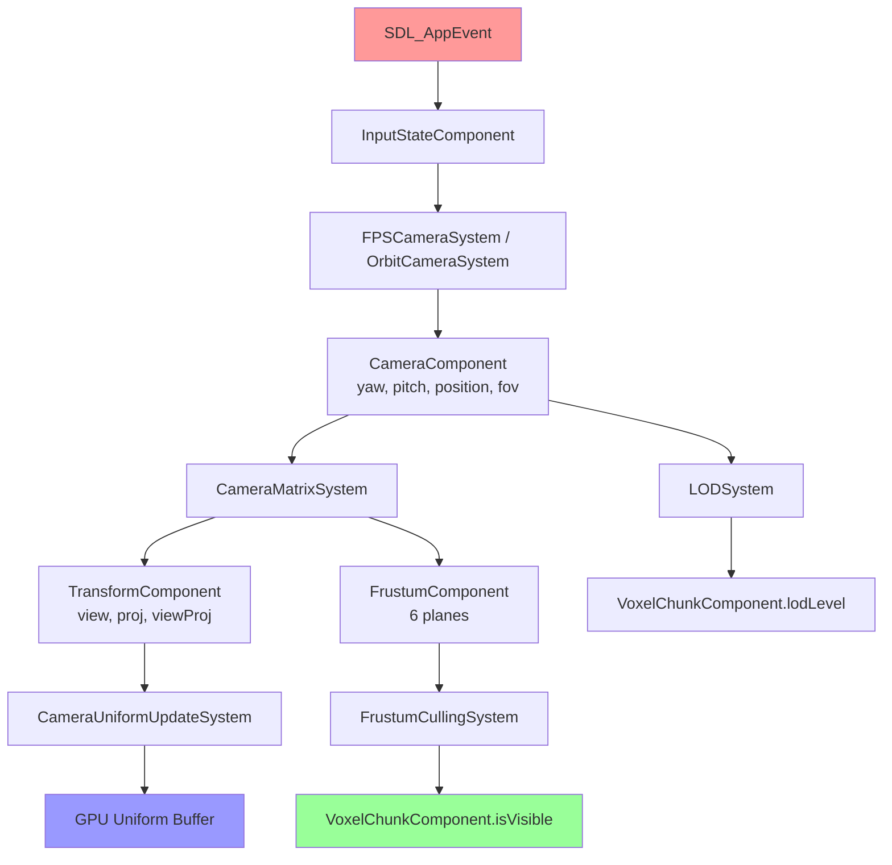
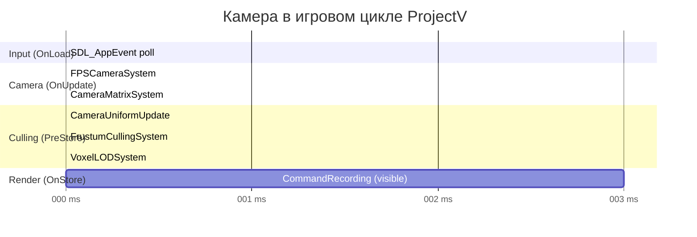
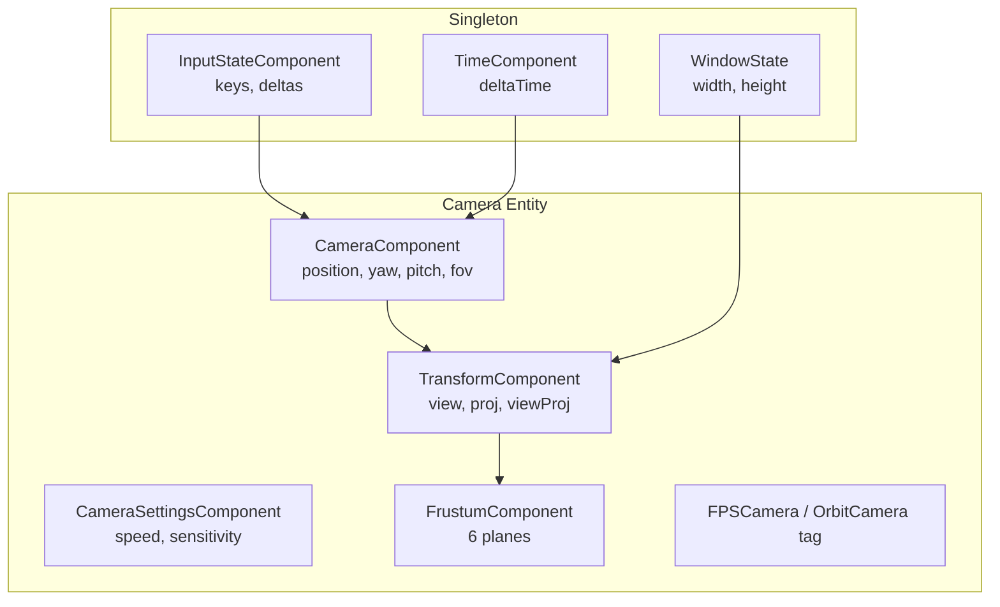

# Camera Controller для Воксельного Движка ProjectV

**🟡 Уровень 2: Средний** — Архитектурный документ ProjectV

## Оглавление

- [Введение](#введение)
- [Архитектурные требования](#архитектурные-требования)
- [ECS компоненты камеры](#ecs-компоненты-камеры)
- [Системы камеры](#системы-камеры)
- [Интеграция с SDL3 callback архитектурой](#интеграция-с-sdl3-callback-архитектурой)
- [Frustum Culling для воксельных чанков](#frustum-culling-для-воксельных-чанков)
- [Матрицы вида и проекции для Vulkan](#матрицы-вида-и-проекции-для-vulkan)
- [Режимы камеры](#режимы-камеры)
- [Производительность и оптимизации](#производительность-и-оптимизации)
- [Интеграция с экосистемой ProjectV](#интеграция-с-экосистемой-projectv)
- [Типичные проблемы и решения](#типичные-проблемы-и-решения)
- [Диаграммы](#диаграммы)

---

## Введение

В воксельном движке камера — это **"First Class Citizen"**. Она не просто отображает мир: она управляет тем, какие чанки
загружаются, с каким LOD уровнем они рендерятся и какая физика активна. Неправильная архитектура камеры влечёт за собой
stuttering, неправильный frustum culling и overhead от обработки невидимой геометрии.

**Проблемы naive реализации:**

- Камера обновляется каждый кадр независимо от физики → рассинхронизация с симуляцией
- Матрица вида пересчитывается в нескольких системах → race conditions в многопоточном рендеринге
- Frustum не обновляется после изменения FOV/размера окна → неверный culling

**Решение ProjectV:** Камера как ECS entity с чёткими компонентами и системами.

---

## Архитектурные требования

### 1. Единый источник истины

- Все матрицы вида/проекции берутся из одного компонента
- Обновление матриц — строго в одной системе (`CameraMatrixSystem`)
- Frustum вычисляется из матриц, не отдельно

### 2. Разделение ввода и состояния

- `InputStateComponent` — сырой ввод (клавиши, мышь)
- `CameraComponent` — математическое состояние (позиция, ориентация)
- `CameraSettingsComponent` — конфигурация (чувствительность, скорость)

### 3. Интеграция с воксельным миром

- Камера должна поставлять frustum для culling чанков
- Позиция камеры определяет активную зону загрузки чанков
- LOD уровни чанков вычисляются от позиции камеры

---

## ECS компоненты камеры

### CameraComponent

Математическое состояние камеры — позиция, ориентация, параметры проекции:

```cpp
struct CameraComponent {
    // Позиция и ориентация
    glm::vec3 position = {0.0f, 5.0f, 10.0f};
    float yaw   = 0.0f;    // Поворот по Y (влево/вправо)
    float pitch = 0.0f;    // Поворот по X (вверх/вниз)

    // Параметры проекции
    float fov       = glm::radians(60.0f);  // Field of View (радианы)
    float nearPlane = 0.1f;
    float farPlane  = 1000.0f;

    // Ограничения pitch (-89..+89 градусов)
    float maxPitch = glm::radians(89.0f);

    // Вычисленные векторы (обновляются CameraMatrixSystem)
    glm::vec3 forward = {0.0f, 0.0f, -1.0f};
    glm::vec3 right   = {1.0f, 0.0f,  0.0f};
    glm::vec3 up      = {0.0f, 1.0f,  0.0f};

    // Получение кватерниона из yaw/pitch
    glm::quat getRotation() const {
        return glm::normalize(
            glm::angleAxis(yaw,   glm::vec3(0, 1, 0)) *
            glm::angleAxis(pitch, glm::vec3(1, 0, 0))
        );
    }
};
```

### TransformComponent

Матрицы для GPU — обновляются каждый кадр:

```cpp
struct TransformComponent {
    glm::mat4 view       = glm::mat4(1.0f);
    glm::mat4 projection = glm::mat4(1.0f);
    glm::mat4 viewProj   = glm::mat4(1.0f);  // view * proj

    // Для шейдеров: uniform buffer с обеими матрицами
    struct GPUData {
        glm::mat4 view;
        glm::mat4 proj;
        glm::mat4 viewProj;
        glm::vec4 cameraPos;   // w не используется
        glm::vec4 nearFarFov;  // x=near, y=far, z=fov, w=aspect
    };

    GPUData toGPU(const CameraComponent& cam, float aspect) const {
        return {
            .view       = view,
            .proj       = projection,
            .viewProj   = viewProj,
            .cameraPos  = glm::vec4(cam.position, 0.0f),
            .nearFarFov = glm::vec4(cam.nearPlane, cam.farPlane, cam.fov, aspect)
        };
    }
};
```

### CameraSettingsComponent

Конфигурация управления камерой:

```cpp
struct CameraSettingsComponent {
    float mouseSensitivity   = 0.002f;  // Радиан/пиксель
    float movementSpeed      = 10.0f;   // Юниты/секунда
    float sprintMultiplier   = 3.0f;    // Множитель при зажатом Shift
    float scrollSensitivity  = 2.0f;    // Юниты/тик скролла

    bool  invertY            = false;
    bool  mouseCaptured      = false;

    // Для воксельного мира: влияет на зону загрузки
    float chunkLoadRadius    = 8.0f;    // В единицах чанков
    float chunkUnloadRadius  = 12.0f;
};
```

### InputStateComponent

Сырое состояние ввода — заполняется `SDL_AppEvent`:

```cpp
struct InputStateComponent {
    // Клавиши движения
    bool moveForward  = false;
    bool moveBackward = false;
    bool moveLeft     = false;
    bool moveRight    = false;
    bool moveUp       = false;
    bool moveDown     = false;
    bool sprint       = false;

    // Дельта мыши за кадр
    float mouseDeltaX = 0.0f;
    float mouseDeltaY = 0.0f;

    // Прокрутка
    float scrollDelta = 0.0f;

    // Сброс дельт после обработки
    void resetFrameDeltas() {
        mouseDeltaX = mouseDeltaY = scrollDelta = 0.0f;
    }
};
```

### FrustumComponent

Фрустум для culling — вычисляется из матриц:

```cpp
struct FrustumComponent {
    // 6 плоскостей: left, right, bottom, top, near, far
    struct Plane {
        glm::vec3 normal;
        float     distance;
    };
    std::array<Plane, 6> planes;

    // Проверка сферы на пересечение с фрустумом
    bool intersectsSphere(const glm::vec3& center, float radius) const {
        for (const auto& plane : planes) {
            if (glm::dot(plane.normal, center) + plane.distance + radius < 0.0f) {
                return false;
            }
        }
        return true;
    }

    // Проверка AABB на пересечение
    bool intersectsAABB(const glm::vec3& min, const glm::vec3& max) const {
        for (const auto& plane : planes) {
            glm::vec3 positive = min;
            if (plane.normal.x >= 0) positive.x = max.x;
            if (plane.normal.y >= 0) positive.y = max.y;
            if (plane.normal.z >= 0) positive.z = max.z;

            if (glm::dot(plane.normal, positive) + plane.distance < 0.0f) {
                return false;
            }
        }
        return true;
    }
};
```

---

## Системы камеры

### CameraInputSystem

Читает `InputStateComponent` и применяет к `CameraComponent`. Выполняется в `flecs::OnUpdate`:

```cpp
// Система обработки ввода камеры
world.system<CameraComponent, const InputStateComponent, const CameraSettingsComponent>(
    "CameraInputSystem")
    .kind(flecs::OnUpdate)
    .each( {

        ZoneScopedN("CameraInputSystem");

        // 1. Поворот по мыши
        if (settings.mouseCaptured) {
            cam.yaw   -= input.mouseDeltaX * settings.mouseSensitivity;
            cam.pitch -= input.mouseDeltaY * settings.mouseSensitivity *
                         (settings.invertY ? -1.0f : 1.0f);

            // Ограничение pitch
            cam.pitch = glm::clamp(cam.pitch, -cam.maxPitch, cam.maxPitch);
        }

        // 2. Движение
        // Вычисляем направление движения в мировых координатах
        glm::vec3 moveDir = glm::vec3(0.0f);

        if (input.moveForward)  moveDir += cam.forward;
        if (input.moveBackward) moveDir -= cam.forward;
        if (input.moveRight)    moveDir += cam.right;
        if (input.moveLeft)     moveDir -= cam.right;
        if (input.moveUp)       moveDir += glm::vec3(0, 1, 0);
        if (input.moveDown)     moveDir -= glm::vec3(0, 1, 0);

        if (glm::length(moveDir) > 0.001f) {
            float speed = settings.movementSpeed *
                          (input.sprint ? settings.sprintMultiplier : 1.0f);

            // Получаем deltaTime из мирового синглтона
            const auto* time = cam.world().get<TimeComponent>();
            cam.position += glm::normalize(moveDir) * speed *
                             static_cast<float>(time->deltaTime);
        }

        // 3. Прокрутка — изменение FOV или скорости
        if (std::abs(input.scrollDelta) > 0.001f) {
            cam.fov = glm::clamp(
                cam.fov - input.scrollDelta * settings.scrollSensitivity * 0.01f,
                glm::radians(10.0f),
                glm::radians(120.0f)
            );
        }
    });
```

### CameraMatrixSystem

Пересчитывает все матрицы на основе `CameraComponent`. Выполняется после `CameraInputSystem`:

```cpp
world.system<TransformComponent, CameraComponent, FrustumComponent>(
    "CameraMatrixSystem")
    .kind(flecs::OnUpdate)
    .each( {

        ZoneScopedN("CameraMatrixSystem");

        // 1. Обновляем векторы из углов Эйлера
        glm::quat rot = cam.getRotation();
        cam.forward = glm::normalize(rot * glm::vec3(0, 0, -1));
        cam.right   = glm::normalize(rot * glm::vec3(1, 0,  0));
        cam.up      = glm::normalize(rot * glm::vec3(0, 1,  0));

        // 2. Матрица вида
        transform.view = glm::lookAt(
            cam.position,
            cam.position + cam.forward,
            glm::vec3(0, 1, 0)
        );

        // 3. Матрица проекции (с Vulkan Y-flip)
        // SDL даёт размер в пикселях — получаем через синглтон
        const auto* window = e.world().get<WindowState>();
        float aspect = static_cast<float>(window->width) /
                       static_cast<float>(window->height);

        transform.projection = glm::perspective(cam.fov, aspect,
                                                cam.nearPlane, cam.farPlane);
        // Vulkan Y-down: инвертируем Y проекции
        transform.projection[1][1] *= -1.0f;

        // 4. ViewProj = Projection * View
        transform.viewProj = transform.projection * transform.view;

        // 5. Обновляем фрустум из viewProj
        extractFrustumPlanes(transform.viewProj, frustum);
    });

// Извлечение плоскостей фрустума методом Gribb-Hartmann
void extractFrustumPlanes(const glm::mat4& vp, FrustumComponent& frustum) {
    // Left
    frustum.planes[0].normal   = glm::vec3(vp[0][3] + vp[0][0],
                                           vp[1][3] + vp[1][0],
                                           vp[2][3] + vp[2][0]);
    frustum.planes[0].distance = vp[3][3] + vp[3][0];
    // Right
    frustum.planes[1].normal   = glm::vec3(vp[0][3] - vp[0][0],
                                           vp[1][3] - vp[1][0],
                                           vp[2][3] - vp[2][0]);
    frustum.planes[1].distance = vp[3][3] - vp[3][0];
    // Bottom
    frustum.planes[2].normal   = glm::vec3(vp[0][3] + vp[0][1],
                                           vp[1][3] + vp[1][1],
                                           vp[2][3] + vp[2][1]);
    frustum.planes[2].distance = vp[3][3] + vp[3][1];
    // Top
    frustum.planes[3].normal   = glm::vec3(vp[0][3] - vp[0][1],
                                           vp[1][3] - vp[1][1],
                                           vp[2][3] - vp[2][1]);
    frustum.planes[3].distance = vp[3][3] - vp[3][1];
    // Near
    frustum.planes[4].normal   = glm::vec3(vp[0][2], vp[1][2], vp[2][2]);
    frustum.planes[4].distance = vp[3][2];
    // Far
    frustum.planes[5].normal   = glm::vec3(vp[0][3] - vp[0][2],
                                           vp[1][3] - vp[1][2],
                                           vp[2][3] - vp[2][2]);
    frustum.planes[5].distance = vp[3][3] - vp[3][2];

    // Нормализация плоскостей
    for (auto& plane : frustum.planes) {
        float len = glm::length(plane.normal);
        plane.normal   /= len;
        plane.distance /= len;
    }
}
```

### CameraUniformUpdateSystem

Загружает данные камеры в GPU uniform buffer:

```cpp
world.system<const TransformComponent, const CameraComponent>(
    "CameraUniformUpdateSystem")
    .kind(flecs::PreStore)  // До записи командных буферов рендеринга
    .each( {
        ZoneScopedN("CameraUniformUpdate");

        const auto* window = cam.world().get<WindowState>();
        float aspect = static_cast<float>(window->width) /
                       static_cast<float>(window->height);

        TransformComponent::GPUData gpuData = transform.toGPU(cam, aspect);

        // Копируем в mapped uniform buffer
        auto* vkCtx = cam.world().get<VulkanContext>();
        memcpy(vkCtx->cameraUniformMapped, &gpuData, sizeof(gpuData));

        TracyPlot("CameraUniformUploads", 1.0f);
    });
```

---

## Интеграция с SDL3 callback архитектурой

### SDL_AppEvent: обработка мыши и клавиш

```cpp
SDL_AppResult SDL_AppEvent(void* appstate, SDL_Event* event) {
    AppState* state = static_cast<AppState*>(appstate);

    // Получаем InputStateComponent из ECS
    auto inputEntity = state->world->lookup("global_input");
    auto* input = inputEntity.get_mut<InputStateComponent>();
    auto* settings = state->cameraEntity.get_mut<CameraSettingsComponent>();

    switch (event->type) {
        // --- Клавиатура ---
        case SDL_EVENT_KEY_DOWN:
        case SDL_EVENT_KEY_UP: {
            bool pressed = (event->type == SDL_EVENT_KEY_DOWN);
            switch (event->key.key) {
                case SDLK_W:      input->moveForward  = pressed; break;
                case SDLK_S:      input->moveBackward = pressed; break;
                case SDLK_A:      input->moveLeft     = pressed; break;
                case SDLK_D:      input->moveRight    = pressed; break;
                case SDLK_SPACE:  input->moveUp       = pressed; break;
                case SDLK_LCTRL: input->moveDown      = pressed; break;
                case SDLK_LSHIFT: input->sprint       = pressed; break;

                // Захват/освобождение мыши
                case SDLK_F1:
                    if (pressed) {
                        settings->mouseCaptured = !settings->mouseCaptured;
                        SDL_SetRelativeMouseMode(
                            settings->mouseCaptured ? SDL_TRUE : SDL_FALSE);
                    }
                    break;

                case SDLK_ESCAPE:
                    if (pressed && settings->mouseCaptured) {
                        settings->mouseCaptured = false;
                        SDL_SetRelativeMouseMode(SDL_FALSE);
                    }
                    break;
            }
            break;
        }

        // --- Мышь ---
        case SDL_EVENT_MOUSE_MOTION:
            if (settings->mouseCaptured) {
                input->mouseDeltaX += event->motion.xrel;
                input->mouseDeltaY += event->motion.yrel;
            }
            break;

        case SDL_EVENT_MOUSE_WHEEL:
            input->scrollDelta += event->wheel.y;
            break;

        // --- Изменение размера окна ---
        case SDL_EVENT_WINDOW_RESIZED: {
            auto* window = state->world->get_mut<WindowState>();
            window->width  = event->window.data1;
            window->height = event->window.data2;
            // Матрицы пересчитаются на следующем кадре автоматически
            break;
        }

        case SDL_EVENT_QUIT:
            return SDL_APP_SUCCESS;
    }

    return SDL_APP_CONTINUE;
}
```

### SDL_AppIterate: порядок систем

```cpp
SDL_AppResult SDL_AppIterate(void* appstate) {
    AppState* state = static_cast<AppState*>(appstate);

    // Обновление deltaTime
    static uint64_t lastCounter = SDL_GetPerformanceCounter();
    uint64_t now = SDL_GetPerformanceCounter();
    double dt = static_cast<double>(now - lastCounter) /
                static_cast<double>(SDL_GetPerformanceFrequency());
    lastCounter = now;
    dt = std::min(dt, 0.1);  // Clamp

    state->world->set<TimeComponent>({.deltaTime = dt});

    // ECS прогрессирует: CameraInputSystem → CameraMatrixSystem → Render
    state->world->progress(static_cast<float>(dt));

    // Сброс frame-delta ввода ПОСЛЕ прогрессирования ECS
    auto inputEntity = state->world->lookup("global_input");
    inputEntity.get_mut<InputStateComponent>()->resetFrameDeltas();

    return SDL_APP_CONTINUE;
}
```

---

## Frustum Culling для воксельных чанков

### Система отсечения

Frustum culling выполняется в отдельной системе, которая работает параллельно с помощью `multi_threaded()`:

```cpp
world.system<VoxelChunkComponent, const FrustumComponent>(
    "VoxelFrustumCullingSystem")
    .kind(flecs::PreStore)
    .term<const FrustumComponent>().singleton()  // Один фрустум для всех
    .multi_threaded()
    .iter( {

        ZoneScopedN("VoxelFrustumCulling");

        for (int i = 0; i < it.count(); i++) {
            auto& chunk = chunks[i];

            // AABB чанка в мировых координатах
            float chunkSize = chunk.voxelSize * static_cast<float>(chunk.SIZE);
            glm::vec3 chunkOrigin = glm::vec3(
                chunk.chunkX * chunkSize,
                chunk.chunkY * chunkSize,
                chunk.chunkZ * chunkSize
            );
            glm::vec3 chunkMax = chunkOrigin + glm::vec3(chunkSize);

            // Тест AABB против фрустума
            chunk.isVisible = frustum->intersectsAABB(chunkOrigin, chunkMax);

            TracyPlot("ChunksCulled", chunk.isVisible ? 0.0f : 1.0f);
        }

        // Статистика
        int visible = 0;
        for (int i = 0; i < it.count(); i++) {
            if (chunks[i].isVisible) visible++;
        }
        TracyPlot("VisibleChunks",  (float)visible);
        TracyPlot("TotalChunks",    (float)it.count());
        TracyPlot("CulledPercent",  100.0f * (1.0f - (float)visible / it.count()));
    });
```

### LOD на основе расстояния от камеры

```cpp
world.system<VoxelChunkComponent, const CameraComponent>(
    "VoxelLODSystem")
    .kind(flecs::PreStore)
    .term<const CameraComponent>().singleton()
    .multi_threaded()
    .iter( {

        ZoneScopedN("VoxelLOD");

        for (int i = 0; i < it.count(); i++) {
            if (!chunks[i].isVisible) continue;

            float chunkSize = chunks[i].voxelSize * static_cast<float>(chunks[i].SIZE);
            glm::vec3 chunkCenter = glm::vec3(
                chunks[i].chunkX * chunkSize + chunkSize * 0.5f,
                chunks[i].chunkY * chunkSize + chunkSize * 0.5f,
                chunks[i].chunkZ * chunkSize + chunkSize * 0.5f
            );
            float dist = glm::distance(cam->position, chunkCenter);

            // Выбор LOD уровня
            uint32_t newLOD = 0;
            if      (dist < 20.0f)  newLOD = 0;  // Полная детализация
            else if (dist < 50.0f)  newLOD = 1;  // Средняя
            else if (dist < 100.0f) newLOD = 2;  // Низкая
            else                    newLOD = 3;  // Минимальная

            if (newLOD != chunks[i].lodLevel) {
                chunks[i].lodLevel     = newLOD;
                chunks[i].needsRemesh  = true;
            }
        }
    });
```

---

## Матрицы вида и проекции для Vulkan

### Коррекция систем координат

Vulkan использует Y-Down, JoltPhysics — Y-Up. Камера живёт в пространстве Y-Up (JoltPhysics), поэтому при формировании
матрицы проекции необходим flip:

```cpp
// Стандартная GLM проекция (OpenGL-совместимая, Y-Up)
glm::mat4 proj = glm::perspective(fov, aspect, nearPlane, farPlane);

// Корректировка для Vulkan NDC (Y-Down, Z в [0..1])
proj[1][1] *= -1.0f;  // Инвертируем Y

// Результирующая матрица правильно работает с Vulkan
transform.projection = proj;
```

### Shader-side использование

```glsl
// Вершинный шейдер
layout(set = 0, binding = 0) uniform CameraUBO {
    mat4 view;
    mat4 proj;
    mat4 viewProj;
    vec4 cameraPos;
    vec4 nearFarFov;  // x=near, y=far, z=fov, w=aspect
} camera;

void main() {
    // Мировые координаты -> clip space
    gl_Position = camera.viewProj * vec4(inPosition, 1.0);
}
```

### Frustum culling в compute shader

Для GPU-driven pipeline frustum доступен через push constants или SSBO:

```glsl
// Compute shader для GPU culling
layout(std430, binding = 0) readonly buffer FrustumPlanes {
    vec4 planes[6];  // xyz=normal, w=distance
} frustum;

bool isChunkVisible(vec3 chunkMin, vec3 chunkMax) {
    for (int i = 0; i < 6; i++) {
        vec3 normal = frustum.planes[i].xyz;
        float dist  = frustum.planes[i].w;

        // Положительная вершина AABB
        vec3 positive = mix(chunkMin, chunkMax, greaterThanEqual(normal, vec3(0)));

        if (dot(normal, positive) + dist < 0.0) {
            return false;  // Чанк вне фрустума
        }
    }
    return true;
}
```

---

## Режимы камеры

### Тег-компонент для переключения режимов

```cpp
struct FPSCamera    {};  // FPS: WASD + мышь
struct OrbitCamera  {};  // Orbit: вращение вокруг точки
struct EditorCamera {};  // Editor: pan/zoom/orbit

// Переключение режима
void setCameraMode(flecs::entity cameraEntity, CameraMode mode) {
    cameraEntity.remove<FPSCamera>();
    cameraEntity.remove<OrbitCamera>();
    cameraEntity.remove<EditorCamera>();

    switch (mode) {
        case CameraMode::FPS:    cameraEntity.add<FPSCamera>();    break;
        case CameraMode::Orbit:  cameraEntity.add<OrbitCamera>();  break;
        case CameraMode::Editor: cameraEntity.add<EditorCamera>(); break;
    }
}
```

### FPS Camera System

```cpp
world.system<CameraComponent, const InputStateComponent, const CameraSettingsComponent,
             const FPSCamera>("FPSCameraSystem")
    .kind(flecs::OnUpdate)
    .each( {

        // FPS: движение по forward/right без Y-компоненты
        glm::vec3 flatForward = glm::normalize(
            glm::vec3(cam.forward.x, 0.0f, cam.forward.z));
        glm::vec3 flatRight = glm::normalize(
            glm::vec3(cam.right.x,   0.0f, cam.right.z));

        glm::vec3 move = glm::vec3(0.0f);
        if (input.moveForward)  move += flatForward;
        if (input.moveBackward) move -= flatForward;
        if (input.moveLeft)     move -= flatRight;
        if (input.moveRight)    move += flatRight;
        if (input.moveUp)       move.y += 1.0f;
        if (input.moveDown)     move.y -= 1.0f;

        const auto* time = cam.world().get<TimeComponent>();
        float speed = settings.movementSpeed *
                      (input.sprint ? settings.sprintMultiplier : 1.0f);

        if (glm::length(move) > 0.001f) {
            cam.position += glm::normalize(move) * speed *
                            static_cast<float>(time->deltaTime);
        }
    });
```

### Orbit Camera System

```cpp
struct OrbitCameraState {
    glm::vec3 target    = {0.0f, 0.0f, 0.0f};
    float     distance  = 20.0f;
    float     minDist   = 2.0f;
    float     maxDist   = 200.0f;
};

world.system<CameraComponent, OrbitCameraState,
             const InputStateComponent, const OrbitCamera>("OrbitCameraSystem")
    .kind(flecs::OnUpdate)
    .each( {

        // Вращение вокруг target
        if (std::abs(input.mouseDeltaX) > 0.001f ||
            std::abs(input.mouseDeltaY) > 0.001f) {
            cam.yaw   -= input.mouseDeltaX * 0.005f;
            cam.pitch -= input.mouseDeltaY * 0.005f;
            cam.pitch  = glm::clamp(cam.pitch, -cam.maxPitch, cam.maxPitch);
        }

        // Зум через скролл
        if (std::abs(input.scrollDelta) > 0.001f) {
            orbit.distance = glm::clamp(
                orbit.distance - input.scrollDelta * 2.0f,
                orbit.minDist, orbit.maxDist
            );
        }

        // Позиция камеры = target + сферические координаты
        glm::quat rot = cam.getRotation();
        glm::vec3 offset = rot * glm::vec3(0, 0, orbit.distance);
        cam.position = orbit.target + offset;
    });
```

---

## Производительность и оптимизации

### Кэширование матриц

Матрицы пересчитываются только при изменении:

```cpp
struct CameraComponent {
    // ... предыдущие поля ...

    // Для dirty-flagging
    bool matricesDirty = true;
    glm::vec3 lastPosition = {};
    float     lastYaw = 0.0f, lastPitch = 0.0f, lastFov = 0.0f;

    bool needsRebuild(const glm::vec3& pos, float y, float p, float f) const {
        return glm::distance(pos, lastPosition) > 0.0001f ||
               std::abs(y - lastYaw)   > 0.0001f ||
               std::abs(p - lastPitch) > 0.0001f ||
               std::abs(f - lastFov)   > 0.0001f;
    }
};
```

### Performance Metrics

| Операция                     | Целевое время | Мониторинг |
|------------------------------|---------------|------------|
| CameraInputSystem            | < 0.1ms       | Tracy CPU  |
| CameraMatrixSystem           | < 0.1ms       | Tracy CPU  |
| FrustumCulling (1000 чанков) | < 0.5ms       | Tracy CPU  |
| LOD Update (1000 чанков)     | < 1ms         | Tracy CPU  |
| GPU uniform upload           | < 0.05ms      | Tracy CPU  |

---

## Интеграция с экосистемой ProjectV

### Инициализация в SDL_AppInit

```cpp
SDL_AppResult SDL_AppInit(void** appstate, int argc, char* argv[]) {
    auto* state = new AppState();
    *appstate = state;

    state->world = new flecs::world();
    flecs::world& world = *state->world;

    // Регистрация компонентов
    world.component<CameraComponent>();
    world.component<TransformComponent>();
    world.component<CameraSettingsComponent>();
    world.component<InputStateComponent>();
    world.component<FrustumComponent>();
    world.component<OrbitCameraState>();

    // Теги режимов
    world.component<FPSCamera>();
    world.component<OrbitCamera>();
    world.component<EditorCamera>();

    // Синглтон для ввода
    world.entity("global_input").set<InputStateComponent>({});

    // Синглтон состояния окна
    int w, h;
    SDL_GetWindowSize(state->window, &w, &h);
    world.set<WindowState>({.width = w, .height = h});

    // Создание камеры
    state->cameraEntity = world.entity("main_camera")
        .set<CameraComponent>({
            .position = {0.0f, 10.0f, 20.0f},
            .yaw      = 0.0f,
            .pitch    = glm::radians(-15.0f)
        })
        .set<TransformComponent>({})
        .set<CameraSettingsComponent>({
            .movementSpeed = 15.0f,
            .chunkLoadRadius = 8.0f
        })
        .set<FrustumComponent>({})
        .add<FPSCamera>();  // Режим по умолчанию

    // Регистрация систем
    world.system<CameraComponent, const InputStateComponent,
                 const CameraSettingsComponent, const FPSCamera>(
        "FPSCameraSystem").kind(flecs::OnUpdate).each(fpsCameraUpdate);

    world.system<TransformComponent, CameraComponent, FrustumComponent>(
        "CameraMatrixSystem").kind(flecs::OnUpdate).each(cameraMatrixUpdate);

    world.system<const TransformComponent, const CameraComponent>(
        "CameraUniformUpdateSystem").kind(flecs::PreStore).each(cameraUniformUpdate);

    world.system<VoxelChunkComponent, const FrustumComponent>(
        "VoxelFrustumCullingSystem")
        .kind(flecs::PreStore)
        .term<const FrustumComponent>().singleton()
        .multi_threaded()
        .iter(frustumCullingUpdate);

    return SDL_APP_CONTINUE;
}
```

### Tracy Profiling Integration

```cpp
// В CameraMatrixSystem добавляем детальные зоны
void cameraMatrixUpdate(flecs::entity e, TransformComponent& t, CameraComponent& cam, FrustumComponent& f) {
    ZoneScopedN("CameraMatrixSystem");

    {
        ZoneScopedN("VectorRecalc");
        // Пересчёт forward/right/up
    }
    {
        ZoneScopedN("ViewMatrix");
        t.view = glm::lookAt(cam.position, cam.position + cam.forward, {0,1,0});
    }
    {
        ZoneScopedN("ProjMatrix");
        // Матрица проекции с Vulkan Y-flip
    }
    {
        ZoneScopedN("FrustumExtract");
        extractFrustumPlanes(t.viewProj, f);
    }

    TracyPlot("CameraYaw",      cam.yaw);
    TracyPlot("CameraPitch",    cam.pitch);
    TracyPlot("CameraFOV_deg",  glm::degrees(cam.fov));
    TracyPlot("CameraPosX",     cam.position.x);
    TracyPlot("CameraPosY",     cam.position.y);
    TracyPlot("CameraPosZ",     cam.position.z);
}
```

---

## Типичные проблемы и решения

### Проблема 1: Дрожание камеры при высоком FPS

**Симптомы:** Заметные рывки при движении >200 FPS.

**Причина:** `mouseDeltaX/Y` накапливается за несколько тиков ввода, но применяется раз в кадр.

**Решение:**

```cpp
// В SDL_AppEvent: НЕ накапливаем, а сохраняем мгновенную дельту
case SDL_EVENT_MOUSE_MOTION:
    // Нормализуем по времени: дельта = пиксели / dt_ms
    float dtMs = state->lastFrameTimeMs;
    input->mouseDeltaX = event->motion.xrel * (16.67f / dtMs);  // Нормализуем к 60 FPS
    input->mouseDeltaY = event->motion.yrel * (16.67f / dtMs);
    break;
```

### Проблема 2: Неправильный frustum при изменении окна

**Симптомы:** Чанки отсекаются некорректно после resize.

**Причина:** Матрица проекции использует старый aspect ratio.

**Решение:**

```cpp
// Frustum обновляется каждый кадр из WindowState
// В SDL_AppEvent при resize:
case SDL_EVENT_WINDOW_RESIZED:
    world->set<WindowState>({.width = event->window.data1,
                             .height = event->window.data2});
    // CameraMatrixSystem автоматически использует актуальный WindowState
    break;
```

### Проблема 3: Камера проваливается сквозь воксели

**Симптомы:** При движении вниз камера проходит сквозь геометрию.

**Причина:** FPS-камера не учитывает физические коллайдеры.

**Решение:**

```cpp
// Добавить PhysicsBody к камере в режиме FPS
world.entity("main_camera")
    .set<PhysicsBody>({
        .motion_type = JPH::EMotionType::Kinematic,
        // ...
    });

// FPSCameraSystem использует CharacterVirtual Jolt
// вместо прямого изменения позиции
void fpsCameraUpdate(...) {
    JPH::CharacterVirtual* character = e.get<JoltCharacterComponent>()->character;
    character->SetLinearVelocity(JPH::Vec3(moveDir.x, moveDir.y, moveDir.z) * speed);
    // Позиция обновится через PhysicsToECSSyncSystem
}
```

### Проблема 4: Gimbal lock при крайних углах pitch

**Симптомы:** При pitch ≈ ±90° камера начинает вращаться хаотично.

**Причина:** Эйлеровы углы + lookAt имеют gimbal lock.

**Решение — уже предусмотрено в архитектуре:**

```cpp
// pitch ограничен ±89 градусами в CameraInputSystem
cam.pitch = glm::clamp(cam.pitch, -cam.maxPitch, cam.maxPitch);
// maxPitch = radians(89), что исключает gimbal lock
```

---

## Диаграммы

### Поток данных камеры



### Временная диаграмма систем камеры



### Иерархия ECS компонентов



