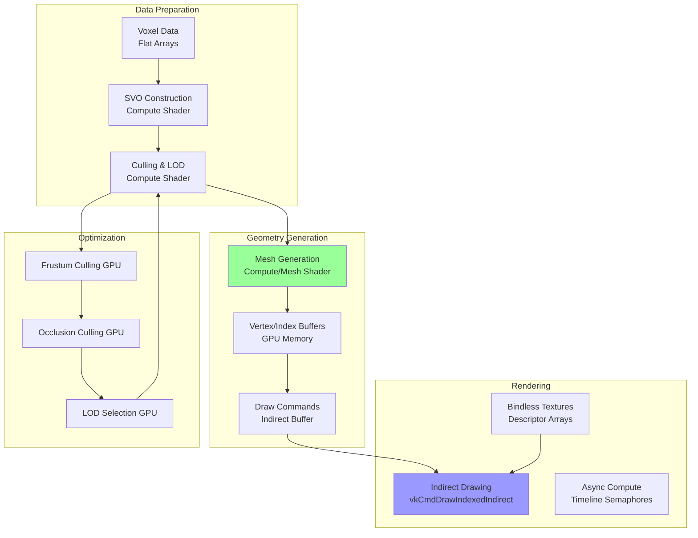
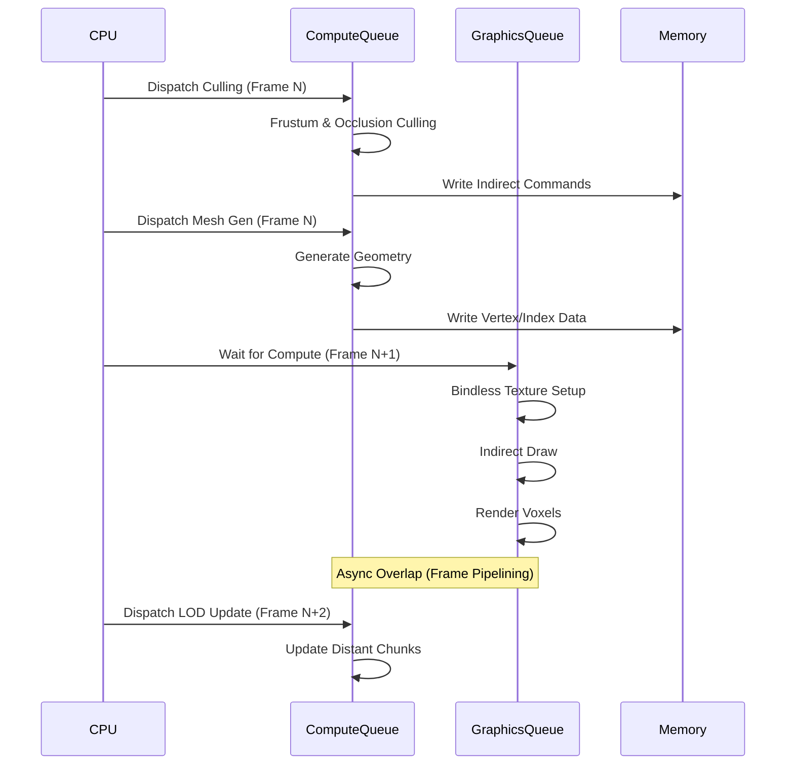
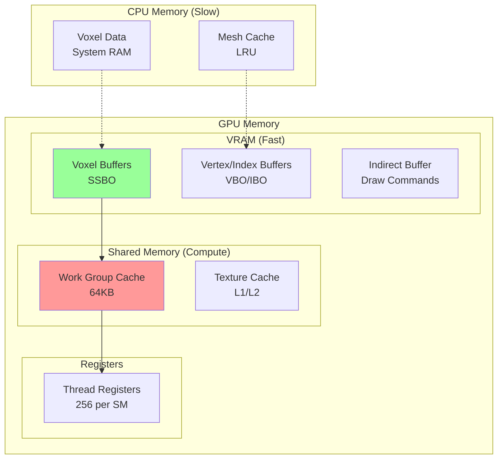

# GPU-Driven Воксельный Рендеринг ProjectV

**🔴 Уровень 3: Продвинутый** — Архитектурный документ ProjectV

## Оглавление

- [Введение](#введение)
- [Проблемы традиционного рендеринга вокселей](#проблемы-традиционного-рендеринга-вокселей)
- [Архитектура GPU-Driven Pipeline](#архитектура-gpu-driven-pipeline)
- [Детальная реализация](#детальная-реализация)
- [Compute Shaders для генерации геометрии](#compute-shaders-для-генерации-геометрии)
- [Bindless Rendering для текстур вокселей](#bindless-rendering-для-текстур-вокселей)
- [Sparse Voxel Octree (SVO)](#sparse-voxel-octree-svo)
- [Async Compute Pipeline](#async-compute-pipeline)
- [Производительность и оптимизации](#производительность-и-оптимизации)
- [Интеграция с экосистемой ProjectV](#интеграция-с-экосистемой-projectv)
- [Типичные проблемы и решения](#типичные-проблемы-и-решения)
- [Диаграммы](#диаграммы)

---

## Введение

ProjectV как воксельный движок рендерит **миллионы вокселей в реальном времени**. Традиционные подходы (CPU-based mesh
generation) не масштабируются:

- **CPU Bottleneck**: Генерация мешей на CPU для 1M+ вокселей занимает >16ms
- **Memory Bandwidth**: Передача вершин с CPU на GPU ограничивает throughput
- **Draw Calls**: Тысячи draw calls для отдельных чанков

**Решение ProjectV**: Полностью **GPU-Driven pipeline**:

1. **Compute Shaders** генерируют геометрию на GPU
2. **Indirect Drawing** минимизирует draw calls
3. **Bindless Rendering** позволяет тысячи текстур без overhead
4. **Sparse Voxel Octree** эффективно хранит разреженные воксельные миры
5. **Async Compute** параллелизирует генерацию и рендеринг

---

## Проблемы традиционного рендеринга вокселей

### 1. CPU Mesh Generation

```cpp
// Традиционный подход (плохо масштабируется)
void generateVoxelMeshCPU(const VoxelChunk& chunk, std::vector<Vertex>& vertices) {
    for (int x = 0; x < CHUNK_SIZE; x++) {
        for (int y = 0; y < CHUNK_SIZE; y++) {
            for (int z = 0; z < CHUNK_SIZE; z++) {
                if (chunk.isSolid(x, y, z)) {
                    // Проверка соседей (6 направлений)
                    if (!chunk.isSolid(x+1, y, z)) addQuad(vertices, RIGHT, ...);
                    if (!chunk.isSolid(x-1, y, z)) addQuad(vertices, LEFT, ...);
                    // ... и так для всех граней
                }
            }
        }
    }
    // Передача vertices в GPU буфер (дорого!)
}
```

**Проблемы:**

- **O(n³) сложность** — 16³ чанк = 4096 итераций
- **Memory transfer** — vertices → staging buffer → GPU
- **Single-threaded** — плохо параллелизуется на CPU

### 2. Draw Call Overhead

```cpp
// Тысячи draw calls (убийство производительности)
for (const auto& chunk : visibleChunks) {
    vkCmdBindVertexBuffers(cmd, 0, 1, &chunk.vertexBuffer, &offset);
    vkCmdBindIndexBuffer(cmd, chunk.indexBuffer, 0, VK_INDEX_TYPE_UINT32);
    vkCmdDrawIndexed(cmd, chunk.indexCount, 1, 0, 0, 0);
    // Повторить для 1000+ чанков
}
```

### 3. Texture Binding Overhead

```cpp
// Для каждого материала - свой descriptor set
for (const auto& material : materials) {
    vkCmdBindDescriptorSets(cmd, VK_PIPELINE_BIND_POINT_GRAPHICS,
                           pipelineLayout, 0, 1, &material.descriptorSet, 0, nullptr);
    // Рендеринг всех мешей с этим материалом
}
// При 100+ материалах - огромный overhead
```

---

## Архитектура GPU-Driven Pipeline

### Обзор пайплайна



### Преимущества GPU-Driven подхода

| Метрика          | CPU-Driven           | GPU-Driven            | Улучшение |
|------------------|----------------------|-----------------------|-----------|
| Mesh Generation  | 8-16ms (CPU)         | 0.5-2ms (GPU)         | 8-32x     |
| Draw Calls       | 1000+                | 1 (indirect)          | 1000x     |
| Memory Bandwidth | Высокая (CPU→GPU)    | Низкая (GPU only)     | 10-100x   |
| Scalability      | Линейно с ядрами CPU | Линейно с CUDA ядрами | Better    |
| LOD Updates      | CPU-bound (медленно) | GPU (параллельно)     | Instant   |

---

## Детальная реализация

### Структуры данных

```cpp
// Воксельные данные (SoA для cache locality)
struct VoxelData {
    // Плоские массивы для GPU-friendly доступа
    std::vector<uint32_t> voxelIDs;      // ID вокселей (материал + тип)
    std::vector<uint8_t> lightLevels;    // Уровень освещения
    std::vector<uint8_t> occlusion;      // Occlusion данные

    // Для SVO
    std::vector<uint64_t> octreeNodes;   // Сжатые узлы octree
    std::vector<uint32_t> nodeMaterials; // Материалы для leaf узлов
};

// GPU буферы
struct VoxelGPUResources {
    VkBuffer voxelBuffer;          // SSBO с воксельными данными
    VkBuffer octreeBuffer;         // SSBO с SVO
    VkBuffer indirectBuffer;       // Indirect draw commands
    VkBuffer counterBuffer;        // Atomic counters для compute shaders

    // Для mesh generation
    VkBuffer vertexBuffer;         // Output: vertices
    VkBuffer indexBuffer;          // Output: indices
    VkBuffer meshletBuffer;        // Для mesh shaders (опционально)
};

// Draw command (совместим с VkDrawIndexedIndirectCommand)
struct VoxelDrawCommand {
    uint32_t indexCount;
    uint32_t instanceCount;
    uint32_t firstIndex;
    int32_t vertexOffset;
    uint32_t firstInstance;

    // Дополнительные данные для вокселей
    uint32_t chunkID;
    uint32_t materialID;
    uint32_t LODLevel;
};
```

### Основной пайплайн

```cpp
class VoxelPipeline {
public:
    void renderFrame(VkCommandBuffer cmd, const Camera& camera) {
        // 1. Update voxel data (если были изменения)
        if (voxelDataDirty_) {
            updateVoxelBuffers(cmd);
        }

        // 2. Culling compute pass
        dispatchCullingCompute(cmd, camera);

        // 3. Mesh generation compute pass (async)
        dispatchMeshGenerationCompute(cmd);

        // 4. Wait for mesh generation (timeline semaphore)
        waitForMeshGeneration(cmd);

        // 5. Indirect rendering pass
        renderIndirect(cmd);
    }

private:
    VoxelGPUResources gpuResources_;
    VoxelData cpuVoxelData_;
    bool voxelDataDirty_ = true;

    // Timeline semaphores для async compute
    VkSemaphore computeTimelineSemaphore_;
    uint64_t computeTimelineValue_ = 0;
};
```

---

## Compute Shaders для генерации геометрии

### Алгоритм Marching Cubes на GPU

```glsl
// Compute shader для генерации мешей вокселей
#version 460
#extension GL_EXT_scalar_block_layout : require

layout(local_size_x = 8, local_size_y = 8, local_size_z = 8) in;

// Воксельные данные
layout(std430, binding = 0) readonly buffer VoxelBuffer {
    uint voxels[];
};

// Выходные буферы
layout(std430, binding = 1) writeonly buffer VertexBuffer {
    vec4 vertices[];
};

layout(std430, binding = 2) writeonly buffer IndexBuffer {
    uint indices[];
};

// Atomic counters
layout(std430, binding = 3) buffer CounterBuffer {
    atomic_uint vertexCount;
    atomic_uint indexCount;
};

// Таблица Marching Cubes (256 комбинаций)
shared uint mcEdgeTable[256];
shared vec3 mcVertexTable[256][15];

void main() {
    ivec3 voxelPos = ivec3(gl_GlobalInvocationID.xyz);

    // Получаем значения 8 соседних вокселей
    uint cubeIndex = 0;
    if (getVoxel(voxelPos + ivec3(0, 0, 0)) > 0) cubeIndex |= 1;
    if (getVoxel(voxelPos + ivec3(1, 0, 0)) > 0) cubeIndex |= 2;
    if (getVoxel(voxelPos + ivec3(1, 0, 1)) > 0) cubeIndex |= 4;
    if (getVoxel(voxelPos + ivec3(0, 0, 1)) > 0) cubeIndex |= 8;
    if (getVoxel(voxelPos + ivec3(0, 1, 0)) > 0) cubeIndex |= 16;
    if (getVoxel(voxelPos + ivec3(1, 1, 0)) > 0) cubeIndex |= 32;
    if (getVoxel(voxelPos + ivec3(1, 1, 1)) > 0) cubeIndex |= 64;
    if (getVoxel(voxelPos + ivec3(0, 1, 1)) > 0) cubeIndex |= 128;

    // Если куб полностью пустой или полностью заполненный - пропускаем
    if (mcEdgeTable[cubeIndex] == 0) return;

    // Генерируем вершины и индексы
    uint edgeMask = mcEdgeTable[cubeIndex];

    // Для каждого ребра в маске
    for (int i = 0; i < 12; i++) {
        if ((edgeMask & (1 << i)) != 0) {
            // Интерполяция позиции вершины
            vec3 vertexPos = interpolateVertex(i, voxelPos);

            // Atomic добавление вершины
            uint vertexIdx = atomicAdd(vertexCount, 1);
            vertices[vertexIdx] = vec4(vertexPos, 1.0);

            // Добавление индекса (триангуляция)
            // ... логика триангуляции Marching Cubes
        }
    }

    memoryBarrierBuffer();
}
```

### Оптимизации для вокселей

```glsl
// Greedy Meshing - объединение одинаковых граней
void greedyMeshing(ivec3 chunkPos) {
    // Scanline алгоритм на GPU
    for (int axis = 0; axis < 3; axis++) {
        ivec3 pos = ivec3(0);

        while (pos.x < CHUNK_SIZE) {
            // Находим старт квада
            uint startMaterial = getVoxelMaterial(chunkPos + pos);

            // Расширяем квад по ширине
            int width = 1;
            while (pos.x + width < CHUNK_SIZE &&
                   getVoxelMaterial(chunkPos + pos + ivec3(width, 0, 0)) == startMaterial) {
                width++;
            }

            // Расширяем квад по высоте
            int height = 1;
            bool canExpandHeight = true;
            while (canExpandHeight && pos.y + height < CHUNK_SIZE) {
                for (int w = 0; w < width; w++) {
                    if (getVoxelMaterial(chunkPos + pos + ivec3(w, height, 0)) != startMaterial) {
                        canExpandHeight = false;
                        break;
                    }
                }
                if (canExpandHeight) height++;
            }

            // Добавляем квад
            addQuad(pos, width, height, axis, startMaterial);

            // Продолжаем сканирование
            pos.x += width;
        }
    }
}

// Преимущества Greedy Meshing:
// - Уменьшение количества вершин на 50-90%
// - Более cache-friendly рендеринг
// - Меньше overdraw
```

### Mesh Shaders (VK_EXT_mesh_shader)

```cpp
// Конфигурация mesh shaders для вокселей
VkMeshShaderPropertiesEXT meshProps = {};
meshProps.maxTaskWorkGroupSize[0] = 32;
meshProps.maxTaskWorkGroupSize[1] = 1;
meshProps.maxTaskWorkGroupSize[2] = 1;
meshProps.maxMeshWorkGroupSize[0] = 128;
meshProps.maxMeshWorkGroupSize[1] = 1;
meshProps.maxMeshWorkGroupSize[2] = 1;
meshProps.maxMeshOutputVertices = 256;
meshProps.maxMeshOutputPrimitives = 512;

// Task shader распределяет работу
taskShaderCode = R"glsl(
#version 460
#extension GL_EXT_mesh_shader : enable

taskPayloadSharedEXT uint chunkData[32];

void main() {
    // Каждая task группа обрабатывает один чанк
    uint chunkID = gl_WorkGroupID.x;

    // Culling на уровне task shader
    if (!isChunkVisible(chunkID)) {
        return;  // Пропускаем невидимые чанки
    }

    // Передаём данные в mesh shader
    chunkData[gl_LocalInvocationIndex] = chunkID;

    // Emit mesh tasks
    EmitMeshTasksEXT(1, 1, 1);  // Одна mesh группа на чанк
}
)glsl";

// Mesh shader генерирует геометрию
meshShaderCode = R"glsl(
#version 460
#extension GL_EXT_mesh_shader : enable

taskPayloadSharedEXT uint chunkData[32];

layout(location = 0) out vec3 outPosition[];
layout(location = 1) out vec2 outUV[];
layout(location = 2) out vec3 outNormal[];

void main() {
    uint chunkID = chunkData[0];

    // Генерация меша для чанка
    uint vertexCount = generateVoxelMesh(chunkID, outPosition, outUV, outNormal);
    uint primitiveCount = vertexCount / 3;

    // Set mesh output
    SetMeshOutputsEXT(vertexCount, primitiveCount);

    // Генерация индексов (треугольный список)
    for (uint i = 0; i < primitiveCount; i++) {
        gl_PrimitiveTriangleIndicesEXT[i] = uvec3(i*3, i*3+1, i*3+2);
    }
}
)glsl";
```

---

## Bindless Rendering для текстур вокселей

### Descriptor Indexing

```cpp
// Инициализация bindless descriptor array
void initBindlessTextures(VkDevice device, VkDescriptorPool descriptorPool) {
    // Запрашиваем поддержку descriptor indexing
    VkPhysicalDeviceDescriptorIndexingFeatures indexingFeatures = {
        .sType = VK_STRUCTURE_TYPE_PHYSICAL_DEVICE_DESCRIPTOR_INDEXING_FEATURES,
        .descriptorBindingPartiallyBound = VK_TRUE,
        .runtimeDescriptorArray = VK_TRUE,
        .shaderSampledImageArrayNonUniformIndexing = VK_TRUE
    };

    // Создаём descriptor set layout с unbounded array
    VkDescriptorSetLayoutBinding binding = {
        .binding = 0,
        .descriptorType = VK_DESCRIPTOR_TYPE_COMBINED_IMAGE_SAMPLER,
        .descriptorCount = 1024,  // До 1024 текстур в массиве
        .stageFlags = VK_SHADER_STAGE_FRAGMENT_BIT | VK_SHADER_STAGE_COMPUTE_BIT
    };

    VkDescriptorBindingFlags flags =
        VK_DESCRIPTOR_BINDING_PARTIALLY_BOUND_BIT |
        VK_DESCRIPTOR_BINDING_VARIABLE_DESCRIPTOR_COUNT_BIT;

    VkDescriptorSetLayoutBindingFlagsCreateInfo flagsInfo = {
        .sType = VK_STRUCTURE_TYPE_DESCRIPTOR_SET_LAYOUT_BINDING_FLAGS_CREATE_INFO,
        .bindingCount = 1,
        .pBindingFlags = &flags
    };

    VkDescriptorSetLayoutCreateInfo layoutInfo = {
        .sType = VK_STRUCTURE_TYPE_DESCRIPTOR_SET_LAYOUT_CREATE_INFO,
        .pNext = &flagsInfo,
        .bindingCount = 1,
        .pBindings = &binding
    };

    vkCreateDescriptorSetLayout(device, &layoutInfo, nullptr, &bindlessLayout_);

    // Аллоцируем descriptor set
    VkDescriptorSetVariableDescriptorCountAllocateInfo variableCountInfo = {
        .sType = VK_STRUCTURE_TYPE_DESCRIPTOR_SET_VARIABLE_DESCRIPTOR_COUNT_ALLOCATE_INFO,
        .descriptorSetCount = 1,
        .pDescriptorCounts = &maxTextures_
    };

    VkDescriptorSetAllocateInfo allocInfo = {
        .sType = VK_STRUCTURE_TYPE_DESCRIPTOR_SET_ALLOCATE_INFO,
        .pNext = &variableCountInfo,
        .descriptorPool = descriptorPool,
        .descriptorSetCount = 1,
        .pSetLayouts = &bindlessLayout_
    };

    vkAllocateDescriptorSets(device, &allocInfo, &bindlessSet_);
}
```

### Shader Access

```glsl
// Bindless доступ к текстурам в шейдере
#version 460
#extension GL_EXT_nonuniform_qualifier : enable
#extension GL_EXT_samplerless_texture_functions : enable

layout(set = 0, binding = 0) uniform texture2D textures[];

vec4 sampleVoxelTexture(uint textureIndex, vec2 uv) {
    // nonuniform_qualifier для динамического индекса
    return texture(sampler2D(textures[nonuniformEXT(textureIndex)], linearSampler), uv);
}

// В фрагментном шейдере
void main() {
    // Материал вокселя определяет текстуру
    uint materialID = voxelMaterial();
    uint textureIndex = materialTextures[materialID];

    // Безопасный доступ с проверкой границ
    if (textureIndex < textureCount) {
        vec4 color = sampleVoxelTexture(textureIndex, texCoord);
        // ...
    }
}
```

### Texture Streaming для вокселей

```cpp
class VoxelTextureStreamer {
public:
    void update(const Camera& camera) {
        // 1. Определяем приоритет текстур на основе расстояния
        std::vector<TexturePriority> priorities = calculatePriorities(camera);

        // 2. Загружаем высокоприоритетные текстуры
        for (const auto& priority : priorities) {
            if (priority.distance < STREAMING_DISTANCE &&
                !isTextureLoaded(priority.textureID)) {

                // Async загрузка
                loadTextureAsync(priority.textureID);
            }
        }

        // 3. Выгружаем далёкие текстуры
        for (auto& [textureID, lastUsed] : loadedTextures_) {
            if (shouldUnloadTexture(textureID, camera)) {
                unloadTexture(textureID);
            }
        }
    }

private:
    struct TexturePriority {
        uint32_t textureID;
        float distance;
        float screenCoverage;
    };

    std::unordered_map<uint32_t, std::chrono::steady_clock::time_point> loadedTextures_;

    void loadTextureAsync(uint32_t textureID) {
        // Progressive loading: сначала low-res, потом high-res
        auto lowResFuture = loader_.loadMipLevel(textureID, 4);  // 1/16 размера
        auto highResFuture = loader_.loadMipLevel(textureID, 0); // Полный размер

        // Обновляем descriptor array по мере загрузки
        updateDescriptor(textureID, lowResFuture.get());
        updateDescriptor(textureID, highResFuture.get());
    }
};
```

---

## Sparse Voxel Octree (SVO)

### Структура данных

```cpp
// Сжатый узел SVO (64 бита)
struct SVONode {
    union {
        struct {
            uint64_t childrenMask : 8;   // Биты для существующих детей (0-255)
            uint64_t leafMask : 8;       // Биты для leaf детей
            uint64_t materialID : 20;    // ID материала (для leaf узлов)
            uint64_t lodLevel : 4;       // Уровень детализации
            uint64_t reserved : 24;
        };
        uint64_t data;
    };

    bool hasChild(uint8_t childIndex) const {
        return (childrenMask >> childIndex) & 1;
    }

    bool isLeaf(uint8_t childIndex) const {
        return (leafMask >> childIndex) & 1;
    }
};

// GPU представление
struct SVOGPU {
    VkBuffer nodeBuffer;          // Буфер с узлами SVONode
    VkBuffer materialBuffer;      // Буфер с материалами leaf узлов
    VkBuffer positionBuffer;      // Позиции узлов (для traversal)

    // Для dynamic updates
    VkBuffer updateBuffer;        // Буфер для инкрементальных обновлений
    VkBuffer counterBuffer;       // Atomic counters
};

// Построение SVO на GPU
void buildSVOCompute(VkCommandBuffer cmd, const VoxelData& voxels) {
    // 1. Clear buffers
    vkCmdFillBuffer(cmd, gpuResources_.counterBuffer, 0,
                   sizeof(uint32_t) * 2, 0);

    // 2. Build octree bottom-up
    vkCmdBindPipeline(cmd, VK_PIPELINE_BIND_POINT_COMPUTE, buildPipeline_);
    vkCmdDispatch(cmd, voxelCount / 64, 1, 1);

    // 3. Compact leaf nodes
    vkCmdPipelineBarrier(cmd, ...);
    vkCmdBindPipeline(cmd, VK_PIPELINE_BIND_POINT_COMPUTE, compactPipeline_);
    vkCmdDispatch(cmd, nodeCount / 64, 1, 1);
}
```

### Traversal в шейдере

```glsl
// Ray tracing через SVO
float svoTraceRay(vec3 rayOrigin, vec3 rayDir, float maxDist) {
    vec3 invDir = 1.0 / rayDir;
    ivec3 sign = ivec3(sign(rayDir));

    // Начинаем с корневого узла
    uint nodeIndex = 0;
    float t = 0.0;

    while (t < maxDist && nodeIndex != INVALID_NODE) {
        SVONode node = nodes[nodeIndex];

        // Если leaf узел - проверяем пересечение
        if (node.isLeaf) {
            vec3 voxelPos = getVoxelPosition(node);
            float hitDist = intersectVoxel(rayOrigin, rayDir, voxelPos);

            if (hitDist > 0.0) {
                return t + hitDist;
            }
        }

        // Иначе идём глубже в octree
        vec3 nodeCenter = getNodeCenter(nodeIndex);
        vec3 nodeSize = getNodeSize(node.level);

        // Определяем, в какого ребёнка попадает луч
        uint childIndex = 0;
        if (rayOrigin.x > nodeCenter.x) childIndex |= 1;
        if (rayOrigin.y > nodeCenter.y) childIndex |= 2;
        if (rayOrigin.z > nodeCenter.z) childIndex |= 4;

        if (node.hasChild(childIndex)) {
            // Спускаемся к ребёнку
            nodeIndex = node.children[childIndex];
            t += distanceToChild(rayOrigin, rayDir, childIndex, nodeCenter, nodeSize);
        } else {
            // Переходим к следующему узлу на этом уровне
            nodeIndex = getNextNode(nodeIndex, rayDir, sign);
        }
    }

    return -1.0;  // No hit
}
```

### Dynamic Updates

```cpp
class DynamicSVO {
public:
    void updateVoxel(ivec3 position, uint32_t newMaterial) {
        // 1. Находим affected nodes
        std::vector<uint32_t> affectedNodes = findAffectedNodes(position);

        // 2. Подготавливаем update buffer
        UpdateData update = {
            .position = position,
            .newMaterial = newMaterial,
            .nodeIndices = affectedNodes
        };

        // 3. Отправляем compute shader
        VkCommandBuffer cmd = beginOneTimeCommandBuffer();

        vkCmdUpdateBuffer(cmd, updateBuffer_, 0, sizeof(UpdateData), &update);

        vkCmdBindPipeline(cmd, VK_PIPELINE_BIND_POINT_COMPUTE, updatePipeline_);
        vkCmdDispatch(cmd, affectedNodes.size() / 64 + 1, 1, 1);

        submitOneTimeCommandBuffer(cmd);

        // 4. Mark as dirty для следующего кадра
        needsRebuild_ = true;
    }

private:
    std::vector<uint32_t> findAffectedNodes(ivec3 pos) {
        // Рекурсивный поиск узлов от leaf до root
        std::vector<uint32_t> nodes;

        uint32_t nodeIndex = findLeafNode(pos);
        while (nodeIndex != INVALID_NODE) {
            nodes.push_back(nodeIndex);
            nodeIndex = getParentNode(nodeIndex);
        }

        return nodes;
    }
};
```

---

## Async Compute Pipeline

### Timeline Semaphores для синхронизации

```cpp
class AsyncVoxelPipeline {
public:
    void renderFrame(VkCommandBuffer graphicsCmd) {
        // Frame N: Compute для генерации геометрии
        uint64_t computeSignalValue = ++timelineValue_;

        // Submit compute work
        VkSubmitInfo computeSubmit = {
            .sType = VK_STRUCTURE_TYPE_SUBMIT_INFO,
            .commandBufferCount = 1,
            .pCommandBuffers = &computeCmd_,
            .signalSemaphoreCount = 1,
            .pSignalSemaphores = &timelineSemaphore_
        };

        VkTimelineSemaphoreSubmitInfo timelineInfo = {
            .sType = VK_STRUCTURE_TYPE_TIMELINE_SEMAPHORE_SUBMIT_INFO,
            .signalSemaphoreValueCount = 1,
            .pSignalSemaphoreValues = &computeSignalValue
        };

        computeSubmit.pNext = &timelineInfo;
        vkQueueSubmit(computeQueue_, 1, &computeSubmit, VK_NULL_HANDLE);

        // Frame N+1: Graphics ждёт compute
        VkSemaphoreWaitInfo waitInfo = {
            .sType = VK_STRUCTURE_TYPE_SEMAPHORE_WAIT_INFO,
            .semaphoreCount = 1,
            .pSemaphores = &timelineSemaphore_,
            .pValues = &timelineValue_
        };

        vkWaitSemaphores(device_, &waitInfo, UINT64_MAX);

        // Graphics рендеринг с сгенерированной геометрией
        renderIndirect(graphicsCmd);
    }

private:
    VkSemaphore timelineSemaphore_;
    uint64_t timelineValue_ = 0;
    VkQueue computeQueue_;
    VkQueue graphicsQueue_;
};
```

### Compute Queue Specialization

```cpp
void setupAsyncCompute() {
    // Ищем отдельную compute queue family
    uint32_t queueFamilyCount = 0;
    vkGetPhysicalDeviceQueueFamilyProperties(physicalDevice_, &queueFamilyCount, nullptr);

    std::vector<VkQueueFamilyProperties> families(queueFamilyCount);
    vkGetPhysicalDeviceQueueFamilyProperties(physicalDevice_, &queueFamilyCount, families.data());

    // Ищем family с compute но без graphics
    for (uint32_t i = 0; i < families.size(); i++) {
        if ((families[i].queueFlags & VK_QUEUE_COMPUTE_BIT) &&
            !(families[i].queueFlags & VK_QUEUE_GRAPHICS_BIT)) {
            computeQueueFamily_ = i;
            break;
        }
    }

    // Если не нашли - используем ту же family что и graphics
    if (computeQueueFamily_ == VK_QUEUE_FAMILY_IGNORED) {
        computeQueueFamily_ = graphicsQueueFamily_;
    }

    // Создаём queue
    vkGetDeviceQueue(device_, computeQueueFamily_, 0, &computeQueue_);

    // Настраиваем priority (выше чем у graphics для минимизации stalls)
    VkDeviceQueueCreateInfo queueInfo = {
        .sType = VK_STRUCTURE_TYPE_DEVICE_QUEUE_CREATE_INFO,
        .queueFamilyIndex = computeQueueFamily_,
        .queueCount = 1,
        .pQueuePriorities = &computePriority_
    };
}
```

---

## Производительность и оптимизации

### 1. Memory Access Patterns

```cpp
// Плохо: random access
for (int i = 0; i < voxelCount; i++) {
    processVoxel(voxels[randomIndices[i]]);  // Cache misses
}

// Хорошо: sequential access
for (int i = 0; i < voxelCount; i++) {
    processVoxel(voxels[i]);  // Cache friendly
}

// Лучше: SOA vs AOS
struct VoxelAOS {  // Array of Structures (плохо)
    uint32_t id;
    uint8_t light;
    uint8_t occlusion;
    // ...
};

struct VoxelSOA {  // Structure of Arrays (хорошо для GPU)
    std::vector<uint32_t> ids;
    std::vector<uint8_t> lights;
    std::vector<uint8_t> occlusions;
    // ...
};
```

### 2. Compute Shader Optimization

```glsl
// Оптимизации compute shaders для вокселей:

// 1. Shared memory для часто используемых данных
shared uint sharedVoxels[GROUP_SIZE][GROUP_SIZE][GROUP_SIZE];

// 2. Предзагрузка данных в shared memory
void preloadVoxels(ivec3 groupBase) {
    ivec3 localPos = ivec3(gl_LocalInvocationID);
    ivec3 globalPos = groupBase + localPos;

    sharedVoxels[localPos.x][localPos.y][localPos.z] =
        getVoxelGlobal(globalPos);

    barrier();  // Синхронизация внутри work group
}

// 3. Векторизация операций
uvec4 voxelData = texelFetch(voxelTexture, texCoord);
uint result = dot(voxelData, uvec4(1, 256, 65536, 16777216));

// 4. Branch reduction
// Вместо:
if (voxelID == 0) { /* air */ }
else if (voxelID == 1) { /* stone */ }
// Используем:
uint materialIndex = materialLUT[voxelID];
processMaterial(materialIndex);
```

### 3. LOD System для вокселей

```cpp
class VoxelLODSystem {
public:
    struct LODLevel {
        uint32_t voxelResolution;  // Например: 16, 8, 4, 2
        float transitionDistance;   // Расстояние перехода
        uint32_t mipmapLevel;       // Уровень мипмапа текстур
    };

    void update(const Camera& camera) {
        // Для каждого чанка определяем LOD уровень
        for (auto& chunk : chunks_) {
            float distance = glm::distance(camera.position, chunk.center);

            // Выбираем LOD уровень
            uint32_t lodLevel = 0;
            for (uint32_t i = 0; i < lodLevels_.size(); i++) {
                if (distance < lodLevels_[i].transitionDistance) {
                    lodLevel = i;
                    break;
                }
            }

            // Если LOD изменился - перегенерируем меш
            if (chunk.currentLOD != lodLevel) {
                scheduleLODUpdate(chunk, lodLevel);
            }
        }
    }

private:
    std::vector<LODLevel> lodLevels_ = {
        {16, 10.0f, 0},   // Высокая детализация (близко)
        {8,  30.0f, 1},   // Средняя детализация
        {4,  50.0f, 2},   // Низкая детализация
        {2,  100.0f, 3}   // Очень низкая детализация (далеко)
    };

    void scheduleLODUpdate(VoxelChunk& chunk, uint32_t newLOD) {
        // Async генерация нового LOD уровня
        auto future = std::async(std::launch::async, [&chunk, newLOD]() {
            // Генерация упрощённого меша
            auto simplifiedMesh = generateSimplifiedMesh(chunk, newLOD);

            // Загрузка в GPU
            uploadMeshToGPU(chunk, simplifiedMesh);

            chunk.currentLOD = newLOD;
        });

        lodUpdateFutures_.push_back(std::move(future));
    }
};
```

### 4. Performance Metrics

| Операция         | Target Time       | Monitoring   | Optimization          |
|------------------|-------------------|--------------|-----------------------|
| Mesh Generation  | < 2ms @ 1M voxels | Tracy GPU    | Greedy Meshing        |
| Culling          | < 0.5ms           | GPU counters | Hierarchical Z-Buffer |
| Indirect Draw    | < 0.1ms           | VK metrics   | Multi-draw indirect   |
| Texture Sampling | < 1ms             | GPU cache    | Texture Atlases       |
| SVO Traversal    | < 1ms/ray         | Ray counters | Cone Tracing          |

---

## Интеграция с экосистемой ProjectV

### Flecs ECS Integration

```cpp
// Компоненты для воксельного рендеринга
struct VoxelChunkComponent {
    ResourceHandle voxelDataHandle;    // Ссылка на воксельные данные
    ResourceHandle meshHandle;         // Сгенерированный меш
    ResourceHandle svoHandle;          // SVO для ray tracing
    glm::ivec3 chunkPosition;          // Позиция чанка в мире
    uint32_t LODLevel;                 // Текущий уровень детализации
    bool needsRegeneration;            // Флаг для перегенерации
};

struct VoxelRenderSystem {
    VoxelRenderSystem(flecs::world& world) {
        world.system<const VoxelChunkComponent>("RenderVoxels")
            .kind(flecs::OnUpdate)
            .iter([this](flecs::iter& it, const VoxelChunkComponent* chunks) {
                renderVoxelChunks(it, chunks);
            });

        world.system<VoxelChunkComponent>("UpdateVoxelLOD")
            .kind(flecs::OnStore)
            .each([this](flecs::entity e, VoxelChunkComponent& chunk) {
                updateLOD(e, chunk);
            });

        world.observer<VoxelChunkComponent>("OnVoxelModified")
            .event<VoxelModifiedEvent>()
            .each([this](flecs::entity e, VoxelChunkComponent& chunk) {
                chunk.needsRegeneration = true;
                scheduleMeshRegeneration(e, chunk);
            });
    }

private:
    void renderVoxelChunks(flecs::iter& it, const VoxelChunkComponent* chunks) {
        // Подготовка indirect draw commands
        std::vector<VoxelDrawCommand> commands;

        for (int i = 0; i < it.count(); i++) {
            if (shouldRenderChunk(chunks[i])) {
                commands.push_back(createDrawCommand(chunks[i]));
            }
        }

        // Единственный indirect draw call
        if (!commands.empty()) {
            updateIndirectBuffer(commands);
            vkCmdDrawIndexedIndirect(cmd, indirectBuffer_,
                                     0, commands.size(),
                                     sizeof(VoxelDrawCommand));
        }
    }
};
```

### Tracy Profiling Integration

```cpp
void profileVoxelPipeline() {
    // CPU profiling
    ZoneScopedN("VoxelPipeline");

    {
        ZoneScopedN("Culling");
        TracyGpuZone("Culling");
        dispatchCullingCompute();
    }

    {
        ZoneScopedN("MeshGeneration");
        TracyGpuZone("MeshGeneration");
        dispatchMeshGenerationCompute();
    }

    {
        ZoneScopedN("Rendering");
        TracyGpuZone("Rendering");
        FrameMarkStart("VoxelRender");
        renderIndirect();
        FrameMarkEnd("VoxelRender");
    }

    // GPU memory tracking
    TracyPlot("VoxelMemoryMB", getVoxelMemoryUsage() / (1024 * 1024));
    TracyPlot("VisibleChunks", getVisibleChunkCount());
    TracyPlot("GeneratedVertices", getGeneratedVertexCount());
}
```

### ResourceManager Integration

```cpp
class VoxelResourceManager {
public:
    ResourceHandle allocateVoxelChunk(const VoxelChunk& chunk) {
        auto& rm = ResourceManager::get();

        // Voxel data buffer
        ResourceHandle voxelBuffer = rm.createBuffer(
            "voxel_chunk_" + std::to_string(chunk.id),
            chunk.getSizeInBytes(),
            VK_BUFFER_USAGE_STORAGE_BUFFER_BIT | VK_BUFFER_USAGE_TRANSFER_DST_BIT,
            VMA_MEMORY_USAGE_GPU_ONLY
        );

        // Mesh buffers (vertex + index)
        ResourceHandle meshBuffers = rm.createMeshBuffer(
            "voxel_mesh_" + std::to_string(chunk.id),
            chunk.estimateVertexCount(),
            chunk.estimateIndexCount()
        );

        // SVO buffer (если используется)
        ResourceHandle svoBuffer = rm.createBuffer(
            "voxel_svo_" + std::to_string(chunk.id),
            chunk.estimateSVOSize(),
            VK_BUFFER_USAGE_STORAGE_BUFFER_BIT,
            VMA_MEMORY_USAGE_GPU_ONLY
        );

        // Создаём компонент ресурсов
        VoxelResources resources = {
            .voxelBuffer = voxelBuffer,
            .meshBuffers = meshBuffers,
            .svoBuffer = svoBuffer
        };

        // Сохраняем в ResourceManager
        return rm.createResource(ResourceType::VoxelChunk,
                                "chunk_" + std::to_string(chunk.id),
                                std::make_unique<VoxelResourceData>(std::move(resources)));
    }
};
```

---

## Типичные проблемы и решения

### Проблема 1: Stuttering при генерации мешей

**Симптомы:** FPS проседает при первой генерации мешей для новых чанков.

**Решение:**

```cpp
class ProgressiveMeshGenerator {
public:
    void update() {
        // Ограничиваем время генерации за кадр
        auto startTime = std::chrono::high_resolution_clock::now();

        while (!generationQueue_.empty()) {
            auto& task = generationQueue_.front();

            // Генерируем часть меша (например, 1/4 чанка за кадр)
            bool completed = task.generator->generatePartial(25);  // 25%

            if (completed) {
                // Загрузка в GPU
                uploadMeshToGPU(task);
                generationQueue_.pop();
            }

            // Проверяем лимит времени
            auto currentTime = std::chrono::high_resolution_clock::now();
            auto elapsed = std::chrono::duration_cast<std::chrono::milliseconds>(
                currentTime - startTime);

            if (elapsed.count() > 2) {  // Максимум 2ms за кадр
                break;
            }
        }
    }

private:
    std::queue<GenerationTask> generationQueue_;
};
```

### Проблема 2: Memory Fragmentation для воксельных буферов

**Симптомы:** `VK_ERROR_OUT_OF_DEVICE_MEMORY` при частых аллокациях/освобождениях.

**Решение:**

```cpp
class VoxelBufferPool {
public:
    ResourceHandle acquireChunkBuffer(size_t size) {
        // Ищем подходящий буфер в пуле
        for (auto& entry : pool_) {
            if (entry.size >= size && !entry.inUse &&
                (entry.size - size) < size * 0.1f) {  // Не более 10% overhead
                entry.inUse = true;
                return entry.handle;
            }
        }

        // Не нашли - создаём новый с запасом для будущих чанков
        size_t allocatedSize = roundUpToPowerOfTwo(size);
        auto handle = ResourceManager::get().createBuffer(
            "voxel_pool_" + std::to_string(pool_.size()),
            allocatedSize,
            VK_BUFFER_USAGE_STORAGE_BUFFER_BIT,
            VMA_MEMORY_USAGE_GPU_ONLY
        );

        pool_.push_back({handle, allocatedSize, true});
        return handle;
    }

    void defragment() {
        // Перераспределяем чанки для уменьшения fragmentation
        std::vector<ChunkRelocation> relocations;

        // Определяем оптимальное расположение
        calculateOptimalLayout(relocations);

        // Выполняем relocations на GPU
        executeRelocations(relocations);

        // Освобождаем пустые буферы
        cleanupEmptyBuffers();
    }

private:
    struct PoolEntry {
        ResourceHandle handle;
        size_t size;
        bool inUse;
        std::vector<ChunkReference> chunks;
    };

    std::vector<PoolEntry> pool_;
};
```

### Проблема 3: Z-Fighting при рендеринге соседних чанков

**Симптомы:** Мерцание на границах чанков из-за precision errors.

**Решение:**

```cpp
// 1. Использование conservative rasterization
VkPipelineRasterizationConservativeStateCreateInfoEXT conservativeRaster = {
    .sType = VK_STRUCTURE_TYPE_PIPELINE_RASTERIZATION_CONSERVATIVE_STATE_CREATE_INFO_EXT,
    .conservativeRasterizationMode = VK_CONSERVATIVE_RASTERIZATION_MODE_OVERESTIMATE_EXT,
    .extraPrimitiveOverestimationSize = 0.001f  // Маленькое расширение
};

// 2. Depth bias на основе расстояния
float calculateDepthBias(float distance) {
    // Увеличиваем bias для дальних чанков
    const float baseBias = 0.001f;
    const float distanceScale = 0.0001f;
    return baseBias + distance * distanceScale;
}

// 3. Рендеринг чанков в порядке back-to-front для прозрачных граней
void renderChunksSorted(std::vector<VoxelChunk>& chunks, const Camera& camera) {
    // Сортируем по расстоянию (дальние первыми)
    std::sort(chunks.begin(), chunks.end(),
              [&camera](const VoxelChunk& a, const VoxelChunk& b) {
                  return glm::distance(camera.position, a.center) >
                         glm::distance(camera.position, b.center);
              });

    // Рендеринг
    for (const auto& chunk : chunks) {
        renderChunk(chunk);
    }
}

// 4. Использование дополненных граней (увеличенных на epsilon)
void generateExpandedFaces(const VoxelChunk& chunk) {
    const float EPSILON = 0.001f;

    for (const auto& face : chunk.faces) {
        // Слегка расширяем грань чтобы перекрывать соседние чанки
        Face expandedFace = face;
        expandedFace.min -= glm::vec3(EPSILON);
        expandedFace.max += glm::vec3(EPSILON);

        addFace(expandedFace);
    }
}
```

### Проблема 4: Aliasing при distant LOD уровнях

**Симптомы:** Мерцание и артефакты на дальних LOD уровнях.

**Решение:**

```cpp
class TemporalAntiAliasing {
public:
    void applyTAA(VkCommandBuffer cmd, VkImageView currentFrame,
                  VkImageView previousFrame, VkImageView velocityBuffer) {
        // 1. History accumulation
        vkCmdBindPipeline(cmd, VK_PIPELINE_BIND_POINT_COMPUTE, taaPipeline_);
        vkCmdDispatch(cmd, width_ / 8, height_ / 8, 1);

        // 2. Clamping к соседним пикселям текущего кадра
        vkCmdPipelineBarrier(cmd, ...);
        vkCmdBindPipeline(cmd, VK_PIPELINE_BIND_POINT_COMPUTE, clampPipeline_);
        vkCmdDispatch(cmd, width_ / 8, height_ / 8, 1);

        // 3. Sharpening для компенсации blur
        vkCmdPipelineBarrier(cmd, ...);
        vkCmdBindPipeline(cmd, VK_PIPELINE_BIND_POINT_COMPUTE, sharpenPipeline_);
        vkCmdDispatch(cmd, width_ / 8, height_ / 8, 1);
    }

private:
    VkPipeline taaPipeline_;
    VkPipeline clampPipeline_;
    VkPipeline sharpenPipeline_;

    // Для вокселей - дополнительный temporal supersampling
    void supersampleVoxels() {
        // Рендеринг в 2x разрешении с последующим downscale
        renderVoxelsAtDoubleResolution();

        // Temporal accumulation across frames
        accumulateTemporalSamples();

        // Edge-aware blur для smooth LOD transitions
        applyEdgeAwareBlur();
    }
};
```

---

## Диаграммы

### Полный GPU-Driven пайплайн



### Memory Hierarchy для вокселей



---

## 🧭 Навигация

### Следующие шаги в изучении архитектуры ProjectV

1. **[Modern Vulkan Guide](modern-vulkan-guide.md)** — Переход на Vulkan 1.4 с Dynamic Rendering
2. **[Resource Management](resource-management.md)** — Централизованное управление ресурсами
3. **[Core Loop](core-loop.md)** — Гибридный игровой цикл ProjectV
4. **[Flecs-Vulkan Bridge](../flecs/projectv-integration.md)** — Интеграция ECS с GPU-Driven рендерингом
5. **[Jolt-Vulkan Bridge](../joltphysics/projectv-integration.md)** — Физика воксельных миров

### Связанные документы

🔗 **[Vulkan ProjectV Integration](../vulkan/projectv-integration.md)** — Vulkan 1.4 для GPU-Driven рендеринга
🔗 **[VMA ProjectV Integration](../vma/projectv-integration.md)** — Memory management для вокселей
🔗 **[Tracy ProjectV Integration](../tracy/projectv-integration.md)** — Профилирование воксельного пайплайна
🔗 **[FastGLTF ProjectV Integration](../fastgltf/projectv-integration.md)** — Загрузка воксельных моделей

### Примеры кода

🔗 **[architecture_voxel_pipeline.cpp](../../examples/architecture_voxel_pipeline.cpp)** — Полная реализация GPU-Driven
пайплайна
🔗 **[architecture_bindless_rendering.cpp](../../examples/architecture_bindless_rendering.cpp)** — Bindless текстуры для
вокселей
🔗 **[architecture_svo.cpp](../../examples/architecture_svo.cpp)** — Sparse Voxel Octree реализация
🔗 **[architecture_async_compute.cpp](../../examples/architecture_async_compute.cpp)** — Async compute для вокселей

---

## 📊 Критерии успешной реализации

### Обязательные

- [ ] GPU-Driven mesh generation (compute/mesh shaders)
- [ ] Indirect drawing с одним draw call для всех видимых чанков
- [ ] Bindless texture rendering с поддержкой 1000+ текстур
- [ ] Async compute pipeline с timeline semaphores
- [ ] LOD система с плавными переходами

### Опциональные (рекомендуемые)

- [ ] Sparse Voxel Octree для эффективного хранения
- [ ] Ray tracing через SVO для освещения/теней
- [ ] Progressive mesh generation без stuttering
- [ ] Temporal anti-aliasing для вокселей
- [ ] GPU memory pooling и defragmentation

---

← **[Назад к архитектурной документации](../README.md#архитектура)**
↑ **[К оглавлению](#оглавление)**
→ **[Далее: Modern Vulkan Guide](modern-vulkan-guide.md)**

---

**Дата создания:** 18 февраля 2026
**Версия документа:** 1.0
**Статус:** Актуально для ProjectV 0.0.1
**Следующее обновление:** После реализации Modern Vulkan Guide
