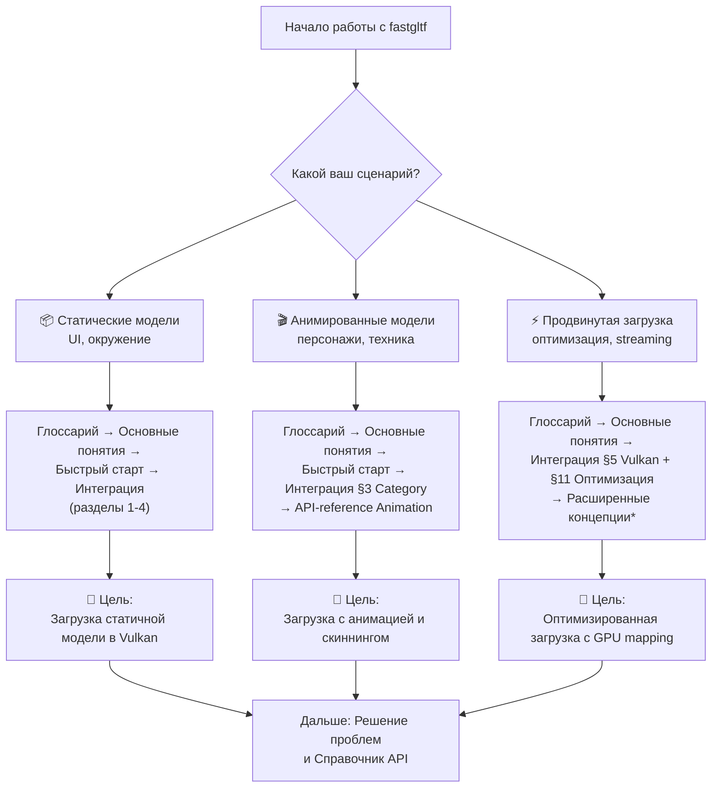
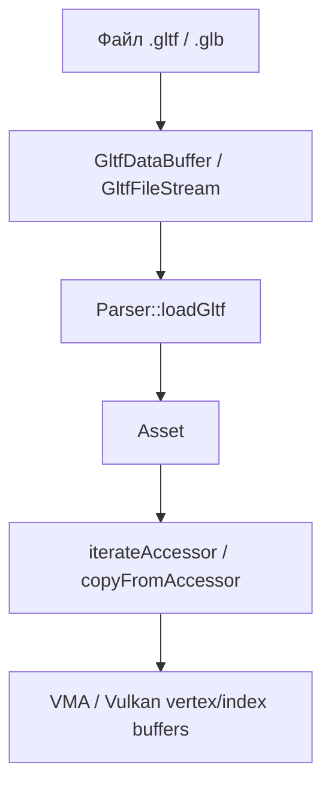

# fastgltf

**🟢 Уровень 1: Начинающий**

**fastgltf** — быстрая библиотека загрузки glTF 2.0 на C++17 с минимальными зависимостями. Использует SIMD (simdjson)
для ускорения парсинга JSON и base64-декодирования. Поддерживает полную спецификацию glTF 2.0 и множество расширений. По
умолчанию выполняет минимум операций; дополнительные функции (загрузка внешних буферов, декомпозиция матриц, утилиты для
accessor) включаются через Options и Extensions.

Версия: **0.9.0**.
Исходники: [spnda/fastgltf](https://github.com/spnda/fastgltf).

---

---

---

## 🗺️ Диаграмма обучения (Learning Path)

Выберите свой сценарий и следуйте по соответствующему пути:

*Раздел "Расширенные концепции" планируется в будущих обновлениях.

---

---

---

## Жизненный цикл

---

## Быстрые ссылки по задачам

| Задача                                              | Раздел                                                                                                                         |
|-----------------------------------------------------|--------------------------------------------------------------------------------------------------------------------------------|
| Интеграция в ProjectV (архитектура, сценарии)       | [Интеграция в ProjectV](projectv-integration.md)                                                                               |
| Загрузить glTF/GLB файл                             | [Быстрый старт](quickstart.md)                                                                                                 |
| Определить тип файла (glTF/GLB) без парсинга        | [Справочник API — determineGltfFileType](api-reference.md#determinegltffiletype-validate)                                      |
| Подключить fastgltf в CMake                         | [Интеграция §1 CMake](integration.md#1-cmake)                                                                                  |
| Читать вершины и индексы (accessor tools)           | [Основные понятия — Accessor](concepts.md#accessor-и-чтение-данных), [Справочник API — tools](api-reference.md#toolshpp)       |
| Загрузить внешние буферы/изображения                | [Интеграция — Options](integration.md#2-options), [Быстрый старт](quickstart.md)                                               |
| Писать данные напрямую в Vulkan-буфер               | [Интеграция — Vulkan](integration.md#5-загрузка-в-vulkan)                                                                      |
| Включить расширения (KHR_texture_transform и др.)   | [Интеграция — Расширения](integration.md#4-расширения-gltf)                                                                    |
| Экспорт в JSON/GLB                                  | [Справочник API — Exporter](api-reference.md#exporter--fileexporter)                                                           |
| Morph targets (blend shapes)                        | [Основные понятия — Морф-таргеты](concepts.md#морф-таргеты-базовое-объяснение), [Глоссарий — findTargetAttribute](glossary.md) |
| Ошибка MissingExtensions / UnknownRequiredExtension | [Решение проблем](troubleshooting.md)                                                                                          |

---

## Требования

- C++17 или новее (опционально C++20 для модулей)
- simdjson (подгружается автоматически через CMake)
- Windows, Linux, Android, macOS

**Связанные разделы:
** [Vulkan](../vulkan/README.md), [VMA](../vma/README.md), [glm](../glm/README.md), [документация проекта](../README.md).

← [На главную документацию](../README.md)
