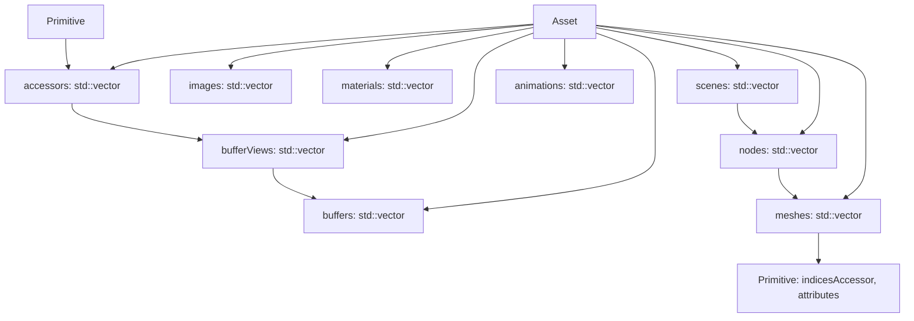
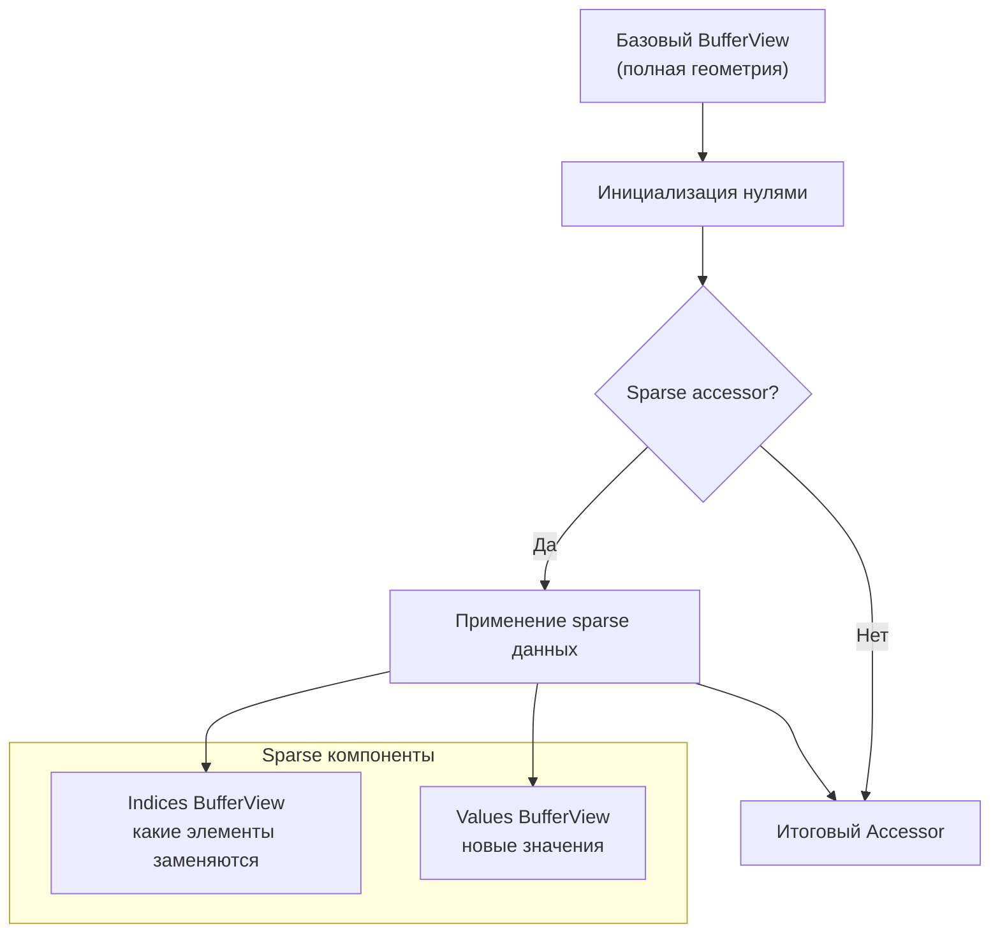
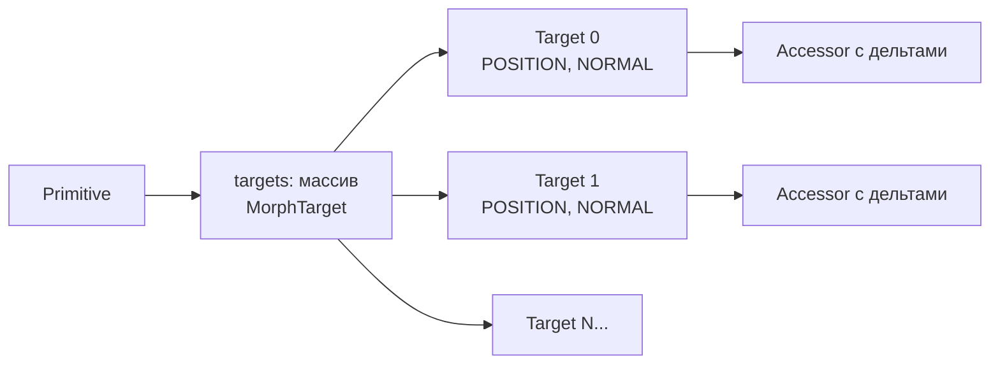
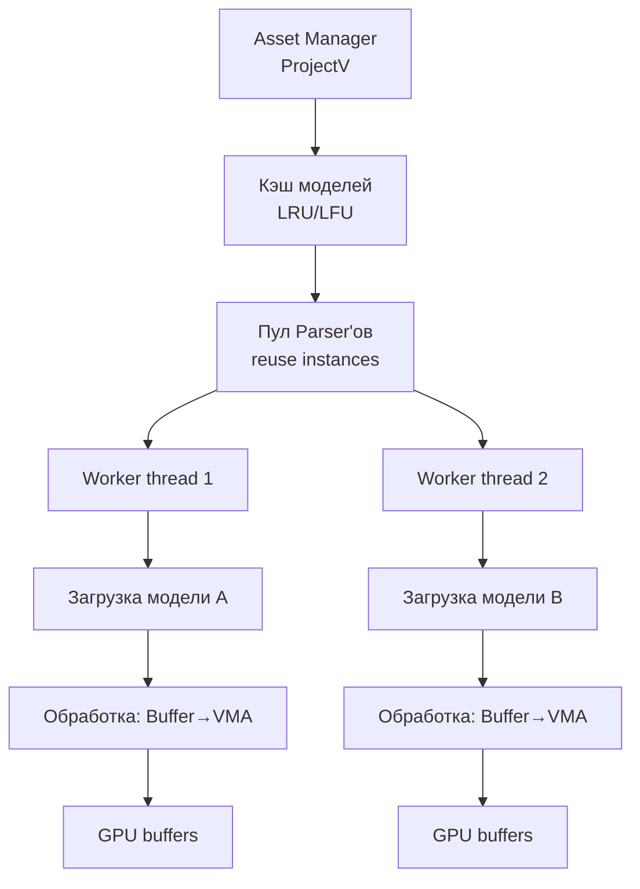

# Основные понятия 🟡

**Глубокое введение в glTF 2.0 и внутреннюю работу fastgltf.** Этот раздел не просто объясняет базовые концепции, но и
раскрывает **внутренние механизмы**, **оптимизации** и **практические паттерны** для использования fastgltf в C++
проектах. Термины —
в [глоссарии](glossary.md).

## Оглавление с указанием глубины

| Раздел                                                                       | Уровень понимания | Время чтения | Ключевые темы                          |
|------------------------------------------------------------------------------|-------------------|--------------|----------------------------------------|
| [glTF 2.0: архитектура формата](#gltf-20)                                    | 🟢 Базовый        | 5 мин        | JSON + буферы, SIMD парсинг            |
| [JSON vs GLB: внутренние различия](#json-и-glb)                              | 🟡 Средний        | 7 мин        | Чанки, memory mapping                  |
| [Структура Asset: полный обзор](#структура-asset)                            | 🟡 Средний        | 10 мин       | Векторы данных, ссылочная модель       |
| [Глубокая цепочка данных](#глубокая-цепочка-данных)                          | 🔴 Продвинутый    | 15 мин       | Выравнивание, stride, sparse accessors |
| [Индексация и ссылки: паттерны fastgltf](#индексация-и-ссылки)               | 🟡 Средний        | 10 мин       | Optional, variant, безопасный доступ   |
| [Expected: система обработки ошибок](#expected-и-обработка-ошибок)           | 🟢 Базовый        | 8 мин        | Monadic error handling                 |
| [DataSource: стратегии загрузки](#datasource--источники-данных)              | 🟡 Средний        | 12 мин       | Кастомные адаптеры, GPU mapping        |
| [Category: оптимизация парсинга](#category--частичная-загрузка)              | 🟡 Средний        | 10 мин       | Частичная загрузка, производительность |
| [Accessor: типы данных и чтение](#accessor-и-чтение-данных)                  | 🔴 Продвинутый    | 15 мин       | Конвертация, нормализация, sparse      |
| [Sparse accessors: полное руководство](#sparse-accessors-полное-руководство) | 🔴 Продвинутый    | 20 мин       | Математика sparse, оптимизации         |
| [Морф-таргеты: анимация формы](#морф-таргеты-анимация-формы)                 | 🔴 Продвинутый    | 18 мин       | Blend shapes, интерполяция             |
| [Внутренняя архитектура fastgltf](#внутренняя-архитектура-fastgltf)          | 🟡 Средний        | 12 мин       | SIMD парсинг, оптимизации памяти       |

---

---

## glTF 2.0

**glTF** (GL Transmission Format) — открытый формат 3D-моделей от Khronos Group. Версия 2.0 описывает сцены, меши,
материалы, анимации и скиннинг. Модель состоит из:

- **JSON** — метаданные: структура сцены, ссылки на буферы и изображения, настройки материалов.
- **Буферы** — сырые байты (вершины, индексы, анимационные ключи). Могут быть встроены в JSON (base64) или во внешних
  файлах.
- **Изображения** — текстуры (PNG, JPEG, KTX2, DDS и др.).

fastgltf парсит JSON через simdjson (SIMD) и предоставляет доступ к данным в виде C++-структур.

---

## JSON и GLB

glTF может быть в двух форматах:

| Формат           | Описание                                                                                                            |
|------------------|---------------------------------------------------------------------------------------------------------------------|
| **JSON (.gltf)** | Файл `.gltf` ссылается на внешние `.bin` и изображения. Может содержать base64-встроенные данные.                   |
| **GLB (.glb)**   | Один бинарный файл: сначала JSON-чанк, затем один или несколько бинарных чанков. Первый буфер обычно встроен в GLB. |

`Parser::loadGltf()` определяет формат автоматически. `loadGltfJson()` и `loadGltfBinary()` — если тип уже известен.

---

## Структура Asset

Результат парсинга — `fastgltf::Asset`:



- **buffers** — массив Buffer (каждый с `DataSource`). GLB-буферы по умолчанию загружаются в память.
- **bufferViews** — участки буферов. Каждый ссылается на `bufferIndex`, имеет byteOffset, byteLength, byteStride.
- **accessors** — описание типизированных данных (vertices, indices, matrices). Ссылаются на bufferView через
  `bufferViewIndex`.
- **meshes** — массивы Primitive. Атрибут через `findAttribute("POSITION")` → итератор; `it->accessorIndex` даёт индекс
  accessor.
- **nodes** — иерархия с `transform` (`std::variant<TRS, math::fmat4x4>`), meshIndex, children.
- **scenes** — `nodeIndices` (массив индексов корневых Node), а не сами объекты Node.
- **assetInfo** — gltfVersion, generator, copyright.
- **availableCategories** — маска того, что было распарсено (зависит от параметра Category).
- **defaultScene** — индекс сцены по умолчанию.

---

## Цепочка данных

Данные геометрии идут по цепочке:

1. **[Buffer](glossary.md)** — сырые байты (файл, base64, встроенный чанк GLB).
2. **[BufferView](glossary.md)** — участок буфера (byteOffset, byteLength, byteStride).
3. **[Accessor](glossary.md)** — типизированное представление (Vec3 float, Scalar uint16 и т.д.).
4. **[Primitive](glossary.md)** — ссылается на accessors через `attributes` и `indicesAccessor`.

Чтобы прочитать вершины: `Primitive::findAttribute("POSITION")` → accessorIndex → Accessor → BufferView → Buffer.
Accessor tools (`iterateAccessor`, `copyFromAccessor`) проходят эту цепочку за вас.

---

## Индексация и ссылки

Ссылки между объектами — через `std::size_t` (индекс в соответствующем векторе):

- `Scene::nodeIndices[i]` → `asset.nodes[nodeIndices[i]]`
- `Node::meshIndex` → `asset.meshes[meshIndex]`
- `Primitive::findAttribute("POSITION")` → итератор; `it->accessorIndex` → `asset.accessors[accessorIndex]`
- `Accessor::bufferViewIndex` → `asset.bufferViews[bufferViewIndex]`
- `BufferView::bufferIndex` → `asset.buffers[bufferIndex]`

**Паттерн Optional:** опциональные ссылки — `Optional<size_t>` (или `std::optional`). Перед использованием проверяйте
`has_value()`:

```cpp
if (node.meshIndex.has_value()) {
    auto& mesh = asset.meshes[*node.meshIndex];
    // ...
}
```

**Node::transform** — `std::variant<TRS, math::fmat4x4>`. TRS появляется при `Options::DecomposeNodeMatrices` или если в
glTF заданы translation/rotation/scale. Иначе — матрица. Проверка: `std::holds_alternative<TRS>(node.transform)`.

---

## Expected и обработка ошибок

Функции загрузки возвращают `fastgltf::Expected<T>`:

```cpp
auto asset = parser.loadGltf(data.get(), path.parent_path());
if (asset.error() != fastgltf::Error::None) {
    // Ошибка: asset.get() вызывать нельзя
    return;
}
// Успех: asset.get() или asset-> даёт Asset&
auto& meshes = asset->meshes;
```

- `error()` — код ошибки (`Error::None` при успехе).
- `get()`, `operator->`, `operator*` — доступ к значению. При ошибке — undefined behavior.
- `get_if()` — указатель на значение или `nullptr` при ошибке.

---

## DataSource — источники данных

Буферы и изображения имеют поле `DataSource` — `std::variant` с возможными источниками:

| Вариант                 | Когда появляется                                                         |
|-------------------------|--------------------------------------------------------------------------|
| `sources::ByteView`     | GLB-буфер (ссылка на чанк), base64 без копирования.                      |
| `sources::Array`        | Встроенные данные (StaticVector). GLB и base64 при стандартной загрузке. |
| `sources::Vector`       | Внешние данные при `LoadExternalBuffers` / `LoadExternalImages`.         |
| `sources::URI`          | Внешний файл. Без Options — только путь; с Options — загруженные байты.  |
| `sources::CustomBuffer` | При `setBufferAllocationCallback` — ID вашего GPU-буфера.                |
| `sources::BufferView`   | Только для Image — изображение встроено в bufferView.                    |
| `sources::Fallback`     | EXT_meshopt_compression fallback — данные недоступны без декомпрессии.   |

**Когда нужен кастомный BufferDataAdapter:**

| DataSource                    | DefaultBufferDataAdapter | Нужен кастомный адаптер                     |
|-------------------------------|--------------------------|---------------------------------------------|
| ByteView, Array, Vector       | Да                       | Нет                                         |
| URI (без LoadExternalBuffers) | Нет                      | Да — вернуть span из вашей загрузки         |
| CustomBuffer                  | Нет                      | Да — вернуть span на замапленную GPU-память |
| BufferView (только Image)     | —                        | —                                           |
| Fallback                      | Нет                      | Данные недоступны                           |

---

## Category — частичная загрузка

Параметр `Category` в `loadGltf` позволяет парсить только нужные части модели:

| Значение                   | Что парсится                                                            |
|----------------------------|-------------------------------------------------------------------------|
| `Category::All`            | Всё (по умолчанию).                                                     |
| `Category::OnlyRenderable` | Всё, кроме Animations и Skins. Ускоряет загрузку для статичных моделей. |
| `Category::OnlyAnimations` | Только анимации: Animations, Accessors, BufferViews, Buffers.           |

```cpp
auto asset = parser.loadGltf(data.get(), basePath, options, fastgltf::Category::OnlyRenderable);
```

---

## Accessor и чтение данных

Accessor описывает, как читать данные из BufferView:

- **AccessorType**: Scalar, Vec2, Vec3, Vec4, Mat2, Mat3, Mat4.
- **ComponentType**: Byte, UnsignedShort, Float и др.
- **count** — количество элементов.
- **byteOffset** — смещение в BufferView.
- **normalized** — нормализация целочисленных значений в [0, 1] или [-1, 1].
- **min**, **max** — опциональные границы (AccessorBoundsArray).
- **bufferViewIndex** — опционально (sparse accessor может не иметь базового bufferView).

Утилиты из `fastgltf/tools.hpp`:

- `iterateAccessor<T>(asset, accessor, lambda)` — итерация с конвертацией типа.
- `iterateAccessorWithIndex` — лямбда получает индекс.
- `copyFromAccessor` — копирование в массив.
- Range-based for: `for (auto elem : iterateAccessor<T>(asset, accessor))`.

Подробнее: [Справочник API — tools](api-reference.md#toolshpp).

---

## Sparse accessors (базовое объяснение)

Accessor может не иметь `bufferViewIndex` или содержать `sparse` — подмножество элементов, переопределённых отдельным
буфером. По спецификации glTF такие accessors инициализируются нулями, а sparse-значения перезаписывают отдельные
индексы.

Accessor tools (`iterateAccessor`, `copyFromAccessor`, `getAccessorElement`) обрабатывают sparse accessors
автоматически — не нужно писать отдельный код.

**💡 Для глубокого понимания читайте раздел [Sparse accessors: полное руководство](#sparse-accessors-полное-руководство)
ниже.**

---

## Морф-таргеты (базовое объяснение)

`Primitive::targets` — массив атрибутов для morph targets (blend shapes). Каждый target — набор Attribute (например,
POSITION, NORMAL) со смещениями относительно базовой геометрии. Используется для анимации формы меша.

Доступ: `primitive.findTargetAttribute(targetIndex, "POSITION")` — итератор с `accessorIndex`.

**💡 Для глубокого понимания читайте раздел [Морф-таргеты: анимация формы](#морф-таргеты-анимация-формы) ниже.**

---

## Глубокая цепочка данных

### Выравнивание и стратегии доступа к памяти

**Buffer → BufferView → Accessor** цепочка не просто передаёт данные, но и оптимизирует доступ к памяти:


#### **ByteStride: критически важный параметр**

- `byteStride = 0`: данные плотно упакованы, следующий элемент начинается сразу после предыдущего
- `byteStride > 0`: между элементами есть промежуток (padding), часто используется для выравнивания
- **Пример**: `Vec3 float` (12 байт) может иметь `stride=16` для выравнивания до 16 байт

#### **Вычисление эффективного размера данных:**

```cpp
// Для Accessor с count элементов
effective_size = count * byteStride (если stride > 0)
effective_size = count * element_size (если stride == 0)

// Где element_size:
element_size = getNumComponents(type) * getComponentByteSize(componentType)
```

#### **Оптимизация для ProjectV (Vulkan):**

1. **Копирование с выравниванием**: При копировании в GPU буферы учитывайте `byteStride`
2. **Stride-aware доступ**: Используйте `iterateAccessor`, который автоматически обрабатывает stride
3. **Переупаковка**: Для максимальной производительности в GPU переупакуйте данные без лишнего stride

### **Таблица: типичные сценарии stride**

| Сценарий                | Типичный stride                        | Причина                         | Влияние на производительность             |
|-------------------------|----------------------------------------|---------------------------------|-------------------------------------------|
| Плотная упаковка        | 0 или element_size                     | Минимизация памяти              | Высокая cache locality                    |
| Выравнивание до 16 байт | 16                                     | SSE/AVX инструкции              | Улучшение SIMD, больше памяти             |
| Интерливинг атрибутов   | position(12) + normal(12) + uv(8) = 32 | Единый буфер для всех атрибутов | Сложнее cache locality, но меньше binding |

---

## Sparse accessors: полное руководство

### Что такое sparse accessors и зачем они нужны?

**Sparse accessors** позволяют изменять только часть данных accessor без пересоздания всего буфера. Представьте mesh с
10K вершин, где нужно анимировать только 100 вершин — вместо хранения 10K вершин для каждого кадра, храним базовую
геометрию + sparse изменения.



### **Математическая модель sparse accessor**

Для каждого элемента accessor с индексом `i`:

```
if (i в sparse.indices):
    value = sparse.values[position_of_i_in_indices]
else if (accessor.bufferViewIndex существует):
    value = base_buffer_view[i]
else:
    value = 0  // по спецификации glTF
```

### **Структура SparseAccessor в fastgltf**

```cpp
struct SparseAccessor {
    std::size_t count;                    // Количество sparse элементов
    std::size_t indicesBufferViewIndex;   // BufferView с индексами
    std::size_t valuesBufferViewIndex;    // BufferView со значениями
    ComponentType indexComponentType;     // Тип индексов (обычно UnsignedInt)
    // ... дополнительные поля
};
```

### **Когда использовать sparse accessors в ProjectV**

| Сценарий                  | Эффективность | Реализация в ProjectV                 |
|---------------------------|---------------|---------------------------------------|
| **Morph targets**         | Высокая       | Sparse для дельт позиций/нормалей     |
| **Procedural animation**  | Средняя       | Динамическое обновление sparse данных |
| **Level of Detail (LOD)** | Низкая        | Лучше использовать отдельные меши     |
| **Dynamic vegetation**    | Высокая       | Sparse для анимации листьев/ветвей    |

### **Производительность sparse accessors**

**Преимущества:**

- Меньший объём данных для передачи в GPU
- Возможность частичного обновления буферов
- Эффективное использование памяти для анимаций

**Недостатки:**

- Дополнительная логика в шейдерах
- Сложность отладки
- Ограниченная поддержка в некоторых рендерерах

### **Пример: работа со sparse accessors в коде**

```cpp
// Fastgltf автоматически обрабатывает sparse при использовании:
fastgltf::iterateAccessor<glm::vec3>(asset, accessor, [](glm::vec3 pos) {
    // Эта лямбда получит уже применённые sparse значения
    // Не нужно проверять sparse вручную!
});

// Для ручной обработки (если нужно):
if (accessor.sparse.has_value()) {
    const auto& sparse = *accessor.sparse;
    // Обработка sparse индексов и значений
}
```

---

## Морф-таргеты: анимация формы

### Теория morph targets (blend shapes)

Morph targets — это техника анимации, где меш деформируется между несколькими "целевыми" формами. Каждая target
определяет смещения вершин относительно базовой геометрии.

**Математика интерполяции:**

```
vertex_final = vertex_base + Σ(weight[i] * target_offset[i])
```

Где `weight[i]` ∈ [0, 1] — вес i-го target.

### **Структура morph targets в glTF**



Каждый `MorphTarget` — это словарь атрибутов:

- `"POSITION"`: смещения позиций (обязательно)
- `"NORMAL"`: смещения нормалей (опционально)
- `"TANGENT"`: смещения тангенсов (редко)

### **Использование в fastgltf**

```cpp
auto& primitive = asset.meshes[meshIndex].primitives[primitiveIndex];

// Получение количества targets
size_t numTargets = primitive.targets.size();

// Доступ к конкретному target
for (size_t targetIdx = 0; targetIdx < numTargets; ++targetIdx) {
    // Поиск атрибута POSITION для этого target
    auto it = primitive.findTargetAttribute(targetIdx, "POSITION");
    if (it != primitive.targets[targetIdx].attributes.cend()) {
        auto& accessor = asset.accessors[it->accessorIndex];
        // Чтение дельт через iterateAccessor
        fastgltf::iterateAccessor<glm::vec3>(asset, accessor, 
            [](glm::vec3 delta) {
                // delta - смещение вершины для этого target
            });
    }
}
```

### **Интеграция с Vulkan шейдерами**

**Рекомендуемая структура данных для GPU:**

```glsl
// Vertex shader inputs
layout (location = 0) in vec3 inPosition;
layout (location = 1) in vec3 inNormal;
layout (location = 2) in vec3 inPositionDelta0; // Target 0
layout (location = 3) in vec3 inNormalDelta0;   // Target 0
// ... дополнительные targets

// Uniform buffer с весами
layout (set = 0, binding = 0) uniform MorphWeights {
    float weights[MAX_MORPH_TARGETS];
} uMorph;
```

**Альтернативный подход (более эффективный):**

- Хранить все дельты в texture buffer (TBO)
- Вычислять финальную позицию в vertex shader через texture fetches
- Позволяет динамически изменять количество targets

### **Оптимизации для ProjectV**

| Оптимизация                      | Выигрыш                             | Сложность  |
|----------------------------------|-------------------------------------|------------|
| **Packed delta storage**         | Уменьшение памяти на 50%            | 🟡 Средняя |
| **Target culling**               | Пропуск targets с weight=0          | 🟢 Низкая  |
| **Compute shader preprocessing** | CPU → GPU перенос интерполяции      | 🔴 Высокая |
| **LOD-based target reduction**   | Меньше targets для дальних объектов | 🟡 Средняя |

### **Практический пример: facial animation**

```cpp
// Загрузка модели лица с morph targets
auto asset = parser.loadGltf(data.get(), basePath, fastgltf::Options::None);

// Настройка весов для выражений лица
std::array<float, 8> faceWeights = {
    0.5f, // smile
    0.3f, // frown
    0.0f, // surprise
    // ... остальные выражения
};

// В рендер-цикле:
// 1. Копируем веса в uniform buffer
// 2. Рендерим с включёнными morph targets
// 3. Анимируем веса со временем
```

---

## Внутренняя архитектура fastgltf

### SIMD парсинг JSON через simdjson

Fastgltf использует [simdjson](https://github.com/simdjson/simdjson) — библиотеку, которая использует SIMD инструкции (
SSE, AVX) для ускорения парсинга JSON в 2-4 раза.

**Как это работает:**

1. **Stage 1**: SIMD-сканирование для нахождения структур JSON (скобки, кавычки)
2. **Stage 2**: Построение tape-структуры с указателями на данные
3. **Stage 3**: Ленивая загрузка значений по требованию

**Преимущества для ProjectV:**

- Быстрая загрузка больших glTF файлов (100+ MB)
- Низкое потребление памяти при парсинге
- Поддержка streaming парсинга

### **Оптимизации памяти**

#### StaticVector для малых массивов

Fastgltf использует `StaticVector<T, N>` (аналог `std::array` с переменным размером) для малых массивов:

- `Primitive::attributes`: StaticVector<Attribute, 4> (обычно ≤4 атрибута)
- Уменьшает аллокации памяти
- Улучшает cache locality

#### PMR аллокаторы (C++17)

При компиляции с `FASTGLTF_DISABLE_CUSTOM_MEMORY_POOL=OFF`:

- Используется `std::pmr::memory_resource` для управления памятью
- Возможность использования arena аллокаторов
- Уменьшение фрагментации при массовой загрузке моделей

### **BufferDataAdapter: абстракция источников данных**

`BufferDataAdapter` — ключевая абстракция, позволяющая fastgltf работать с различными источниками данных без
копирования:

```cpp
// Концепт BufferDataAdapter
template<typename Adapter>
concept BufferDataAdapter = requires(Adapter adapter, const Asset& asset, size_t idx) {
    { adapter(asset, idx) } -> std::convertible_to<std::span<const std::byte>>;
};
```

**Реализации в fastgltf:**

1. `DefaultBufferDataAdapter`: для ByteView, Array, Vector
2. `CustomBufferDataAdapter`: для URI, CustomBuffer (требует реализации пользователем)
3. `FallbackBufferDataAdapter`: для сжатых данных (meshopt)

### **Производительность: рекомендации для ProjectV**

| Операция                      | Время (примерно) | Оптимизации                                  |
|-------------------------------|------------------|----------------------------------------------|
| Парсинг JSON (10MB)           | 5-15 мс          | Используйте `Category::OnlyRenderable`       |
| Загрузка буферов (50MB)       | 20-50 мс         | `LoadExternalBuffers` + асинхронная загрузка |
| Чтение accessor (100K вершин) | 1-3 мс           | `iterateAccessor` с правильным типом         |
| Обход сцены (1000 узлов)      | 0.5-1 мс         | `iterateSceneNodes` вместо ручной рекурсии   |

### **Интеграция с системой ассетов ProjectV**

**Рекомендуемая архитектура:**



**Ключевые моменты:**

1. **Reuse Parser**: Создавайте один `Parser` на поток или используйте thread-local storage
2. **Асинхронная загрузка**: Загружайте JSON и буферы в отдельных потоках
3. **Кэширование Asset**: Кэшируйте распарсенные `Asset` структуры для повторного использования
4. **Прогрессивная загрузка**: Используйте `GltfFileStream` для streaming загрузки

---

## 📚 Что дальше?

- **[Быстрый старт](quickstart.md)** — практические примеры загрузки моделей
- **[Интеграция](integration.md)** — подключение fastgltf к ProjectV, работа с Vulkan/VMA
- **[Справочник API](api-reference.md)** — детальное описание всех функций
- **[Решение проблем](troubleshooting.md)** — диагностика и исправление ошибок

💡 **Совет:
** Возвращайтесь к этому разделу при работе со сложными сценариями загрузки. Понимание внутренних механизмов поможет
принимать оптимальные архитектурные решения для ProjectV.
---
