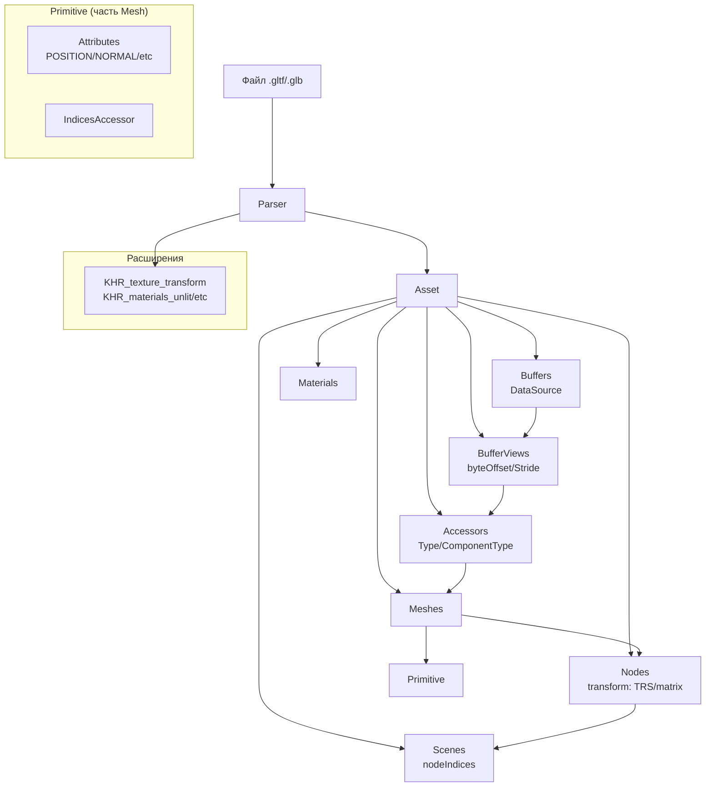
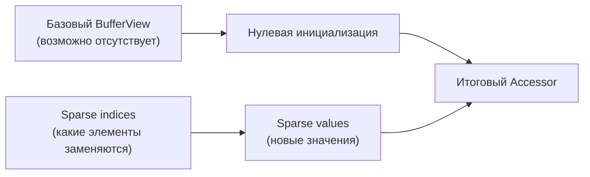

# Глоссарий fastgltf

**Словарь терминов glTF и fastgltf с визуализацией связей и углублёнными объяснениями.** Этот глоссарий не только даёт
определения, но и показывает **как термины связаны между собой** в контексте ProjectV.

---

## Карта связей ключевых терминов



---

## Термины с диаграммами и связями

### **Ядро glTF**

| Термин    | Объяснение                                                                                                                                                         | Связи с другими терминами                                                              | Диаграмма                                                                                |
|-----------|--------------------------------------------------------------------------------------------------------------------------------------------------------------------|----------------------------------------------------------------------------------------|------------------------------------------------------------------------------------------|
| **glTF**  | Формат 3D-моделей от Khronos Group (glTF 2.0). Состоит из JSON-файла с метаданными и бинарных буферов (геометрия, изображения).                                    | → GLB (бинарная версия)<br/>→ Asset (результат парсинга)<br/>→ Parser (чтение формата) | `glTF → JSON + Buffers`                                                                  |
| **GLB**   | Бинарный контейнер glTF: один файл с JSON и одним или несколькими чанками бинарных данных. Удобен для распространения и загрузки.                                  | ← glTF (исходный формат)<br/>→ Buffer (встроенные данные)<br/>→ Parser (загрузка)      | `GLB = JSON chunk + Binary chunks`                                                       |
| **Asset** | Основная структура `fastgltf::Asset` — результат парсинга. Содержит векторы `buffers`, `bufferViews`, `accessors`, `meshes`, `materials`, `nodes`, `scenes` и т.д. | ← Parser (создаёт)<br/>→ Buffers/BufferViews/Accessors<br/>→ Meshes/Nodes/Scenes       |  |

### **Цепочка данных: Buffer → BufferView → Accessor**

| Термин         | Объяснение                                                                                                                                   | Размеры и выравнивание                                            | Пример в байтах                                       |
|----------------|----------------------------------------------------------------------------------------------------------------------------------------------|-------------------------------------------------------------------|-------------------------------------------------------|
| **Buffer**     | Массив байтов. Источник данных — `DataSource` (встроенный в GLB, base64, внешний файл и т.д.). GLB-буферы по умолчанию загружаются в память. | Любой размер, обычно кратен 4 для выравнивания                    | `Buffer[0]: 16384 байт`                               |
| **BufferView** | Участок буфера: `bufferIndex`, byteOffset, byteLength, byteStride (опционально), target. Связывает Accessor с Buffer.                        | `byteOffset` должно быть кратно 4<br/>`byteStride` кратно 4 или 0 | `BufferView[0]: offset=0, length=8192, stride=12`     |
| **Accessor**   | Описание доступа к данным в буфере: `AccessorType`, `ComponentType`, смещение, количество элементов, min/max.                                | `byteOffset` в BufferView кратно размеру компонента               | `Accessor[0]: type=Vec3, component=Float, count=1024` |

**📐 Формула вычисления размера Accessor:**

```
size = count * getNumComponents(type) * getComponentByteSize(componentType)
```

### **Геометрия и иерархия**

| Термин        | Объяснение                                                                                                                                      | Важные поля и методы                                                                                                           | Особенности в fastgltf                                       |
|---------------|-------------------------------------------------------------------------------------------------------------------------------------------------|--------------------------------------------------------------------------------------------------------------------------------|--------------------------------------------------------------|
| **Primitive** | Часть меша: режим отрисовки (`PrimitiveType`), атрибуты через `attributes` (массив Attribute), опциональный `indicesAccessor`.                  | `findAttribute("POSITION")` → итератор; `it->accessorIndex` даёт индекс accessor. Morph targets — через `findTargetAttribute`. | Атрибуты хранятся в SmallVector<Attribute,4> для оптимизации |
| **Mesh**      | Набор примитивов (Primitive). Один меш может содержать несколько примитивов с разными материалами.                                              | `primitives` — вектор Primitive                                                                                                | В ProjectV: один Mesh = одна сущность ECS                    |
| **Node**      | Узел сцены. `transform` — `std::variant<TRS, math::fmat4x4>`. Ссылки: meshIndex, skinIndex, cameraIndex, lightIndex. Иерархия через `children`. | `getLocalTransformMatrix()` и `getTransformMatrix()`                                                                           | TRS появляется при `Options::DecomposeNodeMatrices`          |
| **Scene**     | Корневая структура сцены: `nodeIndices` — массив индексов корневых Node.                                                                        | `defaultScene` в Asset                                                                                                         | Используйте `iterateSceneNodes()` для обхода                 |

### **Материалы и текстуры**

| Термин          | Объяснение                                                                                             | Расширения                                                                           | Интеграция в ProjectV                |
|-----------------|--------------------------------------------------------------------------------------------------------|--------------------------------------------------------------------------------------|--------------------------------------|
| **Material**    | Материал: `pbrData` (baseColor, metallic-roughness), нормали, эмиссия; расширения (KHR_materials_*).   | `KHR_materials_unlit`, `KHR_materials_clearcoat`, `KHR_materials_transmission` и др. | Конвертация в Vulkan PBR pipeline    |
| **TextureInfo** | Ссылка на текстуру: textureIndex, texCoordIndex. Расширение KHR_texture_transform добавляет transform. | `KHR_texture_transform`: offset, scale, rotation                                     | Применение transform в шейдере       |
| **Sampler**     | Настройки фильтрации (min/mag) и wrapping (repeat, clamp) для текстур.                                 | Стандарт glTF                                                                        | Соответствие Vulkan sampler settings |

### **Анимации и скиннинг**

| Термин            | Объяснение                                                                 | Структура данных                                                                    | Особенности fastgltf                                                  |
|-------------------|----------------------------------------------------------------------------|-------------------------------------------------------------------------------------|-----------------------------------------------------------------------|
| **Animation**     | Анимация: samplers (ключевые кадры), channels (связь с узлами/атрибутами). | `samplers`: input/output accessors<br/>`channels`: target node + path               | Загружается только при `Category::All` или `Category::OnlyAnimations` |
| **Skin**          | Скиннинг: joints (индексы Node), inverseBindMatrices.                      | `joints`: массив индексов Node<br/>`inverseBindMatrices`: Optional<size_t> accessor | Используется для skeletal animation                                   |
| **Morph Targets** | Blend shapes: `Primitive::targets` — массив атрибутов для деформации меша. | `findTargetAttribute(targetIndex, "POSITION")`                                      | Интерполяция между targets в шейдере                                  |

### **Sparse Accessors: продвинутая тема**

**SparseAccessor** позволяет переопределять отдельные элементы accessor без дублирования всего буфера. Используется для
эффективного хранения частично изменённых данных (например, морфинг).



**Важно:** Accessor tools (`iterateAccessor`, `copyFromAccessor`) обрабатывают sparse accessors **автоматически** — не
нужно писать дополнительный код.

### **Система загрузки fastgltf**

| Термин         | Объяснение                                                                                                                                        | Возвращаемый тип                                                    | Когда использовать                                       |
|----------------|---------------------------------------------------------------------------------------------------------------------------------------------------|---------------------------------------------------------------------|----------------------------------------------------------|
| **Parser**     | Класс `fastgltf::Parser` — парсит glTF/GLB и создаёт Asset. Принимает GltfDataGetter, Options, Extensions, Category.                              | —                                                                   | Рекомендуется переиспользовать между загрузками          |
| **Expected**   | Тип `fastgltf::Expected<T>`: хранит либо значение T, либо `Error`. `error()` возвращает код ошибки; `get()`, `operator->` дают доступ к значению. | `Expected<T>`                                                       | Всегда проверяйте `error() == Error::None` перед `get()` |
| **DataSource** | `std::variant` с источниками данных буфера/изображения. Определяет, где физически находятся данные.                                               | `sources::URI`, `ByteView`, `Array`, `Vector`, `CustomBuffer` и др. | Определяет нужен ли кастомный BufferDataAdapter          |

### **Источники данных (DataSource варианты)**

| Вариант                   | Когда появляется                                                                         | Нужен кастомный BufferDataAdapter?            | Пример использования      |
|---------------------------|------------------------------------------------------------------------------------------|-----------------------------------------------|---------------------------|
| **sources::URI**          | Внешний файл по пути. При `LoadExternalBuffers`/`LoadExternalImages` данные загружаются. | Да (если не использованы LoadExternalBuffers) | `.gltf + external .bin`   |
| **sources::ByteView**     | Ссылка на существующие байты (span). Используется при GLB или base64 без копирования.    | Нет                                           | GLB буферы                |
| **sources::Array**        | Встроенные данные (StaticVector). GLB-буферы по умолчанию дают Array.                    | Нет                                           | GLB с встроенными данными |
| **sources::Vector**       | Внешние данные при `LoadExternalBuffers` / `LoadExternalImages`.                         | Нет                                           | Загруженные внешние .bin  |
| **sources::CustomBuffer** | При `setBufferAllocationCallback` — ID вашего GPU-буфера (customId).                     | Да                                            | Прямая запись в GPU буфер |
| **sources::Fallback**     | Fallback для EXT_meshopt_compression — данные недоступны без декомпрессии.               | Да (требует meshopt)                          | Сжатые модели             |

### **Опции и категории**

| Термин       | Объяснение                                                                                                        | Битовая маска                                       | Рекомендации для ProjectV                               |
|--------------|-------------------------------------------------------------------------------------------------------------------|-----------------------------------------------------|---------------------------------------------------------|
| **Options**  | Флаги загрузки: `LoadExternalBuffers`, `LoadExternalImages`, `DecomposeNodeMatrices`, `GenerateMeshIndices` и др. | Побитовое ИЛИ                                       | Используйте `LoadExternalBuffers` для статичных моделей |
| **Category** | Маска того, что парсить: Buffers, Meshes, Materials, Nodes, Animations и др.                                      | `Category::All`, `OnlyRenderable`, `OnlyAnimations` | Используйте `OnlyRenderable` для UI элементов           |

---

## 🎯 Термины которые часто путают

| Пара терминов             | Различие                                                                         | Аналогия                                     |
|---------------------------|----------------------------------------------------------------------------------|----------------------------------------------|
| **Buffer vs BufferView**  | Buffer — сырые байты; BufferView — "окно" в Buffer с offset/length/stride        | Книга (Buffer) vs закладка (BufferView)      |
| **Accessor vs Primitive** | Accessor — описание данных; Primitive — использование этих данных для рендеринга | Ингредиенты (Accessor) vs рецепт (Primitive) |
| **Node vs Scene**         | Node — элемент иерархии; Scene — набор корневых Node                             | Сотрудник (Node) vs отдел (Scene)            |
| **DataSource vs Buffer**  | DataSource — откуда брать данные; Buffer — сами данные в памяти                  | Адрес склада (DataSource) vs товары (Buffer) |

---

## 🔧 Утилиты fastgltf

| Термин                                     | Объяснение                                                                                                  | Включение                       | Пример использования                                  |
|--------------------------------------------|-------------------------------------------------------------------------------------------------------------|---------------------------------|-------------------------------------------------------|
| **iterateAccessor** / **copyFromAccessor** | Функции из `tools.hpp` для чтения данных accessor с учётом sparse, нормализации и конвертации типов.        | `#include <fastgltf/tools.hpp>` | `iterateAccessor<glm::vec3>(asset, accessor, lambda)` |
| **DefaultBufferDataAdapter**               | Стандартный адаптер в accessor tools. Работает с ByteView, Array, Vector.                                   | Автоматически                   | Не требуется явного указания                          |
| **ElementTraits**                          | Специализация для типов в accessor tools: описывает `AccessorType`, `ComponentType` для конвертации данных. | Для кастомных типов             | `glm_element_traits.hpp` для glm                      |
| **determineGltfFileType**                  | Функция `fastgltf::determineGltfFileType(GltfDataGetter&)` — определяет тип файла: glTF, GLB или Invalid.   | `#include <fastgltf/core.hpp>`  | Предварительная проверка перед загрузкой              |
| **validate**                               | Функция `fastgltf::validate(Asset&)` — строгая проверка Asset по спецификации glTF 2.0.                     | `#include <fastgltf/core.hpp>`  | В Debug сборках                                       |

---

## 📚 Связанные разделы

- [Основные понятия](concepts.md) — подробнее о цепочке Buffer→BufferView→Accessor
- [Интеграция](integration.md) — как использовать Options, Extensions, Category
- [Справочник API](api-reference.md) — детали всех функций и классов
- [Решение проблем](troubleshooting.md) — ошибки связанные с этими терминами

---

**Совет:** Используйте этот глоссарий как справочник во время чтения других разделов. Если встречаете незнакомый
термин — вернитесь сюда для понимания контекста.

---
