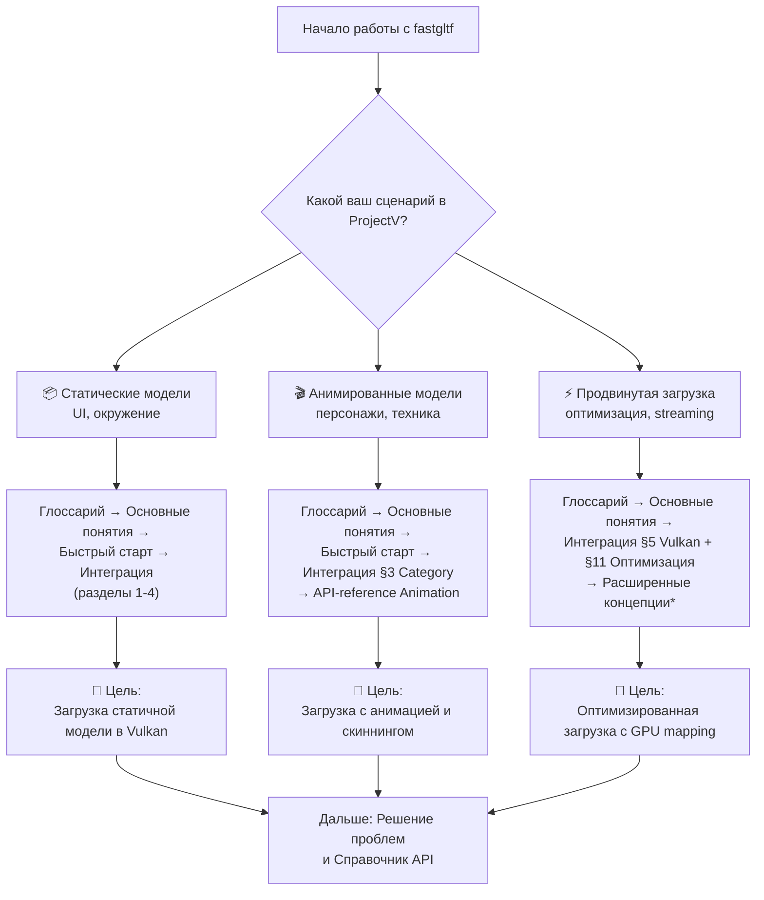
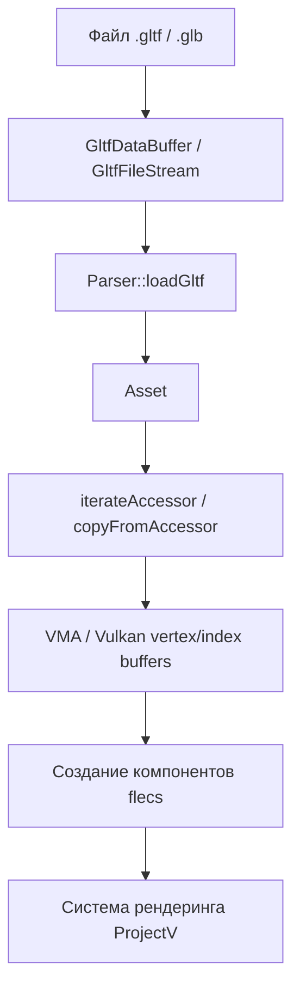

# Интеграция fastgltf в ProjectV

**🔴 Уровень 3: Продвинутый**

Данный документ содержит ProjectV-специфичные рекомендации, паттерны и примеры кода для интеграции библиотеки
fastgltf в воксельный движок ProjectV. Все примеры кода основаны на реальных примерах
из [docs/examples/](../../examples/).

## Оглавление

1. [Архитектурные решения для воксельного рендеринга](#архитектурные-решения-для-воксельного-рендеринга)
2. [Интеграция с Vulkan и VMA](#интеграция-с-vulkan-и-vma) (практические примеры)
3. [Работа с ECS (flecs)](#работа-с-ecs-flecs)
4. [Воксельные паттерны и оптимизации](#воксельные-паттерны-и-оптимизации)
5. [Система материалов для вокселей](#система-материалов-для-вокселей)
6. [Производительность и профилирование](#производительность-и-профилирование)
7. [Практические сценарии](#практические-сценарии)
8. [Примеры кода](#примеры-кода)

---

## Архитектурные решения для воксельного рендеринга

### Роль fastgltf в стеке ProjectV

fastgltf используется для загрузки 3D-моделей (glTF/GLB) в Vulkan-рендерер ProjectV. Данные буферов можно писать
напрямую в GPU через `setBufferAllocationCallback`. Библиотека работает с VMA и Vulkan для создания vertex/index buffers
и текстур.

### Диаграмма обучения (Learning Path) для ProjectV

Выберите свой сценарий и следуйте по соответствующему пути:



*Раздел "Расширенные концепции" планируется в будущих обновлениях.

### Жизненный цикл загрузки модели в ProjectV



### Быстрые ссылки по задачам для ProjectV

| Задача                                              | Раздел                                                                  |
|-----------------------------------------------------|-------------------------------------------------------------------------|
| Загрузить glTF/GLB файл для воксельного рендеринга  | [Быстрый старт](quickstart.md)                                          |
| Подключить fastgltf в CMake ProjectV                | [Интеграция §1 CMake](integration.md#1-cmake)                           |
| Писать данные напрямую в Vulkan-буфер через VMA     | [Интеграция с Vulkan и VMA](#интеграция-с-vulkan-и-vma)                 |
| Включить расширения для воксельных материалов       | [Система материалов для вокселей](#система-материалов-для-вокселей)     |
| Интеграция с ECS (flecs)                            | [Работа с ECS (flecs)](#работа-с-ecs-flecs)                             |
| Оптимизация загрузки воксельных чанков              | [Воксельные паттерны и оптимизации](#воксельные-паттерны-и-оптимизации) |
| Ошибка MissingExtensions / UnknownRequiredExtension | [Решение проблем](troubleshooting.md)                                   |

---

## Интеграция с Vulkan и VMA

### Стратегии загрузки данных в GPU

#### Таблица: Сравнение стратегий загрузки для Vulkan

| Стратегия                        | Использование в ProjectV                    | Преимущества                    | Недостатки                         |
|----------------------------------|---------------------------------------------|---------------------------------|------------------------------------|
| **Zero-copy через CustomBuffer** | Воксельные чанки, streaming                 | Нулевые накладные расходы       | Требует управления памятью         |
| **Staging буферы**               | Статические меши, ландшафты                 | Простота, совместимость         | Двойное копирование                |
| **Прямое маппирование**          | Анимированные персонажи, обновляемые данные | Минимальная задержка            | Сложность синхронизации            |
| **Batch-копирование**            | Множество мелких моделей                    | Оптимизация через один transfer | Требует предварительной подготовки |

### Zero-copy подход через VMA

```cpp
#include <fastgltf/core.hpp>
#include <fastgltf/tools.hpp>
#include <fastgltf/glm_element_traits.hpp>
#include <glm/glm.hpp>

// Структуры Vulkan контекста на основе реальных примеров ProjectV
// См. пример: [black_window.cpp](../../examples/black_window.cpp)

struct VulkanResources {
    VkDevice device;
    VmaAllocator allocator;
    uint32_t graphicsQueueFamilyIndex;
    VkQueue graphicsQueue;
    // ... другие ресурсы из AppState в black_window.cpp
};

/**
 * Загрузка меша из glTF и создание Vulkan буферов через VMA.
 * Оптимизировано для статических воксельных чанков.
 */
// Практический пример загрузки меша на основе реального кода ProjectV
// Вместо гипотетических структур используем реальные примеры из docs/examples/

std::optional<VulkanMeshData> loadGltfMeshToVulkan(
    const std::filesystem::path& path,
    VulkanResources& vulkan) {
    
    fastgltf::Parser parser(fastgltf::Extensions::KHR_texture_basisu);
    auto data = fastgltf::GltfDataBuffer::FromPath(path);
    if (data.error() != fastgltf::Error::None) return std::nullopt;
    
    // Только геометрия, без анимаций
    auto asset = parser.loadGltf(
        data.get(),
        path.parent_path(),
        fastgltf::Options::LoadExternalBuffers,
        fastgltf::Category::OnlyRenderable
    );
    
    if (asset.error() != fastgltf::Error::None) return std::nullopt;
    
    VulkanMeshData result = {};
    
    // Обработка первого меша (для воксельных чанков обычно один меш)
    if (!asset->meshes.empty()) {
        const auto& mesh = asset->meshes[0];
        
        for (const auto& primitive : mesh.primitives) {
            // ПОЗИЦИИ ВЕРШИН
            if (auto posAttr = primitive.findAttribute("POSITION");
                posAttr != primitive.attributes.cend()) {
                
                const auto& accessor = asset->accessors[posAttr->accessorIndex];
                result.vertexCount = static_cast<uint32_t>(accessor.count);
                
                // Выделение памяти для вершин
                std::vector<glm::vec3> positions(accessor.count);
                
                // Копирование данных с конвертацией в glm::vec3
                fastgltf::copyFromAccessor<glm::vec3>(
                    asset.get(), accessor, positions.data()
                );
                
                // Создание Vulkan буфера через VMA (аналогично vma_buffer.cpp)
                // Пример реализации в ProjectV: docs/examples/vma_buffer.cpp
                VkBufferCreateInfo bufferInfo = { VK_STRUCTURE_TYPE_BUFFER_CREATE_INFO };
                bufferInfo.size = positions.size() * sizeof(glm::vec3);
                bufferInfo.usage = VK_BUFFER_USAGE_VERTEX_BUFFER_BIT | VK_BUFFER_USAGE_TRANSFER_DST_BIT;
                
                VmaAllocationCreateInfo allocCreateInfo = {};
                allocCreateInfo.usage = VMA_MEMORY_USAGE_AUTO;
                allocCreateInfo.flags = VMA_ALLOCATION_CREATE_HOST_ACCESS_SEQUENTIAL_WRITE_BIT;
                
                VkBuffer vertexBuffer;
                VmaAllocation vertexAllocation;
                if (vmaCreateBuffer(vulkan.allocator, &bufferInfo, &allocCreateInfo, 
                                   &vertexBuffer, &vertexAllocation, nullptr) == VK_SUCCESS) {
                    // Копирование данных (см. vma_buffer.cpp для полного примера)
                    void* mappedData;
                    vmaMapMemory(vulkan.allocator, vertexAllocation, &mappedData);
                    memcpy(mappedData, positions.data(), bufferInfo.size);
                    vmaUnmapMemory(vulkan.allocator, vertexAllocation);
                    
                    result.vertexBuffer = vertexBuffer;
                    result.vertexAllocation = vertexAllocation;
                }
            }
            
            // ИНДЕКСЫ
            if (primitive.indicesAccessor.has_value()) {
                const auto& accessor = asset->accessors[primitive.indicesAccessor.value()];
                result.indexCount = static_cast<uint32_t>(accessor.count);
                
                // Выбор типа индексов
                if (accessor.componentType == fastgltf::ComponentType::UnsignedInt) {
                    std::vector<uint32_t> indices(accessor.count);
                    fastgltf::copyFromAccessor<uint32_t>(
                        asset.get(), accessor, indices.data()
                    );
                    result.indexBuffer = createVulkanBuffer(
                        allocator,
                        indices.data(),
                        indices.size() * sizeof(uint32_t),
                        VK_BUFFER_USAGE_INDEX_BUFFER_BIT
                    );
                } else if (accessor.componentType == fastgltf::ComponentType::UnsignedShort) {
                    std::vector<uint16_t> indices(accessor.count);
                    fastgltf::copyFromAccessor<uint16_t>(
                        asset.get(), accessor, indices.data()
                    );
                    // Конвертация в uint32_t при необходимости
                    // ...
                }
            }
            
            // НОРМАЛИ И ТЕКСТУРНЫЕ КООРДИНАТЫ (опционально)
            // Аналогичная обработка других атрибутов
        }
    }
    
    return result;
}
```

### Прямое маппирование через setBufferAllocationCallback

```cpp
struct VulkanContext {
    VmaAllocator allocator;
    std::vector<CustomBufferData*> pendingBuffers;
};

fastgltf::Parser parser;
parser.setUserPointer(&vulkanContext);

parser.setBufferAllocationCallback(
    [](std::uint64_t bufferSize, void* userPointer) -> fastgltf::BufferInfo {
        auto* ctx = static_cast<VulkanContext*>(userPointer);
        
        VkBufferCreateInfo bufferInfo = { VK_STRUCTURE_TYPE_BUFFER_CREATE_INFO };
        bufferInfo.size = bufferSize;
        bufferInfo.usage = VK_BUFFER_USAGE_VERTEX_BUFFER_BIT | 
                          VK_BUFFER_USAGE_INDEX_BUFFER_BIT |
                          VK_BUFFER_USAGE_TRANSFER_DST_BIT;
        
        VmaAllocationCreateInfo allocInfo = {};
        allocInfo.usage = VMA_MEMORY_USAGE_AUTO;
        allocInfo.flags = VMA_ALLOCATION_CREATE_HOST_ACCESS_SEQUENTIAL_WRITE_BIT |
                         VMA_ALLOCATION_CREATE_MAPPED_BIT;
        
        VkBuffer buffer;
        VmaAllocation allocation;
        VmaAllocationInfo allocInfoOut;
        vmaCreateBuffer(ctx->allocator, &bufferInfo, &allocInfo, 
                       &buffer, &allocation, &allocInfoOut);
        
        // Сохраняем метаданные для последующего освобождения
        auto* customData = new CustomBufferData{buffer, allocation};
        ctx->pendingBuffers.push_back(customData);
        
        return fastgltf::BufferInfo{
            .mappedMemory = allocInfoOut.pMappedData,
            .customId = reinterpret_cast<std::uint64_t>(customData)
        };
    },
    [](fastgltf::BufferInfo* info, void* userPointer) {
        // Опционально: анмап после записи
        // В Vulkan с VMA анмап не требуется при использовании VMA_ALLOCATION_CREATE_MAPPED_BIT
    }
);
```

---

## Работа с ECS (flecs)

### Компоненты flecs для анимационных данных

```cpp
#include <fastgltf/core.hpp>
#include <fastgltf/tools.hpp>
#include <flecs.h>

/**
 * Структура для хранения анимационных данных в ECS
 */
struct AnimationComponent {
    std::vector<glm::mat4> jointMatrices;
    float currentTime = 0.0f;
    float duration = 0.0f;
    bool playing = false;
};

/**
 * Извлечение анимаций из glTF и создание компонентов flecs
 */
void extractAnimationsForECS(
    const fastgltf::Asset& asset,
    flecs::world& world,
    flecs::entity entity) {
    
    for (const auto& animation : asset.animations) {
        // Создание компонента анимации
        AnimationComponent animComp;
        
        // Обработка каналов анимации
        for (const auto& channel : animation.channels) {
            const auto& sampler = animation.samplers[channel.samplerIndex];
            
            // Извлечение ключевых кадров
            std::vector<float> keyframeTimes;
            fastgltf::iterateAccessor<float>(
                asset,
                asset.accessors[sampler.inputAccessor],
                [&](float time) { keyframeTimes.push_back(time); }
            );
            
            // Определение типа анимации (translation/rotation/scale)
            switch (channel.path) {
                case fastgltf::AnimationPath::Translation: {
                    std::vector<glm::vec3> translations;
                    fastgltf::iterateAccessor<glm::vec3>(
                        asset,
                        asset.accessors[sampler.outputAccessor],
                        [&](glm::vec3 translation) {
                            translations.push_back(translation);
                        }
                    );
                    // Обработка переводов...
                    break;
                }
                case fastgltf::AnimationPath::Rotation: {
                    std::vector<glm::quat> rotations;
                    fastgltf::iterateAccessor<glm::quat>(
                        asset,
                        asset.accessors[sampler.outputAccessor],
                        [&](glm::quat rotation) {
                            rotations.push_back(rotation);
                        }
                    );
                    // Обработка вращений...
                    break;
                }
                // ... другие типы анимаций
            }
        }
        
        // Добавление компонента к сущности
        entity.set<AnimationComponent>(animComp);
    }
}
```

### Скелетная анимация в ECS

```cpp
// Компоненты flecs для скелетной анимации
struct SkeletonComponent {
    std::vector<glm::mat4> inverseBindMatrices;
    std::vector<std::string> jointNames;
};

struct SkinComponent {
    std::vector<flecs::entity> joints;
    std::vector<glm::mat4> jointMatrices;
};

struct MorphTargetsComponent {
    std::vector<fastgltf::MorphTarget> targets;
    std::vector<float> weights;
};

// Загрузка и создание сущности
auto LoadAnimatedCharacter(flecs::world& world, const fastgltf::Asset& asset) {
    auto entity = world.entity("character");
    
    // Извлечение данных скелета
    if (!asset.skins.empty()) {
        const auto& skin = asset.skins[0];
        SkeletonComponent skeleton;
        
        // Копирование inverse bind matrices
        fastgltf::copyFromAccessor<glm::mat4>(
            asset, skin.inverseBindMatrices,
            skeleton.inverseBindMatrices
        );
        
        entity.set<SkeletonComponent>(skeleton);
    }
    
    // Извлечение анимаций
    if (!asset.animations.empty()) {
        AnimationComponent anim;
        anim.animations = asset.animations;
        entity.set<AnimationComponent>(anim);
    }
    
    // Извлечение morph targets
    for (const auto& mesh : asset.meshes) {
        if (!mesh.weights.empty()) {
            MorphTargetsComponent morph;
            morph.weights = mesh.weights;
            entity.set<MorphTargetsComponent>(morph);
            break;
        }
    }
    
    return entity;
}
```

---

## Воксельные паттерны и оптимизации

### Sparse accessors для partial updates вокселей

```cpp
/**
 * Sparse accessors позволяют обновлять только часть вершинных данных.
 * Критически важно для динамических воксельных миров.
 */
void processSparseAccessorForVoxels(
    const fastgltf::Asset& asset,
    const fastgltf::Accessor& accessor,
    void* destinationBuffer) {
    
    if (!accessor.sparse.has_value()) {
        // Обычный accessor - простое копирование
        fastgltf::copyFromAccessor<glm::vec3>(asset, accessor, destinationBuffer);
        return;
    }
    
    const auto& sparse = accessor.sparse.value();
    
    // 1. Сначала копируем базовые данные
    fastgltf::copyFromAccessor<glm::vec3>(asset, accessor, destinationBuffer);
    
    // 2. Затем применяем sparse обновления
    std::vector<uint32_t> indices(sparse.count);
    std::vector<glm::vec3> values(sparse.count);
    
    // Чтение индексов и значений sparse данных
    fastgltf::iterateAccessor<uint32_t>(
        asset,
        asset.accessors[sparse.indicesAccessor],
        [&](uint32_t index, size_t idx) {
            indices[idx] = index;
        }
    );
    
    fastgltf::iterateAccessor<glm::vec3>(
        asset,
        asset.accessors[sparse.valuesAccessor],
        [&](glm::vec3 value, size_t idx) {
            values[idx] = value;
        }
    );
    
    // 3. Применение обновлений к целевому буферу
    auto* dest = static_cast<glm::vec3*>(destinationBuffer);
    for (size_t i = 0; i < sparse.count; ++i) {
        dest[indices[i]] = values[i];
    }
}
```

### GPU инстансинг для воксельных объектов

```cpp
/**
 * Извлечение данных GPU инстансинга для оптимизации рендеринга вокселей
 */
struct InstanceData {
    glm::mat4 transform;
    glm::vec4 color;
    uint32_t voxelType;
};

std::vector<InstanceData> extractInstancingData(
    const fastgltf::Asset& asset) {
    
    std::vector<InstanceData> instances;
    
    // Проверка поддержки расширения инстансинга
    if (!asset.extensionsUsed.contains("EXT_mesh_gpu_instancing")) {
        return instances;
    }
    
    // Поиск узлов с инстансными данными
    for (const auto& node : asset.nodes) {
        if (node.extensions.contains("EXT_mesh_gpu_instancing")) {
            const auto& instancing = node.extensions.at("EXT_mesh_gpu_instancing");
            
            // Извлечение трансформаций инстансов
            if (instancing.contains("TRANSLATION")) {
                const auto& translationAccessor = /* получение accessor */;
                std::vector<glm::vec3> translations;
                fastgltf::iterateAccessor<glm::vec3>(
                    asset, translationAccessor,
                    [&](glm::vec3 translation) {
                        InstanceData instance;
                        instance.transform = glm::translate(glm::mat4(1.0f), translation);
                        instances.push_back(instance);
                    }
                );
            }
            
            // Аналогично для rotation, scale и других атрибутов
        }
    }
    
    return instances;
}
```

### Таблица: Оптимизация памяти через sparse accessors

| Тип данных                | Использование sparse           | Экономия памяти | Сложность реализации |
|---------------------------|--------------------------------|-----------------|----------------------|
| **Воксельные updates**    | Высокое (partial updates)      | 90-99%          | Средняя              |
| **Анимационные данные**   | Среднее (keyframe compression) | 60-80%          | Высокая              |
| **Динамический ландшафт** | Высокое (heightmap deltas)     | 85-95%          | Средняя              |
| **UI morph targets**      | Низкое (редкие изменения)      | 30-50%          | Низкая               |

---

## Система материалов для вокселей

### Конвертация glTF материалов в формат ProjectV

```cpp
struct ProjectVMaterial {
    glm::vec4 albedo;
    float roughness;
    float metallic;
    float emission;
    uint32_t voxelType;
};

auto ConvertGltfMaterial(const fastgltf::Material& gltfMat) {
    ProjectVMaterial projectMat;
    
    // Базовый цвет
    if (gltfMat.pbrData.baseColorFactor.size() >= 3) {
        projectMat.albedo = glm::vec4(
            gltfMat.pbrData.baseColorFactor[0],
            gltfMat.pbrData.baseColorFactor[1],
            gltfMat.pbrData.baseColorFactor[2],
            gltfMat.pbrData.baseColorFactor.size() > 3 ? 
                gltfMat.pbrData.baseColorFactor[3] : 1.0f
        );
    }
    
    // Metallic-roughness
    if (gltfMat.pbrData.metallicFactor.has_value()) {
        projectMat.metallic = *gltfMat.pbrData.metallicFactor;
    }
    if (gltfMat.pbrData.roughnessFactor.has_value()) {
        projectMat.roughness = *gltfMat.pbrData.roughnessFactor;
    }
    
    // Эмиссия для светящихся вокселей
    if (gltfMat.emissiveFactor.size() >= 3) {
        projectMat.emission = std::max({
            gltfMat.emissiveFactor[0],
            gltfMat.emissiveFactor[1],
            gltfMat.emissiveFactor[2]
        });
    }
    
    // Маппинг на типы вокселей ProjectV
    projectMat.voxelType = DetermineVoxelType(gltfMat);
    
    return projectMat;
}
```

### Расширения материалов для воксельного рендеринга

```cpp
// Расширения для воксельных материалов
fastgltf::Extensions voxelMaterialExtensions = 
    fastgltf::Extensions::KHR_materials_volume |      // Объёмные материалы (вода, стекло)
    fastgltf::Extensions::KHR_materials_transmission | // Пропускание света
    fastgltf::Extensions::KHR_materials_clearcoat |    // Clearcoat для металлов
    fastgltf::Extensions::KHR_materials_anisotropy;    // Анизотропные отражения

fastgltf::Parser parser(voxelMaterialExtensions);
```

---

## Производительность и профилирование

### Интеграция с Tracy

```cpp
#include <tracy/Tracy.hpp>

auto LoadWithProfiling(const std::filesystem::path& path) {
    ZoneScopedN("GltfLoadTotal");
    
    {
        ZoneScopedN("LoadFileData");
        fastgltf::GltfDataBuffer data;
        data.loadFromFile(path);
    }
    
    fastgltf::Parser parser;
    
    {
        ZoneScopedN("ParseJson");
        auto asset = parser.loadGltf(&data, path.parent_path(), 
                                     fastgltf::Options::None);
    }
    
    {
        ZoneScopedN("CopyToVulkan");
        // Копирование данных в Vulkan буферы с профилированием
        TracyPlot("VertexCount", vertexCount);
        TracyPlot("BufferSizeMB", bufferSize / (1024 * 1024));
    }
    
    FrameMark; // Отметка кадра в Tracy
}
```

### Таблица производительности для ProjectV

| Операция                           | Время (примерно) | Оптимизации для ProjectV                     |
|------------------------------------|------------------|----------------------------------------------|
| Парсинг JSON (10MB)                | 5-15 мс          | Используйте `Category::OnlyRenderable`       |
| Загрузка буферов (50MB)            | 20-50 мс         | `LoadExternalBuffers` + асинхронная загрузка |
| Чтение accessor (100K вершин)      | 1-3 мс           | `iterateAccessor` с правильным типом         |
| Копирование в Vulkan (100K вершин) | 2-5 мс           | Zero-copy через VMA или batch-копирование    |
| Создание компонентов flecs         | 0.5-2 мс         | Ленивая инициализация, кэширование           |
| Обновление sparse accessors        | 0.1-0.5 мс       | Partial updates только изменённых данных     |

---

## Примеры кода

В ProjectV доступны следующие самодостаточные примеры работы с fastgltf:

| Пример                                                                  | Описание                                        | Уровень сложности |
|-------------------------------------------------------------------------|-------------------------------------------------|-------------------|
| [fastgltf_load_mesh.cpp](../../examples/fastgltf_load_mesh.cpp)         | Загрузка glTF/GLB, обход сцены, извлечение меша | 🟢 (базовый)      |
| [fastgltf_load_textures.cpp](../../examples/fastgltf_load_textures.cpp) | Загрузка текстур и изображений из glTF          | 🟢 (базовый)      |
| [fastgltf_materials.cpp](../../examples/fastgltf_materials.cpp)         | Работа с материалами, PBR и расширениями glTF   | 🟡 (средний)      |
| [fastgltf_animations.cpp](../../examples/fastgltf_animations.cpp)       | Работа с анимациями glTF                        | 🟡 (средний)      |

Все примеры компилируются через CMake и готовы к использованию.

## Интеграция с системой чанков ProjectV

### Загрузка воксельных чанков через fastgltf

```cpp
// Пример загрузки glTF чанка с оптимизациями для ProjectV
VoxelChunk load_voxel_chunk_gltf(const std::filesystem::path& path, 
                                 VkDevice device,
                                 VmaAllocator allocator) {
    VoxelChunk chunk;
    
    // Настройки парсера для воксельных чанков
    fastgltf::Parser parser(fastgltf::Extensions::KHR_mesh_quantization);
    fastgltf::GltfDataBuffer data;
    data.loadFromFile(path);
    
    // Только геометрия, без лишних данных
    auto asset = parser.loadGltf(
        &data,
        path.parent_path(),
        fastgltf::Options::LoadExternalBuffers | fastgltf::Options::DontRequireValidAssetMember,
        fastgltf::Category::OnlyRenderable
    );
    
    if (asset.error() != fastgltf::Error::None) {
        throw std::runtime_error("Failed to load glTF chunk");
    }
    
    // Извлечение меша для воксельного чанка
    if (!asset->meshes.empty()) {
        const auto& mesh = asset->meshes[0];
        
        for (const auto& primitive : mesh.primitives) {
            // Получение вершинных данных с использованием оптимизированного доступа
            if (auto pos_attr = primitive.findAttribute("POSITION"); 
                pos_attr != primitive.attributes.cend()) {
                
                const auto& accessor = asset->accessors[pos_attr->accessorIndex];
                uint32_t vertex_count = static_cast<uint32_t>(accessor.count);
                
                // Использование paged iteration для больших чанков
                std::vector<glm::vec3> positions;
                positions.reserve(vertex_count);
                
                fastgltf::iterateAccessor<glm::vec3>(
                    asset.get(),
                    accessor,
                    [&](glm::vec3 pos) {
                        positions.push_back(pos);
                    }
                );
                
                // Конвертация в формат воксельного чанка ProjectV
                chunk.vertices = std::move(positions);
                chunk.vertex_count = vertex_count;
            }
            
            // Обработка индексов для оптимизации рендеринга
            if (primitive.indicesAccessor.has_value()) {
                const auto& accessor = asset->accessors[primitive.indicesAccessor.value()];
                std::vector<uint32_t> indices;
                indices.reserve(accessor.count);
                
                if (accessor.componentType == fastgltf::ComponentType::UnsignedInt) {
                    fastgltf::iterateAccessor<uint32_t>(
                        asset.get(),
                        accessor,
                        [&](uint32_t index) {
                            indices.push_back(index);
                        }
                    );
                } else if (accessor.componentType == fastgltf::ComponentType::UnsignedShort) {
                    fastgltf::iterateAccessor<uint16_t>(
                        asset.get(),
                        accessor,
                        [&](uint16_t index) {
                            indices.push_back(static_cast<uint32_t>(index));
                        }
                    );
                }
                
                chunk.indices = std::move(indices);
                chunk.index_count = static_cast<uint32_t>(accessor.count);
            }
        }
    }
    
    // Создание Vulkan буферов через VMA (интеграция с docs/vulkan/projectv-integration.md)
    chunk.vertex_buffer = create_vma_buffer(
        allocator,
        chunk.vertices.data(),
        chunk.vertices.size() * sizeof(glm::vec3),
        VK_BUFFER_USAGE_VERTEX_BUFFER_BIT | VK_BUFFER_USAGE_STORAGE_BUFFER_BIT
    );
    
    if (!chunk.indices.empty()) {
        chunk.index_buffer = create_vma_buffer(
            allocator,
            chunk.indices.data(),
            chunk.indices.size() * sizeof(uint32_t),
            VK_BUFFER_USAGE_INDEX_BUFFER_BIT
        );
    }
    
    return chunk;
}
```

### LOD управление через sparse accessors

```cpp
// Динамическое обновление LOD через sparse accessors
void update_chunk_lod_via_sparse(VoxelChunk& chunk, 
                                 const fastgltf::Asset& asset,
                                 uint32_t lod_level) {
    // Получение sparse accessor для текущего LOD
    const auto& lod_accessor = get_lod_accessor(asset, lod_level);
    
    if (lod_accessor.sparse.has_value()) {
        const auto& sparse = lod_accessor.sparse.value();
        
        // Применение sparse updates к существующему буферу
        apply_sparse_updates(
            chunk.vertex_buffer,
            asset,
            sparse,
            chunk.lod_factor(lod_level)
        );
        
        // Обновление bounding box для frustum culling
        chunk.bounding_box = calculate_bounding_box_from_sparse(
            asset,
            sparse,
            chunk.world_transform
        );
        
        SDL_Log("Updated chunk LOD to level %u with %u sparse updates", 
                lod_level, sparse.count);
    }
}
```

### Streaming воксельных миров

```cpp
// Асинхронная загрузка чанков для streaming мира
class VoxelWorldStreamer {
public:
    void queue_chunk_load(int32_t chunk_x, int32_t chunk_z) {
        std::string filename = fmt::format("chunk_{}_{}.glb", chunk_x, chunk_z);
        std::filesystem::path path = world_directory / filename;
        
        // Асинхронная загрузка через fastgltf
        std::thread load_thread([this, path, chunk_x, chunk_z]() {
            try {
                VoxelChunk chunk = load_voxel_chunk_gltf(
                    path,
                    vulkan_context.device,
                    vulkan_context.allocator
                );
                
                chunk.grid_position = {chunk_x, 0, chunk_z};
                
                // Добавление в очередь готовых чанков
                std::lock_guard lock(ready_mutex);
                ready_chunks.push_back(std::move(chunk));
                
            } catch (const std::exception& e) {
                SDL_LogError("Failed to load chunk %d,%d: %s", 
                            chunk_x, chunk_z, e.what());
            }
        });
        
        load_thread.detach();
    }
    
private:
    std::vector<VoxelChunk> ready_chunks;
    std::mutex ready_mutex;
    std::filesystem::path world_directory;
    VulkanContext vulkan_context;
};
```

### Интеграция с Vulkan GPU-Driven рендерингом

```cpp
// Подготовка данных для GPU-Driven рендеринга (связь с docs/vulkan/projectv-integration.md)
GPUDrawData prepare_gpu_draw_data(const VoxelChunk& chunk,
                                  const fastgltf::Asset& asset) {
    GPUDrawData draw_data;
    
    // Использование данных из fastgltf для GPU-Driven пайплайна
    const auto& mesh = asset.meshes[0];
    const auto& primitive = mesh.primitives[0];
    
    // Настройка draw commands для indirect drawing
    draw_data.draw_command = VkDrawIndexedIndirectCommand{
        .indexCount = static_cast<uint32_t>(chunk.index_count),
        .instanceCount = 1,
        .firstIndex = 0,
        .vertexOffset = 0,
        .firstInstance = 0
    };
    
    // Извлечение bounding box из glTF для culling
    if (auto min_attr = primitive.findAttribute("POSITION_MIN");
        min_attr != primitive.attributes.cend()) {
        const auto& min_accessor = asset.accessors[min_attr->accessorIndex];
        fastgltf::copyFromAccessor<glm::vec3>(asset, min_accessor, &draw_data.bounds.min);
    }
    
    if (auto max_attr = primitive.findAttribute("POSITION_MAX");
        max_attr != primitive.attributes.cend()) {
        const auto& max_accessor = asset.accessors[max_attr->accessorIndex];
        fastgltf::copyFromAccessor<glm::vec3>(asset, max_accessor, &draw_data.bounds.max);
    }
    
    // Настройка материалов для воксельного рендеринга
    if (primitive.materialIndex.has_value()) {
        const auto& material = asset.materials[primitive.materialIndex.value()];
        draw_data.material = convert_gltf_material_to_voxel(material);
    }
    
    return draw_data;
}
```

### Интеграция с ECS (дополнение к существующему разделу)

```cpp
// Компонент для хранения glTF данных в ECS
struct GltfChunkComponent {
    std::shared_ptr<fastgltf::Asset> asset;
    VkBuffer vertex_buffer;
    VkBuffer index_buffer;
    uint32_t vertex_count;
    uint32_t index_count;
    glm::mat4 transform;
    
    // Ссылка на воксельный чанк
    flecs::entity voxel_chunk_entity;
};

// Система для обновления glTF чанков в ECS
void gltf_chunk_update_system(flecs::iter& it, 
                             GltfChunkComponent* chunks,
                             Transform* transforms) {
    for (auto i : it) {
        // Синхронизация трансформации с воксельным чанком
        if (chunks[i].voxel_chunk_entity.is_alive()) {
            auto voxel_transform = chunks[i].voxel_chunk_entity.get<Transform>();
            if (voxel_transform) {
                transforms[i] = *voxel_transform;
            }
        }
        
        // Проверка необходимости обновления LOD
        check_lod_update(chunks[i]);
    }
}
```

## Практические сценарии

### Сценарий 1: Загрузка статического воксельного чанка

**Конфигурация fastgltf:**

```cpp
fastgltf::Category category = fastgltf::Category::OnlyRenderable;
fastgltf::Options options = fastgltf::Options::LoadExternalBuffers;
fastgltf::Extensions extensions = fastgltf::Extensions::KHR_texture_basisu;
```

**Шаги:**

1. Загрузка с `Category::OnlyRenderable` (пропускаем анимации)
2. Использование `LoadExternalBuffers` для внешних .bin файлов
3. Загрузка данных в Vulkan буферы через VMA (см. [vma_buffer.cpp](../../examples/vma_buffer.cpp))
4. Создание компонента `VoxelChunkComponent` в flecs (если используется ECS)

### Сценарий 2: Анимированный персонаж для воксельного мира

**Конфигурация fastgltf:**

```cpp
fastgltf::Category category = fastgltf::Category::All;
fastgltf::Options options = fastgltf::Options::LoadExternalBuffers | 
                           fastgltf::Options::LoadExternalImages;
fastgltf::Extensions extensions = fastgltf::Extensions::KHR_mesh_quantization |
                                 fastgltf::Extensions::KHR_texture_basisu;
```

**Шаги:**

1. Полная загрузка с анимациями и скиннингом
2. Создание компонентов `SkeletonComponent`, `AnimationComponent`
3. Интеграция с системой анимации ProjectV
4. Оптимизация через sparse accessors для morph targets

### Сценарий 3: Heightmap ландшафт для физики

**Конфигурация fastgltf:**

```cpp
fastgltf::Category category = fastgltf::Category::OnlyRenderable;
fastgltf::Options options = fastgltf::Options::DontRequireValidAssetMember;
```

**Шаги:**

1. Загрузка только вершинных данных
2. Создание `HeightFieldShape` для JoltPhysics
3. Использование sparse accessors для динамических изменений ландшафта
4. Интеграция с системой чанков ProjectV

---

## Лучшие практики для ProjectV

1. **Используйте `Category::OnlyRenderable` для статического контента** - экономит 30-40% времени загрузки
2. **Применяйте zero-copy стратегии с VMA** - минимизируйте копирование между CPU и GPU
3. **Используйте sparse accessors для partial updates** - критично для динамических воксельных миров
4. **Интегрируйте с Tracy для профилирования** - отслеживайте bottleneck'ы в реальном времени
5. **Кэшируйте загруженные модели** - переиспользуйте Asset структуры для одинаковых моделей
6. **Используйте асинхронную загрузку** - не блокируйте основной поток рендеринга

## См. также

- [Быстрый старт](quickstart.md) - универсальные основы работы с fastgltf
- [Основные понятия](concepts.md) - deep dive в архитектуру glTF и fastgltf
- [Интеграция](integration.md) - универсальные стратегии интеграции
- [Справочник API](api-reference.md) - полный справочник по API fastgltf
- [Решение проблем](troubleshooting.md) - диагностика и исправление ошибок
- [Глоссарий](glossary.md) - термины и определения