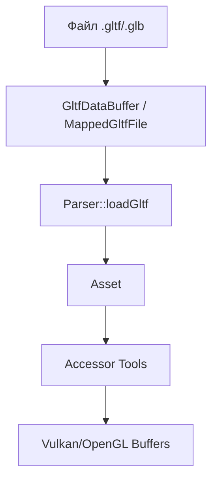

# Быстрый старт fastgltf

**🟢 Уровень 1: Начинающий**

Минимальный рабочий пример загрузки glTF модели.

**Пример в репозитории:** [docs/examples/fastgltf_load_mesh.cpp](../examples/fastgltf_load_mesh.cpp)

## Теоретические основы

fastgltf — высокопроизводительный парсер glTF 2.0 (SIMD, zero-copy, C++17/20).

### Поток данных



## Практический старт

### Шаг 1: Интеграция в CMake

```cmake
add_subdirectory(external/fastgltf)

add_executable(YourApp src/main.cpp)
target_link_libraries(YourApp PRIVATE fastgltf::fastgltf)
```

### Шаг 2: Выбор стратегии

| Сценарий             | GltfDataGetter   | Options               | Category         |
|----------------------|------------------|-----------------------|------------------|
| **Прототипирование** | `GltfDataBuffer` | `None`                | `All`            |
| **Статика**          | `GltfDataBuffer` | `LoadExternalBuffers` | `OnlyRenderable` |
| **Большие миры**     | `MappedGltfFile` | `LoadExternalBuffers` | `OnlyRenderable` |
| **Анимация**         | `GltfFileStream` | `LoadExternalBuffers` | `All`            |

### Шаг 3: Код загрузки

```cpp
#include <fastgltf/core.hpp>
#include <fastgltf/types.hpp>
#include <iostream>

bool loadModel(const std::filesystem::path& path) {
    // 1. Создание парсера
    fastgltf::Parser parser;

    // 2. Загрузка файла
    auto data = fastgltf::GltfDataBuffer::FromPath(path);
    if (data.error() != fastgltf::Error::None) {
        std::cerr << "Error loading file: " << fastgltf::getErrorMessage(data.error()) << "\n";
        return false;
    }

    // 3. Парсинг
    auto asset = parser.loadGltf(data.get(), path.parent_path(), fastgltf::Options::None);
    if (asset.error() != fastgltf::Error::None) {
        std::cerr << "Error parsing glTF: " << fastgltf::getErrorMessage(asset.error()) << "\n";
        return false;
    }

    std::cout << "Loaded mesh count: " << asset->meshes.size() << "\n";
    return true;
}
```

## Дальнейшие шаги

1. **Изучите [интеграцию с графическими API](integration.md#5-интеграция-с-графическими-api)**.
2. **Посмотрите [примеры кода](../examples/fastgltf_load_mesh.cpp)**.
3. **Прочитайте [глубокие концепции](concepts.md)**.
