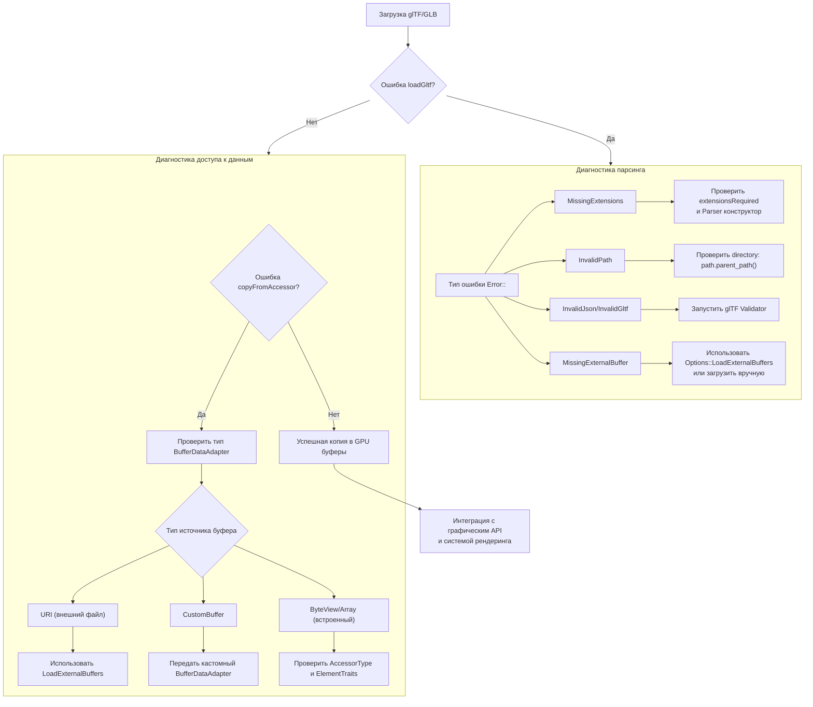
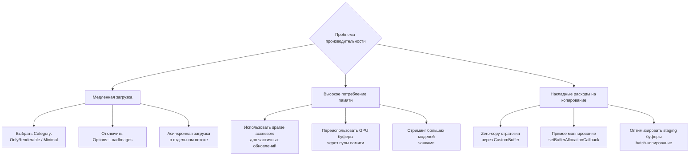

# Решение проблем fastgltf 🟡

Диагностика, оптимизация и практические решения для интеграции fastgltf с различными графическими API и системами
рендеринга.

## Деревья решений (Decision Trees)

### Дерево диагностики загрузки модели



### Дерево оптимизации производительности



## Реальные сценарии использования

### Сценарий 1: Загрузка статической модели для рендеринга

**Проблема**: Статическая модель хранится в glTF с внешними .bin файлами. Нужно загрузить данные в GPU буферы для
рендеринга.

**Решение**: Используем стандартный подход с загрузкой внешних буферов:

```cpp
// 1. Загрузка с внешними буферами
fastgltf::Parser parser;
fastgltf::Options options = fastgltf::Options::LoadExternalBuffers;
auto asset = parser.loadGltf(data.get(), directory, options);

if (asset.error() != fastgltf::Error::None) {
    // Диагностика через decision tree выше
    return;
}

// 2. Копирование данных в промежуточные массивы
std::vector<glm::vec3> positions;
std::vector<glm::vec3> normals;
std::vector<uint32_t> indices;

for (const auto& mesh : asset->meshes) {
    for (const auto& primitive : mesh.primitives) {
        // Позиции
        if (auto* posAttr = primitive.findAttribute("POSITION")) {
            const auto& accessor = asset->accessors[posAttr->accessorIndex];
            positions.resize(accessor.count);
            fastgltf::copyFromAccessor<glm::vec3>(
                asset.get(), accessor, positions.data()
            );
        }
        
        // Нормали
        if (auto* normAttr = primitive.findAttribute("NORMAL")) {
            const auto& accessor = asset->accessors[normAttr->accessorIndex];
            normals.resize(accessor.count);
            fastgltf::copyFromAccessor<glm::vec3>(
                asset.get(), accessor, normals.data()
            );
        }
        
        // Индексы
        if (primitive.indicesAccessor.has_value()) {
            const auto& accessor = asset->accessors[primitive.indicesAccessor.value()];
            indices.resize(accessor.count);
            if (accessor.componentType == fastgltf::ComponentType::UnsignedInt) {
                fastgltf::copyFromAccessor<uint32_t>(
                    asset.get(), accessor, indices.data()
                );
            } else if (accessor.componentType == fastgltf::ComponentType::UnsignedShort) {
                std::vector<uint16_t> shortIndices(accessor.count);
                fastgltf::copyFromAccessor<uint16_t>(
                    asset.get(), accessor, shortIndices.data()
                );
                // Конвертация в uint32_t
                indices.assign(shortIndices.begin(), shortIndices.end());
            }
        }
    }
}

// 3. Создание GPU буферов (пример для OpenGL)
glGenBuffers(1, &vertexBuffer);
glBindBuffer(GL_ARRAY_BUFFER, vertexBuffer);
glBufferData(GL_ARRAY_BUFFER, 
             positions.size() * sizeof(glm::vec3) + normals.size() * sizeof(glm::vec3),
             nullptr, GL_STATIC_DRAW);

// Копирование данных
glBufferSubData(GL_ARRAY_BUFFER, 0, 
                positions.size() * sizeof(glm::vec3), positions.data());
glBufferSubData(GL_ARRAY_BUFFER, positions.size() * sizeof(glm::vec3),
                normals.size() * sizeof(glm::vec3), normals.data());
```

**Таблица принятия решений для статического рендеринга**:

| Параметр             | Рекомендуемый выбор      | Обоснование                                                          |
|----------------------|--------------------------|----------------------------------------------------------------------|
| **Category**         | `OnlyRenderable`         | Загружаем только рендерные данные, пропускаем ноды, камеры, анимации |
| **Options**          | `LoadExternalBuffers`    | Загрузка внешних .bin файлов                                         |
| **Buffer стратегия** | Staging буферы           | Простота, совместимость                                              |
| **Sparse accessors** | Использовать при наличии | Эффективное обновление изменённых данных                             |

### Сценарий 2: Анимированный персонаж

**Проблема**: Персонаж с skeletal animation (кости, веса вершин) и morph targets (blend shapes). Нужно загрузить данные
для системы анимации.

**Решение**: Загрузка полной модели с анимациями:

```cpp
// Компоненты для анимационных данных
struct SkeletonData {
    std::vector<glm::mat4> inverseBindMatrices;
    std::vector<std::string> jointNames;
};

struct AnimationData {
    std::vector<fastgltf::Animation> animations;
    float currentTime = 0.0f;
};

struct MorphTargetsData {
    std::vector<float> weights;
};

// Загрузка анимированной модели
auto LoadAnimatedModel(const fastgltf::Asset& asset) {
    AnimatedModel model;
    
    // Извлечение данных скелета
    if (!asset.skins.empty()) {
        const auto& skin = asset.skins[0];
        SkeletonData skeleton;
        
        // Копирование inverse bind matrices
        if (skin.inverseBindMatrices.has_value()) {
            const auto& accessor = asset.accessors[skin.inverseBindMatrices.value()];
            skeleton.inverseBindMatrices.resize(accessor.count);
            fastgltf::copyFromAccessor<glm::mat4>(
                asset, accessor, skeleton.inverseBindMatrices.data()
            );
        }
        
        model.skeleton = std::move(skeleton);
    }
    
    // Извлечение анимаций
    if (!asset.animations.empty()) {
        AnimationData anim;
        anim.animations = asset.animations;
        model.animation = std::move(anim);
    }
    
    // Извлечение morph targets
    for (const auto& mesh : asset.meshes) {
        if (!mesh.weights.empty()) {
            MorphTargetsData morph;
            morph.weights = mesh.weights;
            model.morphTargets = std::move(morph);
            break;
        }
    }
    
    return model;
}
```

**Проблемы и решения для анимации**:

| Проблема                             | Симптом                             | Решение                                                        |
|--------------------------------------|-------------------------------------|----------------------------------------------------------------|
| Inverse bind matrices не загружаются | Accessor возвращает нулевые матрицы | Проверить skin.inverseBindMatrices index и bufferView          |
| Веса вершин не соответствуют костям  | Деформация меша некорректна         | Убедиться, что JOINTS_0 и WEIGHTS_0 accessors синхронизированы |
| Morph targets не интерполируются     | Blend shapes не работают            | Проверить mesh.weights и morph target accessors                |

### Сценарий 3: Heightmap ландшафт

**Проблема**: Ландшафт хранится как heightmap в glTF (один меш с вершинами). Нужно создать HeightFieldShape для
физического движка и оптимизировать память через sparse accessors.

**Решение**: Использование sparse accessors для эффективного обновления heightmap:

```cpp
// 1. Проверка sparse accessors
const auto& accessor = asset.accessors[positionAccessorIndex];
if (accessor.sparse.has_value()) {
    // Использовать sparse представление для partial updates
    const auto& sparse = accessor.sparse.value();
    
    // Индексы изменённых вершин
    std::vector<uint32_t> sparseIndices;
    fastgltf::copyFromAccessor<uint32_t>(
        asset, sparse.indices, sparseIndices
    );
    
    // Новые значения позиций
    std::vector<glm::vec3> sparseValues;
    fastgltf::copyFromAccessor<glm::vec3>(
        asset, sparse.values, sparseValues
    );
    
    // 2. Обновление только изменённых вершин в GPU буфере
    UpdateGPUBufferSparse(gpuBuffer, sparseIndices, sparseValues);
} else {
    // Полная загрузка heightmap
    std::vector<glm::vec3> allVertices;
    fastgltf::copyFromAccessor<glm::vec3>(
        asset, positionAccessorIndex, allVertices
    );
    
    // Создание HeightFieldShape
    CreateHeightField(allVertices);
}
```

## Оптимизация производительности: таблицы решений

### Выбор Category для разных сценариев

| Сценарий использования   | Рекомендуемая Category     | Оптимизации                       | Время загрузки (пример) |
|--------------------------|----------------------------|-----------------------------------|-------------------------|
| **Статические модели**   | `OnlyRenderable`           | Пропускает ноды, камеры, анимации | 5-15 мс                 |
| **Анимированные модели** | `All` или `OnlyRenderable` | Загружает скелеты и анимации      | 20-50 мс                |
| **Ландшафты**            | `OnlyRenderable`           | Пропускает текстуры, материалы    | 10-30 мс                |
| **UI элементы**          | `OnlyRenderable`           | Минимальные данные, только меши   | 2-8 мс                  |
| **Полные сцены**         | `All`                      | Все данные для редактора          | 50-200 мс               |

### Стратегии копирования данных в GPU

| Стратегия                        | Использование                            | Преимущества                    | Недостатки                         |
|----------------------------------|------------------------------------------|---------------------------------|------------------------------------|
| **Zero-copy через CustomBuffer** | Streaming, большие модели                | Нулевые накладные расходы       | Требует управления памятью         |
| **Staging буферы**               | Статические меши, ландшафты              | Простота, совместимость         | Двойное копирование                |
| **Прямое маппирование**          | Анимированные модели, обновляемые данные | Минимальная задержка            | Сложность синхронизации            |
| **Batch-копирование**            | Множество мелких моделей                 | Оптимизация через один transfer | Требует предварительной подготовки |

### Оптимизация памяти через sparse accessors

| Тип данных               | Использование sparse           | Экономия памяти | Сложность реализации |
|--------------------------|--------------------------------|-----------------|----------------------|
| **Partial updates**      | Высокое (partial updates)      | 90-99%          | Средняя              |
| **Анимационные данные**  | Среднее (keyframe compression) | 60-80%          | Высокая              |
| **Динамический контент** | Высокое (deltas)               | 85-95%          | Средняя              |
| **Редкие изменения**     | Низкое (редкие изменения)      | 30-50%          | Низкая               |

## Расширенные рекомендации

### Интеграция с системой материалов

**Проблема**: fastgltf загружает материалы PBR (baseColorFactor, metallicRoughness), но ваша система использует
собственный формат материалов.

**Решение**: Адаптер материалов с трансформацией данных:

```cpp
struct CustomMaterial {
    glm::vec4 albedo;
    float roughness;
    float metallic;
    float emission;
};

auto ConvertGltfMaterial(const fastgltf::Material& gltfMat) {
    CustomMaterial customMat;
    
    // Базовый цвет
    if (gltfMat.pbrData.baseColorFactor.size() >= 3) {
        customMat.albedo = glm::vec4(
            gltfMat.pbrData.baseColorFactor[0],
            gltfMat.pbrData.baseColorFactor[1],
            gltfMat.pbrData.baseColorFactor[2],
            gltfMat.pbrData.baseColorFactor.size() > 3 ? 
                gltfMat.pbrData.baseColorFactor[3] : 1.0f
        );
    }
    
    // Metallic-roughness
    if (gltfMat.pbrData.metallicFactor.has_value()) {
        customMat.metallic = *gltfMat.pbrData.metallicFactor;
    }
    if (gltfMat.pbrData.roughnessFactor.has_value()) {
        customMat.roughness = *gltfMat.pbrData.roughnessFactor;
    }
    
    // Эмиссия
    if (gltfMat.emissiveFactor.size() >= 3) {
        customMat.emission = std::max({
            gltfMat.emissiveFactor[0],
            gltfMat.emissiveFactor[1],
            gltfMat.emissiveFactor[2]
        });
    }
    
    return customMat;
}
```

### Оптимизация загрузки через многопоточность

**Проблема**: Загрузка больших моделей блокирует основной поток.

**Решение**: Асинхронная загрузка с прогресс-отчётом:

```cpp
class AsyncGltfLoader {
public:
    struct LoadTask {
        std::filesystem::path filePath;
        fastgltf::Category category;
        std::function<void(fastgltf::Asset)> callback;
    };
    
    void EnqueueLoad(LoadTask task) {
        std::lock_guard lock(queueMutex);
        loadQueue.push(std::move(task));
        condition.notify_one();
    }
    
private:
    void WorkerThread() {
        while (running) {
            LoadTask task;
            {
                std::unique_lock lock(queueMutex);
                condition.wait(lock, [&] { 
                    return !loadQueue.empty() || !running; 
                });
                
                if (!running) break;
                
                task = std::move(loadQueue.front());
                loadQueue.pop();
            }
            
            // Асинхронная загрузка
            auto asset = LoadAssetAsync(task.filePath, task.category);
            task.callback(std::move(asset));
        }
    }
    
    fastgltf::Asset LoadAssetAsync(const std::filesystem::path& path, 
                                   fastgltf::Category category) {
        // Загрузка в фоновом потоке
        fastgltf::Parser parser;
        fastgltf::GltfDataBuffer data;
        
        if (!data.loadFromFile(path)) {
            throw std::runtime_error("Failed to load glTF file");
        }
        
        auto options = fastgltf::Options::LoadExternalBuffers;
        return parser.loadGltf(&data, path.parent_path(), options, category)
                    .get();
    }
};
```

### Интеграция с профилировщиками

**Проблема**: Неизвестно, какие этапы загрузки fastgltf являются bottleneck.

**Решение**: Инструментирование кода с профилировочными зонами:

```cpp
// Пример с использованием Tracy или подобного профилировщика
auto LoadWithProfiling(const std::filesystem::path& path) {
    ZoneScopedN("GltfLoadTotal");
    
    {
        ZoneScopedN("LoadFileData");
        fastgltf::GltfDataBuffer data;
        data.loadFromFile(path);
    }
    
    fastgltf::Parser parser;
    
    {
        ZoneScopedN("ParseJson");
        auto asset = parser.loadGltf(&data, path.parent_path(), 
                                     fastgltf::Options::LoadExternalBuffers);
    }
    
    {
        ZoneScopedN("CopyToGPU");
        // Копирование данных в GPU буферы с профилированием
    }
    
    FrameMark;
}
```

## Таблицы быстрых решений ошибок

### Быстрая диагностика по коду ошибки

| Код ошибки                          | Причина                                | Быстрое решение                                                           |
|-------------------------------------|----------------------------------------|---------------------------------------------------------------------------|
| `Error::MissingExtensions`          | Экспортер добавил кастомное расширение | Игнорировать через `DontRequireValidAssetMember` или добавить заглушку    |
| `Error::InvalidPath`                | Относительные пути при загрузке        | Использовать `std::filesystem::absolute(path).parent_path()`              |
| `Error::MissingExternalBuffer`      | .bin файлы в отдельной папке           | Загрузить вручную через `GltfDataBuffer::loadFromFile`                    |
| `Error::InvalidJson`                | Экспорт с нестандартным JSON           | Валидация через `fastgltf::validate()` и ручной парсинг проблемных частей |
| `Error::InvalidGLB`                 | GLB сжатый через кастомный алгоритм    | Конвертировать в стандартный GLB через инструменты Khronos                |
| `Error::FileBufferAllocationFailed` | Большая модель (>1GB)                  | Использовать streaming через `MappedGltfFile` или загрузку чанками        |

### Оптимизации для специфичных сценариев

| Сценарий                  | Рекомендуемые флаги Options | Экономия памяти   | Примечания                               |
|---------------------------|-----------------------------|-------------------|------------------------------------------|
| **Статический рендеринг** | `LoadExternalBuffers`       | Зависит от модели | Загружает все внешние ресурсы            |
| **Headless обработка**    | `DontLoadImages`            | Значительная      | Пропускает текстуры для batch processing |
| **Мобильная сборка**      | `None` (минимальный набор)  | Максимальная      | Только необходимые данные для рендеринга |

## Заключение и лучшие практики

### Принципы интеграции fastgltf

1. **Модульность**: Изолировать fastgltf в отдельном модуле с чёткими интерфейсами для графического API и системы
   рендеринга.
2. **Асинхронность**: Все операции загрузки должны быть неблокирующими с поддержкой прогресса.
3. **Оптимизация**: Использовать sparse accessors, CustomBuffer и zero-copy стратегии там, где это необходимо.
4. **Профилирование**: Инструментировать все критические пути через профилировщик.
5. **Обработка ошибок**: Детальные диагностические отчёты с decision trees для быстрого решения проблем.

### Контрольный список для интеграции

- [ ] Настроены правильные Category и Options для вашего сценария
- [ ] Реализован кастомный BufferDataAdapter для интеграции с графическим API
- [ ] Sparse accessors используются для partial updates данных
- [ ] Материалы преобразованы в вашу систему материалов
- [ ] Асинхронная загрузка с прогресс-отчётом
- [ ] Интеграция с профилировщиком
- [ ] Обработка ошибок с детальными диагностическими сообщениями
- [ ] Тестирование на реальных моделях разного размера

### Следующие шаги после настройки

1. **Производительность**: Замер времени загрузки для моделей разного размера
2. **Память**: Мониторинг потребления RAM и GPU memory
3. **Стабильность**: Тестирование на edge cases (пустые модели, битые файлы)
4. **Интеграция**: Подключение к системам рендеринга и физики

---

## См. также

- [Интеграция](integration.md) — стратегии интеграции с графическими API и оптимизации
- [Основные понятия](concepts.md) — deep dive в sparse accessors, morph targets и архитектуру fastgltf
- [Справочник API](api-reference.md) — практические примеры использования
- [Глоссарий](glossary.md) — визуализация связей между терминами fastgltf
- [Быстрый старт](quickstart.md) — теоретические основы и практические сценарии
