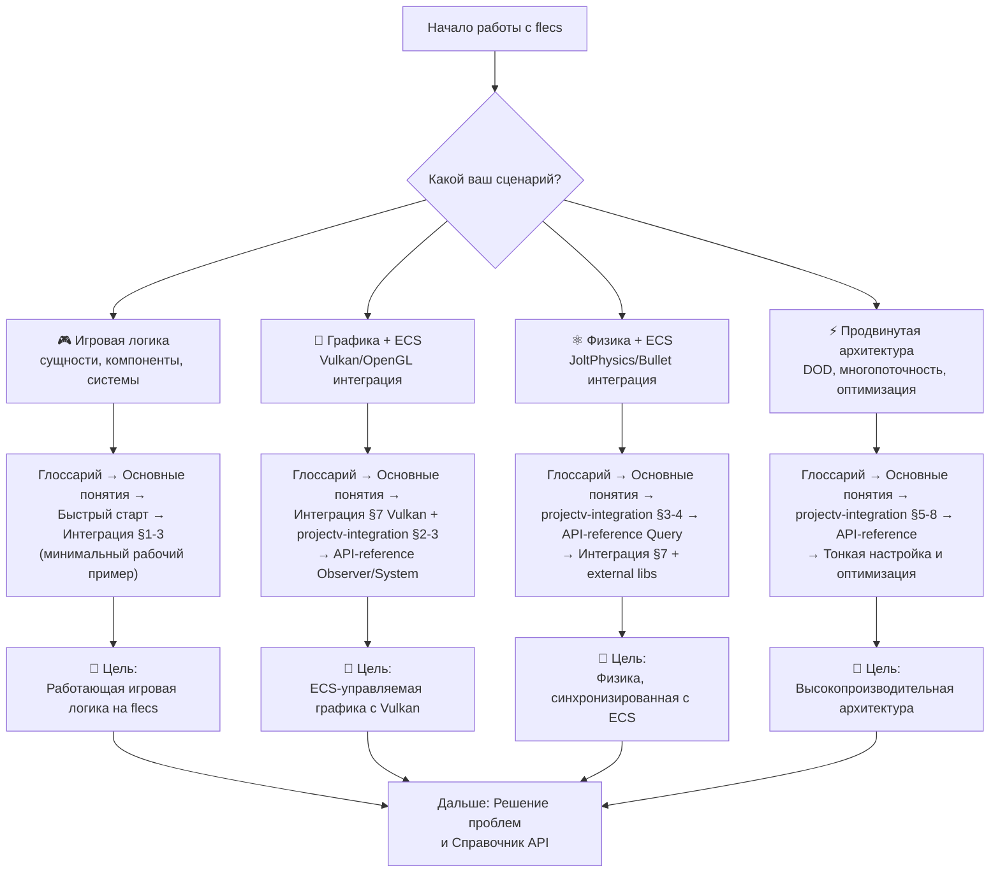

# Flecs

**🟢 Уровень 1: Начинающий**

**Flecs** — быстрый и лёгкий Entity Component System для игр и симуляций. Позволяет строить приложения с миллионами
сущностей (entities). Поддерживает связи между сущностями (relationships), иерархии, префабы, запросы (queries) и
системы (systems). API на C99 и C++17, archetype-хранилище (SoA), кешируемые запросы.

Версия: **4.1.4** (см. [flecs.h](../../external/flecs/include/flecs.h)).
Исходники: [SanderMertens/flecs](https://github.com/SanderMertens/flecs), [документация](../../external/flecs/docs).

**Основные возможности:** организация игровой логики — сущности, компоненты, системы. Цикл обновления вызывается через
`world.progress()` или `ecs_progress()`. flecs не зависит от графических API; рендеринг подключается отдельно (например,
через компоненты `VkBuffer`, `Mesh` и т.д.).

---

## 🗺️ Диаграмма обучения (Learning Path)

Выберите свой сценарий и следуйте по соответствующему пути:

---

## Путь для C++ разработчика

1. **[Глоссарий](glossary.md)** — термины: World, Entity, Component, Query, System, iter
2. **[Основные понятия](concepts.md)** — ECS, архитектура flecs, pipeline, иерархии, singleton
3. **[Быстрый старт](quickstart.md)** — минимальное приложение с системой и сущностями
4. **[Интеграция](integration.md)** — CMake, SDL_AppIterate, модули, связка с Vulkan
5. **[Справочник API](api-reference.md)** — при необходимости: сигнатуры, ссылки на хедеры
6. **[Решение проблем](troubleshooting.md)** — при ошибках сборки, runtime или производительности

---

## Советы перед началом

**Модули.** `world.import<my_module>()` удобен для структуры кода, но для первого прототипа пишите всё в одном файле или
в обычных функциях. Разделяйте на модули, когда систем станет 10–15 и больше.

**Многопоточность.** Flecs поддерживает `.multi_threaded()`, но Vulkan — нет: запись в один CommandBuffer не
потокобезопасна. Сначала пишите все системы в одном потоке (по умолчанию). Когда добавите физику (Jolt), вынесите её в
отдельные потоки, рендеринг оставьте в главном.

**Префабы.** Для RTS (Warno, Supreme Commander и др.) префабы — основа: создайте префаб «Танк Т-72» один раз, спавньте
тысячи дешёвых копий через `entity.is_a(prefab_tank)`. См. [Основные понятия — Prefabs](concepts.md#prefabs-ecsisa).

---

## Содержание

### Обзор

| Раздел                          | Описание                                                                                      |
|---------------------------------|-----------------------------------------------------------------------------------------------|
| [Глоссарий](glossary.md)        | Словарь терминов flecs. flecs::world, flecs::entity, Query, System, Pipeline, Observer, iter. |
| [Основные понятия](concepts.md) | ECS, архитектура flecs, жизненный цикл, pipeline и фазы, иерархии, singleton, traversal.      |

### Практика

| Раздел                         | Описание                                                                                  |
|--------------------------------|-------------------------------------------------------------------------------------------|
| [Быстрый старт](quickstart.md) | Минимальный пример: world, entity, component, system, progress(). Named entity, child_of. |
| [Интеграция](integration.md)   | CMake, порядок include, SDL_AppIterate, модули, связка flecs + Vulkan.                    |

### Справка

| Раздел                                | Описание                                                                                 |
|---------------------------------------|------------------------------------------------------------------------------------------|
| [Справочник API](api-reference.md)    | World, Entity, Query, System, Observer, pairs, hierarchy. C++ и C API, ссылки на хедеры. |
| [Решение проблем](troubleshooting.md) | Ошибки сборки, runtime, производительность, Vulkan handles.                              |

---

## Быстрые ссылки по задачам

| Задача                                   | Раздел                                                                                                      |
|------------------------------------------|-------------------------------------------------------------------------------------------------------------|
| Интеграция в ProjectV (архитектура)      | [Интеграция в ProjectV](projectv-integration.md)                                                            |
| Добавить flecs в проект SDL3+Vulkan      | [Быстрый старт](quickstart.md), [Интеграция](integration.md)                                                |
| Создать сущность с компонентами          | [Быстрый старт](quickstart.md), [Справочник API — Entity](api-reference.md#entity)                          |
| Создать entity с именем                  | [Быстрый старт](quickstart.md#шаг-3-именованная-сущность), [API — Entity](api-reference.md#entity)          |
| Создать систему (system)                 | [Быстрый старт](quickstart.md), [Справочник API — System](api-reference.md#system)                          |
| Написать запрос с optional/Not           | [Основные понятия — Query](concepts.md#query-optional-и-not), [API — Query](api-reference.md#query)         |
| Построить иерархию (parent–child)        | [Быстрый старт](quickstart.md#шаг-4-иерархия), [Справочник API — Hierarchy](api-reference.md#hierarchy)     |
| Singleton (глобальные настройки)         | [Основные понятия — Singleton](concepts.md#singleton), [API](api-reference.md)                              |
| Prefab (шаблон сущностей)                | [Основные понятия — Prefabs](concepts.md#prefabs-ecsisa), [API — Prefab](api-reference.md#prefab)           |
| Observer для spawn/cleanup               | [Справочник API — Observer](api-reference.md#observer), [Основные понятия](concepts.md#события-и-observers) |
| Вызвать progress в SDL_AppIterate        | [Интеграция — Порядок вызовов](integration.md#3-порядок-вызовов)                                            |
| Организовать код в модули                | [Интеграция — Модули](integration.md#4-модули)                                                              |
| Компоненты с Vulkan handles              | [Интеграция — flecs + Vulkan](integration.md#7-связка-flecs--vulkan)                                        |
| flecs не линкуется / undefined reference | [Решение проблем](troubleshooting.md)                                                                       |

---

## Структура заголовков

| Файл                                                                                              | Назначение                                                                                                   |
|---------------------------------------------------------------------------------------------------|--------------------------------------------------------------------------------------------------------------|
| [flecs.h](../../external/flecs/include/flecs.h)                                                   | Точка входа. C API; при C++ подтягивает [flecs.hpp](../../external/flecs/include/flecs/addons/cpp/flecs.hpp) |
| [flecs/addons/flecs_c.h](../../external/flecs/include/flecs/addons/flecs_c.h)                     | C макросы: ECS_COMPONENT, ECS_SYSTEM, ecs_set, ecs_each                                                      |
| [flecs/addons/cpp/flecs.hpp](../../external/flecs/include/flecs/addons/cpp/flecs.hpp)             | C++ точка входа                                                                                              |
| [flecs/addons/cpp/entity.hpp](../../external/flecs/include/flecs/addons/cpp/entity.hpp)           | flecs::entity                                                                                                |
| [flecs/addons/cpp/mixins/query](../../external/flecs/include/flecs/addons/cpp/mixins/query)       | query, query_builder                                                                                         |
| [flecs/addons/cpp/mixins/system](../../external/flecs/include/flecs/addons/cpp/mixins/system)     | system, system_builder                                                                                       |
| [flecs/addons/cpp/mixins/observer](../../external/flecs/include/flecs/addons/cpp/mixins/observer) | observer                                                                                                     |
| [flecs/addons/system.h](../../external/flecs/include/flecs/addons/system.h)                       | ecs_system_desc_t                                                                                            |

---

## Требования

- C++17 или новее (для C++ API); C99 для C API
- CMake 3.10+ (при сборке из исходников)
- SDL3 для интеграции с игровым циклом (опционально; можно вызывать `world.progress()` из любого цикла)

**Связанные разделы:** [SDL3](../sdl/README.md), [Vulkan](../vulkan/README.md), [документация проекта](../README.md).

← [На главную документации](../README.md)
