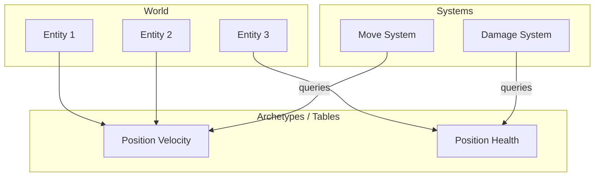
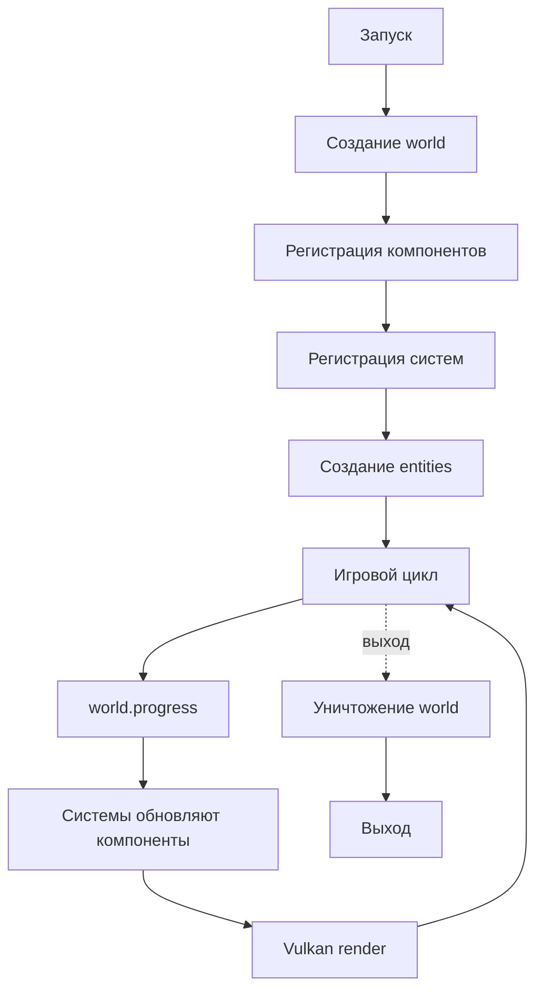
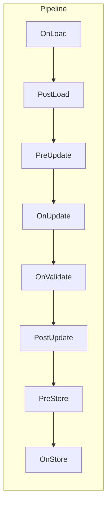
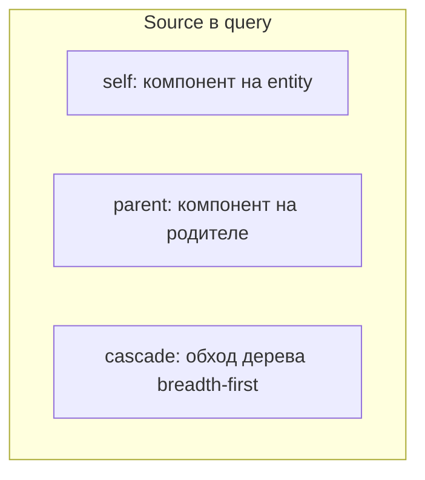
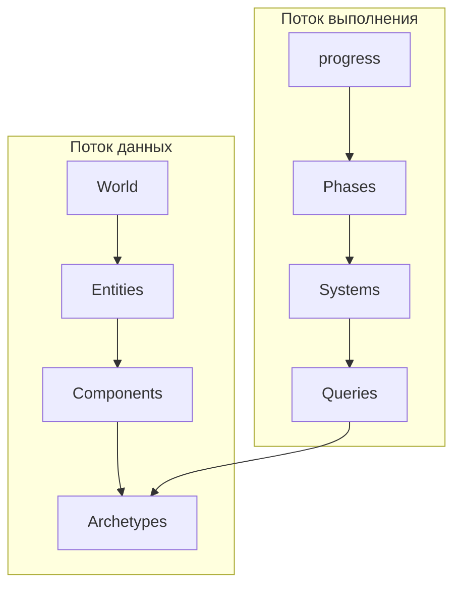

# Основные понятия

**🟡 Уровень 2: Средний**

Краткое введение в flecs. Термины — в [глоссарии](glossary.md).

## На этой странице

- [Что такое ECS и зачем он в игре на Vulkan](#что-такое-ecs-и-зачем-он-в-игре-на-vulkan)
- [Архитектура flecs](#архитектура-flecs)
- [Жизненный цикл](#жизненный-цикл)
- [Pipeline и фазы](#pipeline-и-фазы)
- [Иерархии и отношения (pairs)](#иерархии-и-отношения-pairs)
- [Traversal (cascade, parent)](#traversal-cascade-parent)
- [Singleton](#singleton)
- [События и observers](#события-и-observers)
- [Query: optional и Not](#query-optional-и-not)
- [Prefabs (EcsIsA)](#prefabs-ecsisa)
- [Компонент как entity](#компонент-как-entity)
- [Версионирование entity](#версионирование-entity)
- [Общая схема данных](#общая-схема-данных)
- [Дальше](#дальше)

---

## Что такое ECS и зачем он в игре на Vulkan

ECS (Entity Component System) — способ организации кода и данных:

- **Entity** — уникальный объект (юнит, здание, частица, камера). Сам по себе это просто ID.
- **Component** — данные, привязанные к entity (Position, Velocity, Health, Mesh и т.д.).
- **System** — функция, которая выполняется для всех entities, имеющих определённый набор компонентов.

Vulkan отвечает за отрисовку; ECS — за логику и структуру данных. Преимущества:

- **Разделение данных и логики** — системы получают только нужные компоненты, кеш-дружественная итерация (SoA).
- **Гибкость** — добавление нового поведения через новые компоненты и системы без изменения старых.
- **Масштабируемость** — flecs оптимизирован под миллионы entities и многопоточность.
- **Связи между сущностями** — иерархии (parent–child), инвентарь, графы отношений через pairs.

---

## Архитектура flecs



- **World** хранит все entities и их компоненты.
- **Archetypes** — таблицы (tables), группирующие entities с одинаковым набором компонентов. Хранение SoA (Structure of
  Arrays): для archetype `[Position, Velocity]` — два массива (`Position[]`, `Velocity[]`), а не массив структур.
  Итерация систем — последовательный доступ к массивам, кеш-дружественно. Archetype создаётся при первой entity с данной
  комбинацией компонентов.
- **Systems** содержат query и callback; при `progress()` выполняются для matching entities.
- **Queries** — условия матчинга: «все entities с Position и Velocity», «все дети parent» и т.д.

---

## Жизненный цикл



Типичный порядок:

1. Создать `flecs::world` (или `ecs_init()`).
2. Зарегистрировать компоненты — в C++ автоматически при `entity.set<Position>()`, в C —
   `ECS_COMPONENT(world, Position)`.
3. Создать системы — `world.system<Position, Velocity>().each(...)`.
4. Создать entities и добавить компоненты.
5. В цикле кадра: `world.progress(delta_time)` — выполняются все системы в pipeline.
6. После `progress` — отрисовка Vulkan (command buffers, present).
7. При выходе — world уничтожается (деструктор или `ecs_fini`).

---

## Pipeline и фазы

Pipeline определяет порядок выполнения систем. Системы привязываются к фазам (phase tags):

| Фаза           | Назначение                      |
|----------------|---------------------------------|
| **OnLoad**     | Загрузка ресурсов               |
| **PostLoad**   | Постобработка после загрузки    |
| **PreUpdate**  | Подготовка перед обновлением    |
| **OnUpdate**   | Основная логика (движение, AI)  |
| **OnValidate** | Проверки                        |
| **PostUpdate** | Синхронизация после обновления  |
| **PreStore**   | Подготовка к сохранению         |
| **OnStore**    | Отрисовка, сохранение состояния |



Системы внутри одной фазы выполняются в порядке объявления. Для отрисовки обычно используют `OnStore` или отдельную
фазу.

---

## Иерархии и отношения (pairs)

### Иерархия (EcsChildOf)

Entities могут быть родителями и детьми. Встроенный relationship — `EcsChildOf`:

```cpp
auto parent = world.entity("Ship");
auto child = world.entity("Engine").child_of(parent);
// При удалении parent удаляются и все дети
```

Пути: `ecs_lookup(world, "Ship.Engine")` или `child.path()` → `"Ship::Engine"`.

### Pairs (связи)

Пара (relationship, target) кодирует связь между entities:

```cpp
auto Likes = world.entity();
Bob.add(Likes, Alice);  // Bob likes Alice
```

Один и тот же relationship может использоваться с разными targets: `Bob.add(Eats, Apples)`, `Bob.add(Eats, Pears)`.

### Traversal в запросах

Queries могут обходить иерархию — см. [Traversal (cascade, parent)](#traversal-cascade-parent).

---

## Traversal (cascade, parent)

**Source** — entity, на которой проверяется term. По умолчанию — сама entity (self). Можно указать:

- **parent** — компонент с родителя по `ChildOf`. Entity должна быть ребёнком.
- **cascade** — обход иерархии breadth-first: родитель → дети → внуки.



Пример: система трансформаций — entity имеет `Transform`; родитель тоже имеет `Transform`. Нужен локальный transform и
мировой (родительский):

```cpp
world.query_builder<Transform, Transform>()
    .term_at(2).parent()   // второй Transform — от родителя
    .cascade()            // обход: сначала родители, потом дети
    .build()
    .each([](Transform& local, const Transform& parent) {
        // local — локальный; parent — мировые координаты родителя
    });
```

---

## Singleton

Глобальные настройки без привязки к конкретной entity: гравитация, настройки рендера, глобальное время.

```cpp
struct Gravity { float value; };

world.set<Gravity>({ 9.81f });           // установить
const Gravity* g = world.get<Gravity>(); // получить
```

Реализация: компонент добавляется к id самого компонента (`ecs_id(Gravity)`). Запрос
`world.system<Position, const Gravity>()` будет матчить entities с `Position`; Gravity берётся из singleton.

---

## События и observers

Observers реагируют на изменения ECS, а не выполняются каждый кадр:

| Событие               | Когда срабатывает                        |
|-----------------------|------------------------------------------|
| **OnAdd**             | Компонент добавлен к entity              |
| **OnRemove**          | Компонент удалён                         |
| **OnSet**             | Значение компонента установлено/изменено |
| **OnRemove+OnDelete** | Entity удаляется (все компоненты)        |

Типичное использование:

- **Spawn** — при добавлении `Mesh` создавать Vulkan resources.
- **Cleanup** — при OnRemove `VkBuffer` освобождать буфер до уничтожения world.
- **Синхронизация** — при OnSet `Transform` обновлять uniform buffer.

```cpp
world.observer<Mesh>()
    .event(flecs::OnAdd)
    .each([](flecs::entity e, Mesh& m) {
        // загрузить модель, создать VkBuffer
    });
```

---

## Query: optional и Not

| Оператор     | C++                                  | Назначение                                                                             |
|--------------|--------------------------------------|----------------------------------------------------------------------------------------|
| **optional** | `.with<Health>().optional()`         | Компонент необязателен. Entity с Health — `get` возвращает указатель; без — `nullptr`. |
| **Not**      | `.with<Position>().oper(flecs::Not)` | Исключить entities с компонентом. «Все без Dead» — `.oper(flecs::Not).with<Dead>()`.   |

Пример: система лечения — entity может иметь или не иметь `Health`:

```cpp
world.query_builder<Position, Health>()
    .term_at(2).optional()  // Health необязателен
    .build()
    .each([](Position& p, Health* h) {
        if (h) h->current = min(h->current + 1, h->max);
    });
```

---

## Prefabs (EcsIsA)

Prefab — entity-шаблон. Instance создаётся через pair `(EcsIsA, prefab)` и наследует компоненты prefab.

Для стратегий с массовыми юнитами (RTS, армейские симуляторы) префабы — основной инструмент: один шаблон, тысячи
instance'ов без дублирования данных.

```cpp
auto SpaceShip = world.prefab("SpaceShip").set(Defense{50});
auto inst = world.entity().is_a(SpaceShip);  // instance с Defense
```

В C: `ecs_entity_t inst = ecs_new_w_pair(world, EcsIsA, prefab);`. Компоненты prefab можно переопределять на instance.
Подробнее: [PrefabsManual.md](../../external/flecs/docs/PrefabsManual.md).

---

## Компонент как entity

Компоненты в flecs регистрируются как entities с метаданными. У entity компонента есть `EcsComponent` (размер,
alignment). К компоненту можно добавлять теги, как к обычной entity — например, `Serializable` для сериализации. В C++:
`world.entity<Position>()` возвращает entity компонента.

---

## Версионирование entity

`ecs_entity_t` — 64 бита. Младшие 32 бита — уникальный ID; старшие — версия (generation). При переиспользовании
удалённой entity версия увеличивается. Это позволяет проверять «живость» через `ecs_is_alive`: старый указатель на
entity после `ecs_delete` и создания новой entity с тем же id будет невалиден (разные версии).

---

## Общая схема данных



- **Данные:** World → Entity → Component → Archetype (таблица).
- **Выполнение:** `progress()` → фазы → системы → queries матчат archetypes → callback получает arrays компонентов.

---

## Дальше

**Следующий раздел:** [Быстрый старт](quickstart.md) — минимальный пример с world, entity, component, system и
`progress()`.

**См. также:**

- [Глоссарий](glossary.md) — термины
- [Интеграция](integration.md) — связка с SDL и Vulkan
