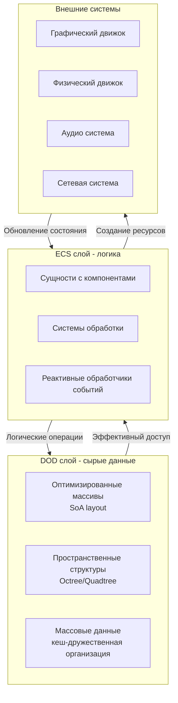

# Интеграция flecs с графическими и физическими движками

**🟡 Уровень 2: Средний**

Данный документ содержит практические рекомендации по интеграции библиотеки flecs (Entity Component System) с
графическими (Vulkan, OpenGL, Direct3D) и физическими (JoltPhysics, Bullet, PhysX) движками. Представленные паттерны
универсальны и могут быть адаптированы для любых игровых или симуляционных проектов.

## Оглавление

1. [Архитектурные подходы для интеграции](#архитектурные-подходы-для-интеграции)
2. [Компоненты для графических ресурсов](#компоненты-для-графических-ресурсов)
3. [Компоненты для физических тел](#компоненты-для-физических-тел)
4. [Системы для синхронизации данных](#системы-для-синхронизации-данных)
5. [Observers для управления ресурсами](#observers-для-управления-ресурсами)
6. [Многопоточная обработка](#многопоточная-обработка)
7. [Практические паттерны интеграции](#практические-паттерны-интеграции)
8. [Лучшие практики](#лучшие-практики)

---

## Архитектурные подходы для интеграции

### Гибридная архитектура: ECS + DOD

Для высокопроизводительных приложений рекомендуется комбинировать ECS для логики с Data-Oriented Design (DOD) для сырых
данных:



### Роль flecs в интеграционном стеке

Flecs выступает как центральный координатор между различными системами:

1. **Управление жизненным циклом** ресурсов через observers
2. **Синхронизация данных** между ECS и внешними системами
3. **Организация иерархий** для пространственного разделения и оптимизации
4. **Реактивное программирование** для автоматической обработки изменений
5. **Многопоточная обработка** с безопасным доступом к данным

### Типичная архитектура интеграции

```cpp
// Общая архитектура для интеграции ECS с внешними системами
class IntegrationArchitecture {
public:
    // Шаг 1: Регистрация компонентов для внешних систем
    void register_external_components(flecs::world& world);

    // Шаг 2: Создание систем синхронизации
    void create_sync_systems(flecs::world& world);

    // Шаг 3: Настройка observers для управления ресурсами
    void setup_resource_observers(flecs::world& world);

    // Шаг 4: Конфигурация многопоточной обработки
    void configure_multithreading(flecs::world& world);

    // Шаг 5: Интеграция в главный цикл приложения
    void integrate_into_main_loop(flecs::world& world);
};
```

---

## Компоненты для графических ресурсов

### Абстрактные компоненты для графических API

Для интеграции ECS с графическими API (Vulkan, Direct3D, OpenGL) рекомендуется использовать следующие абстрактные
паттерны компонентов:

```cpp
// Базовый интерфейс для GPU ресурсов
struct GraphicsResource {
    void* api_handle = nullptr;          // Абстрактный указатель на ресурс API
    size_t size = 0;
    uint32_t usage_flags = 0;
    bool needs_update = true;
    ResourceState state = ResourceState::UNINITIALIZED;

    // Виртуальный интерфейс для полиморфного управления
    virtual ~GraphicsResource() = default;
    virtual bool create() = 0;
    virtual void destroy() = 0;
    virtual void update() = 0;
};

// Абстрактный компонент для буферов
template<typename APIHandle>
struct GPUBuffer : GraphicsResource {
    APIHandle buffer_handle;
    MemoryType memory_type = MemoryType::GPU_ONLY;
    BufferUsage usage = BufferUsage::VERTEX_BUFFER;

    bool create() override {
        // Специфичная для API реализация
        return create_api_specific_buffer(*this);
    }

    void destroy() override {
        // Специфичная для API реализация
        destroy_api_specific_buffer(*this);
        buffer_handle = APIHandle{};
    }
};

// Абстрактный компонент для текстур
template<typename ImageHandle, typename ViewHandle>
struct TextureResource : GraphicsResource {
    ImageHandle image_handle;
    ViewHandle view_handle;
    SamplerHandle sampler_handle;
    uint32_t width = 0, height = 0, depth = 0;
    TextureFormat format = TextureFormat::RGBA8_UNORM;
    bool mipmapped = false;

    bool create() override {
        // Специфичная для API реализация
        return create_api_specific_texture(*this);
    }
};
```

### Универсальные компоненты трансформации

```cpp
// Базовый компонент трансформации (3D)
struct Transform {
    glm::vec3 position = {0, 0, 0};
    glm::quat rotation = {1, 0, 0, 0};
    glm::vec3 scale = {1, 1, 1};
    glm::mat4 world_matrix = glm::mat4(1.0f);
    bool dirty = true;

    // Вычисляет мировую матрицу
    void update_world_matrix(const glm::mat4& parent_matrix = glm::mat4(1.0f)) {
        glm::mat4 local = glm::translate(glm::mat4(1.0f), position) *
                          glm::mat4_cast(rotation) *
                          glm::scale(glm::mat4(1.0f), scale);
        world_matrix = parent_matrix * local;
        dirty = false;
    }
};

// Компонент для иерархических трансформаций
struct Hierarchy {
    flecs::entity parent = flecs::entity::null();
    glm::mat4 local_matrix = glm::mat4(1.0f);

    // Получает мировую матрицу с учётом иерархии
    glm::mat4 get_world_matrix(flecs::world& world) const {
        if (!parent.is_alive()) {
            return local_matrix;
        }

        const Transform* parent_transform = parent.get<Transform>();
        if (parent_transform) {
            return parent_transform->world_matrix * local_matrix;
        }

        return local_matrix;
    }
};

// Компонент для пространственного индекса
struct SpatialIndex {
    BoundingBox bounds;
    SpatialCell* cell = nullptr;
    bool needs_reindex = true;

    void update(const Transform& transform) {
        // Обновление ограничивающего объема на основе трансформации
        bounds.center = transform.position;
        bounds.half_extents = transform.scale * 0.5f;
        needs_reindex = true;
    }
};
```

### Компоненты для рендеринга

```cpp
// Компонент для рендеринг-состояния
struct RenderState {
    bool is_visible = true;
    uint32_t layer = 0;                    // Слой рендеринга
    float lod_distance = 100.0f;           // Расстояние для LOD
    RenderFlags flags = RenderFlags::NONE;

    // Флаги для оптимизаций
    bool casts_shadow = true;
    bool receives_shadow = true;
    bool is_transparent = false;
};

// Компонент для материалов
struct Material {
    glm::vec4 base_color = {1, 1, 1, 1};
    float metallic = 0.0f;
    float roughness = 0.5f;
    glm::vec3 emissive = {0, 0, 0};
    float emissive_strength = 1.0f;

    // Ссылки на текстуры
    flecs::entity base_color_texture;
    flecs::entity normal_texture;
    flecs::entity metallic_roughness_texture;
    flecs::entity emissive_texture;
};
```

## Компоненты для физических тел

### Абстрактные компоненты для физических движков

Для интеграции ECS с физическими движками рекомендуется использовать следующие универсальные паттерны компонентов:

```cpp
// Абстрактный интерфейс для физических тел
struct PhysicsBody {
    void* body_id = nullptr;               // Идентификатор тела в физическом движке
    uint32_t collision_layer = 1;          // Слой коллизий (битовая маска)
    uint32_t collision_group = 0xFFFF;     // Группа коллизий
    bool needs_sync_to_physics = true;     // ECS -> Physics
    bool needs_sync_from_physics = false;  // Physics -> ECS
    BodyType body_type = BodyType::DYNAMIC;

    // Виртуальный интерфейс для полиморфного управления
    virtual ~PhysicsBody() = default;
    virtual bool create() = 0;
    virtual void destroy() = 0;
};

// Компонент для физических свойств
struct PhysicsProperties {
    float mass = 1.0f;
    float friction = 0.5f;
    float restitution = 0.1f;
    float linear_damping = 0.05f;
    float angular_damping = 0.05f;
    bool is_sensor = false;                // Триггер (не коллизия)
    bool is_kinematic = false;             // Управляется кодом, не физикой
    glm::vec3 gravity_scale = {1, 1, 1};

    // Настройки формы коллизии
    CollisionShape shape_type = CollisionShape::BOX;
    glm::vec3 shape_dimensions = {1, 1, 1};
    std::vector<glm::vec3> convex_hull_points;  // Для выпуклых оболочек
};

// Компонент для событий коллизий
struct CollisionEvents {
    struct Collision {
        flecs::entity other_entity;
        glm::vec3 contact_point;
        glm::vec3 contact_normal;
        glm::vec3 impulse;
        float penetration_depth;
        CollisionState state;              // BEGIN, PERSIST, END
    };

    std::vector<Collision> collisions;

    void clear() { collisions.clear(); }

    void add_begin(flecs::entity other, const glm::vec3& point,
                   const glm::vec3& normal, const glm::vec3& impulse) {
        collisions.push_back({other, point, normal, impulse, 0.0f, CollisionState::BEGIN});
    }

    void add_end(flecs::entity other) {
        collisions.push_back({other, {}, {}, {}, 0.0f, CollisionState::END});
    }
};
```

### Компоненты для физических ограничений

```cpp
// Базовый компонент для ограничений
struct Constraint {
    void* constraint_id = nullptr;
    flecs::entity body_a;
    flecs::entity body_b;
    ConstraintType type = ConstraintType::FIXED;

    // Параметры ограничения
    glm::vec3 pivot_a = {0, 0, 0};
    glm::vec3 pivot_b = {0, 0, 0};
    glm::vec3 axis_a = {1, 0, 0};
    glm::vec3 axis_b = {1, 0, 0};

    // Ограничения вращения/перемещения
    float min_limit = -FLT_MAX;
    float max_limit = FLT_MAX;
    float stiffness = 0.0f;
    float damping = 0.0f;
};

// Компонент для физических сил
struct AppliedForces {
    struct Force {
        glm::vec3 linear = {0, 0, 0};
        glm::vec3 angular = {0, 0, 0};
        glm::vec3 point = {0, 0, 0};  // Точка приложения
        ForceMode mode = ForceMode::FORCE;
    };

    std::vector<Force> forces;
    std::vector<Force> impulses;

    void clear() {
        forces.clear();
        impulses.clear();
    }
};
```

## Системы для синхронизации данных

### Паттерны синхронизации ECS ↔ Внешние системы

Для интеграции ECS с внешними системами рекомендуется использовать следующие паттерны синхронизации:

```cpp
// Базовая система для синхронизации данных
template<typename TECSComponent, typename TExternalData>
class SyncSystem {
protected:
    // Направление синхронизации
    SyncDirection direction = SyncDirection::BIDIRECTIONAL;
    bool enabled = true;
    float sync_frequency = 60.0f;  // Гц
    float time_since_last_sync = 0.0f;

public:
    virtual ~SyncSystem() = default;

    // Виртуальные методы для пользовательской логики
    virtual void sync_to_external(flecs::entity e, TECSComponent& comp,
                                  TExternalData& external) = 0;
    virtual void sync_from_external(flecs::entity e, TECSComponent& comp,
                                    const TExternalData& external) = 0;

    // Получение внешних данных (переопределяется пользователем)
    virtual TExternalData* get_external_data(flecs::entity e) = 0;

    // Создание системы flecs
    flecs::system create(flecs::world& world, const char* name) {
        return world.system<TECSComponent>(name)
            .kind(flecs::OnUpdate)
            .each([this](flecs::entity e, TECSComponent& comp) {
                if (!enabled) return;

                // Проверка частоты синхронизации
                time_since_last_sync += e.world().delta_time();
                if (time_since_last_sync < 1.0f / sync_frequency) {
                    return;
                }

                TExternalData* external = get_external_data(e);
                if (!external) return;

                // Синхронизация в соответствии с направлением
                if (direction == SyncDirection::ECS_TO_EXTERNAL ||
                    direction == SyncDirection::BIDIRECTIONAL) {
                    sync_to_external(e, comp, *external);
                }

                if (direction == SyncDirection::EXTERNAL_TO_ECS ||
                    direction == SyncDirection::BIDIRECTIONAL) {
                    sync_from_external(e, comp, *external);
                }

                time_since_last_sync = 0.0f;
            });
    }

    // Настройка системы
    void set_direction(SyncDirection dir) { direction = dir; }
    void set_frequency(float hz) { sync_frequency = hz; }
    void set_enabled(bool enable) { enabled = enable; }
};
```

### Синхронизация трансформаций с графическим движком

```cpp
// Пример: синхронизация Transform с графическим движком
class TransformSyncSystem : public SyncSystem<Transform, glm::mat4> {
public:
    TransformSyncSystem(GraphicsContext* context) : graphics_context(context) {}

    glm::mat4* get_external_data(flecs::entity e) override {
        // Получаем графический объект для сущности
        if (auto* gfx_obj = e.get<GraphicsObject>()) {
            return &gfx_obj->world_matrix;
        }
        return nullptr;
    }

    void sync_to_external(flecs::entity e, Transform& transform,
                          glm::mat4& world_matrix) override {
        // ECS -> Графика: обновляем мировую матрицу
        transform.update_world_matrix();
        world_matrix = transform.world_matrix;

        // Помечаем графический объект для обновления
        if (auto* render_state = e.get_mut<RenderState>()) {
            render_state->needs_update = true;
        }

        TracyPlot("TransformSyncToGraphics", 1.0f);
    }

    void sync_from_external(flecs::entity e, Transform& transform,
                            const glm::mat4& world_matrix) override {
        // Графика -> ECS: извлекаем трансформацию из матрицы
        glm::vec3 scale, translation, skew;
        glm::quat rotation;
        glm::vec4 perspective;

        if (glm::decompose(world_matrix, scale, rotation, translation,
                           skew, perspective)) {
            transform.position = translation;
            transform.rotation = rotation;
            transform.scale = scale;
            transform.dirty = true;
        }

        TracyPlot("TransformSyncFromGraphics", 1.0f);
    }

private:
    GraphicsContext* graphics_context;
};
```

### Синхронизация с физическим движком

```cpp
// Пример: синхронизация PhysicsBody с физическим движком
class PhysicsSyncSystem : public SyncSystem<Transform, void*> {
public:
    PhysicsSyncSystem(PhysicsEngine* physics) : physics_engine(physics) {}

    void* get_external_data(flecs::entity e) override {
        // Получаем физическое тело для сущности
        if (auto* physics_body = e.get<PhysicsBody>()) {
            return physics_body->body_id;
        }
        return nullptr;
    }

    void sync_to_external(flecs::entity e, Transform& transform,
                          void*& body_id) override {
        // ECS -> Физика: обновляем позицию физического тела
        if (!body_id) return;

        auto* physics_body = e.get<PhysicsBody>();
        if (!physics_body || !physics_body->needs_sync_to_physics) {
            return;
        }

        // Обновляем физическое тело в зависимости от типа
        if (physics_body->body_type == BodyType::KINEMATIC) {
            physics_engine->set_body_transform(body_id, transform.position,
                                               transform.rotation);
        }

        physics_body->needs_sync_to_physics = false;
        TracyPlot("PhysicsSyncTo", 1.0f);
    }

    void sync_from_external(flecs::entity e, Transform& transform,
                            const void*& body_id) override {
        // Физика -> ECS: обновляем трансформацию из физики
        if (!body_id) return;

        auto* physics_body = e.get_mut<PhysicsBody>();
        if (!physics_body || !physics_body->needs_sync_from_physics) {
            return;
        }

        // Получаем трансформацию из физического движка
        auto [position, rotation] = physics_engine->get_body_transform(body_id);
        transform.position = position;
        transform.rotation = rotation;
        transform.dirty = true;

        physics_body->needs_sync_from_physics = false;
        TracyPlot("PhysicsSyncFrom", 1.0f);
    }

private:
    PhysicsEngine* physics_engine;
};
```

### Система обработки коллизий

```cpp
// Система для обработки событий коллизий
world.system<PhysicsBody, CollisionEvents>("CollisionProcessingSystem")
    .kind(flecs::OnUpdate)
    .each([](PhysicsBody& body, CollisionEvents& events) {
        if (!body.body_id) return;

        // Получаем события коллизий из физического движка
        auto physics_collisions = get_collision_events(body.body_id);

        // Обрабатываем каждое событие
        for (const auto& collision : physics_collisions) {
            switch (collision.state) {
                case CollisionState::BEGIN:
                    events.add_begin(collision.other_entity,
                                    collision.contact_point,
                                    collision.contact_normal,
                                    collision.impulse);
                    break;

                case CollisionState::PERSIST:
                    // Обновляем существующие коллизии
                    update_persistent_collision(body.body_id, collision);
                    break;

                case CollisionState::END:
                    events.add_end(collision.other_entity);
                    break;
            }
        }

        // Очищаем события в физическом движке
        clear_collision_events(body.body_id);

        TracyPlot("CollisionsProcessed", (float)physics_collisions.size());
    });
```

## Observers для управления ресурсами

### Паттерны использования observers для автоматического управления

Observers в flecs предоставляют мощный механизм реактивного программирования для автоматического управления ресурсами:

```cpp
// Базовый паттерн: автоматическое создание ресурсов
world.observer<GraphicsResource>("ResourceCreationObserver")
    .event(flecs::OnAdd)
    .each([](flecs::entity e, GraphicsResource& resource) {
        // Создание ресурса при добавлении компонента
        if (resource.create()) {
            resource.state = ResourceState::CREATED;
            log_info("Created resource for entity {}", e.name());
        } else {
            log_error("Failed to create resource for entity {}", e.name());
            e.remove<GraphicsResource>();  // Откатываем изменения
        }

        TracyPlot("ResourcesCreated", 1.0f);
    });

// Автоматическая очистка ресурсов
world.observer<GraphicsResource>("ResourceDestructionObserver")
    .event(flecs::OnRemove | flecs::OnDelete)
    .each([](flecs::entity e, GraphicsResource& resource) {
        // Безопасное уничтожение ресурса
        resource.destroy();
        log_info("Destroyed resource for entity {}", e.name());

        TracyPlot("ResourcesDestroyed", 1.0f);
    });

// Реактивное обновление при изменении данных
world.observer<Transform>("TransformChangeObserver")
    .event(flecs::OnSet)
    .term<Transform>().oper(flecs::Not).with<Static>()
    .each([](flecs::entity e, Transform& transform) {
        if (transform.dirty) {
            // Каскадное обновление связанных компонентов

            // 1. Обновляем пространственный индекс
            if (e.has<SpatialIndex>()) {
                SpatialIndex* index = e.get_mut<SpatialIndex>();
                index->update(transform);
            }

            // 2. Помечаем графические объекты для обновления
            if (e.has<RenderState>()) {
                RenderState* state = e.get_mut<RenderState>();
                state->needs_update = true;
            }

            // 3. Обновляем физическое тело (если кинематическое)
            if (e.has<PhysicsBody>()) {
                PhysicsBody* physics = e.get_mut<PhysicsBody>();
                if (physics->body_type == BodyType::KINEMATIC) {
                    physics->needs_sync_to_physics = true;
                }
            }

            TracyPlot("TransformUpdates", 1.0f);
        }
    });
```

### Паттерн "Валидация состояния"

```cpp
// Observer для валидации корректности состояния
world.observer<PhysicsBody>("PhysicsBodyValidationObserver")
    .event(flecs::OnSet)
    .each([](flecs::entity e, PhysicsBody& physics) {
        // Проверяем корректность состояния
        if (physics.body_id == nullptr && !physics.is_sensor) {
            log_warning("Physics body created without body_id for entity {}",
                       e.name());

            // Автоматическое исправление (опционально)
            if (e.has<PhysicsProperties>() && e.has<Transform>()) {
                log_info("Attempting to auto-create physics body for entity {}",
                        e.name());
                create_physics_body_auto(e);
            }
        }
    });

// Observer для проверки ссылок на ресурсы
world.observer<Material>("MaterialReferenceValidator")
    .event(flecs::OnSet)
    .each([](flecs::entity e, Material& material) {
        // Проверяем существование текстуры-ссылок
        auto check_texture = [&](flecs::entity texture_entity,
                                const char* texture_type) {
            if (texture_entity.is_alive() && !texture_entity.has<TextureResource>()) {
                log_warning("Material for entity {} references non-texture entity as {}",
                           e.name(), texture_type);
                return false;
            }
            return true;
        };

        check_texture(material.base_color_texture, "base_color");
        check_texture(material.normal_texture, "normal");
        check_texture(material.metallic_roughness_texture, "metallic_roughness");
        check_texture(material.emissive_texture, "emissive");
    });
```

### Паттерн "Каскадные обновления"

```cpp
// Observer для каскадного обновления иерархий
world.observer<Transform>("HierarchyCascadeObserver")
    .event(flecs::OnSet)
    .term<Transform>().parent().cascade()  // Каскадное обновление по иерархии
    .each([](flecs::iter& it, size_t i, Transform& transform) {
        if (!transform.dirty) return;

        // Получаем родительскую трансформацию
        flecs::entity parent = it.entity(i).parent();
        glm::mat4 parent_matrix = glm::mat4(1.0f);

        if (parent.is_alive() && parent.has<Transform>()) {
            const Transform* parent_transform = parent.get<Transform>();
            if (!parent_transform->dirty) {
                parent_matrix = parent_transform->world_matrix;
            }
        }

        // Обновляем мировую матрицу с учётом родителя
        transform.update_world_matrix(parent_matrix);

        // Помечаем дочерние сущности для обновления
        it.entity(i).children([](flecs::entity child) {
            if (child.has<Transform>()) {
                Transform* child_transform = child.get_mut<Transform>();
                child_transform->dirty = true;
            }
        });

        TracyPlot("HierarchyCascadeUpdates", 1.0f);
    });
```

### Паттерн "Зависимые ресурсы"

```cpp
// Observer для управления зависимыми ресурсами
world.observer<TextureResource>("TextureDependencyObserver")
    .event(flecs::OnSet)
    .term<TextureResource>().src().up()  // Следим за изменениями в текстуре
    .each([](flecs::iter& it, size_t i, TextureResource& texture) {
        // Находим все материалы, которые используют эту текстуру
        flecs::entity texture_entity = it.entity(i);

        world.query_builder<Material>()
            .term(flecs::Or)
            .term<Material>().src(texture_entity, flecs::IsA)  // Прямое использование
            .term<Material>().src(texture_entity, flecs::ChildOf)  // Использование через иерархию
            .build()
            .each([&](flecs::entity material_entity, Material& material) {
                // Помечаем материал для обновления шейдеров
                if (material_entity.has<RenderState>()) {
                    RenderState* state = material_entity.get_mut<RenderState>();
                    state->needs_update = true;
                }

                log_debug("Material {} marked for update due to texture change",
                         material_entity.name());
            });
    });
```

## Многопоточная обработка

### Распределение работы по потокам

```cpp
// Система с явным распределением по потокам
world.system<DataComponent>("ParallelProcessingSystem")
    .kind(flecs::OnUpdate)
    .multi_threaded()
    .iter([](flecs::iter& it, DataComponent* data) {
        const int thread_id = it.world().get_thread_index();
        const int total_threads = it.world().get_thread_count();

        // Распределяем работу между потоками
        for (int i = 0; i < it.count(); i++) {
            // Стратегия распределения: по хешу идентификатора сущности
            uint32_t entity_hash = flecs::hash(it.entity(i).id());

            if (entity_hash % total_threads == thread_id) {
                // Этот поток обрабатывает эту сущность
                process_data_component(data[i]);

                TracyPlot("EntitiesProcessedPerThread", 1.0f);
            }
        }

        TracyPlot("ParallelBatchSize", (float)it.count());
    });

// Система с балансировкой нагрузки
world.system<WorkItem>("LoadBalancedSystem")
    .kind(flecs::OnUpdate)
    .multi_threaded()
    .ctx([](flecs::world& w) {
        // Создаём контекст с балансировщиком нагрузки
        static LoadBalancer balancer(w.get_thread_count());
        return &balancer;
    })
    .iter([](flecs::iter& it, WorkItem* items) {
        auto* balancer = static_cast<LoadBalancer*>(it.ctx());
        const int thread_id = it.world().get_thread_index();

        // Балансировщик решает, какие элементы обрабатывать
        for (int i = 0; i < it.count(); i++) {
            if (balancer->should_process(thread_id, it.entity(i).id())) {
                process_work_item(items[i]);
                balancer->mark_processed(thread_id, it.entity(i).id());
            }
        }
    });
```

### Thread-local контексты

```cpp
// Thread-local контекст для API ресурсов
struct ThreadLocalContext {
    void* command_pool = nullptr;
    void* command_buffer = nullptr;
    std::vector<void*> descriptor_sets;
    MemoryPool local_pool;

    // Инициализация при создании потока
    bool initialize(int thread_id, void* api_context) {
        return create_thread_local_resources(thread_id, api_context, *this);
    }

    // Очистка при завершении потока
    void cleanup() {
        cleanup_thread_local_resources(*this);
    }
};

// Регистрация thread-local контекстов
world.observer<>("ThreadLocalContextInitializer")
    .event(flecs::OnAdd)
    .term<ThreadIndex>()  // Только для сущностей с ThreadIndex
    .each([](flecs::entity e) {
        int thread_id = e.get<ThreadIndex>()->value;

        ThreadLocalContext context;
        if (context.initialize(thread_id, get_api_context())) {
            e.set(context);
            log_info("Initialized thread-local context for thread {}", thread_id);
        } else {
            log_error("Failed to initialize thread-local context for thread {}",
                     thread_id);
        }
    });

// Использование thread-local контекстов в системах
world.system<RenderData>("ThreadedRenderingSystem")
    .kind(flecs::OnStore)
    .multi_threaded()
    .ctx([](flecs::world& w) {
        // Получаем thread-local контекст для текущего потока
        int thread_id = w.get_thread_index();
        auto* thread_entity = w.lookup(fmt::format("Thread_{}", thread_id));

        if (thread_entity && thread_entity->has<ThreadLocalContext>()) {
            return thread_entity->get<ThreadLocalContext>();
        }
        return (ThreadLocalContext*)nullptr;
    })
    .each([](flecs::iter& it, size_t i, RenderData& data) {
        auto* thread_context = static_cast<ThreadLocalContext*>(it.ctx());
        if (!thread_context) return;

        // Используем thread-local ресурсы для записи команд
        record_render_commands(thread_context->command_buffer, data);

        TracyPlot("ThreadLocalRenderingCalls", 1.0f);
    });
```

### Безопасная работа с общими данными

```cpp
// Thread-safe очередь для межсистемной коммуникации
template<typename T>
struct ThreadSafeQueue {
    std::mutex mutex;
    std::queue<T> queue;
    std::condition_variable cv;

    void push(const T& item) {
        {
            std::lock_guard<std::mutex> lock(mutex);
            queue.push(item);
        }
        cv.notify_one();
    }

    bool try_pop(T& item) {
        std::lock_guard<std::mutex> lock(mutex);
        if (queue.empty()) return false;

        item = queue.front();
        queue.pop();
        return true;
    }

    void wait_and_pop(T& item) {
        std::unique_lock<std::mutex> lock(mutex);
        cv.wait(lock, [this] { return !queue.empty(); });

        item = queue.front();
        queue.pop();
    }

    size_t size() const {
        std::lock_guard<std::mutex> lock(mutex);
        return queue.size();
    }
};

// Система-производитель (пишет в очередь)
world.system<UpdateData>("UpdateProducerSystem")
    .kind(flecs::OnUpdate)
    .multi_threaded()
    .ctx([](flecs::world& w) {
        // Глобальная очередь обновлений
        static ThreadSafeQueue<UpdateTask> update_queue;
        return &update_queue;
    })
    .each([](flecs::iter& it, size_t i, UpdateData& data) {
        auto* queue = static_cast<ThreadSafeQueue<UpdateTask>*>(it.ctx());

        if (data.needs_processing) {
            UpdateTask task = create_update_task(it.entity(i), data);
            queue->push(task);
            data.needs_processing = false;
        }
    });

// Система-потребитель (читает из очереди)
world.system<>("UpdateConsumerSystem")
    .kind(flecs::PostUpdate)
    .singleton()  // Только один экземпляр
    .ctx([](flecs::world& w) {
        static ThreadSafeQueue<UpdateTask> update_queue;
        return &update_queue;
    })
    .each([]() {
        auto* queue = static_cast<ThreadSafeQueue<UpdateTask>*>(it.ctx());

        UpdateTask task;
        while (queue->try_pop(task)) {
            process_update_task(task);
            TracyPlot("TasksProcessed", 1.0f);
        }

        TracyPlot("QueueSize", (float)queue->size());
    });
```

### Барьеры синхронизации

```cpp
// Компонент для синхронизации между системами
struct SyncBarrier {
    std::atomic<int> counter{0};
    int expected_count = 0;
    std::function<void()> on_complete;

    void reset(int count, std::function<void()> callback = nullptr) {
        counter = 0;
        expected_count = count;
        on_complete = std::move(callback);
    }

    bool arrive_and_check() {
        int new_value = ++counter;
        if (new_value == expected_count && on_complete) {
            on_complete();
            return true;
        }
        return new_value >= expected_count;
    }
};

// Система, которая ждёт барьер
world.system<WorkItem>("BarrierSystem")
    .kind(flecs::OnUpdate)
    .multi_threaded()
    .ctx([](flecs::world& w) {
        // Создаём барьер для синхронизации
        static SyncBarrier barrier;
        barrier.reset(w.get_thread_count(), []() {
            log_info("All threads reached the barrier");
        });
        return &barrier;
    })
    .iter([](flecs::iter& it, WorkItem* items) {
        auto* barrier = static_cast<SyncBarrier*>(it.ctx());

        // Обрабатываем работу
        for (int i = 0; i < it.count(); i++) {
            process_work_item(items[i]);
        }

        // Достигаем барьера
        if (barrier->arrive_and_check()) {
            log_debug("Thread {} reached barrier", it.world().get_thread_index());
        }

        TracyPlot("BarrierArrivals", 1.0f);
    });
```

## Практические паттерны интеграции

### Паттерн 1: Декларативная регистрация систем

```cpp
// Фабрика для создания систем интеграции
class IntegrationSystemFactory {
public:
    // Регистрация графических систем
    static void register_graphics_systems(flecs::world& world,
                                          GraphicsContext* context) {
        // Transform синхронизация
        auto* transform_sync = new TransformSyncSystem(context);
        transform_sync->set_frequency(120.0f);
        transform_sync->create(world, "TransformSyncSystem");

        // Управление ресурсами
        world.observer<GraphicsResource>("GraphicsResourceManager")
            .event(flecs::OnAdd | flecs::OnRemove | flecs::OnDelete)
            .each(/* ... */);

        // Система рендеринга
        world.system<RenderState, const Transform>("MainRenderingSystem")
            .kind(flecs::OnStore)
            .each(/* ... */);
    }

    // Регистрация физических систем
    static void register_physics_systems(flecs::world& world,
                                         PhysicsEngine* physics) {
        // Синхронизация физики
        auto* physics_sync = new PhysicsSyncSystem(physics);
        physics_sync->set_direction(SyncDirection::BIDIRECTIONAL);
        physics_sync->create(world, "PhysicsSyncSystem");

        // Обработка коллизий
        world.system<PhysicsBody, CollisionEvents>("CollisionSystem")
            .kind(flecs::OnUpdate)
            .each(/* ... */);

        // Создание/удаление физических тел
        world.observer<PhysicsBody>("PhysicsBodyManager")
            .event(flecs::OnAdd | flecs::OnRemove | flecs::OnDelete)
            .each(/* ... */);
    }

    // Регистрация аудио систем
    static void register_audio_systems(flecs::world& world,
                                       AudioEngine* audio) {
        // Синхронизация позиций звуков
        world.system<Transform, AudioSource>("AudioPositionSync")
            .kind(flecs::OnUpdate)
            .each([audio](Transform& transform, AudioSource& source) {
                audio->set_source_position(source.handle, transform.position);
            });

        // Управление аудио ресурсами
        world.observer<AudioSource>("AudioResourceManager")
            .event(flecs::OnAdd | flecs::OnRemove | flecs::OnDelete)
            .each(/* ... */);
    }
};
```

### Паттерн 2: Модульная архитектура

```cpp
// Базовый модуль для интеграции
template<typename TContext>
class IntegrationModule {
public:
    explicit IntegrationModule(TContext* context) : context(context) {}

    virtual ~IntegrationModule() = default;

    // Инициализация модуля
    virtual void initialize(flecs::world& world) {
        register_components(world);
        register_systems(world);
        register_observers(world);
        setup_context(world);
    }

    // Очистка модуля
    virtual void cleanup(flecs::world& world) {
        cleanup_context(world);
    }

protected:
    // Методы для переопределения наследниками
    virtual void register_components(flecs::world& world) = 0;
    virtual void register_systems(flecs::world& world) = 0;
    virtual void register_observers(flecs::world& world) = 0;
    virtual void setup_context(flecs::world& world) = 0;
    virtual void cleanup_context(flecs::world& world) = 0;

    TContext* context;
};

// Модуль для графической интеграции
class GraphicsModule : public IntegrationModule<GraphicsContext> {
public:
    using IntegrationModule::IntegrationModule;

protected:
    void register_components(flecs::world& world) override {
        world.component<GraphicsResource>();
        world.component<Transform>();
        world.component<RenderState>();
        world.component<Material>();
        world.component<TextureResource>();
        world.component<GraphicsObject>();
    }

    void register_systems(flecs::world& world) override {
        // Системы рендеринга
        world.system<const RenderState, const Transform>("VisibilityCulling")
            .kind(flecs::PreStore)
            .each(/* ... */);

        world.system<const GraphicsObject, const Transform>("RenderCommandRecording")
            .kind(flecs::OnStore)
            .multi_threaded()
            .each(/* ... */);
    }

    void register_observers(flecs::world& world) override {
        world.observer<GraphicsResource>("GraphicsResourceObserver")
            .event(flecs::OnAdd)
            .each([this](flecs::entity e, GraphicsResource& resource) {
                // Создание ресурсов через графический контекст
                context->create_resource(resource);
            });
    }

    void setup_context(flecs::world& world) override {
        // Настройка графического контекста
        context->initialize();

        // Создание общих ресурсов
        create_shared_resources(world);
    }

    void cleanup_context(flecs::world& world) override {
        context->cleanup();
    }

private:
    void create_shared_resources(flecs::world& world) {
        // Создание общих текстур, шейдеров и т.д.
    }
};
```

### Паттерн 3: Фазы выполнения

```cpp
// Организатор фаз выполнения
class PhaseScheduler {
public:
    enum Phase {
        PRE_UPDATE,      // Подготовка, обработка ввода
        ON_UPDATE,       // Основная логика
        POST_UPDATE,     // Пост-обработка
        PRE_STORE,       // Подготовка к рендерингу
        ON_STORE,        // Рендеринг
        POST_STORE       // Очистка, презентация
    };

    void schedule_systems(flecs::world& world) {
        // Системы предварительной обработки
        world.system<>("InputProcessing")
            .kind(flecs::PreUpdate)
            .each(process_input);

        // Основные игровые системы
        world.system<Transform, Velocity>("MovementSystem")
            .kind(flecs::OnUpdate)
            .each(update_movement);

        world.system<AIComponent>("AISystem")
            .kind(flecs::OnUpdate)
            .multi_threaded()
            .each(update_ai);

        // Системы синхронизации с физикой
        world.system<Transform, PhysicsBody>("PhysicsSyncSystem")
            .kind(flecs::PostUpdate)
            .each(sync_with_physics);

        // Системы подготовки к рендерингу
        world.system<Transform, RenderState>("FrustumCulling")
            .kind(flecs::PreStore)
            .each(perform_culling);

        // Системы рендеринга
        world.system<GraphicsObject, const Transform>("RenderingSystem")
            .kind(flecs::OnStore)
            .multi_threaded()
            .each(render_object);

        // Системы очистки
        world.system<>("CleanupSystem")
            .kind(flecs::PostStore)
            .each(perform_cleanup);
    }

    // Выполнение фаз в правильном порядке
    void execute_phases(flecs::world& world, float delta_time) {
        TracyFrameMark;

        {
            TracyZoneScopedN("PreUpdate");
            world.progress(delta_time, flecs::PreUpdate);
        }

        {
            TracyZoneScopedN("OnUpdate");
            world.progress(delta_time, flecs::OnUpdate);
        }

        {
            TracyZoneScopedN("PostUpdate");
            world.progress(delta_time, flecs::PostUpdate);
        }

        {
            TracyZoneScopedN("PreStore");
            world.progress(delta_time, flecs::PreStore);
        }

        {
            TracyZoneScopedN("OnStore");
            world.progress(delta_time, flecs::OnStore);
        }

        {
            TracyZoneScopedN("PostStore");
            world.progress(delta_time, flecs::PostStore);
        }

        TracyFrameMark;
    }
};
```

### Паттерн 4: Состояния интеграции

```cpp
// Компонент для отслеживания состояния интеграции
struct IntegrationState {
    enum Status {
        UNINITIALIZED,
        INITIALIZING,
        ACTIVE,
        SUSPENDED,
        SHUTTING_DOWN,
        ERROR
    };

    Status status = UNINITIALIZED;
    std::string error_message;
    std::unordered_map<std::string, bool> subsystem_status;

    void mark_subsystem_active(const std::string& name) {
        subsystem_status[name] = true;
    }

    void mark_subsystem_error(const std::string& name, const std::string& error) {
        subsystem_status[name] = false;
        status = ERROR;
        error_message = fmt::format("{}: {}", name, error);
    }

    bool all_subsystems_active() const {
        for (const auto& [name, active] : subsystem_status) {
            if (!active) return false;
        }
        return true;
    }
};

// Система для управления состоянием интеграции
world.system<IntegrationState>("IntegrationStateSystem")
    .kind(flecs::OnUpdate)
    .each([](flecs::entity e, IntegrationState& state) {
        // Проверка состояния подсистем
        switch (state.status) {
            case IntegrationState::INITIALIZING:
                if (state.all_subsystems_active()) {
                    state.status = IntegrationState::ACTIVE;
                    log_info("All integration subsystems are active");
                }
                break;

            case IntegrationState::ACTIVE:
                // Мониторинг работоспособности
                monitor_subsystem_health(state);
                break;

            case IntegrationState::ERROR:
                // Попытка восстановления
                attempt_recovery(state);
                break;

            case IntegrationState::SHUTTING_DOWN:
                // Очистка ресурсов
                cleanup_integration_resources(e);
                break;
        }

        TracyPlot("IntegrationStatus", (float)state.status);
    });

// Observer для отслеживания изменений состояния
world.observer<IntegrationState>("IntegrationStateObserver")
    .event(flecs::OnSet)
    .each([](flecs::entity e, IntegrationState& state) {
        log_info("Integration state changed to {} for entity {}",
                state.status, e.name());

        // Действия при изменении состояния
        switch (state.status) {
            case IntegrationState::ACTIVE:
                on_integration_active(e);
                break;

            case IntegrationState::SUSPENDED:
                on_integration_suspended(e);
                break;

            case IntegrationState::ERROR:
                on_integration_error(e, state.error_message);
                break;
        }
    });
```

## Воксельные паттерны ECS для ProjectV

**Специфичные для ProjectV компоненты и системы для управления воксельными мирами.**

ProjectV как воксельный движок требует специализированных ECS паттернов для эффективного управления чанками, генерацией
мира и синхронизацией с GPU-Driven рендерингом.

### Компоненты для воксельных чанков

```cpp
// Базовый компонент воксельного чанка
struct VoxelChunk {
    uint32_t chunk_id = 0;
    glm::ivec3 grid_position = {0, 0, 0};  // Позиция в сетке чанков
    uint32_t lod_level = 0;                 // Уровень детализации
    ChunkState state = ChunkState::UNLOADED;

    // GPU ресурсы (ссылки на Vulkan буферы)
    flecs::entity vertex_buffer;
    flecs::entity index_buffer;
    flecs::entity indirect_draw_command;

    // Статистика
    uint32_t voxel_count = 0;
    uint32_t triangle_count = 0;
    bool is_dirty = true;                   // Требует перегенерации
    bool is_visible = false;                // Видимость в frustum
};

// Сырые данные вокселей (DOD подход)
struct VoxelData {
    // SoA (Structure of Arrays) для кэш-дружественного доступа
    std::vector<uint32_t> voxel_ids;        // ID типа вокселя
    std::vector<glm::vec4> colors;          // RGBA цвета
    std::vector<uint8_t> materials;         // Индекс материала
    std::vector<uint8_t> lighting;          // Уровень освещения
    std::vector<bool> opacity;              // Непрозрачность

    // Позиции хранятся неявно через индекс
    static constexpr uint32_t CHUNK_SIZE = 16;
    static constexpr uint32_t TOTAL_VOXELS = CHUNK_SIZE * CHUNK_SIZE * CHUNK_SIZE;

    // Инициализация чанка
    void initialize() {
        voxel_ids.resize(TOTAL_VOXELS, 0);
        colors.resize(TOTAL_VOXELS, {1, 1, 1, 1});
        materials.resize(TOTAL_VOXELS, 0);
        lighting.resize(TOTAL_VOXELS, 15);  // Максимальная яркость
        opacity.resize(TOTAL_VOXELS, true);
    }

    // Получение индекса по локальной позиции
    uint32_t get_index(int x, int y, int z) const {
        return x + (y * CHUNK_SIZE) + (z * CHUNK_SIZE * CHUNK_SIZE);
    }
};

// Состояние чанка для управления жизненным циклом
struct ChunkStateComponent {
    enum LoadStatus {
        UNLOADED,      // Чанк не загружен
        LOADING,       // Идёт загрузка с диска/генерация
        LOADED,        // Данные в памяти CPU
        MESH_GENERATED, // Сгенерирована геометрия
        GPU_UPLOADED,  // Данные загружены на GPU
        RENDER_READY,  // Готов к рендерингу
        DIRTY,         // Требует перегенерации
        UNLOADING      // Идёт выгрузка
    };

    LoadStatus status = UNLOADED;
    float load_priority = 0.0f;  // Приоритет загрузки (расстояние, важность)
    std::chrono::steady_clock::time_point last_access;

    // Прогресс асинхронных операций
    float generation_progress = 0.0f;
    float upload_progress = 0.0f;

    // Зависимые ресурсы
    std::vector<flecs::entity> neighbor_chunks;  // Соседние чанки
};
```

### Системы управления воксельным миром

```cpp
// Система генерации мира (процедурная или загрузка)
world.system<VoxelChunk, VoxelData, ChunkStateComponent>("WorldGenerationSystem")
    .kind(flecs::OnUpdate)
    .term<ChunkStateComponent>().singleton()  // Глобальное состояние генерации
    .iter([](flecs::iter& it, VoxelChunk* chunks, VoxelData* data,
             ChunkStateComponent* states) {
        // Генерация только для чанков в состоянии LOADING
        for (int i = 0; i < it.count(); i++) {
            if (states[i].status != ChunkStateComponent::LOADING) continue;

            auto& chunk = chunks[i];
            auto& voxel_data = data[i];

            // Процедурная генерация (simplex noise)
            generate_voxel_chunk(chunk.grid_position, voxel_data);

            // Обновление прогресса
            states[i].generation_progress = 1.0f;
            states[i].status = ChunkStateComponent::LOADED;

            TracyPlot("ChunksGenerated", 1.0f);
        }
    });

// Система генерации мешей (Greedy Meshing)
world.system<VoxelChunk, const VoxelData, ChunkStateComponent>("MeshGenerationSystem")
    .kind(flecs::OnUpdate)
    .multi_threaded()
    .iter([](flecs::iter& it, VoxelChunk* chunks, const VoxelData* data,
             ChunkStateComponent* states) {
        // Генерация мешей для загруженных чанков
        for (int i = 0; i < it.count(); i++) {
            if (states[i].status != ChunkStateComponent::LOADED ||
                !chunks[i].is_dirty) continue;

            // Greedy Meshing алгоритм
            MeshResult mesh = greedy_meshing(data[i]);

            // Обновление статистики
            chunks[i].triangle_count = mesh.triangle_count;
            chunks[i].voxel_count = mesh.voxel_count;
            chunks[i].is_dirty = false;

            // Создание GPU ресурсов через observer (см. ниже)
            states[i].status = ChunkStateComponent::MESH_GENERATED;

            TracyPlot("MeshesGenerated", 1.0f);
        }
    });

// Система управления LOD (Level of Detail)
world.system<VoxelChunk, ChunkStateComponent>("LODManagementSystem")
    .kind(flecs::OnUpdate)
    .term<CameraPosition>().singleton()  // Позиция камеры
    .each([](VoxelChunk& chunk, ChunkStateComponent& state,
             const CameraPosition& camera) {
        // Расстояние от камеры до центра чанка
        glm::vec3 chunk_center = chunk.grid_position * VoxelChunk::CHUNK_SIZE;
        float distance = glm::distance(camera.position, chunk_center);

        // Определение требуемого LOD уровня
        uint32_t required_lod = calculate_lod_level(distance);

        // Если требуется другой LOD, помечаем как DIRTY
        if (required_lod != chunk.lod_level) {
            chunk.lod_level = required_lod;
            chunk.is_dirty = true;
            state.status = ChunkStateComponent::DIRTY;

            TracyPlot("LODChanges", 1.0f);
        }

        // Обновление приоритета загрузки
        state.load_priority = 1.0f / (distance + 1.0f);
    });
```

### Observers для автоматического управления воксельными ресурсами

```cpp
// Observer для создания GPU ресурсов при генерации меша
world.observer<VoxelChunk, ChunkStateComponent>("VoxelGPUResourceCreator")
    .event(flecs::OnSet)
    .term<ChunkStateComponent>().with([&](const ChunkStateComponent& state) {
        return state.status == ChunkStateComponent::MESH_GENERATED;
    })
    .each([](flecs::entity e, VoxelChunk& chunk, ChunkStateComponent& state) {
        // Создание Vulkan буферов для вершин и индексов
        auto vertex_buffer = create_vulkan_buffer(e, "VertexBuffer",
                                                  BufferUsage::VERTEX_BUFFER);
        auto index_buffer = create_vulkan_buffer(e, "IndexBuffer",
                                                 BufferUsage::INDEX_BUFFER);
        auto indirect_cmd = create_vulkan_buffer(e, "IndirectCommand",
                                                 BufferUsage::INDIRECT_BUFFER);

        // Связывание с компонентом чанка
        chunk.vertex_buffer = vertex_buffer;
        chunk.index_buffer = index_buffer;
        chunk.indirect_draw_command = indirect_cmd;

        // Переход в следующее состояние
        state.status = ChunkStateComponent::GPU_UPLOADED;

        log_info("GPU resources created for chunk at {}",
                 glm::to_string(chunk.grid_position));
    });

// Observer для загрузки данных на GPU
world.observer<VoxelChunk, const VoxelData, ChunkStateComponent>("VoxelGPUUploader")
    .event(flecs::OnSet)
    .term<ChunkStateComponent>().with([&](const ChunkStateComponent& state) {
        return state.status == ChunkStateComponent::GPU_UPLOADED;
    })
    .each([](flecs::entity e, VoxelChunk& chunk, const VoxelData& data,
             ChunkStateComponent& state) {
        // Асинхронная загрузка данных на GPU
        upload_voxel_data_to_gpu(chunk, data);

        // Создание indirect draw command
        VkDrawIndexedIndirectCommand cmd{};
        cmd.indexCount = chunk.triangle_count * 3;  // 3 индекса на треугольник
        cmd.instanceCount = 1;
        cmd.firstIndex = 0;
        cmd.vertexOffset = 0;
        cmd.firstInstance = 0;

        update_indirect_command(chunk.indirect_draw_command, cmd);

        // Чанк готов к рендерингу
        state.status = ChunkStateComponent::RENDER_READY;
        state.upload_progress = 1.0f;

        TracyPlot("GPUUploadsCompleted", 1.0f);
    });

// Observer для реактивного обновления "грязных" чанков
world.observer<VoxelChunk>("DirtyChunkObserver")
    .event(flecs::OnSet)
    .term<VoxelChunk>().with([](const VoxelChunk& chunk) {
        return chunk.is_dirty;
    })
    .each([](flecs::entity e, VoxelChunk& chunk) {
        // При изменении вокселя помечаем чанк и соседей как dirty
        chunk.is_dirty = true;

        // Находим и помечаем соседние чанки
        mark_neighbor_chunks_dirty(e, chunk.grid_position);

        // Обновляем состояние для перегенерации
        if (auto* state = e.get_mut<ChunkStateComponent>()) {
            state->status = ChunkStateComponent::DIRTY;
        }

        TracyPlot("ChunksMarkedDirty", 1.0f);
    });
```

### Интеграция с Vulkan GPU-Driven рендерингом

```cpp
// Система для GPU-Driven рендеринга воксельных чанков
world.system<const VoxelChunk, const ChunkStateComponent>("VoxelGPURenderingSystem")
    .kind(flecs::OnStore)  // Выполняется в фазе рендеринга
    .term<ChunkStateComponent>().with([](const ChunkStateComponent& state) {
        return state.status == ChunkStateComponent::RENDER_READY;
    })
    .term<VoxelChunk>().with([](const VoxelChunk& chunk) {
        return chunk.is_visible;
    })
    .iter([](flecs::iter& it, const VoxelChunk* chunks,
             const ChunkStateComponent* states) {
        // Подготовка списка видимых чанков для indirect drawing
        std::vector<uint32_t> visible_chunk_indices;
        visible_chunk_indices.reserve(it.count());

        for (int i = 0; i < it.count(); i++) {
            if (chunks[i].is_visible) {
                visible_chunk_indices.push_back(chunks[i].chunk_id);
            }
        }

        if (visible_chunk_indices.empty()) return;

        // GPU-Driven рендеринг: один вызов для всех чанков
        record_voxel_indirect_draw(visible_chunk_indices);

        TracyPlot("VisibleVoxelChunks", (float)visible_chunk_indices.size());
        TracyPlot("VoxelTrianglesRendered",
                  calculate_total_triangles(chunks, it.count()));
    });

// Система frustum culling для воксельных чанков
world.system<VoxelChunk, const Transform>("VoxelFrustumCullingSystem")
    .kind(flecs::PreStore)  // Выполняется перед рендерингом
    .term<CameraFrustum>().singleton()
    .each([](VoxelChunk& chunk, const Transform& transform,
             const CameraFrustum& frustum) {
        // Вычисление bounding box чанка
        BoundingBox chunk_bounds = calculate_chunk_bounds(
            chunk.grid_position, VoxelChunk::CHUNK_SIZE);

        // Проверка видимости
        chunk.is_visible = frustum.intersects(chunk_bounds);

        // Обновление статистики видимости
        TracyPlot("ChunksCulled", chunk.is_visible ? 1.0f : 0.0f);
    });
```

### Пример: Простой ECS для управления воксельными чанками

```cpp
// Инициализация воксельного мира в ProjectV
void initialize_voxel_world(flecs::world& world) {
    // Регистрация компонентов
    world.component<VoxelChunk>();
    world.component<VoxelData>();
    world.component<ChunkStateComponent>();

    // Создание систем
    world.system<VoxelChunk, VoxelData, ChunkStateComponent>("WorldGenerationSystem")
        .kind(flecs::OnUpdate)
        .iter(/* ... */);

    world.system<VoxelChunk, const VoxelData, ChunkStateComponent>("MeshGenerationSystem")
        .kind(flecs::OnUpdate)
        .multi_threaded()
        .iter(/* ... */);

    // Создание observers
    world.observer<VoxelChunk, ChunkStateComponent>("VoxelGPUResourceCreator")
        .event(flecs::OnSet)
        .each(/* ... */);

    // Создание чанков вокруг игрока
    create_chunk_grid_around_player(world, 5);  // 5x5x5 чанков

    log_info("Voxel world ECS initialized with {} systems",
             world.count(flecs::System));
}

// Функция для создания сетки чанков
void create_chunk_grid_around_player(flecs::world& world, int radius) {
    glm::ivec3 player_chunk = get_player_chunk_position();

    for (int x = -radius; x <= radius; x++) {
        for (int y = -radius; y <= radius; y++) {
            for (int z = -radius; z <= radius; z++) {
                glm::ivec3 grid_pos = player_chunk + glm::ivec3(x, y, z);

                // Создание сущности чанка
                auto chunk_entity = world.entity()
                    .set<VoxelChunk>({
                        .grid_position = grid_pos,
                        .state = ChunkState::UNLOADED
                    })
                    .set<VoxelData>({})  // Инициализируется автоматически
                    .set<ChunkStateComponent>({
                        .status = ChunkStateComponent::LOADING,
                        .load_priority = 1.0f / (glm::length(glm::vec3(x, y, z)) + 1.0f)
                    });

                log_debug("Created chunk entity at {}", glm::to_string(grid_pos));
            }
        }
    }
}
```

### Оптимизации для воксельного движка

1. **Bulk создание чанков**: Используйте `world.bulk()` для массового создания сущностей.
2. **Spatial queries**: Используйте spatial indexing компоненты для быстрого поиска чанков по позиции.
3. **LOD системы**: Динамическое управление уровнем детализации через системы и observers.
4. **Async загрузка**: Интеграция с асинхронными системами загрузки через состояния чанков.
5. **Memory pooling**: Пул компонентов для часто создаваемых/удаляемых чанков.
6. **GPU-Driven pipelines**: Минимизация CPU overhead через indirect drawing.

### Интеграция с другими системами ProjectV

- **Vulkan**: GPU ресурсы создаются через observers, синхронизация через timeline semaphores.
- **JoltPhysics**: Физические коллайдеры генерируются из воксельных данных.
- **Tracy**: Профилирование времени генерации, загрузки GPU и рендеринга.
- **Miniaudio**: Пространственный звук на основе воксельной геометрии.

## Лучшие практики

1. **Используйте правильные методы итерации:**
  - `.each()` для простых операций над небольшим количеством сущностей
  - `.iter()` для векторных операций и SIMD оптимизаций
  - `multi_threaded()` для систем с >1000 сущностей или тяжелыми вычислениями

2. **Оптимизируйте запросы:**
  - Используйте `term().oper()` для фильтрации на уровне ECS
  - Избегайте условных операторов внутри итераций
  - Кэшируйте часто используемые запросы
  - Используйте `singleton()` для глобальных компонентов

3. **Управляйте памятью эффективно:**
  - Используйте bulk операции для создания сущностей
  - Применяйте пулы компонентов для часто создаваемых типов
  - Освобождайте внешние ресурсы через observers `OnRemove`
  - Используйте компоненты с тривиальными деструкторами когда возможно

4. **Профилируйте производительность:**
  - Интегрируйте Tracy для CPU/GPU профилирования
  - Отслеживайте количество сущностей и время выполнения систем
  - Используйте `TracyPlot` для визуализации метрик
  - Оптимизируйте bottleneck'ы через специализированные системы

5. **Проектируйте иерархии правильно:**
  - Создавайте плоские иерархии (глубина ≤3)
  - Используйте пространственное разделение для больших миров
  - Применяйте LOD системы для отдалённых объектов
  - Используйте `cascade()` для эффективного обхода иерархий

6. **Синхронизируйте состояния аккуратно:**
  - Используйте observers для реактивного программирования
  - Синхронизируйте ECS с внешними системами в правильном порядке
  - Избегайте гонок данных при многопоточности
  - Используйте барьеры для синхронизации между системами

7. **Обрабатывайте ошибки грамотно:**
  - Валидируйте состояние компонентов через observers
  - Реализуйте механизмы восстановления после ошибок
  - Логируйте ошибки с контекстом (идентификатор сущности, состояние)
  - Используйте компоненты состояния для отслеживания работоспособности

8. **Модулируйте архитектуру:**
  - Разделяйте системы по ответственности
  - Используйте модули для инкапсуляции связанной функциональности
  - Создавайте фабрики для конфигурируемого создания систем
  - Документируйте зависимости между модулями

9. **Настройте частоты обновления:**
  - Высокая частота для систем ввода и физики (120+ Гц)
  - Средняя частота для игровой логики (60 Гц)
  - Низкая частота для AI и стратегических систем (10-30 Гц)
  - Используйте `sync_frequency` в SyncSystem для контроля

10. **Тестируйте интеграцию:**
  - Создавайте unit-тесты для систем синхронизации
  - Тестируйте обработку краевых случаев (удаление ресурсов, ошибки)
  - Проводите нагрузочное тестирование с большим количеством сущностей
  - Тестируйте многопоточную корректность

## Заключение

Эта документация предоставляет полный набор паттернов для создания высокопроизводительной интеграции ECS с внешними
системами. Ключевые моменты:

1. **Абстрактные компоненты** для работы с различными графическими и физическими API
2. **Гибкая синхронизация** через шаблонные системы с контролем направления и частоты
3. **Реактивное управление ресурсами** через observers для автоматического жизненного цикла
4. **Безопасная многопоточность** с thread-local контекстами и синхронизационными примитивами
5. **Модульная архитектура** для разделения ответственности и переиспользования кода
6. **Фазовое выполнение** для правильного порядка обновления систем
7. **Состояние интеграции** для отслеживания и восстановления после ошибок
8. **Специализированные воксельные паттерны** для эффективного управления чанками и GPU-Driven рендерингом

### Дальнейшие шаги

1. **Начните с простого**: Реализуйте базовую синхронизацию трансформаций с графическим движком
2. **Добавляйте постепенно**: Вводите новые системы по мере необходимости
3. **Профилируйте постоянно**: Используйте Tracy для поиска bottleneck'ов
4. **Итеративно улучшайте**: Оптимизируйте на основе реальных метрик производительности
5. **Тестируйте тщательно**: Убедитесь в корректности многопоточной работы и обработки ошибок
6. **Интегрируйте воксельные паттерны**: Начните с простого чанка 16×16×16, затем добавьте LOD и GPU-Driven рендеринг

---

**См. также:**

- [Быстрый старт](quickstart.md) — Начало работы с flecs
- [Основные понятия](concepts.md) — Ключевые концепции ECS и flecs
- [Справочник API](api-reference.md) — Полный справочник API flecs
- [Решение проблем](troubleshooting.md) — Решение распространённых проблем
- [Глоссарий](glossary.md) — Терминология и определения
