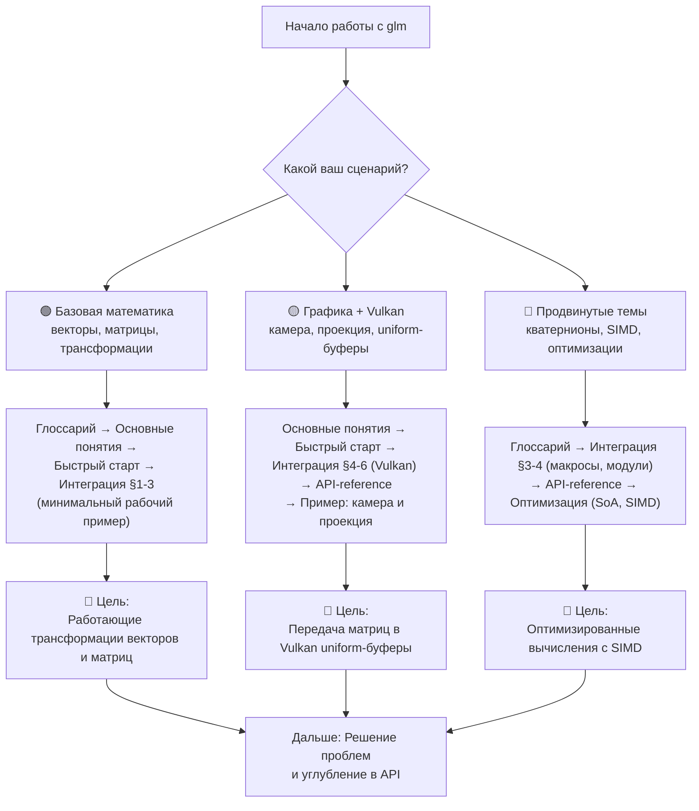
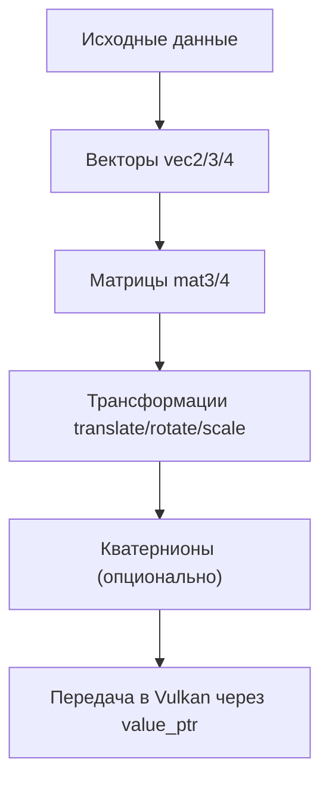

# glm

**🟢 Уровень 1: Начинающий**

**glm** — header-only математическая библиотека для графики на C++. Повторяет типы и функции OpenGL Shading Language (
GLSL): векторы, матрицы, кватернионы. Удобна для расчёта трансформаций, камеры и освещения в Vulkan/OpenGL приложениях и
играх.

Версия: **1.0.0+** (поддержка C++17 и выше).
Исходники: [g-truc/glm](https://github.com/g-truc/glm), [manual](https://github.com/g-truc/glm/blob/master/manual.md).

Структура библиотеки: **core** (ядро, GLSL-подобные типы и функции) → **ext** (стабильные расширения) → **gtc** (
рекомендуемые расширения: трансформации, type_ptr, кватернионы) → **gtx** (экспериментальные расширения, требуют
`GLM_ENABLE_EXPERIMENTAL`).

---

## 🗺️ Диаграмма обучения (Learning Path)

Выберите свой сценарий и следуйте по соответствующему пути:

---

## Жизненный цикл использования glm

---

## Содержание

| Раздел                                | Описание                                                        | Уровень |
|---------------------------------------|-----------------------------------------------------------------|---------|
| [Глоссарий](glossary.md)              | Словарь терминов glm и математики для графики                   | 🟢      |
| [Основные понятия](concepts.md)       | Зачем glm в игре, вектор, матрица, порядок операций, радианы    | 🟢      |
| [Быстрый старт](quickstart.md)        | Код с нуля: CMake + первый пример с трансформацией              | 🟢      |
| [Интеграция](integration.md)          | CMake, заголовки, макросы, модульная структура, связка с Vulkan | 🟡      |
| [Справочник API](api-reference.md)    | Что за что отвечает: векторы, матрицы, кватернионы, функции     | 🟡      |
| [Решение проблем](troubleshooting.md) | Частые ошибки и как их исправить                                | 🟡      |

---

## Быстрые ссылки по задачам

| Задача                          | Раздел                                                                                                                                                  |
|---------------------------------|---------------------------------------------------------------------------------------------------------------------------------------------------------|
| Передать матрицу в Vulkan       | [Интеграция — value_ptr](integration.md#6-передача-данных-value_ptr-и-vulkan), [Справочник API — value_ptr](api-reference.md#передача-данных-value_ptr) |
| Камера (lookAt, perspective)    | [Справочник API — perspective, lookAt](api-reference.md#матрицы), [Основные понятия](concepts.md#матрица-mat4)                                          |
| Трансформация модели            | [Быстрый старт](quickstart.md#шаг-2-maincpp), [Основные понятия](concepts.md#матрица-mat4)                                                              |
| Кватернионы                     | [Основные понятия](concepts.md#кватернион-кратко), [Справочник API](api-reference.md#кватернионы-gtc-gtcquaternionhpp)                                  |
| Настроить точность вычислений   | [Интеграция — макросы](integration.md#3-макросы-конфигурации)                                                                                           |
| Использовать SIMD оптимизации   | [Интеграция — SIMD](integration.md#simd-оптимизации)                                                                                                    |
| Минимизировать время компиляции | [Интеграция — модульная структура](integration.md#2-модульная-структура-glm)                                                                            |

---

## Примеры кода

| Пример                | Описание                                           | Ссылка                                                 |
|-----------------------|----------------------------------------------------|--------------------------------------------------------|
| Базовые трансформации | Перенос, поворот, масштаб модели                   | [glm_transform.cpp](../examples/glm_transform.cpp)     |
| Воксельный движок     | Оптимизированные вычисления для чанков, SoA vs AoS | [glm_voxel_chunk.cpp](../examples/glm_voxel_chunk.cpp) |

---

## Требования

- C++17 или новее (для версии 1.0.0+)
- Без внешних зависимостей (только стандартная библиотека)
- CMake 3.10+ (рекомендуется)

**Связанные разделы:
** [Vulkan](../vulkan/README.md), [fastgltf](../fastgltf/README.md), [документация проекта](../README.md).

← [На главную документации](../README.md)