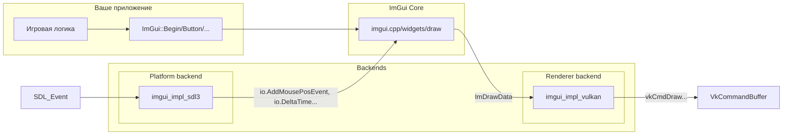

# Основные понятия Dear ImGui

🟡 **Уровень 2: Средний**

## Immediate mode vs Retained mode

| Парадигма             | Как создаётся UI                                            | Где хранится состояние                          |
|-----------------------|-------------------------------------------------------------|-------------------------------------------------|
| **Retained**          | Создаёшь дерево виджетов один раз (конструкторы, setParent) | В вашем коде (узлы дерева, флаги)               |
| **Immediate (ImGui)** | Каждый кадр вызываешь `ImGui::Button("Click")` и т.д.       | Внутри ImGui. Вы не храните указатели на кнопки |

В immediate mode, если код не вызвал виджет — его нет. Нет отдельного «создания» и «уничтожения». Это упрощает
интеграцию: можно вызывать `ImGui::Begin("Debug")` только когда `show_debug == true`, и окно появится/исчезнет само.

## Цикл кадра ImGui

```mermaid
flowchart TD
    subgraph BackendNewFrame [Backend NewFrame]
        VulkanNF[ImGui_ImplVulkan_NewFrame]
        SDL3NF[ImGui_ImplSDL3_NewFrame]
    end

    subgraph CoreNewFrame [Core]
        NewFrame[ImGui::NewFrame]
    end

    subgraph UserCode["Ваш код"]
        Widgets["Виджеты: Begin/End, Text, Button, Slider..."]
    end

    subgraph Render["Рендеринг"]
        Render[ImGui::Render]
        GetDrawData[ImGui::GetDrawData]
        RenderDrawData[ImGui_ImplVulkan_RenderDrawData]
    end

    VulkanNF --> SDL3NF
    SDL3NF --> NewFrame
    NewFrame --> Widgets
    Widgets --> Render
    Render --> GetDrawData
    GetDrawData --> RenderDrawData
```

1. **ImGui_ImplVulkan_NewFrame()** — подготовка renderer backend
2. **ImGui_ImplSDL3_NewFrame()** — передача ввода (мышь, клавиатура) в ImGui, обновление `io.DeltaTime`,
   `io.DisplaySize`
3. **ImGui::NewFrame()** — начало нового кадра ImGui
4. **Виджеты** — `ImGui::Begin`, `ImGui::Text`, `ImGui::Button`, `ImGui::End` и т.д.
5. **ImGui::Render()** — генерация команд отрисовки
6. **ImGui::GetDrawData()** — получить `ImDrawData*`
7. **ImGui_ImplVulkan_RenderDrawData(draw_data, command_buffer)** — записать в Vulkan command buffer

Порядок NewFrame **важен**: сначала Renderer, затем Platform, затем `ImGui::NewFrame()`.

## Архитектура: Platform + Renderer

ImGui разделён на ядро и два типа backend'ов:



| Backend      | Назначение                                                                                                                | Пример реализации   |
|--------------|---------------------------------------------------------------------------------------------------------------------------|---------------------|
| **Platform** | Ввод (мышь, клавиатура, геймпад), размер окна, курсор, clipboard. Вызывает `io.AddMousePosEvent`, `io.AddKeyEvent` и т.д. | `imgui_impl_sdl3`   |
| **Renderer** | Создание шрифтовой текстуры, отрисовка вершин. Вызывает `vkCmdDraw*`, создаёт pipeline и descriptor sets.                 | `imgui_impl_vulkan` |

Один Platform backend + один Renderer backend.

## WantCaptureMouse и WantCaptureKeyboard

В приложениях часто требуется разделение ввода между UI и другой логикой. ImGui предоставляет флаги в `ImGuiIO`:

| Флаг                       | Значение                                                                | Типичное использование                     |
|----------------------------|-------------------------------------------------------------------------|--------------------------------------------|
| **io.WantCaptureMouse**    | `true` — ImGui «владеет» мышью (курсор над окном ImGui, перетаскивание) | Блокировать вращение камеры, клики по миру |
| **io.WantCaptureKeyboard** | `true` — ImGui «владеет» клавиатурой (поле ввода, фокус в окне ImGui)   | Блокировать WASD, горячие клавиши          |
| **io.WantTextInput**       | `true` — ImGui ожидает текст (IME, ввод символов)                       | Активировать системное поле ввода          |

### Пример обработки ввода

```cpp
void process_input(SDL_Event& event) {
    // Сначала передаём события в ImGui
    ImGui_ImplSDL3_ProcessEvent(&event);

    ImGuiIO& io = ImGui::GetIO();

    switch (event.type) {
        case SDL_EVENT_MOUSE_MOTION:
            if (!io.WantCaptureMouse) {
                // Обработка мыши только если ImGui не захватил её
            }
            break;

        case SDL_EVENT_KEY_DOWN:
            if (!io.WantCaptureKeyboard) {
                // Обработка клавиатуры только если ImGui не захватил её
            }
            break;
    }
}
```

### Отладка проблем с вводом

```cpp
// Дебаг-окно для отслеживания ввода
void debug_input_ui() {
    ImGuiIO& io = ImGui::GetIO();

    ImGui::Begin("Input Debug");
    ImGui::Text("WantCaptureMouse: %s", io.WantCaptureMouse ? "YES" : "NO");
    ImGui::Text("WantCaptureKeyboard: %s", io.WantCaptureKeyboard ? "YES" : "NO");
    ImGui::Text("WantTextInput: %s", io.WantTextInput ? "YES" : "NO");
    ImGui::Text("Mouse Pos: (%.1f, %.1f)", io.MousePos.x, io.MousePos.y);
    ImGui::End();
}
```

## ID Stack: PushID и PopID

ImGui различает виджеты по **ID** — хешу от строки в «стеке ID». В циклах виджеты получают один и тот же label и,
значит, один ID — возникает конфликт.

**Решение 1 — PushID/PopID:**

```cpp
for (int i = 0; i < items_count; i++) {
    ImGui::PushID(i);
    if (ImGui::Button("Delete"))
        delete_item(i);
    ImGui::PopID();
}
```

**Решение 2 — синтаксис "Label##id":** текст до `##` отображается, после — только для ID:

```cpp
ImGui::Button("Save##save_btn");
ImGui::Button("Load##load_btn");
```

**Решение 3 — PushID(const void*):** указатель как ID:

```cpp
for (const auto& item : items) {
    ImGui::PushID(&item);  // Указатель как ID
    ImGui::Text("Item: %s", item.name.c_str());
    ImGui::PopID();
}
```

Без `PushID` все кнопки в цикле получают один ID — ImGui воспринимает их как один виджет; клик «переключает» сразу все.

## Паттерн Begin/End

Многие функции ImGui работают парами Begin/End: `Begin`, `BeginMenu`, `BeginTable`, `BeginCombo`, `BeginPopup` и т.д.

**Важно:** для `BeginMenu`, `BeginTable`, `BeginCombo`, `BeginPopup` вызывайте соответствующий `End` **только если**
`Begin` вернул `true`:

```cpp
if (ImGui::Begin("MyWindow")) {
    // ...
}
ImGui::End();   // Begin/End окна — End всегда, даже при false

if (ImGui::BeginMenu("File")) {
    if (ImGui::MenuItem("Open")) { /* ... */ }
    ImGui::EndMenu();   // Только т.к. BeginMenu вернул true
}

if (ImGui::BeginTable("table", 3)) {
    // ...
    ImGui::EndTable();
}
```

Исключение: `Begin()` и `BeginChild()` — для них `End()` вызывают всегда.

## SetNext vs Set

Для позиции и размера окна есть две группы функций:

| Тип          | Функции                             | Когда вызывать                                  |
|--------------|-------------------------------------|-------------------------------------------------|
| **SetNext*** | SetNextWindowPos, SetNextWindowSize | **До** `Begin()` — применится к следующему окну |
| **Set***     | SetWindowPos, SetWindowSize         | **Внутри** `Begin()`/`End()` — к текущему окну  |

Рекомендуется **SetNext***: меньше побочных эффектов, применяется в начале кадра. `Set*` внутри Begin/End может вызывать
«дёргание» и артефакты.

```cpp
// Правильно: SetNextWindowPos до Begin
ImGui::SetNextWindowPos(ImVec2(100, 100), ImGuiCond_FirstUseEver);
ImGui::Begin("My Window");
ImGui::Text("Hello!");
ImGui::End();
```

## Общая схема жизненного цикла

```mermaid
flowchart TD
    subgraph Init["Инициализация"]
        CreateContext[ImGui::CreateContext]
        GetIO["ImGui::GetIO - настройки"]
        InitSDL3[ImGui_ImplSDL3_InitForVulkan]
        InitVulkan[ImGui_ImplVulkan_Init]
    end

    subgraph Frame["Каждый кадр"]
        PollEvents[SDL_PollEvent + ImGui_ImplSDL3_ProcessEvent]
        NewFrameVk[ImGui_ImplVulkan_NewFrame]
        NewFrameSDL[ImGui_ImplSDL3_NewFrame]
        NewFrame[ImGui::NewFrame]
        UserUI["Ваши виджеты"]
        Render[ImGui::Render]
        RenderDrawData[ImGui_ImplVulkan_RenderDrawData]
    end

    subgraph Shutdown["Очистка"]
        ShutdownVk[ImGui_ImplVulkan_Shutdown]
        ShutdownSDL[ImGui_ImplSDL3_Shutdown]
        DestroyContext[ImGui::DestroyContext]
    end

    CreateContext --> GetIO --> InitSDL3 --> InitVulkan
    InitVulkan --> Frame
    PollEvents --> NewFrameVk --> NewFrameSDL --> NewFrame --> UserUI --> Render --> RenderDrawData
    Frame --> ShutdownVk --> ShutdownSDL --> DestroyContext
