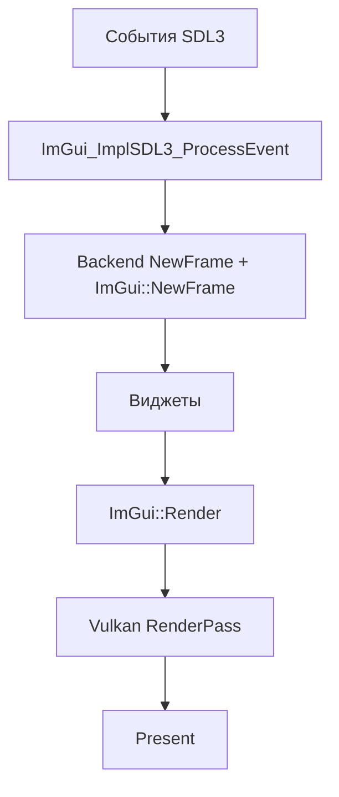

## Интеграция Dear ImGui

<!-- anchor: 03_integration -->

🟡 **Уровень 2: Средний**

## Оглавление

- [1. CMake](#1-cmake)
- [2. Конфигурация (imconfig.h)](#2-конфигурация-imconfigh)
- [3. Порядок инициализации](#3-порядок-инициализации)
- [4. Шрифты и DPI](#4-шрифты-и-dpi)
- [5. Descriptor Pool для Vulkan](#5-descriptor-pool-для-vulkan)
- [6. Обработка изменения размера окна](#6-обработка-изменения-размера-окна)
- [7. Несколько контекстов](#7-несколько-контекстов)

---

## 1. CMake

ImGui обычно собирается как статическая библиотека из исходников.

### Базовая конфигурация

```cmake
set(IMGUI_DIR "external/imgui")
add_library(imgui STATIC
    ${IMGUI_DIR}/imgui.cpp
    ${IMGUI_DIR}/imgui_draw.cpp
    ${IMGUI_DIR}/imgui_tables.cpp
    ${IMGUI_DIR}/imgui_widgets.cpp
    ${IMGUI_DIR}/backends/imgui_impl_sdl3.cpp
    ${IMGUI_DIR}/backends/imgui_impl_vulkan.cpp
)
target_include_directories(imgui PUBLIC ${IMGUI_DIR} ${IMGUI_DIR}/backends)
target_link_libraries(imgui PRIVATE SDL3::SDL3 Vulkan::Vulkan)

target_link_libraries(YourApp PRIVATE imgui)
```

### Дополнительные файлы

Для расширенной функциональности добавьте:

```cmake
set(IMGUI_SOURCES
    # ... базовые файлы ...
    ${IMGUI_DIR}/misc/cpp/imgui_stdlib.cpp  # InputText с std::string
    ${IMGUI_DIR}/misc/freetype/imgui_freetype.cpp  # FreeType рендеринг шрифтов
)
```

### Опции компиляции

```cmake
# Отключить demo windows в релизе
target_compile_definitions(imgui PRIVATE IMGUI_DISABLE_DEMO_WINDOWS)

# Включить арифметические операторы для ImVec2/ImVec4
target_compile_definitions(imgui PUBLIC IMGUI_DEFINE_MATH_OPERATORS)
```

---

## 2. Конфигурация (imconfig.h)

Настройка через макросы препроцессора в файле `imconfig.h` или через CMake.

### Ключевые опции

| Опция                         | Описание                                 |
|-------------------------------|------------------------------------------|
| `IMGUI_DISABLE_DEMO_WINDOWS`  | Отключить ShowDemoWindow и др.           |
| `IMGUI_DISABLE_DEBUG_TOOLS`   | Отключить Metrics, DebugLog, IDStackTool |
| `IMGUI_DISABLE_DEFAULT_FONT`  | Без встроенных шрифтов                   |
| `IMGUI_DEFINE_MATH_OPERATORS` | Арифметика для ImVec2/ImVec4             |
| `IMGUI_ENABLE_FREETYPE`       | FreeType вместо stb_truetype             |

### Кастомный конфиг

```cpp
// В своём файле my_imgui_config.h
#define IMGUI_DEFINE_MATH_OPERATORS
#define IMGUI_USER_CONFIG "my_imgui_config.h"
```

Или через CMake:

```cmake
target_compile_definitions(imgui PUBLIC IMGUI_USER_CONFIG="<path/to/my_config.h>")
```

### Переопределение аллокатора

```cpp
// До CreateContext()
ImGui::SetAllocatorFunctions(
    [](size_t size, void* user_data) { return my_alloc(size); },
    [](void* ptr, void* user_data) { my_free(ptr); },
    nullptr
);
```

---

## 3. Порядок инициализации

### Инициализация

```cpp
bool initImGui(SDL_Window* window, VulkanContext& vk) {
    // 1. Проверка версии
    IMGUI_CHECKVERSION();

    // 2. Создание контекста
    ImGui::CreateContext();
    ImGuiIO& io = ImGui::GetIO();

    // 3. Конфигурация
    io.ConfigFlags |= ImGuiConfigFlags_NavEnableKeyboard;
    io.ConfigFlags |= ImGuiConfigFlags_DockingEnable;  // Опционально

    // 4. Стиль
    ImGui::StyleColorsDark();

    // 5. Platform backend
    if (!ImGui_ImplSDL3_InitForVulkan(window)) {
        return false;
    }

    // 6. Renderer backend
    ImGui_ImplVulkan_InitInfo init_info = {};
    init_info.Instance = vk.instance;
    init_info.PhysicalDevice = vk.physicalDevice;
    init_info.Device = vk.device;
    init_info.QueueFamily = vk.queueFamily;
    init_info.Queue = vk.queue;
    init_info.DescriptorPool = vk.descriptorPool;
    init_info.MinImageCount = 2;
    init_info.ImageCount = vk.swapchainImageCount;
    init_info.MSAASamples = VK_SAMPLE_COUNT_1_BIT;

    if (!ImGui_ImplVulkan_Init(&init_info)) {
        return false;
    }

    // 7. Загрузка шрифтов (если нужны кастомные)
    io.Fonts->AddFontFromFileTTF("fonts/Roboto-Medium.ttf", 16.0f);

    return true;
}
```

### Shutdown

```cpp
void shutdownImGui() {
    // Обратный порядок инициализации
    vkDeviceWaitIdle(device);  // Важно для Vulkan!

    ImGui_ImplVulkan_Shutdown();
    ImGui_ImplSDL3_Shutdown();
    ImGui::DestroyContext();
}
```

---

## 4. Шрифты и DPI

### Загрузка шрифтов

```cpp
ImGuiIO& io = ImGui::GetIO();

// Шрифт по умолчанию
io.Fonts->AddFontDefault();

// Из файла
io.Fonts->AddFontFromFileTTF("path/to/font.ttf", 16.0f);

// Из памяти
io.Fonts->AddFontFromMemoryTTF(font_data, font_size, 16.0f);

// Несколько шрифтов
ImFont* font_large = io.Fonts->AddFontFromFileTTF("font.ttf", 24.0f);
ImFont* font_small = io.Fonts->AddFontFromFileTTF("font.ttf", 12.0f);
```

### Использование шрифтов

```cpp
ImGui::PushFont(font_large);
ImGui::Text("Large text");
ImGui::PopFont();
```

### HiDPI масштабирование

```cpp
// Получить DPI scale (SDL3)
float scale = SDL_GetDisplayContentScale(display_id);

// Масштабировать стили
ImGui::GetStyle().ScaleAllSizes(scale);

// Масштабировать шрифт
io.FontGlobalScale = scale;
// Или загрузить шрифт с учётом масштаба
io.Fonts->AddFontFromFileTTF("font.ttf", 16.0f * scale);
```

---

## 5. Descriptor Pool для Vulkan

Vulkan backend требует `VkDescriptorPool` для текстур шрифтов и пользовательских изображений.

### Создание Descriptor Pool

```cpp
VkDescriptorPool createDescriptorPool(VkDevice device) {
    VkDescriptorPoolSize pool_sizes[] = {
        { VK_DESCRIPTOR_TYPE_COMBINED_IMAGE_SAMPLER, 1000 },
    };

    VkDescriptorPoolCreateInfo pool_info = {};
    pool_info.sType = VK_STRUCTURE_TYPE_DESCRIPTOR_POOL_CREATE_INFO;
    pool_info.flags = VK_DESCRIPTOR_POOL_CREATE_FREE_DESCRIPTOR_SET_BIT;  // Обязательно!
    pool_info.maxSets = 1000;
    pool_info.poolSizeCount = 1;
    pool_info.pPoolSizes = pool_sizes;

    VkDescriptorPool pool;
    vkCreateDescriptorPool(device, &pool_info, nullptr, &pool);
    return pool;
}
```

### Альтернатива: авто-создание pool

```cpp
// ImGui сам создаст pool если DescriptorPoolSize > 0
ImGui_ImplVulkan_InitInfo init_info = {};
// ...
init_info.DescriptorPool = VK_NULL_HANDLE;  // Не используется
init_info.DescriptorPoolSize = 1000;         // Backend создаст pool сам
```

---

## 6. Обработка изменения размера окна

При изменении размера swapchain:

```cpp
void onSwapchainRecreated(uint32_t new_image_count) {
    // Уведомить ImGui о новом количестве изображений
    ImGui_ImplVulkan_SetMinImageCount(new_image_count);
}
```

### Полный пример пересоздания

```cpp
void handleResize(VulkanContext& vk) {
    vkDeviceWaitIdle(vk.device);

    // Пересоздание swapchain
    destroySwapchain(vk);
    createSwapchain(vk);

    // Уведомление ImGui
    ImGui_ImplVulkan_SetMinImageCount(vk.minImageCount);
}
```

---

## 7. Несколько контекстов

Обычно один контекст на приложение, но можно создать несколько:

```cpp
// Создание
ImGuiContext* ctx1 = ImGui::CreateContext();
ImGuiContext* ctx2 = ImGui::CreateContext();

// Переключение
ImGui::SetCurrentContext(ctx1);
ImGui::Begin("Window in Context 1");
ImGui::End();

ImGui::SetCurrentContext(ctx2);
ImGui::Begin("Window in Context 2");
ImGui::End();

// Уничтожение
ImGui::DestroyContext(ctx1);
ImGui::DestroyContext(ctx2);
```

### Использование с несколькими окнами

```cpp
// Каждое окно может иметь свой контекст
struct WindowUI {
    SDL_Window* window;
    ImGuiContext* context;
};

void renderWindowUI(WindowUI& ui) {
    ImGui::SetCurrentContext(ui.context);
    // ... рендеринг UI для этого окна
}
```

---

## Интеграция ImGui с ProjectV

<!-- anchor: 08_projectv-integration -->

🔴 **Уровень 3: Продвинутый**

ProjectV-специфичные рекомендации по интеграции Dear ImGui с SDL3, Vulkan и volk.

## Архитектура интеграции

ImGui в ProjectV используется для:

1. **Debug UI** — статистика чанков, профилирование, настройки рендеринга
2. **Инструментарий** — редактор мира, инспекторы
3. **Игровой UI** — меню, HUD, инвентарь

### Цикл кадра ImGui в ProjectV



---

## Интеграция с volk

ProjectV использует volk для загрузки Vulkan функций. ImGui должен использовать те же функции.

### CMake конфигурация

```cmake
# Определить IMGUI_IMPL_VULKAN_USE_VOLK перед включением ImGui
target_compile_definitions(imgui PUBLIC IMGUI_IMPL_VULKAN_USE_VOLK)

# Или в imconfig.h:
# #define IMGUI_IMPL_VULKAN_USE_VOLK
```

### Инициализация

```cpp
#include <volk.h>
#include <imgui.h>
#include <backends/imgui_impl_sdl3.h>
#include <backends/imgui_impl_vulkan.h>

bool initImGui(AppState& state) {
    // Volk уже инициализирован: volkInitialize(), volkLoadInstance(), volkLoadDevice()

    IMGUI_CHECKVERSION();
    ImGui::CreateContext();
    ImGuiIO& io = ImGui::GetIO();
    io.ConfigFlags |= ImGuiConfigFlags_NavEnableKeyboard;

    ImGui::StyleColorsDark();

    // Platform backend
    if (!ImGui_ImplSDL3_InitForVulkan(state.window)) {
        return false;
    }

    // Renderer backend (volk функции используются автоматически)
    ImGui_ImplVulkan_InitInfo init_info = {};
    init_info.Instance = state.instance;
    init_info.PhysicalDevice = state.physicalDevice;
    init_info.Device = state.device;
    init_info.QueueFamily = state.queueFamilyIndex;
    init_info.Queue = state.queue;
    init_info.DescriptorPool = state.descriptorPool;
    init_info.MinImageCount = 2;
    init_info.ImageCount = static_cast<uint32_t>(state.swapchainImages.size());
    init_info.MSAASamples = VK_SAMPLE_COUNT_1_BIT;

    if (!ImGui_ImplVulkan_Init(&init_info)) {
        return false;
    }

    return true;
}
```

---

## Интеграция с VMA

ImGui требует память GPU для шрифтовой текстуры. При использовании VMA:

### Descriptor Pool

```cpp
VkDescriptorPool createDescriptorPool(VkDevice device) {
    VkDescriptorPoolSize pool_sizes[] = {
        { VK_DESCRIPTOR_TYPE_COMBINED_IMAGE_SAMPLER, 1000 },
    };

    VkDescriptorPoolCreateInfo pool_info = {};
    pool_info.sType = VK_STRUCTURE_TYPE_DESCRIPTOR_POOL_CREATE_INFO;
    pool_info.flags = VK_DESCRIPTOR_POOL_CREATE_FREE_DESCRIPTOR_SET_BIT;
    pool_info.maxSets = 1000;
    pool_info.poolSizeCount = 1;
    pool_info.pPoolSizes = pool_sizes;

    VkDescriptorPool pool;
    VK_CHECK(vkCreateDescriptorPool(device, &pool_info, nullptr, &pool));
    return pool;
}
```

### Загрузка шрифтовой текстуры

ImGui автоматически создаёт текстуру шрифта при вызове `ImGui_ImplVulkan_CreateFontsTexture()`. VMA не нужен для этой
текстуры — backend управляет ею сам.

---

## DPI Scaling

ProjectV поддерживает HiDPI мониторы.

### Получение DPI scale

```cpp
float getDPIScale(SDL_Window* window) {
    SDL_DisplayID display_id = SDL_GetDisplayForWindow(window);
    return SDL_GetDisplayContentScale(display_id);
}
```

### Применение масштабирования

```cpp
void applyDPIScale(float scale) {
    // Масштабировать стили
    ImGuiStyle& style = ImGui::GetStyle();
    style.ScaleAllSizes(scale);

    // Масштабировать шрифт
    ImGuiIO& io = ImGui::GetIO();
    io.FontGlobalScale = scale;

    // Или загрузить шрифт с учётом масштаба
    io.Fonts->AddFontFromFileTTF("fonts/Roboto-Medium.ttf", 16.0f * scale);
}
```

### Обработка изменения DPI

```cpp
// При перемещении окна на другой монитор
void onDPIScaleChanged(float new_scale) {
    // Пересоздать шрифты
    ImGuiIO& io = ImGui::GetIO();
    io.Fonts->Clear();
    io.Fonts->AddFontFromFileTTF("fonts/Roboto-Medium.ttf", 16.0f * new_scale);
    io.FontGlobalScale = new_scale;

    // Перезагрузить текстуру шрифтов
    ImGui_ImplVulkan_DestroyFontUploadObjects();
    ImGui_ImplVulkan_CreateFontsTexture();
}
```

---

## Множественные окна

SDL3 поддерживает несколько окон с разными Vulkan surfaces.

### Структура для нескольких окон

```cpp
struct WindowContext {
    SDL_Window* window;
    VkSurfaceKHR surface;
    VkSwapchainKHR swapchain;
    ImGuiContext* imguiContext;
    std::vector<VkImage> swapchainImages;
    std::vector<VkImageView> swapchainViews;
    VkExtent2D extent;
};
```

### Инициализация для каждого окна

```cpp
bool initWindowImGui(WindowContext& ctx, VkInstance instance, VkPhysicalDevice physicalDevice,
                     VkDevice device, uint32_t queueFamily, VkQueue queue, VkDescriptorPool pool) {
    // Создать отдельный контекст ImGui
    ctx.imguiContext = ImGui::CreateContext();
    ImGui::SetCurrentContext(ctx.imguiContext);

    ImGuiIO& io = ImGui::GetIO();
    io.ConfigFlags |= ImGuiConfigFlags_NavEnableKeyboard;

    // Platform backend
    if (!ImGui_ImplSDL3_InitForVulkan(ctx.window)) {
        return false;
    }

    // Renderer backend
    ImGui_ImplVulkan_InitInfo init_info = {};
    init_info.Instance = instance;
    init_info.PhysicalDevice = physicalDevice;
    init_info.Device = device;
    init_info.QueueFamily = queueFamily;
    init_info.Queue = queue;
    init_info.DescriptorPool = pool;
    init_info.MinImageCount = 2;
    init_info.ImageCount = static_cast<uint32_t>(ctx.swapchainImages.size());

    if (!ImGui_ImplVulkan_Init(&init_info)) {
        return false;
    }

    return true;
}
```

### Обработка событий для нескольких окон

```cpp
void processEvents(const SDL_Event& event, std::vector<WindowContext>& windows) {
    for (auto& ctx : windows) {
        if (SDL_GetWindowID(ctx.window) == event.window.windowID) {
            ImGui::SetCurrentContext(ctx.imguiContext);
            ImGui_ImplSDL3_ProcessEvent(&event);
            break;
        }
    }
}
```

---

## Пример полного кода

### Структура приложения

```cpp
struct AppState {
    // Vulkan
    VkInstance instance = VK_NULL_HANDLE;
    VkPhysicalDevice physicalDevice = VK_NULL_HANDLE;
    VkDevice device = VK_NULL_HANDLE;
    VkQueue queue = VK_NULL_HANDLE;
    uint32_t queueFamilyIndex = 0;
    VkDescriptorPool descriptorPool = VK_NULL_HANDLE;

    // Swapchain
    VkSwapchainKHR swapchain = VK_NULL_HANDLE;
    std::vector<VkImage> swapchainImages;
    std::vector<VkImageView> swapchainViews;
    VkExtent2D swapchainExtent;
    VkRenderPass renderPass;
    std::vector<VkFramebuffer> framebuffers;
    VkCommandPool commandPool;
    std::vector<VkCommandBuffer> commandBuffers;

    // SDL
    SDL_Window* window = nullptr;

    // ImGui
    ImGuiContext* imguiContext = nullptr;

    // State
    bool running = true;
    float dpiScale = 1.0f;
};
```

### Инициализация

```cpp
bool initVulkanImGui(AppState& state) {
    // 1. Volk уже инициализирован
    // 2. Vulkan instance, device, queue уже созданы
    // 3. Swapchain уже создан

    IMGUI_CHECKVERSION();
    state.imguiContext = ImGui::CreateContext();
    ImGui::SetCurrentContext(state.imguiContext);

    ImGuiIO& io = ImGui::GetIO();
    io.ConfigFlags |= ImGuiConfigFlags_NavEnableKeyboard;

    // DPI scale
    state.dpiScale = getDPIScale(state.window);
    ImGui::GetStyle().ScaleAllSizes(state.dpiScale);
    io.FontGlobalScale = state.dpiScale;

    ImGui::StyleColorsDark();

    // Platform
    if (!ImGui_ImplSDL3_InitForVulkan(state.window)) {
        return false;
    }

    // Renderer
    ImGui_ImplVulkan_InitInfo init_info = {};
    init_info.Instance = state.instance;
    init_info.PhysicalDevice = state.physicalDevice;
    init_info.Device = state.device;
    init_info.QueueFamily = state.queueFamilyIndex;
    init_info.Queue = state.queue;
    init_info.DescriptorPool = state.descriptorPool;
    init_info.MinImageCount = 2;
    init_info.ImageCount = static_cast<uint32_t>(state.swapchainImages.size());
    init_info.MSAASamples = VK_SAMPLE_COUNT_1_BIT;

    if (!ImGui_ImplVulkan_Init(&init_info)) {
        return false;
    }

    return true;
}
```

### Цикл кадра

```cpp
void renderFrame(AppState& state, uint32_t imageIndex) {
    ImGui::SetCurrentContext(state.imguiContext);

    // 1. NewFrame
    ImGui_ImplVulkan_NewFrame();
    ImGui_ImplSDL3_NewFrame();
    ImGui::NewFrame();

    // 2. UI
    renderUI(state);

    // 3. Render
    ImGui::Render();

    // 4. Vulkan command buffer
    VkCommandBuffer cmd = state.commandBuffers[imageIndex];
    vkResetCommandBuffer(cmd, 0);

    VkCommandBufferBeginInfo begin_info = {};
    begin_info.sType = VK_STRUCTURE_TYPE_COMMAND_BUFFER_BEGIN_INFO;
    vkBeginCommandBuffer(cmd, &begin_info);

    // Begin render pass
    VkRenderPassBeginInfo rp_info = {};
    rp_info.sType = VK_STRUCTURE_TYPE_RENDER_PASS_BEGIN_INFO;
    rp_info.renderPass = state.renderPass;
    rp_info.framebuffer = state.framebuffers[imageIndex];
    rp_info.renderArea.extent = state.swapchainExtent;
    // ... clear values

    vkCmdBeginRenderPass(cmd, &rp_info, VK_SUBPASS_CONTENTS_INLINE);

    // Render ImGui
    ImDrawData* draw_data = ImGui::GetDrawData();
    if (draw_data && draw_data->DisplaySize.x > 0 && draw_data->DisplaySize.y > 0) {
        ImGui_ImplVulkan_RenderDrawData(draw_data, cmd);
    }

    vkCmdEndRenderPass(cmd);
    vkEndCommandBuffer(cmd);
}
```

### Shutdown

```cpp
void shutdownImGui(AppState& state) {
    vkDeviceWaitIdle(state.device);

    ImGui::SetCurrentContext(state.imguiContext);
    ImGui_ImplVulkan_Shutdown();
    ImGui_ImplSDL3_Shutdown();
    ImGui::DestroyContext(state.imguiContext);
    state.imguiContext = nullptr;
}
```

---

## Паттерны ImGui для ProjectV

<!-- anchor: 09_projectv-patterns -->

🔴 **Уровень 3: Продвинутый**

Паттерны и оптимизации ImGui для воксельного движка ProjectV.

## Debug UI для воксельного движка

### Статистика чанков

```cpp
struct VoxelStats {
    int loadedChunks = 0;
    int totalChunks = 0;
    int visibleChunks = 0;
    size_t memoryUsed = 0;
    std::vector<ChunkInfo> chunks;
};

void renderVoxelStats(VoxelStats& stats) {
    if (ImGui::Begin("Voxel Statistics")) {
        // Основная статистика
        ImGui::Text("Loaded Chunks: %d / %d", stats.loadedChunks, stats.totalChunks);
        ImGui::ProgressBar(static_cast<float>(stats.loadedChunks) / stats.totalChunks);

        ImGui::Text("Visible: %d", stats.visibleChunks);
        ImGui::Text("Memory: %.2f MB", stats.memoryUsed / (1024.0f * 1024.0f));

        // Детали чанков
        if (ImGui::CollapsingHeader("Chunk Details")) {
            if (ImGui::BeginTable("chunks", 4, ImGuiTableFlags_Borders | ImGuiTableFlags_ScrollY)) {
                ImGui::TableSetupColumn("Position");
                ImGui::TableSetupColumn("State");
                ImGui::TableSetupColumn("Memory");
                ImGui::TableSetupColumn("LOD");
                ImGui::TableHeadersRow();

                ImGuiListClipper clipper;
                clipper.Begin(static_cast<int>(stats.chunks.size()));

                while (clipper.Step()) {
                    for (int i = clipper.DisplayStart; i < clipper.DisplayEnd; i++) {
                        const auto& chunk = stats.chunks[i];
                        ImGui::TableNextRow();
                        ImGui::TableSetColumnIndex(0);
                        ImGui::Text("(%d,%d,%d)", chunk.x, chunk.y, chunk.z);
                        ImGui::TableSetColumnIndex(1);
                        ImGui::Text("%s", chunkStateToString(chunk.state));
                        ImGui::TableSetColumnIndex(2);
                        ImGui::Text("%.1f KB", chunk.memory / 1024.0f);
                        ImGui::TableSetColumnIndex(3);
                        ImGui::Text("LOD %d", chunk.lod);
                    }
                }
                ImGui::EndTable();
            }
        }

        // Настройки рендеринга
        if (ImGui::CollapsingHeader("Render Settings")) {
            static bool wireframe = false;
            static float lodBias = 1.0f;
            static int maxDistance = 1000;

            ImGui::Checkbox("Wireframe", &wireframe);
            ImGui::SliderFloat("LOD Bias", &lodBias, 0.1f, 4.0f);
            ImGui::SliderInt("Max Distance", &maxDistance, 100, 5000);
        }
    }
    ImGui::End();
}
```

### Настройки рендеринга в реальном времени

```cpp
struct RenderSettings {
    bool wireframe = false;
    bool showBoundingBoxes = false;
    float lodBias = 1.0f;
    int maxDistance = 1000;
    float fogDensity = 0.01f;
    float fogColor[3] = {0.5f, 0.6f, 0.7f};
};

void renderSettingsUI(RenderSettings& settings) {
    if (ImGui::Begin("Render Settings")) {
        if (ImGui::CollapsingHeader("Geometry", ImGuiTreeNodeFlags_DefaultOpen)) {
            ImGui::Checkbox("Wireframe", &settings.wireframe);
            ImGui::Checkbox("Bounding Boxes", &settings.showBoundingBoxes);
            ImGui::SliderFloat("LOD Bias", &settings.lodBias, 0.1f, 4.0f);
            ImGui::SliderInt("Max Distance", &settings.maxDistance, 100, 5000);
        }

        if (ImGui::CollapsingHeader("Atmosphere")) {
            ImGui::SliderFloat("Fog Density", &settings.fogDensity, 0.0f, 0.1f);
            ImGui::ColorEdit3("Fog Color", settings.fogColor);
        }
    }
    ImGui::End();
}
```

---

## Интеграция с flecs ECS

### Инспектор сущностей

```cpp
void renderECSInspector(flecs::world& world) {
    if (ImGui::Begin("ECS Inspector")) {
        // Фильтр
        static char filter[128] = "";
        ImGui::InputText("Filter", filter, sizeof(filter));

        // Список сущностей
        ImGui::BeginChild("entities", ImVec2(0, 200));
        world.each([&](flecs::entity e) {
            const char* name = e.name().c_str();
            if (filter[0] && !strstr(name, filter)) return;

            if (ImGui::Selectable(name)) {
                // Выбрать сущность
            }
        });
        ImGui::EndChild();

        // Компоненты выбранной сущности
        // ...
    }
    ImGui::End();
}
```

### Создание сущностей через UI

```cpp
void renderEntityCreator(flecs::world& world) {
    if (ImGui::Begin("Entity Creator")) {
        static char name[128] = "NewEntity";

        ImGui::InputText("Name", name, sizeof(name));

        static bool addTransform = true;
        static bool addRenderable = true;
        static bool addPhysics = false;

        ImGui::Checkbox("Transform", &addTransform);
        ImGui::Checkbox("Renderable", &addRenderable);
        ImGui::Checkbox("Physics", &addPhysics);

        if (ImGui::Button("Create")) {
            auto entity = world.entity(name);

            if (addTransform) {
                entity.set<TransformComponent>({});
            }
            if (addRenderable) {
                entity.set<RenderableComponent>({});
            }
            if (addPhysics) {
                entity.set<PhysicsComponent>({});
            }
        }
    }
    ImGui::End();
}
```

---

## Интеграция с JoltPhysics

### Debug UI для физики

```cpp
void renderPhysicsDebugUI(JPH::PhysicsSystem& physicsSystem) {
    if (ImGui::Begin("Physics Debug")) {
        // Статистика
        ImGui::Text("Active Bodies: %d", physicsSystem.GetNumActiveBodies());
        ImGui::Text("Total Bodies: %d", physicsSystem.GetNumBodies());

        // Управление
        static bool paused = false;
        if (ImGui::Checkbox("Pause", &paused)) {
            physicsSystem.SetPaused(paused);
        }

        // Гравитация
        static float gravity[3] = {0.0f, -9.81f, 0.0f};
        if (ImGui::DragFloat3("Gravity", gravity, 0.1f)) {
            physicsSystem.SetGravity(JPH::Vec3(gravity[0], gravity[1], gravity[2]));
        }

        // Debug draw
        static int debugFlags = 0;
        ImGui::Text("Debug Draw:");
        ImGui::CheckboxFlags("Shapes", &debugFlags, 1);
        ImGui::CheckboxFlags("Bounds", &debugFlags, 2);
        ImGui::CheckboxFlags("Constraints", &debugFlags, 4);
    }
    ImGui::End();
}
```

---

## Профилирование с Tracy

### Профилирование UI рендеринга

```cpp
#include <tracy/Tracy.hpp>

void renderUIWithProfiling() {
    ZoneScopedN("RenderUI");

    {
        ZoneScopedN("ImGui NewFrame");
        ImGui_ImplVulkan_NewFrame();
        ImGui_ImplSDL3_NewFrame();
        ImGui::NewFrame();
    }

    {
        ZoneScopedN("Widget Rendering");
        renderVoxelStats();
        renderECSInspector();
        renderPhysicsDebugUI();
    }

    {
        ZoneScopedN("ImGui Render");
        ImGui::Render();
    }

    FrameMark;
}
```

### Профилирование Vulkan рендеринга UI

```cpp
void renderVulkanUI(VkCommandBuffer cmdBuffer) {
    TracyVkZone(GetTracyVkCtx(), cmdBuffer, "UI Render");

    ImGui_ImplVulkan_RenderDrawData(ImGui::GetDrawData(), cmdBuffer);

    TracyVkCollect(GetTracyVkCtx(), cmdBuffer);
}
```

### Отображение FPS в меню

```cpp
void renderMainMenuBar() {
    if (ImGui::BeginMainMenuBar()) {
        // ... меню ...

        // FPS справа
        ImGui::SameLine(ImGui::GetWindowWidth() - 150);
        ImGui::Text("FPS: %.1f", ImGui::GetIO().Framerate);

        ImGui::EndMainMenuBar();
    }
}
```

---

## Оптимизации для больших списков

### ImGuiListClipper для списков чанков

```cpp
void renderChunkList(const std::vector<ChunkInfo>& chunks) {
    ImGuiListClipper clipper;
    clipper.Begin(static_cast<int>(chunks.size()));

    while (clipper.Step()) {
        for (int i = clipper.DisplayStart; i < clipper.DisplayEnd; i++) {
            const auto& chunk = chunks[i];

            ImGui::PushID(&chunk);
            ImGui::Text("(%d,%d,%d) - %s",
                       chunk.x, chunk.y, chunk.z,
                       chunkStateToString(chunk.state));
            ImGui::PopID();
        }
    }
}
```

### Оптимизация ID Stack

```cpp
// Неоптимально: PushID(int) в цикле 1000+ элементов
for (int i = 0; i < 1000; i++) {
    ImGui::PushID(i);
    // ...
    ImGui::PopID();
}

// Оптимально: PushID(const void*) для уникальных указателей
for (const auto& item : items) {
    ImGui::PushID(&item);  // Указатель как ID
    // ...
    ImGui::PopID();
}

// Оптимально: группировка
ImGui::PushID("list");
for (int i = 0; i < items.size(); i++) {
    ImGui::PushID(i);
    // ...
    ImGui::PopID();
}
ImGui::PopID();
```

### Кэширование строк

```cpp
// Неоптимально: форматирование каждый кадр
ImGui::Text("Position: (%.1f, %.1f, %.1f)", x, y, z);

// Оптимально: обновлять только при изменении
static std::string cachedPosition;
static glm::vec3 lastPosition;

if (position != lastPosition) {
    cachedPosition = fmt::format("Position: ({:.1f}, {:.1f}, {:.1f})", position.x, position.y, position.z);
    lastPosition = position;
}
ImGui::TextUnformatted(cachedPosition.c_str());
```

---

## Воксельный редактор

### Палитра блоков

```cpp
struct VoxelType {
    uint32_t id;
    std::string name;
    VkDescriptorSet previewTexture;
    uint32_t color;
};

void renderVoxelPalette(const std::vector<VoxelType>& types, uint32_t& selected) {
    if (ImGui::Begin("Voxel Palette")) {
        const float buttonSize = 64.0f;
        const int columns = 6;

        for (size_t i = 0; i < types.size(); i++) {
            const auto& type = types[i];
            ImGui::PushID(static_cast<int>(type.id));

            bool isSelected = (selected == type.id);
            if (isSelected) {
                ImGui::PushStyleColor(ImGuiCol_Button, ImVec4(0.5f, 0.5f, 1.0f, 1.0f));
            }

            if (ImGui::ImageButton("##btn",
                                   ImTextureRef(type.previewTexture),
                                   ImVec2(buttonSize, buttonSize))) {
                selected = type.id;
            }

            if (isSelected) {
                ImGui::PopStyleColor();
            }

            // Drag-and-drop
            if (ImGui::BeginDragDropSource()) {
                ImGui::SetDragDropPayload("VOXEL_TYPE", &type.id, sizeof(type.id));
                ImGui::Text("Place %s", type.name.c_str());
                ImGui::EndDragDropSource();
            }

            ImGui::PopID();

            // Подпись
            ImGui::Text("%s", type.name.c_str());

            if ((i + 1) % columns != 0) {
                ImGui::SameLine();
            }
        }
    }
    ImGui::End();
}
```

### Инспектор свойств

```cpp
void renderVoxelInspector(const VoxelData& voxel) {
    if (ImGui::Begin("Voxel Inspector")) {
        ImGui::Text("Position: (%d, %d, %d)", voxel.x, voxel.y, voxel.z);
        ImGui::Text("Type: %s", voxel.typeName.c_str());

        ImGui::Separator();

        // Свойства
        ImGui::Text("Solid: %s", voxel.solid ? "Yes" : "No");
        ImGui::Text("Opaque: %s", voxel.opaque ? "Yes" : "No");

        // Цвет
        float color[3] = {
            voxel.r / 255.0f,
            voxel.g / 255.0f,
            voxel.b / 255.0f
        };
        if (ImGui::ColorEdit3("Color", color)) {
            voxel.r = static_cast<uint8_t>(color[0] * 255);
            voxel.g = static_cast<uint8_t>(color[1] * 255);
            voxel.b = static_cast<uint8_t>(color[2] * 255);
        }
    }
    ImGui::End();
}
```

---

## Игровой UI

### HUD

```cpp
void renderHUD(const PlayerState& player) {
    ImGui::SetNextWindowPos(ImVec2(10, 10), ImGuiCond_Always);
    ImGui::SetNextWindowSize(ImVec2(200, 100), ImGuiCond_Always);

    ImGui::PushStyleColor(ImGuiCol_WindowBg, ImVec4(0, 0, 0, 0.5f));
    ImGui::Begin("HUD", nullptr,
                 ImGuiWindowFlags_NoTitleBar |
                 ImGuiWindowFlags_NoResize |
                 ImGuiWindowFlags_NoMove |
                 ImGuiWindowFlags_NoInputs);

    // Здоровье
    ImGui::Text("Health");
    ImGui::ProgressBar(player.health / 100.0f, ImVec2(-1, 0));

    // Координаты
    ImGui::Text("Pos: (%.1f, %.1f, %.1f)",
               player.position.x,
               player.position.y,
               player.position.z);

    ImGui::End();
    ImGui::PopStyleColor();
}
```

### Инвентарь

```cpp
void renderInventory(const Inventory& inventory) {
    if (ImGui::Begin("Inventory")) {
        const int cols = 10;
        const float slotSize = 48.0f;

        if (ImGui::BeginTable("slots", cols)) {
            for (int i = 0; i < inventory.size; i++) {
                ImGui::TableNextColumn();

                ImGui::PushID(i);

                const auto& slot = inventory.slots[i];

                if (ImGui::Button("##slot", ImVec2(slotSize, slotSize))) {
                    // Выбрать слот
                }

                if (slot.count > 0) {
                    // Иконка предмета
                    ImGui::SameLine();
                    ImGui::SetCursorPosX(ImGui::GetCursorPosX() - slotSize + 4);
                    ImGui::Image(ImTextureRef(slot.icon), ImVec2(slotSize - 8, slotSize - 8));

                    // Количество
                    ImGui::SameLine();
                    ImGui::SetCursorPosX(ImGui::GetCursorPosX() - 20);
                    ImGui::Text("%d", slot.count);
                }

                ImGui::PopID();
            }
            ImGui::EndTable();
        }
    }
    ImGui::End();
}
```