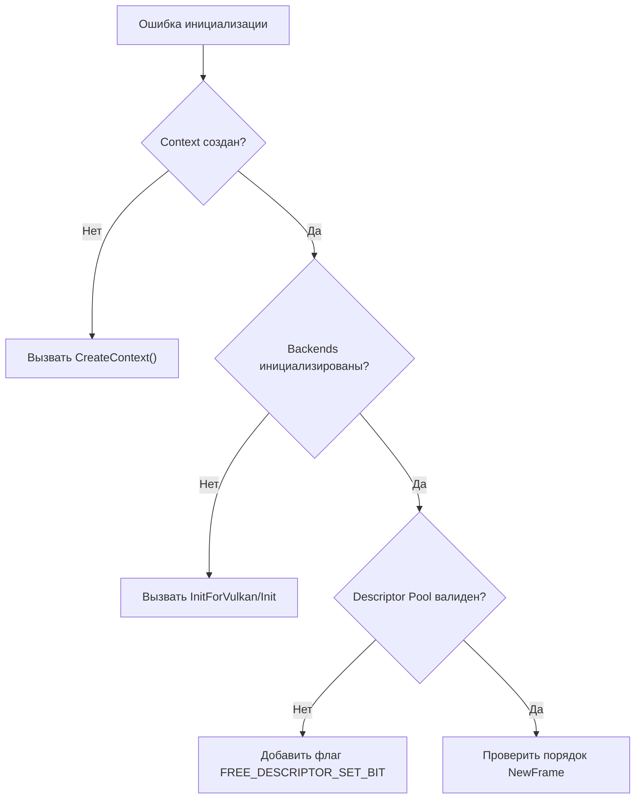
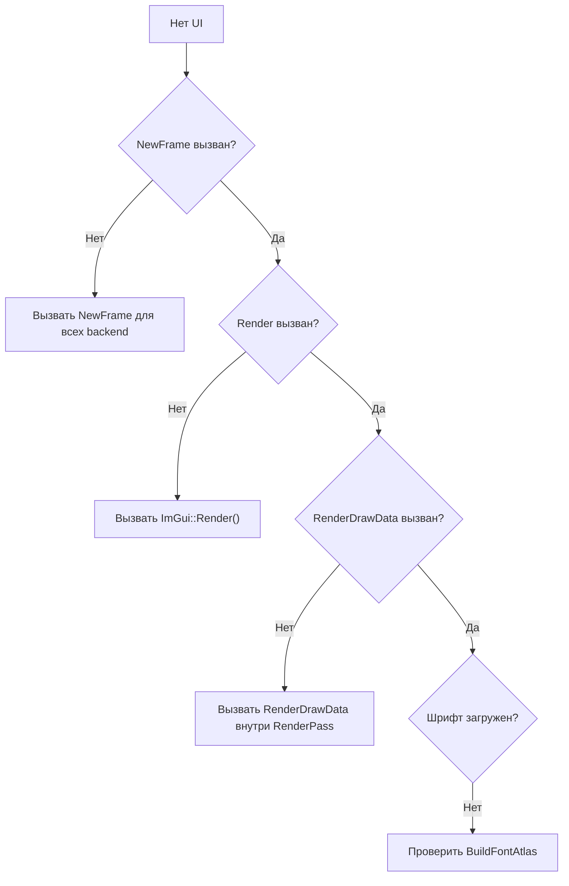

## Виджеты Dear ImGui

<!-- anchor: 05_widgets -->

🟢 **Уровень 1: Начинающий**

Обзор основных виджетов с примерами использования.

## Оглавление

- [Текст](#текст)
- [Кнопки](#кнопки)
- [Слайдеры и Drag](#слайдеры-и-drag)
- [Ввод текста и чисел](#ввод-текста-и-чисел)
- [Чекбокс и Radio](#чекбокс-и-radio)
- [Combo и Listbox](#combo-и-listbox)
- [Таблицы](#таблицы)
- [Меню](#меню)
- [Tab Bar](#tab-bar)
- [Popups](#popups)
- [Drag-and-drop](#drag-and-drop)
- [Цвета](#цвета)
- [Изображения](#изображения)
- [Прогресс и индикаторы](#прогресс-и-индикаторы)
- [ImGuiListClipper](#imguilistclipper)

---

## Текст

```cpp
// Простой текст
ImGui::Text("Hello, World!");

// Форматированный текст
ImGui::Text("Value: %d", value);

// Цветной текст
ImGui::TextColored(ImVec4(1, 0, 0, 1), "Error: %s", error_msg);

// Серый текст
ImGui::TextDisabled("Disabled text");

// Текст с переносом
ImGui::TextWrapped("Long text that will wrap automatically");

// Текст с маркером
ImGui::BulletText("Item 1");
ImGui::BulletText("Item 2");

// Label + значение
ImGui::LabelText("Label", "Value: %.2f", value);
```

---

## Кнопки

```cpp
// Обычная кнопка
if (ImGui::Button("Click Me")) {
    // Нажата
}

// Кнопка с размером
if (ImGui::Button("Large", ImVec2(200, 50))) {
    // ...
}

// Маленькая кнопка
if (ImGui::SmallButton("Small")) {
    // ...
}

// Кнопка со стрелкой
if (ImGui::ArrowButton("##arrow", ImGuiDir_Up)) {
    // ...
}

// Повторяющиеся клики (для +/- кнопок)
if (ImGui::RepeatButton("Hold to repeat")) {
    // Вызывается каждый кадр при зажатии
}
```

---

## Слайдеры и Drag

```cpp
// Слайдер float
float value = 0.5f;
ImGui::SliderFloat("Float", &value, 0.0f, 1.0f, "%.2f");

// Слайдер int
int count = 5;
ImGui::SliderInt("Count", &count, 0, 100);

// Слайдер с углом (в радианах)
float angle = 0.0f;
ImGui::SliderAngle("Angle", &angle, 0.0f, 360.0f);

// Drag (без ограничений или с гибкими bounds)
float drag_value = 0.0f;
ImGui::DragFloat("Drag", &drag_value, 0.1f);  // speed = 0.1

int drag_int = 0;
ImGui::DragInt("Drag Int", &drag_int, 1, 0, 100);  // min, max

// Drag с диапазоном
float range[2] = {0.0f, 1.0f};
ImGui::DragFloatRange2("Range", &range[0], &range[1]);
```

---

## Ввод текста и чисел

```cpp
// Ввод float
float num = 0.0f;
ImGui::InputFloat("Number", &num);

// Ввод float с шагом
ImGui::InputFloat("Step", &num, 0.1f, 1.0f, "%.2f");

// Ввод int
int integer = 0;
ImGui::InputInt("Int", &integer);

// Ввод текста (C-style)
char buffer[256] = "";
ImGui::InputText("Name", buffer, sizeof(buffer));

// Многострочный ввод
char multiline[1024] = "";
ImGui::InputTextMultiline("Description", multiline, sizeof(multiline), ImVec2(0, 100));

// Ввод с std::string (нужен imgui_stdlib.h)
#include <misc/cpp/imgui_stdlib.h>
std::string str;
ImGui::InputText("String", &str);
```

---

## Чекбокс и Radio

```cpp
// Чекбокс
bool checked = false;
ImGui::Checkbox("Enable", &checked);

// Чекбокс с текстом справа
ImGui::Checkbox("##hidden", &checked);
ImGui::SameLine();
ImGui::Text("Custom label");

// Radio кнопки
int mode = 0;
ImGui::RadioButton("Option A", &mode, 0); ImGui::SameLine();
ImGui::RadioButton("Option B", &mode, 1); ImGui::SameLine();
ImGui::RadioButton("Option C", &mode, 2);

// Отдельные radio (без группы)
bool selected = true;
ImGui::RadioButton("Selected", selected);
```

---

## Combo и Listbox

```cpp
// Combo box
int item_current = 0;
const char* items[] = { "Apple", "Banana", "Cherry" };
ImGui::Combo("Fruit", &item_current, items, IM_ARRAYSIZE(items));

// Combo с форматированием
ImGui::Combo("Combo", &item_current, "Option 1\0Option 2\0Option 3\0");

// Combo с callback
auto getter = [](void* data, int idx, const char** out_text) -> bool {
    *out_text = "Item";
    return true;
};
ImGui::Combo("Custom", &item_current, getter, nullptr, 5);

// BeginCombo для кастомного содержимого
if (ImGui::BeginCombo("Select", "Preview")) {
    for (int i = 0; i < 5; i++) {
        bool is_selected = (item_current == i);
        if (ImGui::Selectable(fmt::format("Item {}", i).c_str(), is_selected)) {
            item_current = i;
        }
        if (is_selected) {
            ImGui::SetItemDefaultFocus();
        }
    }
    ImGui::EndCombo();
}

// Listbox
ImGui::ListBox("List", &item_current, items, IM_ARRAYSIZE(items), 4);
```

---

## Таблицы

```cpp
// Простая таблица
if (ImGui::BeginTable("table", 3, ImGuiTableFlags_Borders)) {
    ImGui::TableSetupColumn("A");
    ImGui::TableSetupColumn("B");
    ImGui::TableSetupColumn("C");
    ImGui::TableHeadersRow();

    for (int row = 0; row < 4; row++) {
        ImGui::TableNextRow();
        ImGui::TableSetColumnIndex(0);
        ImGui::Text("A%d", row);
        ImGui::TableSetColumnIndex(1);
        ImGui::Text("B%d", row);
        ImGui::TableSetColumnIndex(2);
        ImGui::Text("C%d", row);
    }
    ImGui::EndTable();
}

// Таблица с флагами
ImGuiTableFlags flags = ImGuiTableFlags_Borders | ImGuiTableFlags_RowBg | ImGuiTableFlags_Resizable;
if (ImGui::BeginTable("advanced", 2, flags)) {
    // ...
    ImGui::EndTable();
}
```

---

## Меню

```cpp
// Главное меню
if (ImGui::BeginMainMenuBar()) {
    if (ImGui::BeginMenu("File")) {
        if (ImGui::MenuItem("New", "Ctrl+N")) { /* ... */ }
        if (ImGui::MenuItem("Open", "Ctrl+O")) { /* ... */ }
        ImGui::Separator();
        if (ImGui::MenuItem("Exit", "Alt+F4")) { /* ... */ }
        ImGui::EndMenu();
    }
    if (ImGui::BeginMenu("Edit")) {
        if (ImGui::MenuItem("Undo", "Ctrl+Z", false, false)) { /* disabled */ }
        if (ImGui::MenuItem("Redo", "Ctrl+Y", false, false)) { /* disabled */ }
        ImGui::EndMenu();
    }
    ImGui::EndMainMenuBar();
}

// Меню в окне (окно с флагом ImGuiWindowFlags_MenuBar)
if (ImGui::Begin("Window", nullptr, ImGuiWindowFlags_MenuBar)) {
    if (ImGui::BeginMenuBar()) {
        if (ImGui::BeginMenu("Menu")) {
            if (ImGui::MenuItem("Item")) { /* ... */ }
            ImGui::EndMenu();
        }
        ImGui::EndMenuBar();
    }
    ImGui::End();
}
```

---

## Tab Bar

```cpp
if (ImGui::BeginTabBar("Tabs")) {
    if (ImGui::BeginTabItem("Tab 1")) {
        ImGui::Text("Content of Tab 1");
        ImGui::EndTabItem();
    }
    if (ImGui::BeginTabItem("Tab 2")) {
        ImGui::Text("Content of Tab 2");
        ImGui::EndTabItem();
    }
    ImGui::EndTabBar();
}

// С закрываемыми табами
if (ImGui::BeginTabBar("ClosableTabs", ImGuiTabBarFlags_Reorderable)) {
    bool open1 = true, open2 = true;
    if (ImGui::BeginTabItem("Tab 1", &open1)) {
        ImGui::Text("Content");
        ImGui::EndTabItem();
    }
    if (ImGui::BeginTabItem("Tab 2", &open2)) {
        ImGui::Text("Content");
        ImGui::EndTabItem();
    }
    ImGui::EndTabBar();
}
```

---

## Popups

```cpp
// Открыть popup
if (ImGui::Button("Open Popup")) {
    ImGui::OpenPopup("MyPopup");
}

// Обычный popup
if (ImGui::BeginPopup("MyPopup")) {
    ImGui::Text("This is a popup");
    if (ImGui::Button("Close")) {
        ImGui::CloseCurrentPopup();
    }
    ImGui::EndPopup();
}

// Модальный popup
if (ImGui::BeginPopupModal("Confirm", nullptr, ImGuiWindowFlags_AlwaysAutoResize)) {
    ImGui::Text("Are you sure?");
    if (ImGui::Button("Yes")) {
        // Действие
        ImGui::CloseCurrentPopup();
    }
    ImGui::SameLine();
    if (ImGui::Button("No")) {
        ImGui::CloseCurrentPopup();
    }
    ImGui::EndPopup();
}

// Контекстное меню (правый клик)
if (ImGui::BeginPopupContextItem("ItemContextMenu")) {
    if (ImGui::MenuItem("Delete")) { /* ... */ }
    if (ImGui::MenuItem("Duplicate")) { /* ... */ }
    ImGui::EndPopup();
}

// Контекстное меню на пустом месте
if (ImGui::BeginPopupContextWindow()) {
    if (ImGui::MenuItem("Clear")) { /* ... */ }
    ImGui::EndPopup();
}
```

---

## Drag-and-drop

```cpp
// Источник (перетаскиваемый элемент)
static int dragged_item = -1;

for (int i = 0; i < 5; i++) {
    ImGui::PushID(i);
    ImGui::Text("Item %d", i);
    ImGui::SameLine();
    ImGui::SmallButton("Drag");

    // Источник drag-and-drop
    if (ImGui::BeginDragDropSource()) {
        dragged_item = i;
        ImGui::SetDragDropPayload("ITEM", &i, sizeof(i));
        ImGui::Text("Dragging item %d", i);
        ImGui::EndDragDropSource();
    }
    ImGui::PopID();
}

// Приёмник
ImGui::Button("Drop here", ImVec2(200, 50));
if (ImGui::BeginDragDropTarget()) {
    if (const ImGuiPayload* payload = ImGui::AcceptDragDropPayload("ITEM")) {
        int received = *(const int*)payload->Data;
        // Обработка drop
    }
    ImGui::EndDragDropTarget();
}
```

---

## Цвета

```cpp
// Color edit (3 компонента, без alpha)
float color[3] = {1.0f, 0.0f, 0.0f};
ImGui::ColorEdit3("Color", color);

// Color edit (4 компонента, с alpha)
float color4[4] = {1.0f, 0.0f, 0.0f, 1.0f};
ImGui::ColorEdit4("Color with Alpha", color4);

// Color button
if (ImGui::ColorButton("##color", ImVec4(1, 0, 0, 1))) {
    // Клик по цвету
}

// Color picker
ImGui::ColorPicker4("Picker", color4);
```

---

## Изображения

```cpp
// Отображение изображения
ImGui::Image(texture_id, ImVec2(100, 100));

// ImageButton
if (ImGui::ImageButton("##btn", texture_id, ImVec2(64, 64))) {
    // Нажата
}

// С UV координатами
ImGui::Image(texture_id, ImVec2(100, 100), ImVec2(0, 0), ImVec2(0.5f, 0.5f));

// Для Vulkan: преобразование VkDescriptorSet в texture_id
VkDescriptorSet descriptor_set = ImGui_ImplVulkan_AddTexture(sampler, image_view, layout);
ImGui::Image((ImTextureID)(intptr_t)descriptor_set, ImVec2(100, 100));
```

---

## Прогресс и индикаторы

```cpp
// Progress bar
float progress = 0.5f;
ImGui::ProgressBar(progress, ImVec2(200, 20));

// С текстом
ImGui::ProgressBar(progress, ImVec2(200, 20), "Loading...");

// Bullet
ImGui::Bullet();
ImGui::SameLine();
ImGui::Text("Item");

// Separator с текстом
ImGui::SeparatorText("Section Title");
```

---

## ImGuiListClipper

Оптимизация для больших списков — отрисовываются только видимые элементы.

```cpp
// Список из 10000 элементов
ImGuiListClipper clipper;
clipper.Begin(10000);

while (clipper.Step()) {
    for (int i = clipper.DisplayStart; i < clipper.DisplayEnd; i++) {
        ImGui::Text("Item %d", i);
    }
}

// С переменной высотой элементов
ImGuiListClipper clipper;
clipper.Begin(items_count, item_height);

while (clipper.Step()) {
    for (int i = clipper.DisplayStart; i < clipper.DisplayEnd; i++) {
        // Каждый элемент имеет разную высоту
        float height = getItemHeight(i);
        ImGui::Text("Item %d (height: %.1f)", i, height);
    }
}
```

---

## 06_troubleshooting

<!-- anchor: 06_troubleshooting -->

# Решение проблем Dear ImGui

🟡 **Уровень 2: Средний**

## Деревья решений

### Диагностика инициализации



### Диагностика отрисовки



---

## Частые проблемы

### Белые прямоугольники вместо текста

**Причина:** Не загружена текстура шрифта.

**Решение:**

1. Проверьте Descriptor Pool — должен иметь флаг `VK_DESCRIPTOR_POOL_CREATE_FREE_DESCRIPTOR_SET_BIT`
2. Убедитесь, что `ImGui_ImplVulkan_CreateFontsTexture()` выполнился (обычно автоматически внутри Init)

```cpp
// Правильный Descriptor Pool
VkDescriptorPoolCreateInfo pool_info = {};
pool_info.flags = VK_DESCRIPTOR_POOL_CREATE_FREE_DESCRIPTOR_SET_BIT;  // Обязательно!
```

### Виджеты не реагируют

**Причина:** Конфликт ID или перехват ввода.

**Решение:**

1. Используйте `PushID`/`PopID` в циклах:

```cpp
for (int i = 0; i < items.size(); i++) {
    ImGui::PushID(i);
    if (ImGui::Button("Delete")) { /* ... */ }
    ImGui::PopID();
}
```

2. Проверьте `io.WantCaptureMouse` и `io.WantCaptureKeyboard`:

```cpp
if (!io.WantCaptureMouse) {
    // Обработка кликов вне ImGui
}
```

### Ошибка линковки (Unresolved external)

**Причина:** Не скомпилированы файлы backend'ов.

**Решение:** Добавьте в CMake:

```cmake
set(IMGUI_SOURCES
    ${IMGUI_DIR}/imgui.cpp
    ${IMGUI_DIR}/imgui_draw.cpp
    ${IMGUI_DIR}/imgui_tables.cpp
    ${IMGUI_DIR}/imgui_widgets.cpp
    ${IMGUI_DIR}/backends/imgui_impl_sdl3.cpp   # Platform backend
    ${IMGUI_DIR}/backends/imgui_impl_vulkan.cpp # Renderer backend
)
```

### Окно не появляется

**Причины и решения:**

| Причина                | Решение                                                   |
|------------------------|-----------------------------------------------------------|
| Окно свёрнуто          | Проверьте `Begin()` — возвращает false если окно свёрнуто |
| Позиция за экраном     | Используйте `SetNextWindowPos` с `ImGuiCond_Appearing`    |
| Окно закрыто через [X] | Проверьте `p_open` параметр в `Begin()`                   |

```cpp
static bool show_window = true;
if (show_window) {
    ImGui::SetNextWindowPos(ImVec2(100, 100), ImGuiCond_Appearing);
    if (ImGui::Begin("My Window", &show_window)) {
        // Содержимое
    }
    ImGui::End();
}
```

### Мерцание или артефакты

**Причина:** Неправильный порядок вызовов или `Set*` вместо `SetNext*`.

**Решение:**

1. Проверьте порядок NewFrame:

```cpp
// Правильный порядок:
ImGui_ImplVulkan_NewFrame();   // Сначала Renderer
ImGui_ImplSDL3_NewFrame();     // Затем Platform
ImGui::NewFrame();             // Затем ImGui
```

2. Используйте `SetNextWindowPos`/`SetNextWindowSize` вместо `SetWindowPos`/`SetWindowSize`:

```cpp
// Правильно (до Begin):
ImGui::SetNextWindowPos(pos);
ImGui::Begin("Window");

// Проблемно (внутри Begin/End):
ImGui::Begin("Window");
ImGui::SetWindowPos(pos);  // Может вызывать мерцание
ImGui::End();
```

### Крэш при Shutdown

**Причина:** Неправильный порядок очистки.

**Решение:**

```cpp
// Правильный порядок shutdown:
vkDeviceWaitIdle(device);       // 1. Дождаться завершения GPU
ImGui_ImplVulkan_Shutdown();    // 2. Renderer backend
ImGui_ImplSDL3_Shutdown();      // 3. Platform backend
ImGui::DestroyContext();        // 4. Контекст последним
```

### Проблемы с вводом текста (IME)

**Причина:** Не активирован текстовый ввод в SDL.

**Решение:**

```cpp
// Проверить WantTextInput
ImGuiIO& io = ImGui::GetIO();
if (io.WantTextInput) {
    SDL_StartTextInput(window);
} else {
    SDL_StopTextInput(window);
}
```

### Проблемы с несколькими окнами SDL

**Причина:** События передаются не в тот контекст.

**Решение:**

```cpp
// Переключать контекст перед обработкой
ImGui::SetCurrentContext(ctx_for_window);

// Или обрабатывать события в правильном порядке
SDL_Event event;
while (SDL_PollEvent(&event)) {
    // Определить, какому окну принадлежит событие
    if (event.window.windowID == window1_id) {
        ImGui::SetCurrentContext(ctx1);
        ImGui_ImplSDL3_ProcessEvent(&event);
    } else if (event.window.windowID == window2_id) {
        ImGui::SetCurrentContext(ctx2);
        ImGui_ImplSDL3_ProcessEvent(&event);
    }
}
```

---

## Отладочные инструменты

### ShowMetricsWindow

```cpp
// Показывает внутреннее состояние ImGui
ImGui::ShowMetricsWindow();
```

Показывает:

- Все окна и их свойства
- Draw lists и команды
- Активный ID и hover

### ShowIDStackToolWindow

```cpp
// Отладка ID конфликтов
ImGui::ShowIDStackToolWindow();
```

Показывает ID stack для виджета под курсором.

### Отладочный вывод

```cpp
void debugImGuiState() {
    ImGuiIO& io = ImGui::GetIO();

    printf("DisplaySize: %.0f x %.0f\n", io.DisplaySize.x, io.DisplaySize.y);
    printf("DeltaTime: %.4f\n", io.DeltaTime);
    printf("WantCaptureMouse: %d\n", io.WantCaptureMouse);
    printf("WantCaptureKeyboard: %d\n", io.WantCaptureKeyboard);
    printf("Framerate: %.1f\n", io.Framerate);
}
```

---

## Коды ошибок Vulkan

| Ошибка                          | Причина                                    | Решение                                          |
|---------------------------------|--------------------------------------------|--------------------------------------------------|
| VK_ERROR_OUT_OF_DEVICE_MEMORY   | Недостаточно памяти для шрифтовой текстуры | Уменьшить размер атласа шрифтов                  |
| VK_ERROR_OUT_OF_POOL_MEMORY     | Исчерпан Descriptor Pool                   | Увеличить размер pool или количество descriptors |
| VK_ERROR_INVALID_DESCRIPTOR_SET | Невалидный descriptor set                  | Проверить ImGui_ImplVulkan_AddTexture            |