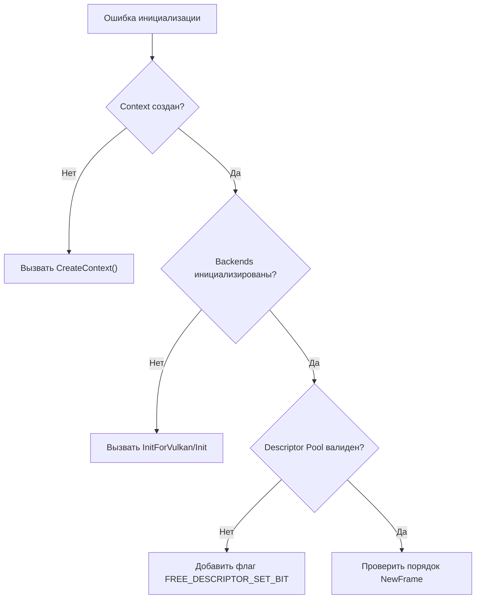
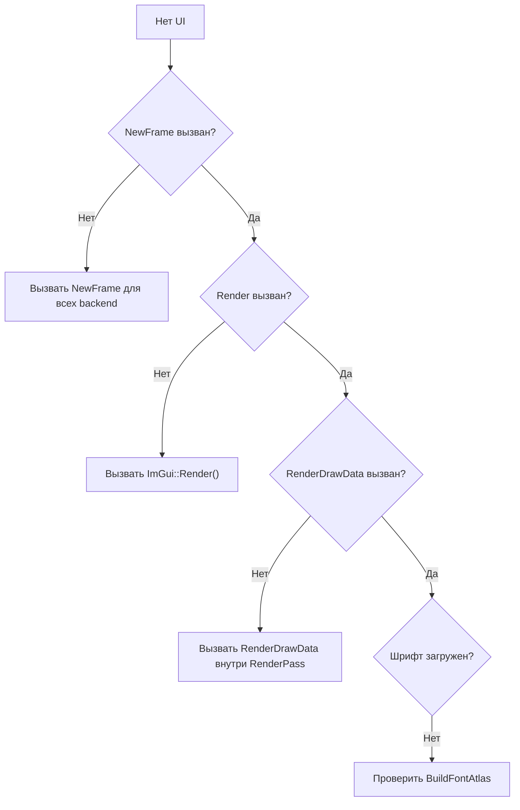

# Решение проблем Dear ImGui

🟡 **Уровень 2: Средний**

## Деревья решений

### Диагностика инициализации



### Диагностика отрисовки



---

## Частые проблемы

### Белые прямоугольники вместо текста

**Причина:** Не загружена текстура шрифта.

**Решение:**

1. Проверьте Descriptor Pool — должен иметь флаг `VK_DESCRIPTOR_POOL_CREATE_FREE_DESCRIPTOR_SET_BIT`
2. Убедитесь, что `ImGui_ImplVulkan_CreateFontsTexture()` выполнился (обычно автоматически внутри Init)

```cpp
// Правильный Descriptor Pool
VkDescriptorPoolCreateInfo pool_info = {};
pool_info.flags = VK_DESCRIPTOR_POOL_CREATE_FREE_DESCRIPTOR_SET_BIT;  // Обязательно!
```

### Виджеты не реагируют

**Причина:** Конфликт ID или перехват ввода.

**Решение:**

1. Используйте `PushID`/`PopID` в циклах:

```cpp
for (int i = 0; i < items.size(); i++) {
    ImGui::PushID(i);
    if (ImGui::Button("Delete")) { /* ... */ }
    ImGui::PopID();
}
```

2. Проверьте `io.WantCaptureMouse` и `io.WantCaptureKeyboard`:

```cpp
if (!io.WantCaptureMouse) {
    // Обработка кликов вне ImGui
}
```

### Ошибка линковки (Unresolved external)

**Причина:** Не скомпилированы файлы backend'ов.

**Решение:** Добавьте в CMake:

```cmake
set(IMGUI_SOURCES
    ${IMGUI_DIR}/imgui.cpp
    ${IMGUI_DIR}/imgui_draw.cpp
    ${IMGUI_DIR}/imgui_tables.cpp
    ${IMGUI_DIR}/imgui_widgets.cpp
    ${IMGUI_DIR}/backends/imgui_impl_sdl3.cpp   # Platform backend
    ${IMGUI_DIR}/backends/imgui_impl_vulkan.cpp # Renderer backend
)
```

### Окно не появляется

**Причины и решения:**

| Причина                | Решение                                                   |
|------------------------|-----------------------------------------------------------|
| Окно свёрнуто          | Проверьте `Begin()` — возвращает false если окно свёрнуто |
| Позиция за экраном     | Используйте `SetNextWindowPos` с `ImGuiCond_Appearing`    |
| Окно закрыто через [X] | Проверьте `p_open` параметр в `Begin()`                   |

```cpp
static bool show_window = true;
if (show_window) {
    ImGui::SetNextWindowPos(ImVec2(100, 100), ImGuiCond_Appearing);
    if (ImGui::Begin("My Window", &show_window)) {
        // Содержимое
    }
    ImGui::End();
}
```

### Мерцание или артефакты

**Причина:** Неправильный порядок вызовов или `Set*` вместо `SetNext*`.

**Решение:**

1. Проверьте порядок NewFrame:

```cpp
// Правильный порядок:
ImGui_ImplVulkan_NewFrame();   // Сначала Renderer
ImGui_ImplSDL3_NewFrame();     // Затем Platform
ImGui::NewFrame();             // Затем ImGui
```

2. Используйте `SetNextWindowPos`/`SetNextWindowSize` вместо `SetWindowPos`/`SetWindowSize`:

```cpp
// Правильно (до Begin):
ImGui::SetNextWindowPos(pos);
ImGui::Begin("Window");

// Проблемно (внутри Begin/End):
ImGui::Begin("Window");
ImGui::SetWindowPos(pos);  // Может вызывать мерцание
ImGui::End();
```

### Крэш при Shutdown

**Причина:** Неправильный порядок очистки.

**Решение:**

```cpp
// Правильный порядок shutdown:
vkDeviceWaitIdle(device);       // 1. Дождаться завершения GPU
ImGui_ImplVulkan_Shutdown();    // 2. Renderer backend
ImGui_ImplSDL3_Shutdown();      // 3. Platform backend
ImGui::DestroyContext();        // 4. Контекст последним
```

### Проблемы с вводом текста (IME)

**Причина:** Не активирован текстовый ввод в SDL.

**Решение:**

```cpp
// Проверить WantTextInput
ImGuiIO& io = ImGui::GetIO();
if (io.WantTextInput) {
    SDL_StartTextInput(window);
} else {
    SDL_StopTextInput(window);
}
```

### Проблемы с несколькими окнами SDL

**Причина:** События передаются не в тот контекст.

**Решение:**

```cpp
// Переключать контекст перед обработкой
ImGui::SetCurrentContext(ctx_for_window);

// Или обрабатывать события в правильном порядке
SDL_Event event;
while (SDL_PollEvent(&event)) {
    // Определить, какому окну принадлежит событие
    if (event.window.windowID == window1_id) {
        ImGui::SetCurrentContext(ctx1);
        ImGui_ImplSDL3_ProcessEvent(&event);
    } else if (event.window.windowID == window2_id) {
        ImGui::SetCurrentContext(ctx2);
        ImGui_ImplSDL3_ProcessEvent(&event);
    }
}
```

---

## Отладочные инструменты

### ShowMetricsWindow

```cpp
// Показывает внутреннее состояние ImGui
ImGui::ShowMetricsWindow();
```

Показывает:

- Все окна и их свойства
- Draw lists и команды
- Активный ID и hover

### ShowIDStackToolWindow

```cpp
// Отладка ID конфликтов
ImGui::ShowIDStackToolWindow();
```

Показывает ID stack для виджета под курсором.

### Отладочный вывод

```cpp
void debugImGuiState() {
    ImGuiIO& io = ImGui::GetIO();

    printf("DisplaySize: %.0f x %.0f\n", io.DisplaySize.x, io.DisplaySize.y);
    printf("DeltaTime: %.4f\n", io.DeltaTime);
    printf("WantCaptureMouse: %d\n", io.WantCaptureMouse);
    printf("WantCaptureKeyboard: %d\n", io.WantCaptureKeyboard);
    printf("Framerate: %.1f\n", io.Framerate);
}
```

---

## Коды ошибок Vulkan

| Ошибка                          | Причина                                    | Решение                                          |
|---------------------------------|--------------------------------------------|--------------------------------------------------|
| VK_ERROR_OUT_OF_DEVICE_MEMORY   | Недостаточно памяти для шрифтовой текстуры | Уменьшить размер атласа шрифтов                  |
| VK_ERROR_OUT_OF_POOL_MEMORY     | Исчерпан Descriptor Pool                   | Увеличить размер pool или количество descriptors |
| VK_ERROR_INVALID_DESCRIPTOR_SET | Невалидный descriptor set                  | Проверить ImGui_ImplVulkan_AddTexture            |
