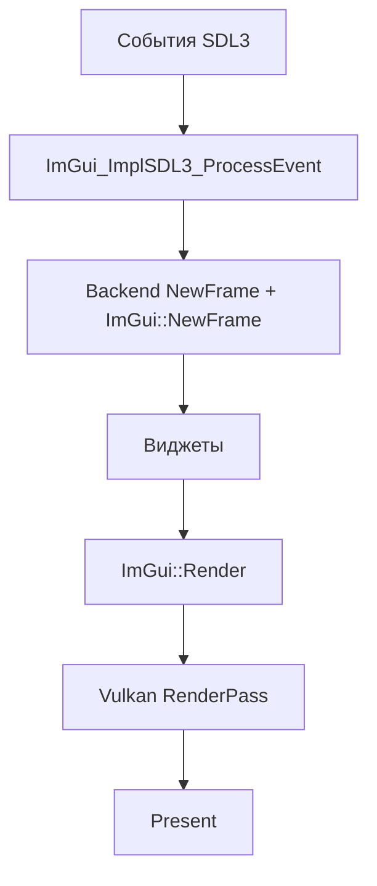

# Интеграция ImGui с ProjectV

🔴 **Уровень 3: Продвинутый**

ProjectV-специфичные рекомендации по интеграции Dear ImGui с SDL3, Vulkan и volk.

## Архитектура интеграции

ImGui в ProjectV используется для:

1. **Debug UI** — статистика чанков, профилирование, настройки рендеринга
2. **Инструментарий** — редактор мира, инспекторы
3. **Игровой UI** — меню, HUD, инвентарь

### Цикл кадра ImGui в ProjectV



---

## Интеграция с volk

ProjectV использует volk для загрузки Vulkan функций. ImGui должен использовать те же функции.

### CMake конфигурация

```cmake
# Определить IMGUI_IMPL_VULKAN_USE_VOLK перед включением ImGui
target_compile_definitions(imgui PUBLIC IMGUI_IMPL_VULKAN_USE_VOLK)

# Или в imconfig.h:
# #define IMGUI_IMPL_VULKAN_USE_VOLK
```

### Инициализация

```cpp
#include <volk.h>
#include <imgui.h>
#include <backends/imgui_impl_sdl3.h>
#include <backends/imgui_impl_vulkan.h>

bool initImGui(AppState& state) {
    // Volk уже инициализирован: volkInitialize(), volkLoadInstance(), volkLoadDevice()

    IMGUI_CHECKVERSION();
    ImGui::CreateContext();
    ImGuiIO& io = ImGui::GetIO();
    io.ConfigFlags |= ImGuiConfigFlags_NavEnableKeyboard;

    ImGui::StyleColorsDark();

    // Platform backend
    if (!ImGui_ImplSDL3_InitForVulkan(state.window)) {
        return false;
    }

    // Renderer backend (volk функции используются автоматически)
    ImGui_ImplVulkan_InitInfo init_info = {};
    init_info.Instance = state.instance;
    init_info.PhysicalDevice = state.physicalDevice;
    init_info.Device = state.device;
    init_info.QueueFamily = state.queueFamilyIndex;
    init_info.Queue = state.queue;
    init_info.DescriptorPool = state.descriptorPool;
    init_info.MinImageCount = 2;
    init_info.ImageCount = static_cast<uint32_t>(state.swapchainImages.size());
    init_info.MSAASamples = VK_SAMPLE_COUNT_1_BIT;

    if (!ImGui_ImplVulkan_Init(&init_info)) {
        return false;
    }

    return true;
}
```

---

## Интеграция с VMA

ImGui требует память GPU для шрифтовой текстуры. При использовании VMA:

### Descriptor Pool

```cpp
VkDescriptorPool createDescriptorPool(VkDevice device) {
    VkDescriptorPoolSize pool_sizes[] = {
        { VK_DESCRIPTOR_TYPE_COMBINED_IMAGE_SAMPLER, 1000 },
    };

    VkDescriptorPoolCreateInfo pool_info = {};
    pool_info.sType = VK_STRUCTURE_TYPE_DESCRIPTOR_POOL_CREATE_INFO;
    pool_info.flags = VK_DESCRIPTOR_POOL_CREATE_FREE_DESCRIPTOR_SET_BIT;
    pool_info.maxSets = 1000;
    pool_info.poolSizeCount = 1;
    pool_info.pPoolSizes = pool_sizes;

    VkDescriptorPool pool;
    VK_CHECK(vkCreateDescriptorPool(device, &pool_info, nullptr, &pool));
    return pool;
}
```

### Загрузка шрифтовой текстуры

ImGui автоматически создаёт текстуру шрифта при вызове `ImGui_ImplVulkan_CreateFontsTexture()`. VMA не нужен для этой
текстуры — backend управляет ею сам.

---

## DPI Scaling

ProjectV поддерживает HiDPI мониторы.

### Получение DPI scale

```cpp
float getDPIScale(SDL_Window* window) {
    SDL_DisplayID display_id = SDL_GetDisplayForWindow(window);
    return SDL_GetDisplayContentScale(display_id);
}
```

### Применение масштабирования

```cpp
void applyDPIScale(float scale) {
    // Масштабировать стили
    ImGuiStyle& style = ImGui::GetStyle();
    style.ScaleAllSizes(scale);

    // Масштабировать шрифт
    ImGuiIO& io = ImGui::GetIO();
    io.FontGlobalScale = scale;

    // Или загрузить шрифт с учётом масштаба
    io.Fonts->AddFontFromFileTTF("fonts/Roboto-Medium.ttf", 16.0f * scale);
}
```

### Обработка изменения DPI

```cpp
// При перемещении окна на другой монитор
void onDPIScaleChanged(float new_scale) {
    // Пересоздать шрифты
    ImGuiIO& io = ImGui::GetIO();
    io.Fonts->Clear();
    io.Fonts->AddFontFromFileTTF("fonts/Roboto-Medium.ttf", 16.0f * new_scale);
    io.FontGlobalScale = new_scale;

    // Перезагрузить текстуру шрифтов
    ImGui_ImplVulkan_DestroyFontUploadObjects();
    ImGui_ImplVulkan_CreateFontsTexture();
}
```

---

## Множественные окна

SDL3 поддерживает несколько окон с разными Vulkan surfaces.

### Структура для нескольких окон

```cpp
struct WindowContext {
    SDL_Window* window;
    VkSurfaceKHR surface;
    VkSwapchainKHR swapchain;
    ImGuiContext* imguiContext;
    std::vector<VkImage> swapchainImages;
    std::vector<VkImageView> swapchainViews;
    VkExtent2D extent;
};
```

### Инициализация для каждого окна

```cpp
bool initWindowImGui(WindowContext& ctx, VkInstance instance, VkPhysicalDevice physicalDevice,
                     VkDevice device, uint32_t queueFamily, VkQueue queue, VkDescriptorPool pool) {
    // Создать отдельный контекст ImGui
    ctx.imguiContext = ImGui::CreateContext();
    ImGui::SetCurrentContext(ctx.imguiContext);

    ImGuiIO& io = ImGui::GetIO();
    io.ConfigFlags |= ImGuiConfigFlags_NavEnableKeyboard;

    // Platform backend
    if (!ImGui_ImplSDL3_InitForVulkan(ctx.window)) {
        return false;
    }

    // Renderer backend
    ImGui_ImplVulkan_InitInfo init_info = {};
    init_info.Instance = instance;
    init_info.PhysicalDevice = physicalDevice;
    init_info.Device = device;
    init_info.QueueFamily = queueFamily;
    init_info.Queue = queue;
    init_info.DescriptorPool = pool;
    init_info.MinImageCount = 2;
    init_info.ImageCount = static_cast<uint32_t>(ctx.swapchainImages.size());

    if (!ImGui_ImplVulkan_Init(&init_info)) {
        return false;
    }

    return true;
}
```

### Обработка событий для нескольких окон

```cpp
void processEvents(const SDL_Event& event, std::vector<WindowContext>& windows) {
    for (auto& ctx : windows) {
        if (SDL_GetWindowID(ctx.window) == event.window.windowID) {
            ImGui::SetCurrentContext(ctx.imguiContext);
            ImGui_ImplSDL3_ProcessEvent(&event);
            break;
        }
    }
}
```

---

## Пример полного кода

### Структура приложения

```cpp
struct AppState {
    // Vulkan
    VkInstance instance = VK_NULL_HANDLE;
    VkPhysicalDevice physicalDevice = VK_NULL_HANDLE;
    VkDevice device = VK_NULL_HANDLE;
    VkQueue queue = VK_NULL_HANDLE;
    uint32_t queueFamilyIndex = 0;
    VkDescriptorPool descriptorPool = VK_NULL_HANDLE;

    // Swapchain
    VkSwapchainKHR swapchain = VK_NULL_HANDLE;
    std::vector<VkImage> swapchainImages;
    std::vector<VkImageView> swapchainViews;
    VkExtent2D swapchainExtent;
    VkRenderPass renderPass;
    std::vector<VkFramebuffer> framebuffers;
    VkCommandPool commandPool;
    std::vector<VkCommandBuffer> commandBuffers;

    // SDL
    SDL_Window* window = nullptr;

    // ImGui
    ImGuiContext* imguiContext = nullptr;

    // State
    bool running = true;
    float dpiScale = 1.0f;
};
```

### Инициализация

```cpp
bool initVulkanImGui(AppState& state) {
    // 1. Volk уже инициализирован
    // 2. Vulkan instance, device, queue уже созданы
    // 3. Swapchain уже создан

    IMGUI_CHECKVERSION();
    state.imguiContext = ImGui::CreateContext();
    ImGui::SetCurrentContext(state.imguiContext);

    ImGuiIO& io = ImGui::GetIO();
    io.ConfigFlags |= ImGuiConfigFlags_NavEnableKeyboard;

    // DPI scale
    state.dpiScale = getDPIScale(state.window);
    ImGui::GetStyle().ScaleAllSizes(state.dpiScale);
    io.FontGlobalScale = state.dpiScale;

    ImGui::StyleColorsDark();

    // Platform
    if (!ImGui_ImplSDL3_InitForVulkan(state.window)) {
        return false;
    }

    // Renderer
    ImGui_ImplVulkan_InitInfo init_info = {};
    init_info.Instance = state.instance;
    init_info.PhysicalDevice = state.physicalDevice;
    init_info.Device = state.device;
    init_info.QueueFamily = state.queueFamilyIndex;
    init_info.Queue = state.queue;
    init_info.DescriptorPool = state.descriptorPool;
    init_info.MinImageCount = 2;
    init_info.ImageCount = static_cast<uint32_t>(state.swapchainImages.size());
    init_info.MSAASamples = VK_SAMPLE_COUNT_1_BIT;

    if (!ImGui_ImplVulkan_Init(&init_info)) {
        return false;
    }

    return true;
}
```

### Цикл кадра

```cpp
void renderFrame(AppState& state, uint32_t imageIndex) {
    ImGui::SetCurrentContext(state.imguiContext);

    // 1. NewFrame
    ImGui_ImplVulkan_NewFrame();
    ImGui_ImplSDL3_NewFrame();
    ImGui::NewFrame();

    // 2. UI
    renderUI(state);

    // 3. Render
    ImGui::Render();

    // 4. Vulkan command buffer
    VkCommandBuffer cmd = state.commandBuffers[imageIndex];
    vkResetCommandBuffer(cmd, 0);

    VkCommandBufferBeginInfo begin_info = {};
    begin_info.sType = VK_STRUCTURE_TYPE_COMMAND_BUFFER_BEGIN_INFO;
    vkBeginCommandBuffer(cmd, &begin_info);

    // Begin render pass
    VkRenderPassBeginInfo rp_info = {};
    rp_info.sType = VK_STRUCTURE_TYPE_RENDER_PASS_BEGIN_INFO;
    rp_info.renderPass = state.renderPass;
    rp_info.framebuffer = state.framebuffers[imageIndex];
    rp_info.renderArea.extent = state.swapchainExtent;
    // ... clear values

    vkCmdBeginRenderPass(cmd, &rp_info, VK_SUBPASS_CONTENTS_INLINE);

    // Render ImGui
    ImDrawData* draw_data = ImGui::GetDrawData();
    if (draw_data && draw_data->DisplaySize.x > 0 && draw_data->DisplaySize.y > 0) {
        ImGui_ImplVulkan_RenderDrawData(draw_data, cmd);
    }

    vkCmdEndRenderPass(cmd);
    vkEndCommandBuffer(cmd);
}
```

### Shutdown

```cpp
void shutdownImGui(AppState& state) {
    vkDeviceWaitIdle(state.device);

    ImGui::SetCurrentContext(state.imguiContext);
    ImGui_ImplVulkan_Shutdown();
    ImGui_ImplSDL3_Shutdown();
    ImGui::DestroyContext(state.imguiContext);
    state.imguiContext = nullptr;
}
```
