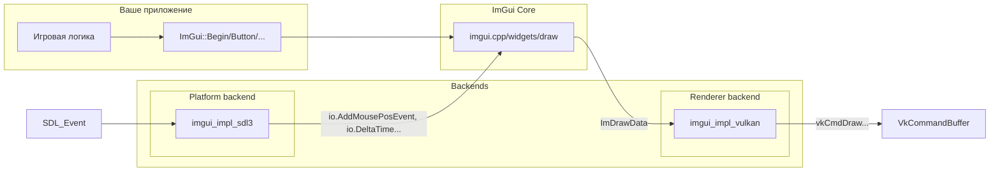
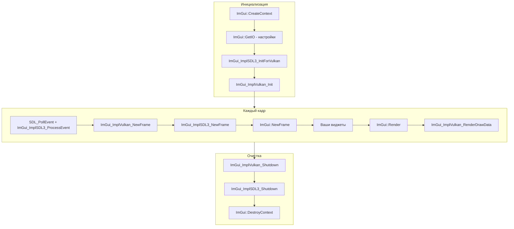

# Основные понятия Dear ImGui

**🟡 Уровень 2: Средний**

Краткое введение в ImGui. Термины — в [глоссарии](glossary.md).

## На этой странице

- [Зачем ImGui в игре на Vulkan](#зачем-imgui-в-игре-на-vulkan)
- [Immediate mode vs retained mode](#immediate-mode-vs-retained-mode)
- [Цикл кадра ImGui](#цикл-кадра-imgui)
- [Архитектура: Platform + Renderer](#архитектура-platform--renderer)
- [WantCaptureMouse и WantCaptureKeyboard](#wantcapturemouse-и-wantcapturekeyboard)
- [ID Stack: PushID и PopID](#id-stack-pushid-и-popid)
- [Паттерн Begin/End](#паттерн-beginend)
- [SetNext vs Set](#setnext-vs-set)
- [Общая схема](#общая-схема)

---

## Зачем ImGui в игре на Vulkan

ImGui даёт:

- **Отладочный UI** — окна с параметрами (слайдеры, чекбоксы) без написания сложного layout.
- **Редакторы** — инструменты для контента, настройки уровней, инспекторы.
- **HUD и меню** — внутриигровые интерфейсы, паузы, инвентарь.
- **Минимальный setup** — виджеты создаются вызовами (`ImGui::Button`, `ImGui::SliderFloat`) в коде; ImGui сам управляет
  состоянием и отрисовкой.

Vulkan не знает об ImGui — ImGui только генерирует команды отрисовки (вершины, индексы, текстуры). Рендеринг выполняет
backend `imgui_impl_vulkan`, который использует ваш `VkCommandBuffer` и pipeline.

---

## Immediate mode vs retained mode

| Парадигма             | Как создаётся UI                                                                    | Где хранится состояние                           |
|-----------------------|-------------------------------------------------------------------------------------|--------------------------------------------------|
| **Retained**          | Создаёшь дерево виджетов один раз (конструкторы, setParent и т.д.).                 | В вашем коде (узлы дерева, флаги).               |
| **Immediate (ImGui)** | Каждый кадр вызываешь `ImGui::Button("Click")` и т.д. Код выполняется каждый frame. | Внутри ImGui. Вы не храните указатели на кнопки. |

В immediate mode, если код не вызвал виджет — его нет. Нет отдельного «создания» и «уничтожения». Это упрощает
интеграцию: можно вызывать `ImGui::Begin("Debug")` только когда `show_debug` == true, и окно появится/исчезнет само.

---

## Цикл кадра ImGui

Каждый кадр приложения выполняется такая последовательность:

```mermaid
flowchart TD
    subgraph BackendNewFrame [Backend NewFrame]
        VulkanNF[ImGui_ImplVulkan_NewFrame]
        SDL3NF[ImGui_ImplSDL3_NewFrame]
    end
    
    subgraph CoreNewFrame [Core]
        NewFrame[ImGui::NewFrame]
    end
    
    subgraph UserCode["Ваш код"]
        Widgets["Виджеты: Begin/End, Text, Button, Slider..."]
    end
    
    subgraph Render["Рендеринг"]
        Render[ImGui::Render]
        GetDrawData[ImGui::GetDrawData]
        RenderDrawData[ImGui_ImplVulkan_RenderDrawData]
    end
    
    VulkanNF --> SDL3NF
    SDL3NF --> NewFrame
    NewFrame --> Widgets
    Widgets --> Render
    Render --> GetDrawData
    GetDrawData --> RenderDrawData
```

1. **ImGui_ImplVulkan_NewFrame()** — подготовка renderer backend.
2. **ImGui_ImplSDL3_NewFrame()** — передача ввода (мышь, клавиатура) в ImGui, обновление `io.DeltaTime`,
   `io.DisplaySize`.
3. **ImGui::NewFrame()** — начало нового кадра ImGui.
4. **Виджеты** — `ImGui::Begin`, `ImGui::Text`, `ImGui::Button`, `ImGui::End` и т.д.
5. **ImGui::Render()** — генерация команд отрисовки.
6. **ImGui::GetDrawData()** — получить `ImDrawData*`.
7. **ImGui_ImplVulkan_RenderDrawData(draw_data, command_buffer)** — записать в Vulkan command buffer.

Порядок NewFrame **важен**: сначала Renderer, затем Platform, затем `ImGui::NewFrame`. См. [Интеграция](integration.md).

---

## Архитектура: Platform + Renderer

ImGui разделён на ядро и два типа backend'ов:



| Backend      | Назначение                                                                                                                | Пример реализации   |
|--------------|---------------------------------------------------------------------------------------------------------------------------|---------------------|
| **Platform** | Ввод (мышь, клавиатура, геймпад), размер окна, курсор, clipboard. Вызывает `io.AddMousePosEvent`, `io.AddKeyEvent` и т.д. | `imgui_impl_sdl3`   |
| **Renderer** | Создание шрифтовой текстуры, отрисовка вершин. Вызывает `vkCmdDraw*`, создаёт pipeline и descriptor sets.                 | `imgui_impl_vulkan` |

Один Platform + один Renderer. В связке SDL3 + Vulkan: `ImGui_ImplSDL3_InitForVulkan(window)` и
`ImGui_ImplVulkan_Init(&init_info)`.

---

## WantCaptureMouse, WantCaptureKeyboard и WantTextInput: управление вводом в игре

В играх часто требуется разделение ввода между UI и игровой логикой. ImGui предоставляет три флага в `ImGuiIO` для
управления этим разделением:

| Флаг                       | Значение                                                                       | Типичное использование в играх и инструментах              |
|----------------------------|--------------------------------------------------------------------------------|------------------------------------------------------------|
| **io.WantCaptureMouse**    | `true` — ImGui «владеет» мышью (курсор над окном ImGui, перетаскивание и т.д.) | Блокировать вращение камеры, выбор объектов, клики по миру |
| **io.WantCaptureKeyboard** | `true` — ImGui «владеет» клавиатурой (поле ввода, фокус в окне ImGui)          | Блокировать WASD, горячие клавиши, управление персонажем   |
| **io.WantTextInput**       | `true` — ImGui ожидает текст (IME, ввод символов)                              | Активировать системное поле ввода для IME                  |

### Детали реализации

**Когда устанавливаются флаги:**

- `WantCaptureMouse` = `true`, когда курсор находится над любым окном ImGui, или когда происходит перетаскивание виджета
- `WantCaptureKeyboard` = `true`, когда любое поле ввода (`InputText`, `InputFloat` и т.д.) имеет фокус
- `WantTextInput` = `true`, когда активен виджет, требующий текстового ввода (например, многострочное поле)

**Типичный порядок обработки ввода в игре с SDL и Vulkan:**

1. События SDL передаются в ImGui через `ImGui_ImplSDL3_ProcessEvent(event)`
2. ImGui обновляет свои внутренние состояния и флаги `WantCapture*`
3. Игровая логика проверяет флаги и решает, обрабатывать ли ввод

```cpp
// Пример обработки ввода для воксельного движка
void process_input(SDL_Event& event, Camera& camera, VoxelWorld& world) {
    // Сначала передаём события в ImGui
    ImGui_ImplSDL3_ProcessEvent(&event);
    
    ImGuiIO& io = ImGui::GetIO();
    
    switch (event.type) {
        case SDL_EVENT_MOUSE_MOTION:
            if (!io.WantCaptureMouse) {
                // Вращение камеры только если ImGui не захватил мышь
                camera.rotate(event.motion.xrel, event.motion.yrel);
            }
            break;
            
        case SDL_EVENT_MOUSE_BUTTON_DOWN:
            if (!io.WantCaptureMouse) {
                // Выбор/размещение вокселей
                if (event.button.button == SDL_BUTTON_LEFT) {
                    world.place_voxel(camera.get_ray());
                } else if (event.button.button == SDL_BUTTON_RIGHT) {
                    world.remove_voxel(camera.get_ray());
                }
            }
            break;
            
        case SDL_EVENT_KEY_DOWN:
            if (!io.WantCaptureKeyboard) {
                // Управление персонажем/камерой
                switch (event.key.key) {
                    case SDLK_w: camera.move_forward(); break;
                    case SDLK_s: camera.move_backward(); break;
                    case SDLK_a: camera.move_left(); break;
                    case SDLK_d: camera.move_right(); break;
                    case SDLK_ESCAPE: show_menu = !show_menu; break;
                }
            }
            break;
    }
}
```

### Особые случаи для воксельного движка

**1. Контекстное меню и модальные окна:**

```cpp
// Модальное окно блокирует весь ввод
if (ImGui::BeginPopupModal("Save World", nullptr, 
                           ImGuiWindowFlags_NoResize | ImGuiWindowFlags_NoMove)) {
    // Пока открыто модальное окно, WantCaptureMouse и WantCaptureKeyboard = true
    // Вся игровая логика должна быть приостановлена
    ImGui::Text("Save current world?");
    if (ImGui::Button("Save")) {
        world.save();
        ImGui::CloseCurrentPopup();
    }
    ImGui::SameLine();
    if (ImGui::Button("Cancel")) {
        ImGui::CloseCurrentPopup();
    }
    ImGui::EndPopup();
}
```

**2. "Гибридный" ввод (UI + игра одновременно):**
Иногда нужно, чтобы UI и игра одновременно получали ввод (например, при перетаскивании объекта в редакторе мира). Для
этого можно использовать дополнительные проверки:

```cpp
void handle_editor_input(EditorObject& selected, Camera& camera) {
    ImGuiIO& io = ImGui::GetIO();
    
    // Если перетаскиваем объект, разрешаем одновременно управление камерой
    bool is_dragging_object = (selected.drag_state == DragState::Active);
    
    if (!io.WantCaptureMouse || is_dragging_object) {
        // Разрешаем вращение камеры даже при активном UI
        camera.handle_mouse_input();
    }
    
    // Клавиши для редактора всегда активны
    if (!io.WantCaptureKeyboard) {
        // Горячие клавиши редактора
        if (ImGui::IsKeyPressed(SDLK_DELETE)) {
            delete_selected_object();
        }
    }
}
```

**3. WantTextInput и IME для многоязычного ввода:**

```cpp
// Активация системного IME при вводе текста
if (io.WantTextInput) {
    // Показать системное поле ввода, если нужно
    SDL_StartTextInput();
} else {
    SDL_StopTextInput();
}

// Обработка ввода текста через IME
if (event.type == SDL_EVENT_TEXT_INPUT) {
    // event.text.text содержит символы (включая Unicode)
    ImGui::GetIO().AddInputCharactersUTF8(event.text.text);
}
```

### Оптимизация производительности

Проверка флагов `WantCapture*` выполняется каждый кадр. Для оптимизации:

1. **Кэширование флагов:** если обработка ввода происходит в нескольких местах, сохраните флаги в локальные переменные
2. **Ранний выход:** если `io.WantCaptureMouse && io.WantCaptureKeyboard`, можно пропустить всю обработку ввода игры
3. **Приоритеты:** определите, какие действия должны иметь приоритет над UI (например, пауза игры по Escape)

```cpp
// Оптимизированная проверка
void handle_game_input() {
    ImGuiIO& io = ImGui::GetIO();
    bool ui_wants_input = io.WantCaptureMouse || io.WantCaptureKeyboard;
    
    if (ui_wants_input) {
        // UI имеет приоритет, пропускаем игровой ввод
        return;
    }
    
    // Обработка игрового ввода
    handle_camera_input();
    handle_player_actions();
    handle_hotkeys();
}
```

### Отладка проблем с вводом

Если ввод работает некорректно:

1. **Проверьте порядок вызовов:** `ImGui_ImplSDL3_ProcessEvent()` должен вызываться ДО игровой обработки ввода
2. **Визуализируйте флаги:** добавьте в дебаг-UI отображение текущих значений флагов
3. **Проверьте конфигурацию SDL:** убедитесь, что SDL правильно инициализирован для получения событий мыши/клавиатуры

```cpp
// Дебаг-окно для отслеживания ввода
void debug_input_ui() {
    ImGuiIO& io = ImGui::GetIO();
    
    ImGui::Begin("Input Debug");
    ImGui::Text("WantCaptureMouse: %s", io.WantCaptureMouse ? "YES" : "NO");
    ImGui::Text("WantCaptureKeyboard: %s", io.WantCaptureKeyboard ? "YES" : "NO");
    ImGui::Text("WantTextInput: %s", io.WantTextInput ? "YES" : "NO");
    ImGui::Text("Mouse Pos: (%.1f, %.1f)", io.MousePos.x, io.MousePos.y);
    ImGui::Text("Mouse Down: L=%d, R=%d", io.MouseDown[0], io.MouseDown[1]);
    ImGui::End();
}
```

**Итог:** Правильное использование `WantCapture` флагов критично для создания плавного пользовательского опыта в игре. В
воксельном движке особенно важно разделение ввода между редактором мира, дебаг-интерфейсами и игровым процессом.

---

## ID Stack: PushID и PopID

ImGui различает виджеты по **ID** — хешу от строки в «стеке ID». В циклах виджеты получают один и тот же label и,
значит, один ID — возникает конфликт.

**Решение 1 — PushID/PopID:**

```cpp
for (int i = 0; i < items_count; i++) {
    ImGui::PushID(i);
    if (ImGui::Button("Delete"))
        delete_item(i);
    ImGui::PopID();
}
```

**Решение 2 — синтаксис "Label##id":** текст до `##` отображается, после — только для ID:

```cpp
ImGui::Button("Save##save_btn");
ImGui::Button("Load##load_btn");
```

Без `PushID` все кнопки в цикле получают один ID — ImGui воспринимает их как один виджет; клик «переключает» сразу все.

### Производительность ID Stack в воксельном движке

В воксельном движке часто возникают интерфейсы с сотнями или тысячами элементов (список чанков, палитра блоков,
инвентарь). Каждый `PushID`/`PopID` добавляет overhead. Для оптимизации:

1. **Используйте `PushID(const void*)` вместо `PushID(int)`**, если у вас есть уникальные указатели на объекты:
   ```cpp
   for (const auto& chunk : voxel_chunks) {
       ImGui::PushID(&chunk);  // Указатель как ID
       ImGui::Text("Chunk at %d,%d,%d", chunk.x, chunk.y, chunk.z);
       ImGui::PopID();
   }
   ```

2. **Избегайте глубоких стеков ID** — не вкладывайте циклы без необходимости.

3. **Используйте `##` для статических элементов**, а `PushID` — для динамических списков.

4. **Профилирование с Tracy** — измерьте время, затрачиваемое на управление ID Stack в кадре.

**Пример воксельного инвентаря:**

```cpp
// Неоптимально: PushID для каждого слота
for (int i = 0; i < 1000; i++) {
    ImGui::PushID(i);
    ImGui::Button("##slot", ImVec2(40, 40));
    ImGui::PopID();
}

// Оптимально: группировка виджетов
ImGui::PushID("inventory_grid");
for (int y = 0; y < 20; y++) {
    for (int x = 0; x < 50; x++) {
        ImGui::PushID(y * 50 + x);
        ImGui::Button("##slot", ImVec2(40, 40));
        ImGui::PopID();
    }
}
ImGui::PopID();
```

**Ключевой вывод:** Для интерфейсов с >1000 элементов производительность ID Stack становится заметной. Используйте `##`
для статичных виджетов и минимизируйте вызовы `PushID`/`PopID`.

См. [Глоссарий](glossary.md) (PushID/PopID), [Справочник API](api-reference.md#pushid--popid).

---

## Паттерн Begin/End

Многие функции ImGui работают парами Begin/End: `Begin`, `BeginMenu`, `BeginTable`, `BeginCombo`, `BeginPopup` и т.д. *
*Важно:** для `BeginMenu`, `BeginTable`, `BeginCombo`, `BeginPopup` вызывайте соответствующий `End` **только если**
`Begin` вернул `true`:

```cpp
if (ImGui::Begin("MyWindow")) {
    // ...
}
ImGui::End();   // Begin/End окна — End всегда, даже при false

if (ImGui::BeginMenu("File")) {
    if (ImGui::MenuItem("Open")) { /* ... */ }
    ImGui::EndMenu();   // Только т.к. BeginMenu вернул true
}

if (ImGui::BeginTable("table", 3)) {
    // ...
    ImGui::EndTable();
}
```

Исключение: `Begin()` и `BeginChild()` — для них `End()` вызывают всегда.
См. [Глоссарий — Begin/End-паттерн](glossary.md).

---

## SetNext vs Set

Для позиции и размера окна есть две группы функций:

| Тип          | Функции                             | Когда вызывать                                  |
|--------------|-------------------------------------|-------------------------------------------------|
| **SetNext*** | SetNextWindowPos, SetNextWindowSize | **До** `Begin()` — применится к следующему окну |
| **Set***     | SetWindowPos, SetWindowSize         | **Внутри** `Begin()`/`End()` — к текущему окну  |

Рекомендуется **SetNext***: меньше побочных эффектов, применяется в начале кадра. `Set*` внутри Begin/End может вызывать
«дёргание» и артефакты.

---

## Общая схема



---

## Дальше

**Следующий раздел:** [Быстрый старт](quickstart.md) — минимальное приложение SDL3 + Vulkan + ImGui.

**См. также:**

- [Глоссарий](glossary.md) — термины (ImGuiContext, ImGuiIO, backend и др.)
- [Интеграция](integration.md) — CMake, порядок инициализации, imconfig.h

← [На главную imgui](README.md) | [На главную документации](../README.md)
