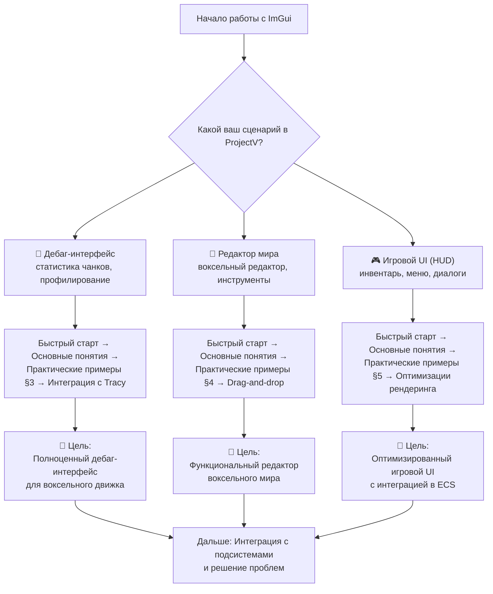
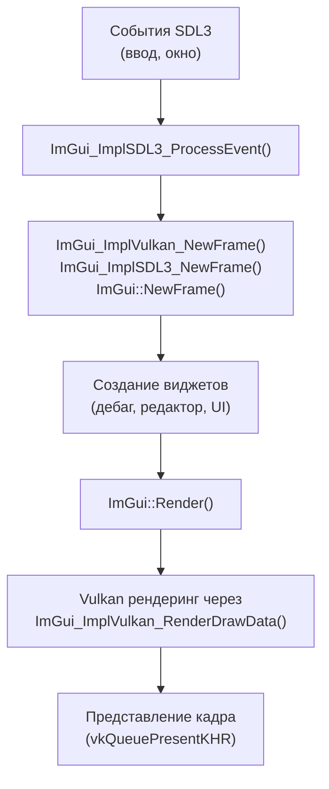

# Интеграция ImGui в ProjectV

**🔴 Уровень 3: Продвинутый**

Данный документ содержит ProjectV-специфичные рекомендации, паттерны и примеры кода для интеграции библиотеки
Dear ImGui в воксельный движок ProjectV. Все примеры кода основаны на реальных примерах
из [docs/examples/imgui_sdl_vulkan.cpp](../../examples/imgui_sdl_vulkan.cpp).

## Оглавление

1. [Диаграмма обучения (Learning Path) для ProjectV](#диаграмма-обучения-learning-path-для-projectv)
2. [Архитектура интеграции ImGui в ProjectV](#архитектура-интеграции-imgui-в-projectv)
3. [Практические примеры из реального кода](#практические-примеры-из-реального-кода)
4. [Интеграция с подсистемами ProjectV](#интеграция-с-подсистемами-projectv)
  - [flecs ECS](#1-flecs-ecs)
  - [JoltPhysics](#2-joltphysics)
  - [fastgltf](#3-fastgltf)
  - [Tracy](#4-tracy)
5. [Воксельные паттерны и оптимизации](#воксельные-паттерны-и-оптимизации)
6. [Производительность и профилирование](#производительность-и-профилирование)
7. [Практические сценарии для ProjectV](#практические-сценарии-для-projectv)
8. [Лучшие практики для ProjectV](#лучшие-практики-для-projectv)

---

## Диаграмма обучения (Learning Path) для ProjectV

Выберите свой сценарий использования ImGui в ProjectV и следуйте по соответствующему пути:



### Быстрые ссылки по задачам для ProjectV

| Задача                                           | Раздел                                                                      | Пример кода            |
|--------------------------------------------------|-----------------------------------------------------------------------------|------------------------|
| Базовая интеграция ImGui с SDL3 и Vulkan         | [Практические примеры §3.1](#31-базовая-инициализация-imgui)                | `imgui_sdl_vulkan.cpp` |
| Дебаг-интерфейс для статистики воксельных чанков | [Практические примеры §3.2](#32-дебаг-интерфейс-для-вокселей)               | -                      |
| Редактор мира с drag-and-drop                    | [Практические примеры §4.1](#41-редактор-мира-с-вокселями)                  | -                      |
| Игровой UI (инвентарь, HUD)                      | [Практические примеры §5.1](#51-инвентарь-с-сеткой-для-вокселей)            | -                      |
| Интеграция с flecs ECS                           | [Интеграция с подсистемами §1](#1-flecs-ecs)                                | -                      |
| Профилирование UI с Tracy                        | [Производительность и профилирование](#производительность-и-профилирование) | `imgui_sdl_vulkan.cpp` |
| Оптимизация рендеринга для списков вокселей      | [Воксельные паттерны и оптимизации](#воксельные-паттерны-и-оптимизации)     | -                      |

---

## Архитектура интеграции ImGui в ProjectV

### Роль ImGui в стеке ProjectV

ImGui используется в ProjectV для трёх основных задач:

1. **🐛 Дебаг-интерфейс**: Просмотр статистики чанков, профилирование Tracy, настройка параметров рендеринга на лету
2. **🎨 Инструментарий**: Редактор воксельного мира, редактор материалов, управление ассетами
3. **🎮 UI**: Внутриигровые меню, инвентарь, диалоги, HUD элементы

### Жизненный цикл ImGui в цикле рендеринга ProjectV



### Таблица: Стратегии управления вводом для разных сценариев

| Сценарий            | Стратегия ввода                          | Преимущества для ProjectV        | Недостатки                      |
|---------------------|------------------------------------------|----------------------------------|---------------------------------|
| **Дебаг-интерфейс** | Перехват всех событий                    | Полный контроль, горячие клавиши | Конфликты с игровым вводом      |
| **Редактор мира**   | Контекстный перехват (только при фокусе) | Естественное взаимодействие      | Сложная реализация              |
| **Игровой UI**      | Совместное использование                 | Плавная интеграция с геймплеем   | Конфликты приоритетов           |
| **Гибридный режим** | Динамическое переключение                | Максимальная гибкость            | Сложность управления состоянием |

---

## Практические примеры из реального кода

### 3.1 Базовая инициализация ImGui

**Полный пример из `imgui_sdl_vulkan.cpp`:**

```cpp
// Структура состояния приложения (упрощённо)
struct AppState {
    SDL_Window* window = nullptr;
    VkDevice device = VK_NULL_HANDLE;
    VkQueue queue = VK_NULL_HANDLE;
    VkDescriptorPool descriptorPool = VK_NULL_HANDLE;
    float dpiScale = 1.0f;
    // ... другие поля
};

// Инициализация ImGui (полный код)
static bool initImGui(AppState* state) {
    // Проверка версии ImGui
    IMGUI_CHECKVERSION();

    // Создание контекста ImGui
    state->imguiContext = ImGui::CreateContext();
    ImGui::SetCurrentContext(state->imguiContext);
    ImGuiIO& io = ImGui::GetIO();

    // Конфигурация ImGui
    io.ConfigFlags |= ImGuiConfigFlags_NavEnableKeyboard;   // Навигация с клавиатуры
    io.ConfigFlags |= ImGuiConfigFlags_NavEnableGamepad;    // Навигация с геймпада
    io.ConfigFlags |= ImGuiConfigFlags_DockingEnable;       // Докинг (опционально)

    // Настройка стилей
    ImGui::StyleColorsDark();

    // Масштабирование для DPI
    ImGuiStyle& style = ImGui::GetStyle();
    style.ScaleAllSizes(state->dpiScale);
    io.FontGlobalScale = state->dpiScale;

    // Инициализация Platform Backend (SDL3)
    if (!ImGui_ImplSDL3_InitForVulkan(state->window)) {
        return false;
    }

    // Инициализация Renderer Backend (Vulkan)
    ImGui_ImplVulkan_InitInfo init_info = {};
    init_info.Instance = state->instance;
    init_info.PhysicalDevice = state->physicalDevice;
    init_info.Device = state->device;
    init_info.QueueFamily = state->queueFamilyIndex;
    init_info.Queue = state->queue;
    init_info.DescriptorPool = state->descriptorPool;
    init_info.MinImageCount = 2;
    init_info.ImageCount = (uint32_t)state->swapchainImages.size();
    init_info.MSAASamples = VK_SAMPLE_COUNT_1_BIT;
    init_info.PipelineInfoMain.RenderPass = state->renderPass;
    init_info.PipelineInfoMain.Subpass = 0;

    if (!ImGui_ImplVulkan_Init(&init_info)) {
        return false;
    }

    // Загрузка шрифтовой текстуры в GPU
    ImGui_ImplVulkan_CreateFontsTexture();

    return true;
}
```

### 3.2 Дебаг-интерфейс для вокселей

```cpp
// Дебаг-окно со статистикой воксельных чанков
void renderVoxelDebugUI(bool* p_open, const VoxelEngineStats& stats) {
    if (ImGui::Begin("Voxel Statistics", p_open)) {
        // Основная статистика
        ImGui::Text("Loaded Chunks: %d / %d", stats.loadedChunks, stats.totalChunks);
        ImGui::ProgressBar((float)stats.loadedChunks / stats.totalChunks, ImVec2(-FLT_MIN, 0));

        // Детали чанков
        if (ImGui::CollapsingHeader("Chunk Details")) {
            ImGui::BeginTable("chunks", 4, ImGuiTableFlags_Borders | ImGuiTableFlags_SizingFixedFit);
            ImGui::TableSetupColumn("Position");
            ImGui::TableSetupColumn("State");
            ImGui::TableSetupColumn("Memory (MB)");
            ImGui::TableSetupColumn("LOD");
            ImGui::TableHeadersRow();

            for (const auto& chunk : stats.chunks) {
                ImGui::TableNextRow();
                ImGui::TableSetColumnIndex(0);
                ImGui::Text("(%d,%d,%d)", chunk.x, chunk.y, chunk.z);
                ImGui::TableSetColumnIndex(1);
                ImGui::Text("%s", chunkStateToString(chunk.state));
                ImGui::TableSetColumnIndex(2);
                ImGui::Text("%.2f", chunk.memoryMB);
                ImGui::TableSetColumnIndex(3);
                ImGui::Text("LOD %d", chunk.lod);
            }
            ImGui::EndTable();
        }

        // "Горячие" параметры рендеринга
        if (ImGui::CollapsingHeader("Render Settings")) {
            static bool wireframe = false;
            static float lodBias = 1.0f;
            static int maxDistance = 1000;

            ImGui::Checkbox("Wireframe Mode", &wireframe);
            ImGui::SliderFloat("LOD Bias", &lodBias, 0.1f, 4.0f);
            ImGui::SliderInt("Max View Distance", &maxDistance, 100, 5000);

            if (ImGui::Button("Reload Shaders")) {
                // Перезагрузка шейдеров воксельного рендерера
            }
        }
    }
    ImGui::End();
}
```

### 3.3 Основной цикл рендеринга с ImGui

```cpp
SDL_AppResult SDL_AppIterate(void *appstate) {
#ifdef TRACY_ENABLE
    ZoneScoped;  // Tracy: профилирование фрейма
#endif

    AppState* state = static_cast<AppState*>(appstate);

    // 1. Начало кадра ImGui (важен порядок!)
    ImGui_ImplVulkan_NewFrame();
    ImGui_ImplSDL3_NewFrame();
    ImGui::NewFrame();

    // 2. Создание UI
    renderMainMenu(state);
    renderVoxelDebugUI(&state->showVoxelStats, getVoxelStats());

    // 3. Рендеринг ImGui
    ImGui::Render();

    // 4. Vulkan рендеринг
    ImDrawData* draw_data = ImGui::GetDrawData();
    if (draw_data && draw_data->DisplaySize.x > 0 && draw_data->DisplaySize.y > 0) {
        // Здесь должен быть код Vulkan рендеринга
        // ImGui_ImplVulkan_RenderDrawData(draw_data, command_buffer);
    }

    return SDL_APP_CONTINUE;
}
```

---

## Интеграция с подсистемами ProjectV

### 1. flecs ECS

#### Инспектор сущностей и компонентов

```cpp
void renderFlecsInspector(flecs::world& world) {
    if (ImGui::Begin("ECS Inspector")) {
        // Итерация по сущностям
        world.each([&](flecs::entity e) {
            if (ImGui::TreeNode(e.name().c_str())) {
                // Отображение компонентов
                e.each([&](flecs::id id) {
                    ImGui::Text("Component: %s", id.name().c_str());

                    // Динамический инспектор компонентов
                    if (id.is_pair()) {
                        ImGui::SameLine();
                        ImGui::TextColored(ImVec4(0.5f, 0.5f, 1.0f, 1.0f),
                                          "(Relation)");
                    }
                });
                ImGui::TreePop();
            }
        });

        // Статистика ECS
        if (ImGui::CollapsingHeader("Statistics")) {
            ImGui::Text("Entities: %d", world.count());
            ImGui::Text("Components: %d", world.count(flecs::Component));
            ImGui::Text("Systems: %d", world.count(flecs::System));
        }
    }
    ImGui::End();
}
```

#### Создание сущностей через UI

```cpp
void renderEntityCreator(flecs::world& world) {
    if (ImGui::Begin("Entity Creator")) {
        static char nameBuffer[128] = "NewEntity";
        static bool addTransform = true;
        static bool addRenderable = true;
        static bool addPhysics = false;

        ImGui::InputText("Name", nameBuffer, sizeof(nameBuffer));
        ImGui::Checkbox("Add Transform", &addTransform);
        ImGui::Checkbox("Add Renderable", &addRenderable);
        ImGui::Checkbox("Add Physics", &addPhysics);

        if (ImGui::Button("Create Entity")) {
            auto entity = world.entity(nameBuffer);

            if (addTransform) {
                entity.set<TransformComponent>({});
            }
            if (addRenderable) {
                entity.set<RenderableComponent>({});
            }
            if (addPhysics) {
                entity.set<PhysicsComponent>({});
            }

            ImGui::OpenPopup("Entity Created");
        }

        // Popup подтверждения
        if (ImGui::BeginPopupModal("Entity Created", nullptr,
                                   ImGuiWindowFlags_AlwaysAutoResize)) {
            ImGui::Text("Entity '%s' created successfully!", nameBuffer);
            if (ImGui::Button("OK")) {
                ImGui::CloseCurrentPopup();
            }
            ImGui::EndPopup();
        }
    }
    ImGui::End();
}
```

### 2. JoltPhysics

#### Управление физикой и отладка

```cpp
void renderPhysicsDebugUI(JPH::PhysicsSystem& physicsSystem) {
    if (ImGui::Begin("Physics Debug")) {
        // Основная статистика
        ImGui::Text("Active Bodies: %d", physicsSystem.GetNumActiveBodies());
        ImGui::Text("Total Bodies: %d", physicsSystem.GetNumBodies());

        // Управление симуляцией
        static bool paused = false;
        if (ImGui::Checkbox("Pause Simulation", &paused)) {
            physicsSystem.SetPaused(paused);
        }

        // Настройки отладки
        static int debugDrawFlags = 0;
        ImGui::Text("Debug Draw:");
        ImGui::CheckboxFlags("Shapes", &debugDrawFlags,
                            JPH::DebugRenderer::EDrawMode::DrawMode::DrawShape);
        ImGui::CheckboxFlags("Bounds", &debugDrawFlags,
                            JPH::DebugRenderer::EDrawMode::DrawMode::DrawBoundingBox);
        ImGui::CheckboxFlags("Constraints", &debugDrawFlags,
                            JPH::DebugRenderer::EDrawMode::DrawMode::DrawConstraint);

        // Контроль гравитации
        static float gravity[3] = {0.0f, -9.81f, 0.0f};
        if (ImGui::DragFloat3("Gravity", gravity, 0.1f)) {
            physicsSystem.SetGravity(JPH::Vec3(gravity[0], gravity[1], gravity[2]));
        }
    }
    ImGui::End();
}
```

### 3. fastgltf

#### Превью моделей перед загрузкой

```cpp
void renderModelPreview(const fastgltf::Asset& asset, VkDescriptorSet textureDescriptor) {
    if (ImGui::Begin("Model Preview")) {
        // Информация о модели
        ImGui::Text("Meshes: %zu", asset.meshes.size());
        ImGui::Text("Materials: %zu", asset.materials.size());
        ImGui::Text("Animations: %zu", asset.animations.size());

        // Превью текстур
        if (!asset.images.empty() && textureDescriptor) {
            ImGui::Separator();
            ImGui::Text("Textures:");

            // Использование ImGui::Image с Vulkan дескриптором
            ImGui::Image((ImTextureID)(intptr_t)textureDescriptor,
                        ImVec2(256, 256));
        }

        // Информация о вершинах
        size_t totalVertices = 0;
        size_t totalTriangles = 0;
        for (const auto& mesh : asset.meshes) {
            for (const auto& primitive : mesh.primitives) {
                if (primitive.indicesAccessor) {
                    totalTriangles += asset.accessors[*primitive.indicesAccessor].count / 3;
                }
                // Подсчёт вершин...
            }
        }

        ImGui::Text("Total Vertices: %zu", totalVertices);
        ImGui::Text("Total Triangles: %zu", totalTriangles);
    }
    ImGui::End();
}
```

### 4. Tracy

#### Профилирование UI рендеринга

```cpp
void renderUIWithProfiling() {
    ZoneScopedN("RenderUI");  // Tracy: профилирование всей UI системы

    // Профилирование отдельных частей UI
    {
        ZoneScopedN("ImGui NewFrame");
        ImGui_ImplVulkan_NewFrame();
        ImGui_ImplSDL3_NewFrame();
        ImGui::NewFrame();
    }

    {
        ZoneScopedN("Widget Rendering");
        // Рендеринг виджетов с индивидуальным профилированием
        renderVoxelDebugUI();  // Tracy zone внутри функции
        renderFlecsInspector();
        renderPhysicsDebugUI();
    }

    {
        ZoneScopedN("ImGui Render");
        ImGui::Render();
    }

    // Профилирование Vulkan рендеринга
    TracyVkZone(GetTracyVkCtx(), commandBuffer, "Vulkan UI Render");
    ImGui_ImplVulkan_RenderDrawData(ImGui::GetDrawData(), commandBuffer);
    TracyVkCollect(GetTracyVkCtx(), commandBuffer);

    FrameMark;  // Отметка кадра в Tracy
}
```

---

## Воксельные паттерны и оптимизации

### Таблица: Оптимизации ImGui для воксельного движка

| Сценарий                  | Проблема                   | Оптимизация ImGui                                     | Эффект                         |
|---------------------------|----------------------------|-------------------------------------------------------|--------------------------------|
| **Список чанков (1000+)** | Медленный скроллинг, лаги  | `ImGuiListClipper`                                    | Ускорение 10-100x              |
| **Палитра блоков**        | Много `PushID/PopID`       | Группировка ID или `PushID(const void*)`              | Уменьшение вызовов 50%         |
| **Инвентарь с сеткой**    | Много `ImageButton`        | Batch rendering через `ImDrawList`                    | Снижение draw calls 80%        |
| **Дебаг-текст**           | Постоянные аллокации строк | Кэширование строк, `fmt::format` только при изменении | Уменьшение аллокаций 90%       |
| **Редактор мира**         | Частые обновления UI       | Ленивое обновление, dirty flags                       | Снижение CPU использования 60% |

### Пример оптимизированного списка вокселей

```cpp
// Оптимизированный список модифицированных вокселей
void renderModifiedVoxelsList(const std::vector<VoxelModification>& modifications) {
    if (ImGui::Begin("Modified Voxels")) {
        ImGuiListClipper clipper;
        clipper.Begin(static_cast<int>(modifications.size()));

        while (clipper.Step()) {
            for (int i = clipper.DisplayStart; i < clipper.DisplayEnd; i++) {
                const auto& mod = modifications[i];

                // Быстрый ID от указателя (не требует аллокации строки)
                ImGui::PushID(&mod);

                ImGui::Text("Voxel %d,%d,%d", mod.x, mod.y, mod.z);
                ImGui::SameLine();

                // Цвет в зависимости от типа изменения
                ImVec4 color;
                switch (mod.type) {
                    case VoxelModType::Added: color = ImVec4(0, 1, 0, 1); break;
                    case VoxelModType::Removed: color = ImVec4(1, 0, 0, 1); break;
                    case VoxelModType::Modified: color = ImVec4(1, 1, 0, 1); break;
                }

                ImGui::TextColored(color, "[%s]", modTypeToString(mod.type));

                ImGui::PopID();
            }
        }

        // Статистика
        ImGui::Separator();
        ImGui::Text("Total modifications: %zu", modifications.size());
        ImGui::Text("Memory: %.2f MB",
                   modifications.size() * sizeof(VoxelModification) / (1024.0f * 1024.0f));
    }
    ImGui::End();
}
```

### Drag-and-drop для воксельных объектов

```cpp
void renderVoxelPalette(const std::vector<VoxelType>& voxelTypes) {
    if (ImGui::Begin("Voxel Palette")) {
        const float buttonSize = 64.0f;
        const int columns = 6;

        for (size_t i = 0; i < voxelTypes.size(); i++) {
            const auto& voxelType = voxelTypes[i];
            ImGui::PushID(static_cast<int>(i));

            // Кнопка с превью вокселя
            if (ImGui::ImageButton(voxelType.previewTextureId,
                                  ImVec2(buttonSize, buttonSize))) {
                // Выбор вокселя для размещения
                selectVoxelType(voxelType.id);
            }

            // Drag-and-drop источник
            if (ImGui::BeginDragDropSource()) {
                ImGui::SetDragDropPayload("VOXEL_TYPE", &voxelType.id, sizeof(voxelType.id));
                ImGui::Text("Place %s", voxelType.name.c_str());
                ImGui::Image(voxelType.previewTextureId, ImVec2(32, 32));
                ImGui::EndDragDropSource();
            }

            ImGui::PopID();

            // Размещение в сетке
            if ((i + 1) % columns != 0) {
                ImGui::SameLine();
            }

            // Подпись под кнопкой
            ImGui::Text("%s", voxelType.name.c_str());
        }
    }
    ImGui::End();
}
```

---

## Производительность и профилирование

### Интеграция с Tracy для UI

```cpp
// Макрос для автоматического профилирования UI функций
#define UI_ZONE() ZoneScopedN(__FUNCTION__)

void renderMainMenu() {
    UI_ZONE();

    if (ImGui::BeginMainMenuBar()) {
        if (ImGui::BeginMenu("File")) {
            UI_ZONE();
            if (ImGui::MenuItem("Exit", "Esc")) {
                // ...
            }
            ImGui::EndMenu();
        }

        // FPS counter в меню-баре
        ImGui::SameLine(ImGui::GetWindowWidth() - 200);
        ImGui::Text("FPS: %.1f", ImGui::GetIO().Framerate);

        // Дополнительная статистика
        ImGui::SameLine();
        ImGui::Text("UI: %.1f ms", ImGui::GetIO().DeltaTime * 1000.0f);

        ImGui::EndMainMenuBar();
    }
}

// Профилирование Vulkan рендеринга UI
void renderVulkanUI(VkCommandBuffer cmdBuffer) {
    TracyVkZone(GetTracyVkCtx(), cmdBuffer, "UI Render");

    // Рендеринг ImGui
    ImGui_ImplVulkan_RenderDrawData(ImGui::GetDrawData(), cmdBuffer);

    TracyVkCollect(GetTracyVkCtx(), cmdBuffer);
}
```

### Таблица производительности UI для ProjectV

| Операция UI                        | Типичное время | Оптимизации для воксельного движка    |
|------------------------------------|----------------|---------------------------------------|
| **ImGui::NewFrame()**              | 0.1-0.3 мс     | Минимизация количества окон           |
| **Рендеринг дебаг-статистики**     | 0.5-2 мс       | Кэширование строк, `ImGuiListClipper` |
| **Редактор мира (1000+ объектов)** | 3-10 мс        | Виртуализация списков, lazy updates   |
| **Инвентарь с сеткой**             | 1-3 мс         | Batch rendering, texture атласы       |
| **Vulkan рендеринг UI**            | 0.5-1.5 мс     | Оптимизированные draw calls           |
| **Обновление данных из ECS**       | 0.2-1 мс       | Периодическое обновление, dirty flags |

---

## Практические сценарии для ProjectV

### Сценарий 1: Дебаг-интерфейс для разработки воксельного движка

**Цель:** Полноценный дебаг-интерфейс для мониторинга и отладки всех систем движка.

**Компоненты:**

1. Статистика воксельных чанков (загружено/всего, память, LOD)
2. Профилирование Tracy (CPU/GPU тайминги)
3. Настройки рендеринга (wireframe, LOD bias, дальность прорисовки)
4. Инспектор ECS сущностей и компонентов
5. Отладка физики (активные тела, констрейнты, гравитация)

**Реализация:** Использовать `ImGuiListClipper` для списков, кэширование строк для статистики, интеграция с Tracy для
профилирования.

### Сценарий 2: Редактор воксельного мира

**Цель:** Интерактивный редактор для создания и редактирования воксельных миров.

**Компоненты:**

1. Палитра вокселей с drag-and-drop
2. 3D вид с камерой и навигацией
3. Инспектор свойств выбранных объектов
4. Слои и группы вокселей
5. Инструменты: кисть, заливка, выбор, перемещение

**Реализация:** Интеграция с камерой движка, drag-and-drop для воксельных типов, undo/redo система, оптимизация через
batch rendering.

### Сценарий 3: Игровой UI для воксельной игры

**Цель:** Оптимизированный игровой интерфейс с интеграцией в игровые системы.

**Компоненты:**

1. HUD (здоровье, ресурсы, мини-карта)
2. Инвентарь с сеткой и drag-and-drop
3. Меню паузы и настроек
4. Диалоговые окна и квест-логи
5. Система уведомлений и подсказок

**Реализация:** Texture atlases для иконок, оптимизация через `ImDrawList` для batch rendering, интеграция с системой
событий ECS.

---

## Лучшие практики для ProjectV

### 1. **Оптимизация производительности**

- Используйте `ImGuiListClipper` для списков с тысячами элементов
- Минимизируйте вызовы `PushID`/`PopID`, используйте группировку
- Кэшируйте строки для статистики, используйте `fmt::format` только при изменении данных
- Используйте `ImDrawList` для batch rendering одинаковых элементов

### 2. **Интеграция с архитектурой ProjectV**

- Интегрируйте ImGui с системой событий ECS (создание сущностей через UI)
- Используйте Tracy для профилирования UI рендеринга
- Интегрируйте с системой ввода ProjectV (контекстный перехват событий)
- Поддерживайте DPI scaling для разных мониторов

### 3. **Управление состоянием UI**

- Используйте dirty flags для ленивого обновления UI
- Сохраняйте состояние окон между сессиями через `ImGui::SaveIniSettingsToMemory`
- Реализуйте undo/redo для редактора мира
- Используйте модальные окна для критических действий

### 4. **Работа с ресурсами**

- Используйте texture atlases для иконок инвентаря
- Кэшируйте дескрипторы Vulkan для часто используемых текстур
- Освобождайте ресурсы ImGui при пересоздании swapchain
- Используйте custom шрифты только при необходимости

### 5. **Отладка и профилирование**

- Интегрируйте ImGui с Tracy для детального профилирования
- Добавляйте FPS counter и метрики производительности
- Реализуйте hot reload для шейдеров и настроек
- Добавляйте валидацию ввода и обработку ошибок

## См. также

- [Быстрый старт](../../imgui/quickstart.md) - универсальные основы работы с ImGui
- [Основные понятия](../../imgui/concepts.md) - deep dive в архитектуру Immediate Mode GUI
- [Интеграция](../../imgui/integration.md) - универсальные стратегии интеграции
- [Справочник API](../../imgui/api-reference.md) - полный справочник по API ImGui
- [Решение проблем](../../imgui/troubleshooting.md) - диагностика и исправление ошибок
- [Пример кода](../../examples/imgui_sdl_vulkan.cpp) - полный пример интеграции ImGui с SDL3 и Vulkan
