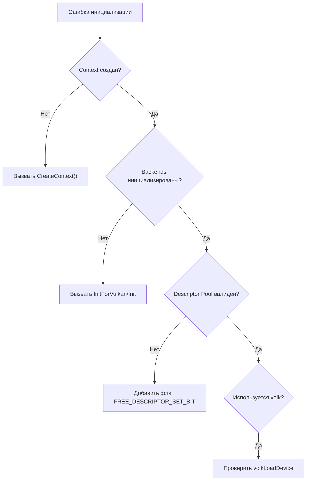
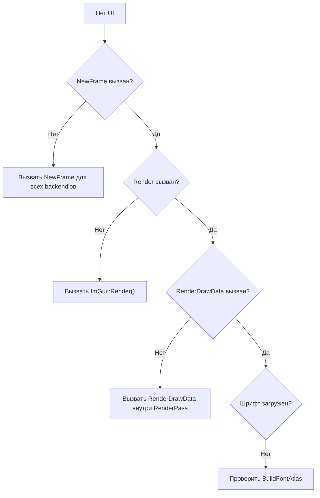

# Решение проблем Dear ImGui

**🟡 Уровень 2: Средний**

## Деревья решений

### Диагностика инициализации

### Диагностика отрисовки

## Частые проблемы

### Белые прямоугольники вместо текста

**Причина:** Не загружена текстура шрифта.
**Решение:**

1. Проверьте Descriptor Pool.
2. Убедитесь, что `ImGui_ImplVulkan_CreateFontsTexture` выполнился (обычно внутри Init).

### Виджеты не реагируют

**Причина:** Конфликт ID или перехват ввода.
**Решение:**

1. Используйте `PushID`/`PopID` в циклах.
2. Проверьте `io.WantCaptureMouse`.

### Ошибка линковки (Unresolved external)

**Причина:** Не скомпилированы файлы backend'ов.
**Решение:** Добавьте `imgui_impl_sdl3.cpp` и `imgui_impl_vulkan.cpp` в `add_library` в CMake.

---

## См. также

- [Интеграция](integration.md) — настройка.
- [Справочник API](api-reference.md) — функции.
