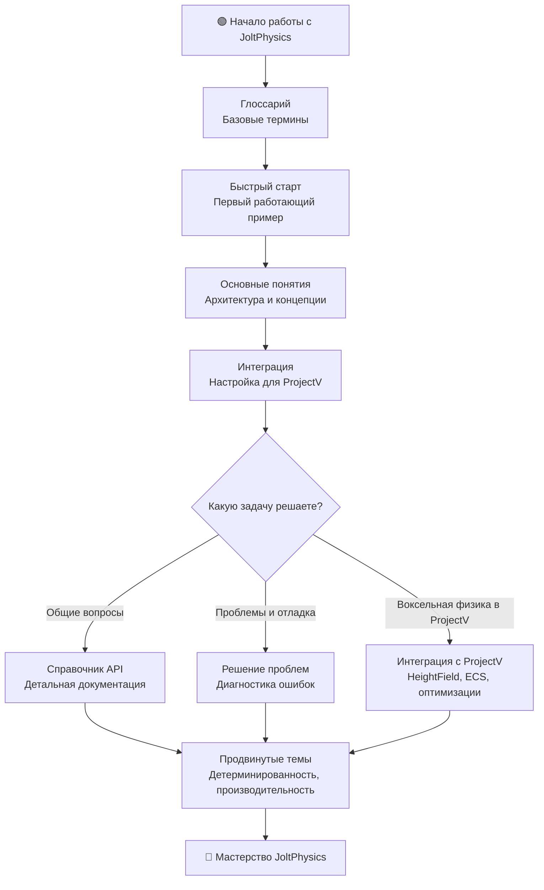

# JoltPhysics

**🟢 Уровень 1: Начинающий**

**JoltPhysics** — современный физический движок с поддержкой детерминированной симуляции, оптимизированный для
многопоточности и разработанный для высокой производительности в игровых проектах.

Исходники: [jrouwe/JoltPhysics](https://github.com/jrouwe/JoltPhysics) (версия 5.5.1 используется в ProjectV).

---

## Диаграмма обучения



---

## Содержание

### 🟢 Уровень 1: Начинающий

| Раздел                         | Описание                                                   | Уровень |
|--------------------------------|------------------------------------------------------------|---------|
| [Глоссарий](glossary.md)       | Базовые термины и концепции физической симуляции           | 🟢      |
| [Быстрый старт](quickstart.md) | Минимальный работающий пример с созданием физического мира | 🟢      |
| [Интеграция](integration.md)   | Настройка CMake и базовой интеграции в проект              | 🟢      |

### 🟡 Уровень 2: Средний

| Раздел                                           | Описание                                               | Уровень |
|--------------------------------------------------|--------------------------------------------------------|---------|
| [Основные понятия](concepts.md)                  | Архитектура JoltPhysics, фазы симуляции, слои коллизий | 🟡      |
| [Справочник API](api-reference.md)               | Полная документация классов, интерфейсов и настроек    | 🟡      |
| [Решение проблем](troubleshooting.md)            | Диагностика и решение распространённых проблем         | 🟡      |
| [Интеграция с ProjectV](projectv-integration.md) | Специализированная интеграция для воксельного движка   | 🟡      |

### 🔴 Уровень 3: Продвинутый

| Раздел                                                                       | Описание                                            | Уровень |
|------------------------------------------------------------------------------|-----------------------------------------------------|---------|
| [Детерминированная симуляция](concepts.md#детерминированная-симуляция)       | Бит-в-бит воспроизводимая физика для сетевых игр    | 🔴      |
| [Многопоточность и JobSystem](concepts.md#многопоточность-и-jobsystem)       | Оптимизация производительности через параллелизацию | 🔴      |
| [Производительность и настройка](concepts.md#производительность-и-настройка) | Тонкая настройка физической системы                 | 🔴      |

### 📁 Устаревшие файлы (контент перемещён)

| Раздел                                   | Новое расположение                                                                      |
|------------------------------------------|-----------------------------------------------------------------------------------------|
| [Интеграция с ECS](flecs-integration.md) | → [Интеграция с ProjectV](projectv-integration.md#интеграция-с-ecs-flecs)               |
| [Воксельная физика](voxel-physics.md)    | → [Интеграция с ProjectV](projectv-integration.md#воксельная-физика-и-heightfieldshape) |

---

## Рекомендуемый порядок чтения

### Для новых пользователей

1. **[Глоссарий](glossary.md)** — изучите базовые термины
2. **[Быстрый старт](quickstart.md)** — создайте первый работающий пример
3. **[Интеграция](integration.md)** — настройте JoltPhysics в своём проекте

### Для разработчиков ProjectV

1. **[Глоссарий](glossary.md)** — общие термины физики
2. **[Быстрый старт](quickstart.md)** — базовое понимание API
3. **[Интеграция с ProjectV](projectv-integration.md)** — специализированное руководство для воксельного движка

### Для решения конкретных задач

- **Проблемы с коллизиями** → [Решение проблем](troubleshooting.md#проблемы-с-коллизиями)
- **Воксельный ландшафт** → [Интеграция с ProjectV](projectv-integration.md#воксельная-физика-и-heightfieldshape)
- **Интеграция с ECS** → [Интеграция с ProjectV](projectv-integration.md#интеграция-с-ecs-flecs)
- **Производительность** → [Основные понятия](concepts.md#производительность-и-настройка)

---

## Быстрые ссылки по задачам

| Задача                           | Рекомендуемый раздел                                                                  | Уровень |
|----------------------------------|---------------------------------------------------------------------------------------|---------|
| Инициализация физической системы | [Быстрый старт](quickstart.md)                                                        | 🟢      |
| Создание тел и форм              | [Справочник API](api-reference.md#формы-shapes)                                       | 🟡      |
| Настройка слоёв коллизий         | [Основные понятия](concepts.md#слои-объектов-и-фильтры-коллизий)                      | 🟡      |
| Воксельная физика (HeightField)  | [Интеграция с ProjectV](projectv-integration.md#воксельная-физика-и-heightfieldshape) | 🟡      |
| Интеграция с ECS (flecs)         | [Интеграция с ProjectV](projectv-integration.md#интеграция-с-ecs-flecs)               | 🟡      |
| Детерминированная симуляция      | [Основные понятия](concepts.md#детерминированная-симуляция)                           | 🔴      |
| Оптимизация производительности   | [Основные понятия](concepts.md#производительность-и-настройка)                        | 🔴      |
| Диагностика проблем              | [Решение проблем](troubleshooting.md)                                                 | 🟡      |

---

## Требования

### Системные требования

- **C++17** или новее (рекомендуется C++20 для ProjectV)
- **Многопоточная поддержка** (JoltPhysics активно использует многопоточность)
- **Выравнивание памяти** 64 байта (JPH_CACHE_LINE_SIZE)

### Для ProjectV

- **JoltPhysics 5.5.1** — версия, используемая в подмодуле
- **Детерминированная симуляция** — рекомендуется для сетевых воксельных миров
- **Интеграция с Vulkan** — преобразование координат (Y-up в Jolt → Y-down в Vulkan)

### Рекомендуемые настройки CMake

```cmake
# Включение детерминированной симуляции (опционально)
option(JPH_CROSS_PLATFORM_DETERMINISTIC "Enable cross-platform deterministic simulation" ON)

# Включение отладочной информации
option(JPH_DEBUG_RENDERER "Enable debug renderer" OFF)
option(JPH_PROFILE_ENABLED "Enable profiling" OFF)

# Настройки производительности
set(JPH_NUM_BODY_MUTEXES 0)  # Автоматический выбор
set(JPH_MAX_BODY_PAIRS 1024) # Увеличить для сложных сцен
```

---

## Особенности использования в ProjectV

ProjectV использует JoltPhysics как основной физический движок для воксельного мира с следующими специализациями:

### Ключевые особенности

1. **HeightFieldShape для ландшафта** — эффективное представление воксельного террейна
2. **Специализированные слои** — разделение статических и динамических вокселей
3. **ECS-интеграция** — полная совместимость с фреймворком flecs
4. **Детерминированность** — критично для сетевой синхронизации воксельного мира
5. **Многопоточность** — параллельная обработка чанков через JobSystem

### Оптимизации для вокселей

- **Чанкирование физики** — независимая симуляция разных областей мира
- **LOD для HeightField** — адаптивная детализация для далёких чанков
- **Кэширование форм** — повторное использование одинаковых воксельных структур
- **Динамическое обновление** — возможность изменения HeightField во время выполнения

### Интеграция с другими компонентами ProjectV

- **Vulkan рендерер** — синхронизация трансформаций через storage buffers
- **flecs ECS** — компоненты для управления физикой сущностей
- **Tracy профилирование** — измерение производительности физических вычислений
- **VMA аллокатор** — совместимость с системой управления памятью Vulkan

---

## Начало работы

### Установка через CMake (ProjectV)

```cmake
# Подключение подмодуля
add_subdirectory(external/JoltPhysics)

# Линковка с вашим проектом
target_link_libraries(your_target PRIVATE JoltPhysics)

# Добавление include директорий
target_include_directories(your_target PRIVATE
    ${CMAKE_CURRENT_SOURCE_DIR}/external/JoltPhysics
)
```

### Минимальный пример инициализации

```cpp
#include <Jolt/Jolt.h>
#include <Jolt/RegisterTypes.h>
#include <Jolt/Physics/PhysicsSystem.h>

// Обязательный порядок инициализации
JPH::RegisterDefaultAllocator();                     // 1. Аллокатор
JPH::Factory::sInstance = new JPH::Factory();       // 2. Фабрика
JPH::RegisterTypes();                               // 3. Регистрация типов

// Создание физической системы
JPH::PhysicsSystem physics_system;
physics_system.Init(1024, 0, 1024, 1024);          // Параметры: max_bodies, num_mutexes, etc.
```

### Проверка работоспособности

```cpp
// Создание простого куба
JPH::BoxShapeSettings box_settings(JPH::Vec3(0.5f, 0.5f, 0.5f));
JPH::ShapeSettings::ShapeResult result = box_settings.Create();

if (result.IsValid()) {
    JPH::BodyCreationSettings body_settings(
        result.Get(),
        JPH::RVec3(0, 5, 0),          // Начальная позиция
        JPH::Quat::sIdentity(),       // Без вращения
        JPH::EMotionType::Dynamic,    // Динамическое тело
        0                             // Object layer
    );
    
    JPH::BodyID body_id = physics_system.GetBodyInterface().CreateBody(body_settings);
    physics_system.GetBodyInterface().AddBody(body_id, JPH::EActivation::Activate);
    
    std::cout << "Тело успешно создано! ID: " << body_id.GetIndex() << std::endl;
}
```

---

## Дополнительные ресурсы

### Официальная документация

- **[GitHub Repository](https://github.com/jrouwe/JoltPhysics)** — исходный код и issues
- **[HelloWorld Example](https://github.com/jrouwe/JoltPhysics/tree/master/HelloWorld)** — минимальный работающий пример
- **[API Documentation](https://github.com/jrouwe/JoltPhysics/blob/master/Docs/Architecture.md)** — архитектурная
  документация (84 страницы)

### Сообщество и поддержка

- **Discord каналы** игровой разработки
- **GitHub Issues** для багрепортов и вопросов
- **Примеры кода** в `external/JoltPhysics/HelloWorld/`

### Для ProjectV разработчиков

- **[Интеграция с ProjectV](projectv-integration.md)** — полное руководство по использованию в воксельном движке
- **[Примеры кода ProjectV](../examples/)** — готовые примеры интеграции
- **[Профилирование с Tracy](../tracy/)** — инструменты для измерения производительности

---

## Лицензия

JoltPhysics распространяется под лицензией MIT. Подробности в `external/JoltPhysics/LICENSE`.

---

**← [Вернуться к карте документации ProjectV](../map.md)**
