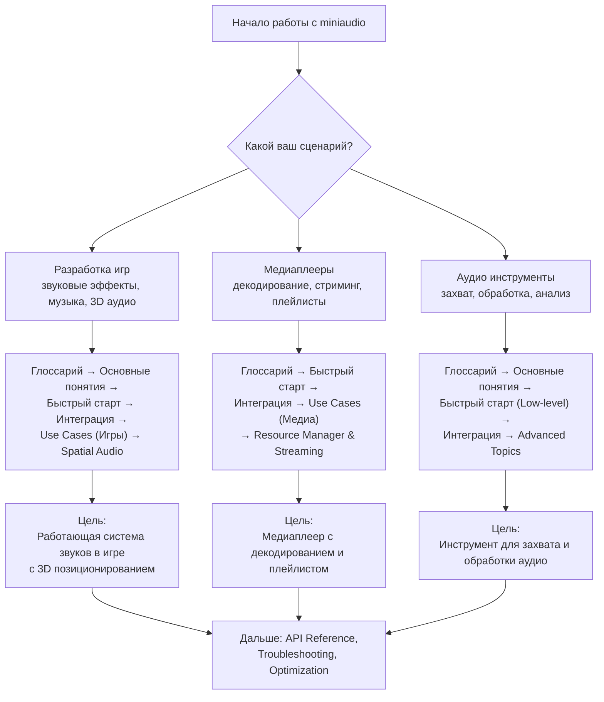
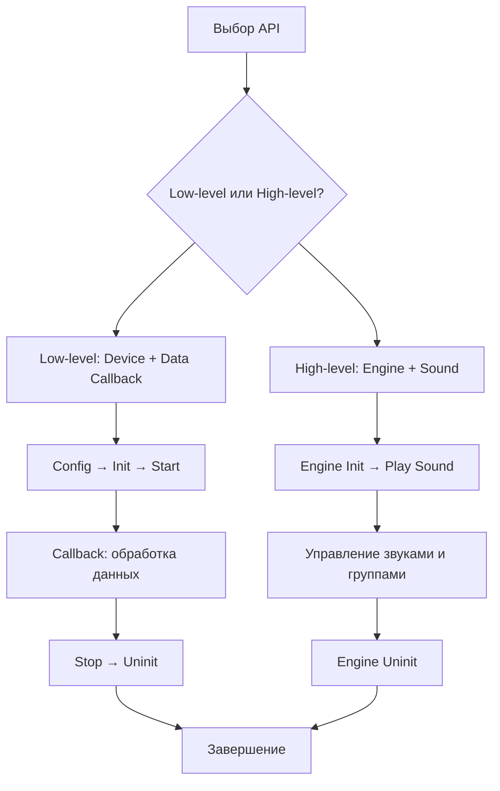

# miniaudio

**🟢 Уровень 1: Начинающий**

**miniaudio** — single-file библиотека на C для работы с аудио: воспроизведение, захват, декодирование, кодирование,
обработка. Не имеет зависимостей, кроме стандартной библиотеки. Поддерживает все основные платформы и бэкенды (WASAPI,
Core Audio, ALSA, PulseAudio, JACK, AAudio и др.).

Исходники: [miniaud.io](https://miniaud.io), [GitHub](https://github.com/mackron/miniaudio).

Версия: **0.11+** (используется в ProjectV). Лицензия: Public Domain или MIT No Attribution.

---

## 🗺️ Диаграмма обучения (Learning Path)

Выберите свой сценарий и следуйте по соответствующему пути:



---

## Содержание

### 🟢 Уровень 1: Начинающий

| Раздел                         | Описание                                                               | Уровень |
|--------------------------------|------------------------------------------------------------------------|---------|
| [Глоссарий](glossary.md)       | Терминология аудио и miniaudio: Device, Context, Engine, Sample, Frame | 🟢      |
| [Быстрый старт](quickstart.md) | Минимальные примеры: High-level API (Engine) и Low-level API (Device)  | 🟢      |
| [Интеграция](integration.md)   | CMake, сборка, настройки, линковка для разных платформ                 | 🟢      |

### 🟡 Уровень 2: Средний

| Раздел                                   | Описание                                                              | Уровень |
|------------------------------------------|-----------------------------------------------------------------------|---------|
| [Основные понятия](concepts.md)          | Low-level vs High-level API, callback, конфигурация, паттерны         | 🟡      |
| [Use Cases](use-cases.md)                | Типовые сценарии: игры, медиаплееры, DAW, рекордеры                   | 🟡      |
| [Decision Trees](decision-trees.md)      | Выбор API, форматов, настроек под конкретную задачу                   | 🟡      |
| [Справочник API](api-reference.md)       | Функции, структуры, константы с примерами использования               | 🟡      |
| [Интеграция с ECS](integration-flecs.md) | Управление звуками через системы компонентов (flecs, EnTT, Unity ECS) | 🟡      |
| [Spatial Audio](voxel-audio-patterns.md) | 3D позиционирование звуков, окклюзия, реверберация, доплер-эффект     | 🟡      |

### 🔴 Уровень 3: Продвинутый

| Раздел                                           | Описание                                                     | Уровень |
|--------------------------------------------------|--------------------------------------------------------------|---------|
| [Advanced Topics](advanced-topics.md)            | Node Graph, Spatial Audio, Custom Decoders, Resource Manager | 🔴      |
| [Решение проблем](troubleshooting.md)            | Диагностика и исправление ошибок для всех платформ           | 🔴      |
| [Интеграция в ProjectV](projectv-integration.md) | Специфичные паттерны для воксельного движка (опционально)    | 🟡      |

---

## Быстрые ссылки по задачам

| Задача                                    | Рекомендуемый раздел                                                                   | Уровень |
|-------------------------------------------|----------------------------------------------------------------------------------------|---------|
| Воспроизвести звук (простой)              | [Быстрый старт (High-level)](quickstart.md#шаг-2-high-level-api-engine)                | 🟢      |
| Воспроизвести звук (прямой контроль)      | [Быстрый старт (Low-level)](quickstart.md#шаг-3-low-level-api-device)                  | 🟢      |
| Настроить сборку с CMake                  | [Интеграция (CMake)](integration.md#1-cmake)                                           | 🟢      |
| Выбрать между Low-level и High-level API  | [Decision Trees (Выбор API)](decision-trees.md#выбор-между-low-level-и-high-level-api) | 🟡      |
| Реализовать 3D аудио (spatial)            | [Advanced Topics (Spatial Audio)](advanced-topics.md#spatial-audio)                    | 🔴      |
| Стримить большие аудиофайлы               | [Use Cases (Медиаплееры)](use-cases.md#медиаплееры-и-стриминг)                         | 🟡      |
| Захватывать аудио с микрофона             | [Use Cases (Захват аудио)](use-cases.md#захват-аудио-и-запись)                         | 🟡      |
| Создать аудиоэффекты                      | [Advanced Topics (Node Graph)](advanced-topics.md#node-graph-и-эффекты)                | 🔴      |
| Оптимизировать производительность         | [Основные понятия (Производительность)](concepts.md#производительность-оптимизации)    | 🟡      |
| Исправить ошибку инициализации            | [Решение проблем (Инициализация)](troubleshooting.md#инициализация)                    | 🟡      |
| Интегрировать в игровой движок (ProjectV) | [Интеграция в ProjectV](projectv-integration.md)                                       | 🟡      |

---

## Требования

- **C11** или **C++11** (или новее)
- **Стандартная библиотека C**
- **Платформенные зависимости** (линкуются автоматически):
  - Linux: `-lpthread -lm -ldl` (опционально `-latomic`)
  - Windows: нет зависимостей
  - macOS/iOS: `-framework CoreFoundation -framework CoreAudio -framework AudioToolbox`
  - Android: `-lOpenSLES` (если не используется runtime linking)

### Поддерживаемые платформы и бэкенды

| Платформа     | Основные бэкенды                                  | Дополнительные                 |
|---------------|---------------------------------------------------|--------------------------------|
| Windows       | WASAPI, DirectSound, WinMM                        |                                |
| macOS/iOS     | Core Audio                                        |                                |
| Linux         | ALSA, PulseAudio, JACK                            | sndio (OpenBSD), OSS (FreeBSD) |
| Android       | AAudio, OpenSL\|ES                                |                                |
| BSD           | sndio (OpenBSD), audio(4) (NetBSD), OSS (FreeBSD) |                                |
| Emscripten    | Web Audio                                         |                                |
| Универсальный | Null (тишина), Custom (своя реализация)           |                                |

---

## Особенности и возможности

### Основные возможности

- **Single-file**: `miniaudio.h` + `miniaudio.c` (или `#define MINIAUDIO_IMPLEMENTATION`)
- **Нет зависимостей**: только стандартная библиотека C
- **Поддержка множества форматов**: WAV, FLAC, MP3 (встроенные декодеры)
- **Два уровня API**: Low-level (полный контроль) и High-level (простота)
- **Ресурсный менеджер**: асинхронная загрузка, кэширование, стриминг
- **Node Graph**: продвинутое микширование и эффекты
- **Spatial Audio**: 3D позиционирование звуков
- **Кроссплатформенность**: Windows, macOS, Linux, iOS, Android, BSD, Emscripten

### Производительность и оптимизации

- **Low-latency** по умолчанию
- **Zero-allocation** в audio thread (если настроено)
- **SIMD оптимизации** (если доступно)
- **Режимы работы**: shared (несколько приложений) и exclusive (минимальная latency)

### Архитектурные принципы

- **Transparent structures**: все объекты — обычные C структуры
- **Config/init pattern**: единый паттерн инициализации
- **Thread-safe callback**: данные обрабатываются в отдельном потоке
- **No global state**: полный контроль над состоянием

---

## Начало работы за 5 минут

### 1. Добавление в проект

```c
// В одном файле (.c или .cpp):
#define MINIAUDIO_IMPLEMENTATION
#include "miniaudio.h"

// Или через CMake:
// add_subdirectory(external/miniaudio)
// target_link_libraries(YourApp PRIVATE miniaudio)
```

### 2. Минимальный пример (High-level API)

```c
#include "miniaudio.h"

int main() {
    ma_engine engine;
    ma_engine_init(NULL, &engine);                // 1. Инициализация
    ma_engine_play_sound(&engine, "sound.wav", NULL); // 2. Воспроизведение
    getchar();                                    // 3. Ожидание
    ma_engine_uninit(&engine);                    // 4. Очистка
    return 0;
}
```

### 3. Минимальный пример (Low-level API)

```c
#include "miniaudio.h"

void data_callback(ma_device* pDevice, void* pOutput, const void* pInput, ma_uint32 frameCount) {
    // Заполнить pOutput данными (например, из декодера)
}

int main() {
    ma_device_config config = ma_device_config_init(ma_device_type_playback);
    config.dataCallback = data_callback;

    ma_device device;
    ma_device_init(NULL, &config, &device);
    ma_device_start(&device);

    getchar(); // Ожидание
    ma_device_uninit(&device);
    return 0;
}
```

---

## Жизненный цикл использования



---

## Примеры кода в ProjectV

ProjectV содержит несколько примеров интеграции miniaudio:

| Пример                  | Описание                     | Ссылка                                                         |
|-------------------------|------------------------------|----------------------------------------------------------------|
| Базовое воспроизведение | High-level API с ma_engine   | [miniaudio_playback.cpp](../examples/miniaudio_playback.cpp)   |
| Low-level управление    | Device + data callback       | [miniaudio_lowlevel.cpp](../examples/miniaudio_lowlevel.cpp)   |
| Интеграция с SDL        | Совместная работа с SDL3     | [miniaudio_sdl.cpp](../examples/miniaudio_sdl.cpp)             |
| Стриминг больших файлов | Resource Manager + streaming | [miniaudio_streaming.cpp](../examples/miniaudio_streaming.cpp) |

---

## Следующие шаги

### Для новых пользователей

1. **[Глоссарий](glossary.md)** — изучите базовую терминологию
2. **[Быстрый старт](quickstart.md)** — запустите первый пример
3. **[Интеграция](integration.md)** — настройте сборку в своём проекте

### Для выбора подходящего API

1. **[Decision Trees](decision-trees.md)** — определитесь между Low-level и High-level
2. **[Use Cases](use-cases.md)** — посмотрите примеры для вашего сценария

### Для решения проблем

1. **[Решение проблем](troubleshooting.md)** — диагностируйте и исправляйте ошибки
2. **[Справочник API](api-reference.md)** — найдите нужную функцию

### Для углублённого изучения

1. **[Advanced Topics](advanced-topics.md)** — изучите продвинутые возможности
2. **[Интеграция в ProjectV](projectv-integration.md)** — специализированные паттерны для воксельного движка

---

## Дополнительные ресурсы

### Официальная документация

- **[miniaud.io/docs](https://miniaud.io/docs)** — онлайн документация
- **[miniaudio.h](https://raw.githubusercontent.com/mackron/miniaudio/master/miniaudio.h)** — полная документация в коде
- **[Примеры в репозитории](https://github.com/mackron/miniaudio/tree/master/examples)** — официальные примеры

### Сообщество и поддержка

- **[GitHub Issues](https://github.com/mackron/miniaudio/issues)** — багрепорты и вопросы
- **[Discord](https://discord.gg/9vpqbjU)** — канал для обсуждения
- **[Twitter @mackron](https://x.com/mackron)** — автор библиотеки

### Для ProjectV разработчиков

- **[Интеграция в ProjectV](projectv-integration.md)** — полное руководство по использованию в воксельном движке
- **[Примеры кода ProjectV](../examples/)** — готовые примеры интеграции
- **[Документация ProjectV](../README.md)** — общая документация проекта

---

## Лицензия

miniaudio распространяется под лицензией **Public Domain** или **MIT No Attribution**. Подробности в
`external/miniaudio/LICENSE`.

**Вы можете использовать библиотеку в коммерческих и некоммерческих проектах без ограничений.**

---

**← [Вернуться к карте документации ProjectV](../map.md)**
