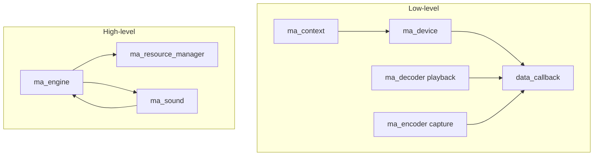

# Основные понятия

**🟡 Уровень 2: Средний**

Краткое введение в miniaudio. Термины — в [глоссарии](glossary.md).

## На этой странице

- [Low-level vs High-level API](#low-level-vs-high-level-api)
- [Config/init pattern](#configinit-pattern)
- [Transparent structures](#transparent-structures)
- [Data callback](#data-callback)
- [Period и Latency](#period-и-latency)
- [Sample rate](#sample-rate)
- [Контекст и перечисление устройств](#контекст-и-перечисление-устройств)
- [Full-duplex](#full-duplex)
- [notificationCallback](#notificationcallback)
- [Ограничения в callback](#ограничения-в-callback)
- [Node graph и engine](#node-graph-и-engine)
- [Общая схема](#общая-схема)

---

## Low-level vs High-level API

miniaudio предоставляет два уровня API:

| Уровень        | Когда использовать                                                                    | Основные объекты                          |
|----------------|---------------------------------------------------------------------------------------|-------------------------------------------|
| **Low-level**  | Прямой контроль над аудиоданными, свой микс, кастомная обработка.                     | `ma_context`, `ma_device`, data callback  |
| **High-level** | Простое воспроизведение звуков, управление группами (SFX, музыка), встроенный микшер. | `ma_engine`, `ma_sound`, `ma_sound_group` |

**Low-level:** вы реализуете `data_callback`, куда miniaudio передаёт буфер. В playback вы записываете PCM frames в
`pOutput`. В capture читаете из `pInput`. Декодирование (если нужно) делаете сами через `ma_decoder` или другой data
source.

**High-level:** `ma_engine` включает устройство, resource manager и node graph. Вы вызываете
`ma_engine_play_sound(&engine, "sound.wav", NULL)` или инициализируете `ma_sound` для контроля над экземпляром.
Декодирование и микширование выполняет miniaudio.

---

## Config/init pattern

Во всей библиотеке используется один паттерн:

1. Создать config: `ma_xxx_config config = ma_xxx_config_init(...);`
2. Настроить нужные поля config
3. Вызвать init: `ma_xxx_init(&config, &object);`

Config можно выделить на стеке и не хранить после init. Новые поля в config добавляются без поломки API.

```c
ma_device_config config = ma_device_config_init(ma_device_type_playback);
config.playback.format   = ma_format_f32;
config.playback.channels = 2;
config.sampleRate        = 48000;
config.dataCallback      = data_callback;
config.pUserData         = pMyData;

ma_device device;
ma_device_init(NULL, &config, &device);
```

---

## Transparent structures

В miniaudio нет opaque handle. Все объекты — обычные C-структуры. Память выделяете вы:

```c
ma_device device;           // на стеке
// или
ma_engine* pEngine = malloc(sizeof(ma_engine));
```

**Важно:** адрес объекта не должен меняться в течение его жизненного цикла. miniaudio хранит указатель на объект; при
копировании или перемещении структуры указатель станет невалидным. Не копируйте `ma_device`, `ma_engine`, `ma_sound` и
т.д.

---

## Data callback

Callback вызывается асинхронно в отдельном потоке (audio thread). miniaudio запрашивает определённое число frames; вы
должны заполнить (playback) или прочитать (capture) не более `frameCount` frames.

```c
void data_callback(ma_device* pDevice, void* pOutput, const void* pInput, ma_uint32 frameCount)
{
    // Playback: записать в pOutput, pInput = NULL
    // Capture: прочитать из pInput, pOutput = NULL
    // Duplex: оба валидны
}
```

Поведение по типу устройства:

| Device Type               | pOutput    | pInput                 |
|---------------------------|------------|------------------------|
| `ma_device_type_playback` | Записывать | NULL                   |
| `ma_device_type_capture`  | NULL       | Читать                 |
| `ma_device_type_duplex`   | Записывать | Читать                 |
| `ma_device_type_loopback` | NULL       | Читать (только WASAPI) |

Данные — interleaved: для стерео первые два сэмпла — left, right первого frame, следующие два — left, right второго
frame и т.д.

---

## Period и Latency

Размер буфера устройства задаётся через `periodSizeInFrames` или `periodSizeInMilliseconds` и `periods` в
`ma_device_config`. Частота вызова callback зависит от этих значений.

- **Меньший period** — меньше latency (важно для игр, real-time), выше нагрузка на CPU, выше риск глитчей.
- **Больший period** — выше latency, меньше нагрузка (подходит для медиаплееров).

По умолчанию miniaudio использует `ma_performance_profile_low_latency`. Запрашиваемый размер — лишь подсказка; бэкенд
может вернуть другой.

---

## Sample rate

В config задайте `sampleRate` (Hz). **0** — использовать native устройства. Типичные значения: **44100**, **48000**.
Рекомендованный диапазон: **8000–384000** Hz. В full-duplex sample rate одинаков для playback и capture.

---

## Контекст и перечисление устройств

Для выбора конкретного устройства (не default) нужен `ma_context`:

```mermaid
flowchart LR
    ContextInit[ma_context_init] --> GetDevices[ma_context_get_devices]
    GetDevices --> DeviceConfig[config.playback.pDeviceID = &infos[i].id]
    DeviceConfig --> DeviceInit["ma_device_init с context"]
```

```c
ma_context context;
ma_context_init(NULL, 0, NULL, &context);

ma_device_info* pPlaybackInfos;
ma_uint32 playbackCount;
ma_device_info* pCaptureInfos;
ma_uint32 captureCount;
ma_context_get_devices(&context, &pPlaybackInfos, &playbackCount, &pCaptureInfos, &captureCount);

ma_device_config config = ma_device_config_init(ma_device_type_playback);
config.playback.pDeviceID = &pPlaybackInfos[chosenIndex].id;
// ... остальные поля ...

ma_device device;
ma_device_init(&context, &config, &device);
```

Буферы, возвращаемые `ma_context_get_devices`, принадлежат miniaudio — не освобождать.

Если передать `NULL` в `ma_device_init` вместо context, miniaudio создаст контекст внутри себя. Для выбора устройства
нужно передавать явный context.

Альтернатива `ma_context_get_devices` — `ma_context_enumerate_devices` (callback без heap-аллокации).

---

## Full-duplex

В `ma_device_type_duplex` форматы playback и capture задаются отдельно (`config.playback.*` и `config.capture.*`).
Можно, например, захватывать моно и выводить стерео. **Разные форматы** playback и capture требуют ручной конвертации в
callback — miniaudio не выполняет её автоматически между двумя направлениями в duplex.

---

## notificationCallback

Опциональный callback в `ma_device_config.notificationCallback` вызывается при изменении состояния устройства: старт,
остановка, reroute (смена устройства). Полезен для синхронизации UI или логики с аудиопотоком.

---

## Ограничения в callback

Внутри `data_callback` **нельзя** вызывать:

- `ma_device_init` / `ma_device_init_ex`
- `ma_device_uninit`
- `ma_device_start`
- `ma_device_stop`

Это приведёт к deadlock. Вместо этого устанавливайте флаг или сигнализируйте событие, а остановку/старт выполняйте в
другом потоке.

Также избегайте тяжёлых операций в callback (malloc, file I/O, блокирующие вызовы) — callback выполняется в real-time
потоке.

---

## Node graph и engine

High-level API построен на node graph. Узлы (nodes) соединяются входами и выходами; данные проходят по графу.
`ma_engine` — это `ma_node_graph` с endpoint, к которому подключены звуки и группы. Для продвинутой настройки графа
используйте `ma_engine_get_node_graph()` и API `ma_node_graph`.

- **ma_sound** и **ma_sound_group** — узлы графа
- Группы позволяют разделять громкость и эффекты (SFX, музыка, голос)
- Можно подключать кастомные effect nodes

Для простого воспроизведения достаточно `ma_engine_play_sound` или `ma_sound_init_from_file` + `ma_sound_start`. Node
graph используется при необходимости продвинутого микширования.
Примеры: [node_graph.c](../../external/miniaudio/examples/node_graph.c), [engine_effects.c](../../external/miniaudio/examples/engine_effects.c).

---

## Общая схема



---

---

## Дальше

**Следующий раздел:** [Быстрый старт](quickstart.md) — воспроизвести звук (High-level и Low-level).

**См. также:**

- [Глоссарий](glossary.md) — термины
- [Интеграция](integration.md) — CMake, сборка
- [Производительность](performance.md) — оптимизация и настройки
- [Use Cases](use-cases.md) — практические сценарии использования
- [Decision Trees](decision-trees.md) — руководство по выбору API и параметров
