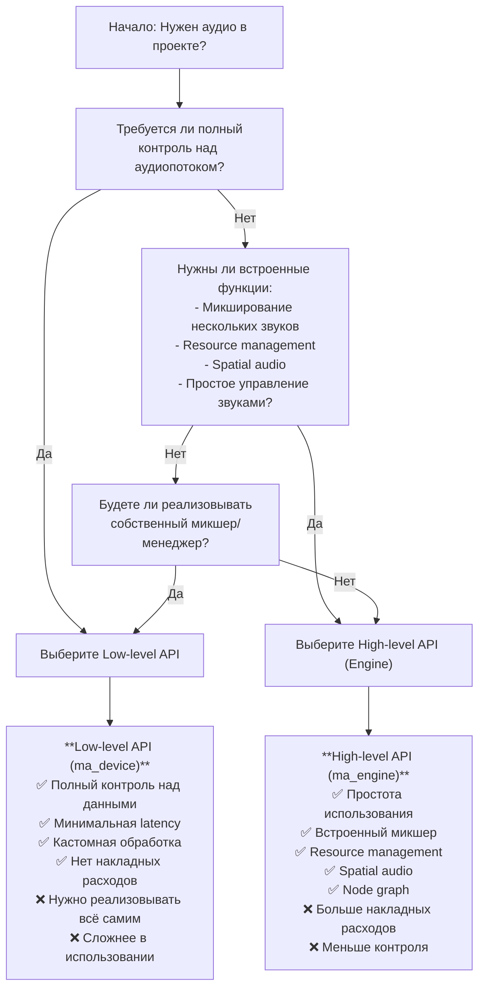
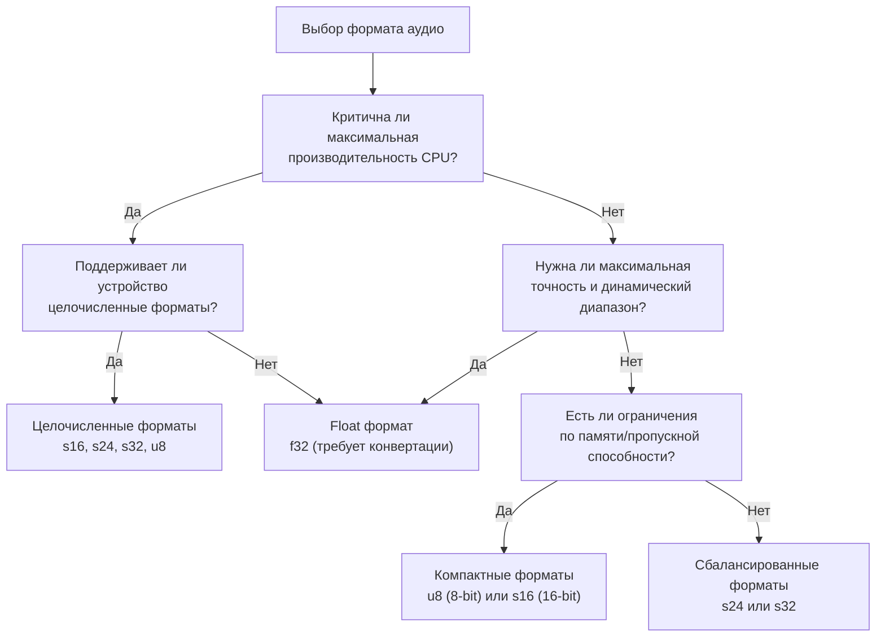
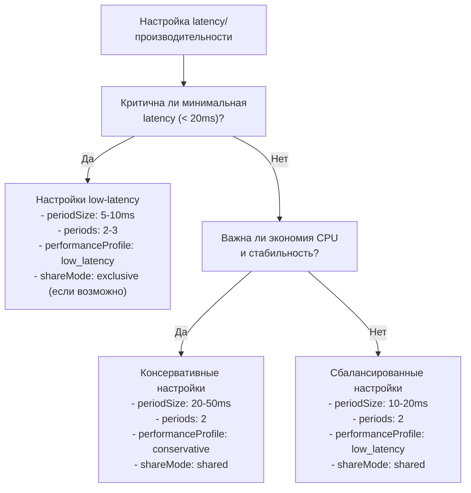
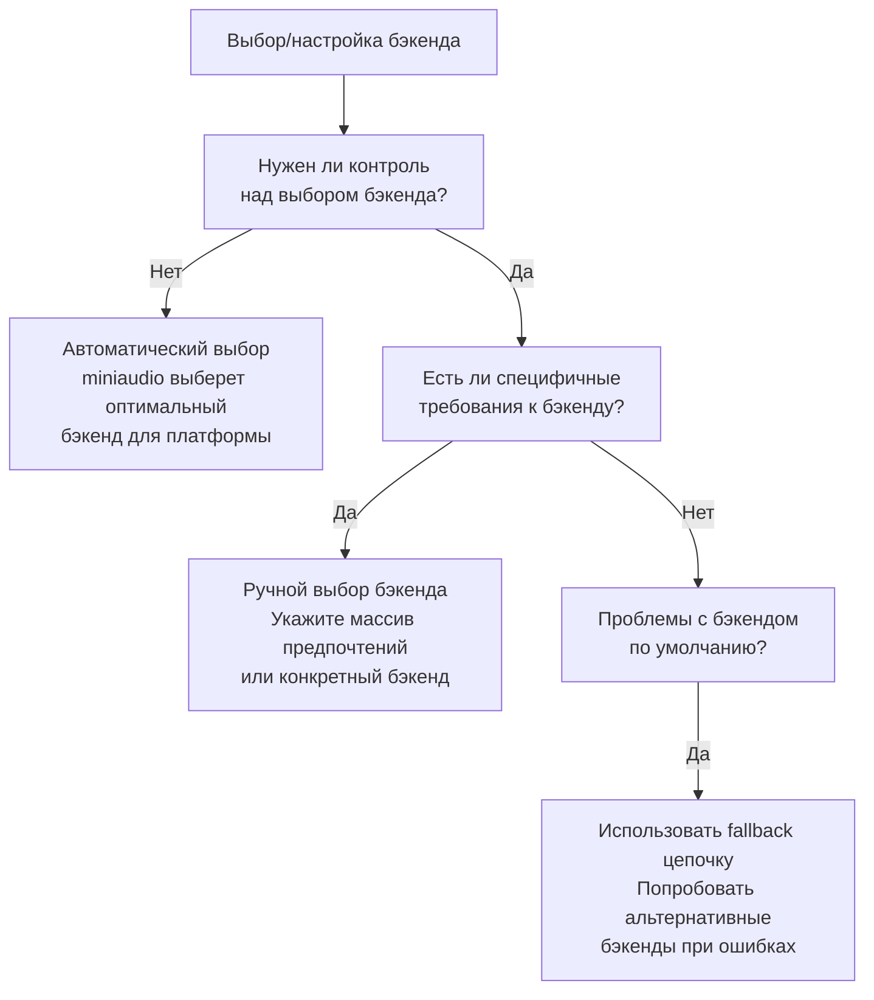
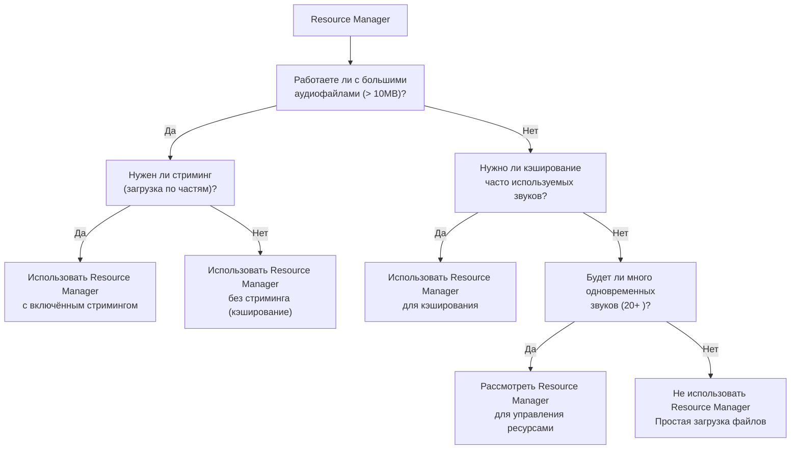
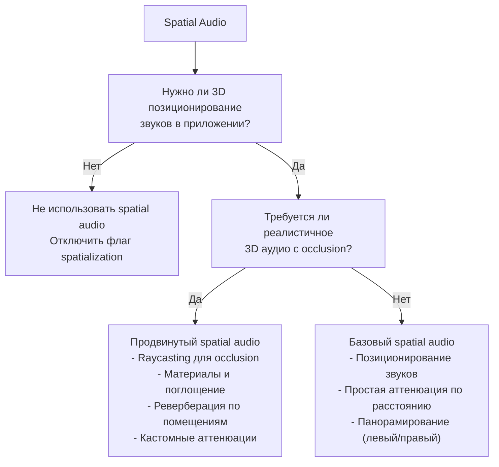
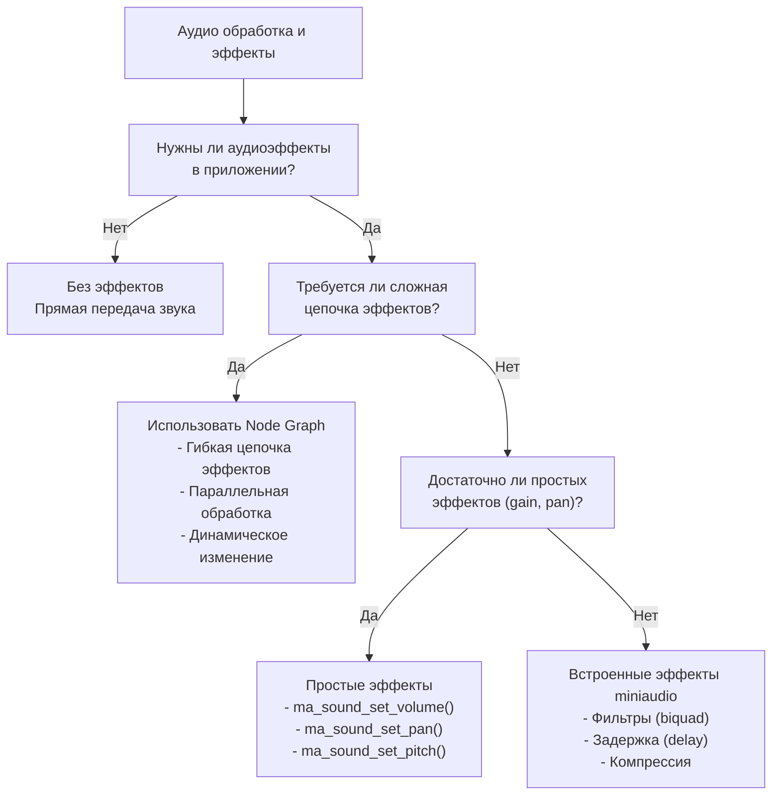

# Decision Trees для miniaudio

**🟡 Уровень 2: Средний**

Этот документ помогает выбрать правильный API, формат, настройки и архитектурные решения при работе с miniaudio.
Используйте decision trees для быстрого определения оптимального пути реализации вашей задачи.

## Содержание

1. [Выбор между Low-level и High-level API](#1-выбор-между-low-level-и-high-level-api)
2. [Выбор формата данных](#2-выбор-формата-данных)
3. [Настройка производительности и latency](#3-настройка-производительности-и-latency)
4. [Выбор бэкенда (платформы)](#4-выбор-бэкенда-платформы)
5. [Управление ресурсами (Resource Manager)](#5-управление-ресурсами-resource-manager)
6. [Работа с пространственным аудио (Spatial Audio)](#6-работа-с-пространственным-аудио-spatial-audio)
7. [Обработка и эффекты](#7-обработка-и-эффекты)

---

## 1. Выбор между Low-level и High-level API

Используйте эту диаграмму для выбора подходящего уровня API:



### Когда использовать Low-level API:

- **Реализация собственного микшера** для специфичных нужд
- **Кастомная обработка аудио** в реальном времени (DSP)
- **Минимально возможная latency** (например, для DAW, VST плагинов)
- **Интеграция с существующими аудиосистемами**
- **Обучение и понимание работы аудио на низком уровне**
- **Эксперименты с нестандартными форматами данных**

**Примеры задач для Low-level API:**

- Цифровая аудио рабочая станция (DAW)
- VST/AU плагины
- Аудио анализаторы и измерительные инструменты
- Специализированные игровые движки с собственной аудиосистемой
- Реалтайм аудио обработка (шумоподавление, эффекты)

### Когда использовать High-level API:

- **Быстрое прототипирование** игр или приложений
- **Игры** (большинство случаев)
- **Медиаплееры** и простые аудиоприложения
- **Инструменты с UI**, где аудио — вторичная функция
- **Когда не нужно полного контроля** над аудиопотоком
- **Использование встроенных функций** (spatial audio, resource manager)

**Примеры задач для High-level API:**

- Игры на любом движке
- Медиаплееры и проигрыватели
- Обучающие приложения
- Инструменты для художников/дизайнеров
- Приложения с простыми звуковыми уведомлениями

### Гибридный подход

Можно комбинировать оба подхода:

- **High-level API** для музыки, UI звуков, ambient звуков
- **Low-level API** для критичных по latency звуков (геймплейные звуки, голосовой чат)

```c
// Пример гибридного подхода
ma_engine engine; // Для фоновой музыки и UI
ma_device low_level_device; // Для геймплейных звуков с минимальной latency

// Инициализация обоих
ma_engine_init(NULL, &engine);

ma_device_config device_config = ma_device_config_init(ma_device_type_playback);
device_config.dataCallback = gameplay_audio_callback;
ma_device_init(NULL, &device_config, &low_level_device);
```

---

## 2. Выбор формата данных

Выбор формата влияет на качество звука, производительность и совместимость.



### Сравнение форматов

| Формат            | Размер на сэмпл          | Динамический диапазон | CPU нагрузка | Рекомендуемое использование                             |
|-------------------|--------------------------|-----------------------|--------------|---------------------------------------------------------|
| **ma_format_u8**  | 1 байт                   | 48 dB                 | Очень низкая | Старые системы, ограниченная память, простые звуки      |
| **ma_format_s16** | 2 байта                  | 96 dB                 | Низкая       | Стандарт для игр, медиаплееров, общего назначения       |
| **ma_format_s24** | 3 байта (tightly packed) | 144 dB                | Средняя      | Профессиональное аудио, где важен динамический диапазон |
| **ma_format_s32** | 4 байта                  | 192 dB                | Средняя      | Обработка аудио, промежуточные вычисления               |
| **ma_format_f32** | 4 байта                  | ~1500 dB (float)      | Высокая      | Аудио обработка, эффекты, профессиональные приложения   |

### Практические рекомендации

#### Для игр:

- **s16** — оптимальный баланс качества и производительности
- **f32** — если используется много эффектов/обработки
- **u8** — только для очень простых звуков (пиксельные игры)

#### Для медиаплееров:

- **s16** или **s24** — в зависимости от источника
- Поддерживайте автоматическое определение формата файла

#### Для аудио обработки:

- **f32** — для внутренних вычислений
- **s24** или **s32** — для ввода/вывода

#### Для embedded систем:

- **u8** или **s16** — для экономии памяти и CPU
- Тестируйте с конкретным устройством

### Автоматический выбор формата

```c
// Использовать формат устройства по умолчанию
ma_device_config config = ma_device_config_init(ma_device_type_playback);
config.playback.format = ma_format_unknown; // Устройство выберет оптимальный
config.sampleRate = 0; // Native sample rate

// Или определить по поддерживаемым форматам
ma_device_info* playback_infos;
ma_uint32 playback_count;
ma_context_get_devices(&context, &playback_infos, &playback_count, NULL, NULL);

// Проверить поддерживаемые форматы (примерная логика)
bool supports_f32 = check_format_support(playback_infos[0].id, ma_format_f32);
config.playback.format = supports_f32 ? ma_format_f32 : ma_format_s16;
```

---

## 3. Настройка производительности и latency

Баланс между latency и нагрузкой на CPU.



### Параметры влияющие на latency

#### periodSizeInFrames / periodSizeInMilliseconds

- **Меньше значение** → меньше latency, но выше нагрузка на CPU
- **Больше значение** → больше latency, но стабильнее работа

#### periods (количество периодов в буфере)

- **2 периода** — стандарт, хороший баланс
- **3 периода** — уменьшает риск underrun, но увеличивает latency
- **1 период** — минимальная latency, но риск underrun

#### performanceProfile

- **ma_performance_profile_low_latency** — оптимизация для минимальной latency
- **ma_performance_profile_conservative** — оптимизация для стабильности и экономии CPU

#### shareMode

- **ma_share_mode_shared** — несколько приложений могут использовать устройство
- **ma_share_mode_exclusive** — эксклюзивный доступ, может уменьшить latency

### Рекомендации по настройкам

#### Для игр (реактивные звуки):

```c
ma_device_config config = ma_device_config_init(ma_device_type_playback);
config.performanceProfile = ma_performance_profile_low_latency;
config.periodSizeInMilliseconds = 10; // 10ms latency
config.periods = 2;
// Пытаемся получить exclusive доступ, но fallback на shared
config.playback.shareMode = ma_share_mode_exclusive;
```

#### Для медиаплееров (стабильность):

```c
ma_device_config config = ma_device_config_init(ma_device_type_playback);
config.performanceProfile = ma_performance_profile_conservative;
config.periodSizeInMilliseconds = 30; // 30ms latency
config.periods = 2;
config.playback.shareMode = ma_share_mode_shared; // Делимся с другими приложениями
```

#### Для профессионального аудио (DAW, VST):

```c
ma_device_config config = ma_device_config_init(ma_device_type_playback);
config.performanceProfile = ma_performance_profile_low_latency;
config.periodSizeInMilliseconds = 5; // Минимальная latency
config.periods = 3; // Запас для предотвращения underrun
config.playback.shareMode = ma_share_mode_exclusive; // Эксклюзивный доступ
config.noClip = true; // Не клипповать, обрабатываем сами
config.noPreSilencedOutputBuffer = true; // Экономия CPU
```

### Измерение реальной latency

```c
// После инициализации устройства можно получить реальные значения
ma_device* device = ...;
ma_uint32 actualPeriodSizeInFrames = device->playback.internalPeriodSizeInFrames;
ma_uint32 actualPeriods = device->playback.internalPeriods;
double actualLatencyMs = (actualPeriodSizeInFrames * actualPeriods * 1000.0) / device->sampleRate;

printf("Реальная latency: %.2f ms (period: %u frames, periods: %u)\n",
       actualLatencyMs, actualPeriodSizeInFrames, actualPeriods);
```

---

## 4. Выбор бэкенда (платформы)

miniaudio автоматически выбирает оптимальный бэкенд, но можно управлять этим вручную.



### Приоритеты бэкендов по умолчанию

| Платформа      | Порядок бэкендов (приоритет)                        |
|----------------|-----------------------------------------------------|
| **Windows**    | WASAPI → DirectSound → WinMM                        |
| **macOS/iOS**  | Core Audio                                          |
| **Linux**      | ALSA → PulseAudio → JACK                            |
| **Android**    | AAudio → OpenSL\|ES                                 |
| **BSD**        | sndio (OpenBSD) → audio(4) (NetBSD) → OSS (FreeBSD) |
| **Emscripten** | Web Audio                                           |

### Когда указывать бэкенды вручную:

1. **Проблемы со стандартным бэкендом** (глитчи, ошибки)
2. **Требования к конкретным функциям** (exclusive mode, loopback)
3. **Отладка и тестирование**
4. **Использование экспериментальных или кастомных бэкендов**

### Пример ручного выбора бэкендов

```c
// Явное указание предпочтительных бэкендов
const ma_backend backends[] = {
    ma_backend_wasapi,     // Попробовать сначала WASAPI
    ma_backend_dsound,     // Затем DirectSound
    ma_backend_winmm,      // Затем WinMM
    ma_backend_null        // И finally null backend для fallback
};

ma_context_config context_config = ma_context_config_init();
context_config.backendCount = sizeof(backends) / sizeof(backends[0]);
context_config.backends = backends;

ma_context context;
ma_result result = ma_context_init(backends, 4, &context_config, &context);
if (result != MA_SUCCESS) {
    // Обработка ошибки
}
```

### Особенности бэкендов

#### WASAPI (Windows)

- **Плюсы**: Низкая latency, exclusive mode, loopback capture
- **Минусы**: Только Windows Vista+, может конфликтовать с другими приложениями

#### Core Audio (macOS/iOS)

- **Плюсы**: Нативная интеграция, хорошая стабильность
- **Минусы**: Только Apple экосистема

#### ALSA (Linux)

- **Плюсы**: Низкоуровневый, минимальная latency
- **Минусы**: Может требовать прав, сложная конфигурация

#### PulseAudio (Linux)

- **Плюсы**: Простота использования, перенаправление звука
- **Минусы**: Дополнительная latency, слой поверх ALSA

#### AAudio (Android 8.0+)

- **Плюсы**: Низкая latency, оптимизирован для мобильных
- **Минусы**: Только новые версии Android

---

## 5. Управление ресурсами (Resource Manager)

Decision tree для использования Resource Manager.



### Когда использовать Resource Manager:

1. **Стриминг больших файлов** (музыка, длинные диалоги)
2. **Кэширование часто используемых звуков** (звуки выстрелов, шагов)
3. **Асинхронная загрузка** без блокировки основного потока
4. **Управление памятью** при множестве звуков
5. **Предзагрузка ресурсов** (loading screen)

### Когда НЕ использовать Resource Manager:

1. **Очень простые приложения** с 1-2 звуками
2. **Прототипирование** и быстрые эксперименты
3. **Low-level подход** с полным контролем над памятью
4. **Специфичные требования к загрузке** (custom I/O)

### Настройка Resource Manager

```c
// Базовая настройка для игр
ma_resource_manager_config rm_config = ma_resource_manager_config_init();
rm_config.decodedFormat = ma_format_s16;     // Формат для декодирования
rm_config.decodedChannels = 2;               // Стерео
rm_config.decodedSampleRate = 48000;         // Стандартная частота
rm_config.encodingFormat = ma_encoding_format_wav; // Формат по умолчанию

// Настройки для стриминга
rm_config.jobThreadCount = 2;                // Потоки для фоновой загрузки
rm_config.flags = MA_RESOURCE_MANAGER_FLAG_NON_BLOCKING; // Не блокировать основной поток

ma_resource_manager resource_manager;
ma_resource_manager_init(&rm_config, &resource_manager);

// Использование в engine
ma_engine_config engine_config = ma_engine_config_init();
engine_config.pResourceManager = &resource_manager;

ma_engine engine;
ma_engine_init(&engine_config, &engine);
```

---

## 6. Работа с пространственным аудио (Spatial Audio)



### Уровни spatial audio

#### Уровень 1: Базовое позиционирование

```c
// Просто установить позицию звука
ma_sound_set_position(&sound, x, y, z);

// И установить позицию слушателя
ma_engine_listener_set_position(&engine, 0, listener_x, listener_y, listener_z);
```

#### Уровень 2: Аттенюация и направление

```c
// Настроить параметры аттенюации
ma_sound_set_rolloff(&sound, rolloff_factor); // Скорость затухания
ma_sound_set_min_distance(&sound, min_distance); // Минимальная дистанция
ma_sound_set_max_distance(&sound, max_distance); // Максимальная дистанция

// Настроить направление слушателя
ma_engine_listener_set_direction(&engine, 0, forward_x, forward_y, forward_z);
```

#### Уровень 3: Продвинутые эффекты

```c
// Cone attenuation (звук направленный)
ma_sound_set_cone(&sound, inner_angle, outer_angle, outer_gain);

// Доплер эффект
ma_sound_set_doppler_factor(&sound, doppler_factor);

// Кастомная аттенюация через callback
ma_sound_set_attenuation_model(&sound, ma_attenuation_model_custom);
// + реализация кастомной функции аттенюации
```

### Рекомендации по spatial audio

#### Для игр от первого лица:

- Используйте полный 3D spatial audio
- Реализуйте occlusion через raycasting
- Добавьте реверберацию для разных помещений
- Используйте HRTF для реализма (если поддерживается)

#### Для стратегий/симуляторов:

- 2.5D spatial audio (x, y позиционирование)
- Простая аттенюация по расстоянию
- Панорамирование для левого/правого канала

#### Для медиаплееров:

- Обычно не нужно spatial audio
- Возможно панорамирование (balance control)

---

## 7. Обработка и эффекты



### Уровни обработки аудио

#### Уровень 1: Простые параметры звука

```c
// Базовые параметры доступные через ma_sound
ma_sound_set_volume(&sound, volume);      // Громкость (0.0 - 1.0)
ma_sound_set_pan(&sound, pan);           // Панорамирование (-1.0 - 1.0)
ma_sound_set_pitch(&sound, pitch);       // Высота тона (0.5 - 2.0)
ma_sound_set_looping(&sound, looping);   // Зацикливание
```

#### Уровень 2: Встроенные эффекты miniaudio

```c
// Использование встроенных эффектов
ma_biquad_filter_config filter_config = ma_biquad_filter_config_init(
    ma_format_f32, 2, 48000,
    ma_biquad_filter_type_lowpass, 1000.0f, 0.707f);
ma_biquad_filter filter;
ma_biquad_filter_init(&filter_config, NULL, &filter);

// Применение к звуку или в data callback
ma_biquad_process_pcm_frames(&filter, pFramesOut, frameCount, ma_format_f32, 2);
```

#### Уровень 3: Node Graph для сложных цепочек

```c
// Создание графа обработки
ma_node_graph_config graph_config = ma_node_graph_config_init(2); // 2 канала
ma_node_graph graph;
ma_node_graph_init(&graph_config, NULL, &graph);

// Добавление узлов: источник → фильтр → задержка → выход
ma_data_source_node_config source_config = ma_data_source_node_config_init(&data_source);
ma_biquad_node_config filter_config = ma_biquad_node_config_init(&biquad_config);
ma_delay_node_config delay_config = ma_delay_node_config_init(2, 48000, 48000, 0.5f); // 1 сек задержки

// Соединение узлов
ma_node_graph_attach_output_bus(&graph, &delay_node, 0, 0); // delay → output
ma_node_attach_output_bus(&delay_node, 0, &filter_node, 0); // filter → delay
ma_node_attach_output_bus(&filter_node, 0, &source_node, 0); // source → filter
```

### Рекомендации по эффектам

#### Для игр:

- Простые эффекты: volume, pitch, pan
- Environmental effects: reverb, lowpass для occlusion
- Dynamic effects: doppler, distance attenuation

#### Для медиаплееров:

- Graphic equalizer (набор фильтров)
- Normalization
- Crossfade между треками

#### Для аудио инструментов:

- Комплексные цепочки эффектов (гитарные процессоры)
- Real-time обработка с минимальной latency
- MIDI контроль параметров

---

## Быстрые решения для common задач

### Задача: "Мне нужен звук в игре"

1. Используйте **High-level API (ma_engine)**
2. Формат: **s16** или **f32** если много эффектов
3. Resource Manager: **Да**, для кэширования часто используемых звуков
4. Spatial Audio: **Да**, для 3D игр
5. Latency: **10-20ms** (low_latency profile)

### Задача: "Создаю медиаплеер"

1. Используйте **High-level API** или **Low-level с декодером**
2. Формат: определять автоматически из файла
3. Resource Manager: **Да**, для стриминга больших файлов
4. Spatial Audio: **Нет** (или простой balance control)
5. Latency: **30-50ms** (conservative profile)

### Задача: "Разрабатываю аудио инструмент/DAW"

1. Используйте **Low-level API** для полного контроля
2. Формат: **f32** для обработки
3. Resource Manager: **Возможно**, для sample libraries
4. Spatial Audio: зависит от инструмента
5. Latency: **<10ms** (exclusive mode если возможно)

### Задача: "Встраиваю аудио в UI приложение"

1. Используйте **High-level API** для простоты
2. Формат: **s16** достаточно
3. Resource Manager: **Нет**, если мало звуков
4. Spatial Audio: **Нет**
5. Latency: **20-30ms** (balanced)

---

## Заключение

Decision trees в этом документе помогут вам быстро принять правильные архитектурные решения при работе с miniaudio.
Помните:

1. **Начинайте с простого** — используйте High-level API для прототипов
2. **Измеряйте производительность** — тестируйте на целевых устройствах
3. **Итеративно улучшайте** — добавляйте сложность по мере необходимости
4. **Читайте документацию** — miniaudio.h содержит детальную информацию

При возникновении вопросов или проблем обращайтесь к:

- **[Решение проблем](troubleshooting.md)** — диагностика ошибок
- **[Справочник API](api-reference.md)** — детали функций
- **[Основные понятия](concepts.md)** — фундаментальные концепции

---

**← [Назад к основной документации](README.md)**