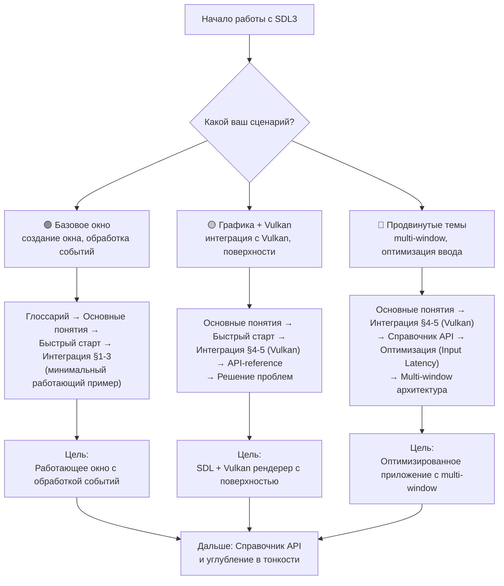
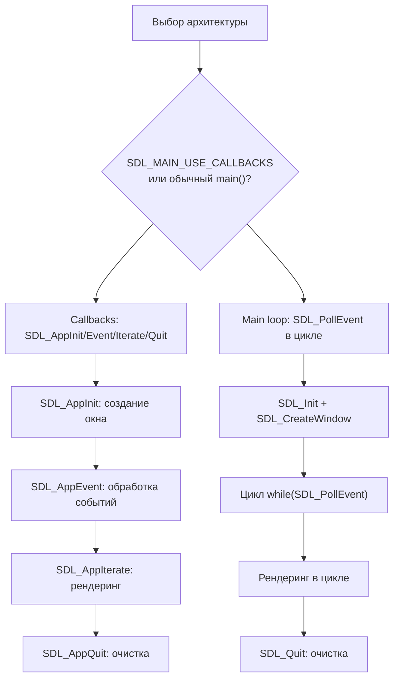

# SDL3

**🟢 Уровень 1: Начинающий**

**SDL3** (Simple DirectMedia Layer) — библиотека низкого уровня, предоставляющая доступ к аудио, клавиатуре, мыши,
джойстику и графическому оборудованию через OpenGL, Direct3D и Vulkan. Используется для создания графических приложений,
игр и инструментов.

Версия: **SDL3** (активная разработка).
Исходники: [libsdl.org](https://libsdl.org), [SDL GitHub](https://github.com/libsdl-org/SDL).

---

## Диаграмма обучения (Learning Path)

Выберите свой сценарий и следуйте по соответствующему пути:

---

## Содержание

### 🟢 Уровень 1: Начинающий

| Раздел                          | Описание                                                  | Уровень |
|---------------------------------|-----------------------------------------------------------|---------|
| [Глоссарий](glossary.md)        | Термины: Window, Event, Surface, Callback, Handle         | 🟢      |
| [Основные понятия](concepts.md) | Архитектура callbacks, event loop, жизненный цикл         | 🟢      |
| [Быстрый старт](quickstart.md)  | Создание окна с поддержкой Vulkan, SDL_MAIN_USE_CALLBACKS | 🟢      |
| [Интеграция](integration.md)    | CMake, настройка проекта, порядок include                 | 🟢      |

### 🟡 Уровень 2: Средний

| Раздел                                 | Описание                                                   | Уровень |
|----------------------------------------|------------------------------------------------------------|---------|
| [Справочник API](api-reference.md)     | Функции и структуры: SDL_Window, SDL_Event, Vulkan helpers | 🟡      |
| [Решение проблем](troubleshooting.md)  | Частые ошибки инициализации, диагностика, исправления      | 🟡      |
| [Сценарии использования](use-cases.md) | Типовые архитектуры: игры, редакторы, медиаплееры          | 🟡      |
| [Производительность](performance.md)   | Оптимизация ввода, низкая задержка, профилирование         | 🟡      |
| [Decision Trees](decision-trees.md)    | Выбор API, архитектурных решений, рекомендации             | 🟡      |

### 🔴 Уровень 3: Продвинутый

| Раздел                                           | Описание                                                  | Уровень |
|--------------------------------------------------|-----------------------------------------------------------|---------|
| [Интеграция в ProjectV](projectv-integration.md) | Специфичные паттерны для воксельного движка (опционально) | 🔴      |

---

## Быстрые ссылки по задачам

| Задача                               | Рекомендуемый раздел                                                                                                               | Уровень |
|--------------------------------------|------------------------------------------------------------------------------------------------------------------------------------|---------|
| Создать окно (базовое)               | [Быстрый старт](quickstart.md)                                                                                                     | 🟢      |
| Создать окно с Vulkan поддержкой     | [Быстрый старт](quickstart.md) → [Интеграция §4](integration.md#4-vulkan-surface)                                                  | 🟢      |
| Обработка событий (клавиатура, мышь) | [Основные понятия](concepts.md#event-loop-sdl_appevent-vs-sdl_pollevent)                                                           | 🟢      |
| Настроить сборку с CMake             | [Интеграция §1](integration.md#1-cmake)                                                                                            | 🟢      |
| Интегрировать с volk и Vulkan        | [Интеграция §4](integration.md#4-vulkan-surface) → [volk интеграция](../volk/integration.md)                                       | 🟡      |
| Реализовать multi-window архитектуру | [Сценарии использования](use-cases.md) → [ProjectV интеграция](projectv-integration.md#multi-window-редактор-вокселей)             | 🟡      |
| Оптимизировать input latency         | [Производительность](performance.md) → [ProjectV интеграция](projectv-integration.md#оптимизация-ввода-для-точного-редактирования) | 🟡      |
| Диагностировать ошибки инициализации | [Решение проблем](troubleshooting.md)                                                                                              | 🟡      |
| Выбрать между callbacks и main()     | [Decision Trees](decision-trees.md) → [Основные понятия](concepts.md#main-vs-sdl_main_use_callbacks)                               | 🟡      |

---

## Жизненный цикл использования SDL3

---

## Рекомендуемый порядок чтения

1. **[Глоссарий](glossary.md)** — понять базовую терминологию.
2. **[Основные понятия](concepts.md)** — изучить архитектуру и жизненный цикл.
3. **[Быстрый старт](quickstart.md)** — запустить минимальный пример.
4. **[Интеграция](integration.md)** — настроить в своём проекте.
5. **[Решение проблем](troubleshooting.md)** — знать как диагностировать ошибки.

После этого выбирайте разделы в зависимости от ваших задач.

---

## Требования

- **C11** или **C++11** (или новее)
- **Платформенные зависимости** (линкуются автоматически):
  - Windows: нет зависимостей
  - Linux: `-lpthread -ldl -lm -lrt`
  - macOS:
    `-framework CoreFoundation -framework CoreAudio -framework AudioToolbox -framework ForceFeedback -framework Carbon -framework IOKit -framework CoreVideo`
  - Android: `-llog -landroid`

### Поддерживаемые платформы

- Windows (Win32, UWP)
- Linux (X11, Wayland)
- macOS (Cocoa)
- iOS (UIKit)
- Android (NativeActivity)
- Emscripten (WebAssembly)

---

## Примеры кода в ProjectV

ProjectV содержит несколько примеров интеграции SDL:

| Пример                | Описание                         | Ссылка                                                                 |
|-----------------------|----------------------------------|------------------------------------------------------------------------|
| Базовое окно          | Минимальный пример создания окна | [sdl_window.cpp](../examples/sdl_window.cpp)                           |
| SDL + flecs           | Интеграция событий SDL в ECS     | [sdl_flecs_integration.cpp](../examples/sdl_flecs_integration.cpp)     |
| Multi-window редактор | Управление несколькими окнами    | [sdl_multi_window_editor.cpp](../examples/sdl_multi_window_editor.cpp) |
| SDL + ImGui + Vulkan  | Полный стек GUI                  | [imgui_sdl_vulkan.cpp](../examples/imgui_sdl_vulkan.cpp)               |

---

## Следующие шаги

### Для новых пользователей

1. **[Глоссарий](glossary.md)** — изучите базовую терминологию
2. **[Основные понятия](concepts.md)** — поймите архитектуру SDL
3. **[Быстрый старт](quickstart.md)** — запустите первый пример

### Для интеграции в проект

1. **[Интеграция](integration.md)** — настройте CMake и зависимости
2. **[Решение проблем](troubleshooting.md)** — решите возможные ошибки

### Для выбора архитектуры

1. **[Decision Trees](decision-trees.md)** — определитесь с подходом
2. **[Сценарии использования](use-cases.md)** — посмотрите примеры архитектур

### Для углублённого изучения

1. **[Справочник API](api-reference.md)** — изучите все функции
2. **[Производительность](performance.md)** — оптимизируйте приложение
3. **[Интеграция в ProjectV](projectv-integration.md)** — специализированные паттерны для воксельного движка

---

## Связанные разделы

- [Vulkan](../vulkan/README.md) — графический API для рендеринга
- [volk](../volk/README.md) — загрузка Vulkan функций
- [flecs](../flecs/README.md) — ECS библиотека
- [ImGui](../imgui/README.md) — immediate-mode GUI
- [Документация проекта](../README.md) — общая структура проекта

← [На главную документации](../README.md)
