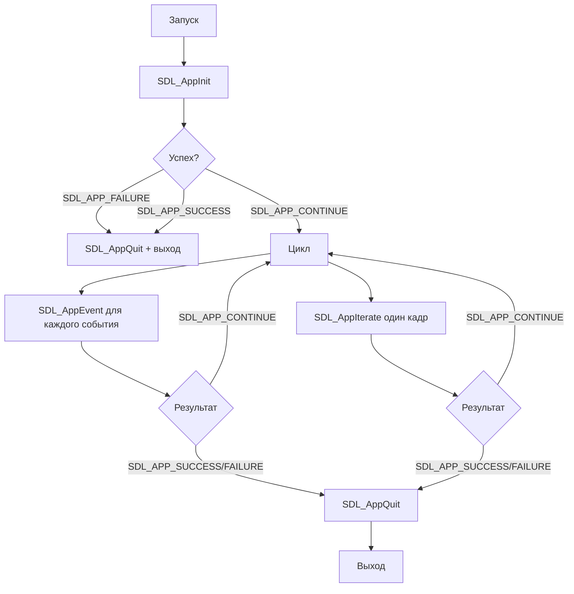
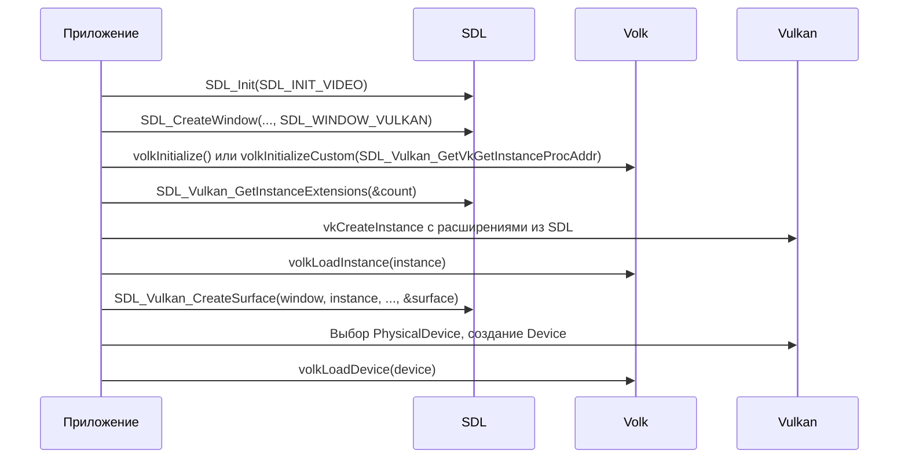
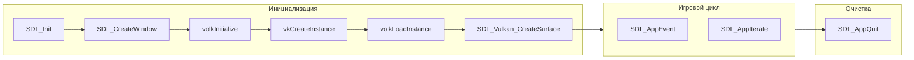

# Основные понятия SDL

**🟢 Уровень 1: Начинающий**

Краткое введение в SDL3, объясняющее фундаментальные концепции API, необходимые для понимания работы с оконной системой
и интеграции с Vulkan. Термины — в [глоссарии](glossary.md).

## На этой странице

- [Зачем SDL3 в игре на Vulkan](#зачем-sdl3-в-игре-на-vulkan)
- [main() vs SDL_MAIN_USE_CALLBACKS](#main-vs-sdl_main_use_callbacks)
- [Жизненный цикл приложения](#жизненный-цикл-приложения)
- [Event loop: SDL_AppEvent vs SDL_PollEvent](#event-loop-sdl_appevent-vs-sdl_pollevent)
- [SDL_EVENT_QUIT и SDL_EVENT_WINDOW_CLOSE_REQUESTED](#sdl_event_quit-и-sdl_event_window_close_requested)
- [Vulkan-интеграция](#vulkan-интеграция)
- [Общая схема](#общая-схема)

---

## Зачем SDL3 в игре на Vulkan

Vulkan не создаёт окна — он рисует в поверхность (`VkSurfaceKHR`), которую нужно получить от оконной системы. SDL3 даёт:

- **Окно** — handle (`SDL_Window*`, указатель на неполный тип; не разыменовывается). Кроссплатформенная абстракция над
  Win32, X11, Wayland, Cocoa и т.д.
- **События** — закрытие окна, клавиатура, мышь, геймпад
- **Vulkan-поверхность** — `SDL_Vulkan_CreateSurface` связывает окно с Vulkan
- **Расширения instance** — `SDL_Vulkan_GetInstanceExtensions` возвращает имена расширений для platform surface (
  VK_KHR_win32_surface и др.)

Без SDL пришлось бы писать платформо-специфичный код под каждую ОС.

---

## main() vs SDL_MAIN_USE_CALLBACKS

SDL предлагает два способа входа в приложение:

### Обычный main()

```cpp
#include "SDL3/SDL.h"
#include "SDL3/SDL_main.h"

int main(int argc, char* argv[]) {
    SDL_Init(SDL_INIT_VIDEO);
    SDL_Window* window = SDL_CreateWindow("Game", 1280, 720, 0);
    // ...
    while (running) {
        SDL_PollEvent(&event);
        // ...
    }
    SDL_Quit();
    return 0;
}
```

Приложение само управляет циклом: вызывает `SDL_PollEvent` в цикле и решает, когда выйти.

### SDL_MAIN_USE_CALLBACKS

```cpp
#define SDL_MAIN_USE_CALLBACKS 1
#include "SDL3/SDL.h"
#include "SDL3/SDL_main.h"

SDL_AppResult SDL_AppInit(void** appstate, int argc, char* argv[]) {
    // Инициализация, создание окна
    return SDL_APP_CONTINUE;
}
SDL_AppResult SDL_AppEvent(void* appstate, SDL_Event* event) {
    // Обработка события
    return SDL_APP_CONTINUE;
}
SDL_AppResult SDL_AppIterate(void* appstate) {
    // Один кадр: обновление, отрисовка
    return SDL_APP_CONTINUE;
}
void SDL_AppQuit(void* appstate, SDL_AppResult result) {
    // Освобождение ресурсов
}
```

SDL вызывает callbacks. `SDL_AppEvent` вызывается для каждого события — **не нужно** вызывать `SDL_PollEvent`. На
некоторых платформах (iOS, Android) callbacks могут быть предпочтительнее или обязательны. В ProjectV используется
именно этот режим.

---

## Жизненный цикл приложения



Типичный порядок:

1. **SDL_AppInit** — `SDL_Init(SDL_INIT_VIDEO)`, `SDL_CreateWindow`, при Vulkan — `volkInitialize`, `vkCreateInstance`,
   `volkLoadInstance`, `SDL_Vulkan_CreateSurface` и т.д.
2. **SDL_AppEvent** — обработка `SDL_EVENT_QUIT`, `SDL_EVENT_WINDOW_CLOSE_REQUESTED`, `SDL_EVENT_KEY_DOWN` (например,
   Escape → `SDL_APP_SUCCESS`).
3. **SDL_AppIterate** — обновление логики, отрисовка кадра.
4. **SDL_AppQuit** — освобождение ресурсов (destroy window, Vulkan device/instance, и т.д.). SDL вызовет `SDL_Quit` сам
   после этого.

---

## Event loop: SDL_AppEvent vs SDL_PollEvent

| Режим                      | Как получать события                            | Где обрабатывать      |
|----------------------------|-------------------------------------------------|-----------------------|
| **SDL_MAIN_USE_CALLBACKS** | SDL вызывает `SDL_AppEvent` для каждого события | В теле `SDL_AppEvent` |
| **main()**                 | Цикл: `while (SDL_PollEvent(&event)) { ... }`   | В теле цикла          |

При `SDL_MAIN_USE_CALLBACKS` **не вызывайте** `SDL_PollEvent` — SDL сам доставляет события в `SDL_AppEvent`. Смешивание
приведёт к потере событий или двойной обработке.

---

## SDL_EVENT_QUIT и SDL_EVENT_WINDOW_CLOSE_REQUESTED

Это разные события:

| Событие                              | Когда приходит                                                                                           | Роль                                           |
|--------------------------------------|----------------------------------------------------------------------------------------------------------|------------------------------------------------|
| **SDL_EVENT_WINDOW_CLOSE_REQUESTED** | Пользователь нажал крестик на окне. Менеджер окон запрашивает закрытие.                                  | Специфично для окна (`event.window.windowID`). |
| **SDL_EVENT_QUIT**                   | Глобальный выход — обычно после закрытия последнего окна, Alt+F4, или когда приложение само завершается. | Выход из приложения.                           |

**Порядок для Vulkan:** сначала приходит `SDL_EVENT_WINDOW_CLOSE_REQUESTED`. В этот момент нужно уничтожить swapchain и
Vulkan-ресурсы, привязанные к окну, **до** того как SDL уничтожит окно. Затем SDL может отправить `SDL_EVENT_QUIT` или
приложение само вернёт `SDL_APP_SUCCESS`.

Рекомендуемая обработка в `SDL_AppEvent`:

```cpp
if (event->type == SDL_EVENT_WINDOW_CLOSE_REQUESTED) {
    // Уничтожить swapchain, framebuffers и т.д. До SDL_DestroyWindow
    destroyVulkanSwapchain();
    SDL_DestroyWindow(window);
    return SDL_APP_SUCCESS;  // Завершить приложение
}
if (event->type == SDL_EVENT_QUIT) {
    return SDL_APP_SUCCESS;
}
```

Для простого одноконного приложения оба события ведут к выходу; важно успеть освободить Vulkan-ресурсы при
`SDL_EVENT_WINDOW_CLOSE_REQUESTED`.

---

## Vulkan-интеграция

Порядок вызовов для связки SDL + volk + Vulkan:



Ключевые моменты:

- Окно создаётся с **`SDL_WINDOW_VULKAN`** — иначе `SDL_Vulkan_CreateSurface` не сработает.
- **Расширения instance** — SDL возвращает platform-specific имена (например, `VK_KHR_win32_surface`). Все они должны
  быть в `VkInstanceCreateInfo::ppEnabledExtensionNames`.
- **volkInitializeCustom** — если SDL уже загрузил Vulkan loader при создании окна, можно передать
  `SDL_Vulkan_GetVkGetInstanceProcAddr()` в `volkInitializeCustom` вместо `volkInitialize()`.

**Размер swapchain:** для создания Vulkan swapchain используйте **`SDL_GetWindowSizeInPixels`** — он даёт размер
drawable в пикселях. На HiDPI-дисплеях он может отличаться от `SDL_GetWindowSize` (оконные координаты).

**Resize:** при изменении размера окна или DPI приходит **`SDL_EVENT_WINDOW_PIXEL_SIZE_CHANGED`**. В ответ нужно
пересоздать swapchain. Новый размер можно взять из `event.window.data1` и `event.window.data2` или перезапросить через
`SDL_GetWindowSizeInPixels`.

Подробнее: [Интеграция](integration.md), [volk — Интеграция с SDL3](../volk/integration.md#7-интеграция-с-sdl3).

---

## Общая схема



---

## Дальше

**Следующий раздел:** [Быстрый старт](quickstart.md) — собрать минимальное окно с SDL_MAIN_USE_CALLBACKS.

**См. также:**

- [Глоссарий](glossary.md) — термины (handle, union, callback и др.)
- [Интеграция](integration.md) — CMake, порядок include, полная связка с volk и Vulkan
