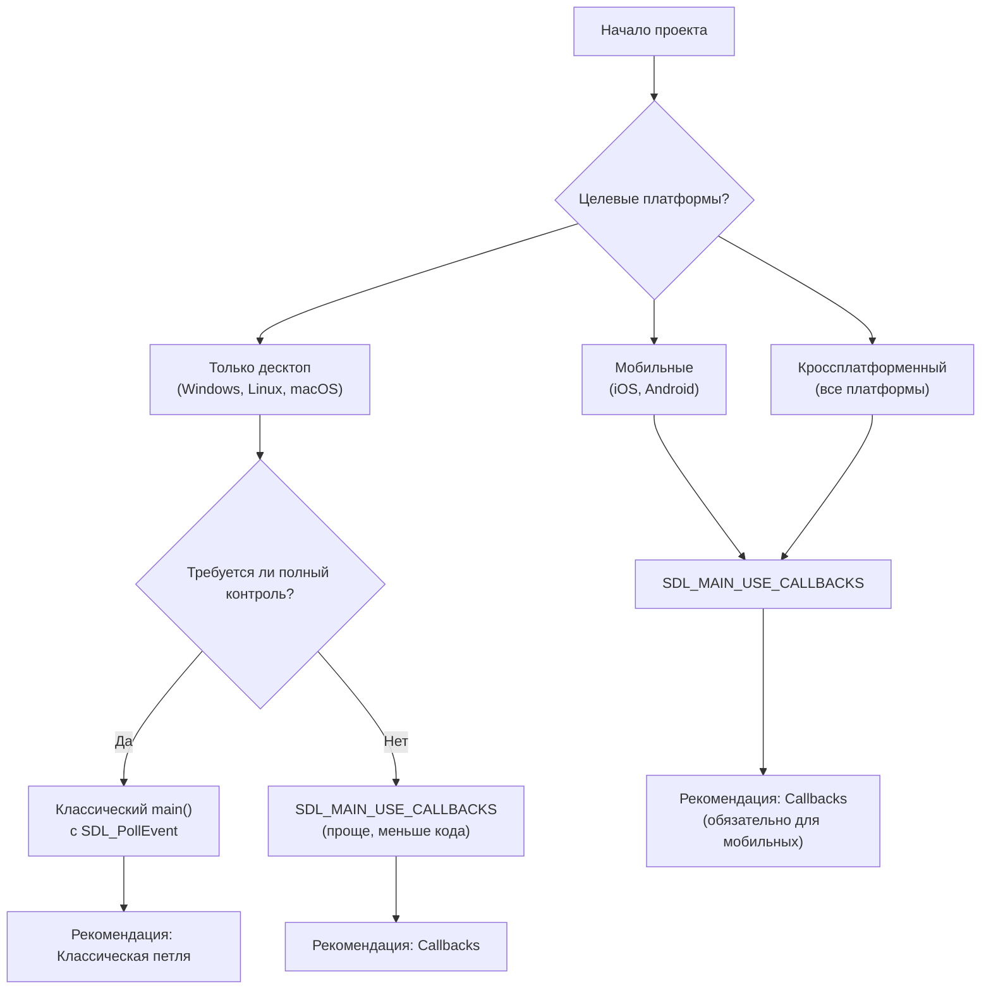
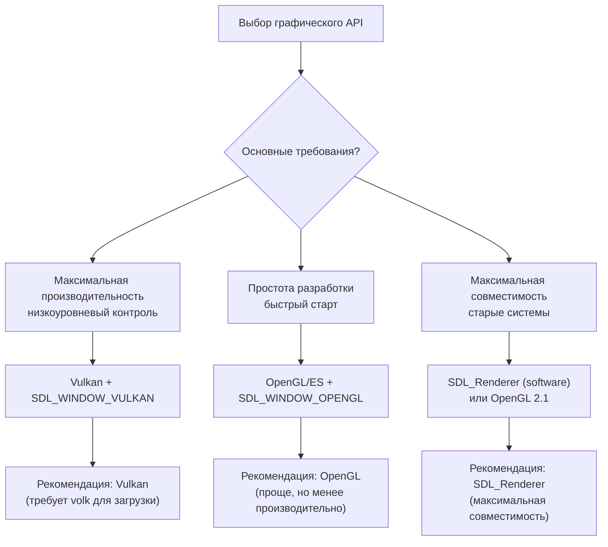
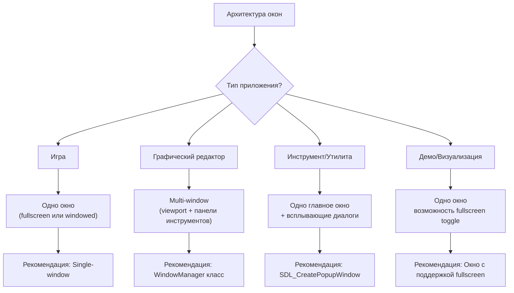
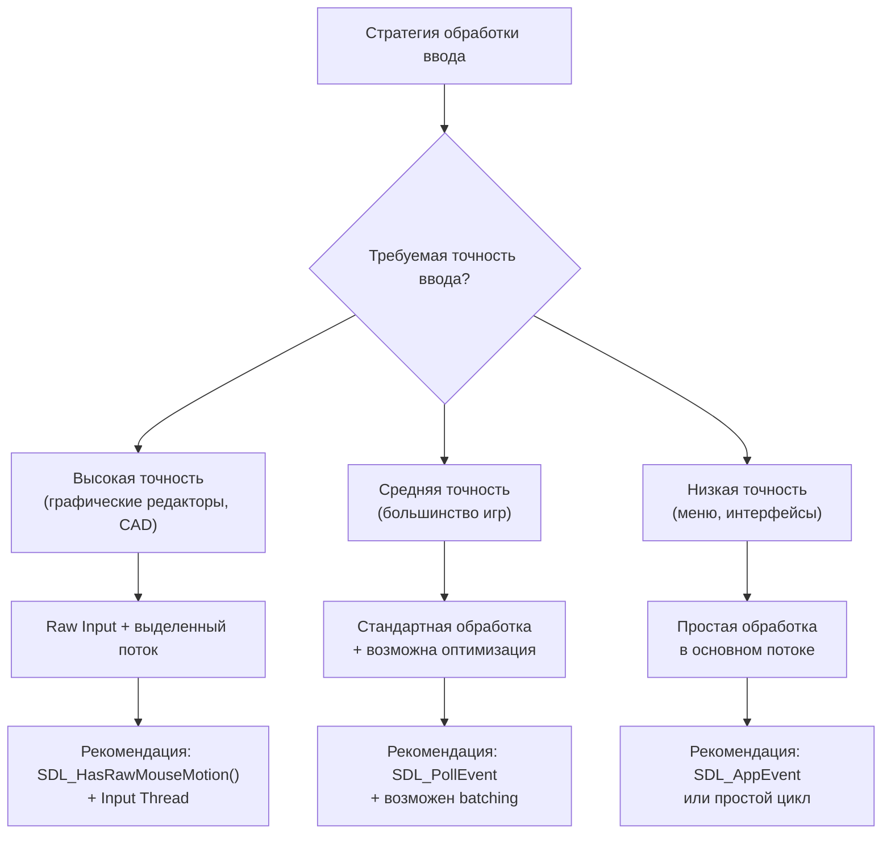
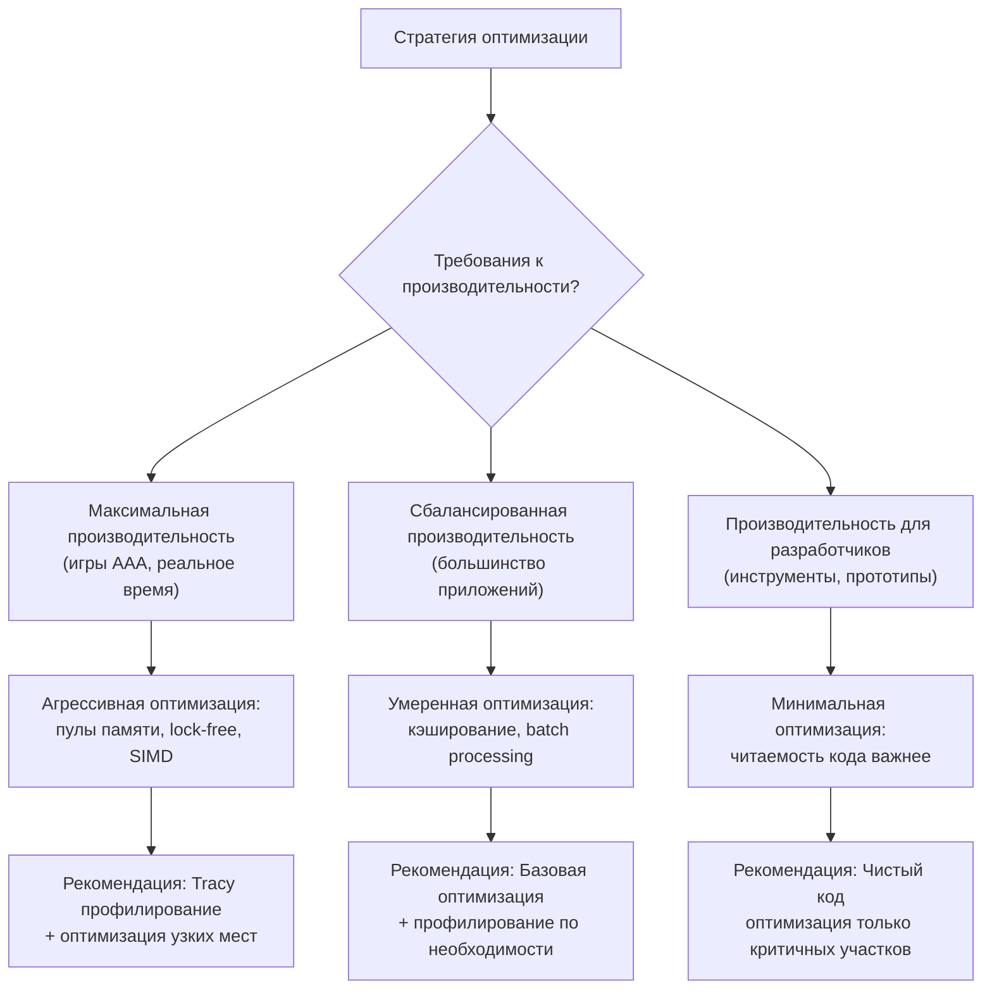
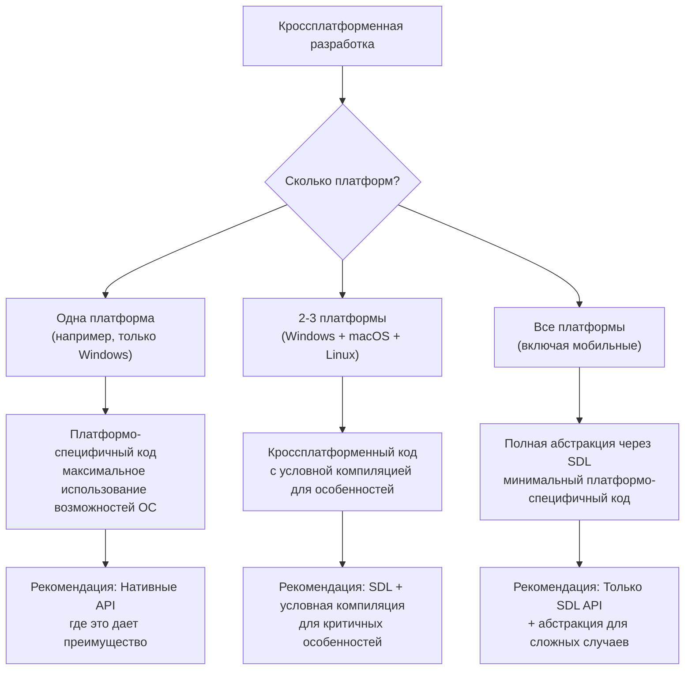

# Decision Trees для SDL3

**🟡 Уровень 2: Средний**

---

## Содержание

- [Выбор архитектуры Event Loop](#выбор-архитектуры-event-loop)
- [Выбор графического API](#выбор-графического-api)
- [Выбор архитектуры окон](#выбор-архитектуры-окон)
- [Выбор стратегии ввода](#выбор-стратегии-ввода)
- [Выбор стратегии оптимизации](#выбор-стратегии-оптимизации)
- [Кроссплатформенные решения](#кроссплатформенные-решения)

---

## Выбор архитектуры Event Loop

### Рекомендации по выбору:

| Архитектура                                       | Когда выбирать                                                                             | Преимущества                                                              | Недостатки                                            |
|---------------------------------------------------|--------------------------------------------------------------------------------------------|---------------------------------------------------------------------------|-------------------------------------------------------|
| **Классическая петля** (main() + SDL_PollEvent)   | Десктопные приложения, игры, инструменты где нужен полный контроль над временем выполнения | Полный контроль над циклом, простота отладки, предсказуемое поведение     | Требует платформо-специфичной адаптации для мобильных |
| **Callback архитектура** (SDL_MAIN_USE_CALLBACKS) | Кроссплатформенные проекты, мобильные приложения, быстрые прототипы                        | Естественная интеграция с мобильными платформами, меньше boilerplate кода | Меньше контроля над временем выполнения               |

---

## Выбор графического API

### Сравнение графических API:

| API              | Когда использовать                                                                                 | Интеграция с SDL                                   | Производительность                     |
|------------------|----------------------------------------------------------------------------------------------------|----------------------------------------------------|----------------------------------------|
| **Vulkan**       | Высокопроизводительные игры, графические редакторы, научная визуализация                           | `SDL_WINDOW_VULKAN` + `SDL_Vulkan_CreateSurface()` | Максимальная (низкоуровневый контроль) |
| **OpenGL**       | Быстрые прототипы, образовательные проекты, приложения где совместимость важнее производительности | `SDL_WINDOW_OPENGL` + стандартный контекст OpenGL  | Средняя (драйверозависимая)            |
| **SDL_Renderer** | 2D игры, простые интерфейсы, максимальная совместимость, embedded системы                          | Встроенный в SDL, работает поверх OpenGL/Direct3D  | Ниже (но проще в использовании)        |
| **Direct3D**     | Windows-эксклюзивные проекты, интеграция с существующим DX кодом                                   | Через расширения SDL или собственную реализацию    | Высокая (на Windows)                   |

---

## Выбор архитектуры окон

### Паттерны управления окнами:

| Паттерн              | Описание                                                                    | Когда использовать                                       |
|----------------------|-----------------------------------------------------------------------------|----------------------------------------------------------|
| **Single-window**    | Одно главное окно, возможны диалоги через SDL_CreatePopupWindow             | Игры, медиаплееры, демо-приложения                       |
| **Multi-window**     | Несколько независимых окон, каждое со своим контекстом рендеринга           | Графические редакторы, IDE, профессиональные инструменты |
| **Document-view**    | Одно главное окно с несколькими viewport'ами внутри (вкладки, split panels) | Текстовые редакторы, браузеры, файловые менеджеры        |
| **Floating windows** | Основное окно + плавающие панели инструментов                               | DAW, сложные редакторы, CAD системы                      |

---

## Выбор стратегии ввода

### Стратегии обработки ввода:

| Стратегия            | Описание                                                                    | Когда использовать                                                   |
|----------------------|-----------------------------------------------------------------------------|----------------------------------------------------------------------|
| **Raw Input**        | Прямой доступ к данным устройства, обход системного сглаживания и ускорения | Графические редакторы, CAD, приложения требующие пиксельной точности |
| **Standard Polling** | Стандартная обработка через SDL_PollEvent или SDL_AppEvent                  | Большинство игр, медиаплееры, инструменты                            |
| **Input Thread**     | Выделенный поток для обработки ввода, отдельно от рендеринга                | Приложения с тяжелым рендерингом, где ввод не должен блокироваться   |
| **Event Batching**   | Пакетная обработка событий за один проход                                   | Высокочастотные симуляции, физические движки                         |

---

## Выбор стратегии оптимизации

### Уровни оптимизации:

| Уровень         | Методы                                                                 | Инструменты                        | Когда применять                                                   |
|-----------------|------------------------------------------------------------------------|------------------------------------|-------------------------------------------------------------------|
| **Агрессивный** | Пулы памяти, lock-free структуры, SIMD, ассемблерные вставки           | Tracy, RenderDoc, VTune, PIX       | AAA игры, высокопроизводительные симуляции, движки                |
| **Умеренный**   | Кэширование, batch processing, оптимизация алгоритмов, избегание копий | Tracy, простые профайлеры, logging | Коммерческие приложения, большинство игр, редакторы               |
| **Минимальный** | Чистая архитектура, избегание очевидных неэффективностей, рефакторинг  | Встроенные таймеры, логи           | Прототипы, инструменты для разработчиков, образовательные проекты |

---

## Кроссплатформенные решения

### Дерево принятия решений для кроссплатформенности:

### Рекомендации по платформам:

| Платформа       | Особенности                                              | Рекомендации по SDL                                                           |
|-----------------|----------------------------------------------------------|-------------------------------------------------------------------------------|
| **Windows**     | DirectX, Game Mode, DPI scaling, multiple monitors       | `SDL_HINT_WINDOWS_DPI_AWARENESS`, `SDL_HINT_VIDEO_FULLSCREEN_SPACES`          |
| **macOS**       | Metal, Retina displays, menu bar integration, gestures   | `SDL_HINT_RENDER_DRIVER="metal"`, `SDL_HINT_VIDEO_HIGHDPI_DISABLED="0"`       |
| **Linux**       | X11/Wayland, multiple window managers, package diversity | `SDL_HINT_VIDEO_DRIVER="x11"` (или "wayland"), проверять доступность бэкендов |
| **iOS/Android** | Touch input, orientation changes, battery optimization   | Обязательно `SDL_MAIN_USE_CALLBACKS`, обработка жизненного цикла приложения   |

---

## Быстрые рекомендации по умолчанию

### Для нового проекта:

1. **Начните с `SDL_MAIN_USE_CALLBACKS`** — проще для кроссплатформенности
2. **Используйте Vulkan если нужна производительность**, OpenGL для простоты
3. **Single-window архитектура** для игр, multi-window для редакторов
4. **Raw Input включайте только при необходимости** точного позиционирования
5. **Интегрируйте Tracy** для профилирования с самого начала
6. **Создайте platform abstraction layer** если планируется поддержка >2 платформ

### Чеклист принятия решений:

- [ ] Определены целевые платформы
- [ ] Выбрана архитектура event loop (callbacks vs main loop)
- [ ] Выбран графический API (Vulkan/OpenGL/SDL_Renderer)
- [ ] Определена архитектура окон (single/multi-window)
- [ ] Выбрана стратегия обработки ввода
- [ ] Определен уровень оптимизации
- [ ] Запланирована кроссплатформенная стратегия
- [ ] Выбраны инструменты профилирования и отладки

---

## Следующие шаги

1. **Применение решений**: Используйте деревья решений для выбора архитектуры вашего проекта
2. **Интеграция**: Настройте SDL согласно выбранным решениям
3. **Итерация**: Пересматривайте решения по мере развития проекта
4. **Оптимизация**: Применяйте рекомендации из раздела [Производительность](performance.md)

Для специфичных решений для воксельного движка смотрите [Интеграция в ProjectV](projectv-integration.md).

---

## Связанные разделы

- [Основные понятия](concepts.md) — фундаментальные концепции SDL
- [Сценарии использования](use-cases.md) — готовые архитектурные паттерны
- [Производительность](performance.md) — техники оптимизации
- [Интеграция в ProjectV](projectv-integration.md) — специфичные решения для воксельного движка

← [Назад к документации SDL](README.md)