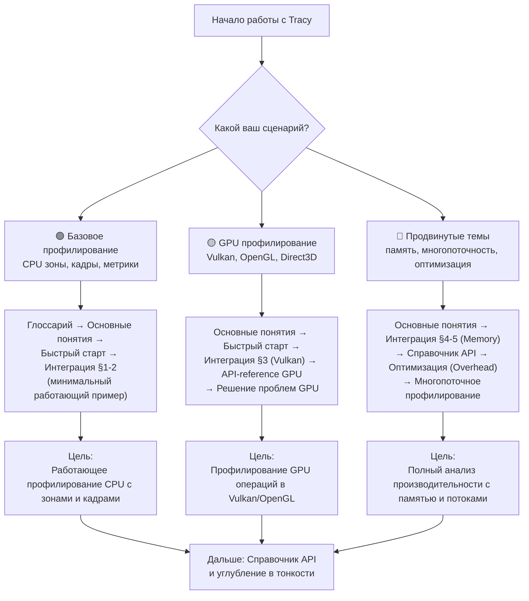
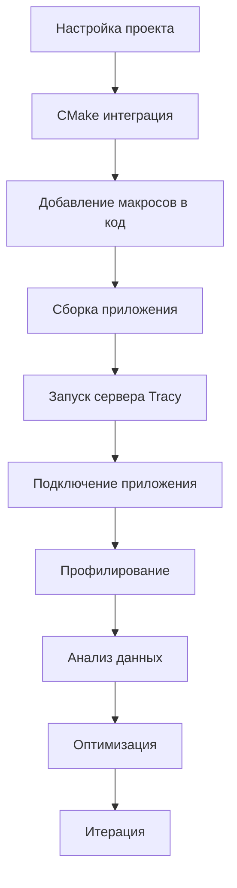

# Tracy

**🟢 Уровень 1: Начинающий**

**Tracy** — кроссплатформенный инструмент для профилирования C++ приложений с наносекундным разрешением. Позволяет
визуализировать время выполнения функций, использование памяти, GPU операции (Vulkan, OpenGL, Direct3D), отслеживать
аллокации, блокировки, переключения контекстов и многое другое в реальном времени.

Исходники: [wolfpld/tracy](https://github.com/wolfpld/tracy).
Версия: **0.10+** (используется в ProjectV).

---

## 🗺️ Диаграмма обучения (Learning Path)

Выберите свой сценарий и следуйте по соответствующему пути:



---

## Содержание

### 🟢 Уровень 1: Начинающий

| Раздел                          | Описание                                     | Уровень |
|---------------------------------|----------------------------------------------|---------|
| [Глоссарий](glossary.md)        | Термины: Zone, Frame, Plot, Message, Context | 🟢      |
| [Основные понятия](concepts.md) | Архитектура клиент-сервер, типы инструментов | 🟢      |
| [Быстрый старт](quickstart.md)  | Минимальная интеграция, запуск сервера       | 🟢      |
| [Интеграция](integration.md)    | CMake, настройки проекта, конфигурация       | 🟢      |

### 🟡 Уровень 2: Средний

| Раздел                                           | Описание                                                  | Уровень |
|--------------------------------------------------|-----------------------------------------------------------|---------|
| [Справочник API](api-reference.md)               | Все макросы и функции с примерами                         | 🟡      |
| [Решение проблем](troubleshooting.md)            | Диагностика и исправление ошибок                          | 🟡      |
| [Интеграция в ProjectV](projectv-integration.md) | Специфичные паттерны для воксельного движка (опционально) | 🟡      |

### 🔴 Уровень 3: Продвинутый

| Раздел                                   | Описание                             | Уровень |
|------------------------------------------|--------------------------------------|---------|
| *Use Cases* (планируется)                | Практические сценарии профилирования | 🔴      |
| *Decision Trees* (планируется)           | Выбор инструментов под задачу        | 🔴      |
| *Performance Optimization* (планируется) | Снижение overhead, best practices    | 🔴      |

---

## Быстрые ссылки по задачам

| Задача                         | Рекомендуемый раздел                                                 | Уровень |
|--------------------------------|----------------------------------------------------------------------|---------|
| Начать профилирование CPU      | [Быстрый старт](quickstart.md)                                       | 🟢      |
| Интеграция в CMake проект      | [Интеграция (CMake)](integration.md#cmake)                           | 🟢      |
| Профилирование Vulkan операций | [Интеграция (Vulkan)](integration.md#vulkan-profiling)               | 🟡      |
| Отслеживание аллокаций памяти  | [Справочник API (Memory)](api-reference.md#профилирование-памяти)    | 🟡      |
| Исправление ошибок компиляции  | [Решение проблем (Компиляция)](troubleshooting.md#ошибки-компиляции) | 🟡      |
| Настройка remote profiling     | [Основные понятия (Remote)](concepts.md#remote-profiling)            | 🟡      |
| Оптимизация overhead           | [Решение проблем (Overhead)](troubleshooting.md#высокий-overhead)    | 🔴      |
| Профилирование многопоточности | [Основные понятия (Многопоточность)](concepts.md#многопоточность)    | 🔴      |

---

## Требования

- **C++11** или новее (рекомендуется C++17+)
- **CMake 3.10+** (для интеграции через CMake)
- **Поддерживаемые платформы:**
  - Windows (x86/x64)
  - Linux (x86/x64, ARM)
  - macOS (x64, ARM)
  - Android (ARM, ARM64)
  - *BSD
- **Графические API:** Vulkan 1.1+, OpenGL 3.3+, Direct3D 11/12, Metal
- **Для сервера:** Браузер с поддержкой WebGL2 (Chrome, Firefox, Edge) или нативный клиент

### Поддерживаемые языки и интеграции

- **Прямая поддержка:** C, C++, Lua, Python, Fortran
- **Сторонние биндинги:** Rust, Zig, C#, OCaml, Odin и другие
- **Графические API:** Vulkan, OpenGL, Direct3D 11/12, Metal, OpenCL, CUDA
- **Системное профилирование:** Windows ETW, Linux perf, Android ATrace

---

## Особенности и возможности

### Основные возможности

- **Реальное время:** наносекундное разрешение, immediate feedback
- **Низкий overhead:** <1% CPU даже при интенсивном профилировании
- **Кроссплатформенность:** Windows, Linux, macOS, Android, BSD
- **Поддержка GPU:** все major графические API
- **Memory profiling:** отслеживание аллокаций и освобождений
- **Многопоточность:** полная поддержка потоков, fibers, lock contention
- **Remote profiling:** профилирование удалённых устройств
- **Web UI:** современный интерфейс через браузер

### Архитектурные принципы

- **Клиент-серверная архитектура:** отдельный сервер для сбора данных
- **Минимальные зависимости:** только стандартная библиотека C++
- **Zero-allocation в hot paths:** оптимизировано для продакшена
- **Thread-safe:** безопасная работа из множества потоков

---

## Начало работы за 5 минут

### 1. Добавление в проект (CMake)

```cmake
add_subdirectory(external/tracy)
target_compile_definitions(YourApp PRIVATE TRACY_ENABLE)
target_link_libraries(YourApp PRIVATE Tracy::TracyClient)
```

### 2. Минимальный пример

```cpp
#include "tracy/Tracy.hpp"

int main() {
    while (running) {
        FrameMark;  // Отметка кадра

        {
            ZoneScopedN("GameLogic");
            // Ваш код...
        }
    }
    return 0;
}
```

### 3. Запуск сервера

1. Запустите `Tracy.exe` (Windows) или `tracy-profiler` (Linux/macOS)
2. Запустите ваше приложение
3. Нажмите "Connect" в интерфейсе Tracy

---

## Жизненный цикл использования



---

## Примеры кода в ProjectV

ProjectV содержит примеры интеграции Tracy с компонентами воксельного движка:

| Компонент                | Описание                              | Ссылка на документацию                                                              |
|--------------------------|---------------------------------------|-------------------------------------------------------------------------------------|
| **Vulkan рендеринг**     | Профилирование GPU операций           | [Интеграция в ProjectV](projectv-integration.md#vulkan-profiling)                   |
| **ECS системы**          | Профилирование flecs систем           | [Интеграция в ProjectV](projectv-integration.md#ecs-flecs-profiling)                |
| **Memory (VMA)**         | Отслеживание аллокаций                | [Интеграция в ProjectV](projectv-integration.md#memory-profiling-vma)               |
| **Воксельные алгоритмы** | Профилирование генерации и рендеринга | [Интеграция в ProjectV](projectv-integration.md#воксельные-паттерны-профилирования) |

---

## Следующие шаги

### Для новых пользователей

1. **[Глоссарий](glossary.md)** — изучите базовую терминологию
2. **[Быстрый старт](quickstart.md)** — запустите первый пример профилирования
3. **[Интеграция](integration.md)** — настройте Tracy в своём проекте

### Для профилирования GPU

1. **[Интеграция (Vulkan)](integration.md#vulkan-profiling)** — настройка Vulkan контекста
2. **[Справочник API (GPU)](api-reference.md#vulkan-интеграция)** — макросы для GPU profiling

### Для решения проблем

1. **[Решение проблем](troubleshooting.md)** — диагностика и исправление ошибок
2. **[Основные понятия (Overhead)](concepts.md#overhead-и-производительность)** — оптимизация производительности

### Для углублённого изучения

1. **[Интеграция в ProjectV](projectv-integration.md)** — специализированные паттерны для воксельного движка
2. **[Справочник API](api-reference.md)** — полный список возможностей Tracy

---

## Дополнительные ресурсы

### Официальная документация

- **[Релизы Tracy](https://github.com/wolfpld/tracy/releases)** — бинарники и документация PDF
- **[Интерактивная демо](https://tracy.nereid.pl/)** — онлайн демонстрация возможностей
- **[Видео с CppCon 2023](https://youtu.be/ghXk3Bk5F2U)** — введение в Tracy

### Сообщество и поддержка

- **[GitHub Issues](https://github.com/wolfpld/tracy/issues)** — багрепорты и вопросы
- **[Discord](https://discord.gg/pq7U8DR)** — канал для обсуждения

### Для ProjectV разработчиков

- **[Интеграция в ProjectV](projectv-integration.md)** — полное руководство по использованию в воксельном движке
- **[Примеры кода ProjectV](../examples/)** — готовые примеры интеграции
- **[Документация ProjectV](../README.md)** — общая документация проекта

---

## Лицензия

Tracy распространяется под лицензией **BSD 3-Clause**. Подробности в `external/tracy/LICENSE`.

---

**← [Вернуться к карте документации ProjectV](../map.md)**
