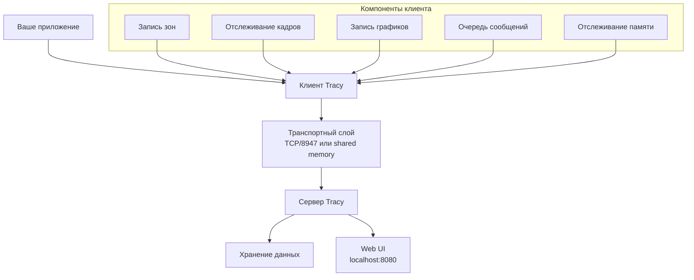

# Основные понятия Tracy

**🟡 Уровень 2: Средний**

Глубокое понимание архитектуры Tracy, типов инструментов и их применения в игровых движках и приложениях.

## На этой странице

- [Архитектура Tracy](#архитектура-tracy)
- [Типы инструментов профилирования](#типы-инструментов-профилирования)
- [Overhead и производительность](#overhead-и-производительность)
- [Remote profiling](#remote-profiling)
- [Timeline визуализация](#timeline-визуализация)
- [GPU profiling](#gpu-profiling)
- [Memory profiling](#memory-profiling)
- [Многопоточность](#многопоточность)
- [Сбор данных и передача](#сбор-данных-и-передача)
- [Оптимизации для воксельного движка](#оптимизации-для-воксельного-движка)

---

## Архитектура Tracy

Tracy использует клиент-серверную архитектуру:



### Компоненты

1. **Клиент (Client)** — встроен в ваше приложение через заголовочные файлы. Собирает данные профилирования.
2. **Транспорт (Transport)** — передача данных от клиента к серверу. По умолчанию TCP порт 8947, возможен shared memory.
3. **Сервер (Server)** — принимает данные, агрегирует, предоставляет Web UI.
4. **Web UI** — веб-интерфейс для визуализации профилировочных данных.

### Основные преимущества

- **Минимальный overhead**: <1% CPU даже при интенсивном профилировании
- **Низкая latency**: Данные передаются в реальном времени
- **Кроссплатформенность**: Windows, Linux, macOS, поддержка Vulkan, OpenGL, DirectX на всех платформах
- **Масштабируемость**: Подходит для приложений с тысячами потоков и миллионами зон

---

## Типы инструментов профилирования

### 1. Zones (Зоны)

Зоны — основной инструмент для измерения времени выполнения блоков кода.

```cpp
{
    ZoneScopedN("MyFunction");  // Именованная зона
    // Код для профилирования...
}  // Зона автоматически завершается
```

**Типы зон:**

- **Именованные**: `ZoneScopedN("Name")` — удобны для ручного профилирования
- **Анонимные**: `ZoneScoped` — используют имя функции автоматически
- **Вложенные**: Зоны могут быть вложенными для детализации
- **GPU зоны**: `TracyVkZone()` для Vulkan команд

### 2. Frames (Кадры)

Отметка границ кадров для анализа времени рендеринга.

```cpp
while (running) {
    FrameMark;  // Отметка начала кадра
    // Игровая логика и рендеринг...
}
```

**Метрики кадров:**

- Frame time (время кадра)
- Frame rate (FPS)
- Frame stuttering (микрофризы)

### 3. Plots (Графики)

Визуализация числовых значений во времени.

```cpp
TracyPlot("VoxelsRendered", (int64_t)voxelCount);
TracyPlot("FrameTime", (float)frameTimeMs);
```

**Типы графиков:**

- **Линейные**: Показывают тенденции
- **Гистограммы**: Распределение значений
- **Scatter plots**: Точечные диаграммы

### 4. Messages (Сообщения)

Текстовые сообщения с привязкой ко времени.

```cpp
TracyMessageL("Chunk generated at (10, 20, 30)");
TracyMessage("Warning: High memory usage", 25);  // с цветом
```

**Применение:**

- Логирование событий
- Отладочная информация
- Предупреждения и ошибки

### 5. Memory tracking (Отслеживание памяти)

Профилирование аллокаций и освобождений памяти.

```cpp
void* ptr = malloc(size);
TracyAlloc(ptr, size);
// ...
TracyFree(ptr);
```

**Особенности:**

- Отслеживание утечек памяти
- Анализ fragmentation
- Профилирование custom аллокаторов

---

## Overhead и производительность

### Измерение overhead

Overhead Tracy зависит от интенсивности использования:

| Инструмент          | CPU overhead           | Memory overhead         | Примечания                               |
|---------------------|------------------------|-------------------------|------------------------------------------|
| **Zones**           | 10-100 нс на зону      | ~24 байта на зону       | Зависит от частоты вызовов               |
| **Frames**          | <1 нс на кадр          | Незначительно           | Можно использовать всегда                |
| **Plots**           | 20-50 нс на вызов      | Зависит от частоты      | Оптимизировать для high-frequency данных |
| **Messages**        | 50-200 нс на сообщение | Зависит от длины строки | Использовать для важных событий          |
| **Memory tracking** | 30-80 нс на аллокацию  | Незначительно           | Включать только при необходимости        |

### Оптимизация overhead

1. **Условная компиляция**:

```cpp
#ifdef TRACY_ENABLE
    ZoneScopedN("ExpensiveOperation");
#endif
```

2. **Частота выборки**:

```cpp
static int counter = 0;
if (++counter % 100 == 0) {  // Каждый 100-й вызов
    TracyPlot("UpdateTime", updateTimeMs);
}
```

3. **Группировка зон**:

```cpp
{
    ZoneScopedN("BatchProcessing");
    for (auto& item : items) {
        // Не создавать зону для каждого элемента
        processItem(item);
    }
}
```

4. **Отключение в релизе**:

```cmake
if (CMAKE_BUILD_TYPE STREQUAL "Release")
    target_compile_definitions(${PROJECT_NAME} PRIVATE TRACY_ENABLE=0)
endif ()
```

---

## Remote profiling

### Конфигурация

1. **Запуск сервера**:

```bash
./tracy-release -o output.tracy
```

2. **Подключение клиента**:

```cpp
// Автоматическое подключение к localhost:8947
// Или указание IP:
tracy::SetServerAddress("192.168.1.100:8947");
```

3. **Просмотр в браузере**: `http://localhost:8080`

### Примеры использования

1. **Профилирование на удалённой машине**:

```cpp
// Для профилирования на сервере/стедии
tracy::SetServerAddress("studio-pc:8947");
```

2. **Сохранение сессий**:

```bash
# Запись сессии в файл для последующего анализа
./tracy-release -o session_20250216.tracy
```

3. **Сравнение производительности**:

```cpp
TracyPlot("BaselineFrameTime", baselineTime);
TracyPlot("OptimizedFrameTime", optimizedTime);
```

---

## Timeline визуализация

### Структура timeline

```
Frame 42 (15.2 ms)
├── [Main Thread] (10.1 ms)
│   ├── Zone: GameLogic (3.2 ms)
│   │   ├── Zone: Physics (1.8 ms)
│   │   └── Zone: AI (0.5 ms)
│   └── Zone: Render (6.9 ms)
│       ├── GPU Zone: Vulkan (5.3 ms)
│       └── Zone: Present (1.6 ms)
├── [Render Thread] (4.8 ms)
└── [Audio Thread] (0.3 ms)
```

### Ключевые возможности

1. **Zoom и pan**: Масштабирование для детального анализа
2. **Filtering**: Фильтрация по имени зоны, потоку, времени
3. **Statistics**: Статистика по зонам (min, max, avg, total)
4. **Flame graphs**: Визуализация вложенности вызовов
5. **Frame debugger**: Пошаговый анализ кадров

### Практическое применение в ProjectV

```cpp
// Анализ времени рендеринга вокселей
{
    ZoneScopedN("VoxelRendering");
    
    // Генерация мешей
    {
        ZoneScopedN("MeshGeneration");
        generateVoxelMeshes();
    }
    
    // Vulkan рендеринг
    {
        TracyVkZone(vkCtx, cmdBuf, "VulkanRender");
        vkCmdDrawIndexed(cmdBuf, indexCount, 1, 0, 0, 0);
        TracyVkCollect(vkCtx, cmdBuf);
    }
}
```

---

## GPU profiling

### Интеграция с Vulkan

1. **Инициализация**:

```cpp
VkDevice device = ...;
VkPhysicalDevice physicalDevice = ...;
VkQueue queue = ...;
uint32_t queueFamilyIndex = ...;

auto vkCtx = TracyVkContext(physicalDevice, device, queue, queueFamilyIndex);
```

2. **Профилирование команд**:

```cpp
vkBeginCommandBuffer(cmdBuf, &beginInfo);
{
    TracyVkZone(vkCtx, cmdBuf, "ComputePass");
    vkCmdDispatch(cmdBuf, groupCountX, groupCountY, groupCountZ);
}
vkEndCommandBuffer(cmdBuf);

// Сбор данных
TracyVkCollect(vkCtx, cmdBuf);
```

3. **Профилирование отдельных операций**:

```cpp
TracyVkZoneTransient(vkCtx, zone, cmdBuf, "SpecificOperation", true);
vkCmdBindPipeline(cmdBuf, VK_PIPELINE_BIND_POINT_COMPUTE, pipeline);
vkCmdDispatch(cmdBuf, 256, 1, 1);
```

### Особенности для воксельного рендеринга

1. **Compute shaders**:

```cpp
// Профилирование compute шейдеров для вокселей
TracyVkZone(vkCtx, cmdBuf, "VoxelCompute");
vkCmdDispatch(cmdBuf, voxelCount / 256, 1, 1);
```

2. **Async compute**:

```cpp
// Профилирование асинхронных compute очередей
TracyVkZone(vkCtx, computeCmdBuf, "AsyncVoxelProcessing");
```

3. **Memory transfers**:

```cpp
// Профилирование копирования воксельных данных
TracyVkZone(vkCtx, cmdBuf, "VoxelDataUpload");
vkCmdCopyBuffer(cmdBuf, srcBuffer, dstBuffer, 1, &copyRegion);
```

### Анализ GPU метрик

1. **GPU utilization**: Загрузка GPU во времени
2. **Shader execution time**: Время выполнения шейдеров
3. **Memory bandwidth**: Использование памяти GPU
4. **Pipeline barriers**: Время синхронизации

---

## Memory profiling

### Отслеживание аллокаций

1. **Базовое отслеживание**:

```cpp
void* ptr = malloc(size);
TracyAlloc(ptr, size);
// ...
TracyFree(ptr);
```

2. **Кастомные аллокаторы**:

```cpp
class VoxelAllocator {
public:
    void* allocate(size_t size) {
        void* ptr = _aligned_malloc(size, 64);
        TracyAlloc(ptr, size);
        return ptr;
    }
    
    void deallocate(void* ptr) {
        TracyFree(ptr);
        _aligned_free(ptr);
    }
};
```

3. **Отслеживание утечек**:

```cpp
// В конце выполнения приложения
// Tracy покажет неосвобождённую память
```

### Профилирование памяти воксельного движка

1. **Воксельные данные**:

```cpp
struct VoxelChunk {
    uint32_t* voxels;
    float* lighting;
    
    VoxelChunk(size_t voxelCount) {
        voxels = new uint32_t[voxelCount];
        lighting = new float[voxelCount];
        TracyAlloc(voxels, voxelCount * sizeof(uint32_t));
        TracyAlloc(lighting, voxelCount * sizeof(float));
    }
    
    ~VoxelChunk() {
        TracyFree(voxels);
        TracyFree(lighting);
        delete[] voxels;
        delete[] lighting;
    }
};
```

2. **GPU память (Vulkan)**:

```cpp
// Отслеживание выделений VMA
VmaAllocation allocation;
VmaAllocationInfo allocInfo;
vmaAllocateMemory(allocator, &allocCreateInfo, &allocation, &allocInfo);

TracyAlloc(allocInfo.pMappedData, allocInfo.size);
```

3. **Memory pools**:

```cpp
// Профилирование пулов памяти для вокселей
class VoxelPool {
    std::vector<void*> blocks;
    
    void* allocateBlock(size_t size) {
        void* block = poolAllocator.allocate(size);
        TracyAlloc(block, size);
        blocks.push_back(block);
        return block;
    }
};
```

### Анализ памяти

1. **Allocation heatmap**: Карта аллокаций во времени
2. **Memory fragmentation**: Визуализация fragmentation
3. **Leak detection**: Обнаружение утечек памяти
4. **Peak usage**: Пиковое использование памяти

---

## Многопоточность

### Профилирование потоков

1. **Именование потоков**:

```cpp
#include <thread>

void workerThread() {
    tracy::SetThreadName("VoxelWorker");
    // ...
}

std::thread t(workerThread);
```

2. **Профилирование параллельных операций**:

```cpp
std::vector<std::thread> workers;
for (int i = 0; i < threadCount; i++) {
    workers.emplace_back([i]() {
        tracy::SetThreadName(("ChunkWorker_" + std::to_string(i)).c_str());
        
        ZoneScopedN("ChunkProcessing");
        processChunks(i, threadCount);
    });
}
```

3. **Синхронизация потоков**:

```cpp
std::mutex mutex;

{
    ZoneScopedN("CriticalSection");
    std::lock_guard<std::mutex> lock(mutex);
    // Критическая секция...
}
```

### Особенности для ProjectV

1. **Поток рендеринга**:

```cpp
void renderThread() {
    tracy::SetThreadName("RenderThread");
    
    while (running) {
        FrameMark;
        {
            ZoneScopedN("VulkanRender");
            // Рендеринг...
        }
    }
}
```

2. **Поток физики**:

```cpp
void physicsThread() {
    tracy::SetThreadName("PhysicsThread");
    
    while (running) {
        ZoneScopedN("PhysicsStep");
        // Обновление физики...
    }
}
```

3. **Поток загрузки чанков**:

```cpp
void chunkStreamingThread() {
    tracy::SetThreadName("ChunkStreaming");
    
    while (running) {
        ZoneScopedN("ChunkLoading");
        // Загрузка чанков...
    }
}
```

### Анализ многопоточности

1. **Thread timeline**: Визуализация работы всех потоков
2. **Lock contention**: Анализ contention на мьютексах
3. **Load balancing**: Балансировка нагрузки между потоками
4. **Synchronization overhead**: Overhead синхронизации

---

## Сбор данных и передача

### Протокол передачи

1. **TCP соединение**:

- Порт по умолчанию: 8947
- Протокол: бинарный, оптимизированный для минимального overhead
- Сжатие: данные сжимаются перед отправкой

2. **Shared memory** (альтернатива):

- Более низкая latency
- Требует настройки
- Подходит для интенсивного профилирования

### Управление сбором данных

1. **Режимы сбора**:

```cpp
// Непрерывный сбор (по умолчанию)
tracy::StartCapture();

// Сбор по запросу
tracy::StartManualCapture();
// ...
tracy::StopManualCapture();

// Циклический буфер
tracy::SetCircularBufferSize(64 * 1024 * 1024); // 64 MB
```

2. **Фильтрация данных**:

```cpp
// Включение/выключение типов данных
tracy::EnableZoneTracking(true);
tracy::EnableFrameTracking(true);
tracy::EnablePlotTracking(false); // Отключить графики
```

3. **Управление частотой**:

```cpp
// Ограничение частоты сбора
tracy::SetSamplingFrequency(1000); // 1000 Hz
```

### Оптимизация для воксельного движка

1. **Selective profiling**:

```cpp
// Профилирование только в определённых условиях
if (profilingEnabled && currentLevel == DEBUG_LEVEL_DETAILED) {
    ZoneScopedN("DetailedVoxelAnalysis");
    analyzeVoxelPerformance();
}
```

2. **Adaptive sampling**:

```cpp
// Адаптивная частота сбора
static int frameCounter = 0;
if (frameCounter++ % 60 == 0) { // Каждую секунду (60 FPS)
    TracyPlot("VoxelStats", calculateVoxelStats());
}
```

3. **Batch передачи**:

```cpp
// Группировка данных перед отправкой
tracy::DeferMessage("Voxel batch processed", 1000);
```

---

## Оптимизации для воксельного движка

### Профилирование критичных участков

1. **Воксельный рендеринг**:

```cpp
// Профилирование pipeline рендеринга
ZoneScopedN("VoxelRenderPipeline");
{
    ZoneScopedN("FrustumCulling");
    performFrustumCulling();
}
{
    ZoneScopedN("OcclusionCulling");
    performOcclusionCulling();
}
{
    TracyVkZone(vkCtx, cmdBuf, "VulkanDraw");
    drawVoxels();
}
```

2. **Генерация мешей**:

```cpp
// Профилирование алгоритмов генерации
ZoneScopedN("MeshGeneration");
TracyPlot("VoxelsPerChunk", voxelCount);
TracyPlot("TrianglesGenerated", triangleCount);

for (const auto& algorithm : algorithms) {
    ZoneScopedN(algorithm.name.c_str());
    algorithm.generate();
}
```

3. **Физика вокселей**:

```cpp
// Профилирование физических вычислений
ZoneScopedN("VoxelPhysics");
TracyPlot("ActiveVoxels", activeVoxelCount);
TracyPlot("CollisionChecks", collisionCheckCount);
```

### Инструменты для оптимизации

1. **Сравнение алгоритмов**:

```cpp
// A/B тестирование алгоритмов
{
    ZoneScopedN("AlgorithmA");
    algorithmA.process();
}
TracyPlot("TimeAlgorithmA", getElapsedTime());

{
    ZoneScopedN("AlgorithmB");
    algorithmB.process();
}
TracyPlot("TimeAlgorithmB", getElapsedTime());
```

2. **Профилирование памяти**:

```cpp
// Отслеживание использования памяти вокселями
TracyPlot("VoxelMemoryMB", voxelMemoryUsage / (1024.0f * 1024.0f));
TracyPlot("TextureMemoryMB", textureMemoryUsage / (1024.0f * 1024.0f));
TracyPlot("BufferMemoryMB", bufferMemoryUsage / (1024.0f * 1024.0f));
```

3. **Анализ производительности**:

```cpp
// Выявление bottleneck
TracyMessageL("=== Performance Analysis ===");
TracyPlot("FrameTimeMs", frameTime);
TracyPlot("GPUTimeMs", gpuTime);
TracyPlot("CPUTimeMs", cpuTime);

if (gpuTime > cpuTime) {
    TracyMessageL("Bottleneck: GPU bound");
} else {
    TracyMessageL("Bottleneck: CPU bound");
}
```

### Best practices для ProjectV

1. **Профилирование по уровням**:

- **Уровень 1**: Базовые зоны (всегда включено)
- **Уровень 2**: Детальное профилирование (debug builds)
- **Уровень 3**: Экстремальное профилирование (по запросу)

2. **Контекстные сообщения**:

```cpp
TracyMessageL("Chunk generation started");
ZoneScopedN("ChunkGen");
generateChunk(x, y, z);
TracyMessageL("Chunk generation completed");
```

3. **Профилирование в production**:

```cpp
// Легковесное профилирование для production
#ifdef TRACY_LIGHTWEIGHT
    TracyPlot("FPS", framesPerSecond);
    FrameMark;
#endif
```

---

## Дальше

**Следующий раздел:** [Быстрый старт](quickstart.md) — минимальная интеграция Tracy в ProjectV.

**См. также:**

- [Глоссарий](glossary.md) — термины и определения
- [Интеграция](integration.md) — полная интеграция с CMake и компонентами ProjectV
- [Справочник API](api-reference.md) — все макросы и функции Tracy